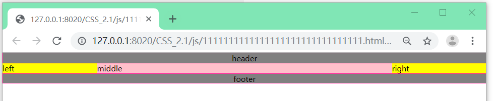
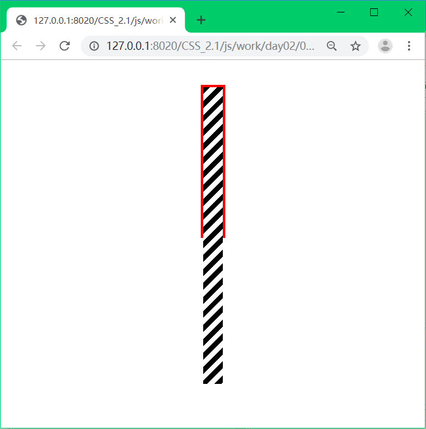
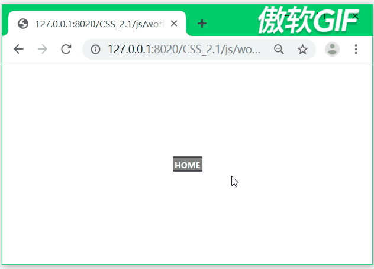
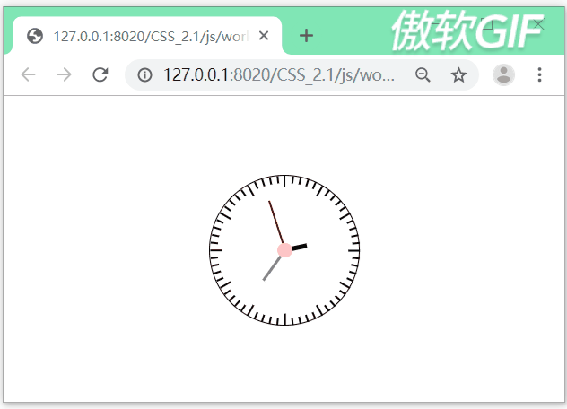
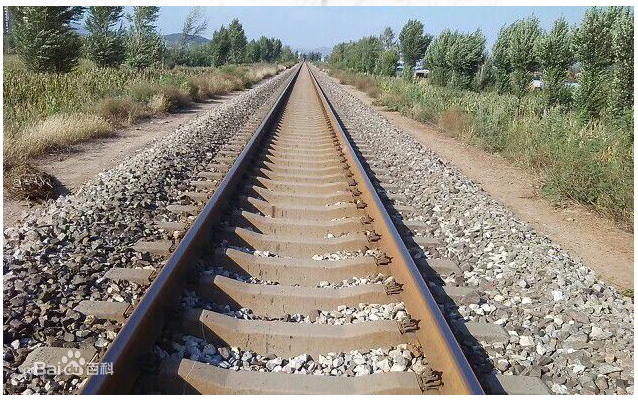
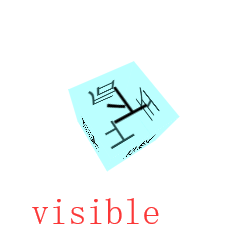
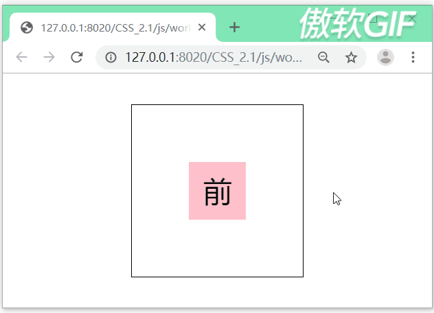
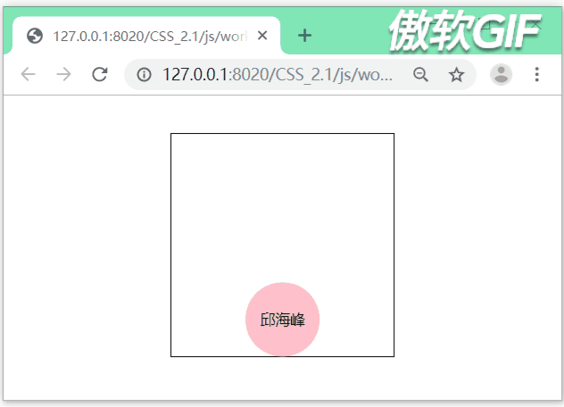

# CSS2.1

@[TOC](目录)

## 定位&盒模型相关

根元素的初始包含块是一个视窗大小(可以理解为是浏览器窗口，即浏览器显示内容的区域)的矩形，但是，这个初始包含块只是大小、位置和视窗相同，根元素的初始包含块并不是视窗。
对于一个非根元素，如果position为relative或没有开启定位，其包含块就是最近的块级的父级元素。至于最后一句话“表单元格...”则不需要看，因为现在大多数是用div进行布局的(而不是用span布局)。
如果一个元素的position是relative或没有开启定位，它的包含块为直接父元素。其从包含块的内边距开始定位，即，从内容区的左上角开始排列。
“如果这个祖先元素是行内元素...”这一段不用看，规则特别复杂，且每个浏览器都有自己的逻辑。
如果一个元素的position是absolute的，即该元素开启了绝对定位，则根据包含块进行定位，其包含块为离它最近的开启了定位的祖先元素。如果这个祖先元素是块级元素，从内边距的边界开始定位。如果一直向上找都没有找到开启了定位的祖先元素，则此时包含块为初始包含块(一个视窗大小的矩形)。

- - -


如图所示↑，test开始绝对定位以后，因为没有其他开启定位的祖先元素，因此应当靠着浏览器窗口的最上角显示，即应该覆盖wrap的位置，但实际上并没有。此时我们加上```left :0; top: 0;```结果如图所示，

此时，test显示的位置就在浏览器窗口的左上角。可知：left和top的默认值并不是0。
实际上，left和top的默认值都是auto；当将left和top的值都改为auto，显示和一开始相同，如下图所示，


- - -
再来看width。


实际上，width的默认值也是auto，margin和padding的默认值为0；此时，inner的宽度加上两边的margin才是父元素的宽度，即，当width为auto时，元素的宽度为父元素的宽度减去其他属性以后的宽度。这个叫boeder-box模型，默认情况下也是这个模型。


当我们将width的值改为100%时，此时，inner元素的width大小就是父元素的width大小。
- - -


margin和padding的百分比，参照的是包含块的width的值，而不是包含块的margin和padding的值。

- - -

- - -

*题外话：学习CSS时，我们都应该要知道每一个重要的属性的默认值是什么、是否可继承。*
*那么怎么查看这些呢？ 可以在MDN上进行查看，[MDN中文官网链接](https://developer.mozilla.org/zh-CN/)*

## 浮动
一个元素的层级可以分为两个，上面的是文字，下面的是布局（当没有浮动时，不用这样考虑，一个元素就是一个元素，没必要分为两层）。
浮动一开始是用来让文字环绕图片的。
我们知道，当我们设置浮动以后，文字是不会被遮住的。
因此，浮动提升的层级只有半个层级。
当没有设置浮动时，如下图所示：

当我们设置浮动以后，如下图所示：

此时，down的背景被up遮盖住，但down的文字并没有。

## 三列布局
### 使用定位实现三列布局
注意：这里的三列布局只是为了讲解知识点，实际开发中并不会用以下的方式进行三列布局！
三列布局的要求：
1、两边固定，中间自适应
2、中间内容要完整显示
3、中间列要优先加载
- - -
```javascript
<!DOCTYPE html>
<html>
	<head>
		<meta charset="UTF-8">
		<title></title>
		<style type="text/css">
			*{
				margin: 0;
				padding: 0;
			}
			div{
				height: 100px;
			}
			#left,#right{
				width: 200px;
				background: pink;
			}
			#middle{
				background: deeppink;
				padding: 0 200px;/* 显示middle中的内容 */ 
			}
			#left{
				position: absolute;
				left: 0;
				top: 0;				
			}
			#right{
				position: absolute;
				right: 0;
				top: 0;
			}
		</style>
	</head>
	<body style="position: relative;">
		<div id="left">left</div>
		<div id="middle">middle</div>
		<div id="right">right</div>
	</body>
</html>
```
此时，有如下问题：

当浏览器缩小后，中间的middle部分会消失。
然后，我们给body设置最小宽度：

```javascript
body{
	/*2*left+right*/
	min-width: 600px;
}
```
此时，会出现滚动条，但是随着浏览器的缩小，中间部分依然会消失，而且会在最右边出现剩余的部分，如图所示：


因此，此时我们虽然设置了body的最小宽度为600px，
但靠的是left中的```left: 0; ```和 right中的```right: 0; ```
（*但是我自己测试的时候发现当浏览器的宽度小到一定程度后，不会出现滚动条人，也无法再变小*）
总之，这种方法是有很大的缺陷的。


### 使用浮动实现三列布局
```javascript
<!DOCTYPE html>
<html>
	<head>
		<meta charset="UTF-8">
		<title></title>
		<style type="text/css">	
			*{
				margin: 0;
				padding: 0;
			}
			body{
				/*2*left+right*/
				min-width: 600px;
			}
			div{
				height: 100px;
			}
			#left,#right{
				width: 200px;
				background: pink;
			}
			#left{
				float: left;
			}
			#right{
				float: right;
			}
			#middle{
				background: deeppink;
			}
		</style>
	</head>
	<body>
		<div id="left">left</div>
		<div id="right">right</div>
		<div id="middle">middle</div>/* 需要在最上边 */
	</body>
</html>
```
此时用浮动实现三列布局，虽然解决了前面使用定位进行布局的缺陷，但是仍然还有缺陷：因为代码是从上往下加载的，因此中间的middle部分是最后才加载的，而中间的部分才是最重要的，所以用户体验很差。因此，```<div id="middle">middle</div>```需要在最上边，但那样就会使布局成为不了三列布局。

### 圣杯布局

```javascript
<!DOCTYPE html>
<html>
	<head>
		<meta charset="UTF-8">
		<title></title>
		<style type="text/css">
			*{
				margin: 0;
				padding: 0;
			}
			#header,#footer{
				height: 20px;
				text-align: center;
				border: 1px solid  deeppink;
				background: gray;
			}
			#content .middle{
				background: pink;
			}
			#content .left{
				width: 200px;
				background: yellow;
			}
			#content .right{
				width: 200px;
				background: yellow;
			}
		</style>
	</head>
	<body>
		<div id="header">header</div>
		<div id="content">
			<div class="middle">middle</div>
			<div class="left">left</div>
			<div class="right">right</div>
		</div>
		<div id="footer">footer</div>
	</body>
</html>
```
此时，结果如下图所示：

left和right上不去，因为middle是块元素，独占一行。
此时，在left和right的样式中都加上```float: left;```
并解决高度塌陷，给content加上clearfix

这时候，left和right就都浮动，结果如下图所示：

注意，此时left的右边界和right的左边界是合在一起的。那么怎么才能让left和right都到middle上呢？
先给middle也加上```float: left;```让middle也浮动，此时left和right就会在middle的字的右边。
然后给middl加上```width: 100%;```宽度变为100%。此时，left和right又到了下面，因为现在三者都是浮动的，且middle的宽度为100%，同一行中容不下left和right（元素是根据外边界一个一个排列的），所以放到下面，但是其实是可以让left和right在middle的位置显示的。
此时，middle和left、right的参照都是content。然后，我们给left加上```margin-left: -100%;```此时，left的左边界和middle的左边界就重合，left到达我们想要的位置。right同理，加上```margin-left: -200px;```
关于margin为负值，可以参照这gif：

此时，结果如下图所示：

注意：此时必须保持left和middle的百分比所指的单位相同，即都是content，否则就不是想要的结果。例如，将middle中的width改为```width: auto;```则布局会错位，结果如下图所示：

此时，还差中间的内容没有显示，如果直接给middle加上```padding: 0 200px;```结果只是布局被破坏，因此我们要的是在width为100%的基础上左右减掉200个像素(left和right的宽度)，而此时middle已经浮动起来了，且width的值已经为100%，再加上内边距200像素的话，自然不是我们要的结果。
因此，我们给content加上内边距：

```			
#content{
	padding: 0 200px;
}
```
此时，结果如下图所示：

然后，我们再让left和right使用定位调整位置即可。
left加上```position: relative; left: -200px;```
right加上```position: relative; right: -200px;```
此时，就是我们最终需要的结果，如下图所示：


- - -
```javascript
/* 圣杯布局完整代码 */
<!DOCTYPE html>
<html>
	<head>
		<meta charset="UTF-8">
		<title></title>
		<style type="text/css">
			*{
				margin: 0;
				padding: 0;
			}
			#content{
				padding: 0 200px;
			}
			#header,#footer{
				height: 20px;
				text-align: center;
				border: 1px solid  deeppink;
				background: gray;
			}
			#content .middle{
				float: left;
				width: 100%;
				background: pink;
			}
			#content .left{
				position: relative;
				left: -200px;
				margin-left: -100%;
				float: left;
				width: 200px;
				background: yellow;
			}
			#content .right{
				position: relative; 
				right: -200px;
				margin-left: -200px;
				float: left;
				width: 200px;
				background: yellow;
			}
			/* 解决高度塌陷 */		
			.clearfix{
				*zoom: 1;
			}
			.clearfix:after{
				content: "";
				display: block;
				clear: both;
			}
		</style>
	</head>
	<body>
		<div id="header">header</div>
		<div id="content" class="clearfix">
			<div class="middle">middle</div>
			<div class="left">left</div>
			<div class="right">right</div>
		</div>
		<div id="footer">footer</div>
	</body>
</html>
```
- - -
**圣杯布局技术总结**：
1、浮动：搭建完整的布局框架
2、margin为负值：调整旁边两列的位置（使三列布局到一行上）
3、使用相对定位：调整旁边两列的位置（使两列位置调整到两头）

### 伪等高布局
前面完成的圣杯布局依然有缺陷，例如，中间部分内容变多以后，两边的内容并不会同时增加，如下图所示：


- - -

```javascript
<!DOCTYPE html>
<html>
	<head>
		<meta charset="UTF-8">
		<title></title>
		<style type="text/css">
			*{
				margin: 0;
				padding: 0;
			}
			#wrap{
				width: 700px;
				border: 1px solid;
				margin: 0 auto;
			}
			#wrap .left{
				float: left;
				width: 200px;
				background: pink;
			}
			#wrap .right{
				float: left;
				width: 500px;
				background: deeppink;
			}
			/* 解决高度塌陷（清除浮动）*/
			.clearfix{
				*zoom: 1;
			}
			.clearfix:after{
				content: "";
				display: block;
				clear: both;
			}
		</style>
	</head>
	<body>
		<div id="wrap" class="clearfix">
			<div class="left">
				left <br />
				left <br />
				left <br />
				left <br />
				left <br />
				left <br />
			</div>
			<div class="right">
				right<br />
				right<br />
				right<br />
				right<br />
				right<br />
				right<br />
				right<br />
				right<br />
				right<br />
				right<br />
				right<br />
				right<br />
				right<br />
				right<br />
			</div>
		</div>
	</body>
</html>
```
我们先完成如下图所示的部分：

此时，我们可以发现左边的部分并不会随着右边内容的增加而变得一样的高度，那么现在让我们来实现这个功能。
首先，为left和right分别加```padding-bottom: 1000px;```
然后，如下图所示：

因此，我们只需要把边界往上提就可以了，因此，为了再表达地清楚一点，把wrap的宽度改为750px;再给left和right分别加```margin-bottom: -1000px;```

所以，给wrap加上```overflow: hidden;```即可，此时效果如下图所示：

到现在为止，并不是真正的等高布局，因为下面的内容只是被隐藏了，且还是用到margin为负值。
此时，也可以发现，margin只是影响元素的边界，并不能影响元素里面的内容，包括正值的margin也只是将盒模型变大，里面的内容还是需要用偏移量进行改动。

- - -
之前我们的圣杯布局就差等高，因此，现在我们只需要进行如下操作即可让页面自动等高：

```javascript
#content{
	overflow: hidden;
}
#content .middl,#content .left,#content .right{
	padding-bottom: 10000px;
	margin-bottom: -10000px;
}
```

### 双飞翼布局
双飞翼布局和圣杯布局的前面几部都是一样的，都是靠浮动搭出基本的架子，然后用margin为负值使left、middle、right在同一行。区别在于怎样让middle的内容显示出来。如下图所示：

此时的代码如下：
```javascript
<!DOCTYPE html>
<html>
	<head>
		<meta charset="UTF-8">
		<title></title>
		<style type="text/css">
			*{
				margin: 0;
				padding: 0;
			}
			/*头部 脚部样式*/
			#header,#footer{
				border: 1px solid;
				background: gray;
				text-align: center;
			}
			/*三列的伪等高布局*/
			#content .middle,#content .left,#content .right{
				padding-bottom:10000px ;
				margin-bottom: -10000px;
				height: 50px;
				line-height: 50px;
				float: left;
			}
			/*双飞翼布局*/
			#content{
				overflow: hidden;
			}
			#content .middle{
				width: 100%;
				background: deeppink;
			}
			#content .left,#content .right{
				background: pink;
				width: 200px;
				text-align: center;
			}
			#content .left{
				margin-left: -100%;
			}
			#content .right{
				margin-left: -200px;
			}
			
		</style>
	</head>
	<body>
		<div id="header">
			<h4>header</h4>
		</div>
		<div id="content">
			<div class="middle">middle</div>
			<div class="left">left</div>
			<div class="right">right</div>
		</div>
		<div id="footer">
			<h4>footer</h4>
		</div>
	</body>
</html>
```

之前说过，直接给圣杯布局的middle加padding会导致left、right的布局被破坏，因此，我们往middle里再加一个div，变为：
```
<div class="middle">
	<div class="m_inner">
		middle
	</div>
</div>
```
此时，给m_inner加padding并不会影响left和right的布局，因此，可以给m_inner加padding：
```
#content .middle .m_inner{
	padding: 0 200px;
}
```
此时，可以发现middle的内容可以显示，如下图所示：

此时，我们只需要再给body加上最小宽度，使其缩小时出现滚动条显示完整内容：

```
body{
	min-width: 600px;
}
```
以下为双飞翼布局完整代码：
```javascript
/* 双飞翼布局完整代码 */
<!DOCTYPE html>
<html>
	<head>
		<meta charset="UTF-8">
		<title></title>
		<style type="text/css">
			*{
				margin: 0;
				padding: 0;
			}
			body{
				min-width: 600px;
			}
			/*头部 脚部样式*/
			#header,#footer{
				border: 1px solid;
				background: gray;
				text-align: center;
			}
			/*三列的伪等高布局*/
			#content .middle,#content .left,#content .right{
				/*padding-bottom:10000px ;
				margin-bottom: -10000px;*/
				height: 50px;
				line-height: 50px;
				float: left;
			}
			/*双飞翼布局*/
			#content{
				overflow: hidden;
			}
			#content .middle{
				width: 100%;
				background: deeppink;
			}
			#content .middle .m_inner{
				padding: 0 200px;
			}
			#content .left,#content .right{
				background: pink;
				width: 200px;
				text-align: center;
			}
			#content .left{
				margin-left: -100%;
			}
			#content .right{
				margin-left: -200px;
			}
		</style>
	</head>
	<body>
		<div id="header">
			<h4>header</h4>
		</div>
		<div id="content">
			<div class="middle">
				<div class="m_inner">
					middle
				</div>
			</div>
			<div class="left">left</div>
			<div class="right">right</div>
		</div>
		<div id="footer">
			<h4>footer</h4>
		</div>
	</body>
</html>
```

- - -
由此可以发现，双飞翼布局并没有使用定位提升层级，而是在middle中再加一个div。
两组实现的对比:
1、俩种布局方式都是把主列放在文档流最前面，使主列优先加载。
2、两种布局方式在实现上也有相同之处，都是让三列浮动，然后通过负外边距形成三列布局。
3、两种布局方式的不同之处在于如何处理中间主列的位置：
&nbsp;&nbsp;&nbsp;&nbsp;&nbsp;&nbsp;&nbsp;&nbsp;&nbsp;&nbsp;圣杯布局是利用父容器的左、右内边距+两个从列的相对定位。
&nbsp;&nbsp;&nbsp;&nbsp;&nbsp;&nbsp;&nbsp;&nbsp;&nbsp;&nbsp;双飞翼布局是把主列嵌套在一个新的父级块中利用主列的左、右外边距进行布局调整。

## 分享
1、要学会翻墙用Google，而不是百度
2、学会用[MDN](https://developer.mozilla.org/zh-CN/)、[奇舞周刊](https://weekly.75team.com/)、[SegmentFault 思否](https://segmentfault.com/)、[掘金](https://juejin.im/)、[17素材网](http://www.17sucai.com/)
3、学会用谷歌插件

## 解决fixed(固定定位)失效问题
fixed可以让元素不随滚动条的滚动而位置改变，但是在IE6中会失效。虽然现在IE6/7/8用的已经比原来少了很多，甚至已经不需要再考虑它们的兼容性，但是里面的知识点还是值得我们研究。
先看如下代码：

此时，html和body都是浏览器窗口大小，且随着浏览器显示大小的改变，html和body也会改变。
注意：如果想要元素是浏览器窗口大小，是需要一层一层继承的。什么意思呢？如果我们去掉html中的```height: 100%;```就会使body不再是浏览器窗口大小，即便body中也有```height: 100%;```，如下图所示：


- - -
一般情况下滚动条是作用在文档(html的上一层)的。
如果在html或body上(其中一个)添加```overflow: scroll;```则滚动条是作用在文档的。但是，如果在html和body上都添加```overflow: scroll;```则body上的滚动条会作用在body上，而html上的滚动条作用在文档上。（上述规则中，滚动条可以替换为任意overflow属性）
如下图所示：


基本上，移动端所有的滚动条都不是像网页中的滚动条一样的，而是一个很细的div，都是自定义的。那么怎么禁止系统的默认滚动条呢？代码如下：

```javascript
/* 禁止系统的默认滚动条 */
html,body{
	height: 100%;
	overflow: hidden;
}
```
什么时候绝对定位和固定定位是不一样的？就是在出现滚动条的时候，拉动滚动条时绝对定位不会跟着滚动条移动。因为绝对定位是根据包含块来定位的，由此，拖动滚动条的时候，而浏览器窗口是不变的，而初始包含块移动，这样绝对定位的元素才会移动。因为初始包含块在最外层，因此，只有拖动文档的滚动条时才会移动初始包含块，而其他元素的滚动条是不能使初始包含块移动的。
因此，我们禁用文档的滚动条，而使用body的滚动条，此时body的滚动条只能影响body中的内容，而不能影响body外的内容，而绝对定位是根据body外的初始包含块来进行定位的，即，body无法影响初始包含块，因而body也无法影响绝对定位。
这样一来，我们没用到任何固定定位的代码，所以可以在IE6中发挥作用。
完整代码如下：
```javascript
<!DOCTYPE html>
<html>
	<head>
		<meta charset="UTF-8">
		<title></title>
		<style type="text/css">
			*{
				margin: 0;
				padding: 0;
			}
			html{/*禁用文档的滚动条*/
				overflow: hidden;
				height: 100%;
			}
			body{/*使用body的滚动条*/
				overflow: auto;
				height: 100%;
			}
			#test{/*用于显示的元素*/
				position: absolute;
				left: 50px;
				top: 50px;
				width: 100px;
				height: 100px;
				background: pink;
			}
		</style>
	</head>
	<body>
		<div id="test"></div>
		<div style="height: 1000px;"></div>
	</body>
</html>
```

## canluse
看一个属性在某个浏览器或浏览器版本中能不能用，不能去查询文档，而应该去canluse.com查询。实际开发中，我们不可能去兼容所有的浏览器，只需要兼容业务中所需要的浏览器即可。

## 复习
	0、svn
	
	1、定位参照于谁块来定位
			没有定位：包含块
			相对定位：元素本来的位置
			绝对定位：包含块
							如果最近的祖先元素中存在定位元素，则这个定位元素就是包含块
							如果没有，包含块为初始包含块
			固定定位：视口
			
	2、什么是初始包含块
					是一个视窗大小的矩形，不等于视窗
	
	3、left top right bottom width height 默认值为 auto
		margin padding 默认值为 0
		boder-width 默认值为 medium（前提要有border-style）
		  
	4、百分比参照于谁
			width margin padding：包含块的width
			height：包含块的height
			left：包含块的width
			top：包含块的height
			
	5、浮动
			浮动提升半层
		
	6、三列布局
			两边固定，当中自适应
			中间列要完整的显示
			中间列要优先加载
		
			定位
			浮动
			圣杯
			双飞翼
		
	7、margin为负值（margin不影响元素的位置）
			负值:将元素的边界往里收
			正值:将元素的边界往外扩
		
	8、伪等高布局
	
	9、fixed
			怎么使用绝对定位来模拟固定定位
					1.禁止系统滚动条
					2.将滚动条加给body
					3.让body的尺寸变为视口的尺寸


## 粘连布局（stickyFooter）
什么是stickyFooter？
 经典的“粘连” footer布局。
 我们有一块内容\<main\>。
 当\<main\>的高度足够长的时候，<footer\>应该紧跟在\<main\>元素的后面。
 当\<main\>元素比较短的时候(比如小于屏幕的高度)，我们期望这个\<footer\>元素能够“粘连”在屏幕的底部。
如图所示：


 实际效果如下图所示：


- - -
先看以下代码：

```javascript
<!DOCTYPE html>
<html>
	<head>
		<meta charset="UTF-8">
		<!-- 以下这个meta用于移动端，暂时先不用管 -->
		<meta name="viewport" content="width=device-width,initial-scale=1.0,user-scalable=no"/>
		<title></title>
		<style type="text/css">
			*{
				margin: 0;
				padding: 0;
			}
			#footer{
				height: 50px;
				line-height: 50px;
				background: deeppink;
				text-align: center;
			}
		</style>
	</head>
	<body>
		<div id="wrap" >
			<div class="main">
				main <br />
				main <br />
				main <br />
			</div>
		</div>
		<div id="footer">
			footer
		</div>
	</body>
</html>
```
效果如下图所示：

此时，内容并没有能让footer到达底部，那么我们怎样让footer在内容不足够多的情况下到达底部呢？这里我们不能使用定位，因为如果这个时候用定位了，那么当内容足够多时就无法只用CSS让footer跟着内容改变位置了。
因此，我们这样：

```javascript
html,body{
	height: 100%;/* 前面说过，想要元素是100%高度，则需要一层一层继承，让html和body的height为100%，才能让wrap的height也可以是100% */
}
#wrap{
	height: 100%;/* 用100%高度的wrap将footer撑下去 */
	background: pink;
}
#footer{
	height: 50px;
	line-height: 50px;
	background: deeppink;
	text-align: center;
	margin-top: -50px;/* footer的高度为50px，用margin让footer在底部，否则会出现滚动条，因为此时的高度是100%+footer的高度 */
}
```
此时，第一个需求实现，即，main中的内容没有到达footer，则footer一直是在底部，如图所示：


但是，如果main中的内容变多时，如下图所示：

此时，footer并没有跟着内容移动，wrap的最小高度应该为视口的高度，因此，我们将wrap的```height: 100%```改为```min-height: 100%```即当内容不够多时，最小高度就应该为视口高度；一旦内容足够多时，main中的内容就可以把wrap撑开，因为此时wrap的最小高度为100%
此时，footer会内容的底部显示(当内容没有到底部时，不会出现footer)，结果如下图所示：

此时，还有部分内容与footer重叠，重叠的内容的高度就是footer的高度，50px
因此，我们给main加个内边距即可：```#wrap .main{ padding-bottom:50px ; }```
其实现在的footer和main的padding-bottom是重叠的，但是对用户的体验不会有影响，结果如下图所示：


- - -
粘连布局的完整代码如下：

```javascript
/* 粘连布局的完整代码 */
<!DOCTYPE html>
<html>
	<head>
		<meta charset="UTF-8">
		<meta name="viewport" content="width=device-width,initial-scale=1.0,user-scalable=no"/>
		<title></title>
		<style type="text/css">
			*{
				margin: 0;
				padding: 0;
			}
			html,body{
				height: 100%;
			}
			#wrap{
				min-height: 100%;
				background: pink;
				text-align: center;
				overflow: hidden;/* 用于清除浮动 */
			}
			#wrap .main{
				padding-bottom:50px ;
			}
			#footer{
				height: 50px;
				line-height: 50px;
				background: deeppink;
				text-align: center;
				margin-top: -50px;
			}
		</style>
	</head>
	<body>
		<div id="wrap" >
			<div class="main">
				main <br />
				main <br />
				main <br />
			</div>
		</div>
		<div id="footer">
			footer
		</div>
	</body>
</html>
```

## BFC
### BFC是什么
    ###在解释 BFC 是什么之前，需要先介绍 Box、Formatting Context 的概念。
    Box：CSS布局的基本单位
    	Box是CSS布局的对象和基本单位，直观点来说，就是一个页面是由很多个Box组成的。
    	元素的类型和display属性，决定了这个Box的类型，不同类型的Box，会参与不同的 Formatting Context（一个决定如何渲染文档的容器），
    	因此Box内的元素会以不同的方式渲染。让我们看看有哪些盒子：
    		block-level box：
    			display属性为block，list-item的元素，会生成block-lovel box。并且参与block fomatting context;
    		inline-level box：
    			display属性为inline，inline-block，inline-table的元素，会生成inline-level box。
    			并且参与inline formatting context
    
    	Formatting Context
    		Formatting Context是W3C CSS2.1规范中的一个概念。
    		它是页面中的一块渲染区域，并且有一套渲染规则，它决定了其子元素将如何定位，以及和其他元素的关系和相互作用。
    		最常见的Formatting Context有 Block Formatting Context（简称BFC）
    								    Inline Formatting context（简称IFC）
    
    ###BFC是什么
    	BFC(Block Formatting Context)直译为"块级格式化上下文"。它是一个独立的渲染区域，只有Block-level box参与，
    	它规定了内部的Block-level Box如何布局，并且与这个区域外部毫不相干。
    	简单来说，BFC是一个容器，用来管理块级元素。
    
    ###BFC布局规则
    	1.内部的Box会在垂直方向，一个接一个地放置。（块级元素独占一行）
    	2.BFC的区域不会与float box重叠。
    	3.内部的Box垂直方向的距离由margin决定。属于同一个BFC的两个相邻的块级的Box的margin会发生重叠。
    	4.计算BFC的高度时，浮动元素也参与计算。（清除浮动 haslayout）
    	5.BFC就是页面上的一个隔离的独立容器，容器里面的子元素不会影响到外面的元素。反之也如此。
    
    ###BFC什么时候出现（哪些元素会生成BFC）
    	根元素（只要是html的子标签，都是BFC的管理）（例如span为什么不受BFC的管理？因为span不是块级元素，BFC只管理块级元素）
    	float属性不为none
    	position为absolute或fixed
    	overflow不为visible
    	display为inline-block，table-cell，table-caption，flex，inline-flex（举个例如，虽然元素可以开启inline-block，但是，BFC是管理这个开启了inline-block的元素里面的块级元素，这个开启inline-block的元素本身并不受BFC管理）

### 两列布局
主要验证BFC布局规则的```2.BFC的区域不会与float box重叠。```
两列布局：左边固定，右边自适应。
先看如下代码：

```javascript
<!DOCTYPE html>
<html>
	<head>
		<meta charset="UTF-8">
		<title></title>
		<style type="text/css">
			*{
				margin: 0;
				padding: 0;
			}
			body{
				min-width: 700px;
			}
			div{
				height: 200px;
			}
			#left{
				width: 200px;
				background: pink;
				float: left;
			}
			#right{
				background: deeppink;
			}
		</style>
	</head>
	<body>
		<div id="left">left</div>
		<div id="right">right</div>
	</body>
</html>
```
结果如下图所示：


但此时，如果我们将left```opacity: 0;```，可以发现结果如下图所示：

因此，这并不是我们所想要的两列布局。
然后，我们再将rigth```overflow: hidden;```，可以发现结果如下图所示：

为什么会这样呢？BFC的第2条规则为：```BFC的区域不会与float box重叠```此时left是个float box，所以，我们只要给right开始BFC，left和right就不会有重叠。
那么怎么样使right开启BFC呢？在“BFC什么时候出现”中有```overflow不为visible```即，只要overflow不为visible，就会开启BFC，当right设置为```overflow: hidden;```时，也就开启了BFC。
要注意的是，此时right受的是根元素的BFC管理；而right开启的BFC是管理right的子元素，并不会管理BFC本身。
- - -
现在，让我们来做一个商品列。
根据以上的讲述，商品列的实现没有什么难度，直接看以下完整的代码：

```javascript
/* 商品列完整代码 */
<!DOCTYPE html>
<html>
	<head>
		<meta charset="UTF-8">
		<title></title>
		<style type="text/css">
			*{
				margin: 0;
				padding: 0;
			}
			#wrap{
				width: 300px;
				border: 1px solid;
				margin: 0 auto;
			}
			#left{
				float: left;
				width: 80px;
				height: 80px;
				/*background: url(img/xfz.png) no-repeat;*/
				background-color: pink;/* 因为使用图片不方便，所以这里用背景颜色 */
				background-position: -50px -50px;
			}
			#des{
				padding-left:10px ;
				/* 以下四条语句可以使文本溢出时用省略号表示 */
				display: block;
				white-space: nowrap;
				text-overflow: ellipsis;
				overflow: hidden;
			}
		</style>
	</head>
	<body>
		<div id="wrap">
			<div id="left"></div>
			<div id="des">
				此产品贱卖  买一送三 此产品贱卖  买一送三此产品贱卖  买一送三 此产品贱卖  买一送三<br />
				此产品贱卖  买一送三 此产品贱卖  买一送三<br />
				此产品贱卖  买一送三 此产品贱卖  买一送三<br />
				此产品贱卖  买一送三 此产品贱卖  买一送三<br />
				此产品贱卖  买一送三 此产品贱卖  买一送三<br />
				此产品贱卖  买一送三 此产品贱卖  买一送三<br />
				此产品贱卖  买一送三 此产品贱卖  买一送三<br />
			</div>
		</div>
	</body>
</html>
```
结果如下图所示：


### margin重叠
主要验证BFC布局规则的```3.内部的Box垂直方向的距离由margin决定。属于同一个BFC的两个相邻的块级的Box的margin会发生重叠。```
先看如下代码：

```javascript
<!DOCTYPE html>
<html>
	<head>
		<meta charset="UTF-8">
		<title></title>
		<style type="text/css">
			*{
				margin: 0;
				padding: 0;
			}
			#up, #down{
				width: 200px;
				height: 200px;
				background: pink;
				margin: 50px;
			}
		</style>
	</head>
	<body>
		<div id="up">up</div>
		<div id="down">down</div>
	</body>
</html>
```
结果如图所示：

可以发现，此时两个div的margin是重叠的。这里可以理解为兄弟元素之间的margin重叠。因为满足```属于同一个BFC的两个相邻的块级的Box的margin会发生重叠。```这里，两个div都是块级元素，并且相邻，都受html的BFC的管理，因此，满足条件。
只需要破坏三个条件中的任意一个，即可让margin不再重叠，方法有很多，这里就不再列举。最简单的就是破坏相邻，在两个div之间加上```<div style="overflow: hidden;">```即可
- - -
以上的margin叠加的第一种形式，接下来来看第二种。这里可以理解为父子元素之间的margin传递。
代码如下：

```javascript
<!DOCTYPE html>
<html>
	<head>
		<meta charset="UTF-8">
		<title></title>
		<style type="text/css">
			*{
				margin: 0;
				padding: 0;
			}
			#wrap{
				width: 300px;
				height: 300px;
				background: deeppink;
				margin: 50px;
			}
			#inner{
				width: 150px;
				height: 150px;
				background: pink;
				margin: 50px;
			}
		</style>
	</head>
	<body>
		<div id="wrap">
			<div id="inner">
				
			</div>
		</div>
	</body>
</html>
```
结果如下图所示：


### 清除浮动（高度塌陷）
主要验证BFC布局规则的```4.计算BFC的高度时，浮动元素也参与计算。（清除浮动 haslayout）```
清除浮动：让浮动的子元素可以撑开父级的高度
先看以下代码：

```javascript
<!DOCTYPE html>
<html>
	<head>
		<meta charset="UTF-8">
		<title></title>
		<style type="text/css">
			*{
				margin: 0;
				padding: 0;
			}
			#wrap{
				border: 1px solid;
			}
			#inner{
				float: left;
				width: 200px;
				height: 200px;
				background: pink;
			}
		</style>
	</head>
	<body>
		<div id="wrap">
			<div id="inner">
			</div>
		</div>
	</body>
</html>
```
此时是高度塌陷的，结果如下图所示：


- - -
用直接给定 高度 或 overflow 的方法清除浮动。
我们可以直接给wrap加上```height: 300px;```或者```overflow: hidden;```这两种都可以解决高度塌陷问题，结果如下图所示：

- - -
用开启BFC的方法清除浮动。
如果给wrap加上```position: absolute;```或者```float: left;```此时结果如下图所示：

即，默认情况下块级元素的宽是父级的100%；但是，浮动盒子、定位盒子的特点：高度、宽度都是由内容撑开。
- - -
用br标签清除浮动，进行如下操作：

在inner下面加上```<br clear="all" />```此时结果如下图所示：

注意：这个方法不是用CSS，br是html的标签

- - -
用空标签清除浮动，进行如下操作：

在inner下面加上```<div style="clear: both;"></div>```此时结果如下图所示：


- - -
用伪元素清除浮动，进行如下操作：
给wrap加上```class="clearfix"```再写样式


（ *zoom:1 中的 * 是hack，在[CSS基础](https://blog.csdn.net/earthOLtainanwan/article/details/97613265)中有提过）
结果如下图所示：

注意：简单来说，IE6/7是没有BFC概念的，想要清除浮动，就必须触发haslayout（详情看[百度百科haslayout](https://baike.baidu.com/item/hasLayout/2682564?fr=aladdin)）。

- - -
总结：
```
###清除浮动
	1.给父级加高度
		扩展性不好
	
	2.开启BFC
		overflow:hidden
		定位
		浮动
		ie 6 7底下不支持BFC
		
	3.br标签
		ie6 不支持
		违反了结构 行为 样式相分离的原则
		
	4.空标签
		违反了结构 行为 样式相分离的原则
			ie6下元素的最小高度为19px
				可以尝试给元素的fontsize设为0--->2px
	
	5.伪元素 + 开启haslayout
		因为ie6 7 下不支持伪元素  
		所以要额外的去开启haslayout
```
## CSS Hack
在[CSS基础](https://blog.csdn.net/earthOLtainanwan/article/details/97613265)中有提过，更详情看[史上最全的CSS hack方式一览](https://blog.csdn.net/earthOLtainanwan/article/details/98850792)
在开发中用的不多，需要用到时再查阅即可。

## 检测IE低版本的函数
需求：传递一个数字，判断当前的IE环境是不是这个版本的IE。例如，```isIE(9);```判断当前是不是IE9。
完整代码如下：

```javascript
<!DOCTYPE html>
<html>
	<head>
		<meta charset="UTF-8">
		<title>自定义检测低版本ie的函数</title>
	</head>
	<body>
		
	</body>
	<script type="text/javascript">
			console.log(isIE(8));
	
			//js中的作用域都是函数作用域
			function isIE(version){
				//b必须在函数内部进行var，这里涉及到左右查询，简单的说明在下面
				var b = document.createElement("b");
				b.innerHTML="<!--[if IE "+version+"]><i></i><![endif]-->";
				return b.getElementsByTagName("i").length == 1 ;
			}
			//巧妙之处: 只有在函数内部才能调用b的innerHTML（b封装在函数作用域内部）

		//伪数组: 具有length属性的js对象
		//console.log(document.body.getElementsByTagName("i").length);
	</script>
</html>
```
因为在```var b = document.createElement("b");```中涉及到左右查询，但这里是讲CSS，所以不深入JS，只简单说明一下原因：如果这一行没有var，而是直接```b = document.createElement("b");```则会一层一层往上寻找，看有没有b的声明，如果没有，则会在全局默认声明一个b，此时b是全局的，因此函数外部的操作就会影响函数内部的b；而现在是在函数内部声明的b，因此不会在全局再声明，所以外部对b的操作不会影响函数内部的b。

## 水平垂直居中
现在为止，有很多的方案可以实现垂直水平居中，但每一个方案都有自己的局限，并没有一个完美的解决方案。
### 水平居中
看以下代码：

```javascript
<!DOCTYPE html>
<html>
	<head>
		<meta charset="UTF-8">
		<title></title>
		<style type="text/css">
			*{
				margin: 0;
				padding: 0;
			}
			#test{
				width: 200px;
				height: 200px;
				line-height: 200px;/* 文字垂直居中 */
				background: pink;
				margin: 0 auto;/* 相当于margin: auto; */
				text-align: center;/* 文字水平居中 */
			}
		</style>
	</head>
	<body>
		<div id="test">
			test
		</div>
	</body>
</html>
```
结果如下图所示：

可以发现，让文字居中是很容易实现的，让元素水平居中也很容易实现。
要注意的是：```margin: auto; /* 该盒子是水平居中的，上下边距为0 */```（正常盒子）

### 元素的水平垂直居中
看以下代码：

```javascript
<!DOCTYPE html>
<html>
	<head>
		<meta charset="UTF-8">
		<title></title>
		<style type="text/css">
			*{
				margin: 0;
				padding: 0;
			}
			#wrap{
				position: relative;
				width: 400px;
				height: 600px;
				background: pink;
				margin: 0 auto;
			}
			#inner{
				position: absolute;
				left: 50%;/* 参照wrap的width */
				top: 50%;/* 参照wrap的height */
				width: 100px;
				height: 100px;
				background: deeppink;
			}
		</style>
	</head>
	<body>
		<div id="wrap">
			<div id="inner">
					test
			</div>
		</div>
	</body>
</html>
```
结果为：

可以发现，此时里面的盒子还需要再往左、往上分别半个自身。
因此，给inner添加```margin-left: -50px; margin-top: -50px;```此时，inner垂直水平居中了，结果如下图所示：

因此，这个是 已知元素尺寸的水平垂直居中方案。

- - -
再来看一种已知元素尺寸的水平垂直居中方案。
先看一下代码

```javascript
<!DOCTYPE html>
<html>
	<head>
		<meta charset="UTF-8">
		<title></title>
		<style type="text/css">
			*{
				margin: 0;
				padding: 0;
			}
			#wrap{
				position: relative;
				width: 400px;
				height: 600px;
				background: pink;
				margin: 0 auto;
			}
			#inner{
				position: absolute;/* 开启绝对定位 */
				left: 0;
				right: 0;
				top: 0;
				bottom: 0;
				margin: auto;
				width: 100px; 
				height: 100px;
				background: deeppink;
			}
		</style>
	</head>
	<body>
		<div id="wrap">
			<div id="inner">
					test<br />
			</div>
		</div>
	</body>
</html>
```
此时inner是垂直水平居中的。
先总结一下该方法：1、开启绝对定位。2、四个偏移量都为0。3、margin为auto。4、不要忘记指定元素的width和height。
需要注意的是：
```
绝对定位盒子的特性：（以以上代码为例）
高宽有内容撑开
水平方向上：   left + right + width + padding + margin = 包含块padding区域的尺寸
				0      0      100       0       auto          400
垂直方向上：   top + bottom + height + padding + margin = 包含块padding区域的尺寸
				0      0      100       0       auto          600
```
此时，在inner中，只有margin是auto的，所以包含块padding区域的尺寸就会将剩余的区域分配margin，所以就会垂直水平居中。
如果不写```margin: auto;```则margin默认为0，此时，5个属性都是固定值，包含块padding区域的尺寸无法分配给margin。结果如下图所示：

如果不写```width: 100px;```和```height: 100px;```则width和height默认为auto，此时，在上述式子中就会有两个auto，包含块padding区域的尺寸优先分配给width和height而不是margin。结果如下图所示：

- - -
再来看一种未知元素尺寸的水平垂直居中方案。
此时，元素没有高和宽，完全是靠内容撑开的。
先看以下代码：

```javascript
<!DOCTYPE html>
<html>
	<head>
		<meta charset="UTF-8">
		<title></title>
		<style type="text/css">
			*{
				margin: 0;
				padding: 0;
			}
			#wrap{
				position: relative;
				width: 400px;
				height: 600px;
				background: pink;
				margin: 0 auto;
			}
			#inner{
				position: absolute;
				left: 50%;
				top: 50%;
				background: deeppink;
			}
		</style>
	</head>
	<body>
		<div id="wrap">
			<div id="inner">
					testtesttesttesttesttesttest<br />
					testtesttesttesttesttesttest<br />
					testtesttesttesttesttesttest<br />
					testtesttesttesttesttesttest<br />
					testtesttesttesttesttesttest<br />
					testtesttesttesttesttesttest<br />
			</div>
		</div>
	</body>
</html>
```
结果如下图所示：

此时，和已知元素尺寸的第一个方案相同，但是，现在的元素完全由内容撑开，我们怎么才能使其向上、向左移动元素自身的一半呢？
我们向inner中添加```transform: translate3d(-50%,-50%,0);```即可。此时，元素是水平垂直居中显示的。这个API我们还没有学到，所以不深入展开。顺便一提，transform有很大的兼容性问题。

## 字体
### font-size
```
font-size CSS 属性指定字体的大小。该属性的值会被用于计算em长度单位
 
默认值 ：medium（chrome下为16px）；可继承
 
值： （这一块的取值其实有很多种形式，但为了不困扰大家，建议暂时关注三种）
    px   
    em   ：em值的大小是动态的。当定义font-size属性时，1em等于元素的父元素的字体大小
    %    ：参照父元素的字体大小
```

看以下代码：

```javascript
<!DOCTYPE html>
<html>
	<head>
		<meta charset="UTF-8">
		<title></title>
	</head>
	<body>
		<div style="font-size: 30px;">
			迪丽热巴
		</div>
	</body>
</html>
```
此时，我们指定字体大小为30px，但是实际上并非如此，如下图所示：

为什么会这样呢？实际上，39.47是行高（这里有偏差）。如果我们设置行高以后，如下图所示：

另外，在Chrome中，font-size默认为16px，最小为12px，如果设为负数，则显示为默认16px，如果设为0则会消失。

如果```font-size: 2em;```则字体为32px，因为在Chrome中字体默认大小为16px，1em=1个单位的字体大小，2em就是32px。
至于%，则要参照父元素具体的字体大小。

### font-style
```
font-style 属性允许你选择 font-family 字体下的 italic 或 oblique 样式。 
Italic 样式一般是指书写体，相比无样式的字体，通常会占用较少的高度，而 oblique 字形一般只是常规字形的倾斜版本
 
默认值：normal；可继承
 
 
值
normal
    选择 font-family 的常规字体。
italic
    选择斜体，如果当前字体没有可用的斜体版本，会选用倾斜体（oblique ）替代。
oblique
    选择倾斜体，如果当前字体没有可用的倾斜体版本，会选用斜体（ italic ）替代。
```
italic 和 oblique 让字体倾斜的机制是不同的，但是不需要太深入，了解就行。
其他就没有太多可以说的。

### font-weight
```
font-weight属性指定了字体的粗细程度。 一些字体只提供 normal 和 bold 两种值。
默认值： normal；可继承
 
值
    normal
       正常粗细。与400等值。
    bold
       加粗。 与700等值。
    lighter
       比从父元素继承来的值更细
    bolder
       比从父元素继承来的值更粗
    100(Thin 或者 Hairline), 200, 300, 400, 500, 600, 700, 800, 900
       数值化的规定字体粗细成都的方式，提供了除了 normal 和 bold 之外更多的值。
 
回退机制
    如果一个字体只有 normal 和 bold 两种粗细值选择，指定粗细值为 100-500 时，实际渲染时将使用 normal，指定粗细值为 600-900 时，实际渲染时将使用 bold
 
相对粗细值的解析
    当指定的是相对粗细值 lighter 或 bolder 时，将使用如下图表来决定元素渲染时的绝对粗细值（前提是字体分9个等级）：
继承值（Inherited value）      bolder   lighter
 100                           400       100
 200                           400       100
 300                           400       100
 400                           700       100
 500                           700       100
 600                           900       400
 700                           900       400
 800                           900       700
 900                           900       700 
 
插值规律
    font-weight 数值采取离散式定义（使用 100 的整倍数）。数值为实数，非 100 的整数倍的值将被四舍五入转换为 100 的整倍数，遇到 *50 时，将向上转换，如 150 将转换为 200 
```
需要注意的是：并不是每种字体都会提供9个等级。
另外，操作系统是有自带的字体的，如果网页上的字体并不存在与你的操作系统的所有字体中，则会使用操作系统默认的字体。

### font-family
```
CCS属性font-family允许您通过给定一个有先后顺序的，由字体名或者字体族名组成的列表来为选定的元素设置字体。 属性的值用逗号隔开。浏览器会选择列表中第一个该计算机上有安装的字体。
（并不能保证网页中使用的某种字体在用户的操作系统中一定存在，因此可以理解为备用字体。）
 
默认值 ：depends on user agent  可继承
 
取值
<family-name>
       一个字体的名字。例如"Times" 和 "Helvetica" 都是字体名。字体名可以包含空格，但包含空格时应该用引号。
<generic-name>
       通用字体族名是一种备选机制，用于在指定的字体不可用时给出较好的字体。通用字体族名都是关键字，所以不可以加引号。 在列表的末尾应该至少有一个通用字体族名。 以下是该属性可能的取值以及他们的定义。
       serif
           带衬线字体，笔画结尾有特殊的装饰线或衬线。
           例如： Lucida Bright, Lucida Fax, Palatino, "Palatino Linotype", Palladio, "URW Palladio", serif. 
  
       sans-serif
           无衬线字体，即笔画结尾是平滑的字体。
           例如， "Open Sans", "Fira Sans", "Lucida Sans", "Lucida Sans Unicode", "Trebuchet MS", "Liberation Sans", "Nimbus Sans L", sans-serif.
 
       monospace
           等宽字体，即字体中每个字宽度相同。
           例如， "Fira Mono", "DejaVu Sans Mono", Menlo, Consolas, "Liberation Mono", Monaco, "Lucida Console", monospace.
 
       cursive
           草书字体。这种字体有的有连笔，有的还有特殊的斜体效果。因为一般这种字体都有一点连笔效果，所以会给人一种手写的感觉。
           例如， "Brush Script MT", "Brush Script Std", "Lucida Calligraphy", "Lucida Handwriting", "Apple Chancery", cursive.
 
       fantasy
           Fantasy字体主要是那些具有特殊艺术效果的字体。
           E.g. Papyrus, Herculanum, Party LET, Curlz MT, Harrington, fantasy. 


示例
       h1 {font-family: arial, verdana, sans-serif;}
       h1标题将采用Arial字体显示。如果访问者的计算机未安装Arial，那么就使用Verdana字体。假如Verdana字体也没安装的话，那么将采用一个属于sans-serif族类的字体来显示这个h1标题。
```

### 字体简写属性
```
font简写：
        在使用 CSS font 简写属性时有几条注意事项。如果不符合这些情况，该属性将无效并被完全忽略。
       1.除了使用关键字的情况之外，该属性必须同时设置 font-size 和 font-family 属性值。
       2.属性值的顺序并非完全自由：如需设置 font-style 和 font-weight 中任意一个，它们必须要放在 font-size 值的前面。 line-height 值必须紧跟在 font-size 之后，并且要在属性值前面加上 / 。最后， font-family 是必不可少的，且必须放在最后
 
 
推荐形式：
       font: font-style  font-weight  font-size/line-height  font-family
       （font-style和font-weight的位置可以调换）
```
在实际项目开发中，如果是多人合作的，最好不要用简写属性，因为别人可能不知道是需要按顺序写的，维护起来比较麻烦。

## 文本
### 行高


- - -
看以下代码：
```javascript
<div style="background-color:deeppink;">
    <span style="font-size:30px;background-color:pink;">中文English中文English中文English中文English</span>
</div>
```
结果为：

此时，内容区、行内框、行框都有，但是是最外层的行框撑开div的高度的。
此时，我们并没有指定行高，虽然指定的字体大小为30px，但是实际上，粉色的区域高度最终的渲染为40px。（这里就不再讲述验证过程，直接讲述结果。）整个内容区的高度现在为40px，虽然规范中说内容区由字体大小确定，但是，在实际中，浏览器会默认在内容区的上边和下边都加一些空间。现在，内容只有一行，内容区、行内框、行框、div的高度都为40px。

- - -
```
<div style="background-color:deeppink;">
     <span style="font-size:30px;background-color:pink;">中文English中文English中文English中文English</span>
</div>
```
现在，把行高设为20px，结果如下图所示：


此时，内容区的大小，即粉色部分为40px。深红色部分为26px（这个不用管，渲染比较复杂）。粉色部分相对于深红色部分所多出来的，不是平均分配的，即上下不对称。

- - -
```
<div style="background-color:deeppink; margin-top:50px ;">
    <span style="font-size:30px;background-color:pink;line-height:1;">中文English</span>
</div>
```
然后，我们再将行高改为50px。结果如下图所示：

这时候，粉色部分相对于深红色部分所多出来的，是平均分配的，都为5px。

- - -
在前端开发中，如果要处理大量的文本，建议把行高设置得要比字体大（1.5倍左右）。此时，行高超出字体部分，会被平均分配到上下两边。（这样显示的字比较好看）
例如下图所示，行与行之间太过紧密。


- - -
```
line-height：
    对于代替元素，line-height没有影响
    对于非代替元素，line-height才有影响
       对于块级元素，css属性line-height指定了元素内部line-box的最小高度
       对于行内元素，line-height用于计算line-box的高度   
 
默认值： normal  可继承
 
值：
    normal
       取决于用户代理。桌面浏览器（包括火狐浏览器）使用默认值，约为1.2
    <number>
       该属性的应用值是这个无单位数字<number>乘以该元素的字体大小。计算值与指定值相同。
       大多数情况下，使用这种方法设置line-height是首选方法，在继承情况下不会有异常的值。
    <length>
       指定<length>  用于计算 line box 的高度。
    <percentage>
       与元素自身的字体大小有关。计算值是给定的百分比值乘以元素计算出的字体大小。 
行高继承的怪癖
           父级行高使用的是百分比的话，子级继承的是父级百分比计算过后的值
           父级行高使用的是number因子的话，子级直接继承的是父级的number因子
```
一般都会在全局初始化工作时将行高设为1（字体大小的1倍），然后再根据设计图一个一个调到具体的像素大小。
#### 行高的继承

此时，inner的行高会继承wrap的行高，为80px。

- - -


此时，wrap的行高的100%为字体大小30px的100%，也为30px，然后，inner再继承wrap的30px的行高，所以inner的行高也为30px。

即使给inner指定了字体大小，inner的行高还是继承的是wrap中已经计算完的行高值，即30px。

- - -

inner的值为20px。此时inner并不是继承wrap中计算完的行高值，而是直接继承行高因子1，这时候就会计算inner自身的字体大小，20px × 1 = 20px。

- - -
因此，我们往往会一开始在初始化的时候添加```body{ line-height: 1; }```这样，所有元素的行高就会直接以自身的字体大小计算。然后，再把有大量文本的元素行高设为1.5：```body{ line-height: 1.5; }```让字显示更加好看。
- - -
对行高最频繁的使用就是使单行的文本垂直居中。
只需要将行高设置为height的值即可。
例如，
```
<div style="height: 200px;line-height: 200px;background: pink;">
	迪丽热巴
</div>
```
结果如下图所示：


### 文本其他属性
**color：**
改变前景色。
- - -
**text-align：**
改变文本显示的位置，只对内联元素和行内元素有效。
- - -
**text-indent：**
首行缩进，一般为2em。
- - -
**text-decoration：**
用来画下划线。
- - -
**letter-spacing：**
字母与字母之间的间距。
- - -
**word-spacing：**
单词与单词之间的间距，用空格区分单词。
- - -
**white-space：**
控制文本换不换行。中文字在一行显示不下时会自动换行；但是对于英文，即使有几十个字母，如果没有空格则会认为是一个单词，因此不会自动换行。```white-space：nowrap;```可以取消自动换行。

## vertical-align
在之前的行框中有一句话：```一行上垂直对齐时以行高值最大的行内框为基准，其他行内框采用自己的对齐方式向基准对齐，最终计算行框的高度```
```
vertical-align 用来指定inline-block的垂直对齐方式。
ps:我们经常会在img（替换元素）上使用vertical-align属性
默认值：baseline ； 不可继承
 
值
    大部分取值是相对于父元素来说的：
       baseline
           元素基线与父元素的基线对齐。
           对于一些 可替换元素，比如 <textarea> ，HTML标准没有说明它的基线，这意味着对其使用这个关键字，
           各浏览器表现可能不一样。一般情况下如果元素没有基线baseline，则以它的外边距的下边缘为基线。
       text-top
           元素顶端与父元素字体的顶端对齐。
       text-bottom
           元素底端与父元素字体的底端对齐。
       middle
           元素中线与父元素的小写x中线对齐。
       sub
           元素基线与父元素的下标基线对齐。（使元素的基线相对于基准基线下降，下降的幅度有浏览器厂商决定）
       super
           元素基线与父元素的上标基线对齐。（使元素的基线相对于基准基线升高，升高的幅度有浏览器厂商决定）
       <length>
           元素基线超过父元素的基线指定高度。可以取负值。
       <percentage>
           同 <length> , 百分比相对于 line-height 。
    以下两个值是相对于整行来说的：
       top
           元素及其后代的顶端与整行的顶端对齐。
       bottom
           元素及其后代的底端与整行的底端对齐。
```

- - -
看以下代码：
```
<div style="background-color:deeppink; margin-top:50px ;">
    <span style="font-size:30px;background-color:pink;line-height:1.5;vertical-align: bottom;">中文English</span>
    <span style="font-size:40px;background-color:pink;line-height:1.5;">中文English</span>
    <span style="font-size:50px;background-color:pink;line-height:3;">中文English</span>
</div>
```
注意第一个span的vertical-align，此时结果如下图所示：

然后，我们将第一个span的vertical-align值改为middle，此时结果如下图所示：

再将第一个span的vertical-align值改为top，此时结果如下图所示：


- - -
我们经常会有需求是让图片水平垂直居中。
先看以下代码：
```javascript
<!DOCTYPE html>
<html>
	<head>
		<meta charset="UTF-8">
		<title></title>
		<style type="text/css">
			*{
				margin: 0;
				padding: 0;
			}
			#wrap{
				height: 400px;
				width: 400px;
				border: 1px solid ;
				margin: 0 auto;
				text-align: center;
			}
		</style>
	</head>
	<body>
		<div id="wrap">
			
		</div>
	</body>
</html>
```
此时，图片水平居中，结果如下图所示：

那么我们怎样让图片垂直居中呢？
我们给img加上```#wrap img{ vertical-align: middle; }```发现这并不能使图片垂直居中，因此此时框中只有图片这一个元素，一个人是无法对其的。
然后，我们添加一个伪元素：

```
#wrap:after{
	content: "";
	display: inline-block;/* 设为inline-block才能使图片和线排在一行 */
	height: 100%;/* 使线是100%高度的 */
	width: 2px;/* 本来是0px，为了能看见这条线，所以这里才先设置为2px */
	background: pink;
}
```
此时，可以看到结果如下图所示：

此时，图片就可以向这条线对齐了。
然后，再向伪类中加```vertical-align: middle;```此时，图片就可以垂直居中显示，如下图所示：

完整代码如下：

```javascript
<!DOCTYPE html>
<html>
	<head>
		<meta charset="UTF-8">
		<title></title>
		<style type="text/css">
			*{
				margin: 0;
				padding: 0;
			}
			#wrap{
				height: 400px;
				width: 400px;
				border: 1px solid ;
				margin: 0 auto;
				text-align: center;
			}
			#wrap:after{
				content: "";
				display: inline-block;
				height: 100%;
				width: 2px;
				background: pink;
				vertical-align: middle;
			}
			#wrap img{
				vertical-align: middle;
			}
		</style>
	</head>
	<body>
		<div id="wrap">
			
		</div>
	</body>
</html>
```

然后再将线的width改为0px，使线不可见即可。
这种方法只能适用于img、input这种占位元素(即不设高宽自身也本来就有尺寸大小)。


# CSS3

## 什么是CSS3
```
CSS3 是级联样式表 / 层叠样式表(Cascading Style Sheets)语言的最新进化，旨在扩展CSS2.1。
    狭义上，我们可以认为css3是所有级别为3的css特性的集合
    广义上，我们应该认为css3是css2.0后出现的所有css相关特性的集合
 
   CSS Level 2 经历了 9 年的时间(从 2002 年 8 月到 2011 年 6 月)才达到 Recommendation(推荐) 状态。
   主要的原因是被一些 secondary features(次要特性) 拖了后腿。
   为了加快那些已经确认为没有问题的特性的标准化速度， W3C 的 CSS Working Group(CSS 工作组)  作出了一项决定， 将 CSS 划分为许多小组件， 称之为 模块 。
   这些模块彼此独立， 按照各自的进度来进行/列标准化。
   其中一些已经是 W3C Recommendation 状态，也有一些还仅仅是 early Working Drafts(早期工作草案)。 
   当新需求被确认后， 新的模块也同样被添加进来。
 
再也没有css规范，只存在css模块及其模块级别
    (https://www.w3.org/Style/CSS/current-work)
    1、如果模块在 CSS 2.1 就有相关的内容，那么这些模块就从 level 3 开始。
    2、如果是完全新的属性（比如 Flexbox），就直接从 level 1 开始。
    3、一个模块的级别和它所在 CSS 的版本无关，即不管它是 CSS 2.1 的内容还是完全新的属性。   
    4、可能会看到类似 css4-backgrounds 这样的写法，
        其实代表的是 CSS Background & Borders Level 4，
         即4表示的是模块的等级。
         
CSS Working Group(CSS 工作组)
    W3C（World Wide Web Consortium，万维网联盟）实际上并不制定标准。
    对于 W3C 旗下的各个工作组（Working Groups, WG）来说，W3C 更像是一个论坛，聚集各种兴趣团体并让他们为某个标准而努力。
    当然，W3C 并不只是作为整个论坛的观察者：它制定整个论坛的基本规则并观察标准制定的整个流程。
 
一份css标准要经历的一些流程 
    标准不是凭空捏造的，制定标准也不是闭门造车。CSS WG 所有的提交都是透明的，所有的交流都是对公众开放的
    （https://lists.w3.org/Archives/Public/www-style/）
    标准确定一般有6个阶段，其中两个是过渡阶段：
       （https://www.w3.org/2005/10/Process-20051014/tr#maturity-levels）
       1.编辑草案 Editor's Draft (ED)
	       这个是规范的开始阶段，一个CSS属性或者选择器被提出来，并在CSSWG内部研究。
	       如果小组成员同意这个属性可以正式推出，它就能进入下一阶段。
	       对于处于这一阶段的规范，不附加任何必要条件，也不保证会被 WG 批准。
	       此外，这也是修改版的第一个阶段：所有的修改内容首先要经过 ED，然后才能被发布。
       2、工作草案 Working Draft (WD)
	       编辑草案后是工作草案，标准的设计阶段。
	       小组反复处理来自 CSSWG 内部和来自小组外部的反馈，这个阶段有两个结果：
	       一是可能会因为技术困难或者可能会引起其他问题而使新属性被完全拒绝；
	       二是规范会通过这个阶段，并会作为第一次公开工作草案（ First Public Working Draft (FPWD)）发布，
	         后面还会有数个工作草案，会处理来自 CSSWG 内部和小组外部更广泛社会的反馈。
       3、最后通告工作草案 – Last Call Working Draft (LCWD)过渡阶段
	       这是第一个过渡阶段，当规范开始考虑从工作草案进入到下一个阶段时，
	         将会对新属性的一些小改动的反馈设置一个截止日期，
	           LCWD 即是日期截至后最后的一次公开草案处理。
       4. 候选推荐标准 Candidate Recommendation (CR)
	       规范会在这个阶段通过完整的测试，测试人员来自 CSSWG 以及被选为实现这个规范的浏览器生产商(Chrome, Safari, Firefox, Opera, 等等)。
	         为了继续进入下一阶段，CSSWG 会推出两个正确的实现规范。
       5. 建议推荐标准– Proposed Recommendations (PR)过渡阶段
	       当到达这个阶段，W3C全球资源小组：W3C咨询委员会（W3C Advisory Committee），
	         决定这个规范是否会继续进入下一个阶段。
	           这个阶段一般很少有异议出现，所以也是一个过渡阶段而已。
        6.推荐标准 Recommendation (REC)
	       如果规范到达这个阶段，说明规范已经考虑完备并可以让浏览器商实现，
	         W3C 和 CSSWG 对这个规范的讨论处理不再活跃，只做一些必要的维护。
 
标准（规范）什么时候是稳定的
    规范的稳定性基本和它所在的流程阶段没有关系。
      当规范特性已经开始传播开来，并因为向后兼容性不能改变时，它才是稳定的，
        这个阶段可能会在 ED 规范阶段或者 CR 阶段，这才是稳定性评判的正确方法，
          而不是 W3C 的标准发布流程。
 
浏览器前缀
    有些 CSS 模块已经十分稳定并满足了 CSSWG 规定的三个推荐级别之一：
      Candidate Recommendation(候选推荐)， 
      Proposed Recommendation(建议推荐) 
      Recommendation(推荐)。 
    这表明这些模块已经十分稳定，使用时也不必添加前缀， 但是一些特性还是有可能在 Candidate Recommendation 阶段被放弃。
 
总结
    级联样式表(CSS)再也没有传统意义上的版本了;
      相反，它有级别。每个级别的CSS都建立在以前的、细化的定义和添加特性上。
        每个高级级别的特性集都是任何较低级别的超集，
          因此，符合更高级别CSS的用户代理也符合所有较低的级别。
```
## 选择器
CSS3选择器规范地址：https://www.w3.org/TR/2011/REC-css3-selectors-20110929/
CSS3最新选择器规范：https://www.w3.org/TR/selectors 
这一章的很多内容在[CSS基础](https://blog.csdn.net/earthOLtainanwan/article/details/97613265)中讲过，这里就不详细展开了。
可以在[CSS Diner](https://blog.csdn.net/earthOLtainanwan/article/details/97613637)进行选择器练习。
### 基本选择器及其扩展
```javascript
1.基本选择器
	/*通配符选择器*/	* { margin: 0; padding: 0; border: none; }
	/*元素选择器*/	body { background: #eee; }
	/*类选择器*/		.list { list-style: square; }
	/*ID选择器*/		#list { width: 500px; margin: 0 auto; }
	/*后代选择器*/	.list li { margin-top: 10px; background: #abcdef; }
	

2.基本选择器扩展
	/*子元素选择器*/	#wrap > .inner {color: pink;}
				也可称为直接后代选择器,此类选择器只能匹配到直接后代，不能匹配到深层次的后代元素
	/*相邻兄弟选择器*/#wrap #first + .inner {color: #f00;}
				它只会匹配紧跟着的兄弟元素
	/*通用兄弟选择器*/#wrap #first ~ div { border: 1px solid;}
				它会匹配所有的兄弟元素(不需要紧跟)
	/*选择器分组*/	h1,h2,h3{color: pink;}  
				此处的逗号我们称之为结合符
```

### 属性选择器
```javascript
/*存在和值属性选择器*/	
	[attr]：该选择器选择包含 attr 属性的所有元素，不论 attr 的值为何。
	[attr=val]：该选择器仅选择 attr 属性被赋值为 val 的所有元素。
	[attr~=val]：表示带有以 attr 命名的属性的元素，并且该属性是一个以空格作为分隔的值列表，其中至少一个值为val。

/*子串值属性选择器*/
	 [attr|=val] : 选择attr属性的值是val（包括val）或以val-开头的元素。
	 [attr^=val] : 选择attr属性的值以val开头（包括val）的元素。
	 [attr$=val] : 选择attr属性的值以val结尾（包括val）的元素。
	 [attr*=val] : 选择attr属性的值中包含字符串val的元素。
```
### 伪类与伪元素选择器
```javascript
/*链接伪类*/		注意:link，:visited，:target是作用于链接元素的！
		:link		表示作为超链接，并指向一个未访问的地址的所有锚
		:visited	表示作为超链接，并指向一个已访问的地址的所有锚
		:target 	代表一个特殊的元素，它的id是URI的片段标识符
/*动态伪类*/		注意:hover，:active基本可以作用于所有的元素！
		:hover		表示悬浮到元素上
		:active		表示匹配被用户激活的元素（点击按住时）
		
		由于a标签的:link和:visited可以覆盖了所有a标签的状态，所以当:link，:visited，:hover，:active同时出现在a标签
		身上时 :link和:visited不能放在最后！！！
		
		隐私与:visited选择器
			只有下列的属性才能被应用到已访问链接：
				color
				background-color
				border-color
/*表单相关伪类*/
		:enabled	匹配可编辑的表单
		:disable	匹配被禁用的表单
		:checked	匹配被选中的表单
		:focus		匹配获焦的表单
		
/*结构性伪类*/
		index的值从1开始计数！！！！
		index可以为变量n(只能是n)
		index可以为even odd
			#wrap ele:nth-child(index)		表示匹配#wrap中第index的子元素 这个子元素必须是ele
			#wrap ele:nth-of-type(index)	表示匹配#wrap中第index的ele子元素
			除此之外:nth-child和:nth-of-type有一个很重要的区别！！
					nth-of-type以元素为中心！！！即，每种元素的第n个都会被选中
					
		:nth-child(index)系列			
			:first-child
			:last-child
			:nth-last-child(index)
			:only-child	(相对于:first-child:last-child 或者 :nth-child(1):nth-last-child(1))
		:nth-of-type(index)系列
			:first-of-type
			:last-of-type
			:nth-last-type(index)
			:only-of-type	(相对于:first-of-type:last-of-type 或者 :nth-of-type(1):nth-last-of-type(1))
			
		:not		
		:empty(内容必须是空的，有空格都不行，有attr没关系)
/*伪元素*/
		::after
		::before
		::firstLetter
		::firstLine
		::selection
```

### css声明的优先级
```javascript
选择器的特殊性
			选择器的特殊性由选择器本身的组件确定，特殊性值表述为4个部分，如    0,0,0,0
			一个选择器的具体特殊性如下确定：
			       1.对于选择器中给定的ID属性值，加 0,1,0,0
			       2.对于选择器中给定的各个类属性，属性选择，或伪类，加 0,0,1,0
			       3.对于选择器中的给定的各个元素和伪元素，加0,0,0,1
			       4.通配符选择器的特殊性为0,0,0,0
			       5.结合符对选择器特殊性没有一点贡献
			       6.内联声明的特殊性都是1,0,0,0
			       7.继承没有特殊性
 
				特殊性 1,0,0,0 大于所有以0开头的特殊性(不进位)
				选择器的特殊性最终都会授予给其对应的声明
				如果多个规则与同一个元素匹配，而且有些声明互相冲突时，特殊性越大的越占优势
 
				注意：id选择器和属性选择器
				      div[id="test"]（0,0,1,1） 和 #test（0,1,0,0）   
		重要声明
			有时某个声明比较重要，超过了所有其他声明，css2.1就称之为重要声明
			并允许在这些声明的结束分号之前插入  !important  来标志
			必须要准确的放置  !important 否则声明无效。 
			!important 总是要放在声明的最后，即分号的前面
			 
			 标志为 !important的声明并没有特殊的特殊性值，不过要与非重要声明分开考虑。
			 实际上所有的重要声明会被浏览器分为一组，重要声明的冲突会在其内部解决
			 非重要声明也会被分为一组，非重要声明的冲突也会在其内部解决
			 如果一个重要声明与非重要声明冲突，胜出的总是重要声明
		继承
			继承没有特殊性，甚至连0特殊性都没有
			0特殊性要比无特殊性来的强
		来源
			css样式的来源大致有三种
			  创作人员
			  读者
			  用户代理   
			 
			权重（权重由上到下依次减小）：
			   读者的重要声明
			   创作人员的重要声明
			   创作人员的正常声明
			   读者的正常声明
			   用户代理的声明
		层叠
			1.找出所有相关的规则，这些规则都包含一个选择器
		    2.计算声明的优先级
		               先按来源排序
		               在按选择器的特殊性排序
		               最终按顺序（下面的代码会覆盖上面的）
```

## 自定义字体&字体图标

如上图所示，淘宝网页的购物车图标并不是图片，而是一个自定义字体。图片的加载是需要发送请求的，而字体则不需要，这样可以提高性能，并便于开发，一个网页所用到的很多图片都可以用字体图标代替，只需要一个自定义的字体包即可。需要注意的是，这个自定义的字体包是从服务器上下载的，因为用户自身的操作系统是没有这个字体包的。另外，这是矢量图，放大以后不会失真。
自定义字体是UI设计师的工作。这里简单介绍一下：

```
1.Adobe illustrator
     AI是一种应用于出版、多媒体和在线图像的工业标准矢量插画的软件，是一款非常好的矢量图形处理工具。
     该软件主要应用于印刷出版、海报书籍排版、专业插画、多媒体图像处理和互联网页面的制作等，
     也可以为线稿提供较高的精度和控制，适合生产任何小型设计到大型的复杂项目
     
2.FontLab
     FontLab是一个专业级的字体编辑软件，广泛应用于字体 设计人员和排版印刷业等专业场合。
     它能够对已有的字体进行修改，也可以完全按照要求 重新设计需要的字体。
     
     字体兼容处理网站
       https://www.fontsquirrel.com/tools/webfont-generator
     icomoon字体图标
       https://icomoon.io/#home
     阿里巴巴矢量图标库
       https://www.iconfont.cn/
  
3.字体图标基本思路
     --设计一套矢量图
     --将不同的矢量图绑定到不同的字符上生成自定义字体
       ---一般通过工具或者站点来处理
     --在页面中运用
```
- - -
```
@font-face:允许网页开发者为其网页指定在线字体。通过这种作者自备字体的方式，可以消除对用户电脑字体的依赖。
       font-family
          所指定的字体名字将会被用于font或font-family属性
        src
           字体资源
注意:
   不能在一个 CSS 选择器中定义 @font-face
```
代码示例如下：
```javascript
<!DOCTYPE html>
<html>
	<head>
		<meta charset="UTF-8">
		<title></title>
		<style type="text/css">
			@font-face {
				font-family:"damu";/* 所指定的字体名字将会被用于font或font-family属性 */
				src: url(damu/GOUDYSTO.TTF);/* 字体资源 */
			}
			#test{
				font: 50px 'damu';
			}
		</style>
	</head>
	<body>
		<div id="test" >
			邱海峰  qhf
		</div>
	</body>
</html>
```
- - -
但是，我们一般都是将CSS作为一个单独的文件直接引入的。因此，常规操作如下所示：

一般我们


结果如下图所示：


## 复习1
```
1.Cascading  style sheets
2.样式表的组成
	规则
		选择器+声明块
				声明
					CSS合法的属性名+属性值
3.浏览器渲染样式表的顺序
	从右往左（因为从右往左有可能一次性就选中目标元素，如果没有一次选中，也可以缩小范围，算法复杂度低）
4.选择器
	基本选择器及其扩展
		* . # 后代 组合（#test.pink）
		> + ~ 分组（，结合符）
	属性选择器
		存在与值 属性选择器
			[attr] [attr="val"] [attr~="val"](只认空格)
		子串值 属性选择器
			^ $ * |(val val-)
	伪类与伪元素选择器
		链接伪类
			:link :visited :target(css实现选项卡)
		动态伪类
			:hover :active(lvha)
		表单伪类
			:disabled :enabled	:checked(自定义单选按钮) :focus
		结构性伪类
			ele:nth-child(index)
			ele:nth-of-type(index) 以元素为中心
			
			区别：
				1.nth-child找到第index个子元素  这个子元素必须满足ele的规则
				  nth-of-type找到底index个ele子元素
				2.nth-of-type以元素为中心
			注意：
				index可以是变量n（只能是n  0到正无穷）
						odd：奇数
						even：偶数	
		伪元素
			::after
			::before
			
	CSS声明的优先级
		层叠
			先按来源进行刷选
			如果来源相同，按选择器的特殊性继续刷选
			选择器的特殊性如果相同，按顺序继续刷选
5.自定义字体
	@font-face
	字体图标
		1.制作一套矢量图
		2.将矢量图与字符进行绑定
		3.使用工具或者站点生成一套字体
		4.最终使用
	 字体兼容处理网站
       https://www.fontsquirrel.com/tools/webfont-generator
    icomoon字体图标
       https://icomoon.io/#home
```

## 新的UI方案
### 文本新增样式
#### opacity
```
opacity属性指定了一个元素的透明度
默认值：1.0    不可继承，但是会影响后代元素
例如：  #aaa{
    	  opacity: 0.6;
	    }
```
- - -
#### RGBA
```
新增的颜色模式，基本语法和RGB相同，只是在RGB模式上新增了Alpha透明度。A：Alpha透明度,取值0~1之间。
例如：div{
		background-color: rgb(255, 0, 0, 0.3);
	  }
```

opacity和RGBA这两个属性可以解决背景透明文字不透明这一之前难以解决的问题。例如，要背景透明但是文字不透明，只需要对背景使用RGBA即可。

- - -
#### 文字阴影
```
text-shadow用来为文字添加阴影，而且可以添加多层，阴影值之间用逗号隔开。（多个阴影时，第一个阴影在最上边）
 
默认值：none        不可继承 
 
值
    <color>
       可选。可以在偏移量之前或之后指定。如果没有指定颜色，则使用UA（用户代理）选择的颜色。
    <offset-x> <offset-y>
       必选。这些长度值指定阴影相对文字的偏移量。
       <offset-x> 指定水平偏移量，若是负值则阴影位于文字左边。        
       <offset-y> 指定垂直偏移量，若是负值则阴影位于文字上面。
       如果两者均为0，则阴影位于文字正后方(如果设置了<blur-  radius> 则会产生模糊效果)。
    <blur-radius>
       可选。这是 <length> 值。如果没有指定，则默认为0。
       值越大，模糊半径越大，阴影也就越大越淡
```
使用示例如下：
```javascript
<!DOCTYPE html>
<html>
	<head>
		<meta charset="UTF-8">
		<title></title>
		<style type="text/css">
			*{
				margin: 0;
				padding: 0;
			}
			h1{
				text-align: center;
				font: 100px/200px "微软雅黑";
				text-shadow:10px 10px 10px gray,pink 20px 20px 20px;
			}
		</style>
	</head>
	<body>
		<h1>尚硅谷</h1>
	</body>
</html>
```
结果如下图所示：

下面是 浮雕文字、文字模糊、模糊背景的代码，代码挺简单的，这里就不再讲述：
(模糊背景与文字阴影无关，但是这里讲到了模糊，就顺便一提)

```javascript
/* 浮雕文字 */
<!DOCTYPE html>
<html>
	<head>
		<meta charset="UTF-8">
		<title></title>
		<style type="text/css">
			*{
				margin: 0;
				padding: 0;
			}
			h1{
				text-align: center;
				font: 100px/200px "微软雅黑";
				color: white;
				text-shadow: black 1px 1px 4px;
			}
		</style>
	</head>
	<body>
		<h1>迪丽热巴</h1>
	</body>
</html>
```
浮雕文字结果如下图所示：


```javascript
/* 文字模糊 */
<!DOCTYPE html>
<html>
	<head>
		<meta charset="UTF-8">
		<title></title>
		<style type="text/css">
			*{
				margin: 0;
				padding: 0;
			}
			h1{
				text-align: center;
				font: 100px/200px "微软雅黑";
				color: black;
				transition: 1s;
			}
			h1:hover{
				color: rgba(0,0,0,0);
				text-shadow: black 0 0 200px;
			}
		</style>
	</head>
	<body>
		<h1>迪丽热巴</h1>
	</body>
</html>
```
文字模糊结果如下图所示：
文字和外围的灰色是当鼠标放上去后逐渐变化的。


```javascript
<!-- 模糊背景 -->
<!DOCTYPE html>
<html>
	<head>
		<meta charset="UTF-8">
		<!-- 以下meta用于移动端 -->
		<meta name="viewport" content="width=device-width,initial-scale=1.0,user-scalable=no" />
		<title></title>
		<style type="text/css">
			*{
				margin: 0;
				padding: 0;
			}
			#wrap{
				height: 100px;
				background: rgba(0,0,0,.5);
				position: relative;
			}
			#wrap #bg{
				position: absolute;
				left: 0;
				right: 0;
				top: 0;
				bottom: 0;
				background: url(img/avatar.jpg) no-repeat;
				background-size:100% 100% ;
				z-index: -1;
				filter: blur(10px);/* 这个函数是让整个元素模糊 */
			}
			img{
				margin: 24px 0 0 24px;
			}
		</style>
	</head>
	<body>
		<div id="wrap">
			
			<div id="bg"></div>
		</div>
	</body>
</html>
```
结果如下图所示：


- - -
#### 文字描边
```
只有webkit内核才支持：-webkit-text-stroke（准确的来说不能算是css3的东西，但需要大家知道）
```
示例如下：
```javascript
<!DOCTYPE HTML>
<html>
<head>
<meta charset="utf-8">
<title>无标题文档</title>
<style>
	h1{ 
		font:100px/200px "微软雅黑"; 
		text-align:center; 
		color:white;
		-webkit-text-stroke:pink 4px;
	}
</style>
</head>
<body>
<h1>迪丽热巴</h1>
</body>
</html>
```
结果如下图所示：

- - -
#### 文字排版
```
direction:控制文字的方向
   一定要配合unicode-bidi:bidi-override;来使用
 
text-overflow :确定如何向用户发出未显示的溢出内容信号。
       它可以被剪切，
       显示一个省略号（'...'）
```
示例如下：
```javascript
<!DOCTYPE HTML>
<html>
<head>
<meta charset="utf-8">
<title>无标题文档</title>
<style>
	div{
		width: 200px;
		height: 200px;
		border: 1px solid;
		margin: 0 auto;
		direction:rtl;
		unicode-bidi:bidi-override;
	}
</style>
</head>
<body>
	<div>迪丽热巴</div>
</body>
</html>
```
结果如下图所示：

下面来看如何用省略号表示溢出
示例代码如下：

```javascript
<!-- 用省略号表示溢出 -->
<!DOCTYPE HTML>
<html>
<head>
<meta charset="utf-8">
<title></title>
<style>
	div{
		width: 200px;
		height: 200px;
		border: 1px solid;
		margin: 0 auto;
		white-space: nowrap;/* 使文本不换行 */
		overflow: hidden;/* 隐藏溢出的内容 */
		text-overflow: ellipsis;/* 出现省略号 */
		/* 隐藏条件：盒子的尺寸不能是靠内容撑开的，
		 * 			否则盒子的尺寸就是内容的尺寸
		 */
	}
</style>
</head>
<body>
	<div>迪丽热巴迪丽热巴迪丽热巴迪丽热巴迪丽热巴迪丽热巴迪丽热巴</div>
</body>
</html>
```
结果如下图所示：

- - -

### 盒模型新增样式
#### 盒模型阴影
```
box-shadow 
    以逗号分割列表来描述一个或多个阴影效果，可以用到几乎任何元素上。 如果元素同时设置了 border-radius ，阴影也会有圆角效果。多个阴影时和多个 text shadows 规则相同(第一个阴影在最上面)。
 
默认值:  none    不可继承
 
值：
    inset
       默认阴影在边框外。
       使用inset后，阴影在边框内。
    <offset-x> <offset-y>
       这是头两个 <length> 值，用来设置阴影偏移量。
        <offset-x> 设置水平偏移量，如果是负值则阴影位于元素左边。
        <offset-y> 设置垂直偏移量，如果是负值则阴影位于元素上面。
       如果两者都是0，那么阴影位于元素后面。
       这时如果设置了<blur-radius> 或<spread-radius> 则有模糊效果。
    <blur-radius>
       这是第三个 <length> 值。值越大，模糊面积越大，阴影就越大越淡。 
       不能为负值。默认为0，此时阴影边缘锐利。
    <spread-radius>
       这是第四个 <length> 值。取正值时，阴影扩大；取负值时，阴影.收缩。默认为0，此时阴影与元素同样大。
    <color>
       阴影颜色，如果没有指定，则由浏览器决定
```
例如：
```javascript
box-shadow: inset -10px -10px 10px 0px black , 20px 20px 10px -10px deeppink;
```
结果如下图所示：


- - -
#### 倒影
```
-webkit-box-reflect  设置元素的倒影（准确的来说不能算是css3的东西，但需要大家知道）
 
默认值:none  不可继承
 
值：（必须是123的顺序）
倒影的方向
    第一个值，above, below, right, left
倒影的距离
    第二个值，长度单位
渐变
    第三个值
```
例如：
```javascript
-webkit-box-reflect: right 10px;
```
结果如下图所示：

- - -
#### resize
```
resize CSS 属性允许你控制一个元素的可调整大小性。
（一定要配合overflow：auto使用）
 
默认值：none  不可继承
 
值：
    none
       元素不能被用户缩放。 
    both
       允许用户在水平和垂直方向上调整元素的大小。
    horizontal
       允许用户在水平方向上调整元素的大小。
    vertical
       允许用户在垂直方向上调整元素的大小。
```
例如：
```javascript
resize :horizontal;
overflow:auto;
```
结果如下图所示（拖动右下角阴影进行拖动）：

- - -
#### box-sizing
```
box-sizing 属性用于更改用于计算元素宽度和高度的默认的 CSS 盒子模型。可以使用此属性来模拟不正确支持CSS盒子模型规范的浏览器的行/列为。
 
默认值：content-box  不可继承
 
值
    content-box
       默认值，标准盒子模型。 width 与 height 只包括内容的宽和高， 不包括边框（border），内边距（padding），外边距（margin）。
       	 注意: 内边距, 边框 & 外边距 都在这个盒子的外部。 
       	   比如. 如果 .box {width: 350px}; 而且 {border: 10px solid black;} 那么在浏览器中的渲染的实际宽度将是370px;
       尺寸计算公式：
           width = 内容的宽度，
           height = 内容的高度。
           宽度和高度都不包含内容的边框（border）和内边距（padding）。
 
    border-box
       width 和 height 属性包括内容，内边距和边框，但不包括外边距。这是当文档处于 Quirks模式 时Internet Explorer使用的盒模型。
 
       这里的维度计算为：
           width = border + padding + 内容的  width，
           height = border + padding + 内容的 height。
```
看如下代码：
```javascript
<!DOCTYPE html>
<html>
	<head>
		<meta charset="UTF-8">
		<title></title>
		<style type="text/css">
			*{
				margin: 0;
				padding: 0;
			}
			input{
				width: 200px;
				padding:0 50px ;
			}
		</style>
	</head>
	<body>
		<input type="text"></input>
	</body>
</html>
```
结果如下图所示：

此时，给input加上```box-sizing: border-box;```结果如下图所示：

- - -
### 新增UI样式
#### 圆角
```
传统的圆角生成方案，必须使用多张图片作为背景图案
 CSS3圆角的出现，使得我们再也不必浪费时间去制作这些图片了，而且还有其他多个优点：
      * 减少维护的工作量。图片文件的生成、更新、编写网页代码，这些工作都不再需要了。
　　* 提高网页性能。由于不必再发出多余的HTTP请求，网页的载入速度将变快。
　　* 增加视觉可靠性。某些情况下（网络拥堵、服务器出错、网速过慢等等），背景图片会下载失败，导致视觉效果不佳。CSS3就不会发生这种情况
 
border-radius 
    用来设置边框圆角。当使用一个半径时确定一个圆形；当使用两个半径时确定一个椭圆，这个(椭)圆与边框的交集形成圆角效果。
```

```
默认值  :  0      不可继承
 
值：
       固定的px值定义圆形半径或椭圆的半长轴，半短轴。不能用负值
       使用百分数定义圆形半径或椭圆的半长轴，半短轴。水平半轴相对于盒模型的宽度；垂直半轴相对于盒模型的高度。不能用负值
       这是一个简写属性，用来设置 
                         border-top-left-radius,
                         border-top-right-radius,
                         border-bottom-right-radius ，
                         border-bottom-left-radius
       半径的第一个语法取值可取1~4个值:
           border-radius: radius             
           border-radius: top-left-and-bottom-right      top-right-and-bottom-left 
           border-radius: top-left     top-right-and-bottom-left     bottom-right 
           border-radius: top-left     top-right     bottom-right      bottom-left 
 
       半径的第二个语法取值也可取1~4个值
           border-radius: (first radius values) / radius             
           border-radius: (first radius values) / top-left-and-bottom-right      top-right-and-bottom-left 
           border-radius: (first radius values) / top-left     top-right-and-bottom-left     bottom-right 
           border-radius: (first radius values) / top-left     top-right     bottom-right       bottom-left 
 
注意
    百分比值
       在旧版本的 Chrome 和 Safari 中不支持。(fixed in Sepember 2010)
       在 11.50 版本以前的 Opera 中实现有问题。
       Gecko 2.0 (Firefox 4) 版本前实现不标准：水平半轴和垂直半轴都相对于盒子模型的宽度。
       在旧版本的 iOS (iOS 5 之前) 和 Android 中 (WebKit 532 之前) 不支持。
```
示例如下：
```javascript
<!DOCTYPE html>
<html>
	<head>
		<meta charset="UTF-8">
		<title></title>
		<style type="text/css">
			*{
				margin: 0;
				padding: 0;
			}
			#test{
				width: 200px;
				height: 300px;
				border: 1px solid;
				position: absolute;
				left: 0;
				right: 0;
				top: 0;
				bottom: 0;
				margin: auto;
				border-radius:100px;
			}
		</style>
	</head>
	<body>
		<div id="test">
			
		</div>
	</body>
</html>
```
结果如下图所示：


- - -
#### 边框图片
```
border-image CSS属性允许在元素的边框上绘制图像。这使得绘制复杂的外观组件更加简单，使用 border-image 时，其将会替换掉 border-style 属性所设置的边框样式
 
默认值：              不可继承
border-image-source: none
border-image-slice: 100%
border-image-width: 1
border-image-outset: none
border-image-repeat: stretch
```

*border-image-source：*
```
border-image-source 属性定义使用一张图片来代替边框样式；如果只为none，则仍然使用border-style 定义的样式。
 
默认值：none   不可继承
```

*border-image-slice：*
```
border-image-slice 属性会通过规范将 border-image-source  的图片明确的分割为9个区域：四个角，四边以及中心区域。
并可指定偏移量

默认值：100%    不可继承
 
值的百分比参照于image本身！！
```


*border-image-repeat：*
```
border-image-repeat 定义图片如何填充边框。或为单个值，设置所有的边框；或为两个值，分别设置水平与垂直的边框。
 
默认值：stretch  不可继承
 
值：
   stretch （拉伸）
   repeat，round（平铺）
```

*border-image-width：*
```
border-image-width 定义图像边框宽度。 
默认值：1   不可继承
```

*border-image-outset：*
```
border-image-outset属性定义边框图像可超出边框盒的大小
 
默认值：0  不可继承
 
正值： 可超出边框盒的大小
```
- - -
#### 背景
*background-origin*
```
设置背景的渲染的起始位置
默认情况下背景图片是从padding box开始渲染的
值为：
     border-box
     padding-box
     content-box
例如：
	 background-origin: content-box;
```
*background-clip*
```
设置背景裁剪位置
默认情况下背景图片是从从border box开始剪裁的
值为：
     border-box
     padding-box
     content-box
例如：
	 background-clip: content-box;
```
将图片只在文字中显示：
```javascript
-webkit-background-clip: text;/* 背景只在文字中显示 */
							  /* 需要先将文字变为透明 */
```
```javascript
<!DOCTYPE HTML>
<html>
	<head>
		<meta charset="UTF-8">
		<title></title>
		<style>
			.box {
				width: 300px;
				height: 300px;
				background: url(tg.png) no-repeat center;
				-webkit-background-clip: text;
				padding: 50px;
				font: bold 120px/150px "微软雅黑";
				text-align: center;
				color: rgba(0, 0, 0, 0);
			}
		</style>
	</head>
	<body>
		<div class="box">迪丽热巴</div>
	</body>
</html>
```
效果如下：

*background-size*

```
background-size 设置背景图片大小
 
默认值：auto auto  不可继承
 
值：
   百分比：  指定背景图片相对背景区（background positioning area）的百分比。背景区由background-origin设置，默认为盒模型的内容区与内边距
   auto：  以背景图片的比例缩放背景图片。
 
注意：
   一个值，这个值指定图片的宽度，图片的高度隐式的为auto
   两个值: 第一个值指定图片的宽度，第二个值指定图片的高度  

示例如下：
	background-size:100%;
	background-size:100% auto;
```
*background*
```
background 是CSS简写属性，用来集中设置各种背景属性。background 可以用来设置一个或多个属性:background-color, background-image, background-position, background-repeat, background-size, background-attachment。 
 
默认值：    不可继承
background-image: none
background-position: 0% 0%
background-size: auto auto
background-repeat: repeat
background-origin: padding-box
background-clip: border-box
background-attachment: scroll
background-color: transparent
 
顺序无关
```

#### 渐变
```
CSS 渐变 是在 CSS3 Image Module 中新增加的图片类型(渐变不是颜色，是图片)；
使用 CSS 渐变可以在两种颜色间制造出平滑的渐变效果。用它代替图片，可以加快页面的载入时间、减小带宽占用。
同时，因为渐变是由浏览器直接生成的，它在页面缩放时的效果比图片更好，因此你可以更加灵活、便捷的调整页面布局。

浏览器支持两种类型的渐变：
线性渐变 (linear)，通过 linear-gradient 函数定义；
径向渐变 (radial)，通过 radial-gradient 函数定义。
```
##### 线性渐变
```
为了创建一个线性渐变，你需要设置一个起始点和一个方向（指定为一个角度）。
你还要定义终止色。终止色就是你想让浏览器去平滑的过渡过去，并且你必须指定至少两种，
当然也会可以指定更多的颜色去创建更复杂的渐变效果。
 
-默认从上到下发生渐变
	  可以使用透明颜色
      linear-gradient(颜色1,颜色2);
   例如：
      linear-gradient(red,blue);
      linear-gradient(rgba(0,0,0,0),rgba(167,178,222,1));
              
-改变渐变方向：（top bottom left right） 
	  上方为0°，顺指针为正，逆时针为负
      linear-gradient(to 结束的方向,颜色1,颜色2);
   例如：
      linear-gradient(to top,red,blue);

-使用角度
      linear-gradient(角度,颜色1,颜色2);
   例如：
   	  background-image:linear-gradient(90deg,red,yellow);

-颜色节点的分布（第一个不写为0%，最后一个不写为100%）
      linear-gradient(颜色1 长度(px)或者百分比(%),颜色2 长度或者百分比);
   例如：
	  background-image: linear-gradient(red 10%,yellow 20%,blue 30%);
	  表示0~10%为纯红色，10%~20%为红-->黄渐变，20%~30%为黄-->蓝渐变，30%~100%为纯蓝色
	  
-重复渐变
      repeating-linear-gradient(60deg,red 0,blue 30%);
   例如：
      background: repeating-linear-gradient(90deg,red 10%,blue 30%);
```
- - -
下面来看2个渐变的实例：发廊灯 和 光斑动画
- - -
###### 实例：发廊灯
先看以下完整的源码
```javascript
/* 发廊灯完整代码 */
<!DOCTYPE html>
<html>
	<head>
		<meta charset="UTF-8">
		<title></title>
		<style type="text/css">
			*{
				margin: 0;
				padding: 0;
			}
			html,body{
				height: 100%;
				overflow: hidden;/* 隐藏滚动条 */
			}
			#wrap{
				width: 40px;
				height: 300px;
				border: 1px solid;
				margin: 50px auto;
				overflow: hidden;/* 隐藏溢出部分 */
			}
			#wrap > .inner{
				height: 600px;
				background:repeating-linear-gradient(135deg,black 0px,black 10px,white 10px,white 20px);/* 条形图案 */
			}
		</style>
	</head>
	<body>
		<div id="wrap">
			<div class="inner"></div>
		</div>
	</body>
	<script type="text/javascript">/* 这里需要用到一些JS代码，用来使其不停地变化 */
		var inner = document.querySelector("#wrap > .inner");//获取inner元素
		var flag =0;
		setInterval(function(){//定时器
			flag++;
			if(flag==300){//进行循环
				flag=0;
			}
			inner.style.marginTop = -flag+"px";//使图形不断向上移动
		},1000/60)//每秒60帧
	</script>
</html>
```
结果如下图所示：

下面来分析代码。
实际上，发廊灯只是让很长的图形不断向上移动，从而造成视觉效果，然后将方框外溢出的图形隐藏。如果没有```#wrap```中的```overflow: hidden;```此时结果如下图所示(暂时改变边框，便于对比)：

将溢出部分隐藏后，用JS的定时器制造循环，```inner.style.marginTop = -flag+"px";```改变其margin，使其不断地向上移动，如果我们取消```if(flag==300){ flag=0; }```则当图形不断向上直到自身高度时，就会消失，如下图所示：

有了```if(flag==300){ flag=0; }```以后，则会在移动300px以后重新开始，此时可以发现明显的停顿。但此时，将溢出部分隐藏后，粗略地看图形就像是在不停地向上移动。

- - -
###### 实例：光斑动画
完整代码如下：
```javascript
/* 光斑动画完整代码 */
<!DOCTYPE html>
<html>
	<head>
		<meta charset="UTF-8">
		<title></title>
		<style type="text/css">
			*{
				margin: 0;
				padding: 0;
			}
			html,body{
				height: 100%;
				overflow: hidden;/* 隐藏滚动条 */
				background: black;
				text-align: center;
			}
			h1{
				margin-top: 50px;
				display: inline-block;
				color: rgba(255, 255, 255,.3);/* 文字背景需要先将文字设为透明 */
				font:bold 80px "微软雅黑";
				background: linear-gradient(120deg,rgba(255,255,255,0) 100px ,rgba(255,255,255,1) 180px ,rgba(255,255,255,0) 260px);
				background-repeat: no-repeat;
				-webkit-background-clip: text;/* 背景只在文字中显示 */
			}
		</style>
	</head>
	<body>
		<h1>迪丽热巴迪丽热巴</h1>
	</body>
	<script type="text/javascript">
		var h1 = document.querySelector("h1");
		var flag =-160;
		setInterval(function(){
			flag+=10;
			if(flag==600){
				flag=-160;
			}
			h1.style.backgroundPosition = flag+"px";//改变光斑的位置
		},30)
	</script>
</html>
```
效果如下所示：

原理与发廊灯相同，这里就不再重复。

##### 径向渐变
```
radial-gradient() 函数创建一个<image>，用来展示由原点（渐变中心）辐射开的颜色渐变。
```


```
-默认均匀分布
   radial-gradient(颜色1,颜色2,...);
   例如：
   	   background-image: radial-gradient(yellow, green, pink);
 
-不均匀分布
   默认是均匀分布、从中心点向外扩散的。
   radial-gradient(颜色1 长度(px)或百分比(%),颜色2 长度或百分比);
   例如：
   	   background-image: radial-gradient(yellow 10%, green 20%, pink 70%);
 
-改变渐变的形状
   默认是椭圆。
   radial-gradient(形状,颜色1,颜色2)
   值：
     circle
     ellipse（默认为椭圆）
   例如：
       background-image:radial-gradient(circle,yellow,green);
 
-渐变形状的大小
   默认是以离中心最远的角为准。
   radial-gradient(对应的值,颜色1,颜色2)
   值：
     closest-side    最近边
     farthest-side   最远边
     closest-corner  最近角
     farthest-corner 最远角（默认值）
 
-改变中心
   radial-gradient(at X轴位置 Y轴位置,颜色1,颜色2)
   例如：
       background-image:radial-gradient(at 10px 10px,red,blue); 
```
## 复习2
```
（某些在CSS2.1中提到过，所以这里就没有再重复展开，只在这里再提一下）
1.盒模型新增样式
	box-shadow
		关键字(内 外阴影)
		length(x轴的偏移量)
		length(y轴的偏移量)
		length(模糊程度)
		length(阴影面积)
		color(阴影颜色)
	text-shadow
		length(x轴的偏移量)
		length(y轴的偏移量)
		length(模糊程度)
		color(阴影颜色)
2.倒影（webkit内核  文字描边  背景镂空）
	渐变倒影（倒影与渐变结合）
	例如：
	    -webkit-box-reflect: right 0px linear-gradient(-90deg,rgba(0,0,0,.8),rgba(0,0,0,0));
3.box-sizing
	border-box：代表元素上设置的width和height表示的是border-box尺寸
	content-box：代表元素上设置的width和height表示的是content-box尺寸
4.层级
	a.浮动提升半层，只有在浮动的情况下，才需要考虑元素分两层
		定位元素提一层
			相对定位会在文档流你有残留
	b.z-index为1怎么都会比a高;z-index为-1怎么都会比a低
5.包含块
	初始包含块：和视窗大小位置尺寸一样的矩形
		滚动系统滚动条会不会影响初始包含块的位置？
			会
		禁止系统滚动条
			html,body{
				height:100%;
				overflow:hidden
			}
		怎么解决ie6下固定定位失效的问题？
			用绝对定位来模拟固定定位
				1.禁止系统滚动条
				2.将滚动条作用在最外层的包裹器上或者在body上
				3.因为移动包裹器或者body身上的滚动条并不会影响初始包含块的位置
					所以一个按照初始包含块定位的元素就不会产生移动
6.边框图片、渐变
7.背景
	css2
		background-color	平铺整个border-box
		background-image	默认从padding-box开始绘制，从border-box开始剪裁
							css3中有多背景，默认绘制时尺寸是自己的位图像素
		background-repeat
							控制平铺与否
		background-position
							控制背景图片在背景区域中的位置
							px
							百分比
								参照于背景区域减去背景图片的位图像素值
		background-attachment
							scroll：默认值，背景图不会随着元素滚动条的滚动而滚动
							fixed：背景图铺在视口中固定定位了
	css3
		background-origin
		background-clip
		background-size 
			图片是自适应的
8.如何实现一张图片的垂直水平居中
	body:after{
		content: "";
		display: inline-block;
		height: 100%;
		vertical-align: middle;
	}
	img{
		vertical-align: middle;
	}
```

## 过渡 & 变形
### 过渡
```
transition：  
   众所周知，css效率极高，其变化的过程往往都是在一瞬间完成，速度极快。
    CSS transition 提供了一种在更改CSS属性时控制动画速度的方法。 其可以让属性变化成为一个持续一段时间的过程，而不是立即生效的。比如，将一个元素的颜色从白色改为黑色，通常这个改变是立即生效的，使用 CSS transitions 后该元素的颜色将逐渐从白色变为黑色，按照一定的曲线速率变化。这个过程可以自定义
 
简写属性transition:
       transition是一个简写属性，用于 transition-property,transition-duration,transition-timing-function, 和transition-delay。 
CSS 过渡 由简写属性 transition 定义是最好的方式，可以避免属性值列表长度不一，节省调试时间 
 
默认值：
    transition-delay: 0s
    transition-duration: 0s
    transition-property: all
    transition-timing-function: ease
 
注意
    在transition属性中，各个值的书写顺序是很重要的：第一个可以解析为时间的值会被赋值给transition-duration，第二个可以解析为时间的值会被赋值给transition-delay
 
推荐抒写顺序
    过渡时间  过渡样式  过渡形式  延迟时间 [，过渡时间  过渡样式  过渡形式  延迟时间]
 
兼容性
    transition 可以不用厂商前缀，不过鉴于标准刚刚稳定，对于基于 Webkit的浏览器仍然需要厂商前缀。如果想兼容旧版本的浏览器那么也需要厂商前缀（例如Firefox 15 及之前版本, Opera 12 及之前版本)
```
#### 过渡属性 transition-property
```
transition-property
指定应用过渡属性的名称
默认值为 all，表示所有可被动画的属性都表现出过渡动画
可被动画的属性见：
		https://developer.mozilla.org/zh-CN/docs/Web/CSS/CSS_animated_properties
 
可以指定多个 property 
 
属性值：
  none
      没有过渡动画。
  all
      所有可被动画的属性都表现出过渡动画。
  IDENT
      属性名称 （可以指定多个）
```
#### 过渡周期 transition-duration
```
transition-duration
属性以秒或毫秒为单位指定过渡动画所需的时间。
默认值为 0s ，表示不出现过渡动画。
 
可以指定多个时长，每个时长会被应用到由 transition-property 指定的对应属性上。
如果指定的时长个数小于属性个数，那么时长列表会重复。如果时长列表更长，那么该列表会被裁减。
两种情况下，属性列表都保持不变。
	例如：属性1，属性2，属性3，属性4，属性5；
		  时长1，时长2；
 		    此时，时长列表复制为 时长1，时长2，时长1，时长2，时长1，时长2(这个超出属性列表长度，被裁剪)
 		           属性1->时长1，属性2->时长2，属性3->时长1，属性4->时长2，属性5->时长1，
属性值
       以毫秒或秒为单位的数值
       <time> 类型。表示过渡属性从旧的值转变到新的值所需要的时间。
       如果时长是 0s ，表示不会呈现过渡动画，属性会瞬间完成转变。
       不接受负值。一定要加单位(不能写0 一定要写0s  1s,0s,1s)！
           （0在单个时间时可以，但是在有时间列表时会出错）
```
#### 过渡运动形式 transition-timing-function
```
CSS属性受到 transition的影响，会产生不断变化的中间值，而 CSS transition-timing-function 属性用来描述这个中间值是怎样计算的。
实质上，通过这个函数会建立一条加速度曲线，因此在整个transition变化过程中，变化速度可以不断改变
默认值：ease
 
你可以规定多个timing function,通过使用 transition-property属性，可以根据主列表(transition property的列表)给每个CSS属性应用相应的timing function。
如果timing function的个数比主列表中数量少，缺少的值被设置为初始值（ease） 。
如果timing function比主列表要多，timing function函数列表会被截断至合适的大小。
这两种情况下声明的CSS属性都是有效的。
 
属性值：
         1、ease：（加速然后减速）默认值，ease函数等同于贝塞尔曲线(0.25, 0.1, 0.25, 1.0).
         2、linear：（匀速），linear 函数等同于贝塞尔曲线(0.0, 0.0, 1.0, 1.0).
         3、ease-in：(加速)，ease-in 函数等同于贝塞尔曲线(0.42, 0, 1.0, 1.0).
         4、ease-out：（减速），ease-out 函数等同于贝塞尔曲线(0, 0, 0.58, 1.0).
         5、ease-in-out：（加速然后减速），ease-in-out 函数等同于贝塞尔曲线(0.42, 0, 0.58, 1.0)
         6、cubic-bezier： 贝塞尔曲线
         7、step-start：等同于steps(1,start)
              step-end：等同于steps(1,end)
               steps(<integer>,[,[start|end]]?)
                      第一个参数：必须为正整数，指定函数的步数
                      第二个参数：指定每一步的值发生变化的时间点（默认值end）
```
#### 过渡延迟 transition-delay
```
transition-delay
属性规定了在过渡效果开始作用之前需要等待的时间。
默认值：0s 
 
你可以指定多个延迟时间，每个延迟将会分别作用于你所指定的相符合的css属性。
如果指定的时长个数小于属性个数，那么时长列表会重复。
如果时长列表更长，那么该列表会被裁减。两种情况下，属性列表都保持不变
 
属性值
       值以秒（s）或毫秒（ms）为单位，表明动画过渡效果将在何时开始。
       取值为正时会延迟一段时间来响应过渡效果；取值为负时会导致过渡立即开始。
```

#### 检查过渡是否完成
```
检测过渡是否完成
当过渡完成时触发一个事件，在符合标准的浏览器下，这个事件是 transitionend, 在 WebKit 下是 webkitTransitionEnd
（每一个拥有过渡的属性在其完成过渡时都会触发一次transitionend事件）
 
在transition完成前设置 display: none，事件同样不会被触发
```
#### 过渡的坑
看以下代码：
```javascript
<!DOCTYPE html>
<html>
	<head>
		<meta charset="UTF-8">
		<title></title>
		<style type="text/css">
			*{
				margin: 0;
				padding: 0;
			}
			html{
				height: 100%;
			}
			body{
				width: 60%;
				height: 60%;
				border: 1px solid;
				margin: 100px auto 0;
			}
			#test{
				width: 100px;
				height: 100px;
				background: pink;
				text-align: center;
				position: absolute;
				left: 0;
				right: 0;
				bottom: 0;
				top: 0;
				margin: auto;
	/*------------以上代码用于居中、边框等--------------*/			
				transition-property: width;
				transition-duration: 2s;
				transition-timing-function: linear;
			}

			body:hover #test{
				transition-property: height;
				width: 200px;
				height: 200px;
			}
	/*------------------------------------------------*/				
		</style>
	</head>
	<body>
		<div id="test">
		</div>
	</body>
</html>
```
一开始，结果如下图所示：

要注意的是：此时，当鼠标移入框内时，变化的并不是width，而是height；当鼠标移出框内时，width进行变化。
解释：这跟浏览器的渲染机制有关系，浏览器真正在页面上渲染动画过程中是需要去画布局的，这个过程比解析代码来得慢，导致有一个时间差。浏览器第一次解析时的确是移入框内width进行变化。但是，CSS代码解析的速度极快，当鼠标移入框内时，触发```body:hover #test```中的代码，发现有```transition-property: height;```因此就立即把内存中需要变化的width改为height；在这一过程中，浏览器根本来不及进行渲染工作，因此，当渲染发生时，浏览器去内存中寻找到底是哪个属性要进行过渡，此时，width已经被改为height，所以渲染的时候，就直接将更改后的height进行过渡。然后，当鼠标移出框外的一瞬间，浏览器发现有```transition-property: width;```然后就立即把height改为width，这段时间内浏览器仍然由于时间太短而无法进行渲染工作，因此移出时是width进行过渡。

- - -
看以下代码：
```javascript
<!DOCTYPE html>
<html>
	<head>
		<meta charset="UTF-8">
		<title></title>
		<style type="text/css">
			*{
				margin: 0;
				padding: 0;
			}
			html{
				height: 100%;
			}
			body{
				width: 60%;
				height: 60%;
				border: 1px solid;
				margin: 100px auto 0;
			}
			#test{
				width: 100px;
				height: 100px;
				background: pink;
				text-align: center;
				position: absolute;
				left: 0;
				right: 0;
				bottom: 0;
				top: 0;
				margin: auto;
	/*------------以上代码用于居中、边框等--------------*/		
				transition-property: width;
				transition-duration: 2s;
				transition-timing-function: linear;
			}
		</style>
	</head>
	<body>
		<div id="test">
		</div>
	</body>
	<script type="text/javascript">
		var test = document.querySelector("#test");
		test.style.width="300px";
	</script>
</html>
```
此时，div没有反应，结果如下图所示：

当将代码改为：

```javascript
<script type="text/javascript">
	window.onload=function(){
		var test = document.querySelector("#test");
		test.style.width="300px";
	}
</script>
```
此时，div会发生变化。
解释：```transition在元素首次渲染还没有结束的情况下是不会被触发的。```
当代码改为：
```javascript
<script type="text/javascript">
	alert(1);
	var test = document.querySelector("#test");
	test.style.width="300px";
</script>
```
结果如下图所示：

此时，可以发现页面并没有被渲染。但是实际上，

```javascript
	var test = document.querySelector("#test");
	test.style.width="300px";
```
这两行代码已经被解析过了，只是页面上并没有渲染。
我们可以将代码变为
```javascript
<script type="text/javascript">
	var test = document.querySelector("#test");
	test.style.width="300px";
	alert(1);
</script>
```
结果如下图所示：

可以发现，即使	```alert(1);```在后面(此时执行到这里时，前面两行代码肯定被解析过了)，页面中仍然没有进行渲染。此时，点确定以后仍然没有过渡动画。
因此，```test.style.width="300px";```是发生在首次渲染之前，这个时候没有过渡机制，因此，```transition在元素首次渲染还没有结束的情况下是不会被触发的。```
初始化工作时，内存中div的width从100px直接改为300px，因此，是没有从100px到300px的过渡的。
如果将代码改为：
```javascript
window.onload = function(){
	var test = document.querySelector("#test");
	test.style.width="300px";
}
```
因为，```window.onload```事件是在所有资源都加载完以后才触发这个事件的，这个暂时先不用管，只要知道，整个渲染和其他初始化工作全都结束以后才触发```window.onload```，之前内存中的结构已经全都加载完毕(例如将width的值从100px变为300px)。此时，结果如下图所示：

出现width从100px变为300px的过渡动画。说明在执行```window.onload```前，已经将width设为100px并且没有再变为300px，然后，```window.onload```响应以后，才将width再变为300px，此时，就会出现过渡动画。为了更明显，我们将代码改为：

```javascript
window.onload = function(){
	var test = document.querySelector("#test");
	test.style.width="300px";
	alert(1);
}
```
结果如下图所示：

可以发现，在提示框(```window.onload```)响应前，已经完成了渲染工作，此时div的width为100px，当点击确定后，width才变为300px，这时候，就会出现过渡动画。而不是直接在渲染之前将width的100px直接改为300px。定时器也是同理，例如3s的定时器，在定时器触发前，初始化渲染工作已经完毕。
（*这里与视频中有出入，视频中在没有点击提示框的“确定”按钮前是没有页面的渲染效果的，即没有div与黑线框的显示，可能是浏览器更新的缘故*）

- - -
再看以下代码：
```javascript
<!DOCTYPE html>
<html>
	<head>
		<meta charset="UTF-8">
		<title></title>
		<style type="text/css">
			*{
				margin: 0;
				padding: 0;
			}
		
			html{
				height: 100%;
			}
			body{
				width: 60%;
				height: 60%;
				border: 1px solid;
				margin: 100px auto 0;
			}
		
			#test{
				width: 100px;
				height: 100px;
				background: pink;
				text-align: center;
				position: absolute;
				left: 0;
				right: 0;
				bottom: 0;
				top: 0;
				margin: auto;
	/*------------以上代码用于居中、边框等--------------*/		
				transition-property: width;
				transition-duration: 2s;
				transition-timing-function: linear;
			}
		</style>
	</head>
	<body>
		<div id="test">
		</div>
	</body>
	<script type="text/javascript">
		window.onload=function(){
			test.style.width="300px";
			test.style.width="100px";
		}
	</script>
</html>
```
此时，结果是没有出现过渡动画。
```javascript
test.style.width="300px";
test.style.width="100px";
```
这两行代码：内存中的width原先是100px，然后发现width要改为300px，改完以后立即执行下一行代码，发现又要改为100px。这样改完2次以后，再进行渲染，此时是100px --> 100px的过渡，即不出现过渡动画。
- - -
再看以下代码：
```javascript
<!DOCTYPE html>
<html>
	<head>
		<meta charset="UTF-8">
		<title></title>
		<style type="text/css">
			*{
				margin: 0;
				padding: 0;
			}
		
			html{
				height: 100%;
			}
			body{
				width: 60%;
				height: 60%;
				border: 1px solid;
				margin: 100px auto 0;
			}
		
			#test{
				width: 100px;
				height: 100px;
				background: pink;
				text-align: center;
				position: absolute;
				left: 0;
				right: 0;
				bottom: 0;
				top: 0;
				margin: auto;
	/*------------以上代码用于居中、边框等--------------*/		
				transition-property: width;
				transition-duration: 2s;
				transition-timing-function: linear;
			}
		</style>
	</head>
	<body>
	</body>
	<script type="text/javascript">
		window.onload=function(){
			var test = document.createElement("div");
			test.id="test";
			document.documentElement.appendChild(test);
			test.style.width="300px";
		}
	</script>
</html>
```
此时，不会出现过渡动画。因为div是在```window.onload```时才加进去的，首次渲染时并没有将div的width设置为100px，因为首次渲染时根本没有div这个元素。当加入div这个元素时，width初始化为100px后又立即改为300px，然后，就直接按width为300px进行渲染。
（这里刚开始的时候，我以为div加入以后width并没有初始化为100px，而是直接初始化为300px。但是在下面加入定时器以后，就可以发现这是错误的，因为页面中的div一开始是100px的，即CSS代码将div的width初始化为100px，然后2s后触发器触发后才变为300px。）

如果将代码改为：
```javascript
<body>
</body>
<script type="text/javascript">
	window.onload=function(){
		var test = document.createElement("div");
		test.id="test";
		document.documentElement.appendChild(test);
		setTimeout(function(){
			test.style.width="300px";
		},2000)
	}
</script>
```
此时，就会出现过渡动画。因为在定时器触发前，div的width设置为100px，然后按width为100px进行渲染。定时器发生时，width才改为300px，这时候，就会触发过渡动画。
这种情况也是：```transition在元素首次渲染还没有结束的情况下是不会被触发的。```
- - -
```在绝大部分变换样式切换时,如果变形函数的位置或者个数不相同也不会触发过渡。```（变形在下方）
例如：

```javascript
window.onload = function(){
	var homeEle = document.querySelector(".home");
	var flag = true;
	homeEle.onclick = function(){
		if(flag){
			this.style.transform = "rotate(-720deg) scale(1)";
		}else{
			this.style.transform = "scale(1)";
		}
		flag = !flag
	}
}
```


### 变形（变换）
#### 2D变形（transform）
```
transform 属性允许你修改CSS视觉格式模型的坐标空间
transform 属性 , 只对 block 级元素生效！
```
##### 旋转（rotate）
```
transform: rotate(angle);   
   正值:顺时针旋转  rotate(360deg)
   负值:逆时针旋转  rotate(-360deg)
   只能设单值。正数表示顺时针旋转，负数表示逆时针旋转
   
   例如：
   	   transform: rotate(360deg);
```
##### 平移（translate）
```
X方向平移:transform:  translateX(tx)
Y方向平移:transform:  translateY(ty) 
二维平移：transform:  translate(tx[, ty])； 如果ty没有指定，它的值默认为0。
 
可设单值，也可设双值。
       正数表示XY轴正向位移，负数为反向位移。设单值表示只X轴位移，Y轴坐标不变，
       例如transform: translate(100px);等价于transform: translate(100px,0);
       
   例如：
   	   transform: translateX(300px);
```
##### 倾斜（skew）
```
transform:skewX(45deg);
    X方向倾斜:transform:  skewX(angle)
               skewX(45deg):参数值以deg为单位 代表与y轴之间的角度
    Y方向倾斜:transform:  skewY(angle)
               skewY(45deg):参数值以deg为单位 代表与x轴之间的角度
     二维倾斜:transform:  skew(ax[, ay]);  如果ay未提供，在Y轴上没有倾斜
               skew(45deg,15deg):参数值以deg为单位 第一个参数代表与y轴之间的角度
                                                  第二个参数代表与x轴之间的角度
                单值时表示只X轴扭曲，Y轴不变，如transform: skew(30deg);等价于 transform: skew(30deg, 0);
                考虑到可读性，不推荐用单值，应该用transform: skewX(30deg);。skewY表示 只有Y轴扭曲，X轴不变  
            
 正值:拉正斜杠方向的两个角
 负值:拉反斜杠方向的两个角
 
    例如：
   	   transform: skew(45deg,45deg);
```
##### 缩放（scale）
```
transform:scale(2);
  X方向缩放:transform:  scaleX(sx); 
  Y方向缩放:transform:  scaleY(sy);
  二维缩放 :transform:  scale(sx[, sy]);  (如果sy 未指定，默认认为和sx的值相同)  
 
  要缩小请设0.01～0.99之间的值，要放大请设超过1的值。
  例如缩小一倍可以transform: scale(.5);
      放大一倍可以transform: scale(2);
 
 如果只想X轴缩放，可以用scaleX(.5)相当于scale(.5, 1)。
 同理只想Y轴缩放，可以用scaleY(.5)相当于scale(1, .5)
 
 正值:缩放的程度
  负值:不推荐使用（有旋转效果）
  单值时表示只X轴,Y轴上缩放粒度一样，如transform: scale(2);等价于transform: scale(2,2);

    例如：
   	   transform: scaleY(3);
```
##### 基点的变换
```
transform-origin
 transform-origin CSS属性让你更改一个元素变形的基点。

    例如：
   	   transform-origin: left top;
   	   transform-origin: 5px 5px;（坐标系以自身的左上角为原点，向右、向下为正轴）
   	   transform-origin: 10% 10%;
```
##### 矩阵（matrix）

###### 旋转

###### 平移

###### 倾斜

###### 缩放

##### 2D变换组合
变换在组合的时候，计算的方向是从右往左进行的。因此，组合的顺序不同可能产生不同的效果。实际上，这与矩阵的计算有关，矩阵不满足交换律。

##### 实例：扇形导航
效果如下图所示：

点击home键后5个图标会依次旋转并展开，点击图标后图标会先放大再缩小，以显示点击的是哪个图标，再点击home键后5个图标会依次旋转并收回。

- - -
完整代码如下所示：
```javascript
/* 扇形导航完整代码 */
<!DOCTYPE html>
<html>
	<head>
		<meta charset="UTF-8">
		<title></title>
		<style type="text/css">
			*{
				margin: 0;
				padding: 0;
			}
			html,body{
				height: 100%;
				overflow: hidden;
			}
			#wrap{
				position: fixed;
				right: 15px;
				bottom: 15px;
				width: 50px;
				height: 50px;
			}
			#wrap > .inner{
				height: 100%;
			}
			#wrap > .inner > img{
				position: absolute;
				left: 0;
				top: 0;
				margin: 4px;
				border-radius: 50%;
			}
			#wrap > .home{
				position: absolute;
				left: 0;
				top: 0;
				z-index: 1;
				width: 100%;
				height: 100%;
				background: url(img/home.png) no-repeat;
				border-radius: 50%;/*使背景与图片是同样大小的圆，没有多余的背景*/
				transition: 1s;/*home键在被点击后的旋转*/
			}
		</style>
	</head>
	<body>
		<div id="wrap">
			<div class="inner">
				
				
				
				
				
			</div>
			<div class="home">
				
			</div>
		</div>
	</body>
	<script type="text/javascript">
		window.onload=function(){
			var homeEle = document.querySelector(".home");
			var imgs = document.querySelectorAll("#wrap > .inner > img");
			var flag = true;
			var c = 140;
			
			/*第二部分*/
			function fn(){
				this.style.transition="0.3s ";
				this.style.transform="rotate(-720deg) scale(1)";//因为变形函数的位置或者个数不相同不会触发过渡，因此两个效果都写上
				this.style.opacity=1;//用于图标被点击放大后，恢复到原来的不透明
				
				this.removeEventListener("transitionend",fn);//事件一旦绑定以后，就会一直存在，因此还需要主动解除事件的绑定
			}
			for(var i=0;i<imgs.length;i++){
				imgs[i].onclick=function(){//这里因为闭包的问题，函数中不能用imgs，而要用this
					this.style.transition="0.5s ";//重置第一部分中点击home键后遗留的transition
					this.style.transform="rotate(-720deg) scale(2)";//图标被点击后会放大
					this.style.opacity=0.1;//图标放大的同时变透明
					
					this.addEventListener("transitionend",fn);//图标被点击的放大效果结束后，要判断什么时候效果结束，然后恢复到原来大小，所以加个transitionend判断是否已完成效果
				}															//此外，这句代码要在onclick里面，否则第一部分也会触发这个绑定事件，而实际上只需要在点击图标时触发这个事件即可，当图标的点击放大完成后就需要这个事件了
			}

			/*第一部分*/
			homeEle.onclick=function(){
				if(flag){
					this.style.transform="rotate(-720deg)";//点击home键时其会有旋转动画
					for(var i=0;i<imgs.length;i++){//循环，使有依次展开/收回的效果
						imgs[i].style.transition="1s "+(i*0.1)+"s"//使5个图标展开时的过渡时间不同，形成依次展开的效果
						imgs[i].style.transform="rotate(-720deg) scale(1)";//展开5个图标时其会旋转
						//展开后每个图标的位置
						imgs[i].style.left = -getPoint(c,90*i/(imgs.length-1)).left+"px";
						imgs[i].style.top = -getPoint(c,90*i/(imgs.length-1)).top+"px";
					}
				}else{
					this.style.transform="rotate(0deg)";
					for(var i=0;i<imgs.length;i++){
						imgs[i].style.transition="1s "+((imgs.length-1-i)*0.1)+"s";//使5个图标收回时的过渡时间不同，形成依次收回的效果
						imgs[i].style.transform="rotate(0deg) scale(1)";//收回5个图标时其会旋转
						//收回后每个图标的位置
						imgs[i].style.left = 0+"px";
						imgs[i].style.top = 0+"px";
					}
				}
				flag=!flag;//用于点击后是收回还是展开
			}
			//计算展开后5个图标的位置
			//已知第三边 和 一个角
			function getPoint(c,deg){
				var x =Math.round(c * Math.sin(deg*Math.PI/180));
				var y =Math.round(c * Math.cos(deg*Math.PI/180));
				return {left:x,top:y};
			}
		}

	</script>
</html>
```

##### 实例：按钮高亮
完整代码如下：
```javascript
/* 按钮高亮完整代码 */
<!DOCTYPE html>
<html>
	<head>
		<meta charset="UTF-8">
		<title></title>
		<style type="text/css">
			*{
				margin: 0;
				padding: 0;
			}
			a{
				display: inline-block;
				text-decoration: none;
				color: white;
				width: 60px;
				height: 30px;
				background: gray;
				text-align: center;
				line-height: 30px;
				border: 1px solid black;
				box-sizing: border-box;
				font-weight: bold;
				
				/*top,height 百分比参照与包含块的高度*/
				/*lefe,margin,padding,width 百分比参照与包含块的宽度*/
				/*translate(-50%,-50%) 百分比参照于自身的宽高*/
				/*background-position 百分比参照于（图片区域-图片的位图像素值）*/
				
				/*居中*/
				position: absolute;
				left: 50%;/*百分比参照于初始包含块的width*/
				top: 50%;/*百分比参照于初始包含块的height*/
				transform: translate(-50%,-50%);/*向左、向上自身的一半；百分比参照于自身的宽高*/
				transition:2s;/*过渡*/
			}
			
			a:hover{
				background:white;
				color:black;
			}
		</style>
	</head>
	<body>
		<a href="javascript:;">HOME</a>
	</body>
</html>
```
效果如下：


##### 实例：时钟
完整代码如下：
```javascript
<!-- 时钟完整代码 -->
<!DOCTYPE html>
<html>
	<head>
		<meta charset="UTF-8">
		<title></title>
		<style type="text/css">
			*{
				margin: 0;
				padding: 0;
			}
			ul{/*清除默认样式*/
				list-style: none;
			}
			#wrap{
				/*居中*/
				position: absolute;
				left: 50%;
				top: 50%;
				margin-left: -100px;/*向左移动自身的一半*/
				margin-top: -100px;/*向上移动自身的一半*/
				width: 200px;/*指定宽度*/
				height: 200px;/*指定高度*/
				border: 1px solid;/*边框*/
				border-radius: 50%;/*将边框变为圆*/
			}
			ul > li{
				position: absolute;
				left: 99px;/*居中*/
				top: 0;
				width: 2px;
				height: 10px;
				background: black;
				transform-origin:center 100px;/*改变变换的基点*/
			}
			ul > li:nth-child(5n+1){/*将0、5、10...的刻度变得比其他的刻度长*/
				height: 15px;
			}
			#wrap > .hour{/*时针*/
				position: absolute;
				left: 97px;
				top: 70px;
				width: 6px;
				height: 30px;
				background: black;
				transform-origin: center bottom;/*改变旋转的中心*/
			}
			#wrap > .min{/*分针*/
				position: absolute;
				left: 98px;
				top: 50px;
				width: 4px;
				height: 50px;
				background: gray;
				transform-origin: center bottom;/*改变旋转的中心*/
			}
			#wrap > .sec{/*秒针*/
				position: absolute;
				left: 99px;
				top: 30px;
				width: 2px;
				height: 70px;
				background: red;
				transform-origin: center bottom;/*改变旋转的中心*/
			}
			#wrap > .icon{/*底座*/
				position: absolute;
				left: 90px;
				top: 90px;
				width: 20px;
				height: 20px;
				border-radius:50% ;
				background: pink;
			}
		</style>
	</head>
	<body>
		<div id="wrap">
			<ul>
				
			</ul>
			<div class="hour"></div><!-- 时针 -->
			<div class="min"></div><!-- 分针 -->
			<div class="sec"></div><!-- 秒针 -->
			<div class="icon"></div><!-- 底座 -->
		</div>
	</body>
	<script type="text/javascript">
		
		window.onload=function(){
			var hourNode = document.querySelector("#wrap > .hour");//时针
			var minNode = document.querySelector("#wrap > .min");//分针
			var secNode = document.querySelector("#wrap > .sec");//秒针
			var ulNode = document.querySelector("#wrap > ul");
			var styleNode = document.createElement("style");//创建一个style标签，一般项目中都是用link引入CSS样式文件
			var liHtml = "";
			var cssText="";//使刻度旋转相应角度的CSS样式
			for(var i=0;i<60;i++){//JS循环生成60个刻度
				liHtml+="<li></li>";//生成60个li刻度
				cssText+="ul > li:nth-child("+(i+1)+"){transform: rotate("+(i*6)+"deg);}";//使60个刻度旋转到相应的角度
			}
			ulNode.innerHTML = liHtml;//将生成的60个li刻度添加到ul中
			styleNode.innerHTML = cssText;//将60个刻度的样式添加到创建的CSS样式中
			document.head.appendChild(styleNode);//将创建的CSS样式塞到<head>标签中
			
			//使针旋转
			move();
			setInterval(move,1000)
			function move(){
				var date = new Date();
				/*秒针*/
				var s = date.getSeconds();
				/*分针*/
				var m = date.getMinutes()+s/60; 
				/*时针*/
				var h = date.getHours()+m/60;
				
				hourNode.style.transform="rotate("+(30*h)+"deg)";
				minNode.style.transform="rotate("+(6*m)+"deg)";
				secNode.style.transform="rotate("+(6*s)+"deg)";
			}
		}
	</script>
</html>
```
结果如下图所示：


##### 复习3
```
###day03
	a.过渡只关系元素的初始状态和结束状态，没有方法可以获取元素在过渡中每一帧的状态
	b.元素在初次渲染还没有结束的时候，是没有办法触发过渡的
	c.在绝大部分变换样式的切换时，变换组合的个数或位置不一样时，是没有办法触发过渡的


	1.过渡
		transition-property 
			指定过渡动画的属性（并不是所有的属性都可以动画）
		transition-duration
			指定过渡动画的时间（0也要带单位）
		transition-timing-function
			指定过渡动画的形式（贝塞尔）
		transition-delay
			指定过渡动画的延迟
		transition
			第一个可以被解析成时间的值会赋给transition-duration
		transtionend事件（DOM2）
			在每个属性完成过渡时都会触发这个事件
		当属性值的列表长度不一致时
			跟时间有关的重复列表
			transition-timing-function使用默认值
	
	2.2D变换（transform）
		rotate
			旋转
		translate
			平移
		skew
			斜切
		scale
			缩放
		变换组合!
			顺序是从右往左的，变换的底层其实就是矩阵的运算
		基点的变换
			transform-origin
```


#### 3D变形

##### 景深
```
景深（Depth of field, DOF），是指相机对焦点前后相对清晰的成像范围。
在光学中，尤其是录影或是摄影，是一个描述在空间中，可以清楚成像的距离范围。
虽然透镜只能够将光聚到某一固定的距离，远离此点则会逐渐模糊，但是在某一段特定的距离内，影像模糊的程度是肉眼无法察觉的，这段距离称之为景深。
当焦点设在超焦距处时，景深会从超焦距的一半延伸到无限远，对一个固定的光圈值来说，这是最大的景深。

简单的理解，景深就是我们的肉眼距离显示器的距离，景深越大，元素离我们越远，效果就不好，
在我们CSS3中，perspective用于激活一个3D空间，属性值就是景深大小（默认none无景深）。
应用景深的元素称为“舞台元素”，舞台元素的所有后代元素都会受影响（如果后代元素中也添加了perspective属性，效果会叠加而不是覆盖）。
 
transform: perspective(depth);
depth的默认值是none，可以设置为一个长度值，这个长度是沿着Z轴距离坐标原点的距离。1000px被认为是个正常值
若使用perspective()函数，那么他必须被放置在transform属性的首位，如果放在其他函数之后，则会被忽略

perspective: depth;
    同perspective()函数一样，depth的默认值是none，可以设置为一个长度值，这个长度是沿着Z轴距离坐标原点的距离。
    他们唯一的区别是，perspective属性是被用于元素的后代元素，而不是元素本身；
    就是说，为某个元素设置perspective属性后，是对这个元素的子元素起作用，而不是这个元素本身。

perspective-origin
    同perspective属性，也是设置在父元素上，对后代元素起作用。 
    这个属性来设置你在X, Y轴坐标确定的那个点来看这个元素，Z轴是被perspective属性设置的。
    perspective-origin: 50% 50%;（默认值）
    例如：
        perspective-orign: left top;
```
###### 灭点
```
景深越大 灭点越远 元素变形更小	
景深越小 灭点越近 元素变形更大
```



###### 景深叠加
```
景深是会叠加的，但是计算方式浏览器并不相同，尽量避免景深叠加。
例如：
	<div style="perspective: 300px;">
		<div style="perspective: 300px;">
			<div id="inner">迪丽热巴</div>
		</div>
	</div>
```
##### transform-style
```
这个属性指定了子元素如何在空间中展示，只有两个属性值：flat（默认）和preserve-3d
        flat 表示所有子元素在2D平面呈现，
        preserve-3d 表示所有子元素在3D平面呈现
 
如果被扁平化，则子元素不会独立的存在于三维空间。
是一个不可继承属性，它作用于子元素。
因为该属性不会被（自动）继承，所以必须为元素所有非叶后代节点设置该属性。
```

##### backface-visibility
```
backface-visibility属性用来设置，是否显示元素的背面，默认是显示的。
backface-visibility: keyword;
keyword有两个值：
		hidden
		visible（默认值）
	例如：
		backface-visibility: hidden;
```
效果如下：



##### 3D旋转
```
CSS3中的3D旋转主要包括四个功能函数
	rotateX(angle)
	rotateY(angle)
	rotateZ(angle)[等价于rotate(angle)]
	rotate3d(x,y,z,angle)
		x, y, z分别接受一个数值(number),用来计算矢量方向(direction vector)，
		矢量方向是三维空间中的一条线, 从坐标系原点到x, y, z值确定的那个点，元素围绕这条线旋转angle指定的值
	例如：
		transform: rotateY(-360deg);
		transform: rotate3d(1,1,1,360deg);
```
##### 3D平移
```
transform: translateZ(length)是3D Transformaton特有的，其他两个(translateX、translateY)2D中就有
       translateZ  值不能是百分比; 那样的移动是没有意义的，因为对于Z来说是没有厚度的。
transform: translate3d(translateX,translateY,translateZ);
       前两个值可以是百分比或px，第三个值不能是百分比
	例如：
		transform: translateZ(100px);
		transform: translate3d(100%,100%,100px);
```
##### 3D缩放
```
transform: scaleZ(number)
transform: scale3d(scaleX,scaleY,scaleZ);
 
如果只设置scaleZ(number)，你会发现元素并没有被扩大或压缩。
scaleZ(number)需要和translateZ(length)配合使用，
number乘以length得到的值，是元素沿Z轴移动的距离，从而使得感觉被扩大或压缩
	例如：
		transform: scaleZ(2) translateZ(100px);
```
##### 实例：旋转的立方体
完整代码如下：
```javascript
/* 旋转的立方体完整代码 */
/* 思路：将6个面铺开成“十”字型，再分别折90°，6个面围起来就是一个正方体 */
<!DOCTYPE html>
<html>
	<head>
		<meta charset="UTF-8">
		<title></title>
		<style type="text/css">
			*{
				margin: 0;
				padding: 0;
			}
			#wrap{
				/* 居中 */
				position: absolute;
				left: 0;
				top: 0;
				right: 0;
				bottom: 0;
				margin: auto;
				width: 300px;
				height: 300px;
				border: 1px solid;
				perspective: 200px;
				transform-style: preserve-3d;/* 3D舞台 */
			}
			#wrap > .box{
				/* 居中 */
				position: absolute;
				left: 0;
				top: 0;
				right: 0;
				bottom: 0;
				margin: auto;
				width: 100px;
				height: 100px;
				transition:3s ;
				transform-style: preserve-3d;
				transform-origin: center center -50px;/* 对后代元素起作用， 改变视角的位置 */
			}
			#wrap > .box > div{/* 立方体的面 */
				position: absolute;
				width: 100px;
				height: 100px;
				background: pink;
				text-align: center;
				font: 50px/100px "微软雅黑";
			}
			#wrap > .box > div:nth-child(5){/* 上面 */
				transform-origin: bottom;/* 改变旋转的基点 */
				transform: rotateX(90deg);
				top: -100px;
			}
			#wrap > .box > div:nth-child(6){/* 下面 */
				transform-origin: top;/* 改变旋转的基点 */
				transform: rotateX(-90deg);
				bottom: -100px;
			}
			#wrap > .box > div:nth-child(3){/* 左面 */
				transform-origin: right;/* 改变旋转的基点 */
				transform: rotateY(-90deg);
				left: -100px;
			}
			#wrap > .box > div:nth-child(4){/* 右面 */
				transform-origin: left;/* 改变旋转的基点 */
				transform: rotateY(90deg);
				right: -100px;
			}
			#wrap > .box > div:nth-child(2){/* 后面 */
				transform: translateZ(-100px) rotateX(180deg);/* 使转到后面时，“后”字不会上下颠倒 */
			}
			#wrap > .box > div:nth-child(1){/* 前面 */
				z-index: 1;/* 使前面在最前边显示 */
			}
			#wrap:hover .box{/* 鼠标移入时让box旋转 */
				transform: rotateX(180deg);
			}
		</style>
	</head>
	<body>
		<div id="wrap">
			<div class="box">
				<!-- 一个盒子6个面 -->
				<div>前</div>
				<div>后</div>
				<div>左</div>
				<div>右</div>
				<div>上</div>
				<div>下</div>
			</div>
		</div>
	</body>
</html>
```
结果如下图所示：



###### 更好的方案
```javascript
/* 旋转的立方体第二种方案 */
/* 思路：将叠在一起的6个面直接分别旋转到相应的位置上 */
<!DOCTYPE html>
<html>
	<head>
		<meta charset="UTF-8">
		<title></title>
		<style type="text/css">
			*{
				margin: 0;
				padding: 0;
			}
			#wrap{
				position: absolute;
				left: 0;
				top: 0;
				right: 0;
				bottom: 0;
				margin: auto;
				width: 300px;
				height: 300px;
				border: 1px solid;
				perspective: 200px;
			}
			#wrap > .box{
				position: absolute;
				left: 0;
				top: 0;
				right: 0;
				bottom: 0;
				margin: auto;
				width: 100px;
				height: 100px;
				transition: 3s;
				transform-style: preserve-3d;
				transform-origin: center center -50px;/* 改变旋转的基点 */
			}
			#wrap > .box > div{
				position: absolute;
				width: 100px;
				height: 100px;
				background: pink;
				text-align: center;
				font: 50px/100px "微软雅黑";
				transform-origin: center center -50px;/* 改变旋转的基点 */
				backface-visibility: hidden;
			}
			#wrap > .box > div:nth-child(6){/* 下面 */
				transform: rotateX(270DEG);
			}
			#wrap > .box > div:nth-child(5){/* 上面 */
				transform: rotateX(90DEG);
			}
			#wrap > .box > div:nth-child(4){/* 右面 */
				transform: rotateY(90DEG);
			}
			#wrap > .box > div:nth-child(3){/* 左面 */
				transform: rotateY(270DEG);
			}
			#wrap > .box > div:nth-child(2){/* 后面 */
				transform: rotateY(180DEG) rotate(180DEG);/* rotate(180DEG)用于保持旋转时“后”字不会上下颠倒 */
			}
			#wrap > .box > div:nth-child(1){/* 前面 */
				/* 前面保持不变，在最前方显示即可 */
			}
			#wrap:hover > .box{
				transform: rotateX(180DEG);
			}
		</style>
	</head>
	<body>
		<div id="wrap">
			<div class="box">
				<div>前</div>
				<div>后</div>
				<div>左</div>
				<div>右</div>
				<div>上</div>
				<div>下</div>
			</div>
		</div>
	</body>
</html>
```

##### 实例：三棱柱
```javascript
/* 三棱柱完整代码 */
<!DOCTYPE html>
<html>
	<head>
		<meta charset="UTF-8">
		<title></title>
		<style type="text/css">
			*{
				margin: 0;
				padding: 0;
			}
			#wrap{
				position: absolute;
				left: 0;
				top: 0;
				right: 0;
				bottom: 0;
				margin: auto;
				width: 300px;
				height: 300px;
				border: 1px solid;
				
				perspective: 100px;
			}
			  /*n边形的外角和为360  360/n
				n变形的内角 180 - 360/n*/
			#wrap > .box{
				position: absolute;
				left: 0;
				top: 0;
				right: 0;
				bottom: 0;
				margin: auto;
				width: 100px;
				height: 100px;
				transition:3s ;
				transform-style: preserve-3d;
				transform-origin: center center -28.867513459481287px;/* 改变旋转的基点（俯视的正三角形的中心） */ 
			}
			#wrap > .box > div{
				position: absolute;
				width: 100px;
				height: 100px;
				background: pink;
				text-align: center;
				font: 50px/100px "微软雅黑";
				transform-origin: center center -28.867513459481287px;/* 改变旋转的基点（俯视的正三角形的中心） */
				backface-visibility: hidden;
			}
			#wrap > .box > div:nth-child(3){
				transform: rotateY(240deg);
			}
			#wrap > .box > div:nth-child(2){
				transform: rotateY(120deg);
			}
			#wrap > .box > div:nth-child(1){/* 
			/* 第一个面不用转，在最前方显示即可 */
			}
			#wrap:hover > .box{
				transform: rotateY(360DEG);
			}
		</style>
	</head>
	<body>
		<div id="wrap">
			<div class="box">
				<div>1</div>
				<div>2</div>
				<div>3</div>
			</div>
		</div>
	</body>
</html>
```
结果如下图所示：


##### 实例：n棱柱
```javascript
/* n棱柱完整代码 */
<!DOCTYPE html>
<html>
	<head>
		<meta charset="UTF-8">
		<title></title>
		<style type="text/css">
			*{
				margin: 0;
				padding: 0;
			}
			html,body{/* 禁用滚动条 */
				height: 100%;
				overflow: hidden;
			}
			
			#wrap{
				position: absolute;
				left: 0;
				top: 0;
				right: 0;
				bottom: 0;
				margin: auto;
				width: 300px;
				height: 300px;
				/*border: 1px solid;*/
				
				perspective: 1000px;
			}
			
			#wrap > .box{
				position: absolute;
				left: 0;
				top: 0;
				right: 0;
				bottom: 0;
				margin: auto;
				width: 300px;
				height: 300px;
				transition: 10s transform;
				transform-style: preserve-3d;
				/*transform-origin: center center -28.867513459481287px;*/ /* 该代码需要自动生成 */
			}
			#wrap > .box > div{
				position: absolute;
				/* 如果改动div的宽高，则box的宽高也需要相应的修改，
				 *   因为我们转的是棱柱的面，盒子的大小超过面了，所以要保证面在盒子中是水平垂直居中的
				 */
				width: 300px;
				height: 300px;
				background: pink;
				text-align: center;
				font: 50px/300px "微软雅黑";
				/*transform-origin: center center -28.867513459481287px;*/ /* 该代码需要自动生成 */
				backface-visibility: hidden;
			}
			
			/* 以下代码需要要在JS中自动生成 */
			/*#wrap > .box > div:nth-child(3){
				transform: rotateY(240deg);
			}
			#wrap > .box > div:nth-child(2){
				transform: rotateY(120deg);
			}
			#wrap > .box > div:nth-child(1){
			}*/
			
			#wrap:hover > .box{
				transform: rotateY(360DEG);
			}
		</style>
	</head>
	<body>
		<div id="wrap">
			<div class="box">
			</div>
		</div>
	</body>
	<script type="text/javascript">
			  /*n边形的外角和为360  360/n
				n变形的内角 180 - 360/n*/
		//n：棱数
		window.onload=function(){
			createLZ(10);//这里用10棱柱示例
		}
		
		function createLZ(n){
			var boxNode = document.querySelector("#wrap > .box");
			var styleNode = document.createElement("style");//创建一个style标签，用于存放CSS样式代码
			//外角
			var degOut = 360/n;
			//内角
			var degIn = 180 - 360/n;
			
			var text = "";//用于存放创建div的代码
			var cssText = "";//用于存放CSS的代码
			for(var i=0;i<n;i++){//循环创建n个面
				text += "<div>"+(i+1)+"</div>";//创建生成div的代码
				cssText += "#wrap > .box > div:nth-child("+(i+1)+"){transform: rotateY("+(i*degOut)+"deg);}";//创建生成CSS的代码
			}
			
			boxNode.innerHTML = text;//将text的HTML代码加入到box中
			//每个面
			var mianNode = document.querySelector("#wrap > .box > div");
			
			//棱长
			var length = mianNode.offsetWidth;//获取每个面的width
			
			cssText += "#wrap > .box{transform-origin: center center -"+(length/2 * Math.tan((degIn/2)*Math.PI/180))+"px;}";//相当于第42行
			cssText += "#wrap > .box > div{transform-origin: center center -"+(length/2 * Math.tan((degIn/2)*Math.PI/180))+"px;}";//相当于第51行
			
			styleNode.innerHTML = cssText;
			document.head.appendChild(styleNode);//将创建的CSS的style标签加入到<head>标签中
		}
	</script>
</html>
```
结果如下图所示：


## 动画（Animation）
```
人类具有视觉暂留的特性，人的眼睛在看到一幅画或一个物体后，在0.34秒内不会消失。
动画原理：
       通过把人物的表情、动作、变化等分解后画成许多动作瞬间的画幅，利用视觉暂留的原理，
在一幅画还没有消失前，播放下一幅画。就会给人造成一种流畅的视觉变化效果。
 
css3动画
     使元素从一种样式逐渐变化为另一种样式的效果  
 
animation属性是一个简写属性形式: （可以用来描述可动画的属性）
   可动画属性的列表：
          https://developer.mozilla.org/en-US/docs/Web/CSS/CSS_animated_properties        
           
简写属性animation
       animation：
                 animation-name
                 animation-duration
                 animation-timing-function
                 animation-delay
                 animation-iteration-count
                 animation-direction
                 animation-fill-mode
                 animation-play-state
 
在每个动画定义中，顺序很重要：可以被解析为 <time>的第一个值被分配给animation-duration, 第二个分配给 animation-delay。

    例如：
        animation: move 1s steps(12,end) infinite;
```
### 关键帧（@keyframes）
```
语法：
   @keyframes animiationName{
       keyframes-selector{
            css-style;
       }
    }
 
    animiationName: 必写项，定义动画的名称
     keyframes-selector：必写项，动画持续时间的百分比
                 from：0%
                 to：100%
     css-style：css声明

    例如：
		@keyframes move{
			from{
				transform: rotate(0deg);
			}
			to{
				transform: rotate(300deg);
			}
		}

		@keyframes move{
		0%{
			transform: translateY(-100px);
		}
		25%{
			transform: translateY(-90px);
		}
		50%{
			transform: translateY(0px);
		}
		75%{
			transform: translateY(90px);
		}
		100%{
			transform: translateY(100px);
		}
	}
	0%-25%、25%-50%、50%-75%、75%-100%都称为一个关键帧周期，
	0%-100%称为一个动画周期
```
### animation-name
```
animation-name属性指定应用的一系列动画，每个名称代表一个由@keyframes定义的动画序列
 
值:
    none
       特殊关键字，表示无关键帧。
    keyframename
       标识动画的字符串
       
    例如：
        animation-name: move;
```

### animation-duration
```
animation-duration属性指定一个动画周期的时长。
默认值为0s，表示无动画。
 
值
  一个动画周期的时长，单位为秒(s)或者毫秒(ms)，无单位值无效。
  注意：负值无效，浏览器会忽略该声明，但是一些早起的带前缀的声明会将负值当作0s

    例如：
        animation-duration: 3s;
```

### animation-timing-function
```
animation-timing-function属性定义CSS动画在每一动画周期中执行的节奏。 
对于关键帧动画来说，timing function作用于一个关键帧周期而非整个动画周期，即从关键帧开始，到关键帧结束。
 
动画的默认效果：由慢变快再变慢
  
linear:线性过渡，等同于贝塞尔曲线（0,0,1,1）
ease:平滑过渡，等同于贝塞尔曲线（0.25,0.1,0.25,1.0）
ease-in:由慢到快，等同于贝塞尔曲线（0.42,0,1,1）
ease-out:由快到慢，等同于贝塞尔曲线（0,0,0.58,1）
ease-in-out:由慢到快再到慢，等同于贝塞尔曲线（0.42,0,0.58,1）
cubic-bezier(1,1,2,3)
 
steps(n,[start|end]) 
   传入一到两个参数，第一个参数意思是把动画分成 n 等分，然后动画就会平均地运行。
   第二个参数 start 表示从动画的开头开始运行，相反，end 就表示从动画的结尾开始运行，
   默认值为 end。

    例如：
        animation-timing-function: linear;
```
#### 关于steps
```start看不到第一帧，end看不到最后一帧```
- - -
主要代码如下：
```javascript
			animation-name: move;
			animation-duration: 4s ;
			animation-timing-function: steps(1,end);
			animation-direction: alternate;
			animation-iteration-count: 3;
			animation-fill-mode: both;
			animation-play-state: running;
			
			@keyframes move{
				0%{
					transform: translateY(-100px);
				}
				25%{
					transform: translateY(-75px);
				}
				50%{
					transform: translateY(0px);
				}
				75%{
					transform: translateY(75px);
				}
				100%{
					transform: translateY(100px);
				}
			}
```
结果如下图所示：

可以发现，在第一次下降时，并不会触碰到最底部，即最后一帧所在位置。

关于steps更详情可以看[CSS3 animation-timing-function 中关于steps的坑](https://blog.csdn.net/earthOLtainanwan/article/details/99565219)

看下面的实例-兔斯基有助于理解。

### animation-delay
```
定义动画开始前等待的时间,以秒或毫秒计(属于动画外的范畴)
 
值:
   <time>
   从动画样式应用到元素上到元素开始执行动画的时间差。
   该值可用单位为秒(s)和毫秒(ms)。如果未设置单位，定义无效。

    例如：
        animation-delay: 3s;
```

### animation-iteration-count
```
定义了动画执行的次数（属于动画内的范畴）
重复的是关键帧。
 
值
  infinite
      无限循环播放动画。
  <number>
      动画播放的次数 不可为负值。

    例如：
		animation-iteration-count: 3;
```

### animation-direction
```
定义了动画执行的方向。
反转的是关键帧和animation-timing-function。
 
值
  normal
      默认值，每个循环内动画向前循环，换言之，每个动画循环结束，动画重置到起点重新开始。
  alternate
      动画交替反向运行，反向运行时，动画按步后退，同时，带时间功能的函数也反向。
      比如，ease-in 在反向时成为ease-out。计数取决于开始时是奇数迭代还是偶数迭代。
  reverse
      反向运行动画，每周期结束动画由尾到头运行。
  alternate-reverse
      反向交替，反向开始交替。

    例如：
		animation-direction: reverse;
```

### animation-fill-mode
```
定义动画在动画外的状态（属于动画外的范畴）
动画外：from之前，to之后

值
  none
  	默认值
  backwards
  	动画开始前(from之前)的状态与动画开始时(from)的状态保持一致
  forwards
  	动画结束后(to之后)的状态与动画结束时(to)的状态保持一致
  both
  	backwards的效果 + forwards的效果

    例如：
		animation-fill-mode: forwards;
```


### animation-play-state
```
定义了动画执行的运行和暂停
 
值
  running
      运行当前动画。
  paused
      停止当前动画。

    例如：
		animation-play-state: paused;
```

### 复习4
```
	百分比都是参照于谁？
	元素垂直水平居中方案
		已知高宽
			1.position=absolute,lrtb=0,margin=auto,包含块一定的是容器。（绝对定位盒模型的特性）
					left+right+w+p+m = 包含块的宽度
					top+bottom+h+p+m = 包含块的高度
			2.position=absolute,lt=50%,包含块一定的是容器,marginT/L为负的自身的一半。
			3.position=absolute,lt=50%,包含块一定的是容器,transform:tranlate3d(-50%,-50%,0)
			4.flex
		未知高宽
			1.position=absolute,lt=50%,包含块一定的是容器,transform:tranlate3d(-50%,-50%,0)
			2.flex
		img元素如何元素垂直水平居中
			1.基线
	1.3D变换
		perspective，灭点
			景深的写法：
				2种写法。一种css属性，一种是transform属性的一个变换函数（必须在第一位）
			景深的作用：
				构建3D舞台，决定用户的肉眼距离屏幕的水平距离！使3D变换的元素具有近大远小的感觉
			景深和灭点的关系
				景深越大，灭点越远，元素变形越小
				景深越小，灭点越近，元素变形越大
			景深基点
			景深叠加
			
			景深是一个不可继承属性，但他可以作用于所有的后代元素
			
		transform-style
			transform-style的作用
				构建3D舞台，使3d舞台有层次感
			transform-style是一个不可继承属性，他只作用于子元素
			
		backface-visibility
			隐藏元素背面
				一个元素分两面，但并不意味元素有厚度。在一个状态下，元素只能展现自己的一面
				
	2.css3动画基础
		animation-name：代表关键帧的名字
			关键帧：
			   @keyframes animiationName{
	                 keyframes-selector{
	                      css-style;
	                 }
    			}
		
		animation-duration：一个动画周期的时长
		animation-timing-function：作用于一个关键帧周期而非整个动画周期
		animation-delay：代表动画的延迟（这是一个动画外的属性）
		animation-iteration-count：循环关键帧的次数！（只会管理动画内的属性，动画的延迟不会被循环）
		animation-direction：改变关键帧的执行方向，还会影响animation-timing-function的形式
		animation-fill-mode：管理所有动画外的状态！
			什么是动画外的状态
				from之前
					animation-delay
				to之后
			值
				none		: 动画外的状态保持在动画之前的位置
				backwards	：from之前的状态与from的状态保持一致
				forwards	：to之后的状态与to的状态保持一致
				both		：动画外的状态与from和to的状态保持一致
		animation-play-state：管理动画的运行和停止
		
		关键帧：
			   @keyframes animiationName{
	                 keyframes-selector{
	                      css-style;
	                 }
    			}
    			
			keyframes-selector可以是关键帧form（0%）和to（100%）
							    可以是百分比
							   代表的是时间的百分比（时间点）
```

### 实例：兔斯基
用到的图片：

图片尺寸为：576×48

- - -
完整代码如下：
```javascript
/* 兔斯基完整代码 */
/* 这里要注意steps的问题 */
<!DOCTYPE html>
<html>
	<head>
		<meta charset="UTF-8">
		<title></title>
		<style type="text/css">
			*{
				margin: 0;
				padding: 0;
			}
			html,body{
				height: 100%;
				overflow: hidden;
			}
			#tsj{
				position: absolute;
				left: 50%;
				top: 50%;
				transform: translate3d(-50%,-50%,0);
				width: 48px;
				height: 48px;
				background: url(img/animation.png) no-repeat;
				background-position:0 0;
				animation: move 1s steps(12,end) infinite ;
			}
			@keyframes move{/* 在一个周期内用step分开每一帧 */
				from{
					background-position: 0 0;
				}
				to{
					background-position:-576px 0;
				}
			}
		</style>
	</head>
	<body>
		<div id="tsj">
		</div>
	</body>
</html>
```
结果如下图所示：


注意：当图片走完-576px时，显示位置是空白的，虽然走了12步，但实际上走了13帧。


### 实例：开机动画(2D)
完整代码如下：
```javascript
<!-- 开机动画(2D)完整代码 --> 
<!DOCTYPE html>
<html>
	<head>
		<meta charset="UTF-8">
		<!-- 以下meta用于移动端 -->
		<meta name="viewport" content="width=device-width,initial-scale=1.0,user-scalable=no" />
		<title></title>
		<style type="text/css">
			*{
				margin: 0;
				padding: 0;
			}
			html,body{
				height: 100%;
				overflow: hidden;
			}
			#wrap{
				height: 100%;
				position: relative;
				background: gray;
			}
			#wrap > .inner{
				text-align: center;
				position: absolute;
				left: 50%;
				top: 50%;
				transform: translate3d(-50%,-50%,0);
				white-space: nowrap;/* 文本不换行 */
			}
			#wrap > .inner > span{
				/* transform只对块级元素有效，这里是span，所以不使用transform */
				/* 要保留布局，所以不使用绝对定位，使用相对定位 */
				position: relative;
				/* 因为每个字的跳动并不统一，所以不能在这里统一指定 */
				/* animation: move 1s linear infinite alternate; */
			}
			
			@keyframes move{
				from{
					top: 0px;
				}
				to{
					top: -10px;
				}
			}
		</style>
	</head>
	<body>
		<div id="wrap">
			<div class="inner">
				<span>几</span>
				<span>百</span>
				<span>斤</span>
				<span>的</span>
				<span>邱</span>
				<span>海</span>
				<span>峰</span>
				<span>了</span>
				<span>上</span>
				<span>课</span>
				<span>还</span>
				<span>要</span>
				<span>装</span>
				<span>可</span>
				<span>爱</span>
			</div>
		</div>
	</body>
	<script type="text/javascript">
		
		window.onload=function(){
			var spanNodes = document.querySelectorAll("#wrap > .inner >span");//找到所有相应的span元素
			/* 指定每个字的颜色 */
			var colors=["red","orange","yellow","green","blue","pink","deeppink","red","orange","yellow","green","blue","pink","deeppink","#1883BA"];
			for(var i=0;i<spanNodes.length;i++){
				spanNodes[i].style.animation="move .3s "+(i*50)+"ms linear infinite alternate";//产生延迟，造成每个字跳动不统一的效果
				spanNodes[i].style.color=colors[i];
			}
		}
		
	</script>
</html>
```
效果如下图所示：


### 实例：开机动画(3D)
完整代码如下：
```javascript
<!DOCTYPE html>
<html>
	<head>
		<meta charset="UTF-8">
		/* 以下meta用于移动端 */
		<meta name="viewport" content="width=device-width,initial-scale=1.0,user-scalable=no" />
		<title></title>
		<style type="text/css">
			*{
				margin: 0;
				padding: 0;
			}
			html,body{
				height: 100%;
				overflow: hidden;
			}
			#wrap{
				height: 100%;
				position: relative;
				background: pink;
				perspective: 200px;/* 景深 */
			}
			#wrap > .inner{
				height: 100%;
				position: relative;
				transform-style: preserve-3d;
			}
			@keyframes move{
				from{
					transform: translate3d(-50%,-50%,0) rotateY(0deg);
				}
				to{
					transform: translate3d(-50%,-50%,0) rotateY(360deg);
				}
			}
			
			#wrap > .inner > img{
				width: 30%;
				margin-top: -38px;
				animation: move 2s linear infinite ;
			}
			#wrap > .inner > img,#wrap > .inner > p{
				position: absolute;
				left: 50%;
				top: 50%;
				transform: translate3d(-50%,-50%,0) rotateY(0deg);
			}
		</style>
	</head>
	<body>
		<div id="wrap">
			<div class="inner">
				
				<p>已加载0%</p>
			</div>
		</div>
	</body>
	<script src="js/data.js"></script><!-- 模拟数据请求 -->
	<script type="text/javascript">
		/* 百分比需要根据加载程度来估算 */
		window.onload=function(){
			var pNode = document.querySelector("#wrap > .inner > p");
			var flag = 0;//用来请求成功的计数
			var arr=[];
			for(item in imgData){//for in循环用来遍历对象
				arr=arr.concat(imgData[item]);//拼接数组，将所有的图片放到一个数组里
			}
			
			for(var i=0;i<arr.length;i++){
				var img = new Image();//通过构造形式创建img元素
				//ajax请求
				img.src=arr[i];//发送请求获得图片
				img.onload=function(){//请求成功
					flag++;
					pNode.innerHTML="已加载"+(Math.round(flag/arr.length*100))+"%";//计算百分比
				}
				img.onerror=function(){//请求失败
					console.log("地址有问题")
				}
			}
		}
	</script>
</html>
```
结果如下图所示：


其中，所含资源如下：
图片：

data.js：

```javascript
var imgData = {
	logo:[
		"img/load/logo2.png",
		"img/load/logo3.png",
		"img/load/logo4.png"
	],
	logoIco:[
		"img/load/loadIco1.png",
		"img/load/loadIco2.png",
		"img/load/loadIco3.png",
		"img/load/loadIco4.png",
		"img/load/loadIco5.png",
		"img/load/loadIco6.png",
		"img/load/loadIco7.png",
		"img/load/loadIco8.png",
		"img/load/loadIco9.png"
	],
	clound:[
		"img/bg/cloud1.png",
		"img/bg/cloud2.png",
		"img/bg/cloud3.png"
	],
	pageBg:["img/bg/bg.jpg"],
	bg:[
		"img/bg/1.png",
		"img/bg/2.png",
		"img/bg/3.png",
		"img/bg/4.png",
		"img/bg/5.png",
		"img/bg/6.png",
		"img/bg/7.png",
		"img/bg/8.png",
		"img/bg/9.png",
		"img/bg/10.png",
		"img/bg/11.png",
		"img/bg/12.png",
		"img/bg/13.png",
		"img/bg/14.png",
		"img/bg/15.png",
		"img/bg/16.png",
		"img/bg/17.png",
		"img/bg/18.png",
		"img/bg/19.png",
		"img/bg/20.png"
	],
	pano:[
		"img/pano/p1-1.png",
		"img/pano/p1-2.png",
		"img/pano/p2-1.png",
		"img/pano/p2-2.png",
		"img/pano/p2-3.png",
		"img/pano/p3-1.png",
		"img/pano/p3-2.png",
		"img/pano/p3-3.png",
		"img/pano/p3-4.png",
		"img/pano/p4-1.png",
		"img/pano/p4-2.png",
		"img/pano/p4-3.png",
		"img/pano/p4-4.png",
		"img/pano/p4-5.png",
		"img/pano/p5-1.png",
		"img/pano/p5-2.png",
		"img/pano/p5-3.png",
		"img/pano/p5-4.png",
		"img/pano/p5-5.png",
		"img/pano/p5-6.png",
		"img/pano/p6-1.png",
		"img/pano/p6-2.png",
		"img/pano/p6-3.png",
		"img/pano/p6-4.png",
		"img/pano/p6-5.png",
		"img/pano/p6-6.png",
		"img/pano/p7-1.png",
		"img/pano/p7-2.png",
		"img/pano/p7-3.png",
		"img/pano/p8-1.png",
		"img/pano/p8-2.png",
		"img/pano/p8-3.png",
		"img/pano/p8-4.png",
		"img/pano/p8-5.png",
		"img/pano/p8-6.png"
	]
};
```

## 布局扩展
### flex布局
```
CSS3 弹性盒子(Flexible Box 或 Flexbox)，是一种用于在页面上布置元素的布局模式，
使得当页面布局必须适应不同的屏幕尺寸和不同的显示设备时，元素可预测地运行/列。
对于许多应用程序，弹性盒子模型提供了对块模型的改进，因为它不使用浮动，flex容器的边缘也不会与其内容的边缘折叠。
 
弹性盒模型，分老版与新版
    老版本的我们通常称之为box
    新版本的我们通常称之为flex
 
容器与项目
 
主轴 与 侧轴
       由flex-direction/-webkit-box-orient确定
 
有了新版本后，为什么还需要老版本？
    虽然新版本比老版本要强大的很多，但是很多移动端浏览器内核版本都很低，只支持老版本
```
```
http://flexboxfroggy.com/
1.flex基础点
	---什么是容器，什么是项目，什么是主轴，什么是侧轴？
	---项目永远排列在主轴的正方向上
	---flex分新旧两个版本
		-webkit-box
		-webkit-flex / flex

2.注意点
	---我们都知道新版本的flex要比老版本的flex强大很多，有没有必要学习老版本的flex？
		移动端开发者必须要关注老版本的flex
			因为很多移动端设备内核低只老版本的flex
	
	---老版本的box通过两个属性四个属性值控制了主轴的位置和方向
	      新版本的flex通过一个属性四个属性值控制了主轴的位置和方向

3.老版本
	容器
		容器的布局方向
			-webkit-box-orient:horizontal/vertical
			控制主轴是哪一根
				horizontal：x轴
				vertical  ：y轴
		容器的排列方向
			-webkit-box-direction：normal/reverse
			控制主轴的方向
				normal：从左往右（正方向）
				reverse：从右往左（反方向）
		富裕空间的管理
			只决定富裕空间的位置，不会给项目区分配空间
			主轴
				-webkit-box-pack
					主轴是x轴
						start：在右边
						end:	在左边
						center：在两边
						justify：在项目之间
					主轴是y轴
						start：在下边
						end：在上边
						center：在两边
						justify：在项目之间
			侧轴
				-webkit-box-algin
					侧轴是x轴
						start：在右边
						end：  在左边
						center：在两边
					侧轴是y轴
						start：在下边
						end：   在上边	
						center：在两边
					
4.新版本
	容器
		容器的布局方向
		容器的排列方向
			flex-direction
			控制主轴是哪一根，控制主轴的方向
				row;		从左往右的x轴	
				row-reverse;从右往左的x轴
				column;		从上往下的y轴
				column-reverse;从下往上的y轴
		富裕空间的管理
			只决定富裕空间的位置，不会给项目区分配空间
			主轴
				justify-content
						flex-start：		在主轴的正方向
						flex-end:		在主轴的反方向
						center：			在两边
						space-between：	在项目之间
						 space-around：  在项目两边
						
			侧轴
				align-items
						flex-start：在侧轴的正方向
						flex-end：    在侧轴的反方向
						center：		在两边
						baseline    基线对齐
      					stretch		等高布局（项目没有高度）	
```
#### 老版本
##### 容器
```
容器设置display为webkit-box
```
###### 容器的布局方向
```
-webkit-box-orient: horizontal;  X轴
-webkit-box-orient: vertical;    Y轴
 
（注意:项目永远是在主轴上排列的）
 -webkit-box-orient属性本质上确定了主轴是哪一根
```
###### 容器排列方向
```
-webkit-box-direction: normal;   X轴向右、Y轴向下
-webkit-box-direction: reverse;  X轴向左、Y轴向上
 
（注意:项目永远是沿着主轴的正方向排列的）
 -webkit-box-direction属性本质上改变了主轴的方向
```
###### 富裕空间的管理
```
老版本的主轴上的富裕空间不会受主轴方向的影响
富裕空间的管理（主轴）       
   start    富裕空间在右边
   end      富裕空间在左边
   center   富裕空间在左右两边
   justify  富裕空间在项目之间
   
例如：
	-webkit-box-pack: start;  
不会给项目区分配空间，只是确定富裕空间的位置 

富裕空间的管理（侧轴）      
   start   富裕空间在下边
   end     富裕空间在上边
   center  富裕空间在上、下边都有
例如：
	-webkit-box-align: center; 
不会给项目区分配空间，只是确定富裕空间的位置
```
##### 项目（弹性空间的管理）
```
弹性空间的管理：将主轴上的富裕空间按比例分配到各个项目上
例如：
	-webkit-box-flex: 1;
默认值:0   不可继承
```
#### 新版本
##### 容器
###### 容器的布局方向
```
flex-direction: row;     X轴
flex-direction: column;  Y轴
```
###### 容器排列方向
```
flex-direction: row-reverse;     主轴为X轴，方向向左
flex-direction: column-reverse;  主轴为Y轴，方向向上

由此可见，新版本用一句代码同时控制了主轴及其方向
```
###### 富裕空间的管理
```
更强大的富裕空间的管理（主轴）
   flex-start     富裕空间在主轴正方向
   flex-end       富裕空间在主轴反方向
   center         富裕空间在项目的两边
   space-between  富裕空间在项目之间
   space-around(box 没有的) 富裕空间在项目两边和之间都有
  
例如：
	justify-content: flex-start;
           
更强大的富裕空间的管理（侧轴）
   flex-start           富裕空间在主轴正方向
   flex-end             富裕空间在主轴反方向
   center				富裕空间在项目的两边
   baseline(box 没有的)  按基线对齐
   stretch(box 没有的)   等高布局，前提是没有指定高度

例如：
	align-items: stretch;
```
##### 项目（弹性空间的管理）
```
弹性空间的管理：将主轴上的富裕空间按比例分配到各个项目上
例如：
	flex-grow: 1;
默认值:0   不可继承
```
### 新版flex布局详解
在老版本中，一个容器中是做不到换行的，默认是溢出的。因此，如果想要换行，则必须使用两个容器来模拟换行的效果。


#### 容器
##### flex-wrap
```
flex-wrap 属性控制了容器为单行/列还是多行/列。并且定义了侧轴的方向，新行/列将沿侧轴方向堆砌。
 
默认值：nowrap     不可继承
 
值：nowrap        压缩项目
    wrap          按侧轴正方向换行排列项目
    wrap-reverse 
```
##### align-content
```
align-content 属性定义弹性容器的侧轴方向上有额外空间时，如何排布每一行/列。当弹性容器只有一行/列时无作用
默认值：stretch    不可继承  
 
值：
flex-start
    所有行/列从侧轴起点开始填充。第一行/列的侧轴起点边和容器的侧轴起点边对齐。
    接下来的每一行/列紧跟前一行/列。
flex-end
    所有弹性元素从侧轴末尾开始填充。最后一个弹性元素的侧轴终点和容器的侧轴终点对齐。
    同时所有后续元素与前一个对齐。
center
    所有行/列朝向容器的中心填充。每行/列互相紧挨，相对于容器居中对齐。
    容器的侧轴起点边和第一行/列的距离相等于容器的侧轴终点边和最后一行/列的距离。
space-between
    所有行/列在容器中平均分布。相邻两行/列间距相等。
    容器的侧轴起点边和终点边分别与第一行/列和最后一行/列的边对齐。
space-around
    所有行/列在容器中平均分布，相邻两行/列间距相等。
    容器的侧轴起点边和终点边分别与第一行/列和最后一行/列的距离是相邻两行/列间距的一半。
stretch
    拉伸所有行/列来填满剩余空间。剩余空间平均的分配给每一行/列     
```
##### flex-flow
```
flex-flow 属性是设置“flex-direction”和“flex-wrap”的简写
 
默认值：row nowrap    不可继承
 
控制主轴和侧轴的位置以及方向

例如：
	flex-flow: row wrap-reverse;
```
#### 项目
##### order
```
order 属性规定了弹性容器中的可伸缩项目在布局时的顺序。元素按照 order 属性的值的增序进行布局。
拥有相同 order 属性值的元素按照它们在源代码中出现的顺序进行布局
 
order越大越往后
 
默认值：0   不可继承

例如：
	order: 4;
```
##### align-self
```
align-self 会对齐当前 flex 行中的 flex 元素，并覆盖 align-items 的值。
如果任何 flex 元素的侧轴方向 margin 值设置为 auto，则会忽略 align-self。
 
默认值：auto    不可继承
 
值：
auto
    设置为父元素的 align-items 值，如果该元素没有父元素的话，就设置为 stretch。
flex-start
    flex 元素会对齐到 cross-axis 的首端。
flex-end
    flex 元素会对齐到 cross-axis 的尾端。
center
    flex 元素会对齐到 cross-axis 的中间，如果该元素的 cross-size 的尺寸大于 flex 容器，
    将在两个方向均等溢出。
baseline
    所有的 flex 元素会沿着基线对齐。
stretch
    flex 元素将会基于容器的宽和高，按照自身 margin box 的 cross-size 拉伸。
```
##### flex-shrink
```
flex-grow 属性定义弹性盒子项（flex item）的拉伸因子。
flex-shrink 属性指定了 flex 元素的收缩因子  默认值为1
```
##### flex-basis
```
flex-basis 指定了 flex 元素在主轴方向上的初始大小
 
默认值 ：auto  不可继承
 
注意：
    在flex简写属性中 flex-basis的默认值为0
 
flex-grow： 
   可用空间 = (容器大小 - 所有相邻项目flex-basis的总和)
   可扩展空间 = (可用空间/所有相邻项目flex-grow的总和)
   每项伸缩大小 = (伸缩基准值 + (可扩展空间 x flex-grow值))
 
flex-shrink：
   每项flex收缩大小 = 伸展基准值 - (收缩比例 / 收缩比例总和 x 溢出的空间)-->并不是
   
   1.计算收缩因子与基准值乘的总和  
   2.计算收缩因数
              收缩因数=（项目的收缩因子*项目基准值）/第一步计算总和    
   3.移除空间的计算
              移除空间= 项目收缩因数 x 负溢出的空间 
```
##### flex
```
flex 是 flex-grow，flex-shrink，flex-basis 的简写属性
 
默认值  flex-grow: 0               不可继承
           flex-shrink: 1
           flex-basis: auto 
 
值
   flex: none;/* 0 0 auto */
   flex：1;/* 1 1 0% */
```
### 复习5
```
###steps(num,[start/end])
	num:拆成多少步（当吗num为12时，整个动画最好有13帧）
	start：看不见第一帧
	end：看不见最后一帧

	transform只能使用在块级元素上！！！

###flex捋一捋
	0.flex frog练习
		http://flexboxfroggy.com/
		
	1.flex基础点
		---什么是容器，什么是项目，什么是主轴，什么是侧轴？
		---项目永远排列在主轴的正方向上
		---flex分新旧两个版本
			-webkit-box
			-webkit-flex / flex
	
	2.注意点
		---我们都知道新版本的flex要比老版本的flex强大很多，有没有必要学习老版本的flex？
			移动端开发者必须要关注老版本的flex
				因为很多移动端设备内核低只老版本的flex
		
		---老版本的box通过两个属性四个属性值控制了主轴的位置和方向
		      新版本的flex通过一个属性四个属性值控制了主轴的位置和方向
	
	3.老版本
		容器
			容器的布局方向
				-webkit-box-orient:horizontal/vertical
				控制主轴是哪一根
					horizontal：x轴
					vertical  ：y轴
			容器的排列方向
				-webkit-box-direction：normal/reverse
				控制主轴的方向
					normal：从左往右（正方向）
					reverse：从右往左（反方向）
			富裕空间的管理
				只决定富裕空间的位置，不会给项目区分配空间
				主轴
					-webkit-box-pack
						主轴是x轴
							start：在右边
							end:	在左边
							center：在两边
							justify：在项目之间
						主轴是y轴
							start：在下边
							end：在上边
							center：在两边
							justify：在项目之间
				侧轴
					-webkit-box-algin
						侧轴是x轴
							start：在右边
							end：  在左边
							center：在两边
						侧轴是y轴
							start：在下边
							end：   在上边	
							center：在两边
		项目
			弹性空间管理
				-webkit-box-flex：弹性因子（默认值为0）
						
	4.新版本
		容器
			容器的布局方向
			容器的排列方向
				flex-direction
				控制主轴是哪一根，控制主轴的方向
					row;		从左往右的x轴	
					row-reverse;从右往左的x轴
					column;		从上往下的y轴
					column-reverse;从下往上的y轴
			富裕空间的管理
				只决定富裕空间的位置，不会给项目区分配空间
				主轴
					justify-content
							flex-start：		在主轴的正方向
							flex-end:		在主轴的反方向
							center：			在两边
							space-between：	在项目之间
							 space-around：  在项目两边
							
				侧轴
					align-items
							flex-start：在侧轴的正方向
							flex-end：    在侧轴的反方向
							center：		在两边
							base#ne    基线对齐
         					stretch		等高布局（项目没有高度）	
		项目
			弹性空间管理
				flex-grow：弹性因子（默认值为0）
				
	5.新版本新增的
		容器
			flex-wrap：控制的是侧轴的方向
				nowrap 不换行
				wrap   侧轴方向由上而下 			（flex-shrink失效）
				wrap-reverse 侧轴方向由下而上 	（flex-shrink失效）
			
			align-content：多行/列时侧轴富裕空间的管理（把多行/列看成一个整体）
			
			flex-flow：flex-direction和flex-wrap的简写属性
				本质上控制了主轴和侧轴分别是哪一根，以及他们的方向
		
		项目
			order:控制项目的排列顺序
			align-self：项目自身富裕空间的管理
			flex-shrink：收缩因子（默认值为1）
			flex-basis：伸缩规则计算的基准值（默认拿width或height的值）
	
	6.伸缩规则
		flex-basis（默认值为auto）
		flex-grow（默认值为0）
			可用空间 = (容器大小 - 所有相邻项目flex-basis的总和)
			可扩展空间 = (可用空间/所有相邻项目flex-grow的总和)
			每项伸缩大小 = (伸缩基准值flex-basis + (可扩展空间 x flex-grow值))
		flex-shrink（默认值为1）
			   --.计算收缩因子与基准值乘的总和  
			   			var a = 每一项flex-shrink*flex-basis之和
			   --.计算收缩因数
			                     收缩因数=（项目的收缩因子*项目基准值）/第一步计算总和   
			             var b =  (flex-shrink*flex-basis)/a
			   --.移除空间的计算
			                      移除空间= 项目收缩因数 x 负溢出的空间 
			             var c =    b * 溢出的空间      
	
	7.侧轴富裕空间的管理
		单行单列
			align-items
			align-self（优先级高）
		多行多列
			align-content	
```
### flex简写属性
```
flex: 1;  //等分布局 

此时，实际上是如下设置：
	flex-grow: 1;
	flex-shrink: 1;
	flex-basis: 0%;

flex的值可以是任意数值，例如 2 、300.. ，因为只是一个比例。
```
### flex实例
完整代码如下：
```javascript
<!DOCTYPE html>
<html>
	<head>
		<meta charset="UTF-8">
		<title></title>
		<style type="text/css">
			*{
				margin: 0;
				padding: 0;
			}
			a{
				text-decoration: none;
				color: gray;
				display: block;/* 使点击区域变大 */
			}
			#nav > .row{
				display: flex;
			}
			#nav > .row > .item{
				flex: 1;
				text-align: center;
			}
			
			#nav > .row > .item > a:before{
				content: "";
				display: block;
				width: 86px;
				height: 86px;
				margin: 0 auto;
			}
			
			#nav > .row:nth-child(1) > .item:nth-child(1) >a:before{
				background: url(img/01.png) no-repeat;
			}
			#nav > .row:nth-child(1) > .item:nth-child(2) >a:before{
				background: url(img/02.png) no-repeat;
			}
			#nav > .row:nth-child(1) > .item:nth-child(3) >a:before{
				background: url(img/03.png) no-repeat;
			}
			#nav > .row:nth-child(1) > .item:nth-child(4) >a:before{
				background: url(img/04.png) no-repeat;
			}
			#nav > .row:nth-child(1) > .item:nth-child(5) >a:before{
				background: url(img/05.png) no-repeat;
			}
			
			
			#nav > .row:nth-child(2) > .item:nth-child(1) >a:before{
				background: url(img/06.png) no-repeat;
			}
			#nav > .row:nth-child(2) > .item:nth-child(2) >a:before{
				background: url(img/07.png) no-repeat;
			}
			#nav > .row:nth-child(2) > .item:nth-child(3) >a:before{
				background: url(img/08.png) no-repeat;
			}
			#nav > .row:nth-child(2) > .item:nth-child(4) >a:before{
				background: url(img/09.png) no-repeat;
			}
			#nav > .row:nth-child(2) > .item:nth-child(5) >a:before{
				background: url(img/10.png) no-repeat;
			}
		</style>
	</head>
	<body>
		<div id="nav">
			<div class="row">
				<div class="item">
					<a href="javascript:;">天猫</a>
				</div>
				<div class="item">
					<a href="javascript:;">聚划算</a>
				</div>
				<div class="item">
					<a href="javascript:;">天猫国际</a>
				</div>
				<div class="item">
					<a href="javascript:;">外卖</a>
				</div>
				<div class="item">
					<a href="javascript:;">天猫超市</a>
				</div>
			</div>
			<div class="row">
				<div class="item">
					<a href="javascript:;">充值中心</a>
				</div>
				<div class="item">
					<a href="javascript:;">海峰旅行</a>
				</div>
				<div class="item">
					<a href="javascript:;">领金币</a>
				</div>
				<div class="item">
					<a href="javascript:;">拍卖</a>
				</div>
				<div class="item">
					<a href="javascript:;">分类</a>
				</div>
			</div>
		</div>
	</body>
</html>
```
效果如下图所示：


### 响应式布局核心（媒体查询选择器）
```
css3媒体查询
	css3媒体查询是响应式方案核心
	   
媒体类型
	   all          所有媒体（默认值）
	   screen       彩色屏幕
	   print        打印预览
	   
	   下面的几种一般不常接触：
	   projection   手持设备
	   tv           电视
       braille      盲文触觉设备
       embossed     盲文打印机
       speech       “听觉”类似的媒体设备
       tty          不适用像素的设备
       
媒体属性
	width			  （可加max min前缀）
		当浏览器宽度为所设的值时代码有效
		例如：
			min-width: 800px 表示当浏览器的宽度大于等于800px时代码有效
	height			   （可加max min前缀）
		与width同
	device-width	   （可加max min前缀）
		设备独立像素      
				pc端：分辨率
				移动端：具体看机器的参数
		例如：
			device-width: 414px 表示当设备独立像素等于800px时代码有效
	device-pixel-ratio （可加max min前缀，需要加 -webkit- 前缀）
				pc端：1
				移动端：具体看机器的参数
		例如：
			-web-min-devide-pixel-ratio: 1
	orientation   
				portrait  竖屏(高度比宽度大)
				landscape 横屏(宽度比高度大)
		例如：
			orientation: landscape

操作符，关键字 (only 、 and 、 ， 、 not)
	   		only :
	   			防止老旧的浏览器不支持带媒体属性的查询而应用到给定的样式.
	   			@media only screen and (min-width:800px ){
	   								规则；
	   								规则
	   			}
	   			@media  screen and (min-width:800px ){
	   								规则；
	   								规则
	   			}
	   			在老款的浏览器下
	   				@media only   --->   因为没有only这种设备 规则被忽略
	   				@media screen --->   因为有screen这种设备而且老浏览器会忽略带媒体属性的查询
	   			
	   			建议在每次抒写media query的时候带上only
	   	
	   		and :
	   			连接媒体属性 、连接媒体类型
	   			对于所有的连接选项都要匹配成功才能应用规则
	   		
	   		, : 和and相似
	   			对于所有的连接选项只要匹配成功一个就能应用规则
	   		
	   		not : 取反
```

#### 使用示例
```javascript
<!DOCTYPE html>
<html>
	<head>
		<meta charset="UTF-8">
		<title></title>
		<style type="text/css">
			*{
				margin: 0;
				padding: 0;
			}
			
			#wrap{
				width: 100px;
				height: 100px;
				border: 1px solid;
				margin:100px auto;
			}
			
			/* 媒体查询选择器 */
			@media print{
				#wrap{
					border: 10px solid;
				}
			}
		</style>
	</head>
	<body>
		<div id="wrap">
		</div>
	</body>
</html>
```
此时，网页中的结果如下图所示：

打印的效果如下图所示：


- - -
需要注意的是：
**媒体查询选择器对CSS选择器的声明没有任何关系。**
**将媒体查询选择器的代码放在前面时，相应的代码会覆盖媒体查询选择器中的代码。**
- - -
```javascript
@media screen and (width: 800px){
	#wrap{
		border: 10px solid;
	}
}
```
代表在彩色屏幕时，浏览器窗口 = 800px时，以下代码有效。
- - -
```javascript
@media screen and (min-width: 800px){
	#wrap{
		border: 10px solid;
	}
}
```
代表在彩色屏幕时，浏览器窗口 ≥ 800px时，以下代码有效。


### 多列布局（分栏布局）
**栏目宽度**
```
column-width指定每一栏(列)的宽度（这是多列布局的第一种分法）
例如：
	column-width: 100px;
```
- - -
**栏目列数**
```
column-count指定有多少栏（这是多列布局的第二种分法）
例如：
	column-count: 2;
```
- - -
**栏目距离**
```
column-gap指定栏目之间的距离
例如：
	column-gap: 40px;
```
- - -
**栏目间隔线**
```
column-rule可以在栏目之间添加间隔线，类似于border
例如：
	column-rule: 1px solid red;
```

## 其他
### Less
关于Less，详细请看[尚硅谷_Less 笔记](https://blog.csdn.net/earthOLtainanwan/article/details/100173692)。
Less是CSS3视频中的一部分，下面可以接着看Less。
```
###less
	less是一种动态样式语言，属于css预处理器的范畴，它扩展了 CSS 语言，
	增加了变量、Mixin、函数等特性，使 CSS 更易维护和扩展
	LESS 既可以在 客户端 上运行 ，也可以借助Node.js在服务端运行。
 
	less的中文官网：http://lesscss.cn/
	bootstrap中less教程：http://www.bootcss.com/p/lesscss/
 
###Less编译工具
	koala 官网:www.koala-app.com 
	
###less中的注释
   	以//开头的注释，不会被编译到css文件中
   	以/**/包裹的注释会被编译到css文件中  
	
###less中的变量
	使用@来申明一个变量：@pink：pink;
	1.作为普通属性值只来使用：直接使用@pink
	2.作为选择器和属性名：#@{selector的值}的形式
	3.作为URL：@{url}
	4.变量的延迟加载

###less中的嵌套规则
	1.基本嵌套规则
	2.&的使用

###less中的混合
	混合就是将一系列属性从一个规则集引入到另一个规则集的方式
	1.普通混合      
	2.不带输出的混合
	3.带参数的混合
	4.带参数并且有默认值的混合
	5.带多个参数的混合
	6.命名参数
	7.匹配模式
	8.arguments变量
	
###less运算
	在less中可以进行加减乘除的运算

###less避免编译

###less继承
	性能比混合高
	灵活度比混合低
```

### bootstrap
```
###bootstrap
	简洁、直观、强悍的前端开发框架，让web开发更迅速、简单
	中文网 ： http://www.bootcss.com/
	英文网  :  http://getbootstrap.com/
	
###容器
	流体布局容器
		容器的width为auto，只是两边加了15px的padding。
	
	固定布局
		容器的width会随设备分辨率的不同而生产变化
			分辨率阈值
				w >=1200	 		容器的width为1170   左右padding为15 （注意是borderBox）
				1200>w >=992		容器的width为970     左右padding为15 （注意是borderBox）
				992 > w >=768		容器的width为750     左右padding为15  （注意是borderBox）
				768 > w >=992		容器的width为auto    左右padding为15  （注意是borderBox）
				
###栅格系统
	 col-lg-x    
	 col-md-x
	 col-sm-x
	 col-xs-x
	 x默认拥有12个等级
	 
###列偏移
	调整的是margin-left，分13个等级（0到12）
			0时为0%
	
###列排序
	push的时候调整的是left，分13个等级（0到12）
			0时为auto
			
	pull的时候调整的是right，分13个等级（0到12）
			0时为auto

###响应式工具

###容器与栅格盒模型设计的精妙之处
		container 提供了一个15px的padding
		row 是 column 直接存在的容器，row 默认最多可有12个 column，
	同时作为都是左浮动的 column 的 wrapper，自带 clearfix 的性质。
	同时 row 还有一个很特殊的地方，就是左右各有 －15px 的 margin，
	为了抵消 container 中15px的 padding
		每个column 也会有15px的水平方向的 padding，colunmn 只能在 row 中生存，
	由于 row 的 margin 为－15px，那么位于两边的 column 就碰到了 container 的边界。
	但是 colunmn 本身又有 15px 的 padding 使得它其中的内容并不会碰到 container，
	同时 不同column的内容之间就有了30px的槽
	
	目的是为了确保列与列之间有30px的槽，列与容器之间有15px的槽
```

### BOM
```
###BOM
	ECMAScript 是 JavaScript 的核心，但如果要在 Web 中使用 JavaScript，那么 BOM（浏览器对象模型）
	则无疑才是真正的核心。BOM 提供了很多对象，用于访问浏览器的功能，这些功能与任何网页内容无关。多年来，
	缺少事实上的规范导致 BOM 有很多问题，因为浏览器提供商会按照各自的想法随意去扩展它。W3C 为了把浏览器中
	JavaScript 最基本的部分标准化，已经将 BOM 的主要方面纳入了 HTML5 的规范中。
	
###window对象
	BOM 的核心对象是 window，它表示浏览器的一个实例。在浏览器中，window 对象有双重角色，
	它既是通过 JavaScript 访问浏览器窗口的一个接口，又是 ECMAScript 规定的 Global 对象。
	这意味着在网页中定义的任何一个对象、变量和函数，都以 window 作为其 Global 对象，因此有权访问 
	isNaN()、isFinite()、parseInt()、parseFloat() 等方法。
	
###全局变量与windows对象属性的差别
	抛开全局变量会成为 window 对象的属性不谈，定义全局变量与在 window 对象上直接定义属性还是有一点差别：
	全局变量不能通过 delete 运算符删除，而直接在 window 对象上的定义的属性可以
	
###window.open()/close方法
	open方法的四个参数：可以接收4个参数：要加载的URL、窗口目标、一个特性字符串、
								   一个表示新页面是否取代浏览器历史记录中当前加载页面的布尔值
					后两个参数有很大的兼容性问题			  
								   
	close() 方法仅适用于通过 window.open() 打开的弹出窗口。对于浏览器的主窗口，如果没有得到用户的允许是不能关闭它的。

###定时器
	// 不建议传递字符串
	setTimeout("console.log('Hello world!') ", 1000);
	
	// 推荐的调用方式
	setTimeout(function() { 
	    console.log("Hello world!"); 
	}, 1000);
	
	第二个参数是一个表示等待多长时间的毫秒数，但经过该时间后指定的代码不一定会执行。
	JavaScript 是一个单线程序的解释器，因此一定时间内只能执行一段代码。为了控制要执行的代码，
	就有一个 JavaScript 任务队列。这些任务会按照将它们添加到队列的顺序执行。
	setTimeout() 的第二个参数告诉 JavaScript 再过多长时间把当前任务添加到队列中(添加的过程是异步的)。
	如果队列是空的，那么添加的代码会立即执行；如果队列不是空的，那么它就要等前面的代码执行完了以后再执行。
###navigator对象
###location对象
	location 对象是很特别的一个对象，因为它既是 window 对象的属性，也是 document 对象的属性；
	换句话说，window.location 和 document.location 引用的是同一个对象。
###history 对象	
```
### DOM IDL
```
###interface description language
	c++：
		class 派生类名 : 继承方式  基类名
		{
			派生类的成员
		};
		继承方式：public、private和protected，默认处理是public。

###DOM IDL
	DOM的接口定义语言
```
### DOM规范
```
###Welcome to use MarkDown
	正如W3C所定义的，DOM是独立于平台和语言的接口，该接口为程序和脚本提供了对文档的内容、
	结构和样式的动态获取和更新的功能。

	DOM的出现来自对动态页面的需求，先有DOM的实现（Netscape DOM0），再有各个厂商对DOM实现规范的需求，
	再有了W3C Activity Statement对于DOM发展的规范，然后才有了我们所说的“DOM”。

	DOM0：不是W3C规范。
	DOM1：开始是W3C规范。专注于HTML文档和XML文档。
	DOM2：对DOM1增加了样式表对象模型(DOM2)
	DOM3：对DOM2增加了内容模型 (DTD 、Schemas) 和文档验证。

	DOM0指的是Necscape3.0和IE3.0提供对于HTML文档功能，实现了包括元素(HTML Element)、表单(Form)、
	图像(Image)等的接口和方法。DOM0虽然年代久远，某些实现并不符合新的DOM理念，但为了向后兼容，
	很多现代浏览器仍然支持DOM0的某些方法和属性。即便某些方法的实现原理有所不同，但提供了可用性。
	DOM0出现后，各厂商意识到DOM的前景，纷纷向W3C建议DOM的规范化。
		于是出现了W3C DOM Activity Statement（DOM的活动清单）以及DOM1、DOM2、DOM3规范(Specification)
	
	DOM1 1.0版本发布于1998年10月1日，是第一个DOM规范。DOM1包含两部分:
		DOM1 Core：定义了DOM最基本的接口，包括Document，Node，NodeList等等。
		DOM1 THML：HTML文档是DOM的一种实现，该规范定义了基于DOM1 Core的HTML文档实现。
	
	DOM2规范在2000年11月13日发布，主要包含6个模块，相比于DOM1，DOM2更加丰富，更加完善，
		目前主流浏览器对DOM2有着良好的支持。
		DOM2 Core: 相比于DOM1 Core，DOM2丰富了Document，Node等接口的功能，
		DOM2 View：View提供的是DOM的表现形式，同一个文档源(document source)，可能有不同的表现形式，
					DOM2 View引入了Abstract View和Document View接口。
		DOM2 Event：DOM 事件处理系统规范，DOM1中并未对DOM的事件模型进行定义，
					在DOM2中规范事件模型(Event Model)主要有两个目的：
						1)设计一套通用的事件系统，实现事件处理程序的注册和注销，描述事件的流动(Event Flow)，
							事件的上下文信息(Contextual Information )等；
						2)提供一套规范子集兼容老版本浏览器DOM0的事件实现。
		DOM2 Style：程序和脚本动态地获取和更新DOM的样式，提供包括Style Sheet, 
					Cascading Style Sheet, CSSRule, CSSStyleDeclaration, getComputedStyle接口。
					DOM2 Style的实现基于DOM2 Core和DOM2 View。
		DOM2 Traverse and Range：DOM2 Traverse是关于文档节点遍历的规范，
					包括Treewalker，NodeIterator和NodeFilter等；
					DOM2 Range是关于DOM片段(Document Fragment)操作的规范，譬如DocumentFragment。
		DOM2 HTML：在DOM1 HTML的基础上结合DOM2 Core推出了一些新的接口和属性

	DOM3首次发布于2004年4月，主要包括Core、Load and Save、Validation、XPath、View and Formatting、
		Events和Abstract Schemas7个模块。目前主流浏览器对DOM3的支持比较有限
```
### DOM事件
```
###两种绑定方式
	(DOM0)1.obj.onclick = fn;	
		
	(DOM2)2.
	  ie:obj.attachEvent(事件名称，事件函数);
		1.没有捕获(非标准的ie 标准的ie底下有  ie6到10)
		2.事件名称有on
		3.事件函数执行的顺序：标准ie-》正序   非标准ie-》倒序
		4.this指向window
	      标准:obj.addEventListener(事件名称，事件函数，是否捕获);
		1.有捕获
		2.事件名称没有on
		3.事件执行的顺序是正序
		4.this触发该事件的对象
		
		
		document.attachEvent('onclick', fn2);
		document.attachEvent('onclick', function() {
			fn1.call(document);
		});
		
		是否捕获 : 默认是false    false:冒泡 true：捕获
		
		document.addEventListener('click', fn1, false);
		document.addEventListener('click', fn2, false);
			
	注意
		ie代表了:非标准ie 和 标准ie
		标准代表了:标准ie 和 chrome Firefox等....

### 同步this
	function bind(obj, evname, fn) {
		if (obj.addEventListener) {//除ie低版本外都可以进入
			obj.addEventListener(evname, fn, false);
		} else {
			obj.attachEvent('on' + evname, function() {
				fn.call(obj);
			});
		}
	}

	bind(document, 'click', fn1);
	

### 两种绑定方式的区别
	取消冒泡的手段:event.cancelBubble = true;
		   	    event.stopPropagation();

	第一种:默认冒泡,
	第一种:一个元素上只能绑定一个同类事件,如果继续绑定的话,第二个事件函数会覆盖第一个
	
	
	第二种: 
		  attachEvent
		  			       默认冒泡
		  addEventListener    
					      是否捕获 : 默认是false    
					      第三个参数: false:冒泡
							    true：捕获
	第二种:一个元素上可以绑定多个同类事件,它们都会被执行


### 事件解绑
	DOM0:想解除事件就相当简单了，只需要再注册一次事件，把值设成null
			原理就是最后注册的事件要覆盖之前的，最后一次注册事件设置成null，
				也就解除了事件绑定。
				
	DOM0事件模型还涉及到直接写在html中的事件:
			因此不会传入event对象，同时，this指向的是window，不再是触发事件的dom对象。
			
	DOM2:removeEventListener
		 	解除事件语法：btn.removeEventListener("事件名称", "事件回调", "捕获/冒泡");
		 detachEvent(ie)
		 	
### 事件流
	单击蓝色框后，开始事件捕获阶段：
		从最外层的document对象（浏览器其实是从window对象开始的）向内捕获事件，路过红色框时，查看到红色框有事件，
		但是红色框说：“我是在冒泡阶段执行，现在是捕获阶段，等你回来再说吧。”
		接下来是黄色框：“我在捕获阶段执行，就是现在执行！在控制台输“黄色框”吧~~”
	接下来到达目标阶段：
		“DOM2级事件”规范要求捕获阶段不会涉及事件目标即我们点击的那个最具体的元素，
		但IE9、Chrome等浏览器都会在捕获阶段触发事件对象上的事件。执行目标对象的事件函数，控制台输出“蓝色框”。
	最后是冒泡阶段：
		由目标对象向外传递，到达黄色框，黄色框说：“我在捕获阶段执行过了，你走吧...”
		然后到达红色框，红色框说：“你终于回来了，现在就执行我的事件！”控制台输出“红色框”。
		然后继续向外传播，直到到达document对象后停止。
	其他：更改了元素绑定事件代码的顺序，执行顺序也和上面表现的一致。

### 总结
	onclick形式:冒泡
	attachEvent:冒泡
	addEventListener:第三个参数(false:冒泡;true:捕获)
```
### DOM细节
```
###DOM
	1. 节点及其类型:
		1). 元素节点
		2). 属性节点: 元素的属性, 可以直接通过属性的方式来操作. 
		3). 文本节点: 是元素节点的子节点, 其内容为文本. 
		4).	documnet
		
	2. 在 html 文档的什么位置编写 js 代码?
		
		0). 直接在 html 页面中书写代码.
			<button id="button" onclick="alert('hello world');">Click Me!</button>
			缺点: 
				①. js 和 html 强耦合, 不利用代码的维护
				②. 若 click 相应函数是比较复杂的, 则需要先定义一个函数, 然后再在 onclick 属性中完成对函数的引用, 比较麻烦
	
		1). 一般地, 不能在 body 节点之前来直接获取 body 内的节点, 因为此时 html 文档树还没有加载完成, 
		    获取不到指定的节点:
		
		<head>
			<meta http-equiv="Content-Type" content="text/html; charset=UTF-8">
			<title>Untitled Document</title>
			<script type="text/javascript">
				var cityNode = document.getElementById("city");
				//打印结果为 null.
				alert(cityNode);
			</script>
		</head>
		<body>
		......
		
		2). 可以在整个 html 文档的最后编写类似代码, 但这不符合习惯
		
		3). 一般地, 在 body 节点之前编写 js 代码, 但需要利用 window.onload 事件,　
		    该事件在当前文档完全加载之后被触发, 所以其中的代码可以获取到当前文档的任何节点.
		    
		    <head>
				<meta http-equiv="Content-Type" content="text/html; charset=UTF-8">
				<title>Untitled Document</title>
				<script type="text/javascript">
					window.onload = function(){
						var cityNode = document.getElementById("city");
						alert(cityNode);
					};
				</script>
			</head>
			<body>
			......
	
	3. 如何来获取元素节点:
	
		1). **document.getElementById: 根据 id 属性获取对应的单个节点
	
		2). **document.getElementsByTagName: 
				根据标签名获取指定节点名字的数组, 数组对象 length 属性可以获取数组的长度
	
		3). document.getElementsByName: 
			根据节点的 name 属性获取符合条件的节点数组, 
			但 ie 的实现方式和 W3C 标准有差别: 
			在 html 文档中若某节点(li)没有 name 属性,　
			则 ie 使用 getElementsByName 不能获取到节点数组, 但火狐可以. 
	
		4). 其它的两个方法,　ie 根本就不支持, 所以不建议使用  
			document.getElementsByClassName();
			document.getElementsByTagNameNS();
		
	4. 获取属性节点:
		1). **可以直接通过 cityNode.id 这样的方式来获取和设置属性节点的值
		
		2). **可以直接通过getAttribute/setAttribute/removeAttribute
					 这样的方式来获取和设置属性节点的值
	
		3). 通过元素节点的 getAttributeNode 方法来获取属性节点,
		         然后在通过 nodeValue 来读写属性值 
		
	5. 获取元素节点的子节点(**只有元素节点才有子节点!!):
		1). childNodes 属性获取全部的子节点, 但该方法不实用. 因为如果要获取指定的节点
		的指定子节点的集合, 可以直接调用元素节点的 getElementsByTagName() 方法来获取. 
		2). firstChild 属性获取第一个子节点
		3). lastChild  属性获取最后一个子节点	
		
		
			获取指定节点的所有子节点.一共有三种方式:
					childNodes属性:
							不实用,会取到文本节点
						children属性: 
							实用,会剔除文本节点
					用该指定节点的getElementsByTagName方法(注意不是document):	
							不实用,虽然会剔除文本节点,但只能取一组相同tagNaem的子节点,无法取全
													
				使用firstChild,lastChild来取一个指定元素节点的第一个和最后一个子节点时
							1.会受到文本子节点的影响
							2.我们通常可以使用firstChild的nodeValue属性来获取文本值(当子节点只有文本节点时)
				
		
	6. 获取文本节点:
		1). 步骤: 元素节点 --> 获取元素节点的子节点
		2). 若元素节点只有文本节点一个子节点, 
		例如 <li id="bj" name="BeiJing">北京</li>, <p>你喜欢哪个城市?</p>, 
		可以先获取到指定的元素节点 eleNode, 
		然后利用 eleNode.firstChild.nodeValue 的方法来读写其文本节点的值		
	
	
	
	7. 节点的属性:
		1). nodeName: 代表当前节点的名字. 只读属性. 
		**如果给定节点是一个文本节点, nodeName 属性将返回内容为 #text 的字符串
		2). nodeType：返回一个整数, 这个数值代表着给定节点的类型. 
		只读属性. 1 -- 元素节点, 2 -- 属性节点, 3 -- 文本节点
	    3). nodeValue：返回给定节点的当前值(字符串). 可读写的属性
			①. 元素节点, 返回值是 null.
			②. 属性节点: 返回值是这个属性的值
			③. 文本节点: 返回值是这个文本节点的内容	
			
		    
	8. 创建一个元素节点:
		1). createElement(): 按照给定的标签名创建一个新的元素节点. 方法只有一个参数：被创建的元素节点的名字, 是一个字符串.
		                     方法的返回值：是一个指向新建节点的引用指针. 返回值是一个元素节点, 所以它的 nodeType 属性值等于 1.
	                           **新元素节点不会自动添加到文档里, 它只是一个存在于 JavaScript 上下文的对象.
	                         
	9. 创建一个文本节点:
		1). createTextNode(): 创建一个包含着给定文本的新文本节点. 这个方法的返回值是一个指向新建文本节点引用指针. 它是一个文本节点, 所以它的 nodeType 属性等于 3.
		                         方法只有一个参数：新建文本节点所包含的文本字符串. 新元素节点不会自动添加到文档里
		                         
	10. 为元素节点添加子节点:
		1). appendChild(): var reference = element.appendChild(newChild): 给定子节点 newChild 将成为给定元素节点 element 的最后一个子节点.
		                      方法的返回值是一个指向新增子节点的引用指针.		    
		                      
	11. 节点的替换:
		1). replaceChild(): 把一个给定父元素里的一个子节点替换为另外一个子节点
				var reference = element.replaceChild(newChild,oldChild);
				返回值是一个指向已被替换的那个子节点的引用指针
		2). 该节点除了替换功能以外还有移动的功能.  
		3). 该方法只能完成单向替换, 若需要使用双向替换, 需要自定义函数:
		/**
		 * 互换 aNode 和 bNode
		 * @param {Object} aNode
		 * @param {Object} bNode
		 */
		function replaceEach(aNode, bNode){
			
			if(aNode == bNode){
				return;
			}
			
			var aParentNode = aNode.parentNode;
			//若 aNode 有父节点
			if(aParentNode){
				var bParentNode = bNode.parentNode;
				
				//若 bNode 有父节点	
				if(bParentNode){
					var tempNode = aNode.cloneNode(true);
					bParentNode.replaceChild(tempNode, bNode);
					aParentNode.replaceChild(bNode, aNode);	
				}
			}
	
		}   
		
	12. 插入节点:
		1). insertBefore(): 把一个给定节点插入到一个给定元素节点的给定子节点的前面
	  			var reference =  element.insertBefore(newNode,targetNode);
	         节点 newNode 将被插入到元素节点 element 中并出现在节点 targetNode 的前面. 节点 targetNode 必须是 element 元素的一个子节点。	 
	
	    2). 自定义 insertAfter() 方法     
	       /**
		 * 将 newChild 插入到 refChild 的后边
		 * @param {Object} newChild
		 * @param {Object} refChild
		 */
		function insertAfter(newChild, refChild){
			var refParentNode = refChild.parentNode;
			
			//判断 refChild 是否存在父节点
			if(refParentNode){
				//判断 refChild 节点是否为其父节点的最后一个子节点
				if(refChild == refParentNode.lastChild){
					refParentNode.appendChild(newChild);
				}else{
					refParentNode.insertBefore(newChild, refChild.nextSibling);
				}	
			}
		}
	    
	    
	13. 删除节点:
		1). removeChild(): 从一个给定元素里删除一个子节点
	   			var reference = element.removeChild(node);
			返回值是一个指向已被删除的子节点的引用指针. 某个节点被 removeChild() 方法删除时, 这个节点所包含的所有子节点将同时被删除. 
			如果想删除某个节点, 但不知道它的父节点是哪一个, parentNode 属性可以帮忙。    
			
	14. innerHTML属性:
		1). 浏览器几乎都支持该属性, 但不是 DOM 标准的组成部分. innerHTML 属性可以用来读, 写某给定元素里的 HTML 内容	
		
	15. 其它属性, 参看 API: nsextSibling, 	previousSibling 等	           
```