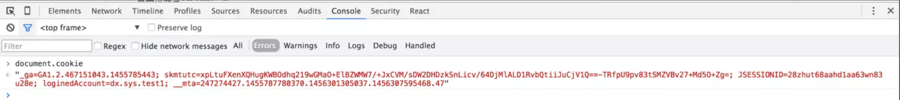
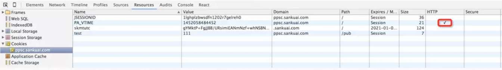
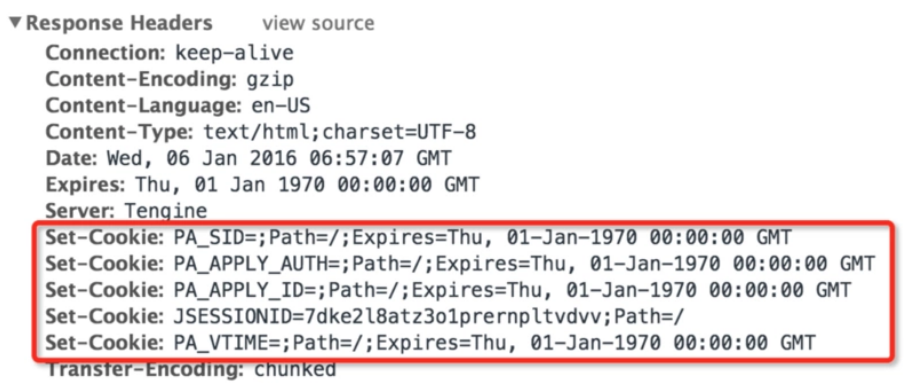
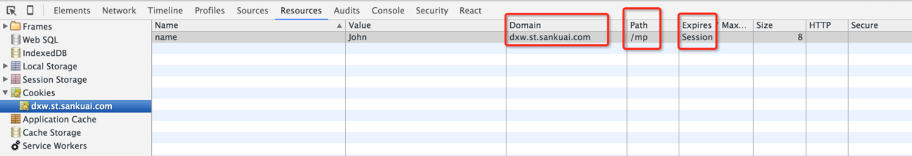
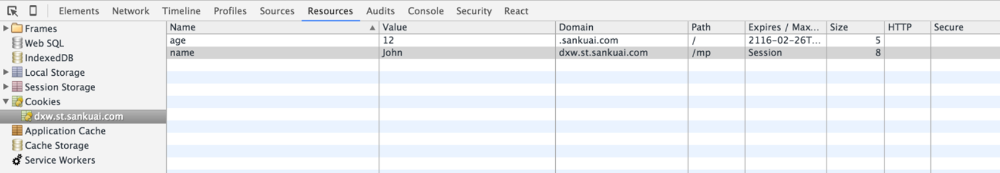
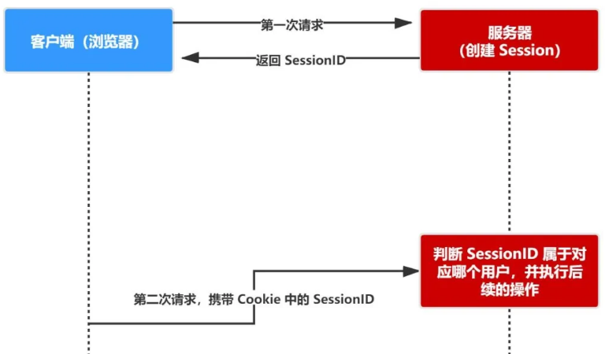
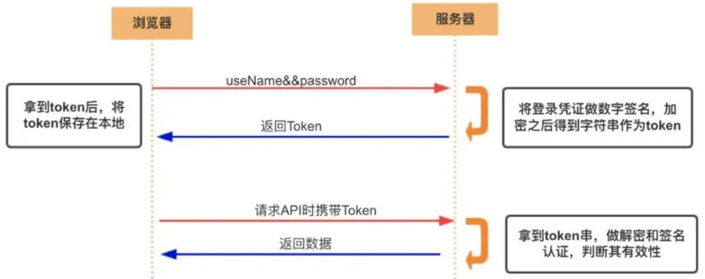
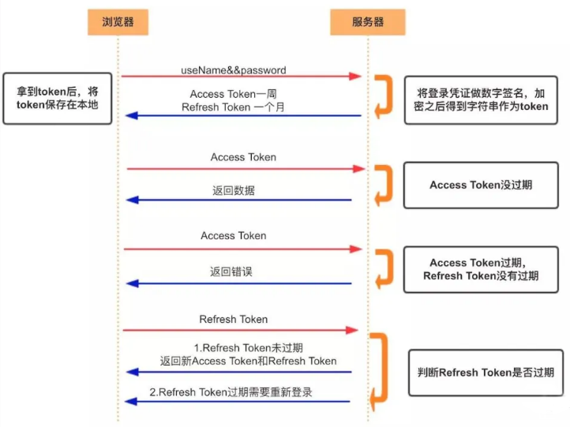
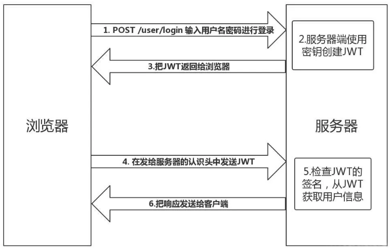

# Cookie、Session、Token

## 认证

**Authentication** 

认证就是 **验证当前用户的身份** ，证明“你是你自己” 。

互联网中的认证有：

- 用户名密码登录。
- 邮箱发送登录链接。
- 手机号接收验证码。
- 只要你能收到邮箱/验证码，就默认你是账号的主人。

## 授权

**Authorization**

- 用户授予第三方应用访问该用户某些资源的权限

- - 在安装手机应用的时候，APP 会询问是否允许授予权限（访问相册、地理位置等权限）。
  - 你在访问微信小程序时，当登录时，小程序会询问是否允许授予权限（获取昵称、头像、地区、性别等个人信息）。

- 实现授权的方式有：cookie、session、token、OAuth

## 凭证

**Credentials**

- 实现认证和授权的前提是需要一种媒介（证书）来标记访问者的身份

- - 每个人都有一张身份证，通过身份证，我们**才能**办理手机卡/银行卡/个人贷款/交通出行等等，这就是认证的凭证。
  - 有的网站中会有两种模式，游客模式和登录模式。游客模式下，只能使用浏览等部分功能。当用户登录成功，服务器会给用户使用的浏览器或软件颁发一个令牌（token），这个令牌（token）用来表明你的身份，每次浏览器发送请求时会带上这个令牌，就可以使用游客模式下无法使用的功能。

## Cookie

cookie的类型为“小型文本文件”，某些网站为了辨别用户身份而存储在用户本地终端上的数据

浏览器会在特定情况下携带上cookie来发送请求，我们可以通过cookie来获取一些信息

cookir总是保存在客户端中，按在客户端存储的位置，又可以分为内存Cookie和硬盘Cookie

- 内存cookie由浏览器维护，保存在内存中，浏览器关闭时会消失（默认）
- 硬盘cookir保存在硬盘中，有一个过期时间，用户手动清理或到过期时间时才会被清理
- 如何判断：有设置过期时间 ？硬盘cookie : 内存cookie


=========


- HTTP 是**无状态**的协议（对于事务处理没有记忆能力，每次客户端和服务端会话完成时，服务端不会保存任何会话信息）：**每个请求都是完全独立的**，服务端无法确认当前访问者的身份信息，因此**无法分辨上一次的请求发送者和这一次的请求发送者是不是同一个人**。所以服务器与浏览器为了进行会话跟踪（知道是谁在访问我），就必须主动地去维护一个状态，这个状态用于告知服务端前后两个请求是否来自同一浏览器。而这个状态需要通过 cookie 或者 session 去实现。

- 当网页要发http请求时，浏览器会先检查是否有相应的cookie，有则自动添加在请求的 header 中的
  cookie字段中。这些是浏览器自动帮我们做的，且每一次http请求浏览器都会自动帮我们做。这个特
  点很重要，因为这关系到“什么样的数据适给存储在cookie中”。

  存储在cookie中的数据，每次都会被浏览器自动放在http请求中，如果这些数据并不是每个请求都需要
  发给服务端的数据，浏览器这设置自动处理无疑增加了网络开销；但如果这些数据是每个请求都需要发
  给服务端的数据（比如身份认证信息），浏览器这设置自动处理就大大兔去了重复添加操作。所以对于
  那设置"每次请求都要携带的信息（最典型的就是身份认证信息）”就特别适合放在cookie中，其他类型的
  数据就不适给了。

  但在 localStorage 出现之前，cookie被滥用当做了存储工具。什么数据都放在cookie中，即使这些数据
  只在页面中使用而不需要随请求传送到服务端。当然Cookie标准还是做了一些限制：每个域名下的cookie的大小最大为4KB，每个域名下的cookie数量最多为20个（但很多浏览器厂商在具体实现时支持大于20个）。
  
- cookie **存储在客户端**： cookie 是服务器发送到用户浏览器并保存在本地的一小块数据，它会在浏览器下次向同一服务器再发起请求时被携带并发送到服务器上。

- cookie有自己的作用域，是**不可跨域**的，需要手动指定哪些主机、主机下的哪些路径可以接受cookie。

- cookie的基本通信流程：设置Cookie --> cookie被自动添加到request header中 --> 服务器端接收到cookie。

- Cookie保存在客户端中（一般由服务器设置cookie，客户端用来删除cookie），按在客户端中的存储位置，Cookie可以分为内存Cookie和硬盘Cookie。内存Cookie由浏览器维护，保存在内存中，浏览器关闭时Cookie就会消失，其存在事件是短暂的；硬盘Cookie保存在硬盘中，有一个过期时间，用户手动清理或者过期时间到时，才会被清理。如果没有设置过期时间，默认是内存cookie，在关闭浏览器时会自动删除，如果有设置过期时间，并且过期时间不为0或是为负数，则是硬盘cookie。

### Cookie的格式

#### document.cookie
JS原生的API提供了获取cookie的方法：document.cookie（注意,这个方法只能获取非HttpOnly类型的
cookie）。在console中执行这段代码可以看到结果如下图：



打印出的结果是一个字符串类型，因为cookie本身就是存储在浏览器中的字符串。但这个字符串是有格式的，由键值对 key=value 构成，键值对之间由一个分号和一个空格隔开。

#### Cookie 的属性

每个cookie都有一定的属性， 如什么时候失效,要发送到哪个域名，哪个路径等等。这些属性是通过cookie选项来设置的，cookie选项包括：expires、domain、path、secure、Httponly。 在设置任一个cookie时都可以设置相关的这些属性，当然也可以不设置， 这时会使用这些属性的默认值。在设置这些属性时，属性之间由一个分号和一个空格隔开。代码示例如下：

```
"key=name; expires=Thu, 25 Feb 2016 04:18:00 GMT; domain=ppsc.sankuai.com; path=/; secure; HttpOnly"
```


| 属性       | 说明                                                         |
| ---------- | ------------------------------------------------------------ |
| name=value | 键值对，设置 Cookie 的名称及相对应的值，都必须是字符串类型 - 如果值为 Unicode 字符，需要为字符编码。- 如果值为二进制数据，则需要使用 BASE64 编码。 |
| domain     | 指定 cookie 所属域名，默认是当前域名(origin)，不包括子域名，指定哪些主机可以接受cookie |
| path       | 指定 cookie 在哪个路径（路由）下生效，默认是 '/'。如果设置为 `/abc`，则只有 `/abc` 下的路由可以访问到该 cookie，如：`/abc/read`。 |
| maxAge     | cookie 失效的时间，单位秒。如果为整数，则该 cookie 在 maxAge 秒后失效。如果为负数，该 cookie 为临时 cookie ，关闭浏览器即失效，浏览器也不会以任何形式保存该 cookie 。如果为 0，表示删除该 cookie 。默认为 -1。- 比 expires 好用。 |
| expires    | 过期时间，即在什么时间内有效，在设置的某个时间点后该 cookie 就会失效。一般浏览器的 cookie 都是默认储存的，当关闭浏览器结束这个会话的时候，这个 cookie 也就会被删除 |
| secure     | 该 cookie 是否仅被使用安全协议传输。安全协议有 HTTPS，SSL等，在网络上传输数据之前先将数据加密。默认为false。当 secure 值为 true 时，cookie 在 HTTP 中是无效，在 HTTPS 中才有效。 |
| httpOnly   | 如果给某个 cookie 设置了 httpOnly 属性，则无法通过 JS 脚本 读取到该 cookie 的信息，但还是能通过 Application 中手动修改 cookie，所以只是在一定程度上可以防止 XSS 攻击，不是绝对的安全 |

##### expires

expires选项用来设置"cookie什么时间内有效”。expires实是cookie失效日期，expires必须是 GMT格式的时间（可以通过new Date().toGMTString() 或者 new Date().toUTCString() 来获得）。

如 expires=Thu, 25 Feb 2016 04:18:00 GMT 表示cookie将在 2016年2月25日4:18 之后失效，对于失效的cookie浏览器会清空。如果没有设置该选项，则默认有效期为session，即会话cookie。这种cookie在浏览器关闭后就没有了。

> expires是http/1.0协议中的选项，在新的http/1.1协议中expires已经由 max-age 选项代替，两者的作用都是限制cookie的有效时间。expires的值是一个时间点（cookie失效时刻 = expires），而 max-age 的值是一个以秒为单位时间段（cookie失效时刻 = 创建时刻 + max-age）。
>
> 另外，max-age 的默认值是 -1（即有效期为session）；若 max- age 有三种可能值：负数、0、正数。
>
> 负数：有效期session；0：删除cookie；正数：有效期为创建时刻 + max-age

##### domain 和 path

domain是域名，path是路径，两者加起来就构成了URL, domain和path- 起来限制cookie能被哪些URL访问。

一句话概括：某cookie的 domain 为"baidu.com"，path为"/"，若请求的URL（URL可以是js/html/img/css资源请求，但不包括XHR请求）的域名是"baidu.com”或其子域如"api.baidu.com"、"dev.api.baidu.com"，且URL的路径是"/“或子路径"/home"、"/home/login"，则浏览器会将此cookie添加到该请求的cookie头部中。

所以 domain和path 2个选项共同决定了cookie何时被浏览器自动添加到请求头部中发送出去。如果没有设这两个选项，则会使用默认值。domain的默认值为设置该cookie的网页所在的域名，path默认值为设置该cookie的网页所在的目录。

> 特别说明1：
>
> 发生跨域xhr请求时，即使请求URL的域名和路径都满足cookie的domain和path，默认情况下cookie也不会自动被添加到请求头部中。若想知道原因请阅读本文最后一节）
>
> 特别说明2：
>
> domain是可以设置为须面本身的域名（本域），或页面本身域名的父域，但不能是公共后缀public suffix。举例说明下：如果页面域名为 www.baidu.com，domain可以设置为"www.baidu.com”，也可以设置为"baidu.com",但不能设置为”.com'或"com”。
>

##### secure

secure选项用来设置cookie只在确保安全的请求中才会发送。当请求是HTTPs或者其他安全协议时，包含
secure选项的cookie才能被发送至服务器。

默认情况下，cookie不会带secure选项（即为空）。所以默认情况下，不管是HTTPs协议还是HTτP协议的请
求，cookie都会被发送至服务端。但要注意一点，secure选项只是限定了在安全情况下才可以传输给服务端，但并不代表你不能看到这个cookie。

下面我们设置一个 secure类型的cookie：

```
document.cookie = "name=huang; secure";
```

之后你就能在控制台中看到这个 cookie 了，如下图所示：



凡是httponly类型的cookie，其HTTP -列都会打上 √ ，如上图中的 PA_VTIME 。你通过document.cookie是不能获取的，也不能修改PA_VTIME的。 

> httpOnly与安全
>
> 从上面介绍中，大家是否会有这样的疑问：为什么我们要限制客户端去访问cookie？实这样做是为了保障安全。
>
> 试想：如果任何cookie都能被客户端通过document.cookie获取会发生什么可怕的事情。当我们的网页遭受了XSS攻击，有一段恶意的script脚本插到了网页中。这段script脚本做的事情是：通过document.cookie读取了户身份验证相关的cookie，并将这些cookie发送到了攻击者的服务器。攻击者轻而易举就拿到了户身份验证信息，于是就可以摇摇大摆地冒充此用户访问你的服务器了（因为攻击者有合法的用户身份验证信息，所以会通过你服务器的验证）。

### 如何设置 Cookie

知道了cookie的格式，cookie的属性选项，接下来我们就可以设置cookie了。首先得明确一点：cookie既
可以由服务端来设置，也可以由客户端来设置。

#### 服务端设置 Cookie

不管你是请求一个资源文件（如html/js/ss/图片），还是发送一 个ajax请求， 服务端都会返回response。而response header中有-项叫set-cookie, 是服务端专门用来设置cookie的。如下图所示，服务端返回的response header中有5个set-cookie字段, 每个字段对应一个cookie（注意不能将多个cookie放在一个set-cookie字段中），set-cookie字段的值就是普通的字符串，每个cookie还设置了相关属性选项。



注意：

- 一个set-Cookie字段只能设置一个cookie，当你要想设置多个cookie，需要添同样多的set-Cookie字段。
- 服务端可以设置cookie的所有选项：expires、domain、path、secure、HttpOnly

#### 客户端设置 Cookie

在网页即客户端中我们也可以通过js代码来设置cookie。如我当前打开的网址为http://dxw.st.sankuai.com/mp/，在控制台中我们执行了下面代码：

```
document.cookie = "name=Jonh; ";
```

查看浏览器cookie面板如下图所示，cookie确实设置成功了，且属性选项domain、path、expires都用了默认值。



再执行下面代码：

```
document.cookie="age=12; expires=Thu, 26 Feb 2116 11:50:25 GMT; domain=sankuai.com; path=/";
```

查看浏览器cookie面板，如下图所示，新的cookie设置 成功了，而且属性选项domain、path、expires都变成了设定的值。



注意：
客户端可以设置cookie的下列选项: expires、domain、path、secure（有条件：只有在https协议的网页中，户端设置secure类型的cookie才能成功），但无法设置HttpOnly选项。

#### 用js如何设置多个 Cookie

当要设置多个cookie时，js代码很自然地我们会这么写：

```
document.cookie = "name=Jonh; age=12; class=111";
```

但你会发现这样写只是添加了第一个cookie "name=John" ，后面的所有cookie都没有添加成功。所以最简单的设置多个cookie的方法就在重复执行document .cookie = "key=name"，如下:

```
document.cookie = "name=Jonh";
document.cookie = "age=12";
document.cookie = "class=111";
```

#### 修改 Cookie

要想修改一个cookie，只需要重新赋值就行，旧的值会被新的值覆盖。但要注意一点，在设置新cookie时，path/domain这几个选项一定要旧cookie保持一样，否则不会修改旧值，而是添加了一个新的cookie。

#### 删除 Cookie

删除一个cookie也挺简单，也是重新赋值，只要将这个新cookie的expires选项设置为一个过去的时间点就行了。但同样要注意，path/ domain/这几个选项一定要旧cookie保持一样。

### Cookie 编码

cookie其实是个字符串，但这个字符串中 逗号、分号、空格 被当做了特殊符号。所以当cookie的key和value中含有这3个特殊字符时，要对其进行额外编码，一般会用escape进行编码，读取时用unescape进行解码；当然也可以用encodeURIComponent/decodeURIComponent 或者 encodeURI/decodeURI

[三者的区别可以参考这篇文章]: https://www.cnblogs.com/season-huang/p/3439277.html

```
var key = escape("name;value");
var value = escape("this is a value contain , and ;");
document.cookie = key + "=" + value + "; expires=Thu, 26 Feb 2116 11:50:25 GMT; domain=sankuai.com; path=/";
```

### 跨域请求中 Cookie

之前在介绍XHR的一篇文章里面提过：默认情况下，在发生跨域时，cookie 作为一种 credential 信息是不会被传送到服务端的。必须要进行额外设置可以。具体原因和如何设置可以参考这篇文章：

[你真的会使用XMLHttpRequest吗?]: https://segmentfault.com/a/1190000004322487#articleHeader13

另外，关于跨域资源共享CORs极力推荐大家阅读阮一峰的这篇：

[跨域资源共享CORS详解]: http://www.ruanyifeng.com/blog/2016/04/cors.html

### 其他补充

1. 什么时候cookie会被覆盖: name/domain/path 这3个字段都相同的时候；
2. 关于domain的补充说明：
   1. 如果显式设置了domain，则设置成什么，浏览器就存成什么；但如果没有显式设置，则浏览器会自动取url的host作为domain值；
   2. 新的规范中，显式设置domain时，如果value最前面带点，则浏览器处理时会将这个点去掉，所以最后浏览器存的就是没有点的（注意：但目前大多数浏览器并未全部这么实现）
   3. 前面带点'.'和不带点'.'有啥区别：
      带点：任何subdomain都可以访问，包括父domain
      不带点：只有完全一样的域名才能访问，subdomain不能（但在IE下比较特殊，它支持subdomain访问）

## Session

- session 是另一种记录服务器和客户端会话状态的机制
- session 不能在客户端设置
- session 是基于 cookie 实现的，session 存储在服务器端，sessionId 会被存储到客户端的cookie 中
- 为了防止别人篡改，可以使用签名加密
- session 认证流程：
- 1. 用户第一次请求服务器，服务器根据用户提交的相关信息，创建对应的 Session。
  2. 请求返回时将此 Session 的唯一标识 SessionID 返回给浏览器。
  3. 浏览器接收到服务器返回的 SessionID 信息后，会将此信息存入到 Cookie 中，同时 Cookie 记录此 SessionID 属于哪个域名。
  4. 当用户第二次访问服务器的时候，请求会自动判断此域名下是否存在 Cookie 信息，如果存在自动将 Cookie 信息也发送给服务端，服务端会从 Cookie 中获取 SessionID，再根据 SessionID 查找对应的 Session 信息，如果没有找到说明用户没有登录或者登录失效，如果找到 Session 证明用户已经登录可执行后面操作。
  5. 

根据以上流程可知，SessionID 是连接 Cookie 和 Session 的一道桥梁，大部分系统也是根据此原理来验证用户登录状态。

##  Cookie 和 Session 的区别

- 安全性：Session 比 Cookie 安全，Session 存储在服务器端，Cookie 存储在客户端。
- 存取值的类型不同：Cookie 只支持字符串数据，想要设置其他类型的数据，需要将其转换成字符串；Session 可以存任意数据类型。
- 有效期不同：Cookie 可设置为长时间保持，比如我们经常使用的默认登录功能；Session 一般失效时间较短，客户端关闭（默认情况下）或者 Session 超时都会失效。
- 存储大小不同：单个 Cookie 保存的数据不能超过 4K；Session 可存储数据远高于 Cookie，但是当访问量过多，会占用过多的服务器资源。

## Cookie 和 session 的缺陷

- Cookie会被附加在每个HTTP请求中，所以无形中增加了流量（事实上某些请求是不需要的）；
- Cookie是明文传递的，所以存在安全性的问题；
- Cookie的大小限制是4KB，对于复杂的需求来说是不够的；
- 对于浏览器外的其他客户端（比如iOS、Android )，必须手动的设置cookie和session；
- 对于分布式系统和服务器集群中如何可以保证其他系统也可以正确的解析session？

## Token


###  Acesss Token

- 访问资源接口（API）时所需要的资源凭证

- 简单 token 的组成：

  - uid：用户唯一的身份标识
  - time：当前时间的时间戳
  - sign：签名，token 的前几位以哈希算法压缩成的一定长度的十六进制字符串

- 特点：

- - 服务端无状态化、可扩展性好
  - 支持移动端设备
  - 安全
  - 支持跨程序调用

- token 的身份验证流程：

  1. 客户端使用用户名跟密码请求登录
  2. 服务端收到请求，验证用户名与密码
  3. 验证成功后，服务端会签发一个 token 并把这个 token 发送给客户端
  4. 客户端收到 token 以后，会把它存储起来，比如放在 cookie 里或者 localStorage 里
  5. 客户端每次向服务端请求资源的时候需要带着服务端签发的 token
  6. 服务端收到请求，然后去验证客户端请求里面带着的 token ，如果验证成功，才向客户端返回请求的数据

- 每一次请求都需要携带 token，需要把 token 放到 HTTP 的 Header 里

- 基于 token 的用户认证是一种服务端无状态的认证方式，服务端不用存放 token 数据。用解析 token 的计算时间换取 session 的存储空间，从而减轻服务器的压力，减少频繁的查询数据库

- token 完全由应用管理，所以它可以避开同源策略

###  Refresh Token

- refresh token 是专用于刷新 access token 的 token。如果没有 refresh token，也可以刷新 access token，但每次刷新都要用户输入登录用户名与密码，会很麻烦。有了 refresh token，可以减少这个麻烦，客户端直接用 refresh token 去更新 access token，无需用户进行额外的操作。

  

- Access Token 的有效期比较短，当 Acesss Token 由于过期而失效时，使用 Refresh Token 就可以获取到新的 Token，如果 Refresh Token 也失效了，用户就只能重新登录了。

- Refresh Token 及过期时间是存储在服务器的数据库中，只有在申请新的 Acesss Token 时才会验证，不会对业务接口响应时间造成影响，也不需要向 Session 一样一直保持在内存中以应对大量的请求。

##  Token 和 Session 的区别

- Session 是一种记录服务器和客户端会话状态的机制，使服务端有状态化，可以记录会话信息。而 Token 是令牌，访问资源接口（API）时所需要的资源凭证。Token 使服务端无状态化，不会存储会话信息。
- Session 和 Token 并不矛盾，作为身份认证 Token 安全性比 Session 好，因为每一个请求都有签名还能防止监听以及重放攻击，而 Session 就必须依赖链路层来保障通讯安全了。如果你需要实现有状态的会话，仍然可以增加 Session 来在服务器端保存一些状态。
- 所谓 Session 认证只是简单的把用户信息存储到 Session 里，因为 SessionID 的不可预测性，暂且认为是安全的。而 Token ，如果指的是 OAuth Token 或类似的机制的话，提供的是 认证 和 授权 ，认证是针对用户，授权是针对 App 。其目的是让某 App 有权利访问某用户的信息。这里的 Token 是唯一的。不可以转移到其它 App上，也不可以转到其它用户上。Session 只提供一种简单的认证，即只要有此 SessionID ，即认为有此用户的全部权利，因此是需要严格保密的，这个数据应该只保存在站方，不应该共享给其它网站或者第三方 App。所以简单来说：如果你的用户数据可能需要和第三方共享，或者允许第三方调用 API 接口，用 Token 。如果永远只是自己的网站，自己的 App，用什么就无所谓了。

## JWT

- JSON Web Token（JWT）是一种认证授权机制。是目前最流行的跨域认证解决方案。

- JWT生成的Token由三部分组成︰

  ​	header

  ​		alg :采用的加密算法，默认是 HMAC SHA256 ( HS256)，采用同一个密钥进行加密和解密;

  ​		typ : JWT，固定值，通常都写成JWT即可;

  ​		会通过base64Url算法进行编码﹔

  ​	payload

  ​		携带的数据，比如我们可以将用户的id和name放到payload中;

  ​		默认也会携带iat ( issued at )，令牌的签发时间;

  ​		我们也可以设置过期时间:exp ( expiration time ) ;

  ​		会通过base64Url算法进行编码

  ​    signature

  ​		设置一个secretKey，通过将前两个的结果合并后进行HMACSHA256的算法;

  ​		HMACSHA256(base64Url(header)+.+ base64Url(payload), secretKey);

  ​		但是如果secretKey暴露是一件非常危险的事情，因为之后就可以模拟颁发token，也可以解密token ;

- JWT 是为了在网络应用环境间传递声明而执行的一种基于 JSON 的开放标准（RFC 7519）。JWT 的声明一般被用来在身份提供者和服务提供者间传递被认证的用户身份信息，以便于从资源服务器获取资源，比如用户登录上。

- 可以使用 HMAC 算法或者是 RSA 的公/私秘钥对 JWT 进行签名。因为数字签名的存在，这些传递的信息是可信的。

- 阮一峰老师的 JSON Web Token 入门教程 讲的非常通俗易懂：[http://www.ruanyifeng.com/blog/2018/07/json_web_token-tutorial.html ](http://www.ruanyifeng.com/blog/2018/07/json_web_token-tutorial.html)

### 生成 JWT

jwt.io/www.jsonwebtoken.io/

###  JWT 的原理



- JWT 认证流程：

  - 用户输入用户名/密码登录，服务端认证成功后，会返回给客户端一个 JWT

  - 客户端将 token 保存到本地（通常使用 localstorage，也可以使用 cookie）

  - 当用户希望访问一个受保护的路由或者资源的时候，需要请求头的 Authorization 字段中使用Bearer 模式添加 JWT，其内容看起来是下面这样

    ```
    Authorization: Bearer <token>
    ```

    

- 服务端的保护路由将会检查请求头 Authorization 中的 JWT 信息，如果合法，则允许用户的行为

- 因为 JWT 是自包含的（内部包含了一些会话信息），因此减少了需要查询数据库的需要

- 因为 JWT 并不使用 Cookie 的，所以你可以使用任何域名提供你的 API 服务而不需要担心跨域资源共享问题（CORS）

- 因为用户的状态不再存储在服务端的内存中，所以这是一种无状态的认证机制

###  JWT 的使用方式

客户端收到服务器返回的 JWT，可以储存在 Cookie 里面，也可以储存在 localStorage。

#### 方式一

当用户希望访问一个受保护的路由或者资源的时候，可以把它放在 Cookie 里面自动发送，但是这样不能跨域，所以更好的做法是放在 HTTP 请求头信息的 Authorization 字段里，使用 Bearer 模式添加 JWT。

```
GET /calendar/v1/events
Host: api.example.com
Authorization: Bearer <token>
```

- 用户的状态不会存储在服务端的内存中，这是一种 无状态的认证机制
- 服务端的保护路由将会检查请求头 Authorization 中的 JWT 信息，如果合法，则允许用户的行为。
- 由于 JWT 是自包含的，因此减少了需要查询数据库的需要
- JWT 的这些特性使得我们可以完全依赖其无状态的特性提供数据 API 服务，甚至是创建一个下载流服务。
- 因为 JWT 并不使用 Cookie ，所以你可以使用任何域名提供你的 API 服务而不需要担心跨域资源共享问题（CORS）

#### 方式二

跨域的时候，可以把 JWT 放在 POST 请求的数据体里。 

#### 方式三

通过 URL 传输

http://www.example.com/user?token=xxx

##  Token 和 JWT 的区别

相同：

- 都是访问资源的令牌
- 都可以记录用户的信息
- 都是使服务端无状态化
- 都是只有验证成功后，客户端才能访问服务端上受保护的资源

区别：

- Token：服务端验证客户端发送过来的 Token 时，还需要查询数据库获取用户信息，然后验证 Token 是否有效。
- JWT：将 Token 和 Payload 加密后存储于客户端，服务端只需要使用密钥解密进行校验（校验也是 JWT 自己实现的）即可，不需要查询或者减少查询数据库，因为 JWT 自包含了用户信息和加密的数据。

##  常见的前后端鉴权方式

1. Session-Cookie
2. Token 验证（包括 JWT，SSO）
3. OAuth2.0（开放授权）

##  常见问题

###  使用 cookie 时需要考虑的问题

- 因为存储在客户端，容易被客户端篡改，使用前需要验证合法性
- 不要存储敏感数据，比如用户密码，账户余额
- 使用 httpOnly 在一定程度上提高安全性
- 尽量减少 cookie 的体积，能存储的数据量不能超过 4kb
- 设置正确的 domain 和 path，减少数据传输
- cookie 无法跨域
- 一个浏览器针对一个网站最多存 20 个Cookie，浏览器一般只允许存放 300 个Cookie
- 移动端对 cookie 的支持不是很好，而 session 需要基于 cookie 实现，所以移动端常用的是 token

###  使用 session 时需要考虑的问题

- 将 session 存储在服务器里面，当用户同时在线量比较多时，这些 session 会占据较多的内存，需要在服务端定期的去清理过期的 session
- 当网站采用集群部署的时候，会遇到多台 web 服务器之间如何做 session 共享的问题。因为 session 是由单个服务器创建的，但是处理用户请求的服务器不一定是那个创建 session 的服务器，那么该服务器就无法拿到之前已经放入到 session 中的登录凭证之类的信息了。
- 当多个应用要共享 session 时，除了以上问题，还会遇到跨域问题，因为不同的应用可能部署的主机不一样，需要在各个应用做好 cookie 跨域的处理。
- sessionId 是存储在 cookie 中的，假如浏览器禁止 cookie 或不支持 cookie 怎么办？ 一般会把 sessionId 跟在 url 参数后面即重写 url，所以 session 不一定非得需要靠 cookie 实现
- 移动端对 cookie 的支持不是很好，而 session 需要基于 cookie 实现，所以移动端常用的是 token

###  使用 token 时需要考虑的问题

- 如果你认为用数据库来存储 token 会导致查询时间太长，可以选择放在内存当中。比如 redis 很适合你对 token 查询的需求。
- token 完全由应用管理，所以它可以避开同源策略
- token 可以避免 CSRF 攻击(因为不需要 cookie 了)
- 移动端对 cookie 的支持不是很好，而 session 需要基于 cookie 实现，所以移动端常用的是 token

###  使用 JWT 时需要考虑的问题

- 因为 JWT 并不依赖 Cookie 的，所以你可以使用任何域名提供你的 API 服务而不需要担心跨域资源共享问题（CORS）
- JWT 默认是不加密，但也是可以加密的。生成原始 Token 以后，可以用密钥再加密一次。
- JWT 不加密的情况下，不能将秘密数据写入 JWT。
- JWT 不仅可以用于认证，也可以用于交换信息。有效使用 JWT，可以降低服务器查询数据库的次数。
- JWT 最大的优势是服务器不再需要存储 Session，使得服务器认证鉴权业务可以方便扩展。但这也是 JWT 最大的缺点：由于服务器不需要存储 Session 状态，因此使用过程中无法废弃某个 Token 或者更改 Token 的权限。也就是说一旦 JWT 签发了，到期之前就会始终有效，除非服务器部署额外的逻辑。
- JWT 本身包含了认证信息，一旦泄露，任何人都可以获得该令牌的所有权限。为了减少盗用，JWT的有效期应该设置得比较短。对于一些比较重要的权限，使用时应该再次对用户进行认证。
- JWT 适合一次性的命令认证，颁发一个有效期极短的 JWT，即使暴露了危险也很小，由于每次操作都会生成新的 JWT，因此也没必要保存 JWT，真正实现无状态。
- 为了减少盗用，JWT 不应该使用 HTTP 协议明码传输，要使用 HTTPS 协议传输。

##  分布式架构下 session 共享方案

### session 共享（常用）

- 使用分布式缓存方案比如 Memcached 、Redis 来缓存 session，但是要求 Memcached 或 Redis 必须是集群

- 把 session 放到 Redis 中存储，虽然架构上变得复杂，并且需要多访问一次 Redis ，但是这种方案带来的好处也是很大的：

- - 实现了 session 共享；
  - 可以水平扩展（增加 Redis 服务器）；
  - 服务器重启 session 不丢失（不过也要注意 session 在 Redis 中的刷新/失效机制）；
  - 不仅可以跨服务器 session 共享，甚至可以跨平台（例如网页端和 APP 端）


###  session 复制

任何一个服务器上的 session 发生改变（增删改），该节点会把这个 session 的所有内容序列化，然后广播给所有其它节点，不管其他服务器需不需要 session ，以此来保证 session 同步。

优点：

​		可容错，各个服务器间 session 能够实时响应。

缺点： 

​		会对网络负荷造成一定压力，如果 session 量大的话可能会造成网络堵塞，拖慢服务器性能。

###  粘性 session /IP 绑定策略

采用 Ngnix 中的 ip_hash 机制，将某个 ip 的所有请求都定向到同一台服务器上，即将用户与服务器绑定。 用户第一次请求时，负载均衡器将用户的请求转发到了 A 服务器上，如果负载均衡器设置了粘性 session 的话，那么用户以后的每次请求都会转发到 A 服务器上，相当于把用户和 A 服务器粘到了一块，这就是粘性 session 机制。

优点： 

​		简单，不需要对 session 做任何处理。

缺点：

​		缺乏容错性，如果当前访问的服务器发生故障，用户被转移到第二个服务器上时，他的 session 信息都将失效。适用场景： 发生故障对客户产生的影响较小；服务器发生故障是低概率事件 。实现方式： 以 Nginx 为例，在 upstream 模块配置 ip_hash 属性即可实现粘性 session。

###  session 持久化

将 session 存储到数据库中，保证 session 的持久化

优点： 

​		服务器出现问题，session 不会丢失

缺点：

​		如果网站的访问量很大，把 session 存储到数据库中，会对数据库造成很大压力，还需要增加额外的开销维护数据库。

## 只要关闭浏览器 ，session 真的就消失了？

不对。对 session 来说，除非程序通知服务器删除一个 session，否则服务器会一直保留，程序一般都是在用户做 log off 的时候发个指令去删除 session。然而浏览器从来不会主动在关闭之前通知服务器它将要关闭，因此服务器根本不会有机会知道浏览器已经关闭，之所以会有这种错觉，是大部分 session 机制都使用会话 cookie 来保存 session id，而关闭浏览器后这个 session id 就消失了，再次连接服务器时也就无法找到原来的 session。如果服务器设置的 cookie 被保存在硬盘上，或者使用某种手段改写浏览器发出的 HTTP 请求头，把原来的 session id 发送给服务器，则再次打开浏览器仍然能够打开原来的 session。恰恰是由于关闭浏览器不会导致 session 被删除，迫使服务器为 session 设置了一个失效时间，当距离客户端上一次使用 session 的时间超过这个失效时间时，服务器就认为客户端已经停止了活动，才会把 session 删除以节省存储空间。