# ES5

## 严格模式

```
1. 理解:
  * 除了正常运行模式(混杂模式)，ES5添加了第二种运行模式："严格模式"（strict mode）。
  * 顾名思义，这种模式使得Javascript在更严格的语法条件下运行
2. 目的/作用
  * 消除Javascript语法的一些不合理、不严谨之处，减少一些怪异行为
  * 消除代码运行的一些不安全之处，为代码的安全运行保驾护航
  * 为未来新版本的Javascript做好铺垫
3. 使用
  * 在全局或函数的第一条语句定义为: 'use strict';
  * 如果浏览器不支持, 只解析为一条简单的语句, 没有任何副作用
4. 语法和行为改变
  * 必须用var声明变量
  * 禁止自定义的函数中的this指向window
  * 创建eval作用域
  * 对象不能有重名的属性
  * 函数不能有重名的形参
```

## JSON对象

```
1. JSON.stringify(obj/arr)
  * js对象(数组)转换为json对象(数组)
2. JSON.parse(json)
  * json对象(数组)转换为js对象(数组)

严格来说，只有JSON对象和JSON数组，没有“JSON字符串”这一概念。
JSON是数据传输的格式。如果服务器发送给我们的是普通的字符串，我们并不能直接使用，
  因为服务器发送的很可能是一长串数据，里面包含了多个数据，无法对数据进行分类。
  	因此我们需要的是JSON的对象和数组可以与原生的对象和数组进行转化，即，一一对应的关系。
  	  [对象(数组)都是用来保存数据的。]
```

```javascript
<script type="text/javascript">
  
    var obj = {
        name : 'kobe',
        age : 39
    };
    obj = JSON.stringify(obj);
    console.log( typeof obj); // string
    obj = JSON.parse(obj);
    console.log(obj); // object

</script>
```

## Object(对象)扩展

```
ES5给Object扩展了一些静态方法, 常用的2个:
Object.create 和 Object.defineProperties
```

### Object.create

```
Object.create(prototype, [descriptors])  (prototype是指定的原型，[descriptors]是相应的描述)
  * 作用: 以指定对象为原型创建新的对象
  * 为新的对象指定新的属性, 并对属性进行描述
    value: 指定值
    writable: 标识当前属性值是否是可修改的, 默认为false
    configurable: 标识当前属性是否可以被删除 默认为false
    enumerable: 标识当前属性是否能用for in 枚举 默认为false
```

先看以下代码

```javascript
<script type="text/javascript">
  
	var obj = {username: 'damu' , age: 30}
	var obj1 = {};
	obj1 = Object.create(obj);
	console.log(obj1);

</script>
```

此时结果如下图所示：
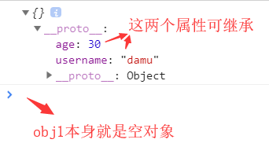
此时，指定obj为原型，age和username是原型上的2个属性，因此是可继承的。

- - -

如果没有```obj1 = Object.create(obj);```则```_proto_```中没有这两个属性，结果如下图所示：
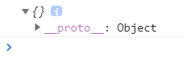

- - -

当然，Object.create的作用不止如此。

```javascript
<script type="text/javascript">
  
	var obj = {username: 'damu' , age: 30}
	var obj1 = {};
	obj1 = Object.create(obj , {
		sex: {
			value: '男'
		}
	});
	console.log(obj1);

</script>
```

结果如下图所示：
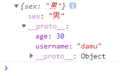
此时，不仅指定了原型，而且给当前的对象(obj1)扩展了属性。如果```console.log(obj1.sex);```则可以返回结果```男```。

- - -

```javascript
<script type="text/javascript">
  
	var obj = {username: 'damu' , age: 30}
	var obj1 = {};
	obj1 = Object.create(obj , {
		sex: {
			value: '男',
//			writable: true,
//			configurable: true
//			enumerable: true
		}
	});
	console.log(obj1);
	console.log(obj1.sex); // 男
	obj1.sex = '女'; // 修改失败，需要指定 writable: true
	console.log(obj1.sex); // 男
	delete obj1.sex; // 删除失败，需要指定 configurable: true
	console.log(obj1);

	for(var i in obj1){ /* 枚举obj1中的属性 */
		console.log(i); // username,age  枚举sex属性失败，需要指定enumerable: true
	}

</script>
```

### Object.defineProperties

```
Object.defineProperties(object, descriptors)   object为指定的对象，descriptors为扩展的属性
  * 作用: 为指定对象定义扩展多个属性
  * get: 用来获取当前属性值得回调函数
  * set: 监听(修改)当前属性值得触发的回调函数，并且实参即为修改后的值
  * 存取器属性：setter 用来存值 , getter 用来取值
```

```javascript
<script type="text/javascript">
  
	var obj2 = {firstName: 'kobe' , lastName: 'bryant'};
	Object.defineProperties(obj2 , {
		fullName: {//方法实际上是指定的对象去调用，这里是obj2
			get: function () {
				return this.firstName + ' ' + this.lastName;
			}
		}
	})
	console.log(obj2);

</script>
```

结果如下图所示：
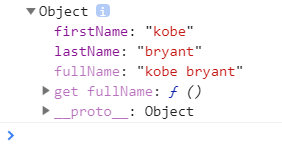

- - -

```javascript
<script type="text/javascript">
  
	var obj2 = {firstName: 'kobe' , lastName: 'bryant'};
	Object.defineProperties(obj2 , {
		fullName: { // 方法实际上是指定的对象去调用，这里是obj2
			get: function () { // 获取扩展属性的值，获取扩展属性值时get方法自动调用
				return this.firstName + ' ' + this.lastName;
			},
			set: function (data) { // 监听(修改)扩展属性，当扩展属性发生变化时会自动调用，自动调用后会将变化的值作为实参注入到set函数;这里的data为'tim duncan'。
				console.log('set()' , data); // set() tim duncan
				/* 修改不了扩展属性(fullName)的值，但能去修改原来属性(firstName和lastName)的值（原来属性的值已经被修改） */
				var names = data.split(' ');//将'tim duncan'拆分为数组
				/* 方法实际上是指定的对象去调用，这里是obj2，因此this是obj2 */
				/* 从原来的属性(firstName和lastName)中获取相应的值 */
				this.firstName = names[0]; // tim;
				this.lastName = names[1]; // duncan;
			}
		}
	})

	/* 当没有以下代码时，不会自动调用get/set方法 */
	console.log(obj2.fullName); // 获取扩展属性值，自动调用get方法 ;结果为：kobe bryant
	obj2.fullName = 'tim duncan'; // 监听扩展属性值，自动调用set方法;fullName是扩展属性，无法进行修改。
	// 但这一句代码是不可缺少的，因为这一句代码的存在才会调用set函数修改firstName和lastName的值。
	// 因此，这一句代码的实际作用并非修改fullName，而是传入参数'tim duncan'。
	console.log(obj2.fullName); // 再次获取扩展属性值，再次自动调用get方法;结果为：tim duncan
</script>
```

### 对象本身的两个方法

```
对象本身的两个方法
* get propertyName(){} 用来得到当前属性值的回调函数
* set propertyName(){} 用来监视当前属性值变化的回调函数
```

原理与上述的Object.defineProperties是相同的。

```javascript
<script type='text/javascript'>
  
    var obj = {
        firstName : 'kobe',
        lastName : 'bryant',
        /* fullName是根据已有的值动态计算出来的 */
        get fullName(){
            return this.firstName + ' ' + this.lastName
        },
        set fullName(data){
            var names = data.split(' ');
            this.firstName = names[0];
            this.lastName = names[1];
        }
    };
    console.log(obj.fullName); // kobe bryant
    obj.fullName = 'curry stephen';
    console.log(obj.fullName); // curry stephen

</script>
```

## Array(数组)扩展

```
1. Array.prototype.indexOf(value)  得到值在数组中的第一个下标
2. Array.prototype.lastIndexOf(value)  得到值在数组中的最后一个下标
3. Array.prototype.forEach(function(item, index){})  遍历数组
4. Array.prototype.map(function(item, index){})  遍历数组返回一个新的数组，返回加工之后的值
5. Array.prototype.filter(function(item, index){})  遍历过滤出一个新的子数组，返回条件为true的值
```

```javascript
<script type="text/javascript">
  
  /*
     需求:
     1. 输出第一个6的下标
     2. 输出最后一个6的下标
     3. 输出所有元素的值和下标
     4. 根据arr产生一个新数组,要求每个元素都比原来大10
     5. 根据arr产生一个新数组, 返回的每个元素要大于4
   */
  
    var arr = [1, 4, 6, 2, 5, 6];
    console.log(arr.indexOf(6)); // 2
    // Array.prototype.lastIndexOf(value)  得到值在数组中的最后一个下标
    console.log(arr.lastIndexOf(6)); // 5

    // Array.prototype.forEach(function(item, index){})  遍历数组
    arr.forEach(function (item, index) {
        console.log(item, index); // 1 0，4 1，6 2，2 3，5 4，6 5
    });

    // Array.prototype.map(function(item, index){})  遍历数组返回一个新的数组，返回加工之后的值
    var arr1 = arr.map(function (item, index) {
        return item + 10
    });
    console.log(arr, arr1); // 1,4,6,2,5,6   11,14,16,12,15,16

    // Array.prototype.filter(function(item, index){})  遍历过滤出一个新的子数组， 返回条件为true的值
    var arr2 = arr.filter(function (item, index) {
        return item > 4
    });
    console.log(arr, arr2); // 1,4,6,2,5,6   6 5 6

</script>
```

## Function(函数)扩展

```
1. Function.prototype.bind(obj) :
  * 作用: 将函数内的this绑定为obj, 并将函数返回
2. 面试题: 区别bind()与call()和apply()?
  * 都能指定函数中的this
  * call()/apply()是立即调用函数
  * bind()是将函数返回
```

```javascript
<script type="text/javascript">
  
	var obj = {username: 'kobe'};
	function foo() {
		console.log(this);
	}
	foo(); // Window
	foo.call(obj); // {username: "kobe"}
	foo.apply(obj); // {username: "kobe"}
	/* 可知，在不传参(foo的参数)的情况下，call和apply的使用方式是一样的 */

</script>
```

- - -

```javascript
<script type="text/javascript">
  
	var obj = {username: 'kobe'};
	function foo() {
		console.log(this);
	}
	foo();
	
	/* call 直接从第二个参数开始，依次传入参数 */
	foo.call(obj , 33); // {username: "kobe"} 33
	foo.apply(obj); // {username: "kobe"} undefined
	foo.apply(obj , 33); // 报错
	
	/* apply 第二参数必须是数组，传入的参数放在数组中 */
	foo.apply(obj , [33]); // {username: "kobe"} 33
	
	/* bind 绑定完this不会立即调用当前的函数，而是将函数返回 */
	foo.bind(obj); // 无输出，本质原因是foo函数未调用
	var bar = foo.bind(obj);
	console.log(bar); // 将foo函数输出
	bar(); // {username: "kobe"} undefined
	foo.bind(obj)(); // 或者不需要用var定义，直接调用; 结果为：{username: "kobe"} undefined
	/* bind 传参的方法同call一样 */
	foo.bind(obj , 33)(); // {username: "kobe"} 33
	/* 回调函数：我们自己定义的函数，但是由系统调用 */
	/* bind通常指定回调函数的this，示例如下 */
	setTimeout(function () {
		console.log(this); // {username: "kobe"} 
	}.bind(obj), 1000) // bind将this由window改为obj
</script>

```

# ES6

## let & const 关键字

**let**

```
let
1. 作用:
  * 与var类似, 用于声明一个变量
2. 特点:
  * 在块作用域内有效，但不影响作用域链，而var是在全局范围内有效
  * 不能重复声明，而var可以声明多次
  * 不会预处理, 不存在变量提升；而var存在变量提升（先使用，后定义）
3. 应用:
  * 循环遍历加监听
  * 使用let取代var是趋势
```

```javascript
<script type="text/javascript">
	console.log(username); //报错，不存在变量提升
	let username = 'kobe'; //与var类似, 用于声明一个变量
	let username = 'wake'; //重复声明，报错
	
	let btns = document.getElementsByTagName('button');//有三个按钮
   for(var i = 0;i<btns.length;i++){
      btns[i].onclick = function () {
         alert(i); //每个按钮的结果都是3
        // var在全局范围内有效，所以全局中只有一个变量i,每次循环时，定时器里面的i指的是全局变量i 
      }
   }

	// for循环计数器很适合用let。let有块作用域，每遍历一次时i都是一个版块的，所以在使用i时都是当前块作用域中自己的数据
	for (var i = 0; i < 10; i++) {
    setTimeout(function(){
      console.log(i); // 输出十个 10
    })
  }
  
  for (let j = 0; j < 10; j++) {
    setTimeout(function(){
      console.log(j); // 输出 0123456789
    })
  }

	{ // 不影响作用域链
    let a = 'aaa';
    function fn() {
      console.log(a);
    }
    fn(); // 结果为：aaa
  }
</script>
```

**const**

```
1. 作用:
  * 定义一个常量（只读）
2. 特点:
  * 不能修改，声明后必须初始化
  * 其它特点同let
3. 应用:
  * 保存不用改变的数据
4. 应用:
  * 块级作用域
5. 数据和对象
	* 对于数组和对象的元素修改，不算作对常量的修改，不会报错
6. 注：
	* const 其实保证的不是变量的值不变，而是保证变量指向的内存地址所保存的数据不允许改动。
	* 对于简单类型（数值 number、字符串 string 、布尔值 boolean）,值就保存在变量指向的那个内存地址，因此 const 声明的简单类型变量等同于常量。而复杂类型（对象 object，数组 array，函数 function），变量指向的内存地址其实是保存了一个指向实际数据的指针，所以 const 只能保证指针是固定的，至于指针指向的数据结构变不变就无法控制了，所以使用 const 声明复杂类型对象时要慎重。
```

```javascript
<script type="text/javascript">
  const sex = '男';
	console.log(sex);
	//sex = '女';//不能修改
	console.log(sex);
	
	// 暂时性死区
  // ES6 明确规定，代码块内如果存在 let 或者 const，代码块会对这些命令声明的变量从块的开始就形成一个封闭作用域。代码块内，在声明变量 PI 之前使用它会报错。
	var PI = "a";
  if(true){
    console.log(PI);  // ReferenceError: PI is not defined
    const PI = "3.1415926";
  }

	{
    // const 具有块级作用域
    const a = 'aaa';
  }
	console.log(a) // 报错：a is not defined
	
	const TEAM = ['a', 'b', 'c'];
	TEAM.push('d'); // 不会报错
	TEAM = 100; // 报错
</script>
```

## 解构赋值

```
1. 理解:
  * 从对象或数组中提取数据, 并赋值给变量(多个)
    (解构赋值的通俗理解：解析其结构，解析完以后知道内部的数据，然后再进行赋值)
2. 数组的解构赋值
  基本
  	let [a, b] = [1, 'atguigu'];
  可嵌套
  	let [a, [[b], c]] = [1, [[2], 3]];
  可忽略
  	let [a, , b] = [1, 2, 3];
  不完全解构
  	let [a = 1, b] = []; // a = 1, b = undefined
  剩余运算符
  	let [a, ...b] = [1, 2, 3]; // a = 1；b = [2, 3]
  字符串等
  	let [a, b, c, d, e] = 'hello'; // a='h';b='e';...
  默认值：
  	let [a = 3, b = a] = [];     // a = 3, b = 3
    let [a = 3, b = a] = [1];    // a = 1, b = 1
    let [a = 3, b = a] = [1, 2]; // a = 1, b = 2
3. 对象的解构赋值
	基本
  	let {n, a} = {n:'tom', a:12}
  	let { baz : foo } = { baz : 'ddd' } // foo = 'ddd'
  可嵌套可忽略
  	let obj = {p: ['hello', {y: 'world'}] };
    let {p: [x, { y }] } = obj;
    // x = 'hello'
    // y = 'world'
    let obj = {p: ['hello', {y: 'world'}] };
    let {p: [x, {  }] } = obj;
    // x = 'hello'
  不完全解构
  	let obj = {p: [{y: 'world'}] };
    let {p: [{ y }, x ] } = obj;
    // x = undefined
    // y = 'world'
  剩余运算符
  	let {a, b, ...rest} = {a: 10, b: 20, c: 30, d: 40};
    // a = 10
    // b = 20
    // rest = {c: 30, d: 40}
  解构默认值
  	let {a = 10, b = 5} = {a: 3}; // a = 3; b = 5;
    let {a: aa = 10, b: bb = 5} = {a: 3}; // aa = 3; bb = 5;
4. 用途
  * 给多个形参赋值
```

```javascript
<script type="text/javascript">
	let obj = {username: 'kobe' , age: 39};
	/* 通常写法 */
	let username = obj.username;
	let age = obj.age;
	/* 对象的解构赋值
	 * obj是要解构的目标对象，定义两个变量username、age向obj要数据，
	 *   解构的obj是对象，只能以对象的形式来接受数据，而在对象中可以放置属性，
	 * 	 首先，在等号左边定义的属性username、age是相当于在全局定义的变量，与上述的let方式定义是相同的，
	 * 	    在解构赋值的时候，等号左边必须是等号右边的对象已有的属性，否则返回undefined，
	 * 		 		并不需要将等号右边的对象所有属性都写上，想要什么属性就写什么属性即可
	 */
	let {username , age} = obj; // 解构赋值
	
	/* 数组的解构赋值
	 * 等号右边是数组，想要结构的对象是数组，
	 *   因此，等号左边也必须用数组的形式来接受数据
	 *     对象用key值一一对应，数组则用下标一一对应，
	 * 			默认是从下标0开始一一对应，也可以直接使用","取得其他的下标
	 */
	let arr = [1, 3 , 5 , 'abc' , true];
	let [] = arr;
	console.log(a , b , c , d , e);//结果为：1 , 3 , 5 , abc , true
	console.log(a , b);//结果为：1 , 3
	console.log(,, a , b);//结果为：5 , abc
	console.log(,,, a , b);//结果为：abc , true
	
	function foo(obj) {
		console.log(obj.username , obj.age);
	}
	foo(obj);//结果为：kobe 39
	
	/*给多个形参赋值
	 * 用{username , age}代替obj
	 * 	前提是知道传入的对象obj中有username、age，
	 */
	function foo({username , age}) {//相当于在函数内部声明了username、age，与对象的解构赋值在全局声明一样
		console.log(username , age);//直接使用
	}
	foo(obj);//结果为：kobe 39
</script>
```

## 模板字符串

```
模板字符串 : 简化字符串的拼接
  * 模板字符串必须用 `` 包含
  * 变化的部分使用 ${xxx} 定义
  * 内容中可以直接出现换行符
```

```javascript
<script type="text/javascript">
  let obj = {
    name : 'anverson',
    age : 41
  };

  let a = `我叫:${obj.name}, 我的年龄是:${obj.age}`;
	
	let b = `<ul>
            <li>啊</li>
            <li>呀</li>
           </ul>`;
</script>
```

## 对象的简写方式

```
简化的对象写法
* 省略同名的属性值
* 省略方法的function
* 例如:
	  let x = 1;
	  let y = 2;
	  let point = {
	    x,
	    y,
	    setX (x) {this.x = x}
	  };
```

```javascript
<script type="text/javascript">
	let username = 'kobe';
	let age = 39;

	let obj = {
		username: username,
		age: age
		getName: function () {
			return this.username;
		}
	};
	
	/* 在ES6中 */
	let obj = {
		username,	  /* 同名的属性可以省略不写 */
		age,	      /* 同名的属性可以省略不写 */
		getName() { /* 函数的 : function 可以省略不写 */
			return this.username;
		}
	};

</script>
```

## 箭头函数

```
* 作用: 定义匿名函数
* 基本语法:
  * 没有参数: () => console.log('xxxx')
  * 一个参数: i => i+2
  * 大于一个参数: (i,j) => i+j
  * 函数体不用大括号: 默认返回结果
  * 函数体如果有多个语句, 需要用{}包围，若有需要返回的内容，需要手动返回
* 使用场景: 多用来定义回调函数

* 箭头函数的特点：
    1、简洁
    2、箭头函数没有自己的this，箭头函数的this不是调用的时候决定的，而是在定义的时候处在的对象就是它的this，并且无法用 call() 、 apply() 、 bind() 改变。
    	通俗理解： 箭头函数的this看外层的是否有函数，
         如果有，外层函数的this就是内部箭头函数的this，
         如果没有，则this是window。
    3、不能作为构造实例化对象
    4、不能使用 arguments 变量
```

```javascript
<body>
    <button id="btn">测试箭头函数this_1</button>
    <button id="btn2">测试箭头函数this_2</button>
    
	<script type="text/javascript">
	  /* 函数的普通写法
	  let fun = function () {
		  console.log('我是箭头函数');
	  }
	  */
  
	  /* 形参的情况 */
	  // 1.没有形参的时候，()不能省略
	  let fun1 = () => console.log('我是箭头函数');
	  
	  // 2.只有一个形参的时候，()可以省略
	  let fun2 = (a) => console.log(a);
	  let fun2 = a => console.log(a);
	  
	  // 3.两个及两个以上的形参的时候，()不能省略
	  let fun3 = (x, y) => console.log(x, y);  
	  
	  /* 函数体的情况 */
	  // 1.函数体只有一条语句或者是表达式的时候，{}可以省略，此时会自动返回语句执行后的结果或者表达式的结果
	  let fun4 = () => {console.log('我是箭头函数');}
	  let fun4 = (x, y) => x + y;// 省略()，x+y 会自动执行
	  let fun4 = (x, y) => {return x + y}; // 如果加上{}，则需要用return来获取值
	  
	  // 2.函数体不止一条语句或表达式时，{}不可以省略
	  let fun5 = (x, y) => {
	  	console.log(x, y);
	  	return x + y; // 需要return
	  }
	  
	  /* 测试箭头函数的this */
	  /* 箭头函数的this看外层的是否有函数(非箭头函数的函数)，
	   *   如果有，外层函数的this就是内部箭头函数的this，
	   *   如果没有，则一直向上寻找直到this。
	   */
	  let btn1 = document.getElementById('btn1');
	  let btn2 = document.getElementById('btn2');
	  btn1.onclick = function () {
	  	alert(this); // 结果为：btn1  谁调用，this就是谁
	  }
	  
	  btn2.onclick = () => {
	  	alert(this); // 结果为：window  定义时所处的对象是window，所以this是window
	  }
	  
	  let obj = {
	  	name: '箭头函数',
	  	getName: function () {
	  		btn2.onclick = () => {
	  			console.log(this);
	  		}
	  	}
	  }
	  obj.getName(); // 结果为：obj
	  
	  let obj = {
	  	name: '箭头函数',
	  	getName: () => { // 相当于obj.getName = () => {...};
	  		btn2.onclick = () => {
	  			console.log(this);
	  		}
	  	}
	  }
	  obj.getName(); // 结果为：window
		
		// 不能作为构造实例化对象
		let Person = (name, age) => {
      this.name = name;
      this.age = age;
    }
    let me = new Person('xiao', 30);
		console.log(me); // 报错：Uncaught TypeError: Person is not a constructor
		
		// 不能使用 arguments 变量
		let fn = () => {
      console.log(arguments)
    }
    fn(1, 2, 3); // 报错：Uncaught ReferenceError: arguments is not defined

	</script>
</body>
```

## 形参默认值

```
当不传入参数的时候默认使用形参里的默认值，如果有传入的值，则使用传入的值，如果没有传入值，则使用默认值。
一般来说，具有默认值的参数，位置在最后(潜规则)。
function Point(x=1, y=2) {
  this.x = x;
  this.y = y;
}
可以与解构赋值结合
```

```javascript
<script type="text/javascript">
  // 定义一个点的坐标的构造函数
  function add(x, y=10) {
    return x + y;
  }
	let result1 = add(1, 2);
  let result2 = add(1);
	console.log(result1); // 3
  console.log(result2); // 11
</script>
```

## rest参数

ES6 引入 rest 参数，用数组的方式获取函数的实参，用来代替 arguments 的对象形式，因此，可以用数组的方法更加灵活的操作实参。

注意：在ES6中，只针对于数组，在ES9中，则将范围扩展至数组和对象。

```javascript
// arguments
function date(){
	console.log(arguments); // Arguments(2) [2, 3, callee: ƒ, Symbol(Symbol.iterator): ƒ]
  console.log(typeof arguments); // arguments 本质为 object
  arguments.forEach(function(item , index) { // 因为是arguments伪数组，因此使用数组的方式时会报错
    console.log(item, index);
  });
}
date(2, 3);

// rest
function date(...args){
  console.log(args);
  let sum = 0;
  for(arg of args) { // args可以使用数组的相关方法操作实参
    sum += arg;
  }
  return sum;
}
date('d','e','f'); // 结果为数组 ["d", "e", "f"]

// rest 参数必须要放到参数最后
function fn(a, ...args, b){...} // 报错
function fn(a, b, ...args){
  console.log(a);
  console.log(b);
  console.log(args);
}
fn(1, 2); // 结果：a=1，b=2
fn(1, 2, 3, 4, 5, 6); // 结果：a=1，b=2，args=[3, 4, 5, 6]
```

## 扩展运算符

能将数组转换为逗号分隔的参数序列。

注意：在ES6中，只针对于数组，在ES9中，则将范围扩展至数组和对象。

```javascript
let arr1 = [1, 2, 3];
let arr2 = [4, 5, 6];
console.log(arr1); // 只有1个参数，为arr1数组本身[1, 2, 3]
console.log(...arr1); // 有3个参数，分别为 1  2  3

// 数组的克隆与合并
let arr3 = [...arr1] // arr3: [1, 2, 3]
let arr4 = [4, ...arr1] // arr4: [4, 1, 2, 3]
let arr5 = [...arr1, ...arr2]; // arr5: [1, 2, 3, 4, 5, 6]
arr2.push(...arr1); // arr2: [4, 5, 6, 1, 2, 3]

// 将伪数组转为真数组
const divs = document.querySelectorAll('div');
const divArr = [...divs]

/*
 * 为什么这样可以插入呢？
 * 	 扩展运算符实际上就是调用iterator接口，去遍历拿到arr3中的每一个值（详情见iterator接口机制）
 */
```

## Promise对象

关于Promise，更详细的见 Promise 笔记。

**原理**

```
1. 理解:
  * Promise对象: 代表了未来某个将要发生的事件(通常是一个异步操作)
  * 有了promise对象, 可以将异步操作以同步的流程表达出来, 避免了层层嵌套的回调函数(俗称'回调地狱')
  * ES6的Promise是一个构造函数, 用来生成promise实例
2. 使用promise基本步骤(2步):
  * 创建promise对象
    let promise = new Promise((resolve, reject) => {
        //初始化promise状态为 pending
      //执行异步操作
      if(异步操作成功) {
        resolve(value);//修改promise的状态为fullfilled
      } else {
        reject(errMsg);//修改promise的状态为rejected
      }
    })
  * 调用promise的then()
    promise.then(function(
      result => console.log(result),
      errorMsg => alert(errorMsg)
    ))
3. promise对象的3个状态
  * pending: 初始化状态
  * fullfilled: 成功状态
  * rejected: 失败状态
4. 应用:
  * 使用promise实现超时处理

  * 使用promise封装处理ajax请求
    let request = new XMLHttpRequest();
    request.onreadystatechange = function () {
    }
    request.responseType = 'json';
    request.open("GET", url);
    request.send();
```

```javascript
<script type="text/javascript">

  //创建一个promise实例对象
  let promise = new Promise((resolve, reject) => {
    //初始化promise的状态为 pending(初始化状态)
    console.log('111');//同步执行，先输出111，再输出222
    //执行异步操作，通常是发送ajax请求，开启定时器
    setTimeout(function () {
      console.log('333');
      /* 根据异步任务的返回结果来修改promise的状态 */
      //异步任务执行成功
      resolve('哈哈');//修改promise的状态为 fullfilled(成功状态)，然后会自动调用then中的第一个函数，结果为：成功了 哈哈
      //异步任务执行失败
      reject('嘿嘿');//修改promise的状态为 rejected(失败状态)，然后会自动调用then中的第二个函数，结果为：失败了 嘿嘿
    },2000)
  });
  /* 以下的data对应 resolve() 中的形参，error对应 reject() 中的形参 */
  promise.then((data) => {//第一个函数
    console.log('成功了 ' + data);//成功的回调
  }, (error) => {//第二个函数
    console.log('失败了 ' + error);//失败的回调
  });
  console.log('222');
  
</script>
```


- - -

**实例案例**
对于网页中的新闻来说，一般上方是新闻的内容，下方是新闻的评论。新闻的内容肯定是要发请求给服务器从数据库获取的，那么怎么才能知道该拿的是哪一条新闻呢？在当初设置字段的时候会给每一个新闻都设置一个id，通过id寻找对应的新闻，那么下方的评论内容又怎么办呢，是新闻和评论一起请求还是先请求新闻内容再请求评论内容呢？将新闻内容和评论内容绑定到一起存入数据库，它们合在一起是一个字段，这当然没有问题，但有以下问题：1.不容易管理，数据量更大；2.有时候评论的内容比新闻的内容多得多，这时候，工作量会很大，如果浏览器渲染得慢，用户体验就不好，用户看到内容一点点地显示出来。而先请求新闻内容再请求评论内容的方式，有以下好处：1.数据少，页面渲染得快，这时，将新闻内容展现给用户的时间就会相对更短，用户体验更好，先让用户看到新闻内容，在用户看新闻内容的时候再发一次请求根据新闻内容的id找到相应评论的，再将评论渲染出来

```javascript
/* 路由 */
router.get('/news', function (req, res, next) {
    res.set('Access-Control-Allow-Origin', '*');
    var id = req.query.id;
    console.log('/news id='+id);
    var news = {//假数据：当前的新闻内容
        id: id,
        title: 'news title1...',
        content: 'news content1...',
        commentsUrl: '/comments?newsId='+id//评论内容
    };
    res.json(news);//返回新闻内容数据
});

router.get('/comments', function (req, res, next) {
    res.set('Access-Control-Allow-Origin', '*');
    console.log('/comments newsId=' + req.query.newsId);
    var newsId = req.query.newsId;
    var comments = [
        {
            id: 1,
            content: 'comment content1111...',
            newsId : newsId
        },
        {
            id: 2,
            content: 'comment content2222...',
            newsId : newsId
        }];
    res.json(comments);
});

module.exports = router;
```

```javascript
<script type="text/javascript">
   /* 需求：
    * 1、发送ajax请求获取新闻内容
    * 2、新闻内容获取成功后再次发送请求，获取对应的新闻评论内容
    * 3、新闻内容获取失败则不需要再次发送请求。
    */ 
    
 	//定义获取新闻的功能函数
	function getNews(url) {
    let promise = new Promise((resolve, reject) => {
      //初始化promise状态为pending
      //启动异步任务
      //创建xmlHttp实例对象
      let xmlHttp = new XMLHttpRequest();
      //绑定监听 readyState
      xmlHttp.onreadystatechange = function () {
        if(xmlHttp.readyState === 4){
        	if(xmlHttp.status === 200){//请求成功
						//修改状态
						resolve(xmlHttp.responseText);//修改promise的状态为成功状态
        	}else{//请求失败
          	reject('暂时没有新闻内容');//修改promise的状态为失败状态
        	}
        }
      };
      
	    //open 设置请求的方式以及url
	    xmlHttp.open('GET', url);
	    //发送
	    xmlHttp.send();
    })
	  return promise;
  }
	
  getNews('http://localhost:3000/news?id=2')
	  .then((data) => {//请求成功
			console.log(data);
			//发送请求获取评论内容准备url
			let commentsUrl = JSON.parse(data).commentsUrl;
			let url = 'http://localhost:3000' + commentsUrl;
			//发送请求
			return getNews(url);
	  }, (error) => {//请求失败
	    console.log(error);
	  })
	  .then((data) => {
      console.log(data);
	  }, (error) => {
      console.log(error);
	  }) 
            
</script>
```

```javascript
/* 老师的备课笔记 */
//定义一个请求news的方法
function getNews(url) {
    //创建一个promise对象
    let promise = new Promise((resolve, reject) => {
        //初始化promise状态为pending
        //启动异步任务
        let request = new XMLHttpRequest();
        request.onreadystatechange = function () {
            if(request.readyState === 4){
                if(request.status === 200){
                    let news = request.response;
                    resolve(news);
                }else{
                    reject('请求失败了。。。');
                }
            }
        };
        request.responseType = 'json';//设置返回的数据类型
        request.open("GET", url);//规定请求的方法，创建链接
        request.send();//发送
    })
    return promise;
}

getNews('http://localhost:3000/news?id=2')
  .then((news) => {//请求成功
      console.log(news);
      document.write(JSON.stringify(news));
      console.log('http://localhost:3000' + news.commentsUrl);
      return getNews('http://localhost:3000' + news.commentsUrl);
  }, (error) => {//请求失败
      alert(error);
  })
  .then((comments) => {
      console.log(comments);
      document.write('<br><br><br><br><br>' + JSON.stringify(comments));
  }, (error) => {
      alert(error);
  }) 
```

```javascript
使用promise基本步骤(2步):
  * 创建promise对象
    let promise = new Promise((resolve, reject) => {
        //初始化promise状态为 pending
      //执行异步操作
      if(异步操作成功) {
        resolve(value);//修改promise的状态为fullfilled
      } else {
        reject(errMsg);//修改promise的状态为rejected
      }
    })
  * 调用promise的then()
    promise.then(function(
      result => console.log(result),
      errorMsg => alert(errorMsg)
    ))
3. promise对象的3个状态
  * pending: 初始化状态
  * fullfilled: 成功状态
  * rejected: 失败状态
4. 应用:
  * 使用promise实现超时处理

  * 使用promise封装处理ajax请求
    let request = new XMLHttpRequest();
    request.onreadystatechange = function () {
    }
    request.responseType = 'json';
    request.open("GET", url);
    request.send();
```

## Symbol属性

```
前言：ES5中对象的属性名都是字符串，容易造成重名，污染环境

Symbol：
   概念：ES6中的添加了一种原始数据类型symbol(已有的原始数据类型：String, Number, boolean, null, undefined, 对象)
   特点：
     1、Symbol属性对应的值是唯一的，解决命名冲突问题，最大的用法是用来定义对象的唯一属性名。
     2、Symbol值不能与其他数据进行计算，包括同字符串拼串。
     3、for in, for of遍历时不会遍历Symbol属性，但是可以使用 Reflect.ownKeys 来获取对象的所有键名。
     4、内置Symbol值
        除了定义自己使用的Symbol值以外，ES6还提供了11个内置的Symbol值，指向语言内部使用的方法。可以称这些方法为魔术方法，因为它们会在特定的场景下自动执行。
     5、Symbol.iterator
        对象的Symbol.iterator属性，指向该对象的默认遍历器方法（也可见iterator接口机制）
```

| Symbol 内置值             | 作用                                                         |
| ------------------------- | ------------------------------------------------------------ |
| Symbol.hasInstance        | 当其他对象使用 instanceof 运算符，判断是否为该对象的实例时，会调用这个方法。 |
| Symbol.isConcatSpreadable | 对象的 Symbol.isConcatSpreadable 属性等于的是一个布尔值，表示该对象用于 Array.prototype.concat()时，是否可以展开。 |
| Symbol.species            | 创建衍生对象时，会使用该属性。                               |
| Symbol.match              | 当执行 str.match(myObject) 时，如果该属性存在，会调用它，返回该方法的返回值。 |
| Symbol.replace            | 当该对象被 str.replace(myObject)方法调用时，会返回该方法的返回值。 |
| Symbol.search             | 当该对象被 str. search (myObject)方法调用时，会返回该方法的返回值。 |
| Symbol.split              | 当该对象被 str. split (myObject)方法调用时，会返回该方法的返回值。 |
| Symbol.iterator           | 对象进行 for...of 循环时，会调用 Symbol.iterator 方法，返回该对象的默认遍历器。 |
| Symbol.toPrimitive        | 该对象被转为原始类型的值时，会调用这个方法，返回该对象对应的原始类型值。 |
| Symbol. toStringTag       | 在该对象上面调用 toString 方法时，返回该方法的返回值。       |
| Symbol. unscopables       | 该对象指定了使用 with 关键字时，哪些属性会被 with 环境排除。 |

```javascript
<script type="text/javascript">
  
	// 创建Symbol属性值
  let s1 = Symbol();
	console.log(s1, typeof s1); // Symbol() "symbol"
	
	// ()内可以传递用于标识作用的字符串
	let s2 = Symbol('abc');
  let s3 = Symbol('abc');
	console.log(s2); // Symbol(abc)
	console.log(s3); // Symbol(abc)
	console.log(s2 === s3); // false  两者不同

	let s4 = Symbol.for('def');
	let s5 = Symbol.for('def');
	console.log(s4); // Symbol(def)
	console.log(s5); // Symbol(def)
	console.log(s4 === s5); // true  通过Symbol.for()创建的则两者相同

	// 不能进行运算，包括同字符串拼串
	let result1 = s1 + 100; // 报错 Uncaught TypeError: Cannot convert a Symbol value to a number
	let result2 = s1 + 'a'; // 报错 Uncaught TypeError: Cannot convert a Symbol value to a string
	
	// 用作对象的属性(唯一)
  let obj = {username: 'kobe', age: 39};
	// obj.sex = '男';
	// obj.Symbol // 错误写法
  obj[symbol] = 'symbol';
  console.log(obj);//结果为：{username: "kobe", age: 39, Symbol(): "symbol"}
  obj[symbol] = 'hello';
  console.log(obj);//结果为：{username: "kobe", age: 39, Symbol(): "hello"}

  //for in、for of 不能遍历symbol属性。
  console.log(obj); // 结果为：{username: "kobe", age: 39, Symbol(): "hello"}
  for(let i in obj){
    console.log(i); // 结果为：username age   没有Symbol属性
  }


  // 向对象中添加方法 up down
  let game = {
    name:'game',
    up: function() {},
    down: function() {}
  };

  // 方式一
  let methods = {up: Symbol(), down: Symbol()};
  game[methods.up] = function() {
    console.log("up");
  }
  game[methods.down] = function() {
    console.log("down");
  }

  console.log(game); // {name: "game", up: ƒ, down: ƒ, Symbol(): ƒ, Symbol(): ƒ}

  // 方式二
  let youxi = {
    name:"youxi",
    [Symbol('up')]: function(){ // Symbol('say')是一个表达式，需要用[]
      console.log("up")
    },
    [Symbol('down')]: function(){
      console.log('down');
    }
  }

  console.log(youxi) // {name: "youxi", Symbol(up): ƒ, Symbol(down): ƒ}

	
	// 内置值使用示例
	class Person{
    // 自己控制类型检测的结果
    static [Symbol.hasInstance](param){
      console.log(param); // ["a", "b"]
      return true;
    }
  }

  let o = ["a", "b"];

  console.log(o instanceof Person); // true  因为 [Symbol.hasInstance] return true，所以这里的结果也是 true

  const arr = [1,2,3];
  const arr2 = [4,5,6];
  arr2[Symbol.isConcatSpreadable] = false; // 设置为不可展开
  console.log(arr.concat(arr2)); // [1, 2, 3, Array(3)]

</script>
```

```javascript
/* 对象的Symbol.iterator属性，指向该对象的默认遍历器方法(后边讲)（见iterator接口机制） */
//使用三点运算符，解构赋值，默认去调用iterator接口
let arr2 = [1, 6];
let arr3 = [2, 3, 4, 5];
arr2 = [1, ...arr3, 6];
console.log(arr2);//结果为：[1, 2, 3, 4, 5, 6]

/*
 * 为什么这样可以插入呢？
 * 	 实际上就是调用iterator接口，去遍历拿到arr3中的每一个值
 */

let [a, b] = arr2;
console.log(a, b);//结果为：1 2
/*
 * 同理，也是调用iterator接口进行遍历
 */
```

## iterator接口机制

```
概念： iterator是一种接口机制，为各种不同的数据结构提供统一的访问机制(这里的接口实际上是对象中的一个属性，属性名称是 Symbol.iterator，是一个函数)。

作用：
  1、为各种数据结构，提供一个统一的、简便的访问接口
  2、使得数据结构的成员能够按某种次序排列，自定义遍历数据，重写[Symbol.iterator]()
  3、ES6创造了一种新的遍历命令 for of 循环，Iterator接口主要供 for of 消费
  
工作原理：
  - 创建一个指针对象(遍历器对象)，指向数据结构的起始位置。
  		let iterator = MyArray[Symbol.iterator]();
  - 第一次调用next方法(指针对象中自带有)，指针自动指向数据结构的第一个成员
  		iterator.next();
  - 接下来不断调用next方法，指针会一直往后移动，直到指向最后一个成员
  - 每调用next方法返回的是一个包含value和done的对象，{value: 当前成员的值, done: 布尔值}
    * value表示当前成员的值，done对应的布尔值表示当前的数据的结构是否遍历结束
    * 当遍历结束的时候返回的value值是undefined，done值为true，否则为false
    
原生具备iterator接口的数据(可用 for of 遍历)：
  1、Array
  2、arguments
  3、set容器
  4、map容器
  5、String
  6、TypedArray
  7、NodeList
```

```javascript
<script type="text/javascript">	
  
	/* 手动模拟ES6中的iterator是如何实现的 */
	// 模拟指针对象(遍历器对象)
	function myIterator (arr) { // iterator接口
		let nextIndex = 0; // 记录指针的位置
		return { // 遍历器对象
			next() { // 定义next方法
				return nextIndex < arr.length ? {value: arr[nextIndex++], done: false} : {value: undefined, done: true};
			}
		}
	}

	// 准备数据
	let arr = [1, 4, 65, 'abc'];
 	let iteratorObj = myIterator(arr);
 	console.log(iteratorObj.next()); // {value: 1, done: false}
 	console.log(iteratorObj.next()); // {value: 4, done: false}
 	console.log(iteratorObj.next()); // {value: 65, done: false}
 	console.log(iteratorObj.next()); // {value: "abc", done: false}
 	console.log(iteratorObj.next()); // {value: undefined, done: true}
            
  /* ------------------------------ */
	// 遍历数组
	for(let i of arr){
	  console.log(i); // 1 4 65 abc
	}
	
	// 遍历字符串
	let str = 'abcdefg';
	for(let i of str){
	  console.log(i); // a b c d e f g
	}
	  
	// 遍历arguments
	function fun() {
	  for(let i of arguments){
	  	console.log(i);
	  }
	}
	fun(1, 4, 5, 'abc'); // 1 4 5 abc
	 
	// 遍历普通对象
	let obj = {username: 'kobe', age: 39}
	for(let i of obj){
	   console.log(i); //报错：Uncaught TypeError: obj is not iterable
	}     
	  
 	/* ------------------------------ */
  /* 重写iterator接口，自定义遍历 */
  // 当使用 for of 去遍历某一个数据结构的时候，首先去找Symbol.iterator，找到了就去遍历，没有找到的话则不能遍历: xxx is not iterable
  const arr = {
    name: "arr",
    stus: ['a', 'b', 'c', 'd'],
    [Symbol.iterator]() {
      //索引变量
      let index = 0
      return {
        next: () => { // 定义next方法
          if (index < this.stus.length) {
            const result = { value: this.stus[index], done: false }
            index++; // 下标自增
            return result
          }else{
            return { value: undefined, done: true }
          }
        }
      }
    }
  }

  //遍历这个对象 
  for(let v of arr) {
    console.log(v); // a b c d
  }
  
</script>
```

## Generator函数

```
概念：
  1、ES6提供的解决异步编程的方案之一
  2、Generator函数是一个状态机，内部封装了不同状态的数据，
  3、用来生成遍历器对象
  4、可暂停函数(惰性求值), yield可暂停，next方法可启动。每次返回的是yield后的表达式结果
特点：
  1、function 与 函数名 之间有一个星号(*)
  2、内部用yield表达式来定义不同的状态
      例如：
        function * generatorExample() {
          let result = yield 'hello';  // 状态值为hello
          yield 'generator'; // 状态值为generator
        }
  3、generator函数返回的是指针对象(iterator接口机制)，而不会执行函数内部逻辑
  4、调用next方法函数内部逻辑开始执行，遇到yield表达式停止，并返回一个对象，包含下一个yield的信息
  		{value: 【yield后的表达式结果/undefined】, done: 【false/true】}
  5、再次调用next方法会从上一次停止时的yield处开始
  6、yield语句返回结果通常为undefined，next()中可以传入参数，用于下一步操作，传入的参数包含在yield的结果中，定义变量进行接收。
```

```javascript
<script type="text/javascript">
	
  function * myGenerator() {
  	console.log('aaa');
  	yield 'hello';
  	yield 'generator';
  }
  myGenerator(); // 可以发现：console.log('aaa') 并没有执行。因为yield会暂停，返回一个指针对象
		
	/* yield暂停，next方法启动。每次返回的是yield后的表达式结果 */
	function* myGenerator() {
	  console.log('aaa');
	  yield 'yield1';
	  console.log('bbb');
	  yield 'yield2';
	  console.log('ccc');
	  return 'ddd'// 用return来指定返回的值，如果不指定，则最后的yield信息的vuale值为undefined
  }
	let MG = myGenerator(); // 返回的是指针对象
	console.log(MG); // myGenerator {<suspended>}
	MG.next(); // aaa
	// next()返回下一个yield的信息
	let result1 = MG.next(); // bbb
	console.log(result1); // {value: "yield2", done: false}
	let result2 = MG.next(); // ccc
	console.log(result2); // {value: "ddd", done: true}
		
	/* ------------------------------- */

  function* aa() {
    console.log(111)
    let result1 = yield 'yield1';
    console.log(222)
    console.log(result1); // undefined（默认值，yield默认返回的是undefined）
    let result2 = yield 'yield2' // 传入的参数包含在yield的结果中，定义变量进行接收
    console.log(333)
    console.log(result2); // ggggg  next()中传入的值可以在这里进行操作
    yield 'yield3'
    console.log(444)
  }
  let AA = aa();
  console.log(AA); // aa {<suspended>}

  let result1 = AA.next(); // 111   并返回下一个yield的信息
  console.log(result1); // {value: "yield1", done: false}

	// 如果没有在next()中传入参数，则使当前暂停的yield的返回值默认为undefined
  let result2 = AA.next(); // 222
  // console.log(result1);输出结果为undefined，因为next()没有给yield1传入参数
  console.log(result2); // {value: "yield2", done: false}  下一个yield的信息
	
	// next()中可以传入参数，用于下一步操作，传入的参数包含在yield的结果中
  let result3 = AA.next('ggggg'); // 333
	// console.log(result2);输出结果为ggggg，因为next()中传入了参数
  console.log(result3); // {value: yield3, done: true}  下一个yield的信息

  let result4 = AA.next(); // 444
  console.log(result4); // {value: undefined, done: true}  下一个yield的信息

</script>
```

```javascript
let obj = {username: 'kobe', age: 39}
for(let i of obj){
  console.log(i); // 报错：Uncaught TypeError: obj is not iterable
}

// 对象的Symbol.iterator属性，指向遍历器对象
// 人为地部署一个iterator接口，当使用 for of 遍历时，默认也是用遍历器对象去调用next()方法进行遍历Generator函数
let obj = {username: 'kobe', age: 39}
obj[Symbol.iterator] = function* myText() {
  yield 1;
  yield 2;
  yield 3;
}
for(let i of obj){
  console.log(i); // 1 2 3
}
```

**应用**

```javascript
/* 引入jquery */
<script type="text/javascript" src="./js/jquery-1.10.1.min.js"></script>

<script type="text/javascript">

	 /*
    * 需求：
    * 1、发送ajax请求获取新闻内容
    * 2、新闻内容获取成功后再次发送请求，获取对应的新闻评论内容
    * 3、新闻内容获取失败则不需要再次发送请求。
    * */ 
    function getNews(url) {
      $.get(url, function(data) {
        console.log(data);
        let commentsUrl = data.commentsUrl;
        let url = 'http://localhost:3000' + commentsUrl;
        // 当获取新闻内容成功，发送请求获取对应的评论内容
        // 调用next传参会作为上次暂停时yield的返回值
        sx.next(url);
      })
    }

		function* sendXml() {
      // url为next传参进来的数据
      let url = yield getNews('http://localhost:3000/news?newsId=2'); // 发请求拿到新闻news
      yield getNews(url); // 发请求拿到评论内容comments
    }

    let sx = sendXml(); // 获取遍历器对象
    sx.next(); // 发送请求获取新闻内容

		/* ---------------------------------- */

    /* 模拟 先后获取 用户数据、订单数据、商品数据 解决回调地狱 */
    function getUsers(){
      setTimeout(()=>{
        let data = '用户数据';
        iterator.next(data); // 调用 next 方法, 并且将数据传入
      }, 1000);
    }

    function getOrders(){
      setTimeout(()=>{
        let data = '订单数据';
        iterator.next(data); // 调用 next 方法, 并且将数据传入
      }, 1000)
    }

    function getGoods(){
      setTimeout(()=>{
        let data = '商品数据';
        iterator.next(data); // 调用 next 方法, 并且将数据传入
      }, 1000)
    }

    function * gen(){
      let users = yield getUsers(); // 获取用户数据
      console.log(users); // 操作用户数据
      let orders = yield getOrders(); // 获取订单数据
      console.log(orders); // 操作订单数据
      let goods = yield getGoods(); // 获取商品数据
      console.log(goods); // 操作商品数据
    }

    // 调用生成器函数
    let iterator = gen();
    iterator.next();

</script>
```

## Class类

ES6 提供了更接近传统语言的写法，引入了 Class（类）这个概念，作为对象的模板。通过 class 关键字，可以定义类。基本上，ES6 的 class 可以看作只是一个**语法糖**，它的绝大部分功能，ES5 都可以做到，新的 class 写法只是让对象原型的写法更加清晰、更像面向对象编程的语法而已。

```
1. class				定义类/实现类的继承
2. constructor	在类中通过定义构造方法
3. new					来创建类的实例
4. extends			实现类的继承
5. super				调用父类的构造方法
6. 重写从父类中继承的一般方法
```

---

```javascript
// 先来看以前的写法
function Person(name , age) {
  this.name = name;
  this.age = age;
}
let person = new Person('kobe', 39);
console.log(person); // 结果如下图
```

结果如下图所示：
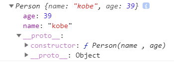

可以发现，在 `_proto_` 中有 `constructor` 因此 `在类class中定义的所有方法都会放在原型上` ，这样做的好处是只在内存中占一个位置，每生成一个实例，都可以去用这个方法。

- - -

```javascript
// class的写法
// 定义一个人物的类
class Person {
  // 类的构造方法，在new的时候自动执行
  constructor(name, age) {
    this.name = name;
    this.age = age;
  }
  // 类的一般方法
  // 在class中`必须`使用对象的简写方式，省略函数的function
  showName() {
    console.log(this.name);
  }
}
let person = new Person('kobe', 39);
console.log(person); // 结果如下图
person.showName(); // kobe
```

结果如下图所示：
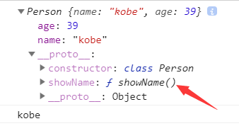

- - -

**静态成员**

```javascript
function Phone(){

}
Phone.name = '手机';
Phone.call = function(){
  console.log("打电话");
}

Phone.prototype.aaa = 'aaa';

let phone = new Phone();

console.log(phone.name); // undefined
console.log(phone.aaa); // aaa

/*
  实例对象与函数对象是不相通的，实例对象与函数对象的prototype才是相通的，因此可以访问 `phone.aaa`
  像 Phone.name、Phone.call 这样不属于实例对象的，就称为 '静态属性' 。在面向对象中，就是 属于类而不属于实例对象
*/

class Phone{
    // 静态属性，用 static 声明，属于类而不属于实例对象
    static name = '手机';
    static change(){
        console.log("打电话");
    }
}

let nokia = new Phone();

console.log(nokia.name); // undefined
console.log(Phone.name); // 手机
```

**继承**

```javascript
// 定义一个人物的类，父类
class Person {
  constructor(name, age) { // 注意：构造函数不是必须的
    this.name = name;
    this.age = age;
  }
  showName() {
    console.log('这是父类的showName');			
    console.log(this.name);
  }
}

let person = new Person('kobe', 39);
console.log(person); // Person {name: "kobe", age: 39}
person.showName(); // 这是父类的showName   kobe

// 子类
// 用 extends 继承父类
class StarPerson extends Person {
  constructor(name, age, salary) {
    // 用 super() 先调用父类的构造方法，相当于父类中的 this.name = name; this.age = age;
    super(name, age);
    this.salary = salary;
  }
  // 重写父类的方法，与父类的方法同名即可。
  showName(){
    console.log('这是子类的showName');
    console.log(this.name, this.age, this.salary);
  }
}
let p1 = new StarPerson('wade', 36, 100000000);
console.log(p1); // StarPerson {name: "wade", age: 36, salary: 100000000}
p1.showName(); // 这是子类的showName  wade 36 100000000
```

结果如下图所示：
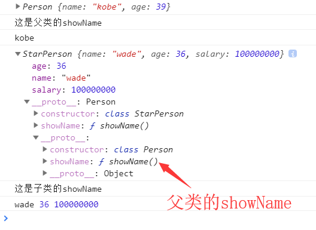

```javascript
/* 用ES5的方式实现构造函数继承 */
// 手机，父类
function Phone(brand, price) {
  this.brand = brand;
  this.price = price;
}

Phone.prototype.call = function() {
  console.log("我可以打电话");
}

// 智能手机，子类
function SmartPhone(brand, price, color, size) {
  Phone.call(this, brand, price);
  this.color = color;
  this.size = size;
}

// 设置子级构造函数的原型
SmartPhone.prototype = new Phone;
SmartPhone.prototype.constructor = SmartPhone;

// 声明子类的方法
SmartPhone.prototype.photo = function() {
  console.log("我可以拍照")
}
SmartPhone.prototype.playGame = function() {
  console.log("我可以玩游戏");
}

const chuizi = new SmartPhone('锤子',2499,'黑色','5.5inch');

console.log(chuizi); // SmartPhone {brand: "锤子", price: 2499, color: "黑色", size: "5.5inch"}
```

**getter和setter**

```javascript
class Phone{
  get price(){
    console.log("价格被读取了");
    return 'iloveyou';
  }

  set price(newVal){
    console.log('价格被修改了');
  }
}

//实例化对象
let s = new Phone();

console.log(s.price); // 价格被读取了   iloveyou
s.price = 'free'; // 价格被修改了
```

## 字符串方法扩展

```
1. includes(str)   判断是否包含指定的字符串
2. startsWith(str) 判断是否以指定字符串开头
3. endsWith(str)   判断是否以指定字符串结尾
4. repeat(count)   重复指定次数
```

```javascript
<script type="text/javascript">

    let str = 'abcdefg';
    
    /* includes(str) : 判断是否包含指定的字符串 */
    console.log(str.includes('a'));//结果为：true
    console.log(str.includes('h'));//结果为：false
    
	/* startsWith(str) : 判断是否以指定字符串开头 */
    console.log(str.startsWith('a'));//结果为：true
    console.log(str.startsWith('d'));//结果为：false
    
	/* endsWith(str) : 判断是否以指定字符串结尾 */
    console.log(str.endsWith('g'));//结果为：true
    console.log(str.endsWith('d'));//结果为：false
    
	/* repeat(count) : 重复指定次数 */
    console.log(str.repeat(5));//结果为：abcdefgabcdefgabcdefgabcdefgabcdefg
    
</script>
```

## 数值方法扩展

```
1. 二进制与八进制数值表示法: 二进制用0b, 八进制用0o
2. Number.isFinite(i)   判断是否是有限大的数
3. Number.isNaN(i)      判断是否是NaN
4. Number.isInteger(i)  判断是否是整数
5. Number.parseInt(str) 将字符串转换为对应的数值
6. Math.trunc(i)        直接去除小数部分
7. Math.sign()					判断一个数是正数、负数、0
8. Number.EPSILON 是 JavaScript 表示的最小精度
```

```javascript
<script type="text/javascript">
		
  	/* 二进制与八进制 */
    console.log(0b1010); // 10  二进制
    console.log(0o56); // 46	八进制
    
    /* Number.isFinite(i)  判断是否是有限大的数 */
    console.log(Number.isFinite(NaN)); // false
    console.log(Number.isFinite(5)); // true
    
    /* Number.isNaN(i)  判断是否是NaN */
    console.log(Number.isNaN(NaN)); // true
    console.log(Number.isNaN(5)); // falsse

    /* Number.isInteger(i)  判断是否是整数 */
    console.log(Number.isInteger(5.23)); // false
    console.log(Number.isInteger(5.0)); // true
    console.log(Number.isInteger(5)); // true

    /* Number.parseInt(str)  将字符串转换为对应的数值 */
    console.log(Number.parseInt('123abc')); // 123
    console.log(Number.parseInt('a123abc')); // NaN

    /* Math.trunc(i)  直接去除小数部分 */
    console.log(Math.trunc(13.123)); // 13
    console.log(Math.trunc(13.789)); // 13

		/* Math.sign()	判断一个数是正数、负数、0 */
    console.log(Math.sign(100)); // 1
    console.log(Math.sign(0)); // 0
    console.log(Math.sign(-20)); // -1

		/* Number.EPSILON 是 JavaScript 表示的最小精度 */
		/* 值接近于 2.2204460492503130808472633361816E-16 */
		// 主要用于浮点数的运算
		console.log(0.1 + 0.2); // 0.30000000000000004 不等于 0.3
		// 判断2个数是否相等
		function equal(a, b){
      if(Math.abs(a-b) < Number.EPSILON){
        return true;
      }else{
        return false;
      }
    }
		console.log(equal(0.1 + 0.2, 0.3)) // true

</script>
```

## 数组方法扩展

```
1. Array.from(v) : 将伪数组对象或可遍历对象转换为真数组
2. Array.of(v1, v2, v3) : 将一系列值转换成数组
3. find(function(value, index, arr){return true}) : 找出第一个满足条件返回true的元素
4. findIndex(function(value, index, arr){return true}) : 找出第一个满足条件返回true的元素下标
```

```javascript
<body>
	<button>测试1</button>
	<button>测试2</button>
	<button>测试3</button>
	
	<script type="text/javascript">
	  
	    /* Array.from(v) : 将伪数组对象或可遍历对象转换为真数组 */
	    let btns = document.getElementsByTagName('button');
	//  btns.forEach(function (item, index) {
	//	  console.log(item);//报错，因为这是伪数组，没有数组的一般方法
	//  })
		Array.from(btns).forEach(function (item, index) {
			console.log(item);//结果为：<button>测试1</button>  <button>测试2</button>  <button>测试3</button>  
		})
		
		/* Array.of(v1, v2, v3) : 将一系列值转换成数组 */
		let arr = Array.of(1, 4, 'abc', true);
		console.log(arr);//结果为：(4) [1, 4, "abc", true]
		
		/* find(function(value, index, arr){return true}) : 找出第一个满足条件返回true的元素 */
		let arr2 = [2, 3, 4, 2, 5, 7, 3, 6, 5];
		let result = arr2.find(function (item, index) {
			return item > 4
		});
		console.log(result);//结果为：5
		
		/* findIndex(function(value, index, arr){return true}) : 找出第一个满足条件返回true的元素下标 */
		let arr3 = [1, 2, 3, 4, 5, 6, 7];
		let result2 = arr3.findIndex(function (item, index) {
			return item > 4
		});
		console.log(result2);//结果为：4
	  
	</script>
</body>
```

## 对象方法扩展

```
1. Object.is(v1, v2)  判断2个数据是否完全相等
2. Object.assign(target, source1, source2..)  将源对象的属性复制到目标对象上
3. Object.setPrototypeOf  设置原型对象
4. 直接操作 __proto__ 属性  let obj2 = {}; obj2.__proto__ = obj1;
```

```javascript
<script type="text/javascript">
	
    /* Object.is(v1, v2) */
    console.log(0 === -0); // true
    console.log(NaN === NaN); // false
    // Object.is(v1, v2)底层以字符串的形式来判断
    console.log(Object.is(0, -0)); // false
    console.log(Object.is(NaN, NaN)); // true
    
    /* Object.assign(target, source1, source2..) */
    let obj1 = {};
		let obj2 = {};
    let obj3 = {username: 'anverson', age: 42};
    let obj4 = {sex: '男'};
		Object.assign(obj1, obj3);
		console.log(obj); // {username: "anverson", age: 42}
    Object.assign(obj2, obj3, obj4);
    console.log(obj); // {username: "anverson", age: 42, sex: "男"}
  	
		/* 直接操作 __proto__ 属性 */
    let obj3 = {};
    let obj4 = {qian: 50000000};
    obj3.__proto__ = obj4;
    console.log(obj3.qian); // 50000000  .qian在__proto__中
    console.log(obj3); // 结果如下图所示
	
		/* Object.setPrototypeOf  设置原型对象 */
		const aaa = {
      foo: 'aaaa'
    }
    const bbb = {
      bar: 'bbbb'
    }
    // 2个参数表示改变，第1个参数要改变为目标，第2个参数为值
    Object.setPrototypeOf(aaa, bbb); // aaa 的 原型对象 变为 ["a", "b", "c"]
		// 1个参数时表示获取原型对象
    console.log(Object.getPrototypeOf(aaa)); // 见下图
    console.log(aaa); // 见下图

</script>
```

结果如下图所示：
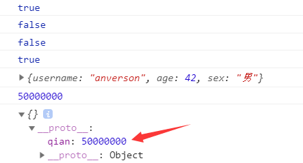

---


## 深度克隆

```
1、数据类型：
  * 数据分为基本的数据类型(String, Number, boolean, Null, Undefined)和对象数据类型
  - 基本数据类型：
    特点： 存储的是该对象的实际数据
  - 对象数据类型：
    特点： 存储的是该对象在栈中引用，真实的数据存放在堆内存里
2、复制数据
  - 基本数据类型存放的就是实际的数据，可直接复制
    let number2 = 2;
    let number1 = number2;
  - 克隆数据：对象/数组
    1、区别： 浅拷贝/深度拷贝
       判断： 拷贝是否产生了新的数据还是拷贝的是数据的引用
       知识点：对象数据存放的是对象在栈内存的引用，直接复制的是对象的引用
       let obj = {username: 'kobe'}
       let obj1 = obj; // obj1 复制了obj在栈内存的引用
    2、常用的拷贝技术
      1). arr.concat(): 数组浅拷贝
      2). arr.slice(): 数组浅拷贝
      3). JSON.parse(JSON.stringify(arr/obj)): 数组或对象深拷贝, 但不能处理函数数据
      4). 浅拷贝包含函数数据的对象/数组
      5). 深拷贝包含函数数据的对象/数组
```

```javascript
<script type="text/javascript">
  
    /* 堆内存与栈内存之间的操作 */
    //不会影响原数据
    let str = 'abcd';
    let str2 = str;
    console.log(str2);//结果为：abcd
    str2 = '';
    console.log(str);//结果为：abcd
    let bool1 = true;
    let bool2 = bool1;
    bool2 = false;
    console.log(bool1);//结果为：true
  
    //会影响原始数据
    let obj = {username: 'kobe', age: 39};
    let obj1 = obj;
    console.log(obj1);//结果为：{username: "kobe", age: 39}
    obj1.username = 'wade';
    console.log(obj.username);//结果为：wade
	
    //拷贝数组/对象 没有生成新的数据而是复制了一份引用
    let arr = [1, 4, {username: 'kobe', age: 39}];
    let arr2 = arr;
    arr2[0] = 'abcd';
    console.log(arr, arr2);//结果为：(3) ["abcd", 4, {…}]     (3) ["abcd", 4, {…}]

</script> 
```

```javascript
<script type="text/javascript">
  
	/*
	 * 拷贝数据：
	 * 	 基本数据类型：
	 * 	    拷贝后会生成一份新的数据，修改拷贝以后的数据不会影响原数据
	 * 	 对象/数组：
	 * 		拷贝后不会生成新的数据，而是进行引用。修改拷贝以后的数据会影响原数据
	 * 
	 * 拷贝数据的方法：
	 * 	 1. 直接复制给一个变量  //浅拷贝，会影响原数据
	 *   2. Object.assign()  //浅拷贝
	 *   3. Array.prototype.concat()  //浅拷贝
	 * 	 4. Array.prototypr.slice()  //浅拷贝
	 *   5. JSON.parse(JSON.stringify())  //深拷贝（深度克隆） 注意：拷贝的数据不能有函数
	 * 
	 * 浅拷贝(对象/数组)：
	 * 	 特点：拷贝的引用，修改拷贝后的数据会影响原数据，使得原数据不安全
	 * 		    因为对象数据存放的是对象在栈内存的引用，直接复制的是对象的引用，
	 *            新的引用会对原来的堆内存中的数据产生影响
	 * 深拷贝(深度克隆)
	 * 	 特点：拷贝的时候生成新的数据，修改拷贝后的数据不会影响原数据
	 * 		    如果遍历的时候拿到的某一项值不是基本数据类型，则继续对其遍历，
	 * 			  直到这一项值中的全部基本类型
	 */
	let obj = {username: 'kobe'};
	
	/* Object.assign() */
	let obj2 = Object.assign(obj);
	console.log(obj2);//结果为：{username: "kobe"}
	obj.username = 'wade';
	console.log(obj);//结果为：{username: "wade"}
	
	/* Array.prototype.concat() */
	let arr = [1, 3, {username: 'kobe'}];
	let testArr = [2, 4];
//	let arr2 = arr.concat(testArr);
//	console.log(arr2);//结果为：(5) [1, 3, {…}, 2, 4]
	let arr2 = arr.concat();
	console.log(arr2);//结果为：(3) [1, 3, {…}]
	arr2[1] = 'a';
	console.log(arr);//结果为：(3) [1, 3, {…}]   
    //可以发现，不影响原数据，没有影响的本质原因是 相当于遍历后拿到每一项的值
    //相当于 : arr2[0] = 1;  这是基本数据类型，所以才不会影响
  
    //arr[2] = {username: 'kobe'} 是可确定的
    //但是，如果是对象
    arr2[2].username = 'wade';
    console.log(arr);//username变为'wade'  说明影响原数据

	/* Array.prototypr.slice() */
	let arr3 = arr.slice();
	arr3[2].username = 'anverson';
	console.log(arr);//username变为'anverson'  说明影响原数据
	
	/* JSON.parse(JSON.stringify()) */
	let arr4 = JSON.parse(JSON.stringify(arr));//将arr变为JSON字符串后再转换为原生的数组
	console.log(arr4);//username为'anverson'  说明没有影响原数据
	arr4[2].username = 'duncan';
	console.log(arr4);//username为'duncan'
	/* JSON字符串 --> JS数组 ，数据类型发生变化，所以不会影响原数据 */
	
	/*
	 * 思考：
	 * 		 如何实现深度拷贝(克隆)
	 * 		 拷贝的数据里有对象/数组、
	 * 		 拷贝的数据里不能有对象/数组，即使有对象/数组，可以继续遍历对象、数组拿到里边每一项值，
	 * 			 一直到拿到的都是基本数据类型，然后再去复制，这就是深度拷贝(克隆)
	 */
	
	//知识点储备
	/*
	 * 如何判断数据类型： arr --> Array   null --> Null
	 * 1. typeof返回的数据类型：String, Number, Boolean, Undefined. Object, Function
	 * 2. Object.prototype.toString.call(obj)  （取到最原始的toString，通过call去指定目标数据，从而检测出目标数据的数据类型）
	 */
	
	let result = 'abcd';
	console.log(Object.prototype.toString.call(result));//结果为：[object String]
	result = null;
	console.log(Object.prototype.toString.call(result));//结果为：[object Null]
	result = [1, 3];
	console.log(Object.prototype.toString.call(result));//结果为：[object Array]
	console.log(typeof Object.prototype.toString.call(result));//结果为：string
	console.log(Object.prototype.toString.call(result).slice(8, -1));//结果为：Array
	
	//for in 循环
	let obj = {username:'kobe', age: 39};//对象
	for(let i in obj) {//枚举对象
		/* 枚举对象时拿到的是属性名 */
		console.log(i);//结果为：username  age  (属性名)
	}
	
	let arr = [1, 3, 'abc'];//数组
	for(let i in arr) {//枚举数组
		/* 枚举数组时拿到的是下标 */
		console.log(i);//结果为：0 1 2  (下标)
	}
	
	//定义检测数据类型的功能函数
	function checkedType(target) {
		return Object.prototype.toString.call(target).slice(8, -1);
	}
//	console.log(checkedType(result));//结果为：Array

	//自己实现深度克隆 --> 对象/数组
	function clone(target) {
		//判断拷贝的数据类型\
		//初始化变量result 成为最终克隆的数据
		let result, targetType = checkedType(target);
		if(targetType === 'Object') {
			result = {};
		}else if(targetType === 'Array'){
			result = [];
		}else{
			return target;
		}
		
		//遍历目标数据
		for(let i in target){
			//获取遍历数据结构的每一项值
			let value = target[i];
			//判断目标结构里的每一项值是否存在对象/数组，如果是对象/数组，则需要继续遍历
			if(checkedType(value) === 'Object' || checkedType(value) === 'Array'){//对象/数组里嵌套了对象/数组
				//继续遍历获取到的value值
				result[i] = clone(value);
			}else{//获取到的value值是基本的数据类型或者是函数
				result[i] = value;
			}
		}
		return result;
	}
	
	let arr3 = [1, 2, {username: 'kobe', age: 39}];
	let arr4 = clone(arr3);
	console.log(arr4);//结果为：1 2 {username: "kobe", age: 39, userName: "wade"}
	arr4[2].username = 'wade';
	console.log(arr3, arr4);//结果为：arr3的username为'kobe'  arr4的username为'wade'
	
	let obj3 = {username: 'kobe', age: 39};
	let obj4 = clone(obj3);
	console.log(obj4);//结果为：{username: "kobe", age: 39}
	obj4.username = 'wade';
	console.log(obj3, obj4);//结果为：{username: "kobe", age: 39}  {username: "wade", age: 39}
	
</script> 
```

## Set 容器

```
Set容器：无序 不可重复 的多个value的集合体
  * new Set()     创建容器
  * Set(array)		将某个数组本身作为set容器的数据
  * [...new Set(array)]   得到某个数组中的所有元素去重后的新数组
  * add(value)    新增元素
  * delete(value) 删除元素
  * has(value)		检测是否包含某个元素，返回 boolean 值
  * clear()				清空集合，返回 undefined
  * .size					返回集合的元素个数
```

```javascript
<script type="text/javascript">

    let set = new Set([1,2,4,5,3,6]); // 创建map容器
		console.log(set.size); // 6   返回集合的元素个数
    console.log(set); // Set(7) {1, 2, 4, 5, 3, 6}  length为6  因为2重复了，自动去重
    console.log(set.has(7)); // false
    set.add(7); // 新增
    console.log(set.has(7)); // true
    console.log(set); // Set(7) {1, 2, 4, 5, 3, 6, 7}
    set.delete(7) // 删除
    console.log(set); // Set(6) {1, 2, 4, 5, 3, 6}
		
		// Set容器实现了iterator接口，可以使用 for of 遍历
		for(let i of set) {
      console.log(i); // 1 2 3 4 5 6
    }

    set.clear(); // 清空容器
    console.log(set); // Set(0) {}
		
		/* ----------------------- */
		let arr = [1,2,3,4,5,4,3,2,1];

    // 1. 数组去重
    let result1 = [...new Set(arr)];
    console.log(result1); // (5) [1, 2, 3, 4, 5]  自动去重

    // 2. 交集
    let arr2 = [4,5,6,5,6];
    let result2 = [...new Set(arr)].filter(item => new Set(arr2).has(item));
    console.log(result2); // (2) [4, 5]

    // 3. 并集
    let union = [...new Set([...arr, ...arr2])]; // 将2个数组合并后，利用Set容器去重后的数据再变为一个新数组
    console.log(union); // (6) [1, 2, 3, 4, 5, 6]

    // 4. 差集
    let diff = [...new Set(arr)].filter(item => !(new Set(arr2).has(item)));
    console.log(diff); // (3) [1, 2, 3]

</script>
```

## Map 容器

```
Map容器：无序的key不重复的多个key-value的集合体
				“键”的范围不限于字符串，各种类型的值（包括对象）都可以当作键
  * new Map()				 创建容器						 
  * Map(array)			 将某个数组本身作为set容器的数据
  * set(key, value)  新增键值对
  * get(key)				 返回键名对象的键值
  * delete(key)			 删除键值对
  * has(key)				 检测 Map 中是否包含某个元素，返回 boolean 值
  * clear()					 清空集合，返回undefined
  * .size						 返回元素个数
```

```javascript
<script type="text/javascript">

  let map = new Map([['aaa', 'username'], [36, 'age']]);
	console.log(map); // Map(2) {"aaa" => "username", 36 => "age"}
	map.set(78, 'haha'); // 新增
	console.log(map); // Map(3) {"aaa" => "username", 36 => "age", 78 => "haha"}
	map.delete(36); // 删除
	console.log(map); // Map(2) {"aaa" => "username", 78 => "haha"}
  console.log(map.size); // 2
	
  // Map容器实现了iterator接口，可以使用 for of 遍历
  for(let i of map) {
    console.log(i); // ["aaa", "username"]  [78, "haha"]
  }

  map.clear(); // 清空
  console.log(map); // Map(0) {}
    
</script>
```

## for of 遍历

```
for(let value of target){}循环遍历
  1. 遍历数组
  2. 遍历Set容器
  3. 遍历Map容器
  4. 遍历字符串
  5. 遍历伪数组
```

```javascript
<script type="text/javascript">
		
	let arr = [1,2,3,4,5];

  for(let i of arr) {
    console.log(i) // 1 2 3 4 5
  }
    
</script>
```

# ES7

## ** & includes

```
1. 指数运算符(幂): **
2. Array.prototype.includes(value)  判断数组中是否包含指定元素
```

```javascript
<script type="text/javascript">
  
    console.log(3**3); // 27
    
    let arr = [1, 2, 3, 4, 'abc'];
    console.log(arr.includes(2)); //  true
    console.log(arr.includes(5)); //  false

</script>
```

# ES8

## async & await

```
概念： 真正意义上去解决异步回调的问题，让异步代码和同步代码一样
			async函数：
							async函数的返回值为一个Promise对象，且状态由return的结果决定
			await函数：
							await 必须写在 async 声明的函数中
							await 右侧的表达式一般为 Promise 对象
							await 返回的是 Promise 成功的值
							await 的 Promise 失败了, 就会抛出异常, 需要通过 try...catch 捕获处理
语法：
    async function foo(){
      await 异步操作;
      await 异步操作；
    }
本质： Generator的语法糖
特点：
  1、不需要像Generator去调用next方法，遇到await等待，当前的异步操作完成就往下执行
  2、返回的总是Promise对象，可以用then方法进行下一步操作
  3、async取代Generator函数的星号*，await取代Generator的yield
  4、语意上更为明确，使用简单，经临床验证，暂时没有任何副作用
```

```javascript
<script type="text/javascript" src="./js/jquery-1.10.1.min.js"></script>

<script type="text/javascript">

		/* --------------- async的返回值 --------------- */
		async function bar() {
	    return 'aaa'
  		// return new Promise((resolve, reject) => {
      //   resolve('成功');
      // });
		}
		
		const result = bar();
		/* async函数的返回值为一个Promise对象，且状态由return的结果决定
			 async声明的函数中return的值只要不是一个Promise类型的对象，async的返回值就是一个成功状态的Promise
			 async声明的函数中抛出错误，async的返回值就是一个失败状态的Promise
			 async声明的函数中return一个Promise，则async的返回值也是一个Promise，且状态与return的Promise相同
		*/
		console.log(result); // Promise {<resolved>: "aaa"}   

		/* --------------- await的返回值 --------------- */
    function test2() {
      return 'aaa';
    }
    async function asyncPrint() {
      
      /* 如果是普通的函数，返回值是await之后函数执行完的返回值 */
      let result1 = await test2();
      console.log(result1); // aaa

      /* 如果是Promise，返回值是Promise成功状态的值 */
      let result2 = await Promise.resolve('bbb');
      console.log(result2); // bbb

      let result3 = await Promise.resolve();  // 如果没有值，则返回undefined
      console.log(result3); // undefined

      // 如果是reject状态，则报错，需要通过 try...catch 捕获处理 
      result4 = await Promise.reject('ccc');
      console.log(result4); // 报错：Uncaught (in promise) ccc

    }
    asyncPrint();

    /* --------------- 基本使用 --------------- */
		// 案例1
		async function foo() {
      return new Promise(resolve => {
        setTimeout(resolve, 2000);
      })
    }

    async function test() {
      /* 不需要使用Generator中的next()方法，可以直接开始执行 */
      console.log('开始执行', new Date().toTimeString()); // 开始执行 11:31:05 GMT+0800 (中国标准时间)
      await foo(); // 等待2s
      console.log('执行完毕', new Date().toTimeString()); // 2s后打印： 执行完毕 11:31:07 GMT+0800 (中国标准时间)
    }
    test();

		// 案例2
		// 发送 AJAX 请求, 返回的结果是 Promise 对象
    function sendAJAX(url) {
      return new Promise((resolve, reject) => {
        const x = new XMLHttpRequest(); // 创建对象
        x.open('GET', url); // 初始化
        x.send(); // 发送
        x.onreadystatechange = function () { // 事件绑定
          if (x.readyState === 4) {
            if (x.status >= 200 && x.status < 300) {
              resolve(x.response); // 成功
            }else{
              reject(x.status); // 失败
            }
          }
        }
      })
    }

    //  Promise.then的方式
    sendAJAX("https://api.apiopen.top/getJoke").then(value => {
      console.log(value);
    }, reason=>{})

    // async与await的方式
    async function main(){
      let musics = await sendAJAX("https://api.apiopen.top/getJoke");
      console.log(musics);
      let tianqi = await sendAJAX('https://www.tianqiapi.com/api/?version=v1&city=%E5%8C%97%E4%BA%AC&appid=23941491&appsecret=TXoD5e8P')
      console.log(tianqi);
    }

    main();

    // 案例3
    /* 需求：
     * 1、发送ajax请求获取新闻内容
     * 2、新闻内容获取成功后再次发送请求，获取对应的新闻评论内容
     * 3、新闻内容获取失败则不需要再次发送请求。
     */
    async function getNews(url) {
        return new Promise((resolve, reject) => {
          $.ajax({ // jQuery
            method: 'GET',
            url,
 						success: data => resolve(data),
            error: error => reject(error)
          })
        })
    }

    async function sendXml(url) {
      let result1 = await getNews('http://localhost:3000/news?id=7');
      console.log(result1);
      if(!result1){ // 进行判断
         alert('暂时没有新闻可以推送');
         return;
       }
      
      let result2 = await getNews('http://localhost:3000' + result1.commentsUrl);
      console.log(result2);
    }
    sendXml();

		/* -- 案例3.应用技巧 -- */
		// 如果请求失败，作为用户是看不到控制台的反馈的，怎么修改才能使得，用户知道请求失败了呢？
		/* 只列出修改部分的代码 */
    success: data => resolve(data),
    // 将error也用resolve表示，然后可以将参数改为例如false
    error: error => resolve(false) // 此时，返回的是false

    async function sendXml(url) {
       let result1 = await getNews('http://localhost:3000000000/news?id=7'); // 改为错误的参数，此时result的结果为false
       console.log(result1);
       if(!result1){ // 进行判断
         alert('暂时没有新闻可以推送');
         return;
       }
       result = await getNews('http://localhost:3000' + result.commentsUrl);
       console.log(result);
    }

</script>
```

## 对象方法的扩展

```javascript
const aaa = {
  name: "aaa",
  foo: ['a','b','c'],
  bar: [1, 2, 3, 4]
};

// 获取对象所有的键
console.log(Object.keys(aaa)); // ["name", "foo", "bar"]

// 获取对象所有的值
console.log(Object.values(aaa)); // ["aaa", ["a", "b", "c"], [1, 2, 3, 4]]

// entries 获取对象所有的键值对，转化为二维数组 可用于创建 Map
console.log(Object.entries(aaa)); // [["name", "aaa"], ["foo", ['a','b','c']], ["bar", [1, 2, 3, 4]]]
const m = new Map(Object.entries(aaa));
console.log(m); // {"name" => "aaa", "foo" => Array(3), "bar" => Array(4)}
console.log(m.get('foo')); // ["a", "b", "c"]

// 对象属性的描述对象
console.log(Object.getOwnPropertyDescriptors(aaa)); // 结果见下图

// 可用于深层次对象的克隆的具体选项设置
const obj = Object.create(null, {
  name: {
    // 设置值
    value: 'bbb',
    // 属性特性
    writable: true, // 可修改
    configurable: true, // 可配置
    enumerable: true // 可枚举
  } 
});
```

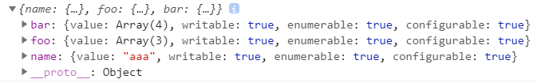

# ES9

## rest参数 & 扩展运算符

注意：在ES6中，rest参数 和 扩展运算符 只针对于数组，在ES9中，则将范围扩展至数组和对象。

```javascript
// rest 参数
function connect({host, port, ...user}) {
  console.log(host); // 127.0.0.1
  console.log(port); // 3306
  console.log(user); // {username: "root", password: "root", type: "master"}
}

connect({
  host: '127.0.0.1',
  port: 3306,
  username: 'root',
  password: 'root',
  type: 'master'
});


// 对象合并
const Q = { q: '天音波' }
const W = { w: '金钟罩' }
const E = { e: '天雷破' }
const R = { r: '猛龙摆尾' }
const DF = { d: '惩戒', f: '闪现'}

const mangseng = {...Q, ...W, ...E, ...R, ...DF};
console.log(mangseng); // {q: "天音波", w: "金钟罩", e: "天雷破", r: "猛龙摆尾", d: "惩戒", f: "闪现"}
```

## 正则扩展

**命名捕获分组**

```javascript
//声明一个字符串
let str1 = '<a href="http://www.baidu.com">百度</a>';

// 提取 url 与 『标签文本』
const reg1 = /<a href="(.*)">(.*)<\/a>/;

// 执行
const result1 = reg1.exec(str1);

// 需要使用下标
console.log(result1); // 见下图
console.log(result1[1]); // http://www.baidu.com
console.log(result1[2]); // 百度


let str2 = '<a href="http://www.atguigu.com">尚硅谷</a>';
// 使用分组命名分组
const reg2 = /<a href="(?<aaa>.*)">(?<bbb>.*)<\/a>/;

const result2 = reg2.exec(str2);

// 不使用下标，而使用别名，这样可以避免下标变化导致的代码更改
console.log(result2); // 见下图
console.log(result2.groups.aaa); // http://www.atguigu.com
console.log(result2.groups.bbb); // 尚硅谷
```

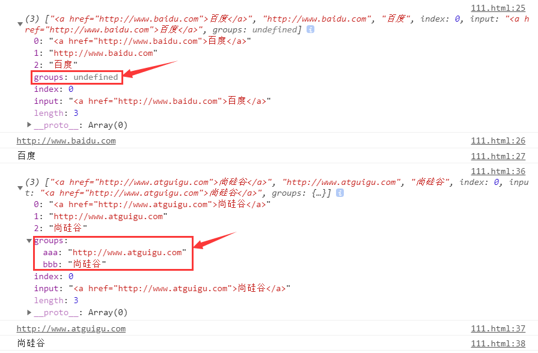

---

**反向断言**

```javascript
// 声明字符串  提取`555`
let str = 'JS5211314你知道么555啦啦啦';

// 正向断言  根据目标`后面`的内容作唯一性的识别
const reg1 = /\d+(?=啦)/;
const result1 = reg1.exec(str);
console.log(result1); // 结果见下图

// 反向断言  根据目标`前面`的内容作唯一性的识别
const reg2 = /(?<=么)\d+/;
const result2 = reg2.exec(str);
console.log(result2); // 结果见下图
```

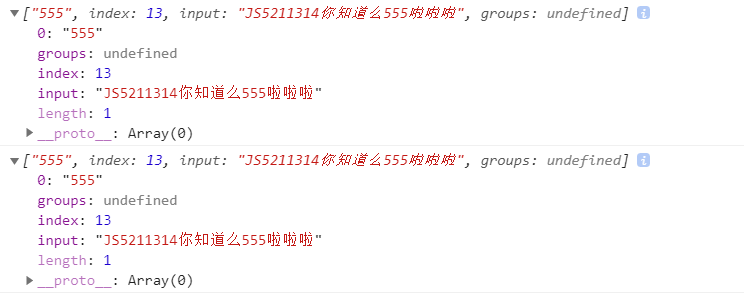

---

**dotAll模式**

```javascript
// dot  .  元字符  除换行符以外的任意单个字符，减小换行符的干扰
let str = `
<ul>
  <li>
    <a>肖生克的救赎</a>
    <p>上映日期: 1994-09-10</p>
  </li>
  <li>
    <a>阿甘正传</a>
    <p>上映日期: 1994-07-06</p>
  </li>
</ul>`;

// 声明正则  提取`肖生克的救赎`
const reg1 = /<li>\s+<a>(.*?)<\/a>\s+<p>(.*?)<\/p>/; // 换行符需要 \s
const reg2 = /<li>.*?<a>(.*?)<\/a>.*?<p>(.*?)<\/p>/s; // 换行符用 .*  注意：末尾需要加上模式修正符 s

// 执行匹配
const result1 = reg1.exec(str);
console.log(result1);
const result2 = reg2.exec(str);
console.log(result2);
```

# ES10

## 对象方法扩展 Object.fromEntries

```javascript
// Object.fromEntries 将二维数组转化为对象 可以看作 Object.entries ES8 的逆运算
const result1 = Object.fromEntries([
  ['姓名', 'aaa'],
  ['年龄', 18]
]);
console.log(result1); // {姓名: "aaa", 年龄: 18}

// Object.entries ES8 将对象转化为二维数组
const arr = Object.entries({
  '姓名': "aaa",
  '年龄': 18
})
console.log(arr); // [["姓名", "aaa"], ["年龄", 18]]
```

## 字符串方法扩展 trimStart & trimEnd

```javascript
// trim  清除字符串两侧的空白
let str = '   iloveyou   ';

console.log(str.trim()); // 'iloveyou'

// trimStart() 清除字符串左侧的空白
console.log(str.trimStart()); // 'iloveyou   '

// trimEnd() 清除字符串右侧的空白
console.log(str.trimEnd()); // '   iloveyou'
```

## 数组方法扩展 flat & flatMap

```javascript
// flat 将多维数组转化为低维数组
const arr1 = [1,2,3,4,[5,6]];
const arr2 = [1,2,3,4,[5,6,[7,8,9]]];
// 参数表示要下降的维度 默认为1 例如，三维数组.flat(2) 表示下降2个维度，变为一维数组
console.log(arr1.flat()); // [1, 2, 3, 4, 5, 6]
console.log(arr2.flat(1)); // [1, 2, 3, 4, 5, 6, [7, 8, 9]]
console.log(arr2.flat(2)); // [1, 2, 3, 4, 5, 6, 7, 8, 9]

// flatMap  可以看作是 flat() 和 map() 方法的结合
const arr3 = [1, 2, 3, 4];

const result1 = arr3.map(item => [item * 10]);
console.log(result1); // [[10], [20], [30], [40]]  二维数组

const result2 = arr3.flatMap(item => [item * 10]);
console.log(result2); // [10, 20, 30, 40]  一维数组
```

## Symbol.prototype.description

```javascript
let s = Symbol('aaa');
console.log(s.description); // aaa
```

# ES11

## 私有属性

```javascript
class Person{
  // 公有属性
  name;
  // 私有属性，只能在类中访问
  #age;
  #weight;
  // 构造方法
  constructor(name, age, weight){
    this.name = name;
    this.#age = age;
    this.#weight = weight;
  }

  intro(){
    console.log(this.name); // 可以正常打印
    console.log(this.#age); // 可以正常打印
    console.log(this.#weight); // 可以正常打印
  }
}

const girl = new Person('小红', 18, '45kg');

console.log(girl.name); // 可以正常打印
console.log(girl.#age); // 报错：Uncaught SyntaxError: Private field '#age' must be declared in an enclosing class
console.log(girl.#weight); // 报错：Uncaught SyntaxError: Private field '#weight' must be declared in an enclosing class

girl.intro();
```

## Promise.allSettled

```
使Promise始终成功，即始终会执行.then的第一个回调函数，并返回真正的状态和结果
参数是一组包含Promise实例的数组，返回值是一个新的Promise实例，其实例在调用then方法中的回调函数的参数仍是一个数组。

适用场景：例如，3个接口分别显示3部分内容，如果使用Promise.allSettle，则即使其中有1/2个接口失效，仍然会有部分内容显示，只需过滤掉状态为rejected的数据即可；而如果使用Promise.all，则一旦其中有1个接口失效，则3个接口的数据全都无法获取，所有内容都无法显示。
```

```javascript
const p1 = new Promise((resolve, reject) => {
  setTimeout(()=>{
    resolve('商品数据 - 1');
  },1000)
});

const p2 = new Promise((resolve, reject) => {
  setTimeout(()=>{
    // resolve('商品数据 - 2');
    reject('出错啦!');
  },1000)
});

const result = Promise.allSettled([p1, p2]);
console.log(result); // 结果见下图    fulfilled和resolve一样，表示成功

Promise.allSettled([p1, p2]).then(args => {
  console.log(args); 
  /* 
    [
      {status: "fulfilled", value: "商品数据 - 1"}, 
      {status: "rejected", reason: "出错啦!"}
    ]
  */
})

// 过滤出成功的请求
const success = result.then(args => {
  const suc = args.filter(p => p.status === 'fulfilled');
  console.log(suc); // {status: "fulfilled", value: "商品数据 - 1"}
})

// 过滤出失败的请求，并输出原因
const errors = result.then(args => {
  const err = args.filter(p => p.status === 'rejected').map(p => p.reason);
  console.log(err); // ["出错啦!"]
})
```

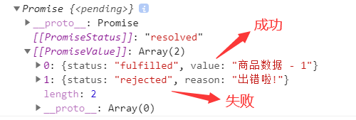

## String.prototype.matchAll

```javascript
// String.prototype.matchAll 用来得到正则批量匹配的结果

let str = `<ul>
    <li>
        <a>肖生克的救赎</a>
        <p>上映日期: 1994-09-10</p>
    </li>
    <li>
        <a>阿甘正传</a>
        <p>上映日期: 1994-07-06</p>
    </li>
</ul>`;

// 声明正则
const reg = /<li>.*?<a>(.*?)<\/a>.*?<p>(.*?)<\/p>/sg

const result = str.matchAll(reg);
console.log(result); // 结果见下图

// 方式一
for(let v of result){
  console.log(v);
}

// 方式二
const arr = [...result];
console.log(arr);
```

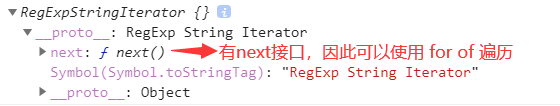

---

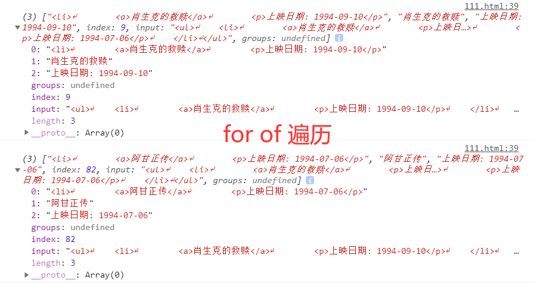

---

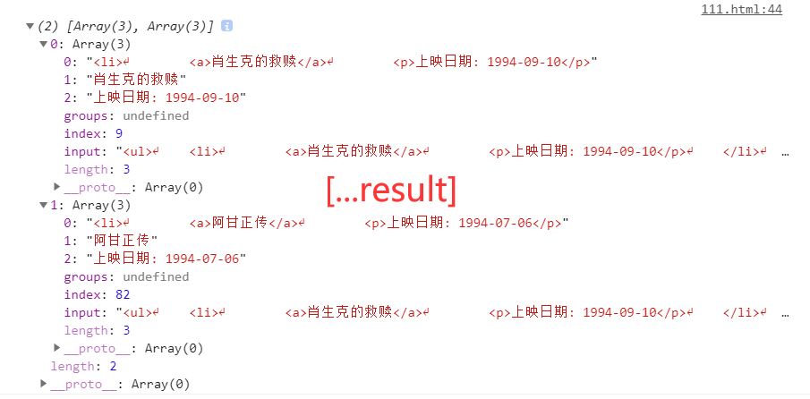

## 可选链操作符

```javascript
// ?. 如果前面那个属性存在，则读取后面那个属性   避免多层判断
function main(config){
	// 之前的判断方法，如果不存在则报错
  const dbHost1 = config && config.db && config.db.host; 
	
  // 使用可选链操作符，如果不存在则返回 undefined ，不会报错
  const dbHost2 = config?.db?.host; 
}

main({
  db: {
    host:'192.168.1.100',
    username: 'root'
  },
  cache: {
    host: '192.168.1.200',
    username:'admin'
  }
})
```

## 动态import

实现按需加载。

```javascript
// app.js

// import * as m1 from "./hello.js"; // 静态导入的方法
const btn = document.getElementById('btn');
btn.onclick = function(){
  // 动态加载，返回的是一个Promise对象
  import('./hello.js').then(module => { // 参数modele就是对应的export的对象
    module.hello();
  });
}
```

```javascript
// hello.js
export function hello(){
  alert('Hello');
}
```

## BigInt

```javascript
// BigInt 大整型
let n = 521n; // n表示BigInt类型
console.log(n, typeof(n)); // 521n  "bigint"

// 函数  将整数变为BigInt类型
let n = 123;  
console.log(BigInt(n)); // 123n
console.log(BigInt(1.2)); // 报错，只能是整数类型

// BigInt主要用于大数值运算
let max = Number.MAX_SAFE_INTEGER;
console.log(max); // 9007199254740991
console.log(max + 1); // 9007199254740992  不能再表示更大的结果
console.log(max + 2); // 9007199254740992  不能再表示更大的结果

console.log(BigInt(max)); // 9007199254740991n
console.log(BigInt(max) + 1); // 报错，BigInt不能与普通类型的整数运算
console.log(BigInt(max) + BigInt(1)); // 9007199254740992n
console.log(BigInt(max) + BigInt(2)); // 9007199254740993n
```

## globalThis

始终指向全局对象。

```javascript
console.log(globalThis); // Window {parent: Window, opener: null, top: Window, length: 0, frames: Window, …}

// 在node.js下则指向 global
```

