# attr & prop

```
###1.什么是attribute，什么是property
	attribute：html标签的预定义属性和自定义属性统称为attribute；attribute本身也是property，只不过比较特殊
	property：js原生对象(节点)的直接属性，我们统称为property
	
	每一个预定义的attribute都会有一个property与之对应

###2.什么是布尔值属性，什么是非布尔值属性
	property的属性值为布尔类型的  我们统称为布尔值属性
	property的属性值为非布尔类型的  我们统称为非布尔值属性

###3.attribute和property的同步关系
	非布尔值属性：不管什么情况，property和attribute都会同步
	布尔值属性：
		      property永远都不会同步attribute
			  在没有动过property的情况下：attribute会同步property
			  在动过property的情况下：attribute不会同步property
				  

###4.用户操作的是property
###5.浏览器认的是property
```

一般来说，**布尔值属性**都推荐使用**.prop**；**非布尔值属性**统一使用**.attr**。

# H5的三个小功能

## classList

因为class是个关键字，所以与class的attribute对应的property不叫class，而叫```className```，但是与className相关的操作不友好，因此H5新增了```classList```

```javascript
<!DOCTYPE html>
<html>
	<head>
		<meta charset="UTF-8">
		<title></title>
	</head>
	<body>
		<div id="test" class="qhf qhf1 qhf2 qhf3">
		</div>
	</body>
	<script type="text/javascript">
		var testNode = document.querySelector("#test");
		//操作className
		console.log(testNode.className);//结果为：qhf qhf1 qhf2 qhf3
		//H5新增了classList
		console.log(testNode.classList);//结果为：DOMTokenList(4) ["qhf", "qhf1", "qhf2", "qhf3", value: "qhf qhf1 qhf2 qhf3"]
		//增加
		testNode.classList.add("qhf4");
		console.log(testNode.classList);//结果为：DOMTokenList(5) ["qhf", "qhf1", "qhf2", "qhf3", "qhf4", value: "qhf qhf1 qhf2 qhf3 qhf4"]
		//删除
		testNode.classList.remove("qhf1");
		console.log(testNode.classList);//结果为：DOMTokenList(4) ["qhf", "qhf2", "qhf3", "qhf4", value: "qhf qhf2 qhf3 qhf4"]
		//如果没有，则新增；如果有，则删除
		testNode.classList.toggle("qhf2");
		testNode.classList.toggle("qhf111");
		console.log(testNode.classList);//结果为：DOMTokenList(4) ["qhf", "qhf3", "qhf4", "qhf111", value: "qhf qhf3 qhf4 qhf111"]
	</script>
</html>
```

## 自定义属性

如下图所示：

其中```qhf```自定义属性是无效的，想要进行操作，则

```javascrript
var testNode = document.querySelector("#test");
testNode.setAttribute("qhf", "111");//将qhf改为111
```

可以看出，这样的操作非常繁琐。
实际上，自定义的属性也有property，叫做```dataset```

```javascript
<!DOCTYPE html>
<html>
	<head>
		<meta charset="UTF-8">
		<title></title>
	</head>
	<body>
		//添加前缀：data-
		<div id="test" data-qhf="qhf"></div>
	</body>
	<script type="text/javascript">
		var testNode = document.querySelector("#test");
		console.log(testNode.dataset.qhf);//结果为：qhf
		testNode.dataset.qhf = "111";
		console.log(testNode.dataset.qhf);//结果为：111
	</script>
</html>
```

此外，可以使用驼峰命名法：
例如，

```javascript
<div id="test" data-atguigu-qhf="qhf"></div>
```

可以写为

```javascript
testNode.dataset.atguiguQhf
```

## 可编辑

看以下代码：

```javascript
<!DOCTYPE html>
<html>
	<head>
		<meta charset="UTF-8">
		<title></title>
		<style type="text/css">
			#test{
				width: 200px;
				height: 200px;
				background: pink;
			}
		</style>
	</head>
	<body>
		/* contenteditable */
		<div id="test" contenteditable="true">
			djhaldhaskj
		</div>
	</body>
</html>
```

此时，内容变为可编辑的：
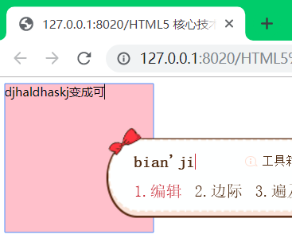

# H5与H4的区别

```
###Html5
	HTML5 是定义 HTML 标准的最新的版本。 该术语表示两个不同的概念：
		它是一个新版本的HTML语言，具有新的元素，属性和行为，
		它有更大的技术集，允许更多样化和强大的网站和应用程序。
				这个集合有时称为HTML5和朋友，通常缩写为HTML5。
	
		HTML5  约等于  HTML + CSS + JS
		
###Html5优势
	跨平台:唯一一个通吃PC MAC Iphone Android等主流平台的跨平台语言
	快速迭代:我们相比于ios、安卓等，代码是存在服务器上的，不需要用户进行下载安装，因此可以频繁地更新代码
	降低成本
	导流入口多:PC端基本都是浏览器或搜索引擎，而手机端则有各种不需要浏览器的链接
	分发效率高
```

- - -

- - -

当我们建立H4的项目：
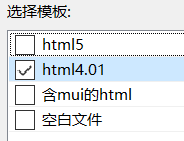
可以发现，与H5的项目是不同的：
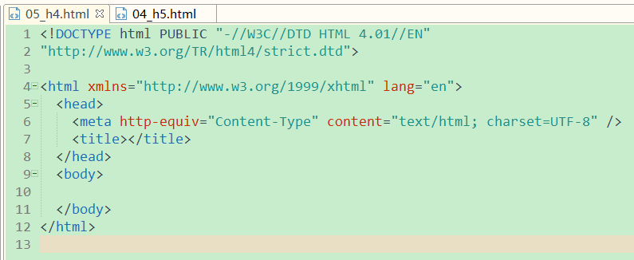
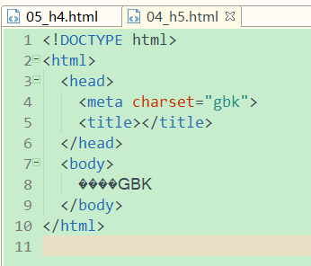
其中，最开始的```<!DOCTYPE html>```表示标准模式，如果没有，则是怪异模式。

- - -

```
### H5
1.DOCTYPE和浏览器渲染模式
	DOCTYPE，或者称为 Document Type Declaration（文档类型声明，缩写 DTD）
	通常情况下，DOCTYPE 位于一个 HTML 文档的最前面的位置，位于根元素 HTML 的起始标签之前。
	因为浏览器必须在解析 HTML 文档正文之前就确定当前文档的类型，以决定其需要采用的渲染模式，
	不同的渲染模式会影响到浏览器对于 CSS 代码甚至 JavaScript 脚本的解析
	
	
	到目前为止，各浏览器主要包含了三种模式。在 HTML5 草案中，更加明确的规定了模式的定义：
	  	 传统名称	    				  		  HTML5 草案名称				 document.compatMode 返回值
	standards mode(strict mode) 		no-quirks mode				    CSS1Compat
	almost standards mode					limited-quirks mode			    CSS1Compat
		quirks mode								      quirks mode					    BackCompat


	document.compatMode
		console.log(document.compatMode);
		document.compatMode 属性最初由微软在 IE 中创造出来，这是一个只读的属性，返回一个字符串，
		只可能存在两种返回值：
			BackCompat：标准兼容模式未开启（怪异模式）
			CSS1Compat：标准兼容模式已开启（标准模式）

	在现代主流浏览器中，其实怪异模式的渲染和标准与几乎标准间没有太大的差别（ie9+ 谷歌 火狐 ...）
    ie5.5之前都是ie自己的渲染模式，怪异模式
    ie6才开始慢慢支持标准，标准模式，在ie6 中怪异和标准模式的区别最大
    ie7 8 9都是基于标准模式升级的，他们理论上存在怪异模式

	HTML5提供的<DOCTYPE html>是标准模式，向后兼容的,等同于开启了标准模式，
	那么浏览器就得老老实实的按照W3C的 标准解析渲染页面
	一个不含任何 DOCTYPE 的网页将会以 怪异(quirks) 模式渲染。
	
2.DTD
	<!DOCTYPE html>
		当 doctype 信息如上时，表明该页面是遵守了 HTML5 规范的，浏览器会选择 Standards Mode，这种 doctype 是最推荐的一种，
	我们平时设计页面都应该加上这一个 doctype。
		HTML5 不基于 SGML,所以不需要引用 DTD,浏览器内部本身有对标签进行解析渲染验证的模块
	
	<!DOCTYPE HTML PUBLIC "-//W3C//DTD HTML 4.01//EN" "http://www.w3.org/TR/html4/strict.dtd">
	当 doctype 如上时，浏览器同样会选择 Standards Mode，虽然和第一种 doctype 有一些区别，但是几乎可以认为是一样的。

	<!DOCTYPE HTML PUBLIC "-//W3C//DTD HTML 4.01 Transitional//EN" "http://www.w3.org/TR/html4/loose.dtd">
	当 doctype 如上时，浏览器会选择 Almost Standards Mode，渲染时和标准会有一些区别

	当 doctype 缺失的时候，浏览器会选择 Quirks Mode，这是非常不推荐的方式，
	当 doctype上面有注释，标签或者空行时，某些浏览器都会认为该页面不具有doctype。
	我们应该尽量避免 Quirks Mode，这对一个 web 应用是非常不利的地方。
	
3.每种doctype在浏览器中对应的渲染模式
	https://en.wikipedia.org/wiki/Quirks_mode
```

- - -

```
###根元素
	H4中的根元素:
		<html xmlns="http://www.w3.org/1999/xhtml">
		
		首先这个标记没有任何问题，你喜欢的话,那就背下来继续用。它是有效的。
		但这个标记中的很多字节在Html5中我们都可以省略了
		
		xmlns:这是XHTML1.0的东西，
			它的意思是在这个页面上的元素都位于http://www.w3.org/1999/xhtml这个命名空间内
			但是HTML5中的每个元素都具有这个命名空间，不需要在页面上再显示指出
			
	H5中的根元素
		<html></html>

```

- - -

```
###head元素
	MIME类型:
		每当浏览器请求一个页面时，web服务器会在发送实际页面内容之前，先发送一些头信息。
		浏览器需要这些信息来决定如何解析随后的页面内容。最重要的是Content-Type

		在H5中，这些已经被放入http协议中。
		
		比如: Content-Type:text/html
		
		text/html:即这个页面的"内容类型",或者称为MIME类型。这个头信息将唯一确定某个资源的本质是什么
		也决定了它应该如何被呈现。
		
		图片也有自己的MIME类型		
			jpg:image/jpeg   
			png:image/png
			
		js也有自己的MIME类型，css也有自己的MIME类型，
			任何资源都有自己的MIME类型，整个web都依靠MIME类型来运作
			
	<meta charset="UTF-8">:
		告诉浏览器你应该使用哪种编码来解析网页

```

# 语义化标签

```
###语义化标签
	在HTML 5出来之前，我们用div来表示页面头部，章节，页脚等。但是这些div都没有实际意义。
	各大浏览器厂商分析了上百万的页面，从中发现了DIV名称的通用id名称大量重复。例如，很多开发人员喜欢使用
	div id="footer"来标记页脚内容，所以Html5元素引入了语义化标签（一组新的片段类元素）
	
	https://dev.opera.com/blog/presentation-html5-and-accessibility-sitting-in-a-tree-4/idlist-url.htm
	https://dev.opera.com/blog/presentation-html5-and-accessibility-sitting-in-a-tree-4/classlist-url.htm
	
	以下为最常用的语义化标签：
	<hgroup></hgroup>
	<header></header>
	<nav></nav>
	<section></section>
	<footer></footer>
	<article></article>
	<aside></aside>

	语义化的好处
		HTML5可以让很多更语义化结构化的代码标签代替大量的无意义的div标签
		这种语义化的特性提升了网页的质量和语义
		对搜索引擎更加的友好
	他们这些标签功能就是代替<div>功能中的一部分，他们没有任何的默认样式，除了会让文本另起一行外；
	https://gsnedders.html5.org/outliner/

	hgroup元素代表 网页 或 section 的标题，当元素有多个层级时，该元素可以将h1到h6元素放在其内，譬如文章的主标题和副标题的组合
	
		<hgroup>
		    <h1>HTML 5</h1>
		    <h2>这是一篇介绍HTML 5语义化标签和更简洁的结构</h2>
		</hgroup>
	
		hgroup使用注意：
			如果只需要一个h1-h6标签就不用hgroup
			如果有连续多个h1-h6标签就用hgroup
			如果有连续多个标题和其他文章数据，h1-h6标签就用hgroup包住，和其他文章元数据一起放入header标签

	header 元素代表 网页 或 section 的页眉。
		通常包含h1-h6元素或hgroup
	
		<header>
		    <hgroup>
		        <h1>网站标题</h1>
		        <h2>网站副标题</h2>
		    </hgroup>
		</header>
		
		header使用注意：
			可以是“网页”或任意“section”的头部部分
			没有个数限制。
			如果hgroup或h1-h6自己就能工作的很好，那就不要用header。

	nav元素代表页面的导航链接区域。用于定义页面的主要导航部分。
	
		<nav>
		    <ul>
		        <li>HTML 5</li>
		        <li>CSS3</li>
		        <li>JavaScript</li>
		    </ul>
		</nav>
		
		nav使用注意：
			用在整个页面主要导航部分上，不合适就不要用nav元素；

	section元素代表文档中的 节 或 段，段可以是指一篇文章里按照主题的分段；节可以是指一个页面里的分组。
	
		<section>
		    <h1>section是啥？</h1>
		    <article>
		        <h2>关于section</h1>
		        <p>section的介绍</p>
		        <section>
		            <h3>关于其他</h3>
		            <p>关于其他section的介绍</p>
		        </section>
		    </article>
		</section>
		
		section使用注意：
			section不是一般意义上的容器元素，如果想作为样式展示和脚本的便利，可以用div。
			article、nav、aside可以理解为特殊的section，
			所以如果可以用article、nav、aside就不要用section，没实际意义的就用div		

	article元素最容易跟section和div容易混淆，其实article代表一个在文档，页面或者网站中自成一体的内容
	
		<article>
		    <h1>一篇文章</h1>
		    <p>文章内容..</p>
		    <footer>
		        <p><small>版权：html5jscss网所属，作者：damu</small></p>
		    </footer>
		</article>
		
		article使用注意：
			独立文章：用article
			单独的模块：用section
			没有语义的：用div

	aside元素被包含在article元素中作为主要内容的附属信息部分，其中的内容可以是与当前文章有关的相关资料、标签、名次解释等
		
		在article元素之外使用作为页面或站点全局的附属信息部分。最典型的是侧边栏，其中的内容可以是日志串连，其他组的导航，甚至广告，这些内容相关的页面。
		
		<article>
		    <p>内容</p>
		    <aside>
		        <h1>作者简介</h1>
		        <p>小北，前端一枚</p>
		    </aside>
		</article>
		
		aside使用总结：
			aside在article内表示主要内容的附属信息，
			在article之外则可做侧边栏
			如果是广告，其他日志链接或者其他分类导航也可以用

	footer元素代表 网页 或 section 的页脚，通常含有该节的一些基本信息，譬如：作者，相关文档链接，版权资料。
	
		<footer>
		    COPYRIGHT@damu
		</footer>
		
		footer使用注意：
			可以是 网页 或任意 section 的底部部分；
			没有个数限制，除了包裹的内容不一样，其他跟header类似。

```

- - -

无语义：

```javascript
/* 无语义 */
<!DOCTYPE html>
<html>
	<head>
		<meta charset="UTF-8">
		<title></title>
	</head>
	<body>
		<div id="header">
			<h1>我是header</h1>
			<h2>我是header的副标题</h2>
		</div>
		<div id="content">
			<h2>我是content</h2>
			<h3>我是header的副标题</h3>
		</div>
		<div id="footer">
			<h2>我是footer</h2>
			<h3>我是footer的副标题</h3>
		</div>
	</body>
</html>

```

语义：

```javascript
/* 语义 */
<!DOCTYPE html>
<html>
	<head>
		<meta charset="UTF-8">
		<title></title>
	</head>
	<body>
		<header>
			<hgroup>
				<h1>我是header</h1>
				<h2>我是header的副标题</h2>
			</hgroup>
		</header>
		<section>
			<header>
				<hgroup>
					<h1>我是content</h1>
					<h2>我是content的副标题</h2>
				</hgroup>
			</header>
		</section>
		<footer>
			<header>
				<hgroup>
					<h1>我是footer</h1>
					<h2>我是footer的副标题</h2>
				</hgroup>
			</header>
		</footer>
	</body>
</html>

```

# 复习1

```
###复习1
	1.width：auto   width：100%
	2.响应式页面
		定制化：修改bootstrap的源文件
				将bootstrap入口less文件作为混合使用
	3.attr&prop
		---什么是attribute？
			html的预定义和自定义属性
		---什么是property？
			js对象身上的直接属性
		---什么是布尔值属性，什么是非布尔值属性？
			property所对应的属性值是否布尔类型
		---attribute和property的同步关系
			非布尔值属性
				实时同步
			布尔值属性
				没有动过property
					attribute会同步property
					property不会同步attribute
				动过property
					attribute不会同步property
					property不会同步attribute
		---浏览器认谁，用户操作的是谁
			property
		---在jQuery中的体现
			attr()
			prop()
		---总结
			布尔值属性最好使用prop方法
			非布尔值属性attr方法
		---html5中有关的属性
			classlist：相对于class的property(className)
				add
				remove
				toggle
			dataset:自定义属性（限制 data-x-y）的property
				
	4.html5导学
		html5的意义，到底什么是html5，html5的优势
		h4与h5的对比
			编码
			渲染模式
			mine类型
		语义化标签
			header
			footer
			section
			nav

```

# canvas

## 基本用法

```
###canvas基本用法
	1.什么是canvas(画布)
			<canvas> 是 HTML5 新增的元素，可用于通过使用JavaScript中的脚本来绘制图形
		例如，它可以用于绘制图形，创建动画。<canvas> 最早由Apple引入WebKit
		我们可以使用<canvas>标签来定义一个canvas元素
			----->使用<canvas>标签时，建议要成对出现，不要使用闭合的形式。
			----->canvas元素默认具有高宽
						width： 300px
						height：150px
		
		画布的颜色默认与背景相同
	2.替换内容
			<canvas>很容易定义一些替代内容。由于某些较老的浏览器（尤其是IE9之前的IE浏览器）
		不支持HTML元素"canvas"，
		但在这些浏览器上你应该要给用户展示些替代内容。
		这非常简单：我们只需要在<canvas>标签中提供替换内容就可以。
			--->支持<canvas>的浏览器将会忽略在容器中包含的内容，并且只是正常渲染canvas。
			--->不支持<canvas>的浏览器会显示代替内容
			
	3.canvas标签的两个属性
			<canvas> 看起来和  元素很相像，唯一的不同就是它并没有 src 和 alt 属性。
		实际上，<canvas> 标签只有两个属性—— width和height。这些都是可选的。
		当没有设置宽度和高度的时候，canvas会初始化宽度为300像素和高度为150像素。
		
		画布的高宽
			html属性设置width height时只影响画布本身不影画布内容
			css属性设置width height时不但会影响画布本身的高宽，还会使画布中的内容等比例缩放（缩放参照于画布默认的尺寸）
		
	4.渲染上下文
			<canvas> 元素只是创造了一个固定大小的画布，要想在它上面去绘制内容，
		我们需要找到它的渲染上下文(可以理解为“画笔”)
			<canvas> 元素有一个叫做 getContext() 的方法，这个方法是用来获得渲染上下文和它的绘画功能。
		getContext()只有一个参数，上下文的格式
			----->获取方式
				  var canvas = document.getElementById('box');
				  var ctx = canvas.getContext('2d');
				  
			----->检查支持性
				  var canvas = document.getElementById('tutorial');
				  if (canvas.getContext){
						var ctx = canvas.getContext('2d');
					} 

```

```javascript
<!DOCTYPE html>
<html>
	<head>
		<meta charset="UTF-8">
		<title></title>
		<style type="text/css">
			*{
				margin: 0;
				padding: 0;
			}
			html,body{
				height: 100%;
				overflow: hidden;
			}
			body{
				background: pink;
			}
			#test{
				background: gray;
				position: absolute;
				left: 0;
				top: 0;
				right: 0;
				bottom: 0;
				margin: auto;
			}
		</style>
	</head>
	<body>
		<canvas id="test" width="300" height="300">
			<span>您的浏览器不支持画布元素 请您换成萌萌的谷歌</span>
		</canvas>
	</body>
	<script type="text/javascript">
		window.onload = function(){
			//querySelector身上有坑，这里暂时先不讲
			//拿到画布
			var canvas = document.querySelector("#test");
			//判断是否有“画笔”
			if(canvas.getContext){
				var ctx = canvas.getContext("2d");
			}
		}
	</script>
</html>

```

## 绘制矩形

```
###canvas绘制矩形
	HTML中的元素canvas只支持一种原生的图形绘制：矩形
	即，只调用一个API所能画出的只有矩形，所有其他的图形的绘制都至少需要生成一条路径

	1.绘制矩形
		canvas提供了三种方法绘制矩形：
			---->绘制一个填充的矩形（填充色默认为黑色）
				fillRect(x, y, width, height)  （x、y参照于画布的左上角）
			---->绘制一个矩形的边框（默认边框为:一像素实心黑色）
				strokeRect(x, y, width, height)
			---->清除指定矩形区域，让清除部分完全透明。(实际上是用画布的背景色进行覆盖，并没有将之前的图形清除)	
				clearRect(x, y, width, height)
				
		x与y指定了在canvas画布上所绘制的矩形的左上角（相对于画布的左上角而不是整个网页）的坐标。
		width和height设置矩形的尺寸。（存在边框的话，边框会在width上占据一个边框的宽度，height同理）
	
	2.strokeRect时，边框像素渲染问题
		按理渲染出的边框应该是1px的，
		canvas在渲染矩形边框时，边框宽度是平均分在偏移位置的两侧。
			context.strokeRect(10,10,50,50)
				:边框会渲染在10.5 和 9.5之间,浏览器是不会让一个像素只用自己的一半的
				  相当于边框会渲染在9到11之间
			context.strokeRect(10.5,10.5,50,50)
				:边框会渲染在10到11之间

		想要有1px的边框：一、调整偏移量；二、clearRect填充底色

	3.添加样式和颜色
		CSS无法拿到画布上的内容，只能影响画布本身，任何canvas上的图形的样式都需要通过canvas的API来处理
		fillStyle   : 设置图形的填充颜色。相当于“画笔”的颜料
		strokeStyle : 设置图形轮廓(边框)的颜色。默认情况下，线条和填充颜色都是黑色(CSS 颜色值 #000000)
		lineWidth : 设置当前绘线的粗细。属性值必须为正数，不能加单位，且是同时向两边延伸。
								描述线段宽度的数字： 0、 负数、 Infinity 和 NaN 会被忽略。
								默认值是1.0
		
		样式的指定必须写在图形的绘制之前。
		因为canvas有自己的渲染模块，与浏览器的机制不同(浏览器的图形渲染速度跟不上JS代码的解析速度[异步])。
		canvas的渲染速度比浏览器更快[同步]
			
	4.lineWidth & 覆盖渲染
		就像在已画的图形上再画其他的图形，就会遮盖之前所画的图形。
		后面代码的图形会遮盖之前代码的图形。
		
	5.lineJoin
		设定线条与线条间接合处的样式（默认是 miter）
		round : 圆角
		bevel : 斜角
		miter : 直角

```

```javascript
<!DOCTYPE html>
<html>
	<head>
		<meta charset="UTF-8">
		<title></title>
		<style type="text/css">
			*{
				margin: 0;
				padding: 0;
			}
			html,body{
				height: 100%;
				overflow: hidden;
			}
			body{
				background: pink;
			}
			#test{
				background: gray;
				position: absolute;
				left: 0;
				top: 0;
				right: 0;
				bottom: 0;
				margin: auto;
			}
		</style>
	</head>
	<body>
		<canvas id="test" width="300" height="300">
			<span>您的浏览器不支持画布元素 请您换成萌萌的谷歌</span>
		</canvas>
	</body>
	<script type="text/javascript">
		window.onload=function(){
			//querySelector身上有坑
			//拿到画布
			var canvas = document.querySelector("#test");
			if(canvas.getContext){
				var ctx = canvas.getContext("2d");
				
				//注意：不能加单位
				//填充的矩形 fillRect(x, y, width, height)  x、y参照于画布的左上角，而不是浏览器的左上角
				ctx.fillRect(0,0,100,100);
				
				/* 样式的指定必须写在图形的绘制之前 */
				//设置图形的填充颜色
				ctx.fillStyle = "deeppink";
				//设置图形轮廓(边框)的颜色
				ctx.strokeStyle = "pink";
				//设置当前绘线的粗细
				ctx.lineWidth = 25;
				//设定线条与线条间接合处的样式
				ctx.lineJoin="round";
				
				//带边框的矩形  strokeRect(x, y, width, height)
				/*
				 * CSS中不支持小数，所有小数都会取整，
				 * 	 例如，100像素的位置 向左0.5至99.5 ，向右0.5至100.5  实际渲染为99~101
				 * 	 而canvas是从指定的值开始向左、右 或 上、下分别渲染边框宽度的一半
				 * 		因此，虽然边框默认为1个像素，实际上，渲染的边框为2个像素
				 * 		  因此，想要有1个像素的边框，则需要偏移量带小数进行调整
				 */
				// 100	: 99.5 --- 100.5(99-101)
				// 100.5: 100  --- 101 
				ctx.strokeRect(100.5,100.5,100,100);
				
				//透明的矩形  clearRect(x, y, width, height)
				ctx.clearRect(100,100,100,100)//此时，剩余1px的边框
			}
		}
	</script>
</html>

```

## 绘制路径

```
###canvas绘制路径
	图形的基本元素是路径。路径是通过不同颜色和宽度的线段或曲线相连形成的不同形状的点的集合。
	
###步骤
	1.首先，你需要创建路径起始点。
	2.然后你使用画图命令去画出路径
	3.之后你把路径封闭。
	4.一旦路径生成，你就能通过描边或填充路径区域来渲染图形。
	
###绘制三角形
	beginPath()
		新建一条路径，生成之后，图形绘制命令被指向到路径上准备生成路径。
		
		生成路径的第一步叫做beginPath()。本质上，路径是由很多子路径构成，这些子路径都是在一个列表中，
		所有的子路径（线、弧形、等等）构成图形。而每次这个方法调用之后，列表清空重置，
		然后我们就可以重新绘制新的图形，而不会影响到之前所绘制的图形。
	
	moveTo(x, y)
		将笔触移动到指定的坐标x以及y上。
		当canvas初始化或者beginPath()调用后，你通常会使用moveTo()函数设置起点
		与 lineTo(x, y) 的区别是不会留下路径，而是直接将“画笔””瞬移“到指定位置，
			就像现实中画画时，将笔抬起来放到一个点，然后开始画新的图形
		
	lineTo(x, y)
		将笔触移动到指定的坐标x以及y上
		绘制一条从当前位置到指定x以及y位置的直线。
	
	closePath()
		闭合路径之后图形绘制命令又重新指向到上下文中。
			闭合路径closePath(),不是必需的。这个方法会通过绘制一条从当前点到开始点的直线来闭合图形。
		如果图形是已经闭合了的，即当前点为开始点，该函数什么也不做
			当你调用fill()函数时，所有没有闭合的形状都会自动闭合，所以你不需要调用closePath()函数。
		但是调用stroke()时不会自动闭合
		
	stroke()
		通过线条来绘制图形轮廓。
		不会自动调用closePath()
		
	fill()
		通过填充路径的内容区域生成实心的图形。
		自动调用closePath()
		
###绘制矩形
	rect(x, y, width, height)
		绘制一个左上角坐标为（x,y），宽高为width以及height的矩形。
		当该方法执行的时候，moveTo()方法自动设置坐标参数（0,0）。
		也就是说，当前笔触自动重置会默认坐标
		
###lineCap
	lineCap 是 Canvas 2D API 指定如何绘制每一条线段末端的属性。
	有3个可能的值，分别是：
		butt  :线段末端以方形结束。 
		round :线段末端以圆形结束。本体的基础上在两端增加。
		square:线段末端以方形结束，但是增加了一个宽度和线段相同，高度是线段厚度一半的矩形区域
	默认值是 butt。
		
###save
	save() 是 Canvas 2D API 通过将当前状态放入栈中，保存 canvas 全部状态的方法
	将样式存入样式栈中。
	
	保存到栈中的绘制状态有下面部分组成：
		当前的变换矩阵。
		当前的剪切区域。
		当前的虚线列表.
		以下属性当前的值： 
						strokeStyle, 
					    fillStyle,  
					    lineWidth, 
			    		lineCap, 
				    	lineJoin
				    	...
					 
###restore
	restore() 是 Canvas 2D API 通过在绘图状态栈中弹出顶端的状态，将 canvas 恢复到最近的保存状态的方法。 
	如果没有保存状态，此方法不做任何改变。	
	将样式栈中最顶端的样式放入样式容器中。
	
	beginPath()不会影响样式栈，只会影响路径。即路径和样式是分开的，互不影响。
		1.路径容器
			每次调用路径api时,都会往路径容器里做登记
			调用beginPath时,清空整个路径容器
		2.样式容器
			每次调用样式api时,都会往样式容器里做登记
			调用save时候,将样式容器里的状态压入样式栈
			调用restor时候,将样式栈的栈顶状态弹出到样式样式容器里,进行覆盖
		3.样式栈
			调用save时候,将样式容器里的状态压入样式栈
			调用restor时候,将样式栈的栈顶状态弹出到样式样式容器里,进行覆盖
			
		最终决定绘制的图形样式的是样式容器中的内容，样式栈只是用来保存某些样式的。
	
	例如：
		ctx.save();//默认为黑色
		ctx.fillStyle="pink";
		ctx.save();//pink
		ctx.fillStyle="deeppink";
		ctx.fillStyle="blue";
		ctx.save();//blue
		ctx.fillStyle="red";
		ctx.save();//red
		ctx.fillStyle="green";
		ctx.save();//green
		
		ctx.restore();//green
		ctx.restore();//red
		ctx.restore();//blue
		ctx.restore();//pink

	在实际开发中，save()和restore()一般成对出现。

```

### 实例1 签名

效果如下图所示：


完整代码如下：

```javascript
/* 签名完整代码 */
<!DOCTYPE html>
<html>
	<head>
		<meta charset="UTF-8">
		<title></title>
		<style type="text/css">
			*{
				margin: 0;
				padding: 0;
			}
			body{
				background: gray;
			}
			#test{
				position: absolute;
				left: 0;
				right: 0;
				top: 0;
				bottom: 0;
				margin: auto;
				background:white;
			}
		</style>
	</head>
	<body>
		<canvas id="test" width="500" height="500"></canvas>
	</body>
	<script type="text/javascript">
		
		window.onload=function(){
			
			var canvas =document.getElementById("test");
			if(canvas.getContext){
				var ctx = canvas.getContext("2d");
			}
			
			canvas.onmousedown=function(ev){
				ev = ev || window.event;
				if(canvas.setCapture){
					canvas.setCapture();
				}
				ctx.beginPath();
				ctx.moveTo(ev.clientX -canvas.offsetLeft,ev.clientY -canvas.offsetTop);
				document.onmousemove=function(ev){
					ctx.save();
					ctx.strokeStyle="pink";
					ev = ev || event;
					ctx.lineTo(ev.clientX -canvas.offsetLeft,ev.clientY -canvas.offsetTop);
					ctx.stroke();
					ctx.restore();
				}
				document.onmouseup=function(){
					document.onmousemove=document.onmouseup=null;
					if(document.releaseCapture){
						document.releaseCapture();
					}
				}
				return false;
			}
			
		}
		
	</script>
</html>

```

## 曲线

```
###角度与弧度的js表达式:radians=(Math.PI/180)*degrees。
###canvas绘制圆形
	arc(x, y, radius, startAngle, endAngle, anticlockwise)
		画一个以（x,y）为圆心的以radius为半径的圆弧（圆），从startAngle开始到endAngle结束
		按照anticlockwise给定的方向（默认为顺时针）来生成。
		ture：逆时针
		false:顺时针
		
		x,y为绘制圆弧所在圆上的圆心坐标
		radius为半径
		startAngle以及endAngle参数用弧度定义了开始以及结束的弧度。角度*Math.PI/180
		这些都是以x轴为基准
		参数anticlockwise 为一个布尔值。为true时，是逆时针方向，否则顺时针方向。

###arcTo
	arcTo(x1, y1, x2, y2, radius)
	根据给定的控制点和半径画一段圆弧
	肯定会从(x1 y1)  但不一定经过(x2 y2);(x2 y2)只是控制一个方向

```

```javascript
<body>
	<canvas id="test" width="300" height="300">
	</canvas>
</body>
<script type="text/javascript">
		var canvas = document.querySelector("#test");
		if(canvas.getContext){
			var ctx = canvas.getContext("2d");
			
			ctx.moveTo(100,100);
			ctx.arc(100,100,50,0,90*Math.PI/180,true);
			ctx.closePath();
			ctx.stroke();
		}
</script>

```

结果如下图所示：
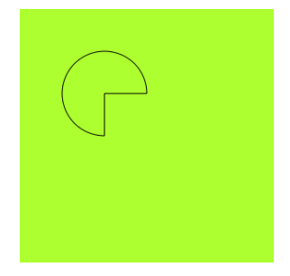

- - -

```javascript
<body>
	<canvas id="test" width="300" height="300">
	</canvas>
</body>
<script type="text/javascript">
		var canvas = document.querySelector("#test");
		if(canvas.getContext){
			var ctx = canvas.getContext("2d");

			ctx.moveTo(50,50)
			ctx.arcTo(300,0,200,200,50);
			ctx.stroke();
		}
</script>

```

结果如下图所示：


```
###二次贝塞尔
	quadraticCurveTo(cp1x, cp1y, x, y)
		绘制二次贝塞尔曲线，cp1x,cp1y为一个控制点，x,y为结束点。
		起始点为moveto时指定的点
		
###三次贝塞尔
	bezierCurveTo(cp1x, cp1y, cp2x, cp2y, x, y)
		绘制三次贝塞尔曲线，cp1x,cp1y为控制点一，cp2x,cp2y为控制点二，x,y为结束点。
		起始点为moveto时指定的点

```

```javascript
<body>
	<canvas id="test" width="300" height="300">
	</canvas>
</body>
<script type="text/javascript">
		var canvas = document.querySelector("#test");
		if(canvas.getContext){
			var ctx = canvas.getContext("2d");
			
			ctx.moveTo(50,50)
			ctx.quadraticCurveTo(300,0,200,200);
			ctx.stroke();
		}
</script>

```

结果如下图所示：
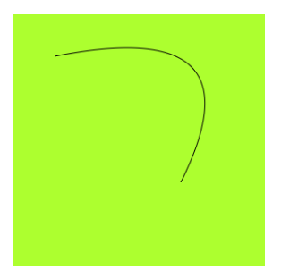

- - -

```javascript
<body>
	<canvas id="test" width="300" height="300">
	</canvas>
</body>
<body>
	<canvas id="test" width="300" height="300">
	</canvas>
</body>
<script type="text/javascript">
		var canvas = document.querySelector("#test");
		if(canvas.getContext){
			var ctx = canvas.getContext("2d");

			ctx.moveTo(50,50)
			ctx.bezierCurveTo(300,0,0,300,300,300);
			ctx.stroke();
		}
</script>

```

结果如下图所示：
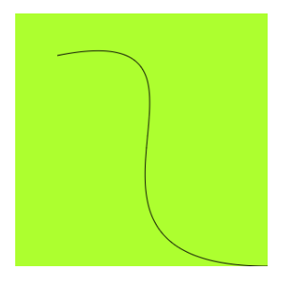

## 变换

```
###canvas中的变换
	translate(x, y)
		改变canvas的原点位置。
		translate 方法接受两个参数。x 是左右偏移量，y 是上下偏移量，
		
		在canvas中translate是累加的，
			例如：ctx.translate(50,50);ctx.translate(50,50); 相当于 ctx.translate(100,100);

	rotate(angle)
		只接受一个参数：旋转的角度(angle)，它是顺时针方向的，以弧度为单位的值。
		旋转的中心点始终是 canvas 的原点，如果要改变它，需要用到 translate 方法
		注意：先translate后rotate 和 先rotate后translate 的结果是不一样的。（例子见下面的代码与图形）
		
		在canvas中rotate是累加的
			例如：ctx.rotate(22.1*Math.PI/180);ctx.rotate(22.9*Math.PI/180); 相当于 ctx.rotate(45*Math.PI/180);
			
	scale(x, y)
		scale 方法接受两个参数。x,y 分别是横轴和纵轴的缩放因子，它们都必须是正值。
		值比 1.0 小表示缩小，比 1.0 大则表示放大，值为 1.0 时什么效果都没有。
		缩放一般我们用它来增减图形在 canvas 中的像素数目，对形状，位图进行缩小或者放大。
		css像素是一个抽象单位，实际尺寸会随着缩放产生变化。
			放大:
				使画布内css像素的个数变少，单个css像素所占据的实际物理尺寸变大
			缩小:
				使画布内css像素的个数变多，单个css像素所占据的实际物理尺寸变小
		
		在canvas中scale是累称的

```

```javascript
<body>
	<canvas id="test" width="300" height="300">
		<span>您的浏览器不支持画布元素 请您换成萌萌的谷歌</span>
	</canvas>
</body>
<script type="text/javascript">
	window.onload=function(){
		var canvas = document.querySelector("#test");
		if(canvas.getContext){
			var ctx = canvas.getContext("2d");
			
			ctx.translate(50,50);//先改变原点位置
			ctx.rotate(45*Math.PI/180);//然后再旋转
			ctx.beginPath();
			ctx.fillRect(100,100,100,100);
		}
	}
</script>

```

结果如下图所示：


- - -

```javascript
<body>
	<canvas id="test" width="300" height="300">
		<span>您的浏览器不支持画布元素 请您换成萌萌的谷歌</span>
	</canvas>
</body>
<script type="text/javascript">
	window.onload=function(){
		var canvas = document.querySelector("#test");
		if(canvas.getContext){
			var ctx = canvas.getContext("2d");
			
			ctx.rotate(45*Math.PI/180);//先旋转
			ctx.translate(50,50);//然后再改变原点位置
			ctx.beginPath();
			ctx.fillRect(100,100,100,100);
		}
	}
</script>

```

结果如下图所示：


### 实例2 旋转+缩放

效果如下图所示：


```javascript
/* 变换实例1 旋转+缩放 完整代码 */
<!DOCTYPE html>
<html>
	<head>
		<meta charset="UTF-8">
		<title></title>
		<style type="text/css">
			*{
				margin: 0;
				padding: 0;
			}
			html,body{
				height: 100%;
				overflow: hidden;
			}
			body{
				background: pink;
			}
			#test{
				background: gray;
				position: absolute;
				left: 0;
				top: 0;
				right: 0;
				bottom: 0;
				margin: auto;
			}
		</style>
	</head>
	<body>
		<canvas id="test" width="300" height="300">
			<span>您的浏览器不支持画布元素 请您换成萌萌的谷歌</span>
		</canvas>
	</body>
	<script type="text/javascript">
		window.onload=function(){
			var flag =0;
			var scale = 0;
			var flagScale = 0;
			var canvas = document.querySelector("#test");
			if(canvas.getContext){
				var ctx = canvas.getContext("2d");
				
				ctx.save();//保存样式
				ctx.translate(150,150);//改变原点位置至画布中心

				ctx.beginPath();//新建一条路径
				ctx.fillRect(-50,-50,100,100);//绘制矩形
				ctx.restore();//弹出样式
				
				/* 相当于绘制第二个图形，覆盖在之前的图形上 */
				setInterval(function(){//设置定时器
					flag++;//用于旋转的角度
					/* 原图形只是用来做变换的基础的，但本身是不需要展示出来的 */
					/* 用背景色覆盖原有的图形 能够保证不影响下一次的定时器的效果 */
					ctx.clearRect(0,0,canvas.width,canvas.height);//用背景色覆盖原有的图形
					ctx.save();//保存样式
					ctx.translate(150,150);//改变原点位置
					ctx.rotate(flag*Math.PI/180);//旋转
					
					/* 缩放 开始 */
					/* 控制在 0~100 之间 */
					if(scale == 100){
						flagScale = -1;
					}else if(scale == 0){
						flagScale = 1;
					}
					scale += flagScale;
					/* 缩放比例在 1/50 ~ 2 之间 */
					ctx.scale(scale/50, scale/50);
					/* 缩放 结束 */
					
					ctx.beginPath();//清理路径
					ctx.fillRect(-50,-50,100,100);//绘制矩形
					ctx.restore();//弹出样式
				},10)
			}
		}
	</script>
</html>

```

### 实例3 时钟

效果如下图所示：


```
1.初始化
	将圆心调整到画布的中间
	由于canvas中画圆与旋转所参照的坐标系于正常坐标系有出入
		将整个画布逆时针旋转90度
	初始化一些样式数据
		ctx.lineWidth = 8;
	  	ctx.strokeStyle = "black";
	  	ctx.lineCap = "round";

2.外层空心圆盘
	圆盘颜色:#325FA2
	圆盘宽度:14
	圆盘半径:140
	
3.时针刻度
	长度为20
	宽度为8
	外层空心圆盘与时针刻度之间的距离也为20
	
4.分针刻度
	宽度为4
	长度为3
	
5.时针
	宽度为14
	圆心外溢出80 收20
	
6.分针
	宽度为10
	圆心外溢出112 收28
	
7.秒针
	颜色:D40000
	宽度为6
	圆心外溢出83 收30
	
	---->中心实心圆盘
		半径为10
	---->秒针头
		96码开外半径为10的空心圆
		宽度为6

```

- - -

先绘制出表盘：

```javascript
<!DOCTYPE html>
<html>
	<head>
		<meta charset="UTF-8">
		<title></title>
		<style type="text/css">
			*{
				margin: 0;
				padding: 0;
			}
			html,body{
				height: 100%;
				overflow: hidden;
				background: pink;
			}
			#clock{
				background: gray;
				position: absolute;
				left: 50%;
				top: 50%;
				transform: translate3d(-50%,-50%,0);
			}
		</style>
	</head>
	<body>
		<canvas id="clock" width="400" height="400"></canvas>
	</body>
	<script type="text/javascript">
		
		window.onload=function(){
			var clock = document.querySelector("#clock");
			if(clock.getContext){
				var ctx = clock.getContext("2d");
				
				ctx.save();
				
					//初始化样式 
					ctx.lineWidth = 8;
			  	ctx.strokeStyle = "black";
			  	ctx.lineCap = "round";
					ctx.translate(200,200);//改变原点位置
					ctx.rotate(-90*Math.PI/180);//旋转坐标轴，此时向上的是x轴正方向，向右的是y轴正方向
	
					//外层空心圆盘
					ctx.beginPath();
					ctx.save();
						ctx.strokeStyle="#325FA2";
						ctx.lineWidth = 14;
						ctx.beginPath();
						ctx.arc(0,0,140,0,360*Math.PI/180);//绘制圆的路径
						ctx.stroke();//圆
					ctx.restore();
	
					//时针刻度
					ctx.save();
						for(var i=0;i<12;i++){//循环绘制时针刻度
							ctx.rotate(30*Math.PI/180);
							ctx.beginPath();
							ctx.moveTo(100,0)
							ctx.lineTo(120,0);
							ctx.stroke();
						}
					ctx.restore();
					
					//分针刻度
					ctx.save();
						ctx.lineWidth=4;
						for(var i=0;i<60;i++){//循环绘制分针刻度
							ctx.rotate(6*Math.PI/180);
							if((i+1)%5!=0){
								ctx.beginPath();
								ctx.moveTo(117,0)
								ctx.lineTo(120,0);
								ctx.stroke();
							}
						}
					ctx.restore();
				
				ctx.restore();
			}
		}
	</script>
</html>

```

效果如下图所示：


- - -

然后再绘制出时针、分针、秒针

```javascript
/* 完整代码 */
<!DOCTYPE html>
<html>
	<head>
		<meta charset="UTF-8">
		<title></title>
		<style type="text/css">
			*{
				margin: 0;
				padding: 0;
			}
			html,body{
				height: 100%;
				overflow: hidden;
				background: pink;
			}
			#clock{
				background: gray;
				position: absolute;
				left: 50%;
				top: 50%;
				transform: translate3d(-50%,-50%,0);
			}
		</style>
	</head>
	<body>
		<canvas id="clock" width="400" height="400"></canvas>
	</body>
	<script type="text/javascript">
		
		window.onload=function(){
			var clock = document.querySelector("#clock");
			if(clock.getContext){
				var ctx = clock.getContext("2d");
				setInterval(function(){
					ctx.clearRect(0,0,clock.width,clock.height);
					move();
				},1000);
				
				move();
				function move(){
					ctx.save();
					ctx.lineWidth = 8;
				  	ctx.strokeStyle = "black";
				  	ctx.lineCap = "round";
					ctx.translate(200,200);//改变原点位置
					ctx.rotate(-90*Math.PI/180);//旋转坐标轴，此时向上的是x轴正方向，向右的是y轴正方向
					ctx.beginPath();
					
					//外层空心圆盘
					ctx.save();
					ctx.strokeStyle="#325FA2";
					ctx.lineWidth = 14;
					ctx.beginPath();
					ctx.arc(0,0,140,0,360*Math.PI/180);//绘制圆的路径
					ctx.stroke();
					ctx.restore();
					
					
					//时针刻度
					ctx.save();
					for(var i=0;i<12;i++){//循环绘制小时的刻度
						ctx.rotate(30*Math.PI/180);
						ctx.beginPath();
						ctx.moveTo(100,0)
						ctx.lineTo(120,0);
						ctx.stroke();
					}
					ctx.restore();
					
					//分针刻度
					ctx.save();
					ctx.lineWidth=4;
					for(var i=0;i<60;i++){//循环绘制分钟的刻度
						ctx.rotate(6*Math.PI/180);
						if((i+1)%5!=0){
							ctx.beginPath();
							ctx.moveTo(117,0)
							ctx.lineTo(120,0);
							ctx.stroke();
						}
					}
					ctx.restore();
					
					//时针 分针 秒针 表座
					var date = new Date();//取得时间
					var s = date.getSeconds();//秒
					var m = date.getMinutes()+s/60;//分
					var h = date.getHours()+m/60;//时
					h = h>12 ? h-12 : h;
					
					//时针
					ctx.save()
					ctx.lineWidth=14;
					ctx.rotate(h*30*Math.PI/180)
					ctx.beginPath();
					ctx.moveTo(-20,0);
					ctx.lineTo(80,0);
					ctx.stroke();
					ctx.restore()
					
					//分针
					ctx.save()
					ctx.lineWidth=10;
					ctx.rotate(m*6*Math.PI/180)
					ctx.beginPath();
					ctx.moveTo(-28,0);
					ctx.lineTo(112,0);
					ctx.stroke();
					ctx.restore()
					
					//秒针
					ctx.save()
					ctx.lineWidth=6;
					ctx.strokeStyle="#D40000";
					ctx.fillStyle="#D40000";
					ctx.rotate(s*6*Math.PI/180)
					ctx.beginPath();
					ctx.moveTo(-30,0);
					ctx.lineTo(83,0);
					ctx.stroke();
						//表座
						ctx.beginPath();
						ctx.arc(0,0,10,0,360*Math.PI/180);
						ctx.fill();
						//秒头
						ctx.beginPath();
						ctx.arc(96,0,10,0,360*Math.PI/180);
						ctx.stroke();
					ctx.restore()
					ctx.restore();
				}
			}
		}
	</script>
</html>

```

## 复习2

```
1.注意点
	---canvas图像的渲染有别于html图像的渲染，
			canvas的渲染极快，不会出现代码覆盖后延迟渲染的问题
			写canvas代码一定要具有同步思想
	---在获取上下文时，一定要先判断
	---画布高宽的问题
		画布默认高宽300*150
		切记一定要使用html的attribute的形式来定义画布的宽高
		通过css形式定义会缩放画布内的图像
	---绘制矩形的问题
		a.边框宽度的问题，边框宽度是在偏移量上下分别渲染一半，可能会出现小数边框，
			一旦出现小数边框都会向上取整
		b.canvas的api只支持一种图像的直接渲染：矩形
	---我们没法使用选择器来选到canvas中的图像
2.画布api
	oc.getContext("2d");
	oc.width
	oc.height
3.上下文api
	ctx.fillRect(x,y,w,h):填充矩形
	ctx.strokeRect(x,ymwmh):带边框的矩形
	ctx.clearRect(0,0,oc.width,oc.height):清除整个画布
		注意原点的位置
	ctx.fillStyle
	ctx.strokeStyle
	ctx.lineWidth
	ctx.lineCap
	ctx.lineJoin
	ctx.moveTo(x,y):将画笔抬起点到x，y处
	ctx.lineTo(x,y):将画笔移到x，y处
	ctx.rect(x,y,w,h)
	ctx.arc(x,y,r,degS,degE,dir)
	ctx.arcTo(x1,y1,x2,y2,r):2个坐标，一个半径
			结合moveTo(x,y)方法使用，
			x,y:起始点
			x1,y1：控制点
			x2,y2：结束点
	ctx.quadraticCurveTo(x1,y1,x2,y2)
			结合moveTo(x,y)方法使用，
			x,y:起始点
			x1,y1：控制点
			x2,y2：结束点
			必须经过起点和终点
	ctx.bezierCurveTo(x1, y1, x2, y2, x3, y3)
			结合moveTo(x,y)方法使用，
			x,y:起始点
			x1,y1：控制点
			x2,y2：控制点
			x3，y3：结束点
			必须经过起点和终点
	ctx.fill()
	ctx.stroke()
	
	ctx.beginpath():清除路径容器
	ctx.closepath():闭合路径
		fill自动闭合
		stroke需要手动闭合
	ctx.save()
		将画布当前状态(样式相关 变换相关)压入到样式栈中
	ctx.restore()
		将样式栈中栈顶的元素弹到样式容器中
		图像最终渲染依赖于样式容器
		
	ctx.translate(x,y):将原点按当前坐标轴位移x，y个单位
	ctx.rotate(弧度):将坐标轴按顺时针方向进行旋转
	ctx.scale(因子):
		放大：放大画布，画布中的一个css像素所占据的物理面积变大，画布中包含的css像素的个数变少
				画布中图像所包含的css像素的个数不变
		缩小：缩小画布，画布中的一个css像素所占据的物理面积变小，画布中包含的css像素的个数变多
				画布中图像所包含的css像素的个数不变

```

## 使用图片

```
###在canvas中插入图片(需要image对象)
	1.canvas操作图片时，必须要等图片加载完才能操作
	2.drawImage(image, x, y, width, height)
		其中 image 是 image 或者 canvas 对象，x 和 y 是其在目标 canvas 里的起始坐标。
		这个方法多了2个参数：width 和 height，这两个参数用来控制 当像canvas画入时应该缩放的大小


###在canvas中设置背景(需要image对象)
	1.createPattern(image, repetition)
		image:图像源
		epetition:
			"repeat" 
			"repeat-x" 
			"repeat-y" 
			"no-repeat" 
			
	一般情况下，我们都会将createPattern返回的对象作为fillstyle的值
			
###渐变
	canvas渐变（线性渐变）
		createLinearGradient(x1, y1, x2, y2)
				表示渐变的起点 (x1,y1) 与终点 (x2,y2)
					
		gradient.addColorStop(position, color)
				gradient :createLinearGradient的返回值
				addColorStop 方法接受 2 个参数，
					position 参数必须是一个 0.0 与 1.0 之间的数值，表示渐变中颜色所在的相对位置。
									例如，0.5 表示颜色会出现在正中间。
					color 参数必须是一个有效的 CSS 颜色值（如 #FFF， rgba(0,0,0,1)，等等）
				
	
	canvas渐变（径向渐变）	
		createRadialGradient(x1, y1, r1, x2, y2, r2)
			前三个参数则定义另一个以(x1,y1) 为原点，半径为 r1 的圆，
			后三个参数则定义另一个以 (x2,y2) 为原点，半径为 r2 的圆。

```

### 实例4 飞鸟

效果如下图所示：


```javascript
/* 飞鸟 完整代码 */
<!DOCTYPE html>
<html>
	<head>
		<meta charset="UTF-8">
		<title></title>
		<style type="text/css">
			*{
				margin: 0;
				padding: 0;
			}
			html,body{
				height: 100%;
				overflow: hidden;
			}
			body{
				background: pink;
			}
			#test{
				background: white;
				position: absolute;
				left: 0;
				top: 0;
				right: 0;
				bottom: 0;
				margin: auto;
			}
		</style>
	</head>
	<body>
		<canvas id="test" width="300" height="300">
			<span>您的浏览器不支持画布元素 请您换成萌萌的谷歌</span>
		</canvas>
	</body>
	<script type="text/javascript">
		window.onload=function(){
			var canvas = document.querySelector("#test");
			//画布为整个页面
			canvas.width = document.documentElement.clientWidth;
			canvas.height = document.documentElement.clientHeight;
			if(canvas.getContext){
				var ctx = canvas.getContext("2d");
				var flag = 0;
				var value=0;//用来改变x轴坐标。使鸟往前飞
				setInterval(function(){
					ctx.clearRect(0,0,canvas.width,canvas.height);//清理之前的图
					value+=10;
					flag++;//用来使用不同的图片
					//循环播放
					if(flag==9){
						flag=1;
					}
					
					var img = new Image();
					img.src="img/q_r"+(flag)+".jpg";//使用不同的图片
					img.onload = function(){
						draw(this);
					}
					
				},100)
				
				function draw(img){
					ctx.drawImage(img,value,0)
				}
				
			}
		}
	</script>
</html>

```

所用到的图片如下：


## 文本相关

```javascript
###在canvas中绘制文本
	canvas 提供了两种方法来渲染文本:
		fillText(text, x, y)
			在指定的(x,y)位置填充指定的文本
		strokeText(text, x, y)
			在指定的(x,y)位置绘制文本边框

###文本样式
	font = value
		当前我们用来绘制文本的样式. 这个字符串使用和 CSS font 属性相同的语法. 
		默认的字体是 10px sans-serif。
		font属性在指定时，必须要有大小和字体 缺一不可

	textAlign = value
		文本对齐选项. 可选的值包括： left, right  center. 
		left
			文本左对齐。
		right
			文本右对齐。
		center
			文本居中对齐。
			这里的textAlign="center"比较特殊。textAlign的值为center时候
			文本的居中是基于你在fillText的时候所给的x的值，
			也就是说文本一半在x的左边，一半在x的右边

	textBaseline = value
		描述绘制文本时，当前文本基线的属性。
		top
			文本基线在文本块的顶部。
		middle
			文本基线在文本块的中间。
		bottom
			文本基线在文本块的底部。

###measureText
	measureText() 方法返回一个 TextMetrics 对象，包含关于文本尺寸的信息（例如文本的宽度）
		
###canvas中文本水平垂直居中
	例如：
		<!DOCTYPE html>
		<html>
			<head>
				<meta charset="UTF-8">
				<title></title>
				<style type="text/css">
					*{margin: 0;padding: 0;}
					body{ background:black;}
					#c1{ background:white;}
				</style>
			</head>
			<body>
				<canvas id="c1" width="400" height="400"></canvas>
			</body>
			<script type="text/javascript">
				window.onload = function(){
					var oC =document.getElementById('c1');
					var oGC = oC.getContext('2d');
					oGC.font = '60px impact';//设置样式
					oGC.textBaseline = 'middle';  //middle bottom
					var w = oGC.measureText('尚硅谷').width;//拿到文本的宽度
					oGC.fillText('尚硅谷',(oC.width - w)/2 , (oC.height - 60)/2);//偏移量
				};
			</script>
		</html>
	
###阴影(文本阴影&盒模型阴影)
	shadowOffsetX = float
		shadowOffsetX 和 shadowOffsetY 用来设定阴影在 X 和 Y 轴的延伸距离，
		它们默认都为 0。
	shadowOffsetY = float
		shadowOffsetX 和 shadowOffsetY 用来设定阴影在 X 和 Y 轴的延伸距离，
		它们默认都为 0。
	shadowBlur = float
		shadowBlur 用于设定阴影的模糊程度，其数值并不跟像素数量挂钩，也不受变换矩阵的影响，默认为 0。
	shadowColor = color(必需项)
		shadowColor 是标准的 CSS 颜色值，用于设定阴影颜色效果，默认是全透明的黑色。

```

## 像素操作

```
###在canvas中的像素操作
		到目前为止，我们尚未深入了解Canvas画布真实像素的原理，事实上，
	你可以直接通过ImageData对象操纵像素数据，直接读取或将数据数组写入该对象中

###得到场景像素数据
	getImageData():获得一个包含画布场景像素数据的ImageData对像,它代表了画布区域的对象数据
	
	ctx.getImageData(sx, sy, sw, sh)
		sx:将要被提取的图像数据矩形区域的左上角 x 坐标。
		sy:将要被提取的图像数据矩形区域的左上角 y 坐标。
		sw:将要被提取的图像数据矩形区域的宽度。
		sh:将要被提取的图像数据矩形区域的高度。
	
###ImageData对象
	ImageData对象中存储着canvas对象真实的像素数据，它包含以下几个只读属性：
		width:图片宽度，单位是像素
		height:图片高度，单位是像素
		data:Uint8ClampedArray类型的一维数组，
			包含着RGBA格式的整型数据，范围在0至255之间（包括255）
			R:0 --> 255(黑色到白色)
			G:0 --> 255(黑色到白色)
			B:0 --> 255(黑色到白色)
			A:0 --> 255(透明到不透明)
			
###在场景中写入像素数据
	putImageData()方法去对场景进行像素数据的写入。
	putImageData(myImageData, dx, dy)
		dx和dy参数表示你希望在场景内左上角绘制的像素数据所得到的设备坐标
		
###创建一个ImageData对象
	ctx.createImageData(width, height);
		width : ImageData 新对象的宽度。
		height: ImageData 新对象的高度。
		
	默认创建出来的是透明的

```

### 单像素操作

```javascript
<!DOCTYPE html>
<html>
	<head>
		<meta charset="UTF-8">
		<title></title>
		<style type="text/css">
			*{
				margin: 0;
				padding: 0;
			}
			html,body{
				height: 100%;
				overflow: hidden;
			}
			body{
				background: pink;
			}
			#test{
				background: gray;
				position: absolute;
				left: 0;
				top: 0;
				right: 0;
				bottom: 0;
				margin: auto;
			}
		</style>
	</head>
	<body>
		<canvas id="test" width="300" height="300">
			<span>您的浏览器不支持画布元素 请您换成萌萌的谷歌</span>
		</canvas>
	</body>
	<script type="text/javascript">
		window.onload=function(){
			var canvas = document.querySelector("#test");
			if(canvas.getContext){
				var ctx = canvas.getContext("2d");
				ctx.save();
				ctx.fillStyle="pink";
				ctx.beginPath();
				ctx.fillRect(50,50,100,100);
				ctx.restore();
				
				//得到像素数据
				var imgdata = ctx.getImageData(0,0,canvas.width,canvas.height);
				
				//使用示例
				for(var i=0; i<imgdata.width; i++){
					setPxInfo(imgdata,30,i,[0,0,0,255]);
				}
				//将设置(更改)后的像素放入
				ctx.putImageData(imgdata,0,0);
				
			}
			
			/* 得到区域内的像素 */
			function getPxInfo(imgdata, x, y){
				var color = [];
				
				var data = imgdata.data;
				var w = imgdata.width;
				var h = imgdata.height;
				
				//(x,y)  x*w+y   
				//获取RGBA值
				//R
				color[0] = data[(y*w+x)*4];
				//G
				color[1] = data[(y*w+x)*4+1];
				//B
				color[2] = data[(y*w+x)*4+2];
				//A
				color[3] = data[(y*w+x)*4+3];
				//返回结果
				return color;
			}
			
			/* 设置(更改)区域内的像素 */
			function setPxInfo(imgdata, x, y, color){
				
				var data = imgdata.data;
				var w = imgdata.width;
				var h = imgdata.height;
				
				//这里以 4×4的区域为例
				//(x,y)  y*w+x   x：多少列  y：多少行  w：一行有多少个像素
				//r
				data[(y*w+x)*4] = color[0];
				//g
				data[(y*w+x)*4+1] = color[1];
				//b
				data[(y*w+x)*4+2] = color[2];
				//a
				data[(y*w+x)*4+3] = color[3];
			}
		}
	</script>
</html>

```

结果如下图所示：


### 实例5 马赛克

```javascript
<!DOCTYPE html>
<html>
	<head>
		<meta charset="UTF-8">
		<title></title>
		<style type="text/css">
			*{
				margin: 0;
				padding: 0;
			}
			html,body{
				height: 100%;
				overflow: hidden;
			}
			#msk{
				position: absolute;
				left: 50%;
				top: 50%;
				transform: translate3d(-50%,-50%,0);
				background: gray;
			}
			
		</style>
	</head>
	<body>
		<canvas id="msk" ></canvas>
	</body>
	<script type="text/javascript">
		var oc = document.querySelector("#msk");
		if(oc.getContext){
			var ctx = oc.getContext("2d");
			var img = new Image();
			img.src="2.png";//引入图片
			img.onload = function(){
				oc.width=img.width*2;//画布的宽度为图片的宽度×2，这里是为了示例对比，见结果图
				oc.height=img.height;//画布的高度为图片的高度
				draw();//调用函数
			}

			function draw(){
				//在画布中引入图片
				ctx.drawImage(img,0,0);
				
				//取得 左边的原图片 的像素数据
				var oldImgdata = ctx.getImageData(0,0,img.width,img.height);
				//设置 右边的马赛克图片
				var newImgdata = ctx.createImageData(img.width,img.height);
				
				/*
				 *	1.选取一个马赛克矩形
				 *	2.从马赛克矩形中随机抽出一个像素点的信息(RGBA值)
				 *	3.将整个马赛克矩形中的像素点都设置为随机抽出的那个像素点
				 */

				//size用于选取一个马赛克矩形，size值越大，模糊程度越高(单个矩形的区域越大)
				var size = 5;
				
				//两个循环用于将马赛克作用在整个图片         
				for(var i=0; i<oldImgdata.width/size; i++){//横向
					for(var j=0; j<oldImgdata.height/size; j++){//纵向
						
						//Math.random()  [0,1)
						//Math.random()*size  [0,5)
						//Math.floor(Math.random()*size) [0,4]
						//从马赛克矩形中随机抽出一个像素点的信息(RGBA值)
						var color = getPxInfo(oldImgdata, i*size+Math.floor(Math.random()*size), j*size+Math.floor(Math.random()*size));
						
						//3.将马赛克矩形中的像素点都设置为随机抽出的那个像素点
						for(var a=0; a<size; a++){
							for(var b=0; b<size; b++){
								setPxInfo(newImgdata, i*size+a,j*size+b, color)
							}
						}
						
					}
				}
				//将经过马赛克后的图片放入画布
				ctx.putImageData(newImgdata,img.width,0);
			}
			
			/* 以下两个函数见 前一节 单像素操作 */
			/* 得到区域内的像素 */
			function getPxInfo(imgdata,x,y){
				var color = [];
				var data = imgdata.data;
				var w = imgdata.width;
				var h = imgdata.height;
				
				color[0]=data[(y*w+x)*4];
				color[1]=data[(y*w+x)*4+1];
				color[2]=data[(y*w+x)*4+2];
				color[3]=data[(y*w+x)*4+3];
				return color;
			}
			
			/* 设置(更改)区域内的像素 */
			function setPxInfo(imgdata,x,y,color){
				var data = imgdata.data;
				var w = imgdata.width;
				var h = imgdata.height;
				data[(y*w+x)*4]=color[0];
				data[(y*w+x)*4+1]=color[1];
				data[(y*w+x)*4+2]=color[2];
				data[(y*w+x)*4+3]=color[3];
			}
		}

	</script>
</html>

```

## 合成

```
###全局透明度的设置
	globalAlpha = value
		这个属性影响到 canvas 里所有图形的透明度，
		有效的值范围是 0.0 （完全透明）到 1.0（完全不透明）
		默认是 1.0
		
###覆盖合成
	source:新的图像(源)
	destination:已经绘制过的图形(目标)

	globalCompositeOperation
		source-over(默认值):源在上面,新的图像层级比较高
		source-in  :只留下源与目标的重叠部分(源的那一部分)
		source-out :只留下源超过目标的部分
		source-atop:砍掉源溢出的部分
		
		destination-over:目标在上面,旧的图像层级比较高
		destination-in:只留下源与目标的重叠部分(目标的那一部分)
		destination-out:只留下目标超过源的部分
		destination-atop:砍掉目标溢出的部分

```

### 实例6 刮刮卡

```javascript
<!DOCTYPE html>
<html>
	<head>
		<meta charset="UTF-8">
		<!-- 以下meta用于移动端 -->
		<meta name="viewport" content="width=device-width,initial-scale=1.0,user-scalable=no"></meta>
		<title></title>
		<style type="text/css">
			*{
				margin: 0;
				padding: 0;
			}
			html,body{
				height: 100%;
				overflow: hidden;
			}
			#wrap,ul,ul>li{
				height: 100%;
			}
			ul>li{
				background: url(img/b.png);//背景图片
				background-size: 100% 100% ;
			}
			canvas{
				position: absolute;
				left: 0;
				top: 0;
			}
		</style>
	</head>
	<body>
		<div id="wrap">
			<canvas></canvas>
			<ul>
				<li></li>
			</ul>
		</div>
	</body>
	<script type="text/javascript">
		window.onload=function(){
			var canvas = document.querySelector("canvas");
			canvas.width = document.documentElement.clientWidth;
			canvas.height = document.documentElement.clientHeight;
			if(canvas.getContext){
				var ctx = canvas.getContext("2d");
				var img = new Image();
				img.src="img/a.png";
				img.onload=function(){
					draw();
				}
				
				function draw(){
					//在画布添加图片
					ctx.drawImage(img,0,0,canvas.width,canvas.height);
					
					//手指触摸
					canvas.addEventListener("touchstart",function(ev){
						ev = ev||event;//移动端兼容
						var touchC = ev.changedTouches[0];//手指点击列表的第一个
						
						var x = touchC.clientX - canvas.offsetLeft;
						var y = touchC.clientY - canvas.offsetTop;

						ctx.globalCompositeOperation="destination-out";//只留下目标超过源的部分
						/* 线段的样式 */
						ctx.lineWidth=40;
						ctx.lineCap="round";//绘制圆形的结束线帽
						ctx.lineJoin="round";//当两条线条交汇时，创建圆形边角
						ctx.save();
						ctx.beginPath();//清除
//						ctx.arc(x,y,20,0,360*Math.PI/180);//用圆的效果不好，详见“其他”一节
						/* 采用线段的方案代替圆形的方案 */
						ctx.moveTo(x,y);
						ctx.lineTo(x+1,y+1);//用线段
						ctx.stroke();
						ctx.restore();
					})
					
					//手指拖动
					canvas.addEventListener("touchmove",function(ev){
						ev = ev || event;//移动端兼容
						var touchC = ev.changedTouches[0];//手指点击列表的第一个
						
						var x = touchC.clientX - canvas.offsetLeft;
						var y = touchC.clientY - canvas.offsetTop;
						
						ctx.save();
//						ctx.arc(x,y,20,0,360*Math.PI/180);
						ctx.lineTo(x,y)
						ctx.stroke();
						ctx.restore();
					})
					
				}
			}
		}
	</script>
</html>

```

所用图片如下：

### 刮刮卡 优化

新增功能：当用户手指抬起时，如果刮开的区域超过一半，则显示剩余部分。

```javascript
/* 刮刮卡 完整代码 */
<!DOCTYPE html>
<html>
	<head>
		<meta charset="UTF-8">
		<!-- 以下meta用于移动端 -->
		<meta name="viewport" content="width=device-width,initial-scale=1.0,user-scalable=no"></meta>
		<title></title>
		<style type="text/css">
			*{
				margin: 0;
				padding: 0;
			}
			html,body{
				height: 100%;
				overflow: hidden;
			}
			#wrap,ul,ul>li{
				height: 100%;
			}
			ul>li{
				background: url(img/b.png);//背景图片
				background-size: 100% 100% ;
			}
			canvas{
				position: absolute;
				left: 0;
				top: 0;
				transition: 1s;/* 缓慢变化 */
			}
		</style>
	</head>
	<body>
		<div id="wrap">
			<canvas></canvas>
			<ul>
				<li></li>
			</ul>
		</div>
	</body>
	<script type="text/javascript">
		window.onload=function(){
			var canvas = document.querySelector("canvas");
			canvas.width = document.documentElement.clientWidth;
			canvas.height = document.documentElement.clientHeight;
			if(canvas.getContext){
				var ctx = canvas.getContext("2d");
				var img = new Image();
				img.src="img/a.png";
				img.onload=function(){
					draw();
				}

				function draw(){
					var flag =0;//用于在“touchend”中计算透明像素的个数
					ctx.drawImage(img,0,0,canvas.width,canvas.height);
					
					//手指触摸
					canvas.addEventListener("touchstart",function(ev){
						ev = ev||event;//移动端兼容
						var touchC = ev.changedTouches[0];//手指点击列表的第一个
						
						var x = touchC.clientX - canvas.offsetLeft;
						var y = touchC.clientY - canvas.offsetTop;

						ctx.globalCompositeOperation="destination-out";//只留下目标超过源的部分
						/* 线段的样式 */
						ctx.lineWidth=40;
						ctx.lineCap="round";//绘制圆形的结束线帽
						ctx.lineJoin="round";//当两条线条交汇时，创建圆形边角
						ctx.save();
						ctx.beginPath();//清除
						/* 采用线段的方案代替圆形的方案 */
						ctx.moveTo(x,y);
						ctx.lineTo(x+1,y+1);//用线段
						ctx.stroke();
						ctx.restore();
					})
					
					//手指拖动
					canvas.addEventListener("touchmove",function(ev){
						ev = ev || event;//移动端兼容
						var touchC = ev.changedTouches[0];//手指点击列表的第一个
						
						var x = touchC.clientX - canvas.offsetLeft;
						var y = touchC.clientY - canvas.offsetTop;
						
						ctx.save();
						ctx.lineTo(x,y)
						ctx.stroke();
						ctx.restore();
					})
					
					canvas.addEventListener("touchend",function(){
						//拿到所有的像素
						var imgData = ctx.getImageData(0,0,canvas.width,canvas.height);
						//计算总共有多少像素点
						var allPx = imgData.width * imgData.height;
						for(var i=0; i<allPx; i++){//循环遍历像素点是否为透明
							if(imgData.data[4*i+3]===0){//如果透明度=0(透明的)
								flag++;
							}
						}
						
						if(flag >= allPx/2){//如果刮开的区域超过一半
							canvas.style.opacity=0;//剩余部分也变为透明(全部的像素点都变为透明)
						}
					})
					
					/* 当全部显示时，清除canvas */
					canvas.addEventListener("transitionend",function(){
						this.remove();
					})
				}
			}
		}

	</script>
</html>

```

### 两个问题

之前说，用两段为圆形的有宽度的线段而不是直接用圆，因为圆的效果不好，为了看得更清楚，设置为如下图所示的效果：

可以发现，当滑动的速度不断增大后，圆与圆之间的距离就会变大，而这一段距离就不会被刮开，如下图所示：


- - -

此外，在PC端，如果按下鼠标滑动时滑出刮刮卡的布局外后，再次进入刮刮卡的布局，即便没有按下鼠标，也会刮开。因为在PC端，鼠标移动事件和鼠标按下事件是分开的，而在手机屏幕上，手指滑动时必然也会触发手指按下的事件。

## 其他

```
###将画布导出为图像
	toDataURL(注意是canvas元素接口上的方法)
	例如：
			var result =  canvas.toDataURL();//生成一个URL
			console.log(result);

###事件操作
	ctx.isPointInPath(x, y)
		判断在当前路径中是否包含检测点
			x:检测点的X坐标
			y:检测点的Y坐标
	注意，此方法只作用于最新画出的canvas图像
	例如：
		<script type="text/javascript">
			window.onload=function(){
				var canvas = document.querySelector("#test");
				if(canvas.getContext){
					var ctx = canvas.getContext("2d");
					ctx.arc(200,200,50,0,360*Math.PI/180);
					ctx.fill();
					
					canvas.onclick = function(ev){
						ev = ev||event;
						var x = ev.clientX - canvas.offsetLeft;
						var y = ev.clientY - canvas.offsetTop;
						if(ctx.isPointInPath(x,y)){
							alert(123);
						}
					}
					
				}
			}
		</script>

```

# 复习3

```
###day09
	1.注意点
		---canvas图像的渲染有别于html图像的渲染，
				canvas的渲染极快，不会出现代码覆盖后延迟渲染的问题
				写canvas代码一定要具有同步思想
		---在获取上下文时，一定要先判断
		---画布高宽的问题
			画布默认高宽300*150
			切记一定要使用html的attribute的形式来定义画布的宽高
			通过css形式定义会缩放画布内的图像
		---绘制矩形的问题
			a.边框宽度的问题，边框宽度是在偏移量上下分别渲染一半，可能会出现小数边框，
				一旦出现小数边框都会向上取整
			b.canvas的api只支持一种图像的直接渲染：矩形
		---我们没法使用选择器来选到canvas中的图像
	2.画布api
		oc.getContext("2d"):获取画布的2d上下文
		oc.width:画布在横向上css像素的个数
		oc.height:画布在纵向上css像素的个数
		oc.toDataUrl():拿到画布的图片地址
	3.上下文api
		ctx.fillRect(x,y,w,h):填充矩形
		ctx.strokeRect(x,ymwmh):带边框的矩形
		ctx.clearRect(0,0,oc.width,oc.height):清除整个画布
			注意原点的位置
		ctx.fillStyle:
			填充颜色
			背景fillStyle的值可以是createPattern(image, repetition)返回的对象
			线性渐变fillStyle的值可以是createLinearGradient(x1, y1, x2, y2))返回的对象
				addColorStop(position, color)
			径向渐变fillStyle的值可以是createRadialGradient(x1, y1, r1, x2, y2, r2)返回的对象
				addColorStop(position, color)
		ctx.strokeStyle:线条颜色
		ctx.lineWidth：线条宽度
		ctx.lineCap：线条两端的展现形式
		ctx.lineJoin：线条连接处的展现形式
		ctx.moveTo(x,y):将画笔抬起点到x，y处
		ctx.lineTo(x,y):将画笔移到x，y处
		ctx.rect(x,y,w,h)
		ctx.arc(x,y,r,degS,degE,dir)
		ctx.arcTo(x1,y1,x2,y2,r):2个坐标，一个半径
				结合moveTo(x,y)方法使用，
				x,y:起始点
				x1,y1：控制点
				x2,y2：结束点
		ctx.quadraticCurveTo(x1,y1,x2,y2)
				结合moveTo(x,y)方法使用，
				x,y:起始点
				x1,y1：控制点
				x2,y2：结束点
				必须经过起点和终点
		ctx.bezierCurveTo(x1, y1, x2, y2, x3, y3)
				结合moveTo(x,y)方法使用，
				x,y:起始点
				x1,y1：控制点
				x2,y2：控制点
				x3，y3：结束点
				必须经过起点和终点
		ctx.fill()
		ctx.stroke()
		
		ctx.beginpath():清除路径容器
		ctx.closepath():闭合路径
			fill自动闭合
			stroke需要手动闭合
		ctx.save()
			将画布当前状态(样式相关 变换相关)压入到样式栈中
		ctx.restore()
			将样式栈中栈顶的元素弹到样式容器中
			图像最终渲染依赖于样式容器
			
		ctx.translate(x,y):将原点按当前坐标轴位移x，y个单位
		ctx.rotate(弧度):将坐标轴按顺时针方向进行旋转
		ctx.scale(因子):
			放大：放大画布，画布中的一个css像素所占据的物理面积变大，画布中包含的css像素的个数变少
					画布中图像所包含的css像素的个数不变
			缩小：缩小画布，画布中的一个css像素所占据的物理面积变小，画布中包含的css像素的个数变多
					画布中图像所包含的css像素的个数不变
		
		ctx.drawImage(img,x,y,w,h)
			:在canvas中引入图片一定在图片加载完成之后再去操作
		ctx.measureText("文本")
			:返回一个持有文本渲染宽度的对象
		ctx.fillText()
		ctx.strokeText()
		ctx.font
		ctx.textAlign
		ctx.textBaseline
		shadowOffsetX = float
		shadowOffsetY = float
		shadowBlur = float
		shadowColor = color(必需项)
		ctx.getImageData(x,y,w,h)
			ImageData对象
				width：选中区域在横向上css像素的个数
				height：选中区域在纵向上css像素的个数
				data:数组
						选中区域所有像素点的rgba信息，rgba的取值从0到255
		ctx.putImageData(imgdata,x,y)
		ctx.createImageData(w,h)
			返回的是imgdata对象 默认像素点的信息是rgba(0,0,0,0)
		ctx.globalAlpha
			取值为0到1
		ctx.globalCompositeOperation
			source-over(默认值):源在上面,新的图像层级比较高
			source-in  :只留下源与目标的重叠部分(源的那一部分)
			source-out :只留下源超过目标的部分
			source-atop:砍掉源溢出的部分
			
			destination-over:目标在上面,旧的图像层级比较高
			destination-in:只留下源与目标的重叠部分(目标的那一部分)
			destination-out:只留下目标超过源的部分
			destination-atop:砍掉目标溢出的部分
		ctx.ispointinpath(x,y)
			x,y这个点是否在路径上
	4.实例
		时钟动画：结合了所有基础api
		飞鸟动画：结合图片创建动画
		马赛克：像素操作
		刮刮卡：合成+像素操作

```

# 音视频

## 音频 & 视频

```
###音频&视频
	大家都有在网页中浏览视频的经历，但在Html5之前，对视频乃至音频都还没有一个标准
	因此在网页中看到的视频，都是通过第三插件的方式嵌入的，可能是QuickTime，也可能是
	RealPlayer 或者 Flash。浏览器很好的整合了这些插件，你完全意识不到它们的存在
	
	在介绍Html5中的音视频标签前，我们需要了解一些概念

	1. 容器
		大多数人会认为视频文件就是 .avi .mp4,但事实上 avi和mp4仅仅是容器的格式，
		它只决定怎么将视频存储起来，而不关系存储的内容。有点类似于.zip
	
		不管是音频文件或视频文件，实际上都只是一个容器文件。这点类似于压缩了一组文件的ZIP文件
		视频文件（视频容器）包含了音频轨道、视频轨道和其他一些元数据。
		视频播放的时候，音频轨道和视频轨道是绑定在一起的。
		元数据包含了视频的封面、标题、子标题、字幕等相关信息。
		
		主流的视频文件格式(容器格式)					主流的音频文件格式
			MPEG-4:	     通常以.mp4为扩展名				MPEG-3  .mp3
			Flash视频: 	 通常以.flv为扩展名				Acc音频  .acc
			Ogg:	     通常以.ogv为扩展名		        Ogg音频  .ogg
			WebM:	     通常以.webm为扩展名
			音频视频交错: 通常以.avi为扩展名
							
	2. 编解码器
		音频和视频编码/解码是一组算法，用来对一段特定音频或视频进行解码和编码，以便
		音频和视频能够播放。原始的媒体文件体积非常巨大，如果不对其进行编码，那么数据量是
		非常惊人的，在互联网上传播则要耗费无法忍受的时间；如果不对其进行解码，就无法将编
		码后的数据重组为原始的媒体数据
		
		      视频编解码器			   音频编解码器			 
				  H.264			    	   AAC
				   VP8					  MPEG-3
			   Ogg Theora				Ogg Vorbis
			
			H.264： 别名 MPEG-4的第十部分,由MPEG研发并于2003年标准化
			  它的目的支持一切设备，无论是低带宽低cpu，还是高带宽高cpu 或者是两者之间。
			  要做到这一点，H.264标准被分成不同的几种配置。高配置使用了更多特性，
			  这会导致在解码过程中更加消耗CPU，但视频文件本身会更小，视频效果也更好 
			  
				苹果iphone手机		基本配置(BaseLine)
				正常的电视机支持      基本配置(BaseLine) 和 主配置(Main)两种
				正常的电脑支持  	    基本配置(BaseLine) 和 主配置(Main) 高级配置(high)三种

		当然有一些编解码器受专利的保护，有一些则是免费的，例如Ogg的Vorbis音频编解码器。
		Ogg的Theora视频编解码器也是可以免费使用的。而想使用H.264的话就需要支付相关的费用了
		
		现在的视频编解码器会使用各种技巧减少从一帧到另一帧过程中传递的信息数量，它们不会存储每一帧的
		所有信息，而只是存储两帧之间的差异信息。
		编码器也分有损和无损，无损视频文件一般太大，在网页中没有优势，所以我们重点研究有损编解码器。
		有损编解码器中，信息在编码过程中丢失是无法避免的，反复的对视频编码会导致其画面不均匀。
		
	3.浏览器对于容器和编解码器支持的情况
		Browser						MP4(H.264 + AAC)	WebM(VP8 + Vorbis )		Ogg(Theora + Vorbis)
		Internet Explorer 9				YES						NO					NO
		Firefox 4.0						NO						YES					YES
		Google Chrome 					YES						YES					YES
		Apple Safari 5					YES						NO					NO
		Opera 10.6						NO						YES					YES
		
		http://www.html5videoplayer.net/html5video/html5-video-browser-compatibility/
		目前还没有一种编解码和容器的组合能应用于所有的浏览器中！！！
		
	4.处理视频的一个流程
		1.制作一个Ogg容器中使用Theora视频和Vorbis音频的版本
		2.制作另外一个版本，使用WebM视频容器（VP8 + Vorbis）
		3.再制作一个版本，使用MP4视频容器，并使用H.264基本配置的视频和ACC低配的音频
		4.链接上面3个文件到同一个video元素，并向后兼容基于Flash的视频播放器	
		
	5. 格式转化
		用 FFmpeg 制作MP4 视频
			ffmpeg -i test.mp4 -c:v libx264 -s 1280x720 -b:v 1500k -profile:v high -level 3.1 -c:a aac -ac 2 -b:a 160k -movflags faststart OUTPUT.mp4
		
		用 FFmpeg 制作 WebM 视频
			ffmpeg -i test.mp4 -c:v libvpx -s 1280x720 -b:v 1500k -c:a libvorbis -ac 2 -b:a 160k OUTPUT.webm
		
		FFmpeg 制作 Ogg 视频
			ffmpeg -i test.mp4 -c:v libtheora -s 1280x720 -b:v 1500k -c:a libvorbis -ac 2 -b:a 160k OUTPUT.ogv
		
		FFmpeg 制作Mp3音频
			ffmpeg -i test.mp3 -c:a libmp3lame -ac 2 -b:a 160k OUTPUT.mp3
			
		FFmpeg 制作Ogg音频
			ffmpeg -i test.mp3 -c:a libvorbis -ac 2 -b:a 160k OUTPUT.ogg
		
		FFmpeg 制作ACC音频	
			ffmpeg -i test.mp3 -c:a aac -ac 2 -b:a 160k OUTPUT.aac

```

- - -

格式转化 示例：
转为WebM格式

找到 ```ffmpeg.exe```：
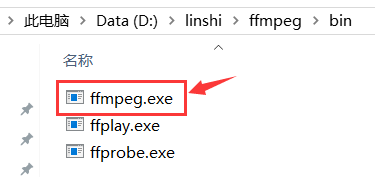
拷贝bin目录的路径：D:\linshi\ffmpeg\bin

控制版面 --> 系统 --> 高级系统设置 --> 环境变量


打开cmd，进入要进行格式转换的视频所在的目录


然后粘贴相关命令并回车：


同时生成格式转换后的文件：


## H5中对音视频的设计

### 兼容模式

```
###html5标签
	<video>:Html5提供的播放视频的标签
		src:资源地址
		controls:该属性定义是显示还是隐藏用户控制界面
		
	<audio>:Html5提供的播放音频的标签
		src:资源地址
		controls:该属性定义是显示还是隐藏用户控制界面
		
	<source>
		source标签可以填写多种格式
		视频：
		type='video/webm; codecs="vp8, vorbis"'
		type='video/ogg; codecs="theora, vorbis"'
		type='video/mp4; codecs="avc1.42E01E, mp4a.40.2"'
		
		音频：
		type='audio/ogg; codecs="vorbis"'
		type='audio/aac; codecs="aac"'
		type='audio/mpeg'

```

浏览器首先会对type进行检测，如果支持type所表示的这种类型，才会去加载对应的资源，不支持则略过，因此一个文件需要有多种的格式，保证浏览器至少能支持其中的一种。

注意：虽然只要浏览器支持type所表示的类型，即便资源的类型与type所表示的不同也依然会加载，但这样是不友好的。

```javascript
<!DOCTYPE html>
<html>
	<head>
		<meta charset="UTF-8">
		<title></title>
	</head>
	<body>
		<video controls width="300" height="300">
			<source src="resource/video/OUTPUT.mp4" type="video/mp4"></source>
			<source src="resource/video/OUTPUT.ogv" type="video/ogg"></source>
			<source src="resource/video/OUTPUT.webm" type="video/webm"></source>
			当前浏览器不支持 video直接播放，点击这里下载视频： <a href="resource/video/OUTPUT.mp4">下载视频</a>
		</video>
		
		<audio controls >
			<source src="resource/audio/OUTPUT.mp3" type='audio/mpeg'></source>
			<source src="resource/audio/OUTPUT.aac" type='audio/aac; codecs="aac"'></source>
			<source src="resource/audio/OUTPUT.ogg" type='audio/ogg; codecs="vorbis"'></source>
			当前浏览器不支持 video直接播放，点击这里下载视频： <a href="resource/audio/OUTPUT.mp3">下载视频</a>
		</audio>
	</body>
</html>

```

### video、audio标签的属性

```
###video标签的属性
	width  :视频显示区域的宽度，单位是CSS像素
	height :视频展示区域的高度，单位是CSS像素
	poster :一个海报帧的URL，用于在用户播放或者跳帧之前展示
	
	src		  :	 要嵌到页面的视频的URL
	controls  :  显示或隐藏用户控制界面
	autoplay  :  媒体是否自动播放
	loop  	  :  媒体是否循环播放
	muted  	  :  是否静音
	preload   :  该属性旨在告诉浏览器作者认为达到最佳的用户体验的方式是什么
				  值：
					none: 提示作者认为用户不需要查看该视频，服务器也想要最小化访问流量；
						  换句话说就是提示浏览器该视频不需要缓存。
					metadata（默认值）: 提示尽管作者认为用户不需要查看该视频，
							     	   不过抓取元数据（比如：长度）还是很合理的。
					auto: 用户需要这个视频优先加载；换句话说就是提示：如果需要的话，
						  可以下载整个视频，即使用户并不一定会用它。
					空字符串: 也就代指 auto 值。

###audio标签的属性	
	与video的标签相同
		src		  
		controls  
		autoplay  
		loop  	  
		muted  	  
		preload   

```

```javascript
<!DOCTYPE html>
<html>
	<head>
		<meta charset="UTF-8">
		<title></title>
	</head>
	<body>
		<video src="resource/video/test.mp4" autoplay muted controls width="500" height="500" poster="resource/img/xfz.png"></video>
		<audio src="resource/audio/test.mp3" autoplay loop "></audio>
	</body>
</html>

```

### js相关属性

```
###音视频js相关属性
	duration    :  媒体总时间(只读)(如果没有加载完就获取，结果为NaN，因此可以用定时器人为延迟，等资源加载完再调用方法)
	currentTime :  开始播放到现在所用的时间(可读写)
	muted       :  是否静音(可读写)
	（muted的优先级比volume高，但是muted和volume之间不会同步，因此，当设置这两个属性时，需要考虑与另一个属性是否冲突）
	volume      :  0.0-1.0的音量相对值(可读写)
	paused      :  媒体是否暂停(只读)
	ended       :  媒体是否播放完毕(只读)
	error       :  媒体发生错误的时候，返回错误代码 (只读)
	currentSrc  :  以字符串的形式返回媒体地址(只读)
	
	视频多出的部分:
		poster：视频播放前的预览图片(读写)
		width、height：设置视频的尺寸(标签的尺寸)(读写)
		videoWidth、 videoHeight：视频的实际尺寸(分辨率)(只读)

###音视频js相关函数
	play()  :  媒体播放
	pause() :  媒体暂停
	load()  :  重新加载媒体

###js相关事件
	视频:
		abort：在播放被终止时触发,例如, 当播放中的视频重新开始播放时会触发这个事件。
		canplay：在媒体数据已经有足够的数据（至少播放数帧）可供播放时触发。这个事件对应CAN_PLAY的readyState。
		canplaythrough：在媒体的readyState变为CAN_PLAY_THROUGH时触发，表明媒体可以在保持当前的下载速度的情况下不被中断地播放完毕。
						注意：手动设置currentTime会使得firefox触发一次canplaythrough事件，其他浏览器或许不会如此。
		durationchange：元信息已载入或已改变，表明媒体的长度发生了改变。
						例如，在媒体已被加载足够的长度从而得知总长度时会触发这个事件。
		emptied：媒体被清空（初始化）时触发。
		ended：播放结束时触发。
		error：在发生错误时触发。元素的error属性会包含更多信息。参阅Error handling获得详细信息。
		loadeddata：媒体的第一帧已经加载完毕。
		loadedmetadata：媒体的元数据已经加载完毕，现在所有的属性包含了它们应有的有效信息。
		loadstart：在媒体开始加载时触发。
		mozaudioavailable：当音频数据缓存并交给音频层处理时。
		pause：播放暂停时触发。
		play：在媒体回放被暂停后再次开始时触发。即，在一次暂停事件后恢复媒体回放。
		playing：在媒体开始播放时触发（不论是初次播放、在暂停后恢复、或是在结束后重新开始）。
		progress：告知媒体相关部分的下载进度时周期性地触发。有关媒体当前已下载总计的信息可以在元素的buffered属性中获取到。
		ratechange：在回放速率变化时触发。
		seeked：在跳跃操作完成时触发。
		seeking：在跳跃操作开始时触发。
		stalled：在尝试获取媒体数据，但数据不可用时触发。
		suspend：在媒体资源加载终止时触发，这可能是因为下载已完成或因为其他原因暂停。
		timeupdate：元素的currentTime属性表示的时间已经改变。
		volumechange：在音频音量改变时触发（既可以是volume属性改变，也可以是muted属性改变）。
		waiting：在一个待执行的操作（如回放）因等待另一个操作（如跳跃或下载）被延迟时触发。

	音频:
		abort：在播放被终止时触发,例如, 当播放中的视频重新开始播放时会触发这个事件。
		canplay：在媒体数据已经有足够的数据（至少播放数帧）可供播放时触发。这个事件对应CAN_PLAY的readyState。
		canplaythrough：在媒体的readyState变为CAN_PLAY_THROUGH时触发，表明媒体可以在保持当前的下载速度的情况下不被中断地播放完毕。
						注意：手动设置currentTime会使得firefox触发一次canplaythrough事件，其他浏览器或许不会如此。
		durationchange：元信息已载入或已改变，表明媒体的长度发生了改变。例如，在媒体已被加载足够的长度从而得知总长度时会触发这个事件。
		emptied：媒体被清空（初始化）时触发。
		ended：播放结束时触发。
		error：在发生错误时触发。元素的error属性会包含更多信息。参阅Error handling获得详细信息。
		loadeddata：媒体的第一帧已经加载完毕。
		loadedmetadata：媒体的元数据已经加载完毕，现在所有的属性包含了它们应有的有效信息。
		loadstart：在媒体开始加载时触发。
		mozaudioavailable：当音频数据缓存并交给音频层处理时。
		pause：播放暂停时触发。
		play：在媒体回放被暂停后再次开始时触发。即，在一次暂停事件后恢复媒体回放。
		playing：在媒体开始播放时触发（不论是初次播放、在暂停后恢复、或是在结束后重新开始）。
		progress：告知媒体相关部分的下载进度时周期性地触发。有关媒体当前已下载总计的信息可以在元素的buffered属性中获取到。
		ratechange：在回放速率变化时触发。
		seeked：在跳跃操作完成时触发。
		seeking：在跳跃操作开始时触发。
		stalled：在尝试获取媒体数据，但数据不可用时触发。
		suspend：在媒体资源加载终止时触发，这可能是因为下载已完成或因为其他原因暂停。
		timeupdate：元素的currentTime属性表示的时间已经改变。
		volumechange：在音频音量改变时触发（既可以是volume属性改变，也可以是muted属性改变）。
		waiting：在一个待执行的操作（如回放）因等待另一个操作（如跳跃或下载）被延迟时触发。

```

## 实例1 音阶导航

```javascript
<!DOCTYPE html>
<html>
	<head>
		<meta charset="UTF-8">
		<title></title>
		<style type="text/css">
			*{
				margin: 0;
				padding: 0;
			}
			html,body{
				height: 100%;
				overflow: hidden;
			}
			body{
				background: pink;
			}
			a{
				text-decoration: none;
				display: block;
				color: black;
			}
			ul{
				list-style: none;
				margin: 200px auto;
				width: 908px;
				height: 38px;
				border: 1px solid;
				overflow: hidden;
			}
			ul>li{
				float: left;
				height: 100%;
				width: 100px;
				text-align: center;
				line-height: 38px;
			}
			ul>li:not(:last-child){
				border-right:1px solid ;
			}
			ul>li>div.down{
				height: 100%;
				background: yellow;
				transition:.5s ;
			}
			ul>li:hover .down{
				transform: translateY(-38px);
			}
			
		</style>
	</head>
	<body>
		<div id="wrap">
			<audio></audio>
			<ul class="nav">
				<li data-flag="a">
					<a href="javascript:;">我的主页</a>
					<div class="down"></div>
				</li>
				<li >
					<a href="javascript:;">新闻头条</a>
					<div class="down"></div>
				</li>
				<li data-flag="b">
					<a href="javascript:;">电视剧</a>
					<div class="down"></div>
				</li>
				<li >
					<a href="javascript:;">最新电影</a>
					<div class="down"></div>
				</li>
				<li data-flag="c">
					<a href="javascript:;">腿长1米8</a>
					<div class="down"></div>
				</li>
				<li>
					<a href="javascript:;">小说大全</a>
					<div class="down"></div>
				</li>
				<li data-flag="d">
					<a href="javascript:;">旅游度假</a>
					<div class="down"></div>
				</li>
				<li>
					<a href="javascript:;">正品团购</a>
					<div class="down"></div>
				</li>
				<li data-flag="e">
					<a href="javascript:;">今日团购</a>
					<div class="down"></div>
				</li>
			</ul>
		</div>
	</body>
	<script type="text/javascript">
//		http://s8.qhimg.com/share/audio/piano1/a4.mp3    a4~g4
		var liNodes = document.querySelectorAll(".nav>li"); 
		var audio = document.querySelector("audio"); 
		for(var i=0; i<liNodes.length; i++){
			liNodes[i].addEventListener("mouseenter",function(){
				var flag = this.getAttribute("flag");
				if(flag){
					audio.src="http://s8.qhimg.com/share/audio/piano1/"+flag+"4.mp3";
					audio.play();
				}
			})
		}
	</script>
</html>

```

结果如下图所示：

当移入奇数格子是有对应的音乐，具体音乐见http://s8.qhimg.com/share/audio/piano1/a4.mp3    其中 a4 可以替换为 a4~g4 

## 实例2 自定义播放器

该实例建议看[视频P37~P43](https://www.bilibili.com/video/av59708667/?p=37)。

## 视频与canvas相结合

```javascript
<!DOCTYPE html>
<html>
	<head>
		<meta charset="UTF-8">
		<title></title>
		<style type="text/css">
			*{
				margin: 0px;
				padding: 0px;
			}
			#oc{
				position: absolute;
				left: 0;
				top: 0;
				right: 0;
				bottom: 0;
				margin: auto;
			}
		</style>
	</head>
	<body>
		<!--放映机-->
		<video autoplay src="http://www.17sucai.com/preview/501914/2017-08-04/%E9%A1%B5%E9%9D%A2/media/mov_bbb.mp4" width="0" height="0"></video>
		<!--荧幕-->
		<canvas id="oc" width="300" height="300"></canvas>
	</body>
	<script type="text/javascript">
		window.onload=function(){
			var oc = document.querySelector("#oc");
			var video = document.querySelector("video");
			if(oc.getContext){
				var ctx = oc.getContext("2d");
				
				video.addEventListener("loadeddata",function(){
					setInterval(function(){
						ctx.drawImage(video,0,0,oc.width,oc.height)
					})
				})
			}
		}
	</script>
</html>

```

# H5新增的其他标签

**以下标签在实际开发中并不常用**

## meter

```
meter:用来显示已知范围的标量值或者分数值。
		默认显示为绿色，低于low或高于high为黄色，
		最多可分为三个区间：min~low、low~high、high~max
	value:当前的数值。
	min:值域的最小边界值。如果设置了，它必须比最大值要小。如果没设置，默认为0
	max:值域的上限边界值。如果设置了，它必须比最小值要大。如果没设置，默认为1
	low:定义了低值区间的上限值,如果设置了，它必须比最小值属性大，并且不能超过high值和最大值。未设置或者比最小值还要小时，其值即为最小值。
	high:定义了高值区间的下限值。如果设置了，它必须小于最大值，同时必须大于low值和最小值。如果没有设置，或者比最大值还大，其值即为最大值。
	optimum:这个属性用来指示最优/最佳取值，optimum的值落在那个区间内，则只有该区间内的值为绿色，
			而且，如果optimum的值在最小/大区间，则中间区间为黄色，最大/小区间为红色，
			例如optimum的值在min~low区间，则low~high为黄色，high~max区间为红色

```

```javascript
<!DOCTYPE html>
<html>
	<head>
		<meta charset="UTF-8">
		<title></title>
	</head>
	<body>
		<meter></meter>
		<meter value=".8"></meter>
		<meter value="60" min="20" max="100"></meter>
		<meter value="50" min="20" max="100" low="40" high="60"></meter>
		<meter value="80" min="20" max="100" low="40" high="60"></meter>
		<meter value="30" min="20" max="100" low="40" high="60" optimum="80"></meter>
	</body>
</html>

```

结果如下图所示：


- - -

## progress

```
progress:用来显示一项任务的完成进度
	max:该属性描述了这个progress元素所表示的任务一共需要完成多少工作.
	value：该属性用来指定该进度条已完成的工作量.
			如果没有value属性,则该进度条的进度为"不确定",
			此时,进度条不会显示任何进度,你无法估计当前的工作会在何时完成，
			进度条会不断地左右移动

```

```javascript
<!DOCTYPE html>
<html>
	<head>
		<meta charset="UTF-8">
		<title></title>
	</head>
	<body>
		<progress value="30" max="100"></progress>
		<progress value="80" max="100"></progress>
		<progress  max="100"></progress>
	</body>
</html>

```

结果如下图所示：


- - -

## detalist

```
datalist:datalist会包含一组option元素，这些元素表示其表单控件的可选值
			它的id必须要和input中的list一致

```

```javascript
<!DOCTYPE html>
<html>
	<head>
		<meta charset="UTF-8">
		<title></title>
		<style type="text/css">
			*{
				margin: 0;
				padding: 0;
			}
			/* 必须通过伪元素来更改placeholder的样式 */
			input::-webkit-input-placeholder{
				color: pink;
			}
		</style>
	</head>
	<body>
		<input type="text" placeholder="你最喜欢的数字是？" list="number"></input>
		<!-- 需要通过 id 进行绑定 -->
		<datalist id="number">
			<option value="1">这个是1</option>
			<option value="2">这个是2</option>
			<option value="3">这个是3</option>
			<option value="4">这个是4</option>
		</datalist>
	</body>
</html>

```

结果如下图所示：
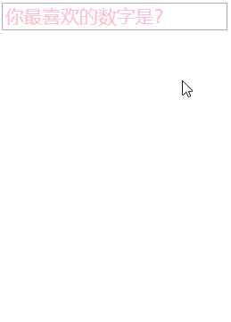
注意：当框中有内容后，再次点击按钮将不会出现列表

- - -

## details & summary

```	
details: 一个ui小部件，用户可以从其中检索附加信息。
		open属性来控制附加信息的显示与隐藏，默认打开附加信息

summary:用作一个<details>元素的一个内容摘要（标题）

```

```javascript
<!DOCTYPE html>
<html>
	<head>
		<meta charset="UTF-8">
		<title></title>
		<style type="text/css">
			*{
				margin: 0;
				padding: 0;
			}
		</style>
	</head>
	<body>
		<details>
			<summary>郭达斯坦森</summary>
			<p>帅啊</p>
			<p>我喜欢</p>
			<p>一个神一样的男人</p>
		</details>
	</body>
</html>

```

结果如下图所示：
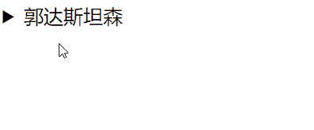

- - -

## ruby

```	
ruby
rt: 展示文字注音或字符注释。

```

```javascript
<!DOCTYPE html>
<html>
	<head>
		<meta charset="UTF-8">
		<title></title>
	</head>
	<body>
		<span>
			呀呀呀呀呀<br />
			<ruby>澧<rt>li</rt>晓飞张</ruby><br />
			啊啊啊啊啊
		</span>
	</body>
</html>

```

结果如下图所示：
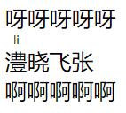     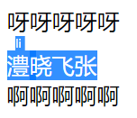

- - -

## mark

```	
mark:着重

```

```javascript
<!DOCTYPE html>
<html>
	<head>
		<meta charset="UTF-8">
		<title></title>
	</head>
	<body>
		<span>晓飞同志是在<mark>世纪佳缘</mark>注册过的会员，他美丽的老婆就是来自于世纪佳缘</span>
	</body>
</html>

```

结果如下图所示：


# H5新增表单格式

```
###新增表单控件
		1.type="email" email地址类型
			当格式不符合email格式时，提交是不会成功的，会出现提示；只有当格式相符时，提交才会通过
			在移动端获焦的时候会切换到英文键盘
			
		2.type="tel 电话类型
			在移动端获焦的时候会切换到数字键盘
		
		3.type="url" url类型
			当格式不符合url格式时，提交是不会成功的，会出现提示；只有当格式相符时，提交才会通过
			
		4.type="search" 搜索类型
			有清空文本的按钮
			
		5.type="range" 特定范围内的数值选择器
			属性:min、max、step
		
		6.
		  type="number"          : 只能包含数字的输入框
		  type="color"  	     : 颜色选择器
		  type="datetime"        : 显示完整日期(移动端浏览器支持)
		  type="datetime-local"  : 显示完整日期，不含时区
		  type="time"            : 显示时间，不含时区
		  type="date"            : 显示日期
		  type="week"            : 显示周
		  type="month"           : 显示月

			
###新增表单属性
		placeholder  :  输入框提示信息
			适用于form,以及type为text,search,url,tel,email,password类型的input
			怎样选中placeholder： ::-webkit-input-placeholder
			
		autofocus  :  指定表单获取输入焦点
		
		required  :  此项必填，不能为空
		
		pattern : 正则表达式  pattern="\d{1,5}"
		
		formaction 在submit里定义提交地址 formaction="http://atguigu.com"/
		
		list和datalist  :  为输入框构造一个选择列表
							list值为datalist标签的id

```

- - -

```
###表单验证反馈
	validity对象，通过下面的valid可以查看验证是否通过，
		如果八种验证都通过返回true，一种验证失败返回false
	node.addEventListener("invalid",fn1,false);
	
	valueMissing  	 :  输入值为空时返回true
	typeMismatch 	 :  控件值与预期类型不匹配返回true
	patternMismatch  :  输入值不满足pattern正则返回true
	
	tooLong  		 :  超过maxLength最大限制返回true
	rangeUnderflow   :  验证的range最小值返回true
	rangeOverflow    :  验证的range最大值返回true
	stepMismatch     :  验证range 的当前值 是否符合min、max及step的规则返回true
	
	customError 不符合自定义验证返回true
		setCustomValidity
		
###关闭验证
	formnovalidate属性

```

```javascript
<!DOCTYPE html>
<html>
	<head>
		<meta charset="UTF-8">
		<title></title>
	</head>
	<body>
		<form >
			<input type="text"  />
			<input type="submit" value="提交"/>
		</form>
	</body>
	<script type="text/javascript">
		
		window.onload=function(){
			var inputEl = document.querySelector("input");
			var submit = document.querySelectorAll("input")[1];
			submit.onclick=function(){
				var val = inputEl.value;
				if(val=="xfz"){
					submit.setCustomValidity("请不要输入敏感词")
				}else{
					submit.setCustomValidity("")
				}
			}
			
			submit.addEventListener("invalid",function(){
				console.log(submit.validity)
			})
		}
	</script>
</html>

```

# 项目实战

见[尚硅谷_HTML5 核心 实战 笔记](https://blog.csdn.net/earthOLtainanwan/article/details/100548166)。