# 像素理论
200px 指的是 200个像素，而不是面积是200。
==屏幕尺寸==指的是屏幕**对角线**的长度。
==屏幕分辨率==指的是 横纵方向上像素点的个数（**物理像素**），单位是px，1px = 1个像素点。一般以纵向像素×横向像素来表示一个手机的分辨率，如1960*1080。要注意的是：这里指的是**物理像素，而不是CSS像素**。
不能用屏幕分辨率数值上的大小来比较两块屏幕的大小，因为分辨率代表的是设备横纵向上的**物理像素的点数**。屏幕的大小比较的是屏幕的尺寸。
==高清屏==指的是**具备足够高的物理像素密度而使人眼无法分辨其中单独像素点的液晶屏**，有如下特点：①一种具备超高像素密度的液晶屏；②同样大小屏幕上显示的像素点由一个变为多个。高清屏与普通屏相比，相同区域的物理像素点数，高清屏是普通屏的4倍。
==屏幕像素密度==，也叫像素密度或屏幕密度，指**屏幕上每英寸可以显示的像素点的数量**，单位是ppi（pixels per inch）。屏幕像素密度与屏幕尺寸和屏幕分辨率有关。
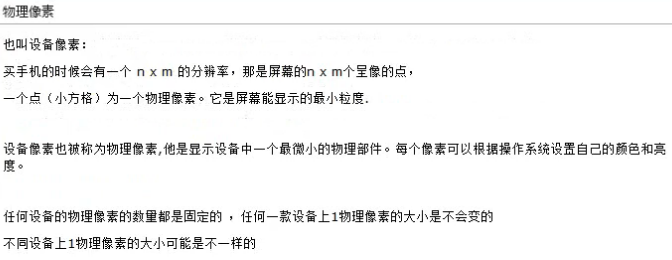
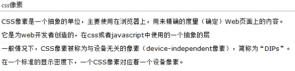
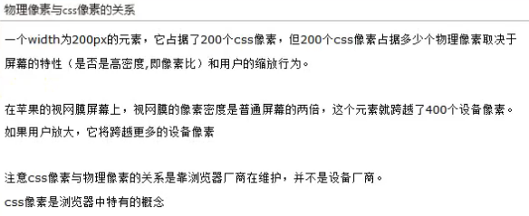
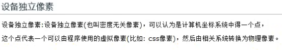
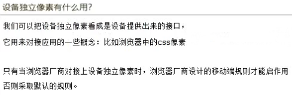
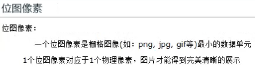
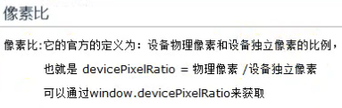
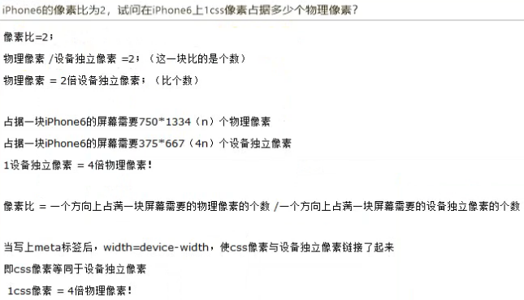
- - -
**总结**：
对于web开发者而言：
我们使用的每一个css和javascript定义的像素本质上代表的都是css像素，我们在开发过程中并不在意一个css像素到底跨越了多少个物理像素。我们将这个依赖于屏幕特性和用户缩放程度的复杂计算交给了浏览器。

物理像素是设备呈像的最小单元
css像素是一个抽象的层，是web开发中的最小单元
位图像素是图片的最小单元。
设备独立像素也是-一个抽象的层，是设备提供出来的接口
像素比：物理像素/设备独立像素
&nbsp;&nbsp;&nbsp;&nbsp;&nbsp;&nbsp;&nbsp;&nbsp;&nbsp;&nbsp;&nbsp;&nbsp;&nbsp;一个方向上占据一块屏幕所需要的物理像素的个数 / 一个方向上占据一块屏幕所需要的设备独立像素的个数

由于物理像素，设备独立像素，像素比都是设备中的概念与浏览器没有一点关系，在设备出厂时这些参数就定了。所以在默认情况下，设备独立像素和像素比在web开发中毫无意义，因为默认情况下，设备独立像素，像素比跟浏览器没有关系，都是设备的东西。

# 视口理论
如何将数量庞大的PC端网页呈现在手机浏览器中？
布局视口决定网页布局，例如要不要换行，一般大小不会变；
视觉视口决定用户能看到多少内容，随缩放的改变而改变，因此决定了CSS像素与物理像素之间的比例。
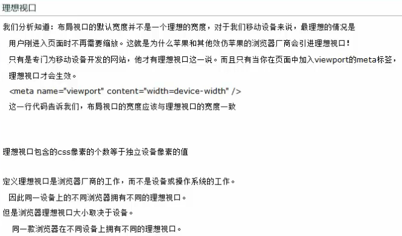
- - -
**布局视口与视觉视口的关系?**
布局视口的出现本质上与设备没有太大的关系，它只规定出现在视口中元素的排列规则，它完全是移动端浏览器的一个属性。
在物理像素与css像素1:1的情况下，我们可以认为布局视口要比设备宽度(分辨率)要大出很多。

视觉视口的出现决定了用户能看到什么，它与设备之间的关系是比较紧密的，因为网页最终是要靠物理像素来显示的。
而且从视觉视口是可以看到整个设备的宽度(分辨率) ；
所以从物理像素的角度出发，视觉视口包含物理像素的个数永远等于设备的分辨率(屏幕中的所有内容用户是完全可以看到的。
从css像素角度出发，我们无法准确的判断视觉视口的尺寸，因为视觉视口所包含的css像素的个数跟用户的缩放行为有关。
默认情况下，即在物理像素与css像素1:1的情况下，我们可以说一个视觉视口包含该设备分辨率的值所代表的css像素个数。
实质上，视觉视口包含了整个布局视口。有些浏览器包含了整个网页。
移动端浏览器在初始化的时候，视觉视口是需要将整个布局视口完整显示出来的，所以移动端浏览器在初始化的时候，物理像素与css像素之间的比例不可能是1:1，这个比例与设备分辨率和布局视口的大小有关。(这个比例本质上和视觉视口有关,因为移动端测览器初始化时视觉视口包含的css像素个数等于布局视口的包含的css像素个数，视觉视口包含的物理像素个数等于设备的分辨率。）

# 如何获取三个视口的宽度
```var layout = document.documentElement.clientWidth;```//布局视口，layout的宽度，没有兼容性问题
```var visual = window .innerWidth;```//视觉视口，visual的宽度，兼容性接近全部支持
```var dream = screen.width;```//理想视口，兼容性有很大的兼容性问题，有些代表理想视口的宽度，有些代表设备的分辨率

# 放大&缩小
放大:
	一个css像素的面积变大,视觉视口内css像素的个数变少,视觉视口的尺寸变小
缩小:
	一个css像素的面积变大,视觉视口内css像素的个数变多,视觉视口的尺寸变大


在pc端，用户缩放影响视口的尺寸（PC端只有一个视口）
在移动端，用户缩放影响视觉视口的尺寸

用户缩放只影响布局视口
系统缩放(代码)参照于理想视口进行缩放，同时影响布局视口和视觉视口

当某个内容过大时（超过视觉视口），我们希望能够是完美视口，出现滚动条，而不是像下图一样：
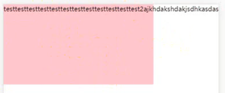
此时，我们需要写如下语句：
```<meta name="viewport" content="width=device-width,initial-scale=1.0"/>```

width=device-width 改变布局视口，initial-scale=1.0 改变布局视口和视觉视口。
```width=device-width```和```initial-scale=1.0```的作用都是将布局视口变为理想视口，但是只有两者都写上时，才变为完美视口，只写其中一个时，只能称为理想视口。
当两者冲突时（例如，```width=device-width```和```initial-scale=3.0```），布局视口取更大的值。

# meta标签
meta标签是专门为移动端准备的。
```<meta name="viewport" content="..."/>```
- - -
```width [pixel_value | devcice-width]```
width可以设置为具体的数值，ios支持这种做法，但是大部分的安卓手机是不支持这样做的，因此，一般不推荐设置为具体的数值。
width=device-width 表示宽度是设备屏幕的宽度。
width就是用来控制布局视口大小的，width=device- width会使布局视口的大小变成理想视口的大小(即独立设备像素代表的大小)。
- 浏览器支持width的最大值为10000个像素，最小值为理想视口的20%。
- 安卓的webkit不允许小于布局视口的宽度，如果你指定了一个小于布局视口的值，它默认
会转为布局视口的大小，通常是980。
- ie10不允许超出480px的值，超出则会自动转为布局视口的默认宽度1024px。
- 95%的浏览器都支持width=device- width。

```initial-scale```
初始缩放比例。例如：initial-scale=1.0
缩放是根据理想视口来计算的，这个缩放不同于我们用户的缩放，它会使布局视口跟随着我们的视觉视口一起转变，所以只设置inital-scale=1其实等同于只设置width=device- width
旋转（横竖屏切换）：
当用户旋转设备时，布局视口的宽度通常会发生改变。因为横竖屏时的理想视口尺寸不一样。ios的safari是例外，基于性能的考虑，它的布局视口不会因此做出改变。但ios的safari在inital-scale设置的情况下，当用户旋转设备时，ios的safan布局视口的宽度会发生改变。
如果只设置inital-scale，ie10在旋转时就会有问题。
如果只设置width=device-width，safari在旋转时就会有问题。

```user-scalable [yes | no]```
是否允许缩放，默认允许，但一般设为不允许。例如：user-scalable=no

```minimum-scale```
允许缩放的最小比例。
```maximum-scale```
允许缩放的最大比例。
ios10不支持user-scalable，因此，不允许缩放时一般都将```user-scalable=no```，```minimum-scale=1.0```，```maximum-scale=1.0```同时写上。

target-densitydpi和height一般不会用到，因此这里就不展开。

# 总结
```
	4个像素
		物理
		css
		独立
		位图
	3个视口
		布局
		视觉
		理想
	2个操作
		放大
		缩小
	1个比例
		像素比
###布局视口和视觉视口
	layout viewport:
			手机上，为了容纳为桌面浏览器设计的网站，默认的布局视口的宽度远大于屏幕的宽度
			布局视口的出现，在极大程度上帮助了桌面网站到移动设备上的转移。
			可以通过document.documentElement.clientWidth来获取 
				在pc端，单独一个width为20%的元素最终拿到的值要根据初始包含块的width来决定，因为我们横向的布局都是
			按初始包含块开始填的，在移动端一样，不过我们这个时候应该叫它布局视口。
	visual viewport:
			视觉视口语设备屏幕一样宽，并且它的css像素的数量会随用户的缩放而改变
			visual viewport的宽度可以通过window.innerWidth 来获取，
					但在Android 2, Oprea mini 和 UC 8中无法正确获取。
###理想视口
	我们分析知道：布局视口的默认宽度并不是一个理想的宽度，对于我们移动设备来说，最理想的情况是
	用户刚进入页面时不再需要缩放。这就是为什么苹果和其他效仿苹果的浏览器厂商会引进理想视口！
	只有是专门为移动设备开发的网站，他才有理想视口这一说。而且只有当你在页面中加入viewport的meta标签，
	理想视口才会生效。
	<meta name="viewport" content="width=device-width" />
	这一行代码告诉我们，布局视口的宽度应该与理想视口的宽度一致
	
###css像素能不能代表一个设备的大小？如果能代表，这个值确不确定?
			能				不确定
			
			屏幕大小之间的比较应该使用绝对单位:屏幕尺寸
		
###物理像素与css像素比例的维护是谁在维护？  维护规则是什么？
			视觉视口(1.决定用户能看到什么；2.包住整个布局视口)
				物理像素:屏幕的分辨率
				css像素: 布局视口尺寸
			
			加name为viewport的meta标签
				像素比
			没有加name为viewport的meta标签
				布局视口尺寸 / 屏幕的分辨率
			
###四个像素之间的关系
			设备独立像素
			物理/设备像素
			css像素
			位图像素
			
			物理像素和设备独立像素:
				像素比: 一个方向上占据一块屏幕所需要的物理像素的个数 /一个方向上占据一块屏幕所需要的设备独立像素的个数  =2;
			
			物理像素和位图像素:
				1:1的时候才能完美清晰的展示
			
			物理像素和css像素
				普通屏:1比1
				高清屏: 
					加name为viewport的meta标签
						像素比
					没有加name为viewport的meta标签
						布局视口尺寸 / 屏幕的分辨率
			
			css像素和设备独立像素
				没有加name为viewport的meta标签:没有关系
				加name为viewport的meta标签:可以认为css像素就是设备独立像素
				
			注意@2x 和 @3x图的使用
				
###像素比 到底是什么
	像素比: 一个方向上占据一块屏幕所需要的物理像素的个数 /一个方向上占据一块屏幕所需要的设备独立像素的个数  =2;

###理想视口什么时候出现？ 像素比什么时候有用？
	加name为viewport的meta标签			
	
###理想视口与设备之间的关系
	理想视口的尺寸：设备独立像素所代表的值
	
	不同浏览器在同一设备上理想视口的尺寸可能会不一样
	一款浏览器在不同设备上理想视口的尺寸可能会不一样

###思考视口的主线
		本质上三个视口的物理尺寸就是屏幕尺寸
			在不一样的情况下，各个视口所包含的css像素的个数是不一样的
			
			布局视口包含的css像素的个数
				980 1024 （浏览器不一样）
			
			视觉视口包含的css像素的个数
				默认情况（css像素和物理像素1:1）---> 屏幕的分辨率
				移动端浏览器初始化的时候（视觉视口必须要包住布局视口）  ---> 布局视口包含的css像素的个数就是视觉视口所包含的
				用户缩放（只影响视觉视口）
					放大---> 视觉视口包含的css像素的个数变少
					缩小---> 视觉视口包含的css像素的个数变多
			
			理想视口包含的css像素的个数
				设备独立像素所代表的值

###缩放
	pc端的缩放:会改变元素的布局（布局视口）

	移动端（缩放只改变视觉视口内css像素的个数）
			放大
				使css像素变大，一个css像素所包含的物理像素的个数变多，元素变的更大
				视觉视口内，css像素的个数变少
			
			缩小
				使css像素变小，一个css像素所包含的物理像素的个数变少，元素变的更小
				视觉视口内，css像素的个数变多

###怎么获取三个视口的值
	布局视口：document.documentElement.clientWidth(基本没有兼容性问题)
	视觉视口：window.innerWidth（有一点兼容性问题）
	理想视口：screen.width（兼容性问题极大）
	
###完美视口以及meta标签
	过大的元素--->完美视口
		<meta name="viewport" content="width=device-width,initial-scale=1.0"  />
		
###哪些操作会影响布局视口
	width=320
	initial-scale=2.0

###等比问题
	没有加name为viewport的meta标签
		一个相同css像素大小的区域在不同的设备是等比的,
				在不同的设备上占据的实际物理大小（英寸）不一样
	
	加name为viewport的meta标签
		一个相同css像素大小的区域在不同的设备是不等比的,
			在不同的设备上占据的实际物理大小（英寸）是一样的
			
	等比是不是一个必须的需要？
		百分百还原设计图 ---> 在不同设备上要等比（文字要完美清晰的展示）
												----> 必须加meta标签（不等比）
												----> 适配！！！！（加上meta标签后也得等比）		
```

# 复习1
```
###复习1
	1.基本概念
		屏幕尺寸：  对角线的长度（厘米）
		屏幕分辨率：横纵向上物理像素的个数（物理像素）
		屏幕密度：  每英寸上物理像素的个数
		视口尺寸：  代表的横纵向上css像素的个数（css像素）
	
	2.4个像素 3个视口 2个操作 1个比例
		4个像素：
			物理像素
				分辨率,是屏幕呈像的最小单位
				一个物理像素占据的实际屏幕尺寸在不同设备上是否一样？
					不一样
				设备出厂时,该款设备所包含的物理像素的点数和一个物理像素所占据的实际屏幕尺寸是不会变的
			css像素
				是web开发者使用的最小单位
				一个css像素最终一定会转成物理像素去屏幕上呈像
				一个css像素到底占据多少个物理像素和谁有关？
					屏幕的特性 & 用户的缩放行为
						不考虑用户缩放
							没有viewport：
								这块屏幕横向上占据了多少个物理像素（横向分辨率）
								这块屏幕横向上占据了多少个css像素 （视觉视口的横向尺寸）
							有viewport：
								像素比
								一个方向上所占据的物理像素的个数/一个方向上所占据的css像素的个数
						考虑用户缩放
							在屏幕的特性的基础上：
								放大：css像素占据更多的物理像素
								缩小：css像素占据更少的物理像素
			设备独立像素
				是设备对接css像素的接口，一旦css像素与独立像素挂上勾（width=device-width）
				此时像素比才能发挥真正的作用				
			位图像素
				图片的最小单位
				位图像素与物理像素一比一时，图片才能完美清晰的展示
		
		3个视口：
			布局视口
				决定页面的布局
			视觉视口
				决定用户能看到什么
					一个css像素到底占据多少个物理像素和视觉视口有极大的关系
					一个视觉视口的实际尺寸是确定的（屏幕尺寸）
					一个视觉视口包含的物理像素的个数是确定的（分辨率）
					一个视觉视口包含的css像素的个数是不确定的（用户的缩放行为有关）
			理想视口
				设备独立像素所代表的值
		
		2个操作：
			用户
				只影响布局视口
			系统（initial-scale）
				影响布局视口和视觉视口
		
				放大
					放大一个css像素的面积,视觉视口的尺寸变小，一个css像素包含的物理像素的个数变多
				缩小
					缩小一个css像素的面积,视觉视口的尺寸变大，一个css像素包含的物理像素的个数变少
		
		像素比：
			官方定义：
				物理像素/设备独立像素
				一个方向上所占据的物理像素的个数/一个方向上所占据的css像素的个数
	
	3.3个意外
		1.太大的元素
			使用完美视口(有width=device-width和initial-scale=1.0)解决太大的元素超过视觉视口后不出滚动条的问题
		2.width和initial-scale的冲突
			谁大听谁的
		3.等比问题
			没有viewport：
				等比,页面展示太小，用户体验不好
			有viewport：
				不等比，每一个css像素在不同设备占据的实际屏幕尺寸一样。
					   每一个css像素在不同设备占据的物理像素的个数不一样（像素比）。
					   一个物理像素占据的实际屏幕尺寸在不同设备上是不一样的

			我们需要等比，因此需要适配
```

# 适配
**适配**：实现页面在不同设备上等比。
## rem适配
rem参照于根标签的font-size，根标签的font-size = 1rem
**原理**：改变了一个元素在不同设备上占据的css像素的个数。
&nbsp;&nbsp;&nbsp;&nbsp;&nbsp;&nbsp;&nbsp;&nbsp;&nbsp;&nbsp;例如，将布局视口的宽度设为n份的rem，将具体的px变为与布局视口成比例的rem值，从而在不同的设备中都是按比例显示。
**优点**：没有破坏完美视口
**缺点**：px值到rem的转换太复杂
```javascript
...
	/* 完美视口 */
	<meta name="viewport" content="width=device-width,initial-scale=1.0,minimum-scale=1.0,maximum-scale=1.0,user-scalable=no"/>
...
<script type="text/javascript">
	(function(){
		//自己创建style标签，因为一般都是引入外联样式表，没有style标签
		var styleNode = document.createElement("style");
		//取得视口的宽度，“16”值可以自己定，此时布局视口的宽度为16rem
		//一般不将这个值设为1，因为如果设为1，则元素的宽度会变为小数，对小数的计算是不准确的
		//此时，如果某元素的宽度为视口的50%，则该元素的宽度设8rem
		var w = document.documentElement.clientWidth/16;
		//设置font-size
		styleNode.innerHTML = "html{font-size:"+w+"px!important}";
		//在head标签中加入创建的style标签
		document.head.appendChild(styleNode);
	})()
</script>
```
- - -
注意：
不能直接将font-size写到html的内联样式中，如下：
```javascript
<html style="font-size: 100px!important;">
	...
</head>
```
因为!important是CSS的内容，不能写到HTML的内容中，且在JS中依然能进行改变，!important不起作用。
- - -
```javascript
html.style.fontSize = document.documentElement.clientWidth/16+"px!important";
```
这是错误方案，因为改的是html的style属性。

## viewport适配
rem适配的缺点使得需要将px转为rem，这很麻烦。
meta标签中安卓不支持在width中直接使用具体的数值。
**原理**：每一个元素在不同设备上占据的css像素的个数是一样的。但是css像素和物理像素的比例是不一样的，是等比的。viewport适配使设备布局视口的宽度变为设计图的宽度。
**优点**：在设计图上量出的px值可以直接使用，而不必转换为成比例的rem值
**缺点**：没有使用完美视口，因为不能再写width=device-width
```javascript
...
	/* 这个meta标签需要事先写好 */
	<meta name="viewport" content="width=device-width"/>
...
<script type="text/javascript">
	(function(){
		//设计图的宽度
		var targetW = 640;
		//设计图的宽度与设备布局视口的宽度之间的比例
		var scale = document.documentElement.clientWidth/targetW;
		//找到创建好的meta标签
		var meta = document.querySelector("meta[name='viewport']");
		//更改创建好的meta标签的content
		meta.content="initial-scale="+scale+",minimum-scale="+scale+",maximum-scale="+scale+",user-scalable=no";
	})()
</script>
```
## 其他
当元素比较少时，可以用百分比适配，但这种方案需要经常性地找百分比是参照于谁的，因此，只适用于元素较少的时候。

另一种是不做适配，固定一个区域的宽度，两边的留白取决于具体的设备，类似于PC项目。

# 1物理像素
将div变为高度为1物理像素的横线，虽然设置height为1px，但实际渲染时并不是。
- - -
**从适配的角度**：
```javascript
<!DOCTYPE html>
<html>
	<head>
		<meta charset="UTF-8">
		<meta name="viewport" content="width=device-width,initial-scale=1.0"/>
		<title></title>
		<style type="text/css">
			*{
				margin: 0;
				padding: 0;
			}
			#test{
				width: 16rem;
				height: 1px;
				margin-top: 1rem;
				background: black;
			}
		</style>
	</head>
	<body>
		<div id="test"></div>
	</body>
	<script type="text/javascript">
		window.onload=function(){
			(function(){
				/*
				  devicePixelRatio 能够返回当前显示设备的物理像素分辨率与 CSS 像素分辨率的比率。
				  此值也可以解释为像素大小的比率：一个 CSS 像素的大小与一个物理像素的大小的比值。
				  简单地说，这告诉浏览器应该使用多少个屏幕的实际像素来绘制单个 CSS 像素。
				 */
				//像素比，兼容性，如果没有该属性则为1
				var dpr  = window.devicePixelRatio || 1;
				/* rem适配 */
				var styleNode = document.createElement("style");
				// *dpr 乘像素比，使渲染时变为真正的1物理像素
				var w = document.documentElement.clientWidth*dpr/16;
				styleNode.innerHTML="html{font-size:"+w+"px!important}";
				document.head.appendChild(styleNode);
				
				/* 缩小的比例在rem上补回来，因此，rem并没有受到影响，但px则被缩小 */
				var scale = 1/dpr;//在 w 中，乘dpr，因此在initial-scale用1/dpr，抵消影响
				var meta = document.querySelector("meta[name='viewport']");
				meta.content = "width=device-width,initial-scale="+scale;//最好留着width=device-width，用于完美视口
			})()
		}
	</script>
</html>
```
这种方案是一劳永逸的，所有的1px最终显示的都是1px的物理像素。
- - -
**更主流的实现方案（响应式）**
```javascript
<!DOCTYPE html>
<html>
	<head>
		<meta charset="UTF-8">
		<meta name="viewport" content="width=device-width,initial-scale=1.0"/>
		<title></title>
		<style type="text/css">
			*{
				margin: 0;
				padding: 0;
			}
			#test{
				position: relative;
				width: 200px;
				height: 200px;
				background: pink;
			}
			/* 一般作为边框时，使用伪元素，如果只是分割线，则可以不使用伪元素 */
			#test:before{
				position: absolute;
				bottom: 0px;/* 偏移量不会被缩放，只缩放了height */
				content: "";
				display: block;
				width: 100%;
				height: 1px;
				background: black;
			}
			
			@media only screen and (-webkit-device-pixel-ratio:2 ) {
				#test:before{
					transform: scaleY(.5);
				}
			}
			@media only screen and (-webkit-device-pixel-ratio:3 ) {
				#test:before{
					transform: scaleY(.33333333333);
				}
			}
		</style>
	</head>
	<body>
		<div id="test"></div>
	</body>
</html>
```
这种方案需要具体指定哪个元素最终显示为1px的物理像素。

# 移动端基础事件
## querySelectorAll的坑
当DOM结构在JS中发生变化时，需要手动地重新获取。
```javascript
<!DOCTYPE html>
<html>
	<head>
		<meta charset="UTF-8">
		<title></title>
		<style type="text/css">
			*{
				margin: 0;
				padding: 0;
			}
			.item{
				margin-left: 300px;
				width: 50px;
				height: 50px;
				border: 1px solid;
			}
		</style>
	</head>
	<body>
		<div class="item"></div>
		<div class="item"></div>
		<div class="item"></div>
		<div class="item"></div>
		<div class="item"></div>
	</body>
	<script type="text/javascript">
		window.onload=function(){
			//querySelectorAll：静态列表
			var itemNodes = document.querySelectorAll(".item");
			console.log(itemNodes.length);//结果为：5
			document.body.innerHTML += "<div class='item'></div>";
			itemNodes = document.querySelectorAll(".item");
			console.log(itemNodes.length);//结果为：6
			for(var i=0; i<itemNodes.length; i++){
				itemNodes[i].style.background = "pink";//6个全部变为pink
			}
		}
	</script>
</html>
```
- - -
```javascript
<script type="text/javascript">
	window.onload=function(){
		//querySelectorAll：静态列表
		var itemNodes = document.querySelectorAll(".item");
		console.log(itemNodes.length);//结果为：5
		document.body.innerHTML += "<div class='item'></div>";
		//itemNodes = document.querySelectorAll(".item");
		console.log(itemNodes.length);//结果为：5
		for(var i=0; i<itemNodes.length; i++){
			itemNodes[i].style.background = "pink";//此时，5个全是白色，并没有变为pink，DOM结构已经混乱
		}
	}
</script>
```

## 基础事件
三个基础事件：
**touchstart** &nbsp;&nbsp;手指触摸		
**touchmove** &nbsp;手指移动（在移动端，不可能单独触发touchmove，必然先触发touchstart）
**touchend** &nbsp;&nbsp;&nbsp;&nbsp;手指抬起	

调试的时候建议使用真机，某些的代码在模拟器与真机上运行是有区别的。
- - -
在移动端开发时，我们一般会先禁止所有的默认行为，所有的行为都由我们自行开发。
```javascript
/* 在最顶层禁止所有的默认行为 */
document.addEventListener("touchstart",function(ev){
	ev=ev||event;
	ev.preventDefault();
})
```

在禁止默认行为方面，有两个点需要注意：

 - 并不是所有事件的默认行为都可以被取消，```event.cancelable```属性用来判断一个事件的默认行为是否可以被取消，返回值为true则表示可以被取消，返回值为false则表示不能被取消。
 - 当DOM结构嵌套时，是否能取消默认行为与[事件的冒泡行为](https://baike.baidu.com/item/%E4%BA%8B%E4%BB%B6%E5%86%92%E6%B3%A1/4211429?fr=aladdin)是有关系的。首先禁止所有的默认行为，如果想要单独开放某个默认行为，则使用```stopPropagation()```方法。

```javascript
/* 使用示例 */
<script type="text/javascript">
	window.onload=function(){
		/* 在最顶层禁止所有的默认行为 */
		document.addEventListener("touchstart",function(ev){
			ev=ev||event;
			ev.preventDefault();
		})
		
		/* 单独开放某个默认行为 */
		var item = document.querySelector(".item");
		item.addEventListener("touchstart",function(ev){
			ev=ev||event;
			ev.stopPropagation();//阻止事件的冒泡行为
		})
		
		var item = document.querySelector(".item");
		item.addEventListener("touchstart",function(ev){
			ev=ev||event;
			console.log(ev.cancelable);//判断是否可以被取消默认行为
			ev.preventDefault();
		})
	}
</script>
```
- - -
但是当全面禁止事件默认行为后，会有一个隐患：
**页面上所有的滚动条都失效**，因此，需要自定义滚动条。

1.pc端的事件可以在移动端触发
2.PC端事件有300毫秒延迟
（当鼠标点下去和抬起在同一个像素点上，则触发onclick事件；当鼠标点下去而未抬起时，其实是在触发onmousemove事件；
PC端的事件比移动端更多，例如单击和双击，因此需要一定的延迟进行判断到底是哪个事件）
3.移动端事件不会有延迟

## 事件点透
看如下代码：
```javascript
<!DOCTYPE html>
<html>
	<head>
		<meta charset="UTF-8">
		<meta name="viewport" content="width=device-width,initial-scale=1.0,user-scalable=no" />
		<title></title>
		<style type="text/css">
			*{
				margin: 0;
				padding: 0;
			}
			.item{
				position: absolute;
				left: 0;
				top: 0;
				width: 200px;
				height:200px;
				background: pink;
				opacity: .5;
			}
		</style>
	</head>
	<body>
		<div class="item"></div>
		<a href="http://www.atguigu.com">aaaaaa</a>
	</body>
	<script type="text/javascript">
		window.onload=function(){
			var item = document.querySelector(".item");		
			item.addEventListener("touchstart",function(){
				this.style.display="none";
			})	
		}
	</script>
</html>
```
结果如下图所示：
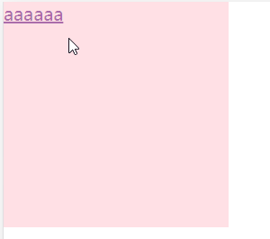
在aaaaaa上只点击一次，同时触发item消失与超链接。
- - -
如果改为：
```javascript
item.addEventListener("click",function(){
	this.style.display="none";
})
```
则只会触发item消失
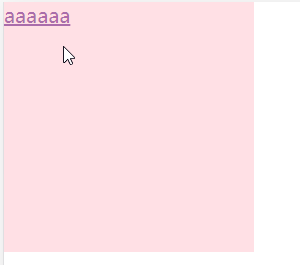
- - -
其根本原因是**PC端事件有300毫秒延迟**。

当事件绑定给```touchstart```时，点击后，触发touchstart事件，没有延迟，使item消失(display变为none)，300毫秒之后，触发click事件，点击处有a标签，因此相当于点击了a标签，进行跳转，事件点透。
当事件绑定给```click```时，点击后，触发touchstart事件，但是没有回调，300毫秒之后，才触发click事件，使item消失，因此不会点击到a标签。

即，当事件绑定给```touchstart```时，点击后，touchstart立即执行，使item的display变为none，同时也触发click事件，但是click事件有300毫秒的延迟，300毫秒之后，click再执行点击效果，此时item已经消失，但原位置上有个a标签，因此a标签被click事件点击。
而当事件绑定给```click```时，点击后，touchstart立即执行，但touchstart并没有绑定事件，因此没有东西被响应，同时也触发click事件，但是click事件有300毫秒的延迟，300毫秒之后，click再执行点击效果，此时item并没有消失，因此触发绑定事件，item的display变为none，没有后续的响应，因此a标签不会被点击。

## 跳转方案
当禁止所有的事件默认行为后，a标签无法进行跳转，因此我们需要自己设计跳转方案。
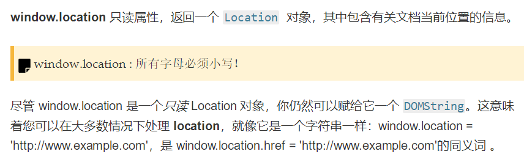
```javascript
<!DOCTYPE html>
<html>
	<head>
		<meta charset="UTF-8">
		<meta name="viewport" content="width=device-width,initial-scale=1.0,user-scalable=no" />
		<title></title>
		<style type="text/css">
			*{
				margin: 0;
				padding: 0;
			}
		</style>
	</head>
	<body>
		<a href="http://www.atguigu.com">aaaaaa</a>
		<a href="http://www.atguigu.com">aaaaaa</a>
		<a href="http://www.atguigu.com">aaaaaa</a>
		<a href="http://www.atguigu.com">aaaaaa</a>
		<a href="http://www.atguigu.com">aaaaaa</a>
		<a href="http://www.atguigu.com">aaaaaa</a>
		<a href="http://www.atguigu.com">aaaaaa</a>
	</body>
	<script type="text/javascript">
		window.onload=function(){
			document.addEventListener("touchstart",function(ev){
				ev=ev||event;
				ev.preventDefault();
			})

			//移动端a标签的跳转方案  并解决了误触
			var aNodes = document.querySelectorAll("a");
			for(var i=0;i<aNodes.length;i++){
				aNodes[i].addEventListener("touchstart",function(){
					this.isMoved = false;//手指触屏时，表示没有滑屏
				})

				aNodes[i].addEventListener("touchmove",function(){
					this.isMoved = true;//表示正在滑屏
				})

				aNodes[i].addEventListener("touchend",function(){
					if(!this.isMoved){//如果在滑屏时触碰到a标签，则不要跳转；只有点击时，才跳转
						location.href = this.href;
					}
				})
			}
		}
	</script>
</html>
```
## 关于event
**touches**: 当前屏幕上所有触摸点的列表
**targetTouches**: 当前对象上所有触摸点的列表
**changedTouches**: 涉及当前(引发)事件的触摸点的列表
```javascript
<!DOCTYPE html>
<html>
	<head>
		<meta charset="UTF-8">
		<meta name="viewport" content="width=device-width,initial-scale=1.0,user-scalable=no" />
		<title></title>
		<style type="text/css">
			*{
				margin: 0;
				padding: 0;
			}
			.item{
				position: absolute;
				left: 0;
				top: 0;
				bottom: 0;
				right: 0;
				margin: auto;
				width: 300px;
				height:300px;
				background: pink;
			}
		</style>
	</head>
	<body>
		<div class="item"></div>
	</body>
	<script type="text/javascript">
		window.onload=function(){
			/* 禁止默认行为 */
			document.addEventListener("touchstart",function(ev){
				ev=ev||event;
				ev.preventDefault();
			})

			var item = document.querySelector(".item");	
			//changedTouches：触发当前事件的手指列表
			//targetTouches：触发当前事件时元素上的手指列表
			//touches：触发当前事件时屏幕上的手指列表
			item.addEventListener("touchend",function(ev){
				ev = ev||event;
				var item = document.querySelector(".item");
				item.innerHTML="changed:"+ev.changedTouches.length+"<br/>";
				item.innerHTML+="target:"+ev.targetTouches.length+"<br/>";
				item.innerHTML+="touches:"+ev.touches.length+"<br/>";
				
				console.log(ev)
			})
		}
	</script>
</html>
```
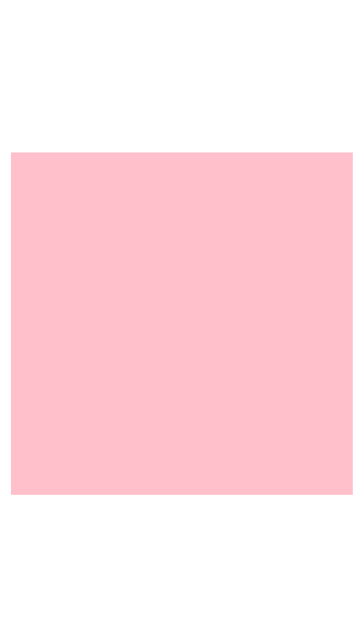
粉色区域放3根手指，抬起1根后，结果如下图所示：
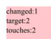
- - -
粉色区域放2根手指，白色区域放1根手指，粉色区域抬起1根，结果如下图所示
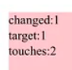
- - -
粉色区域放3根手指，白色区域放1根手指，粉色区域抬起1根，结果如下图所示
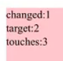
- - -
- - -
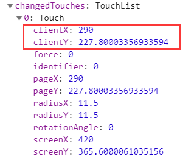
在changedTouches中，有我们常需要用到的```clientX```和```clientY```。

## 常见问题
### 电话与邮箱
在移动端，类似于邮箱和电话的文本，在点击后会跳转为电话或邮箱，有时候我们并不想有这种默认行为。
```javascript
<!DOCTYPE html>
<html>
	<head>
		<meta charset="UTF-8">
		<!-- 格式化标签，跟电话和邮箱比较像的，不要高亮跳转 -->
		<meta name="format-detection" content="telephone=no,email=no"/>
		<title></title>
	</head>
	<body>
		<p>1383838438</p>
		<!-- 需要跳转的，则手动指定 -->
		<!-- href中为跳转的目标，tel为电话，mailto为邮箱 -->
		<a href="tel:110">1383838438</a> 
		<a href="mailto:13888@qq.com">1383838438</a>
	</body>
</html>
```
### 链接按钮高亮
在移动端，点击链接后会默认有一个背景高亮，有时我们也是不想要的。
```javascript
<style type="text/css">
	a{
		text-decoration: none;/* 去除下划线 */
		-webkit-tap-highlight-color: rgba(0,0,0,0);/* 去除背景高亮，也可以指定自己想要的颜色 */
	}
</style>
```

### 按钮圆角
移动端默认的按钮圆角如下图所示：
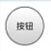
非常丑，有时候我们并不想要这样的按钮，我们想要自己制定圆角的角度。

但是，当我们只指定```border-radius: 5px;```时，发现并没有起作用。

需要加上另一条代码：```-webkit-appearance: none;```
```javascript
<style type="text/css">
	input{
		border-radius: 5px;
		-webkit-appearance: none;
	}
</style>
```
### font-boosting
有些浏览器，在我们的字体设置过小时，会自动帮我们放大，但这不利于我们的开发。我们只需要设置```max-height: 999999px;```即可。
```javascript
p{
	font-size: 24px;
	max-height: 999999px;/* 不会影响样式 */
}
```
```
Font Boosting是Webkit 给移动端浏览器提供的一个特性：当我们在手机上浏览网页时，很可能因为原始页面宽度较大，
在手机屏幕上缩小后就看不清其中的文字了。而 Font Boosting 特性在这时会自动将其中的文字字体变大，
保证在即不需要左右滑动屏幕，也不需要双击放大屏幕内容的前提下，也可以让人们方便的阅读页面中的文本。

Font Boosting 的计算规则伪代码如下：
	multiplier = Math.max(1, deviceScaleAdjustment * textScalingSlider * systemFontScale * clusterWidth / screenWidth);
	if (originFontSize < 16) {
	    computedFontSize = originFontSize * multiplier;
	}
	else if (16 <= originFontSize <= (32 * multiplier - 16)) {
	    computedFontSize = (originFontSize / 2) + (16 * multiplier - 8);
	}
	else if (originFontSize > (32 * multiplier - 16)) {
	    computedFontSize = originFontSize;
	}

	originFontSize: 原始字体大小
	computedFontSize: 经过计算后的字体大小
	multiplier: 换算系数，值由以下几个值计算得到
	deviceScaleAdjustment: 当指定 viewport width=device-width 时此值为 1，否则值在 1.05 - 1.3 之间，有专门的计算规则
	textScalingSlider: 浏览器中手动指定的缩放比例，默认为 1
	systemFontScale: 系统字体大小，Android设备可以在「设备 - 显示 - 字体大小」处设置，默认为 1
	clusterWidth: 应用 Font Boosting 特性字体所在元素的宽度
	screenWidth: 设备独立像素（DIPs, Density-Independent Pixels），如 iPhone 5 为 320

Font Boosting 仅在未限定尺寸的文本流中有效，给元素指定宽高，就可以避免 Font Boosting 被触发。
但是文本内容不可能都指定宽高。不过还好，我们通过指定 max-height  就可以无副作用的禁掉 Font Boosting 特性。
用类似 p { max-height: 999999px; } 的方式来处理
```
# 复习2
```
###复习2
	1.rem适配
		rem单位：根标签的font-size所代表的值
		---步骤
			第一步  		创建style标签
			第二三步		将根标签的font-size置为布局视口的宽/16
			第四步  		将style标签添加到head中
		---原理
			改变一个元素在不同设备上的css像素的个数
		---优缺点
			优点：可以使用完美视口
			缺点：px到rem的转化特别麻烦
	2.viewport适配
		---步骤
			将所有设备的布局视口的宽置为设计图的宽度
			第一步	定义设计图的宽度
			第二步	确定系统缩放比例
			第三步	选中viewport标签，改变其content值
		---原理
			改变不同设备上一个css像素跟物理像素的比例
		---优缺点
			优点：所量即所得
			缺点：破坏了完美视口
	3.百分比适配
		百分比参照于谁
	4.流体(弹性布局 flex)+固定 (不是适配)
	
	5.一物理像素的实现
		rem+系统缩放
			1.主体适配采用rem适配 并放大rem的基值(dpr倍)
			2.再通过系统缩放 缩回dpr倍，initial-scale=1/dpr
		响应式+变换缩放
	
	6.移动端事件基础
		1.queryselectorAll：静态列表		queryselector：静态列表的第一个
		2.touchstart touchmove	touchend
		3.阻止事件的默认行为，阻止事件的冒泡
		4.怎么全局阻止默认事件
		5.事件点透
		6.event 3类手指列表
		7.常见问题
			-webkit-appearance:none
			-webkit-tap-highlight-color
			font boosting
```