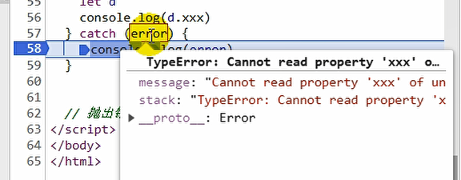
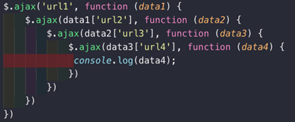
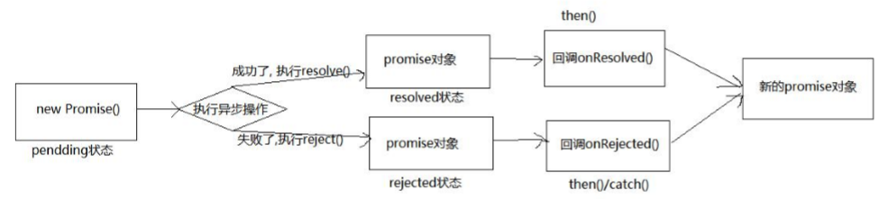
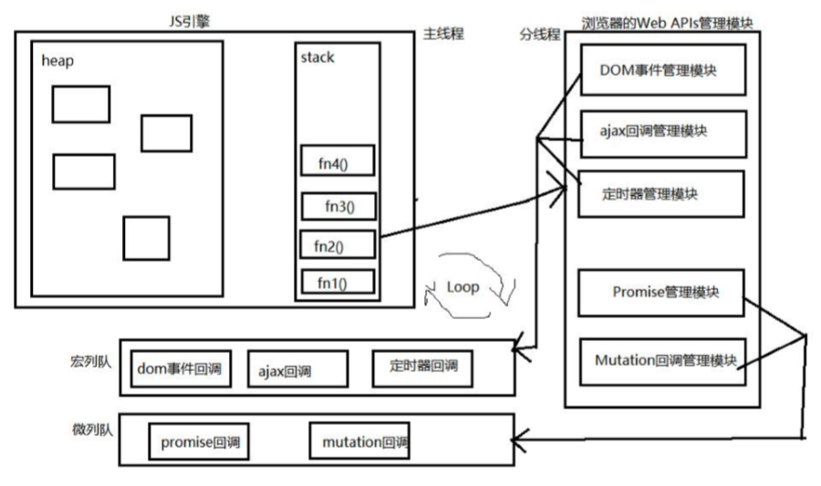

# Promise

## 函数对象与实例对象

1. 实例对象: new 函数产生的对象，称为实例对象，简称为对象
2. 函数对象: 将函数作为对象使用（操作属性或方法）时，简称为函数


一般来说，**括号左边是函数，点的左边是对象（实例对象 or 函数对象）**

```javascript
a.b.c() //a.b.c是函数
a()[0]() //表示a是个函数，返回值是个数组，返回的数组的第一个元素是一个函数
function Fn() { } //Fn是函数
const fn = new Fn() //Fn是构造函数，fn是实例对象（简称为对象）
console.log(Fn.protype) //Fn是函数对象
$('#test') //$是函数
$.get('/test') //$是函数对象调用get方法
```

## 二种类型的回调函数

**什么是回调函数**

1. 自己定义的
2. 自己没有主动执行
3. 函数最终执行了

- 同步回调

  ​	立即执行, 完全执行完了才结束, 不会放入回调队列中

  ```javascript
  const arr = [1, 3, 5]
  arr.forEach(i => { // 遍历回调，同步回调函数，不会放入队列，一上来就要执行完
    console.log(i)
  })
  console.log('----')
  // 输出结果为：1 3 5 ----
  ```

- 异步回调

  ​	不会立即执行, 会放入回调队列中将来执行

  ```javascript
  setTimeout(() => { // 放入回调队列，异步回调函数
    console.log('1')
  }, 0) // 延迟时间为0
  console.log('2')
  // 输出结果为：2 1
  ```

**如何判断回调函数是同步的还是异步的**

在回调函数之后使用`console.log()`，看执行顺序，参考上述。

## 常见的内置错误

**错误的类型**

​	Error: 所有错误的父类型

1. ReferenceError: 引用的变量不存在（常见）

   ```javascript
   console.log(a) // ReferenceError: a is not defined
   console.log('----') // 没有捕获error，代码不会执行
   ```

2. TypeError: 数据类型不正确的错误（常见）

   ```javascript
   let b
   b.xxx() // TypeError: Cannot read property 'xxx' of undefined
   console.log(b.xxx) // TypeError: Cannot read property 'xxx' of undefined
   
   let c = {}
   c.xxx() // TypeError: c.xxx is not a function
   ```

3. RangeError: 数据值不在其所允许的范围内

   ```javascript
   function fn() {
     fn() // 递归调用
   }
   fn() // RangeError: Maximum call stack size exceeded
   ```

4. SyntaxError: 语法错误

   ```javascript
   const d = """" // SyntaxError: Unexpected string
   ```

### 错误的处理（捕获与抛出）

**错误对象**

message属性: 错误相关信息

stack属性: 函数调用栈记录信息

**错误处理**

- 捕获错误: try...catch

  ```javascript
  try { // 将可能有错误的代码放入 try{ } 中
    let d
    console.log(d.xxx)
  } catch (error) { // 处理错误，其中，error是一个对象，有两个属性，如下图
    console.log(error.message)
    console.log(error.stack)
  }
  ```

  

- 抛出错误: throwError

  ```javascript
  function something() {
    if (Date.now()%2 === 1) {
      console.log('当前时间为奇数')
    } else { // 如果时间是偶数则抛出异常，由调用来处理
      throw new Error('当前时间为偶数') // 一般都只需要直接抛出Error，不需要细分
    }
  }
  
  // 捕获处理异常
  try {
    something()
  } catch (error) { 
    alert(error.message)
  }
  ```

## 如何使用Promise

### Promise的理解

Promise是异步编程的一种解决方案

如果网络请求是同步的，则在请求时，下面的代码会被阻塞

封装一个网络请求的函数，因为不能立即拿到结果，所以不能像简单的3+4=7一样将结果返回  

所以往往我们会传入另外一个函数，在数据请求成功时，将数据通过传入的函数回调出去  

如果只是一个简单的网络请求，那么这种方案不会给我们带来很大的麻烦  

但是，当网络请求非常复杂时，就会出现回调地狱  

我们需要通过一个url1从服务器加载一个数据data1，data1中包含了下一个请求的url2

我们需要通过data1取出url2，从服务器加载数据data2，data2中包含了下一个请求的url3

我们需要通过data2取出url3，从服务器加载数据data3，data3中包含了下一个请求的url4

发送网络请求url4，获取最终的数据data4



这样的代码难看而且不容易维护，我们期望一种更加优雅的方式来进行这种异步操作  

Promise可以以一种非常优雅的方式来解决这个问题 

**Promise的作用**

抽象表达：

​	Promise 是 JS 中进行**异步编程的新的解决方案**

具体表达：

​	(1) 从语法上来说：Promise 是一个**构造函数**

​	(2) 从功能上来说：Promise 对象用来**封装一个异步操作并可以获取其结果**

什么情况下会用到Promise？

​	一般情况下是有异步操作时，使用Promise对这个异步操作进行封装

​	Promise将 网络请求的代码 和 相关的处理代码 进行了分离

**为什么要用Promise**

1. **指定回调函数的方式更加灵活**

​    旧的：回调函数必须在启动异步任务前指定

​    promise：启动异步任务 ==> 返回Promise对象 ==> 给promise对象绑定回调函数（甚至可以在异步任务结束后指定）

2. **支持链式调用，解决回调地狱问题**

​    回调地狱：回调函数嵌套调用，外部回调函数异步执行的结果是嵌套的回调函数执行的条件

​    回调地狱的缺点：不便于阅读 / 不便于异常处理

​    解决方案：promise链式调用（Promise中还有回调函数，因此不是最终方案）

​    终极解决方案：async / await

```javascript
// 成功的回调函数
function successCallback(result) {
  console.log("声音文件创建成功: " + result);
}

// 失败的回调函数
function failureCallback(error) {
  console.log("声音文件创建失败: " + error);
}

/* 1.1 使用纯回调函数 */
createAudioFileAsync(audioSettings, successCallback, failureCallback) // 先创建回调函数，后调用

/* 1.2 使用Promise */
const promise = createAudioFileAsync(audioSettings);
setTimeout(() => {
  promise.then(successCallback, failureCallback);
}, 3000);

/* ------------------------------------ */

/* 2.1 回调地狱 */
doSomething(function(result) {
  doSomethingElse(result, function(newResult) {
    doThirdThing(newResult, function(finalResult) {
      console.log('Got the final result: ' + finalResult)
    }, failureCallback)
  }, failureCallback)
}, failureCallback)

/* 2.2 使用promise的链式调用解决回调地狱 */
doSomething().then(function(result) {
  return doSomethingElse(result)
}).then(function(newResult) {
  return doThirdThing(newResult)
}).then(function(finalResult) {
  console.log('Got the final result: ' + finalResult)
}).catch(failureCallback)

/* 2.3 async/await: 回调地狱的终极解决方案 */
async function request() {
  try {
    const result = await doSomething()
    const newResult = await doSomethingElse(result)
    const finalResult = await doThirdThing(newResult)
    console.log('Got the final result: ' + finalResult)
  } catch (error) {
    failureCallback(error)
  }
}
```

**Promise的状态改变**

1. pending 变为 **resolved**

2. pending 变为 **rejected**

   说明: 只有这 2 种，且一个 promise 对象只能改变一次，无论变为成功还是失败，都会有一个结果数据，成功的结果数据一般称为 value，失败的结果数据一般称为 reason

**Promise的基本流程**



### Promise的基本使用

```javascript
/* 简单示例 */
new Promise((resolve, reject) => {
  setTimeout(() => { // 网络请求
    if (异步操作成功) {
      resolve('this is data') // 成功的时候调用resolve
    }else if (异步操作失败) {
      reject('error message') // 失败的时候调用reject
    }else {
      ...
    }
  }, 1000)
}).then(
  data => {
    // 100行的处理代码
    console.log(data)
    console.log(data)
  },
  err => {
    // 100行的处理代码
    console.log(err)
    console.log(err)
	})
  // .catch(err => { // 如果then中不处理error，则可以用catch专门处理error
  //   // 100行的处理代码
  //   console.log(err)
  // })
```

```javascript
// 1.创建一个新的promise对象
const p = new Promise((resolve, reject) => {
  // 2.执行异步操作任务
  setTimeout(() => {
    const time = Date.now() // 如果当前时间是偶数就代表成功，否则代表失败
    if(time%2 == 0){
      // 3.1. 如果成功了，调用resolve(value)
      resolve('成功的数据，time=' + time)
    } else {
      // 3.2. 如果失败了，调用reject(reason)
      reject('失败的数据，time=' + time)
    }
  }, 1000);
})

p.then(value => { // 接收得到成功的value数据  onResolved
  	console.log( '成功的回调'，value)
  }, reason => { // 接收得到失败的reason数据  onRejected
  	console.1og( '失败的回调'，value)
  }
)
```

### 链式调用的简写

```javascript
/* Promise的链式调用 */

  // 网络请求: aaa -> 自己处理(10行)
  // 处理: aaa111 -> 自己处理(10行)
  // 处理: aaa111222 -> 自己处理

  /* 未简写 */
  new Promise((resolve, reject) => {
    setTimeout(() => {
      resolve('aaa')
    }, 1000)
  }).then(res => {
    // 1.自己处理10行代码
    console.log(res, '第一层的10行处理代码');
    // 2.对结果进行第一次处理
    return new Promise(resolve => { // 可以简写*******************
      resolve(res + '111')
    })
  }).then(res => {
    console.log(res, '第二层的10行处理代码');
    return new Promise(resolve => {
      resolve(res + '222')
    })
  }).then(res => {
    console.log(res, '第三层的10行处理代码');
  })

/* ---------------------------------------------------------------- */

  /* 简写 */
  // return new Promise(resolve => resolve(结果)) 简写为 return Promise.resolve(res + '111')
  new Promise((resolve, reject) => {
    setTimeout(() => {
      resolve('aaa')
    }, 1000)
  }).then(res => {
    // 1.自己处理10行代码
    console.log(res, '第一层的10行处理代码');
    // 2.对结果进行第一次处理
    return Promise.resolve(res + '111') // 进行简写*******************
  }).then(res => {
    console.log(res, '第二层的10行处理代码');
    return Promise.resolve(res + '222')
  }).then(res => {
    console.log(res, '第三层的10行处理代码');
  })

/* ---------------------------------------------------------------- */

  /* 继续简写 */
  // 省略掉Promise.resolve
  new Promise((resolve, reject) => {
    setTimeout(() => {
      resolve('aaa')
    }, 1000)
  }).then(res => {
    // 1.自己处理10行代码
    console.log(res, '第一层的10行处理代码');
    // 2.对结果进行第一次处理
    return res + '111' // 继续简写，省略掉Promise.resolve，内部会进行Promise包装*******************
  }).then(res => {
    console.log(res, '第二层的10行处理代码');
    return res + '222'
  }).then(res => {
    console.log(res, '第三层的10行处理代码');
  })

/* ---------------------------------------------------------------- */

/* 同理，reject也可以进行简写 */
// 未简写
...
.then(res => {
  return new Promise((resolve, reject) => {
    // resolve('aaa')
    reject('err')
	})
})
...
.catch(err => {
  console.log(err)
})
// 可以简写为
...
.then(res => {
  return Promise.reject('error message')
})
...
.catch(err => {
  console.log(err)
})
/* 也可以简写为：*/
...
.then(res => {
  throw 'error message'
})
...
.catch(err => {
  console.log(err)
})
```

### 三种状态

pending：初始状态，既没有被兑现，也没有被拒绝，当执行executor中的代码时，处于该状态。executor就是Promise中传入的要执行的回调函数

fulfill：满足状态，当我们主动回调了resolve时，就处于该状态，并且会回调.then()

reject：拒绝状态，当我们主动回调了reject时，就处于该状态，并且会回调.catch()


需要注意：一旦状态被确定下来，Promise的状态会被 `锁死`，该Promise的状态是不可更改的

```js
new Promise((resolve, reject) => {
  resolve("已决议")
  reject("已拒绝") // 代码仍然会执行，但是无法改变Promise状态
}).then(res => {
  console.log("res:", res)
}).catch(err => {
  console.log("err:", err)
})
```

如果resolve中传入的是另外一个Promise，那么这个新Promise会决定原Promise的状态：

外部的Promise的状态与内部的Promise的状态保持一致，并且会接收到内部的Promise的返回值

```js
new Promise((resolve, reject) => {
  resolve(new Promise((resolve, reject) => {
    setTimeout(() => {
      resolve("第二个Promise的resolve")
    }, 3000);
  }))
}).then(res => {
  console.log("res:", res) // 第二个Promise的resolve
}).catch(err => {
  console.log("err:", err) // 如果内如的Promise是reject()，则会来到这里打印“第二个Promise的resolve”
})
```

如果resolve中传入的是一个对象，并且这个对象有实现then方法，那么会执行该then方法，并且根据then方法的结果来决定Promise的状态：

```js
new Promise((resolve, reject) => {
  resolve({
    then: function(resolve_, reject_) {
      // resolve_("222")
      resolve_("err message")
    }
  })
}).then(res => {
  console.log("res:", res)
}).catch(err => {
  console.log("err:", err)
})
```

###  then

#### 参数

then方法接受两个参数：

- fulfilled的回调函数：当状态变成fulfilled时会回调的函数；
- reject的回调函数：当状态变成reject时会回调的函数；

```js
const promise = new Promise((resolve, reject) => {

})

promise.then(res => {
  console.log("res:", res)
}, err => {
  console.log("err:", err)
})
```

等同于

```js
// 更推荐这种写法，可以将两个状态的回调完全分开
promise.then(res => {
  console.log("res:", res)
}).catch(err => {
  console.log("err:", err)
})
```

#### 多次调用

一个Promise的then方法是可以被多次调用的

- 每次调用我们都可以传入对应的fulfilled回调；
- 当Promise的状态变成fulfilled的时候，这些回调函数都会被执行；

```js
promise.then(res => {
  console.log("res1:", res)
})

promise.then(res => {
  console.log("res2:", res)
})

promise.then(res => {
  console.log("res3:", res)
})
```

#### 返回值

每个`then`方法都返回一个新的Promise，所以才可以链式调用

关于返回的Promise的状态，新Promise的状态（解决或拒绝）取决于`then`中提供的回调函数的行为：

- **回调函数执行中**：在`then`的回调函数执行期间，返回的Promise处于待定（pending）状态。
- **回调函数返回一个非Promise值**：如果回调函数返回一个非Promise值，那么返回的Promise将被解决（fulfilled），并且这个值将作为下一个`then`回调函数的参数。
- **回调函数返回另一个Promise**：如果回调函数返回另一个Promise，那么返回的Promise将采用这个新Promise的状态。如果新Promise被解决，那么返回的Promise也被解决，其值为新Promise的解决值。如果新Promise被拒绝，那么返回的Promise也被拒绝，其拒绝原因与新Promise相同。
- **回调函数中抛出异常**：如果在`then`的回调函数中抛出异常，返回的Promise将被拒绝（rejected），并且异常信息将作为`catch`方法的参数。

```js
promise.then(res => {
  console.log("res1:", res)
  // 1.直接返回一个值
  return "then function fulfilled"
}).then(res => {
  console.log("res2:", res)
  // 2.返回Promise
  return new Promise((resolve, reject) => {
    setTimeout(() => {
      resolve("new promise fulfilled")
    }, 2000);
  })
}).then(res => {
  console.log("res3:", res)
  // 3.抛出一个异常
  throw new Error("error message")
}).catch(err => {
  console.log("err:", err.message)
})
```

### catch

catch方法也是Promise对象上的一个方法：它也是放在Promise的原型上的 `Promise.prototype.catch`

事实上catch方法也是会返回一个Promise对象的，所以catch方法后可以继续调用then或catch：

```js
promise.then(result => {
  // 处理结果
}).catch(error => {
  // 处理错误
  return "恢复值";
}).then(newResult => {
  // 继续处理，使用来自catch的恢复值
});

// 在这个示例中，即使中间的catch捕获到错误，它也可以通过返回一个值来恢复链，并将处理传递给下一个then。这是Promise提供的一个强大特性，使得异步编程更加灵活和强大。
```

### finally

finally是在ES9（ES2018）中新增的一个特性：表示无论Promise对象无论变成fulfilled还是reject状态，最终都会被执行的代码。

finally方法是不接收参数的，因为无论前面是fulfilled状态，还是reject状态，它都会执行。

### resolve

```js
Promise.resolve("why")
// 类似于
new Promise((resolve) => resolve("why"))
```

情况一：参数本身是Promise

- 那么会将传入的Promise作为resolve函数的返回值；

```js
Promise.resolve(new Promise((resolve, reject) => {
  setTimeout(() => {
    resolve("promise argument")
  }, 3000);
})).then(res => {
  console.log("res:", res)
})
```

情况二：是一个对象，但是对象中有then方法

```js
Promise.resolve({
  then: function(resolve_, reject_) {
    // resolve_("222")
    resolve_("err message")
  }
}).then(res => {
  console.log("res:", res)
}).catch(err => {
  console.log("err:", err)
})
```

情况三：是一个值或者普通的对象，那么会直接作为fulfilled的结果

```js
Promise.resolve("coderwhy").then(res => {
  console.log("res:", res)
})
```

### reject

与resolve相似，但是状态会是reject，传入的参数无论是什么形态，都会直接作为reject状态的参数传递到catch的

```js
Promise.reject("why")
// 相当于
new Promise((resolve, reject) => reject("why"))
```

### Promise.all

- 作用是将多个Promise包裹在一起形成一个新的Promise，状态由包裹的所有Promise共同决定：

- - 当所有的Promise状态变成fulfilled状态时，新的Promise状态为fulfilled，并且会将所有Promise的返回值组成一个数组；
  - 当有一个Promise状态为reject时，新的Promise状态就会变为reject，并且会将第一个reject的返回值作为参数；

```javascript
Promise.all([
  new Promise((resolve, reject) => {
    setTimeout(() => {
      resolve({name: 'why', age: 18})
    }, 2000)
  }),
  new Promise((resolve, reject) => {
    setTimeout(() => {
      resolve({name: 'kobe', age: 19})
    }, 1000)
  })
]).then(results => {
  console.log(results);
})

Promise.race([
  new Promise((resolve, reject) => {
    setTimeout(() => {
      resolve({name: 'why', age: 18})
    }, 2000)
  }),
  new Promise((resolve, reject) => {
    setTimeout(() => {
      resolve({name: 'kobe', age: 19})
    }, 1000)
  })
]).then(
  // 输出的是先执行完成的
  value => {
    console.log(value)
  },
  reason => {
    console.log(reason)
})
```

### Promise.allSettled

类似于 `Promise.all()`，但无论传入的 Promise 是否成功或失败，它都会等待所有 Promise 完成。返回的每个 Promise 结果都会标明它是履行（fulfilled）还是拒绝（rejected）

```js
Promise.allSettled([asyncTask1(), asyncTask2(), asyncTask3()])
  .then(results => {
    // 处理所有结果，无论成功或失败
  });
```

### Promise.race

接受一个 Promise 数组作为参数，并返回一个新的 Promise 实例。这个新的 Promise 的状态（解决或拒绝）由数组中最先改变状态的 Promise 决定（保持一致）。

```javascript
new Promise((resolve, reject) => {
  setTimeout(() => {
    // resolve('成功的数据') // resolve和reject只能选之一，因为pending只能改变一次
    reject('失败的数据')
  }, 1000)
}).then(value => {
  console.log('onResolved()1', value)
}
).catch(reason => {
    console.log('onRejected()1', reason) // onRejected()1 失败的数据
  }
)

// 产生一个成功值为1的promise对象
const p1 = new Promise((resolve, reject) => {
  setTimeout(() => {
    resolve(1)
  }, 100);
})
const p2 = Promise.resolve(2)
const p3 = Promise.reject(3)
p1.then(value => {console.log(value)}) // 1
p2.then(value => {console.log(value)}) // 2
p3.catch(reason => {console.log(reason)}) // 3

const pAll = Promise.all([p1, p2, p3]) // p3为reject，失败，所以all方法为失败
const pAll = Promise.all([p1, p2]) // p1、p2都为resolve，成功，所以all方法为成功
pAll.then(
  // 输出的顺序与all方法的形参中的顺序一致，与执行的顺序无关
  values => {
    console.log('all onResolved()', values) 
  },
  reason => {
    console.log('all onRejected()', reason)
  }
)

const pRace = Promise.race([p1, p2, p3])
pRace.then(
  // 输出的是先执行完成的
  value => {
    console.log('race onResolved()', value)
  },
  reason => {
    console.log('race onRejected()', reason)
  }
)
```

### any

any方法是ES12中新增的方法，会等到一个fulfilled状态，才会决定新Promise的状态；如果所有的Promise都是reject的，那么也会等到所有的Promise都变成rejected状态，如果所有的Promise都是reject的，那么会报一个AggregateError的错误

### 使用Promise控制并发数量

补充：如果是用 Promise.all 来实现也是可以的，但是效率低，例如将20个任务切为5个任务为一组，这样就有4组，使用Promise.all将每一组的任务都完成后再进行下一组，但是这样的效率是不如下面所说的使用Promise.race + 队列的形式的，因为如果5个任务中有一个特别慢，其余的4个任务完成后仍然会需要等待。而下方的方法则是每当有一个任务完成时就会取出另一个任务进行。

Promise 本身不直接提供并发控制机制，如果需要更细粒度的控制（例如，限制同时进行的异步操作数量），需要自己实现一个控制逻辑。这通常涉及到使用队列和递归函数来管理并发。

例如，创建一个函数来处理一个包含所有任务的数组，并且每次只处理一定数量的任务。每当一个任务完成时，就从队列中取出下一个任务开始执行。

**实现思路：**

1. **维护一个正在执行的Promise数组**：数组用于跟踪当前正在执行的异步任务。
2. **使用一个队列来管理待执行的任务**：当正在执行的任务达到设定的并发限制时，新的任务被添加到队列中。
3. **监听每个Promise的完成**：一旦有任务完成，从队列中取出下一个任务执行，并从正在执行的数组中移除已完成的任务。
4. **递归执行直到所有任务完成**：继续执行上述过程，直到所有任务完成。

```js
// asyncFunctionList数组包含一系列返回Promise的异步函数
// limit为想要控制的并发的最大数量
function runPromiseInLimit(asyncFunctionList, limit) {
  let executing = []; // 正在执行的任务数组
  let results = []; // 结果数组

  // 执行器函数，用于递归执行任务
  // execute 函数负责实际执行任务
  const execute = () => {
    // 如果没有剩余任务，则返回一个解决的Promise
    if (asyncFunctionList.length === 0) {
      return Promise.resolve(); // asyncFunctionList 为空意味着没有更多任务要执行，因此返回一个已解决的 Promise
    }

    // 取出一个任务并执行
    let task = asyncFunctionList.shift(); // 队列，所以从第一个元素取
    // 从 asyncFunctionList 中取出一个任务（异步函数）并执行它，这个任务执行后返回一个 Promise（task()）
    // p 是这个 Promise 的引用。当 p 完成时，它的 .then 方法会被调用
    let p = task().then(result => {
      // 将完成的任务从正在执行的数组中移除
      executing.splice(executing.indexOf(p), 1); // 完成的 Promise（p）会从 executing 数组中移除
      results.push(result); // 同时，任务的结果（result）被推送到 results 数组中
    });

    // 将新的 Promise（p）添加到 executing 数组中，表示它正在执行
    // 这行代码将刚启动的异步操作的 Promise（p）添加到 executing 数组中
    executing.push(p);

    // 判断正在执行的任务是否达到了限制
    let r = Promise.resolve(); // 定义一个临时的 Promise 变量 r，用于控制何时开始下一个任务
    // 如果 executing 数组的长度达到了限制 limit，使用 Promise.race 等待 executing 数组中任何一个 Promise 完成
    if (executing.length >= limit) {
      // 如果达到限制，则等待任意一个任务完成
      // Promise.race() 返回一个新的 Promise，在 executing 数组中任何一个 Promise 最先完成时解决
      r = Promise.race(executing);
    }
    // 如果当前执行的任务数量没有达到限制，则 r 仍然是一个已经解决的 Promise，这样就可以立即继续执行下一个任务

    // 递归调用 execute 函数，继续处理下一个任务
    // 这个递归调用会等待 r 完成（要么是因为任务完成，要么是因为还没有达到并发限制）
    return r.then(execute);
  };

  // 开始执行任务处理流程，并在所有任务都完成后返回最终结果
  return execute().then(() => results);
}

// 使用示例
runPromiseInLimit([task1, task2, task3, ...], 2)
  .then(results => {
    // 处理所有任务的结果
  });
```

```js
// 简化版本
function runPromiseInLimit(asyncFunctionList, limit) {
  let executing = []; // 正在执行的任务数组
  let results = []; // 结果数组

  const enqueue = () => {
    // 如果没有剩余任务并且没有正在执行的任务，则完成处理
    if (asyncFunctionList.length === 0 && executing.length === 0) {
      return Promise.resolve();
    }

    // 如果没有达到并发限制并且还有任务待执行
    while (executing.length < limit && asyncFunctionList.length > 0) {
      // 取出一个任务并执行
      let task = asyncFunctionList.shift();
      let p = task().then(result => {
        // 将完成的任务从正在执行的数组中移除，并保存结果
        executing.splice(executing.indexOf(p), 1);
        results.push(result);
        // 尝试执行下一个任务
        enqueue();
      });

      // 将这个任务的Promise添加到正在执行的数组中
      executing.push(p);
    }
  };

  // 开始执行任务
  enqueue();

  // 返回一个Promise，该Promise在所有任务完成时解决
  return new Promise((resolve) => {
    const checkCompletion = setInterval(() => {
      if (asyncFunctionList.length === 0 && executing.length === 0) {
        clearInterval(checkCompletion);
        resolve(results);
      }
    }, 100); // 每100毫秒检查一次是否所有任务都已完成
  });
}

// 使用示例
runPromiseInLimit([task1, task2, task3, ...], 2)
  .then(results => {
    console.log("所有任务完成，结果：", results);
  });
```


### 关键问题

1. 如何改变 promise 的状态? 

   (1) resolve(value)：如果当前是 pending 就会变为 resolved

   (2) reject(reason)：如果当前是 pending 就会变为 rejected

   (3) 抛出异常：如果当前是 pending 就会变为 rejected

2. 一个 promise 指定多个成功/失败回调函数，都会调用吗? 

   当 promise 改变为对应状态时都会调用

```javascript
const p = new Promise((resolve, reject) => {
  // resolve(1) // promise变为resolved成功状态
  // reject(2) // promise变为rejected失败状态
  // throw new Error('出错了') // 抛出异常，promse变为rejected失败状态，reason为抛出的error
  throw 3 // 抛出异常, promse变为rejected失败状态, reason为抛出的3
})
p.then(
  value => {},
  reason => {console.log('reason', reason)} // reason 3
)
p.then(
  value => {},
  reason => {console.log('reason2', reason)} // reason2 3
)
```

3. 改变promise状态 和 指定回调函数 谁先谁后?

   (1)都有可能，正常情况下是先指定回调再改变状态，但也可以先改状态再指定回调

   (2)如何先改状态再指定回调?

   ​    ①在执行器中直接调用resolve()/reject()

   ​    ②延迟更长时间才调用then()

   (3)什么时候才能得到数据?

   ​    ①如果先指定的回调，那当状态发生改变时，回调函数就会调用，得到数据

   ​    ②如果先改变的状态，那当指定回调时，回调函数就会调用，得到数据

```javascript
/* 常规：先指定回调函数, 后改变状态 */
new Promise((resolve, reject) => {
  setTimeout(() => {
    resolve(1) // 后改变状态(同时指定数据)，异步执行回调函数
  }, 1000);
}).then( // 先指定回调函数，保存当前指定的回调函数，只有先保存之后才能执行回调函数
  value => {},
  reason => {console.log('reason', reason)}
)

/* 先改状态, 后指定回调函数 */
new Promise((resolve, reject) => {
  resolve(1) // 先改变状态(同时指定数据)
}).then( // 后指定回调函数, 异步执行回调函数
  value => {console.log('value2', value)},
  reason => {console.log('reason2', reason)}
)
console.log('-------')

/* 先改状态, 后指定回调函数 */
const p = new Promise((resolve, reject) => {
  setTimeout(() => {
    resolve(1) // 先改变状态(同时指定数据), 异步执行回调函数
  }, 1000); // 延迟1秒
})
setTimeout(() => {
  p.then( // 后指定回调函数
    value => {console.log('value3', value)},
    reason => {console.log('reason3', reason)}
  )
}, 1100); // 延迟1.1秒
```

4. promise.then()返回的新promise的结果状态由什么决定?

   (1)简单表达: 由then()指定的回调函数执行的结果决定

   (2)详细表达:

   ​     ①如果抛出异常，新promise变为rejected，reason为抛出的异常

   ​     ②如果返回的是非promise的任意值，新promise变为 resolved / value 为返回的值

   ​     ③如果返回的是另一个新promise，此promise的结果就会成为新promise的结果

   

   **在一个then()中是跳转到失败[reject]，只表示上一个Promise是失败的，如果在这个then()中没有继续返回失败，则[如果有]下一个then是转到resolve的**

   ```javascript
   new Promise((resolve, reject) => {
     // resolve(1)
     reject(1)
   }).then(
     value => {
       // console.log('onResolved1()', value) //结果为：onResolved1() 1，对应第2行，然后转到第22行
       /* 如果不指定返回值，则默认返回undefined */
       return 2 // 此时第22行结果为 3
       // return Promise.resolve(3) // 此时第22行结果为 3
       // return Promise.reject(4) // 此时第25行结果为 4
       // throw 5 //此时第25行结果为 5
     },
     reason => {
       // console.log('onRejected1()', reason) //结果为：onRejected1() 1，对应第3行，然后转到第22行（因为这个reject是成功的）
       return 2 // 此时第22行结果为 2
       // return Promise.resolve(3) // 此时第22行结果为 3
       // return Promise.reject(4) // 此时第25行结果为 4
       // throw 5 //此时第25行结果为 5
     }
   ).then(value => {
       console.log('onResolved2()', value) 
     },reason => {
       console.log('onRejected2()', reason)
     }
   )
   ```

5. promise如何串连多个操作任务(同步异步都可以)?

   (1)promise的 then() 返回一个新的promise，可以 then() 的链式调用

   (2)通过then的链式调用串连多个同步/异步任务

   **在then()中：**

   **再执行同步任务，不需要return新的Promise；**

   **再执行异步任务，应当将其封装到Promise对象中**

```javascript
new Promise((resolve, reject) => {
  setTimeout(() => {
    console.log("执行任务1(异步)") // 第1个打印：执行任务1(异步)
    resolve(1)
  }, 1000);
}).then(
  value => {
    console.log('任务1的结果: ', value) // 第2个打印：任务1的结果: 1
    console.log('执行任务2(同步)') // 第3个打印：执行任务2(同步)
    return 2 // 在回调函数中再执行同步任务，不需要返回新的Promise
  }
).then(
  value => {
    console.log('任务2的结果:', value) // 第4个打印：任务2的结果: 2
    /* 在回调函数中再执行异步任务，应当将其封装到Promise对象中 */
    // 只有再返回一个Promise对象，第26行的then才是这个返回的Promise对象的
    return new Promise((resolve, reject) => {
      // 启动任务3(异步)
      setTimeout(() => {
        console.log('执行任务3(异步))') // 第5个打印：执行任务3(同步)
        resolve(3)
      }, 1000);
    })
  }
).then( // 这个then是第18行返回的Promise的
  value => {
    console.log('任务3的结果: ', value) // 第6个打印：任务3的结果: 3
  }
)
```

6. Promise异常传/穿透?

   (1)当使用promise的then链式调用时, 可以在最后指定失败的回调，失败会一层层传递下去

   (2)前面任何操作出了异常, 都会传到最后失败的回调中处理，因为失败会一层层传递下去

7. 中断promise链?

   (1)当使用promise的then链式调用时, 在中间中断, 不再调用后面的回调函数

   (2)办法: 在回调函数中返回一个pending状态的promise对象【return new Promise(() => {})】

```javascript
new Promise((resolve, reject) => {
  // resolve(1)
  reject(1)
}).then(value => {
    console.log('onResolved1()', value)
    return 2
  }
  /* 没有指定reject默认相当于：reason => {throw reason} */
).then(value => {
    console.log('onResolved2()', value)
    return 3
	}
  /* 没有指定reject默认相当于：reason => {throw reason} */
).then(value => {
    console.log('onResolved3()', value)
  },
  /* 也可以是：reason => Promise.reject(reason) */
).catch(reason => { // 这里是catch
  console.log('onRejected1()', reason) // 跳转到第25行
  // throw reason // 跳转到28行
  // Promise.reject(reason) // 值是undefined，没有抛出异常不会跳转到28行，而是到26行
  // return Promise.reject(reason) // 跳转到29行
  return new Promise(() => {}) // 返回一个pending的promise，中断promise链，不会继续传递到下一个then，返回的新的Promise决定下一个then的跳转，如果新的Promise没有结果，则会中断
}).then(
  value => {
    console.log('onResolved3()', value)
  },
  reason => {
    console.log('onRejected2()', reason)
  }
)
```

## 自定义Promise（自实现）（未完，看coderwhy公众号）

### 第一步

实现基本结构

```js
class HYPromise {
  constructor(executor) {
    this.status = 'pending'; // 初始化状态为pending
    this.value = undefined; // 初始化成功的值为undefined
    this.reason = undefined; // 初始化失败的原因为undefined

    // 定义resolve方法
    const resolve = (value) => {
      if (this.status === 'pending') { // 只有在pending状态才能更改状态和值
        this.status = 'fulfilled';
        this.value = value;
      }
    };

    // 定义reject方法
    const reject = (reason) => {
      if (this.status === 'pending') { // 只有在pending状态才能更改状态和原因
        this.status = 'rejected';
        this.reason = reason;
      }
    };

    // 立即执行执行器函数
    try {
      executor(resolve, reject);
    } catch (error) {
      reject(error); // 如果执行器函数抛出异常，将Promise状态更改为rejected
    }
  }
}
```

### 第二步

实现resolve和reject，这两个方法用于处理异步操作的结果。

```js
class HYPromise {
  constructor(executor) {
    this.status = 'pending'; // 初始化状态为pending
    this.value = undefined; // 初始化成功的值为undefined
    this.reason = undefined; // 初始化失败的原因为undefined
    this.onFulfilledCallbacks = []; // 初始化成功处理函数队列
    this.onRejectedCallbacks = []; // 初始化失败处理函数队列

    // 定义resolve方法
    const resolve = (value) => {
      if (this.status === 'pending') { // 只有在pending状态才能更改状态和值
        this.status = 'fulfilled';
        this.value = value;
        // 执行所有成功处理函数
        this.onFulfilledCallbacks.forEach(callback => callback());
      }
    };

    // 定义reject方法
    const reject = (reason) => {
      if (this.status === 'pending') { // 只有在pending状态才能更改状态和原因
        this.status = 'rejected';
        this.reason = reason;
        // 执行所有失败处理函数
        this.onRejectedCallbacks.forEach(callback => callback());
      }
    };

    // 立即执行执行器函数
    try {
      executor(resolve, reject);
    } catch (error) {
      reject(error); // 如果执行器函数抛出异常，将Promise状态更改为rejected
    }
  }
}
```

### 第三步

实现then方法

首先，实现`resolvePromise`辅助函数：

```js
function resolvePromise(promise2, x, resolve, reject) {
  // 检查循环引用：如果 promise2 和 x 是同一个对象，意味着发生了循环引用，这是不允许的，会导致无限递归。所以抛出一个 TypeError。
  if (promise2 === x) {
    return reject(new TypeError('Chaining cycle detected for promise'));
  }

  let called = false; // 标记是否已调用，防止多次调用

  // 处理 x 为 Promise 的情况：如果 x 是 HYPromise 的实例，说明它是一个Promise对象。此时，需要根据 x 的状态来解析 promise2。
  if (x instanceof HYPromise) {
    // 根据 x 的状态调用 resolve 或 reject
    x.then(
      y => { // 如果 x 被解决，则 resolvePromise 被递归调用以进一步处理 y（x 的解决值）。
        resolvePromise(promise2, y, resolve, reject);
      },
      reason => { // 如果 x 被拒绝，则直接用其拒绝原因拒绝 promise2。
        reject(reason);
      }
    );
  } else if (x !== null && (typeof x === 'object' || typeof x === 'function')) { // 3. 如果 x 是对象或函数
    // 处理 x 为对象或函数的情况：如果 x 是一个对象或函数，它可能是一个即具有 then 方法的对象。
    try {
      // 尝试获取 x.then，并检查它是否为函数。
      const then = x.then;
      // 如果是，则使用 x 作为上下文调用它，并递归处理返回的值。
      if (typeof then === 'function') {
        then.call(
          x,
          y => { // 成功回调
            // 这里的 called 变量用于确保 resolve 或 reject 只被调用一次。
            if (called) return; // 如果已经调用过，直接返回
            called = true;
            resolvePromise(promise2, y, resolve, reject); // 递归处理 y
          },
          reason => { // 失败回调
            if (called) return; // 如果已经调用过，直接返回
            called = true;
            reject(reason);
          }
        );
      } else { // 如果 then 不是函数
        resolve(x); // 直接调用 resolve
      }
    } catch (error) { // 如果获取或调用 then 方法抛出异常
      if (called) return; // 如果已经调用过，直接返回
      called = true;
      reject(error);
    }
  } else { // 4. 如果 x 不是对象或函数
    // 直接调用 resolve
    resolve(x);
  }
}


// 进行重构更容易理解
function resolvePromise(promise2, x, resolve, reject) {
  // 检查 promise2 和 x 是否相同，防止循环引用
  if (promise2 === x) {
    return reject(new TypeError('Chaining cycle detected for promise'));
  }

  // 如果 x 是 HYPromise 实例
  if (x instanceof HYPromise) {
    // 则使用 x 的状态来决定如何解析 promise2
    x.then(y => resolvePromise(promise2, y, resolve, reject), reject);
    return;
  }

  // 如果 x 是对象或函数
  if (x !== null && (typeof x === 'object' || typeof x === 'function')) {
    try {
      // 尝试获取 x 的 then 方法
      const then = x.then;
      // 如果 then 是函数
      if (typeof then === 'function') {
        // 防止多次调用的标志
        let called = false;
        // 尝试以 x 为上下文执行 then 方法
        then.call(
          x,
          y => {
            // 如果已经调用过，直接返回
            if (called) return;
            called = true;
            // 递归处理 y
            resolvePromise(promise2, y, resolve, reject);
          },
          reason => {
            // 如果已经调用过，直接返回
            if (called) return;
            called = true;
            // 用 reason 拒绝 promise2
            reject(reason);
          }
        );
      } else {
        // 如果 then 不是函数，用 x 解决 promise2
        resolve(x);
      }
    } catch (error) {
      // 处理在获取或调用 then 方法时抛出的异常
      // 如果已经调用过，直接返回
      if (!called) reject(error);
    }
  } else {
    // 如果 x 不是对象或函数，用 x 解决 promise2
    resolve(x);
  }
}
```

接下来，我们在HYPromise类中实现`then`方法：

```js
then(onFulfilled, onRejected) {
  // 如果不传处理函数，则使用默认处理函数
  onFulfilled = typeof onFulfilled === 'function' ? onFulfilled : value => value;
  onRejected = typeof onRejected === 'function' ? onRejected : reason => { throw reason };

  // 创建一个新的Promise实例，称为promise2
  const promise2 = new HYPromise((resolve, reject) => {
    if (this.status === 'fulfilled') {
      setTimeout(() => { // 使用setTimeout保证异步调用
        try {
          const x = onFulfilled(this.value); // 调用onFulfilled，并获取返回值
          // 使用返回值x和新的Promise实例promise2来处理resolve和reject
          resolvePromise(promise2, x, resolve, reject);
        } catch (error) {
          reject(error); // 如果处理函数抛出异常，则将promise2状态更改为rejected
        }
      });
    } else if (this.status === 'rejected') {
      setTimeout(() => { // 使用setTimeout保证异步调用
        try {
          const x = onRejected(this.reason); // 调用onRejected，并获取返回值
          // 使用返回值x和新的Promise实例promise2来处理resolve和reject
          resolvePromise(promise2, x, resolve, reject);
        } catch (error) {
          reject(error); // 如果处理函数抛出异常，则将promise2状态更改为rejected
        }
      });
    } else if (this.status === 'pending') {
      // 如果当前Promise状态仍为pending，将处理函数加入相应的队列中
      this.onFulfilledCallbacks.push(() => {
        setTimeout(() => { // 使用setTimeout保证异步调用
          try {
            const x = onFulfilled(this.value); // 调用onFulfilled，并获取返回值
            // 使用返回值x和新的Promise实例promise2来处理resolve和reject
            resolvePromise(promise2, x, resolve, reject);
          } catch (error) {
            reject(error); // 如果处理函数抛出异常，则将promise2状态更改为rejected
          }
        });
      });

      this.onRejectedCallbacks.push(() => {
       
        setTimeout(() => { // 使用setTimeout保证异步调用
          try {
            const x = onRejected(this.reason); // 调用onRejected，并获取返回值
            // 使用返回值x和新的Promise实例promise2来处理resolve和reject
            resolvePromise(promise2, x, resolve, reject);
          } catch (error) {
            reject(error); // 如果处理函数抛出异常，则将promise2状态更改为rejected
          }
        });
      });
    }
  });

  return promise2; // 返回新的Promise实例，以便链式调用
}
```

## async & await

`async`/`await` 是简化异步编程的一种语法糖，基于 Promises 和 Generators。

可以将await关键字后面执行的代码，看作是包裹在(resolve, reject) => {} 中的代码

await的下一条语句，可以看作是then(res => {}) 中的代码

### Generators

Generator 是 ES6 引入的一种特殊类型的函数，可以暂停和恢复执行。通过 `function*` 关键字定义，使用 `yield` 关键字来暂停执行。

### `async`/`await` 的工作原理

当将一个函数标记为 `async`，这个函数总是返回一个 Promise。`await` 关键字可以仅在 `async` 函数内使用，用于暂停函数的执行，直到等待的 Promise 解决或拒绝。

当执行到 `await` 表达式时，函数的执行被暂停，直到 Promise 解决。如果 Promise 解决，函数恢复执行，`await` 表达式的结果是解决的值。如果 Promise 被拒绝，`await` 表达式会抛出异常，可以使用 `try...catch` 结构来捕获。

### 实现细节

在底层，`async`/`await` 使用了 Generators 和 Promises。编译器（如 Babel）将 `async`/`await` 转换为基于 Generators 和 Promises 的代码，以确保可以在不支持 `async`/`await` 的旧版JS引擎上运行。

1. **`async` 函数转换**：当编译器遇到 `async` 时，将该函数转换为返回 Promise 的普通函数。
2. **`await` 的处理**：`await` 表达式的处理更复杂。编译器将函数分割为多个部分，每个 `await` 表达式结束一部分。函数的执行通过 Promise 的 `.then()` 方法链来控制，每个链的部分对应 `await` 之后的代码块。
3. **错误处理**：在 `async` 函数中，`await` 表达式后的异常会被捕获，并将导致返回的 Promise 被拒绝。这允许使用 `.catch()` 或 `try...catch` 来处理错误。


async 表示函数里有异步操作，调用该函数会立即返回一个 Promise 对象。async 函数内部 return 语句返回的值，会成为 then 方法回调函数的参数。async 函数内部抛出错误会导致返回的 Promise 对象变为 reject 状态。抛出的错误对象会被 catch 方法回调函数接收到。

```javascript
async function f() {
	return 'hello world'
}

f().then(v => console.log(v)) 
// "hello world"


async function f() {
  throw new Error('出错了')
}

f().then(
	v => console.log(v),
  e => console.log(e)
)
// Error: 出错了
```

await 表示紧跟在后面的表达式需要等待结果。async 函数返回的 Promise 对象必须等到内部所有 await 命令后面的 Promise 对象执行完才会发生状态改变，除非遇到 return 语句或者抛出错误。也就是说，只有 async 函数内部的异步操作执行完，才会执行 then 方法指定的回调函数。

async 函数的返回值是 Promise 对象，可以用then方法指定下一步的操作。进一步说，async 函数完全可以看作由多个异步操作包装成的一个 Promise 对象，而 await 命令就是内部 then 命令的语法糖。

async 函数返回一个 Promise 对象，可以使用 then 方法添加回调函数。当函数执行的时候，一旦遇到 await 就会先返回，等到异步操作完成，再接着执行函数体内后面的语句。

1. 函数的返回值为 promise 对象；即使主动 return 其他值，async返回的也是 promise 对象。
2. promise对象的结果由 async 函数执行的返回值决定。

```javascript
/* async 函数的使用形式 */
// 函数声明
async function foo() { }

// 函数表达式
const foo = async function () { }

// 对象的方法
let obj = { async foo() { }}
obj.foo().then(...)
               
// Class 的方法
class Storage {
	constructor() {
  	this.cachePromise = caches.open('avatars')
	}
	async getAvatar(name) {
    const cache = await this.cachePromise
    return cache.match('/avatars/${name}.jpg')
  }
}

const storage = new Storage()
storage.getAvatar('jake').then(...)
                               
// 箭头函数
const foo = async () => { }
```

```javascript
// 例子1
async function fn1() {
  return 1
}

async function fn2() {
  const value = await fn1() // value的值为：1
}
/*
	value的值为1并不是因为fn1返回了1，fn1()加了async声明因此返回的是promise对象且promise的值为1，然后通过await获取了promise对象的值，该值为1
*/
```

```javascript
// 例子2
function timeout(ms) {
  return new Promise((resolve) => {
    setTimeout(resolve, ms);
  });
}

async function asyncPrint(value, ms) {
  await timeout(ms);
  console.log(value); // 50ms后输出 hello world
}

asyncPrint('hello world', 50);
```

```javascript
// 例子3
async function getTitle(url) {
  let response = await fetch(url)
  let html = await response.text()
  return html.match(/<title>([\s\S+])<\/title>/i)[1]
}
getTitle('https://tc39.github.io/ecma262/').then(console.log)
// "ECMAScript 2017 Language Specification"
/* 
	上面的代码中，函数 getTitle 内部有3个操作：抓取网页、取出文本、匹配页面标题。只有这3个操作全部完成，才会执行 then 方法里面的 console.log
*/
```

### await

MDN文档：https://developer.mozilla.org/zh-CN/docs/Web/JavaScript/Reference/Operators/await

1. await 右侧的表达式一般为 promise 对象，但也可以是其他的值
2. 如果表达式是 promise 对象，await 返回的是 promise 成功的值
3. 如果表达式是 其他值，则返回该值本身
4. 函数中使用了await，则该函数必须声明为async（即，await必须用在async声明的函数中）；但async声明的函数不一定要使用await
5. await 只能得到成功的结果，如果await的promise失败，则会抛出异常；如果想要得到失败的结果，则需要使用 try ... catch ...

正常情况下，await 命令后面是一个 Promise 对象。如果不是，会被转成一个立即 resolve 的 Promise 对象。

```javascript
async function f() {
	return await 123
}

f().then(v => console.log(v)) // 123
// 上面的代码中，await 命令的参数是数值123，它被转成 Promise 对象并立即 resolve
```

await 命令后面的 Promise 对象如果变为 reject 状态，则 reject 的参数会被 catch 方法的回调函数接收到。并且，只要一个 await 语句后面的 Promise 变为 reject，那么 async 函数都会中断执行；

如果不希望被中断执行，

① 可以将出错的 await 放在 try...catch 结构里，这样不管这个异步操作是否成功，后面的 await 都会执行。

② 在 await 后面的 Promise 对象添加一个 catch 方法，处理前面可能出现的错误。

```javascript
async function f() {
	await Promise.reject('出错了')
  await Promise.reject('111')
  await Promise.reject('222')
}

f().then(v => console.log(v)).catch(e => console.log(e)) // 出错了 111 222

/* 
上面的代码中，await 语句前面没有 return，但是 reject 方法的参数依然传入了catch方法的回调函数。这里如果在 await 前面加上 return，效果是一样的。
*/

// 中断执行
async function f() {
  await Promise.reject('出错了') // Promise 变为 reject，中断执行
  await Promise.resolve('hello world') // 不会执行
}

// 方法一：采用 try...catch 结构
async function f() {
  try {
    await Promise.reject('出错了')
  } catch(e) {
    ...
  }
  return await Promise.resolve('hello world')  
}

f().then(v => console.log(v)) // hello world

// 方法二：Promise.reject后面添加一个 catch 方法
async function f() {
  await Promise.reject('出错了').catch(e => console.log(e)) // 出错了
  return await Promisse.resolve('hello world')
}

f().then(v => console.log) // hello world
```

```javascript
// 使用 try...catch结构，实现多次重复尝试
const superagent = require('superagent')
const NUM_RETRIES = 3

async function test() {
  let i
  for(i=0; i<NUM_RETRIES; ++i) {
    try {
      await superagent.get('http://google.com/this-throws-an-error')
      break
    } catch(err) {...}
  }
  console.log(i) // 3
}

test()
// 上面的代码中，如果 await 操作成功，则会使用 break 语句退出循环；如果失败，则会被 catch 语句捕捉，然后进入下一轮循环。
```


## JS异步之宏队列与微队列



1. JS中用来存储待执行回调函数的队列包含 2 个不同特定的列队 

2. 宏列队：用来保存待执行的宏任务(回调)，比如：定时器回调 / DOM事件回调 / ajax回调

3. 微列队：用来保存待执行的微任务(回调)，比如：promise的回调 / MutationObserver的回调

4. JS执行时会区别这 2 个队列：

  (1)JS引擎首先必须先执行所有的初始化同步任务代码，然后再执行异步代码

  (2)在执行一个宏任务前，优先执行微任务（如果有），微任务顺序执行完毕后，再顺序执行宏任务，如果在执行新的宏任务前又有了新的微任务，则又将先顺序执行完毕微任务

  【即，①优先执行同步任务；②异步任务中只要有微任务，则不会执行宏任务】

```javascript
setTimeout(() => { // 会立即放入宏列队
  console.log('timeout callback1()')
  Promise.resolve(3).then(
    value => { // 会立即放入微列队
      console.log('Promise onResolved3()', value)
    }
  )
}, 0)
setTimeout(() => { // 会立即放入宏列队
  console.log('timeout callback2()')
}, 0)
Promise.resolve(1).then(
  value => { // 会立即放入微列队
    console.log('Promise onResolved1()', value)
  }
) 
Promise.resolve(2).then(
  value => { // 会立即放入微列队
    console.log('Promise onResolved2()', value)
  }
) 

// 执行结果为：
Promise onResolved1() 1
Promise onResolved2() 2
timeout callback1()
Promise onResolved3() 3
timeout callback2()
```

### 面试题

**面试题1**

```javascript
setTimeout(()=>{
  console.log(1)
},0)
Promise.resolve().then(()=>{
  console.log(2)
})
Promise.resolve().then(()=>{
  console.log(4)
})
console.log(3)

/*
	输出结果为：3 2 4 1
	3 为同步
	then函数为异步
*/
```

**面试题2**

```javascript
setTimeout(() => {
  console.log(1)
}, 0)
new Promise((resolve) => {
  console.log(2)
  resolve()
}).then(() => {
  console.log(3)
}).then(() => { // 这个then需要上面的then执行完毕才会执行，因此不会马上放入队列中
  console.log(4)
})
console.log(5)

/*
	输出结果为：2 5 3 4 1
	2 5 为同步
*/
```

**面试题3**

```javascript
const first = () => (new Promise((resolve, reject) => {
  console.log(3)
  let p = new Promise((resolve, reject) => {
    console.log(7)
    setTimeout(() => {
      console.log(5)
      resolve(6)
    }, 0)
    resolve(1)
  })
  
  resolve(2)
  
  p.then((arg) => {
    console.log(arg)
  })
}))

first().then((arg) => {
  console.log(arg)
})
console.log(4)

/*
	输出结果为：3 7 4 1 2 5
	3 7 4 为同步
*/
```

**面试题4**

```javascript
setTimeout(() => {
  console.log("0")
}, 0)
new Promise((resolve,reject)=>{
  console.log("1")
  resolve()
}).then(()=>{        
  console.log("2")
  new Promise((resolve,reject)=>{
    console.log("3")
    resolve()
  }).then(()=>{      
    console.log("4")
  }).then(()=>{       
    console.log("5")
  })
}).then(()=>{  
  console.log("6")
})

new Promise((resolve,reject)=>{
  console.log("7")
  resolve()
}).then(()=>{         
  console.log("8")
})

/*
	输出结果为：1 7 2 3 8 4 6 5 0
	1 7 为同步
*/
```


