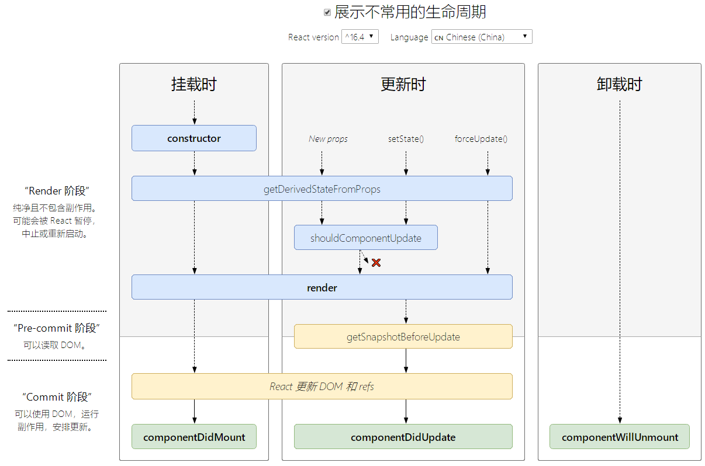

# react

## 核心概念

### JSX

全称 `JavaScript XML` ，react定义的一种类似于XML的JS扩展语法: XML+JS，用来创建react虚拟DOM(元素)对象，不是字符串, 也不是HTML/XML标签，最终产生的就是一个JS对象。

```jsx
<script type="text/babel"> // 必须使用 babel
	const ele1 = ( // 可以包含很多子元素
    <div>
      <h1>Hello!</h1>
      <h2>Good to see you here.</h2>
    </div>
  ) // 不需要加上引号，否则就是字符串了
	const ele2 = ; // 假如标签里面没有内容，可以使用 /> 来闭合标签
	const ele3 = <div tabIndex="0"></div> // 使用引号，来将属性值指定为字符串字面量
	const ele4 = </img> // 使用大括号，插入一个 JS 表达式
  ...
</script>
```

遇到 `<` 开头的代码，以标签的语法解析: html同名标签转换为html同名元素，其它标签需要特别解析。因此，必须要写 `</..>` 结束标签。对于像img这种自结束标签，也必须``加上 /

遇到以 `{` 开头的代码，以JS语法解析: 标签中的js代码必须用 `{ }` 包含

JSX 语法上更接近 JavaScript 而不是 HTML，所以 React DOM 使用 `camelCase`（驼峰命名）来定义属性的名称，而不使用 HTML 属性名称的命名约定。 

浏览器不能直接解析JSX代码，需要babel转译为纯JS的代码才能运行，只要用了JSX，都要加上 `type="text/babel"` ，声明需要babel来处理。Babel 会把 JSX 转译成一个名为 `React.createElement()` 函数调用。 

```javascript
const element = (
  <h1 className="greeting">
    Hello, world!
  </h1>
);
// 等价于
const element = React.createElement(
  'h1',
  {className: 'greeting'},
  'Hello, world!'
);

// React.createElement() 会预先执行一些检查，以帮助你编写无错代码，实际上它创建了一个这样的对象：
// 注意：这是简化过的结构
const element = {
  type: 'h1',
  props: {
    className: 'greeting',
    children: 'Hello, world!'
  }
};
```

#### render() 渲染虚拟DOM

语法：`ReactDOM.render(virtualDOM, containerDOM)`，将虚拟DOM元素渲染到真实容器DOM中显示。 React DOM 会将元素和它的子元素与它们之前的状态进行比较，并只会进行必要的更新来使 DOM 达到预期的状态。 

​	参数一：纯js或jsx创建的虚拟dom对象

​	参数二：用来包含虚拟DOM元素的真实dom元素对象容器(一般是一个div)

**render()函数渲染组件标签**

1. React内部创建组件实例对象
2. 得到虚拟DOM，并解析为真实DOM
3. 插入到指定的元素内部

```javascript
<script type="text/javascript">
  const msg = 'I Like You'
	const myId = 'Atguigu'
  
  /* 方式一：纯JS */
  // 1.创建虚拟DOM方式一：纯JS（本质）
  const vDom1 = React.createElement('h2',{id: myId.toLowerCase()}}, msg.tuUpperCase())
  // 2.渲染虚拟DOM
  ReactDOM.render(vDom1, document.getElementById('test1'))
</script>

<script type="text/babel"> // 用babel
  /* 方式二：JSX */
  // 1.创建虚拟DOM方式二：JSX（方式一的语法糖）
  const vDom2 = <h1 id={myId.toUpperCase()}>{msg.toLowerCase()}</h1> 
  // 2.渲染虚拟DOM
  ReactDOM.render(vDom2, document.getElementById('test2'))
</script>
```

为什么要采用虚拟DOM，而不是直接修改真实的DOM呢？（最主要的3个原因）

1. 很难跟踪状态发生的改变：原有的开发模式，很难跟踪到状态发生的改变，不方便针对应用程序进行调试
2. 操作真实DOM性能较低：传统的开发模式会进行频繁的DOM操作，而这一的做法的性能非常低。真实DOM是一个非常重（复杂）的对象，而虚拟DOM对象则比较轻（简单）。其次，真实DOM操作会引起浏览器的回流和重绘，非常消耗浏览器的性能
3. 从命令式编程变为声明式编程，简化编程模型，开发者只需关心最终的 UI 应该是什么样子，而不是如何通过一系列的 DOM 操作来达到这个状态。

##### render函数的返回值

当 render 被调用时，它会检查 this.props 和 this.state 的变化并（只能）返回以下类型之一： 

- **React 元素**：
  - 通常通过 JSX 创建。
  - 例如，<div /> 会被 React 渲染为 DOM 节点，<MyComponent /> 会被 React 渲染为自定义组件。
  - 无论是 <div /> 还是 <MyComponent /> 均为 React 元素。
- **数组或 fragments**：使得 render 方法可以返回多个元素。
- **Portals**：可以渲染子节点到不同的 DOM 子树中。
- **字符串或数值类型**：它们在 DOM 中会被渲染为文本节点
- **布尔类型或 null**：什么都不渲染

注意，`render()` 渲染函数在渲染时，在 `{ }` 中会不显示/忽略一些：

```jsx
// 会忽略 null、undefined、Boolean、对象 ，原因很简单，用于控制元素的渲染，例如使用三目运算符，结果为false时不要渲染相应的元素
{
  ...
  this.state{
    test1: null, //null
    test2: undefined, // undefined
    test3: true, // Boolean
    test4: { 
      name: 'xxx',
      age: 'yyy'
    }
  }
}
render() { 
  return 
  <div>
    <h2>{this.state.test1}</h2> // 不显示
    <h2>{this.state.test2}</h2> // 不显示
    <h2>{this.state.test3}</h2> // 不显示
    <h2>{this.state.test4}</h2> // 报错，不能直接展示对象
  </div>
}

// 如果我们确实需要其显示，可以用如下方法：
<h2>{this.state.tuest3.toString}</h2> // 1. toString()
test1: String(null) // 2. 如果没有toString()方法，可以使用 String()
<h2>{this.state.test2 + ""}</h2> // 3. 加上空字符串即可
```

#### 深入JSX

##### JSX的本质

实际上，JSX 仅仅只是 `React.createElement(component, props, ...children)` 函数的语法糖，所以JSX才需要babel进行转换，将JSX转换为React.createElement()。

```javascript
<MyButton color="blue" shadowSize={2}>Click Me</MyButton>
// 会编译为：
React.createElement(
  MyButton,
  {color: 'blue', shadowSize: 2},
  'Click Me'
)
```

如果想测试一些特定的 JSX 会转换成什么样的 JavaScript，你可以尝试使用 [在线的 Babel 编译器](https://babeljs.io/repl/#?presets=react&code_lz=GYVwdgxgLglg9mABACwKYBt1wBQEpEDeAUIogE6pQhlIA8AJjAG4B8AEhlogO5xnr0AhLQD0jVgG4iAXyJA)。

1. 使用JSX语法糖编写代码。
2. 通过babel将JSX转换为`React.createElement()`函数。
3. `React.createElement()`函数本质上是创建一个`ReactElement`对象（虚拟DOM对象树）。
4. `ReactElement`对象（虚拟DOM对象树）通过`render`函数渲染/映射到某一元素上，变为真实DOM元素【这一过程称为“协调”】。

##### 指定 React 元素类型

JSX 标签的第一部分指定了 React 元素的类型。

大写字母开头的 JSX 标签意味着它们是 React 组件。这些标签会被编译为对命名变量的直接引用，所以，当你使用 JSX ` <Foo /> ` 表达式时，`Foo` 必须包含在作用域内。

**React 必须在作用域内**

由于 JSX 会编译为 `React.createElement` 调用形式，所以 `React` 库也必须包含在 JSX 代码作用域内。例如，在如下代码中，虽然 `React` 和 `CustomButton` 并没有被直接使用，但还是需要导入：

```javascript
import React from 'react';
import CustomButton from './CustomButton';
function WarningButton() {
  // return React.createElement(CustomButton, {color: 'red'}, null); // 本质 
  return <CustomButton color="red" />;
}
```

如果你不使用 JavaScript 打包工具而是直接通过 `  <script>  ` 标签加载 React，则必须将 `React` 挂载到全局变量中。

**用户定义的组件必须以大写字母开头**

以小写字母开头的元素代表一个 HTML 内置组件，比如 `` 或者 `` 会生成相应的字符串 `'div'` 或者 `'span'` 传递给 `React.createElement`（作为参数）。大写字母开头的元素则对应着在 JavaScript 引入或自定义的组件，如 ` <Foo /> ` 会编译为 `React.createElement(Foo)`。

使用大写字母开头命名自定义组件。如果确实需要一个以小写字母开头的组件，则在 JSX 中使用它之前，必须将它赋值给一个大写字母开头的变量。否则，会将小写的组件名解析为并不存在的HTML标签，从而导致错误。

**在运行时选择类型**

不能将通用表达式作为 React 元素类型。如果你想通过通用表达式来（动态）决定元素类型，你需要首先将它赋值给大写字母开头的变量。 

```javascript
import React from 'react';
import { PhotoStory, VideoStory } from './stories';

const components = {
  photo: PhotoStory,
  video: VideoStory
};

function Story(props) {
  // 错误！JSX 类型不能是一个表达式。
  return <components[props.storyType] story={props.story} />;
  
  // 正确！JSX 类型可以是大写字母开头的变量。
  const SpecificStory = components[props.storyType];
  return <SpecificStory story={props.story} />;
}
```

##### JSX 中的 Props

有多种方式可以在 JSX 中指定 props。

**JS 表达式作为 Props**

可以把包裹在 `{}` 中的 JavaScript 表达式作为一个 prop 传递给 JSX 元素。`if` 语句及 `for` 循环不是 JS 表达式，所以不能在 JSX 中直接使用，但是，你可以用在 JSX 以外的代码中，并定义一个变量，再作为 `props` 传入。 

```javascript
<MyComponent foo={1 + 2 + 3 + 4} />
```

**字符串字面量**

可以将字符串字面量赋值给 prop。如下两个 JSX 表达式是等价的：

```javascript
<MyComponent message="hello world" />
<MyComponent message={'hello world'} />
```

当你将字符串字面量赋值给 prop 时，它的值是未转义的。所以，以下两个 JSX 表达式是等价的：

```javascript
<MyComponent message="&lt;3" />
<MyComponent message={'<3'} />
```

这种行为通常是不重要的，这里只是提醒有这个用法。

**Props 默认值为 “True”**

如果你没给 prop 赋值，它的默认值是 `true`。以下两个 JSX 表达式是等价的：

```javascript
<MyTextBox autocomplete />
<MyTextBox autocomplete={true} />
```

通常，我们不建议不传递 value 给 prop，因为这可能与 ES6对象简写 混淆。

**属性展开**

 可以使用展开运算符 `...` 来在 JSX 中传递整个 props 对象。以下两个组件是等价的： 

```javascript
function App1() {
  return <Greeting firstName="Ben" lastName="Hector" />;
}

function App2() {
  const props = {firstName: 'Ben', lastName: 'Hector'};
  return <Greeting {...props} />;
}
```

还可以选择只保留当前组件需要接收的 props，并使用 `...` 将其他 props 传递下去。

```javascript
const Button = props => {
  // kind 会被保留，不会被传递给 <button> 元素。所有其他的 props 会通过 ...other 对象传递
  const { kind, ...other } = props;  
  const className = kind === "primary" ? "PrimaryButton" : "SecondaryButton";
  return <button className={className} {...other} />;
};

const App = () => {
  return (
    <div>
      <Button kind="primary" onClick={() => console.log("clicked!")}>
        Hello World!
      </Button>
    </div>
  );
};
```

##### JSX 中的 子元素

包含在开始和结束标签之间的 JSX 表达式内容将作为特定属性 `props.children` 传递给外层组件。有几种不同的方法来传递子元素：

**字符串字面量**

```jsx
<MyComponent>Hello world!</MyComponent> // 此时 props.children 就只是 "Hello world!"
```

**JSX 子元素**

React 16 开始，可以返回数组：

```javascript
render() {
  // 不需要用额外的元素包裹列表元素！
  return [
    // 不要忘记设置 key
    <li key="A">First item</li>,
    <li key="B">Second item</li>,
  ];
}
```

**JS表达式作为子元素**

JavaScript 表达式可以被包裹在 `{}` 中作为子元素。

```javascript
// 以下表达式是等价的：
<MyComponent>foo</MyComponent>
<MyComponent>{'foo'}</MyComponent>

// 这对于展示任意长度的列表非常有用。例如，渲染 HTML 列表：
function Item(props) {
  return <li>{props.message}</li>;
}

function TodoList() {
  const todos = ['finish doc', 'submit pr', 'nag dan to review'];
  return (
    <ul>
      {todos.map(message => <Item key={message} message={message} />)}
		</ul>
  );
}

// JS表达式也可以和其他类型的子元素组合。这种做法可以方便地替代模板字符串：
function Hello(props) {
  return <div>Hello {props.addressee}!</div>;
}
```

**函数作为子元素**

`props.children` 和其他 prop 一样，它可以传递任意类型的数据，而不仅仅是 React 已知的可渲染类型。例如，如果你有一个自定义组件，你可以把回调函数作为 `props.children` 进行传递： 

```javascript
// 调用子元素回调 numTimes 次，来重复生成组件
function Repeat(props) {
  let items = [];
  for (let i = 0; i < props.numTimes; i++) {    
    items.push(props.children(i));
  }
  return <div>{items}</div>;
}

function ListOfTenThings() {
  return (
    <Repeat numTimes={10}>
      {index => <div key={index}>This is item {index} in the list</div>}    				     </Repeat>
  );
}
```

你可以将任何东西作为子元素传递给自定义组件，只要确保在该组件渲染之前能够被转换成 React 理解的对象。这种用法并不常见，但可以用于扩展 JSX。

**布尔类型、Null 以及 Undefined 将会忽略**

`false`, `null`, `undefined`, `true` 是合法的子元素,但它们并不会被渲染。以下的 JSX 表达式渲染结果相同：

```javascript
<div />
<div></div>
<div>{false}</div>
<div>{null}</div>
<div>{undefined}</div>
<div>{true}</div>
```

这有助于依据特定条件来渲染其他的 React 元素。例如，在以下 JSX 中，仅当 `showHeader` 为 `true` 时，才会渲染 ` <Header /> ` 组件：

```javascript
<div>
  {showHeader && <Header />}  
	<Content />
</div>
```

值得注意的是有一些 [“falsy” 值](https://developer.mozilla.org/en-US/docs/Glossary/Falsy)，如数字 `0`，仍然会被 React 渲染。例如，以下代码并不会像你预期那样工作，因为当 `props.messages` 是空数组时，`0` 仍然会被渲染：

```javascript
<div>
  {props.messages.length && <MessageList messages={props.messages} />}
</div>

// 要解决这个问题，确保 `&&` 之前的表达式总是布尔值：
<div>
  {props.messages.length > 0 && <MessageList messages={props.messages} />}
</div>

// 反之，如果你想渲染 `false`、`true`、`null`、`undefined` 等值，你需要先将它们转换为字符串
<div>
  My JavaScript variable is {String(myVariable)}
</div>
```

### 组件化

1. 组件名必须首字母大写。React 会将以小写字母开头的组件视为原生 DOM 标签。 
2. 虚拟DOM元素只能有一个根元素
3. 虚拟DOM元素必须有结束标签，像img标签也必须写为

#### 3类组件

##### 函数组件

- 组件名必须大写开头
- 没有this
- 没有生命周期，也会被更新并挂载，但是没有生命周期函数
- 没有内部的状态state（函数中定义的变量是临时变量）

```javascript
// 接收唯一带有数据的 “props” 并返回一个 React 元素。本质上就是JS函数。
function Welcome(props) {
  return <h1>Hello, {props.name}</h1>;
}
```

##### 类组件

- 组件名必须大写开头
- 需要继承自React.Component
- 必须实现render函数
- constructor是可选的
- this.state中维护的是组件内部的数据

```javascript
class Welcome extends React.Component {
  render() {
    return <h1>Hello, {this.props.name}</h1>;
  }
}
```

##### 组合（嵌套）组件

组件可以在其输出中引用其他组件。 

```javascript
// 例如，我们可以创建一个可以多次渲染 Welcome 组件的 App 组件：
function Welcome(props) {
  return <h1>Hello, {props.name}</h1>;
}

function App() {
  return (
    <div>
      <Welcome name="Sara" />
      <Welcome name="Cahal" />
      <Welcome name="Edite" />
    </div>
  );
}

ReactDOM.render(<App />, document.getElementById('root'));
```

#### 3大属性

##### props

当 React 元素为用户自定义组件时，它会将 JSX 所接收的属性（attributes）以及子组件（children）转换为单个对象传递给组件，这个对象被称之为 `props` 。 

1. 每个组件对象都会有props属性，任何东西都可以通过props进行传递，通过 `props.xxx` 来获取。
4. 只读性：组件内部不要修改props数据。
5. 向下流动（单向数据流）：组件会在其 props 中接收参数，但是组件本身无法知道它是来自于props、还是state，或是手动输入的。

```javascript
// 传递属性
const ele = <Welcome name="Sara" />;

// 获取传入的属性
function Welcome(props) {
  return <h1>Hello, {props.name}</h1>;
}

// 对props中的属性值进行类型限制和必要性限制
/* 详细见 高级指引 - PropTypes 类型检查 */
Person.propTypes = {
	name: React.PropTypes.string.isRequired,
	age: React.PropTypes.number.isRequired
}

// 扩展属性: 将对象的所有属性通过props传递
<Person {...person}/>

// 默认属性值
Person.defaultProps = {
	name: 'Mary'
}

// 组件类的构造函数
constructor (props) {
	super(props)
	console.log(props) // 查看所有属性
}
```

##### state & setState()

```javascript
// 初始化状态
constructor (props) {
  super(props)
  this.state = {
    stateProp1 : value1,
    stateProp2 : value2
  }
}

// 读取某个状态值
this.state.stateProp1

// 更新状态 ----> 组件界面更新
this.setState({
  stateProp1 : value1,
  stateProp2 : value2
})
```

```javascript
// 注意：保持state中数据的不可变性

// 在开发中，不要这样来做，即，不要直接获取state数据，然后对其进行修改，而是定义一个新的相同的类型，对新的类型赋值完成后，再将其赋值给旧的state数据

// 错误写法：
const newDate = {name: 'tom', age: 30}
this.state.friends.push(newData)
this.setState({
  friends: this.state.friends
})
// 实际上，对象和数组获取的都是地址引用类型，因此修改会直接作用到自身，即 
// friends: this.state.friends 左右两者是相同的，
// 从而导致 shouldComponentUpdate() 生命周期中的比较 if(newState.friends !== this.state.friends) 一直是相等状态

// 正确写法：
const newFriends = [...this.state.friends] // 建议使用ES6展开运算符
newFriends.push({name: 'tom', age: 30})
this.setState({
  friends: newFriends
})
// 此时，friends 和 newFriends 引用的是不同的地址，因此 shouldComponentUpdate() 生命周期中的比较 if(newState.friends !== this.state.friends) 是不同的


// 注意：实际上，如果我们需要进行浅层比较，例如需要实现shouldComponentUpdate()生命周期 或 extends PureComponent ，此时，必须使用第二种正确写法，否则则会不起作用，
// 但是，如果不需要考虑render()函数的刷新条件，则2种写法都可以！！！但是，在实际开发中，建议只采用正确写法，保持state的不可变性，确保随时可以进行SCU优化，不要尝试错误写法，否则会留下坑。
```

1. 通过问自己以下三个问题，你可以逐个检查相应数据是否属于 state：

   - 该数据是否是由父组件通过 props 传递而来的？如果是，那它应该不是 state。
   - 该数据是否随时间的推移而保持不变？如果是，那它应该也不是 state。
   - 你能否根据其他 state 或 props 计算出该数据的值？如果是，那它也不是 state。

2. state的存放位置：

   - 找到根据这个 state 进行渲染的所有组件。
   - 找到他们的共同所有者（common owner）组件（在组件层级上高于所有需要该 state 的组件）。
   - 该共同所有者组件或者比它层级更高的组件应该拥有该 state。
   - 如果你找不到一个合适的位置来存放该 state，就可以直接创建一个新的组件来存放该 state，并将这一新组件置于高于共同所有者组件层级的位置。

3. state是组件对象最重要的属性，值是对象(可以包含多个数据)，state 是私有的，并且完全受控于当前组件。 

4. 组件被称为"状态机"，通过更新组件的state来更新对应的页面显示(重新渲染组件)。

5. 不要直接修改state，而是用 `setState()` 。

   ```javascript
   this.state.comment = 'Hello'; // 错误
   this.setState({comment: 'Hello'}); // 正确，用setState()
   ```

   `setState`方法与包含在其中的执行是一个很复杂的过程，这段程式码从React最初的版本到现在，也有无数次的修改。它的工作除了要更动`this.state`之外，还要负责触发重新渲染(render)，这里面要经过React核心中diff演算法，最终才能决定是否要进行重渲染，以及如何渲染。而且为了批次与效能的理由，多个`setState`呼叫有可能在执行过程中还需要被合并，所以它被设计以异步的或延时的来进行执行是相当合理的。 

6. 为什么需要使用 `setState()` ？

   React并没有实现类似于Vue2中的Object.defineProperty或者Vue3中的Proxy的方式来监听数据的变化，因此并不能知道 state 中的数据发生了变化，必须用 `setState()` 来告诉 React 数据发生了变化，并重新渲染界面。 `setState()` 来自继承的 `extends Component` ，`Component` 的 `prototype` 原型上有 `setState` 。

7. `setState()` 中数据的合并

   即，`setState()` 可以只更新其中的部分数据，不需要将所有的数据都写一次，源码中使用 `Object.assign` 来操作，将值进行拷贝，没有涉及的键值对通过拷贝保留下原来的数据，再将新的数据覆盖原来的数据，从而达到数据的合并。`Object.assign({}, preState, partialState)` 。

8. `setState()` 可能会引发不必要的渲染。

   `state`本身的设计是无法直接更改，`setState`的设计是用来更动`state`值，也会触发重新渲染(re-render)，按照逻辑就是反正不管如何，只要开发者呼叫`setState`，React就去作整个视图的重新渲染就是。所以`setState`必定会作重新渲染的执行，只是要如何渲染是由React来决定。

   重新渲染(re-render)指的主要是页面上视图(View)的重新再呈现，这是React原本的核心设计，但这个设计是有一些问题的。最主要的是state(状态)并不一定单纯只用来记录与视图(View)有关的状态，也有可能是某个内部控制用的属性值，或是只套用在内部使用的资料。当你改变了这些与视图无关的state(状态)值，以现在的React设计来说，照样要触发重新渲染的执行过程，这在某些复杂的应用时，由于造成不必要的渲染，也有可能造成效能上的问题。

9. `setState()` 无法完全掌控应用中所有组件的状态。

   `state`(状态)是独立于每个组件内部的，而且它是个不能直接更动的对象，这个设计当然是为了要保持组件的封装与独立性，但所以如果当要开发一个复杂的应用时，必定需要使用那些能掌控所有组件资料，以及能提供各组件间资料互动的函式库，例如Flux, Redux或MobX等等。

   React组件目前只能透过各种生命周期的方法，与外部资源、计时器或DOM事件来进行挂勾(Hook)，这些都无法直接使用`setState`方法来进行管理，因此`setState`并没有办法完全掌控一个应用中所有组件的状态，它比较像是每个组件中的都有的一种接口方法，单纯要依靠`setState`方法来管控整个React应用，完全是不足够的。

10. `setState()`的合并（「Batch Update」批量更新）。 

   不管 `setState()` 被调用多少次，都会在函数执行结束以后，被合并为一次并重新渲染，以提高性能,。当你调用 `setState()` 的时候，React 会把你提供的对象合并到当前的 state。所以当State是一个多键值的结构时，可以单独更新其中的一个，此时会进行“差分”更新，不会影响其他的属性值（见上面的`setState()` 中数据的合并）。 

   ```javascript
   // 例如，你的 state 包含几个独立的变量：
   constructor(props) {
     super(props);
     this.state = {
       posts: [],
       comments: []
     };
   }
   // 然后你可以分别调用 setState() 来单独地更新它们：
   componentDidMount() {
     fetchPosts().then(response => {
       this.setState({ posts: response.posts }); 
       // 这里的合并是浅合并，完整保留 this.state.posts，但是完全替换了 this.state.comments。
     });
     fetchComments().then(response => {
       this.setState({ comments: response.comments }); 
       // 这里的合并是浅合并，完整保留 this.state.comments，但是完全替换了 this.state.posts。
     });
   }
   ```

   所以，类似于下面的代码，可能不会有我们想要的效果：

   ```javascript
   // 假设现在this.state.value = 0
   function eventHandler(){
     this.setState({value:this.state.value + 1});
     this.setState({value:this.state.value + 1});
     this.setState({value:this.state.value + 1});
   }
   // 最后this.state.value仍然会是1，而不是3
   
   // 上面的操作会导致三次组件渲染，而运行上面的代码可以发现组件只渲染了一次。
   /* 由于setState()会将操作进行保存而不是立即执行，因此，实际上，是将
   		Object.assign({}, {value: 0}, {value+1})
   		Object.assign({}, {value: 0}, {value+1})
   		Object.assign({}, {value: 0}, {value+1})
   		将三次一样的操作合并为一次
   */
   ```

   所以不能依赖 `this.state` 来计算未来状态。如果想实现这样的效果，应该传一个函数给setState。这个函数有两个参数，第一个为`previous state`，第二个为`props` ：

   第二个参数 `props` 基本很少用到。

   本质上，使用函数时也会进行合并，只是当使用函数时，使用的是上一次操作后的结果，因此可以进行累计操作。

当你传递一个对象给 `setState` 时，所有的 `setState` 调用都会合并，并且基于同一个原始的 `state` 值进行计算。但是，当你传递一个函数给 `setState` 时，每个 `setState` 调用都会接收到最新的 `state` 值作为参数，然后基于该值返回一个新的 `state` 对象。

   ```javascript
   this.setState((preState, props) => {
     return {
       value: preState.value + 1
     } 
   });
   ```

   这里的例子和props无关，只需要第一个参数，所以要达到效果，代码是这样：

   ```javascript
   // 假设 this.state = { value: 0 }
   function eventHandler() {
     this.setState((state) => ({ value: state.value + 1}));
     this.setState((state) => ({ value: state.value + 1}));
     this.setState((state) => ({ value: state.value + 1}));
   }
   // 现在this.state.value是3
   ```

11. `setState()` 可能是异步的（准确地说：不是保证同步的），因此不能在执行完 `setState()` 后马上拿到最新的 state 值。但是当脱离了React的控制，React不知道如何进行Batch Update，`setState()` **就会是同步的**，最常见的例如将 `setState()` 放在 `setTimeout` 的回调函数中、使用原生DOM监听按钮的点击的回调函数中。简单来说，在React的合成事件中是异步的，在原生DOM事件中是同步的。React源码中会根据**不同的上下文**决定是同步处理还是异步处理。

    ​	不保证`this.state`会立即更新，所以在调用这个方法后存取`this.state`可能会回传旧的值。

    ​	不保证呼叫`setState`就会同步地执行，而它们也可能最终被被批量调用(多次呼叫的情况下)。你可以提供额外的回调(callback)，会在`setState`实际被完成时被执行。

    简单来说，为什么要将 `setState()` 设计成异步：

    - 可以提升性能

      ​	一般都会多次调用 `setState()` 如果每次调用setState都进行一次更新，那么意味着render函数会被频繁调用，界面重新渲染，这样效率是很低的；最好的办法应该是获取到多个更新，之后进行批量更新。

    - 保证state和props的一致性

      ​	如果同步更新了 state，但是还没有执行render的函数，那么state和props不能保持同步，会产生很多的问题。

    如果想要获取 `setState()` 后最新的数据，可以：

    - 方式一：将一个函数作为第二个参数，类似于 Vue 中的 nextTick，回调函数会在state更新后立即调用

      ```javascript
      this.setState({
      	message: "hello"
      }, () => {
      	console.log(this.state.message); // hello
      })
      ```

    - 方式二：在 `componentDidUpdate` 生命周期中获取

      ```javascript
      componentDidUpdate() {
      	console.log(this.state.message)
      }
      ```

    将setState的改变的效果进入队列，并在某个特定的时间节点合并，一起刷新state是一个很好的机制。

    因为 `this.props` 和 `this.state` 可能会异步更新，所以你不要依赖他们的值来更新下一个状态。

    ```javascript
    /* 
    	setState()方法同步re-render在很多情况下是很差的选择，例如，如果给父节点和子节点两个组件，都绑定了点击事件，当他们要触发setState的时候，我们并不希望事件的冒泡，导致父节点被re-render两次。
    	因此，setState()方法并不是同步re-render的，无法同步re-render就无法同步刷新this.props，这就导致当setState同步改变父节点state的时候，父节点传递给子节点的props是不能同步刷新的，就会导致有时候我们获取到的props并不是我们想要的值，例如下面的例子，此代码可能会无法更新计数器：
    */
    this.setState({
      counter: this.state.counter + this.props.increment,
    });
    ```

    要获取 `setState()` 更新后的最新的 `props` 值：可以让 `setState()` 接收一个函数而不是一个对象。这个函数用上一个 `state` 作为第一个参数，将更新后的 `props` 作为第二个参数：

    ```javascript
    this.setState((state, props) => ({
      counter: state.counter + props.increment
    }));
    
    // 当更新state，然后想打印state的时候，应该使用回调
    this.setState({
      key: val
    }, () = console.log(this.state));
    ```

    
    
    1. **React 控制下的环境（合成事件和生命周期钩子）**:
       - 在 React 的合成事件处理函数（例如 onClick, onChange 等）和生命周期钩子（例如 componentDidMount, componentDidUpdate 等）中，`setState` 是“异步”的。它不会立即更新状态，而是将更新排队，稍后一起处理。
    2. **非 React 控制下的环境（原生事件和 `setTimeout`/`setInterval`）**:
       - 在原生事件处理函数（由 `addEventListener` 添加）和 `setTimeout` 或 `setInterval` 的回调中，`setState` 是“同步”的。它会立即更新状态并触发重新渲染。
    
    可以理解为，react是尽量将setState做成异步操作，而非React控制下的环境，react无法对其进行控制，因此无法做到异步只能同步
    
     

##### refs 与 事件处理

refs 见 高级指引 - Refs and the DOM

事件处理 见 核心概念 - 事件处理。

### 生命周期

#### v16.4+

在新的生命周期中去掉了三个过时的：

- `componentWillMount()`
- `componentWillReceiveProps()`
- `componentWillUpdate()`

而添加了两个新的：

- `getDerivedStateFromProps()`
- `getSnapshotBeforeUpdate()`

图片来源：https://projects.wojtekmaj.pl/react-lifecycle-methods-diagram/




#### 挂载时的生命周期

##### constructor()

constructor中一般只做两件事情：

	1. 通过给 this.state 赋值对象来初始化内部的state
 2. 为事件绑定this

##### getDerivedStateFromProps()

强制开发者在render之前只做无副作用的操作，能做的操作局限在根据props和state决定新的state。被废弃的所有生命周期函数才能实现的功能，都可以通过 `getDerivedStateFromProps` 来实现。 

无论是 Mounting 还是 Updating，也无论是因为什么引起的 Updating，全部都会被调用。

返回一个对象来更新状态，或者返回 null 来不更新任何内容。 

其是一个静态函数（ 简单说，就是应该一个纯函数），所以函数体内不能访问 this。

```javascript
static getDerivedStateFromProps(nextProps, prevState) { // 一般需要 static
  // 根据 nextProps 和 prevState 计算出预期的状态改变，返回结果会被送给setState
}
```

注意：

① getDerivedStateFromProps前面要加上`static`保留字，声明为静态方法，不然会被react忽略掉。

 

② getDerivedStateFromProps里面的 `this `为 `undefined`。

static静态方法只能Class(构造函数)来调用(App.staticMethod✅)，而实例是不能的( (new App()).staticMethod ❌ )。当调用React Class组件时，该组件会实例化；

所以，React Class组件中，静态方法getDerivedStateFromProps无权访问Class实例的this，即this为undefined。

使用时机：

​	派生状态会导致代码冗余，并使组件难以维护。 [确保你已熟悉这些简单的替代方案](https://links.jianshu.com/go?to=https%3A%2F%2Fzh-hans.reactjs.org%2Fblog%2F2018%2F06%2F07%2Fyou-probably-dont-need-derived-state.html)

- 如果你需要执行副作用（例如，数据提取或动画）以响应 props 中的更改，请改用 componentDidUpdate。
- 如果只想在 prop 更改时重新计算某些数据，请使用 memoization helper 代替。
- 如果你想在 prop 更改时“重置”某些 state，请考虑使组件完全受控或使用 key 使组件完全不受控 代替。

##### render()

根据组件的 `props` 和 `state`（两者的重传递、重赋值，无论值是否有变化，都可以引起组件重新render） ，return 一个React元素（描述组件，即UI），不负责组件实际渲染工作，之后由React自身根据此元素去渲染出页面DOM。render是纯函数，不能在里面执行`this.setState`，会有改变组件状态的副作用。

`setState()` 会导致所有的render()都重新执行，如果需要进行控制，详见在 `shouldComponentUpdate()` 生命周期。

##### componentDidMount()

组件挂载到DOM后调用，且只会被调用一次 

可以进行的操作：

- 依赖于DOM的操作（一般在React中不会直接操作DOM）
- 发送网络请求合适的地方（官方推荐）
- 添加一些订阅（会在componentWillUnmount取消订阅）

#### 更新时的生命周期

##### 引起组件更新的原因

- 更新流程：props/state改变 --> render函数重新执行 --> 产生新的DOM树 --> 新旧DOM树进行diff --> 计算出差异进行更新 --> 更新到真实的DOM

造成组件更新有两类（三种）情况：`new props`、`setState`、`forceupdate`

1. 父组件重新render，父组件重新render引起子组件重新render的情况有两种：

   1. 1  直接使用，每当父组件重新render导致的重传props，子组件将直接跟着重新渲染，无论props是否有变 化。可通过shouldComponentUpdate方法优化。 

   ```javascript
   class Child extends Component {
      shouldComponentUpdate(nextProps) { 
        // 应该使用这个方法，否则无论props是否有变化都将会导致组件跟着重新渲染
        if(nextProps.someThings === this.props.someThings){
        	 return false
        }
      }
      render() {
        return <div>{this.props.someThings}</div>
      }
   }
   ```

    1.2  在componentWillReceiveProps方法中，将props转换成自己的state。

   ```javascript
   class Child extends Component {
       constructor(props) {
           super(props);
           this.state = {
               someThings: props.someThings
           };
       }
       componentWillReceiveProps(nextProps) { // 父组件重传props时就会调用这个方法
           this.setState({someThings: nextProps.someThings});
       }
       render() {
           return <div>{this.state.someThings}</div>
       }
   }
   ```

    在该函数(componentWillReceiveProps)中调用 this.setState() 将不会引起第二次渲染。因为componentWillReceiveProps中判断props是否变化了，若变化了，this.setState将引起state变化，从而引起render，此时就没必要再做第二次因重传props引起的render了，不然重复做一样的渲染了。

2. 组件本身调用setState，无论state有没有变化。可通过shouldComponentUpdate方法优化。 

   ```javascript
   class Child extends Component {
      constructor(props) {
           super(props);
           this.state = {
             someThings:1
           }
      }
      shouldComponentUpdate(nextStates){ // 应该使用这个方法，否则无论state是否有变化都将会导致组件重新渲染
           if(nextStates.someThings === this.state.someThings){
             return false
           }
       }
   
      handleClick = () => { // 虽然调用了setState ，但state并无变化
           const preSomeThings = this.state.someThings
            this.setState({
               someThings: preSomeThings
            })
      }
   
       render() {
           return <div onClick = {this.handleClick}>{this.state.someThings}</div>
       }
   }
   ```

##### getDerivedStateFromProps()

见上。

##### shouldComponentUpdate()

- 只要state发生变化，所有的 `render()` 就会被重新执行，但如果有的state发生变化时不需要全部 `render()` 重新执行，可以：

  `shouldComponentUpdata()` 默认返回 `true` ，表示 `render()` 全部重新执行，如果返回 `false` 则表示不重新执行全部 `render()` ，并且，`shouldComponentUpdata()` 有2个参数：

  - `nextProps` 表示更新后的Props

  - `nextState` 表示更新后的State

  因此，可以这样：

  ```javascript
  import React, {PureComponent} from 'react';
  ....
  shouldComponentUpdate(nextProps, nextState) {
    if (this.state.counter !== nextState.counter) {
      return true; // 只有当counter发生变化时才执行render
    }
    
    if (this.state.value !== nextStae.value) {
       return true; // 或者当value发生变化时才执行render
    }
    
    return false; // 其他情况都不重新执行render
  }
  ```

- 但是，所有的控制都需要我们自己手动，工作量太大，实际上，可以：

  ```javascript
  class Main extends PureComponent { // 继承自 PureComponent
    // 就可以自动比较state和props，看是否重新执行render()
  }
  ```

- 但是，`PureComponent` 依然无法用于函数组件，函数组件则需要 `memo`

  ```javascript
  import React, {PureComponent, memo} from 'react';
  ....
  const MemoHeader = memo(function Header() {
  	return <h2>我是Header组件</h2>
  })
  ....
  <MemoHeader />
  ```

##### componentWillUpdate()

##### render()

见上。

##### getSnapshotBeforeUpdate()

这个函数应该大部分开发者都用不上（或者说，不要用）。

可用于在更新之前保存一些数据，一般return一个对象，

DOM元素还没有被更新， 可以读取DOM但无法操作DOM，只能去获取DOM信息（例如滚动位置），此生命周期返回的任何值都将作为参数 `snapshot`，这个 `snapshot` 会作为 `componentDidUpdate `的第三个参数传入。 

`snapshot `可以是任何值，到底怎么用完全看开发者自己，`getSnapshotBeforeUpdate` 把 `snapshot` 返回，然后DOM改变，`snapshot `传递给 `componentDidUpdate`。 

```javascript
// 官方例子
class ScrollingList extends React.Component {
  constructor(props) {
    super(props);
    this.listRef = React.createRef();
  }

  getSnapshotBeforeUpdate(prevProps, prevState) {
    // 我们是否要添加新的 items 到列表?
    // 捕捉滚动位置，以便我们可以稍后调整滚动.
    if (prevProps.list.length < this.props.list.length) {
      const list = this.listRef.current;
      return list.scrollHeight - list.scrollTop;
    }
    return null;
  }

  componentDidUpdate(prevProps, prevState, snapshot) {
    // 如果我们有snapshot值, 我们已经添加了新的items.
    // 调整滚动以至于这些新的items 不会将旧items推出视图。
    // (这边的snapshot是 getSnapshotBeforeUpdate方法的返回值)
    if (snapshot !== null) {
      const list = this.listRef.current;
      list.scrollTop = list.scrollHeight - snapshot;
    }
  }

  render() {
    return (
      <div ref={this.listRef}>{/* ...contents... */}</div>
    );
  }
}
```

##### componentDidUpdate()

会在更新后被立即调用，首次渲染不会执行该方法。

可以进行的操作：

- 当组件更新后，可以在此处对 DOM 进行操作
- 如果对更新前后的props进行了比较，也可以在此处进行网络请求（例如，props变化时，执行网络请求）。

注意：该生命周期函数是有3个参数的：

```javascript
componentDidUpdate(preProps, preState, snapshot) { 
	// 参数1：更新前的props
  // 参数2：更新前的state
  // 参数3：用于getSnapshotBeforeUpdate()生命周期函数
}
```


#### 卸载时

##### componentWillUnmouent()

会在组件卸载及销毁之前直接调用。

可以进行的操作：

清理操作，例如，清除 timer，取消网络请求或清除在componentDidMount()中创建的订阅等。

### 事件处理

**事件处理**

1. 通过onXxx属性指定组件的事件处理函数(注意大小写)

   ​	React使用的是自定义(合成)事件，而不是使用的原生DOM事件

   ​	React中的事件是通过事件委托方式处理的(委托给组件最外层的元素)

2. 通过event.target得到发生事件的DOM元素对象

```javascript
<input onFocus={this.handleClick}/>
handleFocus(event) {
	event.target // 返回input对象
}
```

**注意**

1. 组件内置的方法中的 this 为 组件对象

2. 在组件类中自定义的方法中 this 为 null，解决方法：

   ​	a. 强制绑定this：通过函数对象的bind()

   ​	b. 使用箭头函数


- React 事件的命名采用小驼峰式（camelCase），而不是纯小写。

- 使用 JSX 语法时需要传入一个函数作为事件处理函数，而不是一个字符串。

  ```javascript
  <button onclick="activateLasers()">...</button> // 传统HTML
  <button onClick={activateLasers}>...</button> // React
  ```

-  你不能通过返回 `false` 的方式阻止默认行为。你必须显式的使用 `preventDefault` 。 因为React想要提供一致的跨浏览器行为，所以它不依赖于浏览器对事件的默认行为处理。即React的事件是一个合成事件，逻辑由React自行处理。

  ```javascript
  function handleClick(e) {
    e.preventDefault(); // 显式的使用 `preventDefault`
    console.log('The link was clicked.');
  }
  ```

-  使用 React 时，你一般不需要使用 `addEventListener` 为已创建的 DOM 元素添加监听器，需要在该元素初始渲染的时候添加监听器。 

  ```javascript
  <button onClick={this.xxx}>...</button>
  ```

- class 的方法默认不会绑定 `this`。如果你忘记绑定 `this.handleClick` 并把它传入了 `onClick`，当你调用这个函数的时候 `this `的值为 `undefined`。

  ```javascript
  /* 推荐 */
  /* 方式一 传入一个箭头函数，在箭头函数中调用要执行的函数 */
  render() {
    return (
    	<div>
      	<button onClick={ () => {this.xxx(abc)} }>按钮</button>  
  			<button onClick={ e => {this.xxx(abc, e)} }>按钮</button> // e是event对象
      </div>
    )
  }
  xxx(abc) {
    ...
  }
  
  /* 方式二：行间定义事件后面使用bind绑定this */
  // 一般不使用这种方式，因为代码重复太多，例如有多个按钮调用xxx方法时，每个按钮都需要进行bind
  render() {
    return (
      <div>
      	<button onClick={this.xxx.bind(this, yyy)}>按钮</button> // bind括号内第一个参数是修改this的，后面可以设置其他参数进行传值。
  		<div>
    )
  }
  btnClick() {
    ...
  }
  
  /* 方式三：在构造函数内部声明this指向 */
  class xxx extends React.Component {
    constructor(props) {
      ...
      this.handleClick = this.btnClick.bind(this);
    }
    render() {
      return (
        <div>
        	<button onClick={this.btnClick}>按钮</button>
        <div>
      )
    }
    btnClick() {
      ...
    }
  }
  
  /* 方式四：使用箭头函数声明事件 */
  render() {
    return (
    	<div>
      	<button onClick={this.xxx}>按钮</button>
      </div>
    )
  }
  xxx = () => { ... }
  ```

- 向事件处理程序传递参数。在循环中，通常我们会为事件处理函数传递额外的参数。例如，若 `id` 是你要删除那一行的 ID，以下两种方式都可以向事件处理函数传递参数： 

  ```javascript
  <button onClick={(e) => this.deleteRow(id, e)}>Delete Row</button>
  <button onClick={this.deleteRow.bind(this, id)}>Delete Row</button>
  ```

  上述两种方式是等价的。在这两种情况下，React 的事件对象 `e` 会被作为第二个参数传递。如果通过箭头函数的方式，事件对象必须显式的进行传递，而通过 `bind` 的方式，事件对象以及更多的参数将会被隐式的进行传递。 

### 条件渲染

- 声明一个变量并使用 `if` 语句进行条件渲染。适合逻辑代码非常多的情况

  ```javascript
  function Greeting(props) {
    const isLoggedIn = props.isLoggedIn;
    if (isLoggedIn) {
      return <UserGreeting />;
    } else {
      return <GuestGreeting />;
    }
  }
  
  ReactDOM.render(
    <Greeting isLoggedIn={false} />,
    document.getElementById('root')
  );
  ```
  
- 与运算符 && 。

  ```jsx
  function Mailbox(props) {
    const xxx = props.xxx;
    return (
      <div>
      	// 通过花括号包裹代码，可以在JSX中嵌入任何表达式。
      	<h2>{xxx.length && "你好啊"}</h2> // 条件不满足时<h2>还是存在的
        {xxx.length>0 && <h2>你好啊</h2>} // 条件不满足时<h2>也不存在
      </div>
    );
  }
  ```
  
- 三目运算符。

  ```javascript
  render() {
    const isLoggedIn = this.state.isLoggedIn;
    return (
      <div>
        {isLoggedIn
          ? <LogoutButton onClick={this.handleLogoutClick} />
          : <LoginButton onClick={this.handleLoginClick} />
        }
      </div>
    );
  }
  ```

- 阻止条件渲染。少数情况下，可能希望能隐藏组件，即使已经被其他组件渲染。可以让 `render` 返回 `null`，而不进行任何渲染，且并不会影响组件的生命周期。

  ```javascript
  function WarningBanner(props) {
    if (!props.warn) { // 如果warn是false，组件则不会渲染
      return null;
    }
    return (
      <div>Warning</div>
    );
  }
  ```

### 列表 & key

#### 使用 `map()` 渲染组件

```jsx
const numbers = [1, 2, 3, 4, 5];
const listItems = numbers.map(number => <li>{number}</li>);
ReactDOM.render(<ul>{listItems}</ul>, document.getElementById('root'));
```

```jsx
// 在JSX中嵌入map()
function NumberList(props) {
  const numbers = props.numbers;
  return (<ul>{numbers.map(number => <ListItem key={number.toString()} value={number} />)}</ul>)
}
```

```jsx
// 也可以将其抽成组件
function NumberList(props) {
  const numbers = props.numbers;
  const listItems = numbers.map(number => <li>{number}</li>) // 没有指定key
  return (<ul>{listItems}</ul>)
}
const numbers = [1, 2, 3, 4, 5]
ReactDOM.render(<NumberList numbers={numbers} />, document.getElementById('root'))
```

#### key

上述代码没有指定 `key`，会警告：`a key should be provided for list items`。 

万不得已可以使用元素索引 index 作为 key，但是如果列表项目的顺序可能会变化，不建议使用索引来用作 key 值。

如果不指定key，React默认使用索引为 key

```jsx
const todoItems = todos.map(todo => <li key={todo.id}> {todo.text} </li>);
const todoItems = todos.map((todo, index) => <li key={index}> {todo.text} </li> );
```

**用key提取组件**

元素的 key 只有放在就近的数组上下文中才有意义。

例如，你提取出一个 `ListItem` 组件，你应该把 key 保留在数组中的这个 ` <ListItem /> ` 元素上，而不是在 `ListItem` 组件中的 ` <li> ` 元素上。 

一个好的经验是：在 `map()` 方法中的元素需要设置 key 属性。

```jsx
function ListItem(props) {
  return <li>{props.value}</li>; // 这里不需要指定 key
}

function NumberList(props) {
  const numbers = props.numbers;
  const listItems = numbers.map(number =>
  	<ListItem key={number.toString()} value={number} /> // key应该在数组的上下文中被指定
  );
  return (<ul>{listItems}</ul>);
}
  
const numbers = [1, 2, 3, 4, 5];
ReactDOM.render(<NumberList numbers={numbers} />, document.getElementById('root'));
```

**key只是在兄弟节点之间必须唯一**

数组元素中使用的 key 在其兄弟节点之间应该是唯一的，但它们不需要全局唯一。 

```jsx
const sidebar = (
  <ul>
    {props.posts.map(post => <li key={post.id}>...</li>)}
  </ul>
);
const content = props.posts.map(post => <div key={post.id}>...</div>);
```

### 表单

React中，HTML表单元素的工作方式和其他的 DOM 元素有些不同，因为表单元素通常会保持一些内部的 state

#### 受控组件

HTML中，表单元素通常自己维护 state，并根据用户输入进行更新。React中，可变状态（mutable state）通常保存在组件的 state 属性中，且只能通过 `setState()`来更新

将两者结合起来，使 React 的 state 成为“唯一数据源”。渲染表单的 React 组件还控制着用户输入过程中表单发生的操作。被 React 以这种方式控制取值的表单输入元素就叫做“**受控组件**”。

```javascript
/* 受控组件 */
// 例如，input元素的value从state中获取，使得state成为唯一数据源，onChange事件改变state中的value值，从而改变value值，输入的值始终由React的state中对应的值驱动。

// 单向数据流：input的值 --> state中的某个属性 --> input的值

this.state = {
  value: '' // 唯一数据源
};

<input type="text" 
			 value={this.state.value} // input标签中显示的内容唯一由state.value提供
			 onChange={e => this.handleChange(e)} />
  
handleChange(event) { 
  this.setState({
    value: event.target.value // 改变state.value的值
  }) 
}
```

##### textarea 标签

在 HTML 中, ` <textarea> ` 元素通过其子元素定义其文本:

```jsx
<textarea>
  这是在 text area 里的文本
</textarea>
```

而在 React 中，` <textarea> ` 使用 `value` 属性代替。这样，可以使得使用 ` <textarea> ` 的表单和使用单行 input 的表单非常类似：

```javascript
this.state = { value: '请撰写一篇关于你喜欢的 DOM 元素的文章.' };
handleChange(event) => { this.setState({value: event.target.value}); }
<textarea value={this.state.value} onChange={this.handleChange} />        
```

##### select 标签

React 不使用 `selected` 进行默认选项，而是在根 `select` 标签上使用 `value` 属性，这在受控组件中更便捷，因为您只需要在根标签中更新它。 

```javascript
handleChange(event) {
  this.setState({value: event.target.value});
}
<select value={this.state.value} onChange={this.handleChange}>
	<option value="grapefruit">葡萄柚</option>
	<option value="lime">酸橙</option>
	<option value="coconut">椰子</option>
	<option value="mango">芒果</option>
</select>

// 可以将数组传递到 value 属性中，以支持在 select 标签中选择多个选项：
<select multiple={true} value={['B', 'C']}>
```

##### 文件 input 标签

在 HTML 中，` <input type="file"> ` 允许用户从存储设备中选择一个或多个文件，将其上传到服务器，或通过使用 JavaScript 的 [File API](https://developer.mozilla.org/en-US/docs/Web/API/File/Using_files_from_web_applications) 进行控制。

```
<input type="file" />
```

因为它的 value 只读，所以它是 React 中的一个**非受控**组件。

##### 处理多个输入

当需要处理多个 `input` 元素时，可以给每个元素添加 `name` 属性，并让处理函数根据 `event.target.name` 的值选择要执行的操作。 

```javascript
class Reservation extends React.Component {
  constructor(props) {
    super(props);
    this.state = {
      xxx: true,
      yyy: 2
    };
  }

  handleInputChange = event => {
    const target = event.target;
    const value = target.name === 'xxx' ? target.checked : target.value;
    const name = target.name;
    this.setState({ [name]: value });
  }

  render() {
    return (
      <form>
        <label>
    参与:	<input name="xxx" type="checkbox" checked={this.state.isGoing}
            onChange={this.handleInputChange} />
        </label>
        <label>
 来宾人数: <input name="yyy" type="number" value={this.state.numberOfGuests}
            onChange={this.handleInputChange} />
        </label>
      </form>
    );
  }
}
```

##### 受控输入空值

在受控组件上指定 value 的 prop 会阻止用户更改输入。如果你指定了 `value`，但输入仍可编辑，则可能是你意外地将 `value` 设置为 `undefined` 或 `null`。 

```javascript
// 输入最初被锁定，但在短时间延迟后变为可编辑
ReactDOM.render(<input value="hi" />, mountNode);

setTimeout(function() {
  ReactDOM.render(<input value={null} />, mountNode);
}, 1000);
```

##### 成熟的解决方案

如果你想寻找包含验证、追踪访问字段以及处理表单提交的完整解决方案，使用 [Formik](https://jaredpalmer.com/formik) 是不错的选择。然而，它也是建立在受控组件和管理 state 的基础之上 —— 所以不要忽视学习它们。

#### 非受控组件

使用非受控组件时，表单数据将交由 DOM 节点来处理。 

要编写一个非受控组件，可以 [使用 ref](https://reactjs.bootcss.com/docs/refs-and-the-dom.html) 来从 DOM 节点中获取表单数据。 

 例如，下面的代码使用非受控组件接受一个表单的值：

```javascript
class NameForm extends React.Component {
  constructor(props) {
    super(props);
    this.input = React.createRef();
  }

  handleSubmit = event => {
    alert('A name was submitted: ' + this.input.current.value);
    event.preventDefault();
  }

  render() {
    return (
      <form onSubmit={this.handleSubmit}>
        <label>
          Name: <input type="text" ref={this.input} />
        </label>
        <input type="submit" value="Submit" />
      </form>
    );
  }
}
```

非受控组件将真实数据储存在 DOM 节点中，所以在使用非受控组件时，有时候反而更容易同时集成 React 和非 React 代码。如果你不介意代码美观性，并且希望快速编写代码，使用非受控组件往往可以减少你的代码量。否则，你应该使用受控组件。 

##### 默认值

在 React 渲染生命周期时，表单元素上的 `value` 将会覆盖 DOM 节点中的值，在非受控组件中，你经常希望 React 能赋予组件一个初始值，但是不去控制后续的更新。 在这种情况下, 你可以指定一个 `defaultValue` 属性，而不是 `value`。

```javascript
render() {
  return (
    <form onSubmit={this.handleSubmit}>
      <label>
        Name: <input defaultValue="Bob" type="text" ref={this.input} />
      </label>
      <input type="submit" value="Submit" />
    </form>
  );
}
```

同样，` <input type="checkbox"> ` 和 ` <input type="radio"> ` 支持 `defaultChecked`，` <select> ` 和 ` <textarea> ` 支 持 `defaultValue`。

##### 文件输入

在 HTML 中，` <input type="file"> ` 可以让用户选择一个或多个文件上传到服务器，或者通过使用 [File API](https://developer.mozilla.org/en-US/docs/Web/API/File/Using_files_from_web_applications) 进行操作。

```javascript
<input type="file" />
```

在 React 中，` <input type="file" /> ` 始终是一个非受控组件，因为它的值只能由用户设置，而不能通过代码控制。

您应该使用 File API 与文件进行交互。下面的例子显示了如何创建一个 [DOM 节点的 ref](https://reactjs.bootcss.com/docs/refs-and-the-dom.html) 从而在提交表单时获取文件的信息。

```javascript
class FileInput extends React.Component {
  constructor(props) {
    super(props);
    this.fileInput = React.createRef()
  }
  handleSubmit = event => {
    event.preventDefault();
    alert( `Selected file - ${this.fileInput.current.files[0].name}` );
  }

  render() {
    return (
      <form onSubmit={this.handleSubmit}>
        <label>
          Upload file: <input type="file" ref={this.fileInput} />        
        </label>
        <button type="submit">Submit</button>
      </form>
    );
  }
}
ReactDOM.render(<FileInput />, document.getElementById('root'))
```


### 状态提升

将多个组件中需要共享的 `state` 向上移动到它们的最近共同父组件中，父组件相当于数据源，通过 `props` 传递到各个组件，便可实现共享 state。这就是所谓的“状态提升”。 

注意，此时，所需要的 `state` 是通过 `props.xxx` 传入的，子组件不能对其进行修改（props的只读性），这个问题通常是通过使用“受控组件”来解决的。 

```javascript
<input value = {this.state.value} onChange = {this.handleChange}/>
```

在父组件中定义需要传入的 `props` 和 相关的处理函数，一并传入子组件。

### 组合 vs 继承

推荐使用组合而非继承来实现组件间的代码重用。 

#### 包含关系（插槽）

有些组件无法提前知晓子组件的具体内容。

可以使用一个特殊的 `children` prop 来将他们的子组件传递到渲染结果中（类似于Vue的插槽，但React中没有“槽”概念，任何东西都可以作为props传递）： 

```jsx
function FancyBorder(props) {
  return (
    <div className={'FancyBorder FancyBorder-' + props.color}>
      {props.children}
    </div>
  );
}
```

这使得别的组件可以通过 JSX 嵌套，将任意组件作为子组件传递给它们。

```jsx
function WelcomeDialog() {
  return (
    <FancyBorder color="blue">
      <h1 className="Dialog-title"> Welcome </h1>      
    	<p className="Dialog-message">        
    		Thank you for visiting our spacecraft!      
    	</p>    
    </FancyBorder>
  );
}
```

` <FancyBorder> ` JSX 标签中的所有内容都会作为一个 `children` prop 传递给 `FancyBorder` 组件。因为 `FancyBorder` 将 `{props.children}` 渲染在一个 `  <div>  ` 中，被传递的这些子组件最终都会出现在输出结果中。 

有时需要在一个组件中预留出几个“洞”。此时可以不使用 `children`，而是自行约定：将所需内容传入 props，并使用相应的 prop。 

```jsx
function SplitPane(props) {
  return (
    <div className="SplitPane">
      <div className="SplitPane-left">{props.left}</div>
      <div className="SplitPane-right">{props.right}</div>
    </div>
  );
}

function App() {
  return (
    <SplitPane left={ <Contacts /> } right={ <Chat /> } />
  );
}
```

#### 特例关系（组合）

有时会把一些组件看作是其他组件的特殊实例（实例通过props传入真正的数据使组件具体化）。

React中也可以通过组合来实现这一点。“特殊”组件可以通过 props 定制并渲染“一般”组件：

```jsx
// WelcomeDialog 可以说是 Dialog 的特殊实例
function Dialog(props) {
  return (
    <FancyBorder color="blue">
      <h1> {props.title} </h1>
      <p> {props.message} </p>
    </FancyBorder>
  );
}

function WelcomeDialog() {
  return (
    <Dialog title="Welcome" message="Thank you for visiting our spacecraft!" />
  );
}
```

```jsx
// class 形式的组合：
function Dialog(props) {
  return (
    <FancyBorder color="blue">
      <h1>{props.title}</h1>
      <p>{props.message}</p>
      {props.children}
    </FancyBorder>
  );
}

class SignUpDialog extends React.Component {
  constructor(props) {
    super(props);
    this.state = {login: ''};
  }
  render() {
    return (
      <Dialog title="Mars Exploration Program" message="How should we refer to you">
        <input value={this.state.login} onChange={this.handleChange} />
        <button onClick={this.handleSignUp}> Sign Me Up! </button>
      </Dialog>
    );
  }

  handleChange = e => { this.setState({login: e.target.value}); }
  handleSignUp = () => { alert(`Welcome aboard, ${this.state.login}!`); }
}
```

#### 继承【不需要】

在 Facebook，我们在成百上千个组件中使用 React，并没有发现需要使用继承来构建组件层次的情况。

Props 和组合提供了清晰而安全地定制组件外观和行为的灵活方式。注意：组件可以接受任意 props，包括基本数据类型，React 元素以及函数。

如果想在组件间复用非 UI 的功能，建议提取为一个单独的JS模块，如函数、对象或者类。组件可以直接引入（import）而无需通过 extend 继承它们。


## 高级指引

### 代码分割

#### React.lazy

```javascript
import OtherComponent from './OtherComponent' // 不使用 React.lazy
```

`React.lazy` 函数能让你像渲染常规组件一样处理动态引入（的组件）。

1. `React.lazy` 接受一个函数，这个函数需要动态调用 `import()`。它必须返回一个 `Promise`，该 Promise 需要 resolve 一个 `default` export 的 React 组件。
2.  `Suspense` 组件中渲染 lazy 组件，如此使得我们可以使用在等待加载 lazy 组件时做优雅降级（如 loading 指示器等）。`fallback` 属性接受任何在组件加载过程中你想展示的 React 元素。你可以将 `Suspense` 组件置于懒加载组件之上的任何位置。你甚至可以用一个 `Suspense` 组件包裹多个懒加载组件。 

```javascript
// 1.引入
import React, { Suspense } from 'react'; 

// 2.调用React.lazy()函数
const OtherComponent = React.lazy(() => import('./OtherComponent')); 
const AnotherComponent = React.lazy(() => import('./AnotherComponent'));

function MyComponent() {
  return (
    <div>
    	// 3.在Suspense中使用组件
      <Suspense fallback={<div>Loading...</div>}> // 4.设置fallback属性
        <section>
          <OtherComponent />
          <AnotherComponent />
        </section>
      </Suspense>
    </div>
  );
}

```

#### 异常捕获边界

具体见 **错误边界** 。

如果模块加载失败（如网络问题），它会触发一个错误。你可以通过[异常捕获边界（Error boundaries）](https://reactjs.bootcss.com/docs/error-boundaries.html)技术来处理这些情况，以显示良好的用户体验并管理恢复事宜。

```javascript
import React, { Suspense } from 'react';
import MyErrorBoundary from './MyErrorBoundary';

const OtherComponent = React.lazy(() => import('./OtherComponent'));
const AnotherComponent = React.lazy(() => import('./AnotherComponent'));

const MyComponent = () => (
  <div>
  	// 使用 <MyErrorBoundary> 包裹
    <MyErrorBoundary> 
      <Suspense fallback={<div>Loading...</div>}>
        <section>
          <OtherComponent />
          <AnotherComponent />
        </section>
      </Suspense>
    </MyErrorBoundary>
  </div>
);
```

#### 基于路由的代码分割

决定在哪引入代码分割需要一些技巧，一个不错的选择是从路由开始。大多数网络用户习惯于页面之间能有个加载切换过程。你也可以选择重新渲染整个页面，这样用户就不必在渲染的同时再和页面上的其他元素进行交互。 

```javascript
// 这里是一个例子，展示如何在你的应用中使用 React.lazy 和 React Router 这类的第三方库，来配置基于路由的代码分割。
import React, { Suspense, lazy } from 'react';
import { BrowserRouter as Router, Route, Switch } from 'react-router-dom';

const Home = lazy(() => import('./routes/Home'));
const About = lazy(() => import('./routes/About'));

const App = () => (
  <Router>
    <Suspense fallback={<div>Loading...</div>}>
      <Switch>
        <Route exact path="/" component={Home}/>
        <Route path="/about" component={About}/>
      </Switch>
    </Suspense>
  </Router>
);
```

#### 命名导出

`React.lazy` 目前只支持默认导出（default exports）。如果你想被引入的模块使用命名导出（named exports），你可以创建一个中间模块，来重新导出为默认模块。这能保证 tree shaking 不会出错，并且不必引入不需要的组件。

即，将其他模块用命名导出汇集到中间模块后，再将中间模块用默认导出，再用lazy引入中间模块。

- 默认导出：对于导出内容的命名无关紧要，只要给定名称即可，但默认导出只有一个。
- 命名导出：导入时，名称必须与导出的名称一致，可以导出多个。

```javascript
// ManyComponents.js
export const MyComponent = /* ... */;
export const MyUnusedComponent = /* ... */;

// MyComponent.js
export { MyComponent as default } from "./ManyComponents.js";

// MyApp.js
import React, { lazy } from 'react';
const MyComponent = lazy(() => import("./MyComponent.js"));
```

 ### Context

#### 使用时机

Context 主要应用场景在于很多不同层级的组件需要访问同样一些的数据（**跨组件间的通信**）。请谨慎使用，因为这会使得组件的**复用性变差**。如果你只是想避免层层传递一些属性，[组件组合](https://reactjs.bootcss.com/docs/composition-vs-inheritance.html)有时候是一个比 context 更好的解决方案。

Context 提供了一个无需为每层组件手动添加 props，就能在组件树间进行数据传递的方法。 

Context 设计目的是为了共享那些对于一个组件树而言是“全局”的数据，例如当前认证的用户、主题或首选语言。

```javascript
// 1.为当前的 theme 创建一个 context（“light”为默认值）。
const xxx = React.createContext('light');

class App extends React.Component {
  render() {
    // 使用一个 Provider 来将当前的 theme 传递给以下的组件树。无论多深，任何组件都能读取这个值。
    // 在这个例子中，我们将 “dark” 作为当前的值传递下去。
    return (
      // 2.使用创建的 context 包裹需要作用到的组件，并指定当前值 value
      // <xxx.Provider value={this.state}> // 可以将需要共享的数据传入
      /* 可以进行嵌套，此时，必须通过 Consumer 进行获取值
      	<xxx.Provider value="dark">
      		<zzz.Provider>
        		<Toolbar />
        	</zzz.Provider>
      	</xxx.Provider>
      */
      <xxx.Provider value="dark">
        <Toolbar />
      </xxx.Provider>
    );
  }
}

// 中间的组件再也不必指明往下传递 theme 了。
function Toolbar() { // 中间组件
  return (
    <div>
      <ThemedButton />
    </div>
  );
}

class ThemedButton extends React.Component {
  // 3.方式一：指定 contextType 读取当前的 theme context。React 会往上找到最近的 theme Provider，然后使用它的值。在这个例子中，当前的 theme 值为 “dark”。
  static contextType = ThemeContext; 
  render() {
    // 4.方式一：通过this.context使用值。如果需要传递多个可能同名的context，只能用Consumer来写
    return <Button theme={this.context} />; 
    
    return (
      // 4.方式二：使用Consumer来接收值，Consumer里面不能直接渲染其他组件，而是要声明一个函数，参数是组件树中层这个 context 最接近的 Provider 的对应属性。
      <xxx.Consumer> 
      	{
          yyy => <h1>title: {yyy}</h1>
        }
      </xxx.Consumer>

			// 如果有嵌套：
			/* 例如
            <xxx.Provider value="dark">
              <zzz.Provider>
                <Toolbar />
              </zzz.Provider>
            </xxx.Provider>
			*/ 
			/* 则
						<xxx.Consumer>
							{
								xxx => {
									return (
										<zzz.Consumer>
                      {
                      	zzz => {
                      		return (
                      			<div>
                      				<h2>{xxx.value1}</h2>
                      				<h2>{xxx.value2}</h2>
                      				<h2>{zzz.value3}</h2>
                      			</div>
                      		)
                      	}
                      }
                    </zzz.Consumer>
									)
								}
							}
              
            </xxx.Consumer>
						
			*/
			
    )
  }
}
// 3.方式二：除了static contextType = ThemeContext 也可以这样写：
ThemedButton.contextType = ThemeContext;

// 4.如果是函数组件，则必须使用 Consumer
function ThemedButton1() {
  return (
  	<UserContext.Consumer>
    	{ // value就是 <xxx.Provider value={this.state}> 传入的值
        value => {
        	return (
        		<div>
        			<h2>昵称：{value.nickname}</h2>
    					<h2>等级：{value.level}</h2>
        		</div>
        	)
      	}
      }
    </UserContext.Consumer>
  )
}
```

#### API

- **React.createContext**

  ```javascript
  const MyContext = React.createContext(defaultValue);
  ```

  创建一个 Context 对象。当 React 渲染一个订阅了这个 Context 对象的组件，这个组件会从组件树中离自身最近的那个匹配的 `Provider` 中读取到当前的 context 值。

  **只有**当组件所处的树中没有匹配到 Provider 时，其 `defaultValue` 参数才会生效。这有助于在不使用 Provider 包装组件的情况下对组件进行测试。注意：将 `undefined` 传递给 Provider 的 value 时，消费组件的 `defaultValue` 不会生效。

- **Context.Provider**

  ```javascript
  <MyContext.Provider value={/* 某个值 */}>
  ```

  每个 Context 对象都会返回一个 Provider React 组件，它允许消费组件订阅 context 的变化。

  Provider 接收一个 `value` 属性，传递给消费组件。一个 Provider 可以和多个消费组件有对应关系。

  多个 Provider 也可以嵌套使用，里层的会覆盖外层的数据。

  当 Provider 的 `value` 值发生变化时，它内部的所有消费组件都会重新渲染。

  Provider 及其内部 consumer 组件都不受制于 `shouldComponentUpdate` 函数，因此当 consumer 组件在其祖先组件退出更新的情况下也能更新。

  通过新旧值检测来确定变化，使用了与 [`Object.is`](https://developer.mozilla.org/en-US/docs/Web/JavaScript/Reference/Global_Objects/Object/is#Description) 相同的算法。


- **Class.contextType**

  ```javascript
  class MyClass extends React.Component {
    componentDidMount() {
      let value = this.context;
      /* 在组件挂载完成后，使用 MyContext 组件的值来执行一些有副作用的操作 */
    }
    componentDidUpdate() {
      let value = this.context;
      /* ... */
    }
    componentWillUnmount() {
      let value = this.context;
      /* ... */
    }
    render() {
      let value = this.context;
      /* 基于 MyContext 组件的值进行渲染 */
    }
  }
  MyClass.contextType = MyContext;
  ```

  挂载在 class 上的 `contextType` 属性会被重赋值为一个由 `React.createContext()` 创建的 Context 对象。

  这能让你使用 `this.context` 来消费最近 Context 上的那个值。

  你可以在任何生命周期中访问到它，包括 render 函数中。

- **Context.Consumer**

  ```javascript
  <MyContext.Consumer>
    {value => /* 基于 context 值进行渲染*/}
  </MyContext.Consumer>
  ```

  这里，React 组件也可以订阅到 context 变更。这能让你在函数式组件中完成订阅 context。

  这需要[函数作为子元素（function as a child）](https://reactjs.bootcss.com/docs/render-props.html#using-props-other-than-render)这种做法。这个函数接收当前的 context 值，返回一个 React 节点。传递给函数的 `value` 值等同于往上组件树离这个 context 最近的 Provider 提供的 `value` 值。如果没有对应的 Provider，`value` 参数等同于传递给 `createContext()` 的 `defaultValue`。

- **Context.displayName**

  context 对象接受一个名为 `displayName` 的 property，类型为字符串。React DevTools 使用该字符串来确定 context 要显示的内容。

  示例，下述组件在 DevTools 中将显示为 MyDisplayName：

  ```javascript
  const MyContext = React.createContext(/* some value */);
  MyContext.displayName = 'MyDisplayName';
  <MyContext.Provider> // "MyDisplayName.Provider" 在 DevTools 中
  <MyContext.Consumer> // "MyDisplayName.Consumer" 在 DevTools 中
  ```

#### 嵌套组件更新中更新 Context

可以通过 context 传递一个函数，使得 consumers 组件更新 context。

```javascript
// theme-context.js
export const ThemeContext = React.createContext({
  // 确保传递给 createContext 的默认值数据结构是调用的组件（consumers）所能匹配的
  theme: themes.dark,  
  toggleTheme: () => {} // 传递函数      
});
```

```javascript
// theme-toggler-button.js
import {ThemeContext} from './theme-context';

function ThemeTogglerButton() {
  return (
    <ThemeContext.Consumer> // 使用Consumer来接收值
    	// 不仅仅只获取 theme 值，它也从 context 中获取到一个 toggleTheme 函数
      {({theme, toggleTheme}) => (
        <button onClick={toggleTheme} style={{backgroundColor: theme.background}}>
          Toggle Theme
        </button>
      )}
    </ThemeContext.Consumer>
  );
}

export default ThemeTogglerButton;
```

```javascript
// app.js
import {ThemeContext, themes} from './theme-context';
import ThemeTogglerButton from './theme-toggler-button';

class App extends React.Component {
  constructor(props) {
    super(props);
    this.toggleTheme = () => {
      this.setState(
        state => ({theme: state.theme === themes.dark ? themes.light : themes.dark})
      );
    };

       
    this.state = {      
      theme: themes.light,
      toggleTheme: this.toggleTheme // State包含了更新函数，它会被传递进context provider。
    };  
  }

  render() {
    return (
      <ThemeContext.Provider value={this.state}> // 整个 state 都被传递进 provider
      	<Content />
      </ThemeContext.Provider>
    );
  }
}

function Content() {
  return (
    <div>
      <ThemeTogglerButton />
    </div>
  );
}

ReactDOM.render(<App />, document.root);
```

#### 消费多个 Context

为了确保 context 快速进行重渲染，需要使每一个 consumers 组件的 context 在组件树中成为一个单独的节点。 如果两个或者更多的 context 值经常被一起使用，那你可能要考虑一下另外创建你自己的渲染组件，以提供这些值。 

```javascript
const ThemeContext = React.createContext('light');
const UserContext = React.createContext({ name: 'Guest' });

class App extends React.Component {
  render() {
    const {signedInUser, theme} = this.props;
    return (
      <ThemeContext.Provider value={theme}>
        <UserContext.Provider value={signedInUser}>
          <Layout />
        </UserContext.Provider>
      </ThemeContext.Provider>
    );
  }
}

function Layout() {
  return (
    <div>
      <Sidebar />
      <Content />
    </div>
  );
}

// 一个组件可能会消费多个 context，只需要嵌套使用即可
function Content() {
  return (
    <ThemeContext.Consumer>
      {theme => (
        <UserContext.Consumer>
          {user => ( <ProfilePage user={user} theme={theme} /> )}
        </UserContext.Consumer>
      )}
    </ThemeContext.Consumer>
  );
}
```

#### 注意事项

1. 减少不必要使用`context`，`react`重视函数式编程，讲究复用，而使用了`context`的组件，使复用性降低。

2. 传统版本的`react`，尤其要注意`context`在自己的可控范围内，其实最大的问题也就是前面说的`SUC`的问题。

3.  `react-router`其实也用了`Context`的原理。 

4.  **一旦 Provider(提供者) 的 value 属性发生变化时，所有作为 Provider(提供者) 后代的 consumer(使用者) 组件都将重新渲染。 从 Provider 到其后代使用者的传播不受 shouldComponentUpdate 方法的约束，因此即使祖先组件退出更新，也会更新 consumer(使用者**)。 context 会使用参考标识（reference identity）来决定何时进行渲染。这可能使得当 provider 的父组件进行重渲染时，可能会在 consumers 组件中触发意外的渲染。 所以通常的方式是：将`context`的数据保存在`Provide`的`state`属性中，每次通过`setState`更新对应的属性。例如：

   ```javascript
   // 当每一次 Provider 重渲染时，以下的代码会重渲染所有下面的 consumers 组件，因为每次render时{something: 'something'}都指向一个新对象
   class App extends React.Component {
     render() {
       return (
         <MyContext.Provider value={{something: 'something'}}>
           <Toolbar />
         </MyContext.Provider>
       );
     }
   }
   
   // 为了防止这种情况，将 value 状态提升到父节点的 state 里
   class App extends React.Component {
     constructor(props) {
       super(props);
       this.state = {
         value: {something: 'something'} // 将值保存在state中
       };
     }
   
     render() {
       return (
         <Provider value={this.state.value}>
           <Toolbar />
         </Provider>
       );
     }
   }
   ```

#### useContext Hook

接收一个 context 对象（`React.createContext` 的返回值）并返回该 context 的当前值。当前的 context 值由上层组件中距离当前组件最近的 ` <MyContext.Provider> ` 的 `value` prop 决定。

当组件上层最近的 ` <MyContext.Provider> ` 更新时，该 Hook 会触发重渲染，并使用最新传递给 `MyContext` provider 的 context `value` 值。即使祖先使用 [`React.memo`](https://reactjs.bootcss.com/docs/react-api.html#reactmemo) 或 [`shouldComponentUpdate`](https://reactjs.bootcss.com/docs/react-component.html#shouldcomponentupdate)，也会在组件本身使用 `useContext` 时重新渲染。

`useContext` 的参数必须是 context 对象本身：

- **正确：** `useContext(MyContext)`
- **错误：** `useContext(MyContext.Consumer)`
- **错误：** `useContext(MyContext.Provider)`

调用了 `useContext` 的组件总会在 context 值变化时重新渲染。如果重渲染组件的开销较大，你可以 [通过使用 memoization 来优化](https://github.com/facebook/react/issues/15156#issuecomment-474590693)。

> 如果你在接触 Hook 前已经对 context API 比较熟悉，那应该可以理解，`useContext(MyContext)` 相当于 class 组件中的 `static contextType = MyContext` 或者 ` <MyContext.Consumer> `。
>
> `useContext(MyContext)` 只是让你能够读取 context 的值以及订阅 context 的变化，仍然需要在上层组件树中使用 ` <MyContext.Provider> ` 来为下层组件提供 context。

在 `Hooks` 环境中，依旧可以使用 `Consumer`，但是 `ContextType` 作为类静态成员肯定是用不了。Hooks 提供了 `useContext`,不但解决了 `Consumer` 难用的问题同时也解决了 `contextType` 只能使用一个 `context` 的问题。 

```javascript
import React from "react";
import ReactDOM from "react-dom";

// 创建 Context，它返回一个具有两个值的对象：{ Provider, Consumer }
const NumberContext = React.createContext(); 

function App() {
  return (
    <NumberContext.Provider value={42}> // 使用 Provider 为所有子孙代提供 value 值 
      <div>
        <Display />
      </div>
    </NumberContext.Provider>
  );
}

function Display() {
  return (
    <NumberContext.Consumer> // 使用 Consumer 从上下文中获取 value
      { value => <div>The answer is {value}</div> }
    </NumberContext.Consumer>
  );
}
// 使用 useContext hook
function Display() {
  const value = useContext(NumberContext); // 使用 useContext() 获取 value
  return (
    <div> The answer is {value} </div>;
	);
}

ReactDOM.render(<App />, document.querySelector("#root"));
```

```javascript
// 多重嵌套的情况，组件需要从多个父上下文中接收数据
function HeaderBar() {
  return (
    <CurrentUser.Consumer>
      {user =>
        <Notifications.Consumer>
          {notifications =>
            <header>
              {user.name}! {notifications.length}!
            </header>
          }
				</Notifications.Consumer>
      }
    </CurrentUser.Consumer>
  );
}

// 使用 useContext hook
function HeaderBar() {
  const user = useContext(CurrentUser);
  const notifications = useContext(Notifications);
  return (
    <header>
      {user.name}! {notifications.length}!
    </header>
  );
}
```

### 错误边界

部分 UI 的 JavaScript 错误不应该导致整个应用崩溃，为了解决这个问题，React 16 引入了一个新的概念 —— 错误边界，一种 React 组件，**可以捕获并打印发生在其子组件树任何位置的 JavaScript 错误，并且，它会渲染出备用 UI，而不是渲染那些崩溃了的子组件树**。错误边界在渲染期间、生命周期方法和整个组件树的构造函数中捕获错误。 

> **注意**
>
> 错误边界**无法**捕获以下场景中产生的错误：
>
> - 事件处理
> - 异步代码（例如 `setTimeout` 或 `requestAnimationFrame` 回调函数）
> - 服务端渲染
> - 它自身抛出来的错误（并非它的子组件）

如果一个 class 组件中定义了 [`static getDerivedStateFromError()`](https://reactjs.bootcss.com/docs/react-component.html#static-getderivedstatefromerror) 或 [`componentDidCatch()`](https://reactjs.bootcss.com/docs/react-component.html#componentdidcatch)这两个生命周期方法中的任意一个（或两个）时，那么它就**变成**一个错误边界。当抛出错误后，请使用 `static getDerivedStateFromError()` 渲染备用 UI ，使用 `componentDidCatch()` 打印错误信息。 

```javascript
class ErrorBoundary extends React.Component {
  constructor(props) {
    super(props);
    this.state = { hasError: false };
  }

  static getDerivedStateFromError(error) {
    // 更新 state 使下一次渲染能够显示降级后的 UI
    return { hasError: true };
  }

  componentDidCatch(error, errorInfo) {
    // 你同样可以将错误日志上报给服务器
    logErrorToMyService(error, errorInfo);
  }

  render() {
    if (this.state.hasError) {
      // 你可以自定义降级后的 UI 并渲染
      return <h1>Something went wrong.</h1>;
    }

    return this.props.children; 
  }
}
```

```javascript
// 然后你可以将它作为一个常规组件去使用
<ErrorBoundary>
  <MyWidget />
</ErrorBoundary>
```

错误边界的工作方式类似于 JS 的 `catch {}`，不同的地方在于错误边界只针对 React 组件。只有 class 组件才可以成为错误边界组件。大多数情况下, 你只需要声明一次错误边界组件, 并在整个应用中使用它。

注意**错误边界仅可以捕获其子组件的错误**，它无法捕获其自身的错误。如果一个错误边界无法渲染错误信息，则错误会冒泡至最近的上层错误边界，这也类似于 JavaScript 中 catch {} 的工作机制。

**放置位置**

错误边界的粒度由你来决定，可以将其包装在最顶层的路由组件并为用户展示一个 “Something went wrong” 的错误信息，就像服务端框架经常处理崩溃一样。你也可以将单独的部件包装在错误边界以保护应用其他部分不崩溃。 

**未捕获错误（Uncaught Errors）的新行为**

*自 React 16 起，任何未被错误边界捕获的错误将会导致整个 React 组件树被卸载。*

此变化意味着当你迁移到 React 16 时，你可能会发现一些已存在你应用中但未曾注意到的崩溃。增加错误边界能够让你在应用发生异常时提供更好的用户体验。

例如，Facebook Messenger 将侧边栏、信息面板、聊天记录以及信息输入框包装在单独的错误边界中。如果其中的某些 UI 组件崩溃，其余部分仍然能够交互。

我们也鼓励使用 JS 错误报告服务（或自行构建），这样你能了解关于生产环境中出现的未捕获异常，并将其修复。

**组件栈追踪**

在开发环境下，React 16 会把渲染期间发生的所有错误打印到控制台，即使该应用意外的将这些错误掩盖。除了错误信息和 JavaScript 栈外，React 16 还提供了组件栈追踪。现在你可以准确地查看发生在组件树内的错误信息：

[](https://reactjs.bootcss.com/static/f1276837b03821b43358d44c14072945/c3a47/error-boundaries-stack-trace.png)

你也可以在组件栈追踪中查看文件名和行号，这一功能在 [Create React App](https://github.com/facebookincubator/create-react-app) 项目中默认开启：

[](https://reactjs.bootcss.com/static/45611d4fdbd152829b28ae2348d6dcba/6dd26/error-boundaries-stack-trace-line-numbers.png)

如果你没有使用 Create React App，可以手动将[该插件](https://www.npmjs.com/package/babel-plugin-transform-react-jsx-source)添加到你的 Babel 配置中。注意它仅用于开发环境，*在生产环境必须将其禁用。*

> 注意
>
> 组件名称在栈追踪中的显示依赖于 [`Function.name`](https://developer.mozilla.org/en-US/docs/Web/JavaScript/Reference/Global_Objects/Function/name) 属性。如果你想要支持尚未提供该功能的旧版浏览器和设备（例如 IE 11），考虑在你的打包（bundled）应用程序中包含一个 `Function.name` 的 polyfill，如 [`function.name-polyfill`](https://github.com/JamesMGreene/Function.name) 。或者，你可以在所有组件上显式设置 [`displayName`](https://reactjs.bootcss.com/docs/react-component.html#displayname) 属性。

**关于 try / catch**

`try` / `catch` 很棒但它仅能用于命令式代码：

```javascript
try {
  showButton();
} catch (error) {
  // ...
}
```

然而，React 组件是声明式的并且具体指出 *什么* 需要被渲染：

```javascript
<Button />
```

错误边界保留了 React 的声明性质，其行为符合你的预期。例如，即使一个错误发生在 `componentDidUpdate` 方法中，并且由某一个深层组件树的 `setState` 引起，其仍然能够冒泡到最近的错误边界。

**关于事件处理器**

错误边界**无法**捕获事件处理器内部的错误。

React 不需要错误边界来捕获事件处理器中的错误。与 render 方法和生命周期方法不同，事件处理器不会在渲染期间触发。因此，如果它们抛出异常，React 仍然能够知道需要在屏幕上显示什么。

如果你需要在事件处理器内部捕获错误，使用普通的 JavaScript `try` / `catch` 语句：

```javascript
// 下述例子只是演示了普通的 JavaScript 行为，并没有使用错误边界
class MyComponent extends React.Component {
  constructor(props) {
    super(props);
    this.state = { error: null };
    this.handleClick = this.handleClick.bind(this);
  }

  handleClick() {
    try {      
      // 执行操作，如有错误则会抛出    
    } catch (error) {      
      this.setState({ error });    
    }  
  }

  render() {
    if (this.state.error) {      
      return <h1>Caught an error.</h1>    
    }    
    return <button onClick={this.handleClick}>Click Me</button>  
  }
}
```

### Refs and the DOM

#### 基本使用

Refs 提供允许访问 DOM 节点或 render创建的 React 元素。 

注意：当ref的目标是一个组件时，相应的获取的是一个组件对象；并且，ref **无法用于函数组件**，因为函数组件没有组件实例，如果需要获取函数组件，需要使用 `React.forwardRef` 。

```jsx
// 函数（推荐）
import React, {PureComponent, createRef} from 'react'; // 1.导入createRef

constructor(props) {
  super(props);
  this.aaaRef = createRef(); // 2.使用createRef
}

<h2 ref={this.aaaRef}>Hello React</h2> // 3.标注ref

changeText() {
  this.aaaRef.current // 获取到 <h2>Hello React</h2>  通过 current 属性访问
  this.aaaRef.current.innerHTML = "Hello World" // 4.使用
}
```

ref 的值根据节点的类型而有所不同：

- 当 `ref` 用于 HTML 元素时，构造函数中使用 `React.createRef()` 创建的 `ref` 接收底层 DOM 元素作为其 `current` 属性。

- 当 `ref` 用于自定义 class 组件时，`ref` 对象接收组件的挂载实例作为其 `current` 属性。

- **你不能在函数组件上使用 `ref` 属性**，因为没有实例；但可以在函数组件内部使用 `ref` 属性，只要它指向一个 DOM 元素或 class 组件 。如果要在函数组件中使用 `ref`，你可以使用 [`forwardRef`](https://reactjs.bootcss.com/docs/forwarding-refs.html)（可与 [`useImperativeHandle`](https://reactjs.bootcss.com/docs/hooks-reference.html#useimperativehandle) 结合使用），或者 将该组件转化为 class 组件。 

  ```javascript
  /* useRef为 Hook 中新增 */
  function CustomTextInput(props) {
    // useRef 仅能用在Function组件
    const textInput = useRef(null) // 使用 React.useRef() 创建 Refs
  
    function handleClick() {
      textInput.current.focus() // 通过 current 属性进行访问
    }
  
    return (
      <div>
        <input type="text" ref={textInput} />
        <input type="button" value="Focus the text input" onClick={handleClick}/>
      </div>
    );
  }
  ```

React 会在组件挂载时给 `current` 属性传入 DOM 元素，并在组件卸载时传入 `null` 值。`ref` 会在 `componentDidMount` 或 `componentDidUpdate` 生命周期钩子触发前更新。

#### forwardRef

`forwardRef` 是一个高阶组件，用于给函数组件绑定ref属性。

```javascript
import React, {PureComponent} from 'react'

class App extends PureComponent {
  constructor(props) {
    super(props);
    
    this.profileRef = React.createRef(); // 1.创建ref
  }
  
  render() {
    return {
      <div>
      	<Profile ref={this.profileRef}> // 2.传入
      </div>
    }
  }
}

// React 会将 <Profile ref={this.profileRef}> 的 ref 作为第二个参数传递给 React.forwardRef 函数中的渲染函数，该渲染函数会将 ref 传递给 <p ref={ref}> 元素。
const Profile = forwardRef(function(props, ref) { // 自动拥有第2个参数
  // 第2个参数来自于 <Profile ref={this.profileRef}> 中传入的ref
  return <p ref={ref}>Profile</p> // 3.在forwardRef中绑定
}
```

#### 将 DOM Refs 暴露给父组件

在极少数情况下，你可能希望在父组件中引用子节点的 DOM 节点。通常不建议这样做，因为它会打破组件的封装，但它偶尔可用于触发焦点或测量子 DOM 节点的大小或位置。 

虽然你可以[向子组件添加 ref](https://reactjs.bootcss.com/docs/refs-and-the-dom.html#adding-a-ref-to-a-class-component)，但这不是一个理想的解决方案，因为你只能获取组件实例而不是 DOM 节点。并且，它还在函数组件上无效。

如果你使用 16.3 或更高版本的 React, 这种情况下我们推荐使用 [ref 转发](https://reactjs.bootcss.com/docs/forwarding-refs.html)。**Ref 转发使组件可以像暴露自己的 ref 一样暴露子组件的 ref**。关于怎样对父组件暴露子组件的 DOM 节点，在 [ref 转发文档](https://reactjs.bootcss.com/docs/forwarding-refs.html#forwarding-refs-to-dom-components)中有一个详细的例子。

如果你使用 16.2 或更低版本的 React，或者你需要比 ref 转发更高的灵活性，你可以使用[这个替代方案](https://gist.github.com/gaearon/1a018a023347fe1c2476073330cc5509)将 ref 作为特殊名字的 prop 直接传递。

可能的话，我们不建议暴露 DOM 节点，但有时候它会成为救命稻草。注意这个方案需要你在子组件中增加一些代码。如果你对子组件的实现没有控制权的话，你剩下的选择是使用 [`findDOMNode()`](https://reactjs.bootcss.com/docs/react-dom.html#finddomnode)，但在 [`严格模式`](https://reactjs.bootcss.com/docs/strict-mode.html#warning-about-deprecated-finddomnode-usage) 下已被废弃且不推荐使用。

#### 回调 Refs

另一种设置 refs 的方式，称为“回调 refs”。它能助你更精细地控制何时 refs 被设置和解除。 

你需要传递一个函数，这个函数中接受 组件实例 或 HTML DOM 元素作为参数，以使它们能在其他地方被存储和访问。 

```javascript
class CustomTextInput extends React.Component {
  constructor(props) {
    super(props);
    
    this.textInput = null // 1.定义变量，用于保存回调函数接收的 组件实例 或 DOM元素
    // 传递一个函数，这个函数中接受 组件实例 或 HTML DOM 元素作为参数
    this.setTextInputRef = element => { this.textInput = element } // 2.定义回调函数，接收 组件实例 或 DOM元素
    this.focusTextInput = () => { // 4.定义使用函数
      if (this.textInput) { // 判断定义的变量是否已经接收 组件实例 或 DOM元素
        this.textInput.focus() // 相应的操作
      }
    }
  }

  componentDidMount() { // 调用定义的使用函数
    this.focusTextInput() // 组件挂载后，让文本框自动获得焦点
  }

  render() {
    return (
      <div>
        <input type="text" ref={this.setTextInputRef} /> // 3.绑定 ref
        <input type="button" value="Focus the text input" 
							 onClick={this.focusTextInput} />
      </div>
    );
  }
}
```

React 将在组件挂载时，会调用 `ref` 回调函数并传入 DOM 元素，当卸载时调用它并传入 `null`。在 `componentDidMount` 或 `componentDidUpdate` 触发前，React 会保证 refs 一定是最新的。

你可以在组件间传递回调形式的 refs，就像你可以传递通过 `React.createRef()` 创建的对象 refs 一样。

```javascript
function CustomTextInput(props) {
  return (
    <div>
    	// 2.CustomTextInput 将传递的函数作为特殊的 ref 属性传递给了 <input>
    	// 结果是，在 Parent 中的 this.inputElement 会被设置为与 CustomTextInput 中的 input 元素相对应的 DOM 节点
      <input ref={props.inputRef} />
		</div>
  );
}

class Parent extends React.Component {
  render() {
    return (
      // 1.将 refs回调函数 当作 props 传递给 CustomTextInput 组件
      <CustomTextInput inputRef={ ele => this.xxx = ele } />
    );
  }
}
```

#### 关于回调 refs 的说明

如果 `ref` 回调函数是以内联函数的方式定义的，在更新过程中它会被执行两次，第一次传入参数 `null`，然后第二次会传入参数 DOM 元素。这是因为在每次渲染时会创建一个新的函数实例，所以 React 清空旧的 ref 并且设置新的。通过将 ref 的回调函数定义成 class 的绑定函数的方式可以避免上述问题，但是大多数情况下它是无关紧要的。

### Refs 转发

#### 基本使用

Ref 转发是一项将 [ref](https://reactjs.bootcss.com/docs/refs-and-the-dom.html) 自动地通过组件传递到其一子组件的技巧。对于大多数应用中的组件来说，这通常不是必需的。但其对某些组件，尤其是可重用的组件库是很有用的。 

Ref 转发是一个可选特性，其允许某些组件接收 `ref`，并将其向下传递（换句话说，“转发”它）给子组件。

```javascript
// 3.ref 作为 forwardRef() 函数的第二个参数
const FancyButton = React.forwardRef((props, ref) => (  
  // 4.向下转发 ref 到 <button ref={ref}> ，将其指定为 JSX 属性
  <button ref={ref} className="FancyButton"> xxx </button>
	// 5.当 ref 挂载完成，ref.current 将指向 <button> DOM 节点
));

// 1.通过调用 React.createRef 创建了一个 React ref 并将其赋值给 ref 变量
const ref = React.createRef(); 
// 2.通过指定 ref 为 JSX 属性，将其向下传递给 <FancyButton ref={ref}>
<FancyButton ref={ref}>Click me!</FancyButton>;
```

这样，使用 `FancyButton` 的组件可以获取底层 DOM 节点 `button` 的 ref ，并在必要时访问，就像其直接使用 DOM `button` 一样。

> 注意
>
> 第二个参数 `ref` 只在使用 `React.forwardRef` 定义组件时存在。常规函数和 class 组件不接收 `ref` 参数，且 props 中也不存在 `ref`。
>
> Ref 转发不仅限于 DOM 组件，你也可以转发 refs 到 class 组件实例中。

#### 在高阶组件中转发 refs

让我们从一个输出组件 props 到控制台的 HOC 示例开始：

```javascript
function logProps(WrappedComponent) {  
  class LogProps extends React.Component {
    componentDidUpdate(prevProps) {
      console.log('old props:', prevProps);
      console.log('new props:', this.props);
    }
    render() {
      return <WrappedComponent {...this.props} />
    }
  }
  return LogProps;
}
```

高阶组件logProps 透传（pass through）所有 `props` 到其包裹的组件，所以渲染结果将是相同的。例如：我们可以使用该 HOC 记录所有传递到 FancyButton组件 的 props：

```javascript
class FancyButton extends React.Component {
  focus() { ... }
	...
}

// 我们导出 LogProps，而不是 FancyButton。
// 虽然它也会渲染一个 FancyButton。
export default logProps(FancyButton);
```

上面的示例有一点需要注意：refs 将不会透传下去。这是因为 `ref` 不是 prop 属性。就像 `key`一样，其被 React 进行了特殊处理。如果你对 HOC 添加 ref，该 ref 将引用最外层的容器组件，而不是被包裹的组件。

这意味着用于我们 FancyButton组件 的 refs 实际上将被挂载到 LogProps组件：

```javascript
import FancyButton from './FancyButton';
const ref = React.createRef();
// 我们导入的 FancyButton 组件是高阶组件（HOC）LogProps。
// 尽管渲染结果将是一样的，但我们的 ref 将指向 LogProps 而不是内部的 FancyButton 组件
// 这意味着我们不能调用例如 ref.current.focus() 这样的方法
<FancyButton label="Click Me" handleClick={handleClick} ref={ref}/>;
```

幸运的是，我们可以使用 `React.forwardRef` API 明确地将 refs 转发到内部的 `FancyButton` 组件。`React.forwardRef` 接受一个渲染函数，其接收 `props` 和 `ref` 参数并返回一个 React 节点。例如：

```javascript
function logProps(Component) {
  class LogProps extends React.Component {
    componentDidUpdate(prevProps) {
      console.log('old props:', prevProps);
      console.log('new props:', this.props);
    }

    render() {
      const {forwardedRef, ...rest} = this.props;
      // 将自定义的 prop 属性 “forwardedRef” 定义为 ref
      return <Component ref={forwardedRef} {...rest} />
    }
  }

  // 注意 React.forwardRef 回调的第二个参数 “ref”。
  // 我们可以将其作为常规 prop 属性传递给 LogProps，例如 “forwardedRef”。然后它就可以被挂载到被 LogProps 包裹的子组件上。
  return React.forwardRef((props, ref) => {    
    return <LogProps {...props} forwardedRef={ref} />; 
  })
}
```

#### 在 DevTools 中显示自定义名称

`React.forwardRef` 接受一个渲染函数，来决定为 ref 转发组件显示的内容。 

```javascript
// 1.以下组件将在 DevTools 中显示为 “ForwardRef”
const WrappedComponent = React.forwardRef((props, ref) => {
  return <LogProps {...props} forwardedRef={ref} />;
})

// 2.如果你命名了渲染函数，DevTools 也将包含其名称（例如 “ForwardRef(myFunction)”）
const WrappedComponent = React.forwardRef(
  function myFunction(props, ref) {
    return <LogProps {...props} forwardedRef={ref} />;
  }
)

// 3.你甚至可以设置函数的 displayName 属性来包含被包裹组件的名称
function logProps(Component) {
  class LogProps extends React.Component {
    ....
  }

  function forwardRef(props, ref) {
    return <LogProps {...props} forwardedRef={ref} />;
  }

  // 在 DevTools 中为该组件提供一个更有用的显示名。
  // 例如 “ForwardRef(logProps(MyComponent))”
  const name = Component.displayName || Component.name;
  forwardRef.displayName = `logProps(${name})`;

  return React.forwardRef(forwardRef);
}
```

### Fragments

`render` 函数的返回值需要有一个根元素，例如 `div` 进行包裹，但这可能导致组件间的嵌套出现问题，例如，嵌套后的组件的真实HTML结构可能会如下所示，在 `<tr>` 标签中出现 `div`。

```javascript
// 渲染后的真实DOM结构
<table>
  <tr>
    <div> // 子组件render需要的根结点
      <td>Hello</td>
      <td>World</td>
    </div>
  </tr>
</table>
```

其中一个解决方法就是：react 16开始， render支持返回数组，这一特性已经可以减少不必要节点嵌套。

```javascript
class Demo extends React.Component {
  render() {
     return [
        <td>Hello</td>, // 需要逗号
      	<td>World</td>
     ]
  }
}
```

另一个解决方法就是使用 `Fragments`。`Fragments `与Vue的 ` <template> ` 功能类似，可做不可见的包裹元素。 

```javascript
function Glossary(props) {
  return (
    <dl>
      {props.items.map(item => (
        // 没有`key`，React 会发出一个关键警告
        // key 是唯一可以传递给 Fragment 的属性。未来我们可能会添加对其他属性的支持，例如事件。
        <React.Fragment key={item.id}>
          <dt>{item.term}</dt>
          <dd>{item.description}</dd>
        </React.Fragment>
      ))}
    </dl>
  );
}

/* 简写形式 */
class Columns extends React.Component {
  render() {
    return (
      <> // 可以像使用任何其他元素一样使用 <> </>，但它不支持 key 或 属性，因此，有属性时不能简写
        <td>Hello</td>
        <td>World</td>
      </>
    );
  }
}
```

### 高阶组件

#### 基本使用

高阶组件（HOC）是 React 中用于复用组件逻辑的一种高级技巧。HOC 自身不是 React API 的一部分，它是一种基于 React 的组合特性而形成的设计模式。HOC 在 React 的第三方库中很常见，例如 Redux 的 `connect` 。

具体而言，**高阶组件：组件作为参数，并返回新的组件的一个函数。**组件是将 props 转换为 UI，而高阶组件是将组件转换为另一个组件，用于抽出多个相似的组件的逻辑重复部分进行复用。

HOC 不会修改传入的组件，也不会使用继承来复制其行为。相反，HOC 通过将组件*包装*在容器组件中来*组成*新组件。HOC 是纯函数，没有副作用。 被包装组件接收来自容器组件的所有 prop，同时也接收一个新的用于 render 的 `data` prop。HOC 不需要关心数据的使用方式或原因，而被包装组件也不需要关心数据是怎么来的。 

```javascript
function withSubscription(WrappedComponent) {
  // 返回一个新的组件
  return class extends React.Component { // 类表达式中类名可以省略，此时显示的是父类的类名
    constructor(props) {
      super(props);
      this.state = { 
        ....
      };
    }
		
    // 劫持生命周期函数，并进行相应操作
    componentDidMount() { console.log('aaa') }
    componentWillUnmount() { console.log('bbb') }

    render() {
      // 劫持JSX，并进行相应操作
      const {isTrue} = this.props;
      if (isTrue == true) {
        // 劫持props，并进行相应操作
        // data={this.state.data} 传入新增加的数据   {...this.props} 传入原有的数据
        return <WrappedComponent data={this.state.data} {...this.props} />; 
      }
    }
  }
}

const newApp =  withSubscription(App);

/* --------------------- */
function withSubscription(WrappedComponent, selectData) {
	const AAA = ... {
    .... 
    return <BBB />
  }
  
  AAA.displayName = "CCC"; // 可以通过 displayName属性 来修改某个组件的显示名称
  
  return AAA;
}
```

**注意：不要改变原始组件。使用组合。**

不要试图在 HOC 中修改组件原型（或以其他方式改变它）。

这样做会产生一些不良后果：

1. 其一是输入组件再也无法像 HOC 增强之前那样使用了。
2. 如果你再用另一个同样会修改 `componentDidUpdate` 的 HOC 增强它，那么前面的 HOC 就会失效
3. 同时，这个 HOC 也无法应用于没有生命周期的函数组件。 

修改传入组件的 HOC 是一种糟糕的，使用者必须知道内部是如何实现的，才能避免与其他 HOC 发生冲突。

```javascript
function logProps(InputComponent) {
  InputComponent.prototype.componentDidUpdate = function(prevProps) {
    console.log('Current props: ', this.props);
    console.log('Previous props: ', prevProps);
  }
  return InputComponent // 返回原始的 input 组件，暗示它已经被修改。
}

const EnhancedComponent = logProps(InputComponent) // 每次调用logProps时，都会有打印。

/* 正确做法：使用组合的方式，通过将组件包装在容器组件中实现功能 */
function logProps(WrappedComponent) {
  return class extends React.Component {
    componentDidUpdate(prevProps) {
      console.log('Current props: ', this.props);
      console.log('Previous props: ', prevProps);
    }
    render() {
      // 将 input 组件包装在容器中，而不对其进行修改。
      return <WrappedComponent {...this.props} />;
    }
  }
}
```

#### 约定

##### 将不相关的 props 传递给被包裹的组件

HOC 为组件添加特性。自身不应该大幅改变约定。HOC 返回的组件与原组件应保持类似的接口。

HOC 应该透传与自身无关的 props。大多数 HOC 都应该包含一个类似于下面的 render 方法，以保证 HOC 的灵活性以及可复用性： 

```javascript
render() {
  // 过滤掉非此 HOC 额外的 props，且不要进行透传
  const { extraProp, ...passThroughProps } = this.props;

  // 将 props 注入到被包装的组件中。
  // 通常为 state 的值或者实例方法。
  const injectedProp = someStateOrInstanceMethod;

  // 将 props 传递给被包装组件
  return (
    <WrappedComponent injectedProp={injectedProp} {...passThroughProps} />
  )
}
```

##### 最大化可组合性

并不是所有的 HOC 都一样。有时候它仅接受一个参数，也就是被包裹的组件：

```javascript
const NavbarWithRouter = withRouter(Navbar);
```

HOC 通常可以接收多个参数。比如在 Relay 中，HOC 额外接收了一个配置对象用于指定组件的数据依赖：

```javascript
const CommentWithRelay = Relay.createContainer(Comment, config);
```

最常见的 HOC 签名如下：

```javascript
// React Redux 的 `connect` 函数
const ConnectedComment = connect(commentSelector, commentActions)(CommentList);
```

*刚刚发生了什么？！*如果你把它分开，就会更容易看出发生了什么。

```javascript
// connect 是一个函数，它的返回值为另外一个函数。
const enhance = connect(commentListSelector, commentListActions);
// 返回值为 HOC，它会返回已经连接 Redux store 的组件
const ConnectedComment = enhance(CommentList);
```

换句话说，`connect` 是一个返回高阶组件的高阶函数！

这种形式可能看起来令人困惑或不必要，但它有一个有用的属性。 像 `connect` 函数返回的单参数 HOC 具有签名 `Component => Component`。 输出类型与输入类型相同的函数很容易组合在一起。

```javascript
// 而不是这样...
const EnhancedComponent = withRouter(connect(commentSelector)(WrappedComponent))

// ... 你可以编写组合工具函数
// compose(f, g, h) 等同于 (...args) => f(g(h(...args)))
const enhance = compose(
  // 这些都是单参数的 HOC
  withRouter,
  connect(commentSelector)
)
const EnhancedComponent = enhance(WrappedComponent)
```

（同样的属性也允许 `connect` 和其他 HOC 承担装饰器的角色，装饰器是一个实验性的 JavaScript 提案。）

许多第三方库都提供了 `compose` 工具函数，包括 lodash （比如 [`lodash.flowRight`](https://lodash.com/docs/#flowRight)）， [Redux](https://redux.js.org/api/compose)和 [Ramda](https://ramdajs.com/docs/#compose)。

##### 包装显示名称以便轻松调试

HOC 创建的容器组件会与任何其他组件一样，会显示在 [React Developer Tools](https://github.com/facebook/react-devtools) 中。为了方便调试，请选择一个显示名称，以表明它是 HOC 的产物。 

最常见的方式是用 HOC 包住被包装组件的显示名称。比如高阶组件名为 `withSubscription`，并且被包装组件的显示名称为 `CommentList`，显示名称应该为 `WithSubscription(CommentList)`： 

```javascript
function withSubscription(WrappedComponent) {
  class WithSubscription extends React.Component {/* ... */}
  WithSubscription.displayName = 			`WithSubscription(${getDisplayName(WrappedComponent)})`;
  return WithSubscription;
}

function getDisplayName(WrappedComponent) {
  return WrappedComponent.displayName || WrappedComponent.name || 'Component';
}
```

#### 注意

##### 不要在 render 方法中使用 HOC

React 的 diff 算法（称为协调）使用组件标识来确定它是应该更新现有子树还是将其丢弃并挂载新子树。 如果从 `render` 返回的组件与前一个渲染中的组件相同（`===`），则 React 通过将子树与新子树进行区分来递归更新子树。 如果它们不相等，则完全卸载前一个子树。

通常，你不需要考虑这点。但对 HOC 来说这一点很重要，因为这代表着你不应在组件的 render 方法中对一个组件应用 HOC：

```javascript
render() {
  // 每次调用 render 函数都会创建一个新的 EnhancedComponent
  // EnhancedComponent1 !== EnhancedComponent2
  const EnhancedComponent = enhance(MyComponent);
  // 这将导致子树每次渲染都会进行卸载，和重新挂载的操作！
  return <EnhancedComponent />;
}
```

这不仅仅是性能问题，重新挂载组件会导致该组件及其所有子组件的状态丢失。

如果在组件之外创建 HOC，这样一来组件只会创建一次。因此，每次 render 时都会是同一个组件。一般来说，这跟你的预期表现是一致的。

在极少数情况下，你需要动态调用 HOC。你可以在组件的生命周期方法或其构造函数中进行调用。

##### 务必复制静态方法

有时在 React 组件上定义静态方法很有用。例如，Relay 容器暴露了一个静态方法 `getFragment` 以方便组合 GraphQL 片段。

但是，当你将 HOC 应用于组件时，原始组件将使用容器组件进行包装。这意味着新组件没有原始组件的任何静态方法。

```javascript
// 定义静态函数
WrappedComponent.staticMethod = function() {/*...*/}
// 现在使用 HOC
const EnhancedComponent = enhance(WrappedComponent);

// 增强组件没有 staticMethod
typeof EnhancedComponent.staticMethod === 'undefined' // true
```

为了解决这个问题，你可以在返回之前把这些方法拷贝到容器组件上：

```javascript
function enhance(WrappedComponent) {
  class Enhance extends React.Component {/*...*/}
  // 必须准确知道应该拷贝哪些方法
  Enhance.staticMethod = WrappedComponent.staticMethod;
  return Enhance;
}
```

但要这样做，你需要知道哪些方法应该被拷贝。你可以使用 [hoist-non-react-statics](https://github.com/mridgway/hoist-non-react-statics) 自动拷贝所有非 React 静态方法:

```javascript
import hoistNonReactStatic from 'hoist-non-react-statics';
function enhance(WrappedComponent) {
  class Enhance extends React.Component {/*...*/}
  hoistNonReactStatic(Enhance, WrappedComponent);
  return Enhance;
}
```

除了导出组件，另一个可行的方案是再额外导出这个静态方法。

```javascript
// 使用这种方式代替...
MyComponent.someFunction = someFunction;
export default MyComponent;

// ...单独导出该方法...
export { someFunction };

// ...并在要使用的组件中，import 它们
import MyComponent, { someFunction } from './MyComponent.js';
```

##### Refs 不会被传递

虽然高阶组件的约定是将所有 props 传递给被包装组件，但这对于 refs 并不适用。那是因为 `ref` 实际上并不是一个 prop，就像 `key` 一样，它是由 React 专门处理的。如果将 ref 添加到 HOC 的返回组件中，则 ref 引用指向容器组件，而不是被包装组件。

这个问题的解决方案是通过使用 `React.forwardRef` API（React 16.3 中引入）。[前往 ref 转发章节了解更多](https://reactjs.bootcss.com/docs/forwarding-refs.html)。

### 深入JSX

见 核心概念 - JSX - 深入JSX

### Portals

#### 基本使用

用于将子节点渲染到存在于父组件以外的 DOM 节点。一个 portal 的典型用例是当父组件有 `overflow: hidden` 或 `z-index` 样式时，但你需要子组件能够在视觉上“跳出”其容器。例如，对话框、悬浮卡以及提示框。

例如，当某个子节点有个按钮，点击后能在浏览器窗口的中间位置显示一个弹窗，此时就不能再将子组件固定在父节点的范围之内。

**createPortal()** 函数的第一个参数 child 是任何可渲染的 React 子元素，例如一个元素，字符串或 fragment。第二个参数 container 是需要挂载到的 DOM 元素。

```javascript
// ReactDOM.createPortal(child, container);

import ReactDOM from 'react-dom'

class Aaa extends PureComponent {
  render() {
    return ReactDOM.createPortal(
      this.props.children, // 即<modal>组件所有的内容(子节点)
      document.getElementById("myDiv") // 要挂载到的DOM元素，在myDiv元素中设置相应的CSS
    )
  }
}

class Home extends PureComponent {
  render() {
    return (
    	<div>
      	<modal>
      		<h2>Title</h2> // 此时<h2>Title</h2>挂载在myDiv元素中
      	</Modal>
      </div>
    )
  }
}
```

#### 通过 Portal 进行事件冒泡

尽管 portal 可以被放置在 DOM 树中的任何地方，但在任何其他方面，其行为和普通的 React 子节点行为一致。由于 portal 仍存在于 React 树， 且与 DOM 树 中的位置无关，那么无论其子节点是否是 portal，像 context 这样的功能特性都是不变的。

这包含事件冒泡。一个从 portal 内部触发的事件会一直冒泡至包含 React 树的祖先，即便这些元素并不是 DOM 树 中的祖先。假设存在如下 HTML 结构：

```javascript
<html>
  <body>
    <div id="app-root"></div>
    <div id="modal-root"></div>
  </body>
</html>
```

在 `#app-root` 里的 `Parent` 组件能够捕获到未被捕获的从兄弟节点 `#modal-root` 冒泡上来的事件。

```javascript
// 在父组件里捕获一个来自 portal 冒泡上来的事件，使之能够在开发时具有不完全依赖于 portal 的更为灵活的抽象。例如，如果你在渲染一个 <Modal /> 组件，无论其是否采用 portal 实现，父组件都能够捕获其事件。

// 在 DOM 中有两个容器是兄弟级 （siblings）
const appRoot = document.getElementById('app-root');
const modalRoot = document.getElementById('modal-root');

class Modal extends React.Component {
  constructor(props) {
    super(props);
    this.el = document.createElement('div');
  }

  componentDidMount() {
    // 在 Modal 的所有子元素被挂载后，这个 portal 元素会被嵌入到 DOM 树中，意味着子元素将被挂载到一个分离的 DOM 节点中。如果要求子组件在挂载时可以立刻接入 DOM 树（例如衡量一个 DOM 节点，或在后代节点中使用 ‘autoFocus’），则需添加 state 到 Modal 中，仅当 Modal 被插入 DOM 树中才能渲染子元素。
    modalRoot.appendChild(this.el);
  }

  componentWillUnmount() {
    modalRoot.removeChild(this.el);
  }

  render() {
    return ReactDOM.createPortal(      
      this.props.children,
      this.el    
    ) 
  }
}

class Parent extends React.Component {
  constructor(props) {
    super(props)
    this.state = { clicks: 0 }
  }

  handleClick = () => {    
    // 当子元素里的按钮被点击时，这个将会被触发更新父元素的 state，即使这个按钮在 DOM 中不是直接关联的后代    
    this.setState( state => ({ clicks: state.clicks + 1 }))
  }
  render() {
    return (
      <div onClick={this.handleClick}>        
      	<p>Number of clicks: {this.state.clicks}</p>
        <p>
          Open up the browser DevTools to observe that the button is not a child of the div with the onClick handler.
        </p>
        <Modal>          
        	<Child />        
        </Modal>
			</div>
    )
  }
}

function Child() {
  // 这个按钮的点击事件会冒泡到父元素  // 因为这里没有定义 'onClick' 属性  return (
    <div className="modal">
      <button>Click</button>    
  	</div>
  )
}

ReactDOM.render(<Parent />, appRoot);
```

### Profiler

`Profiler` 测量渲染一个 React 应用多久渲染一次以及渲染一次的“代价”。 它的目的是识别出应用中渲染较慢的部分，或是可以使用[类似 memoization 优化](https://reactjs.bootcss.com/docs/hooks-faq.html#how-to-memoize-calculations)的部分，并从相关优化中获益。 

> 注意：
>
> Profiling 增加了额外的开支，所以**它在[生产构建](https://reactjs.bootcss.com/docs/optimizing-performance.html#use-the-production-build)中会被禁用**，仅在需要时使用它。
>
> 为了将 profiling 功能加入生产环境中，React 提供了使 profiling 可用的特殊的生产构建环境。 从 [fb.me/react-profiling](https://fb.me/react-profiling)了解更多关于如何使用这个构建环境的信息。

`Profiler` 能添加在 React 树中的任何地方来测量树中这部分渲染所带来的开销。 

它需要两个prop：一个是 `id`；另一个是当组件树中的组件“提交”更新时的回调函数 `onRender`。

多个 `Profiler` 组件能测量应用中的不同部分；嵌套使用 `Profiler` 组件来测量相同一个子树下的不同组件。

```jsx
render(
  <App>
    <Profiler id="Panel" onRender={callback}>
      <Panel {...props}>
        <Profiler id="Content" onRender={callback}>
          <Content {...props} />
        </Profiler>
        <Profiler id="PreviewPane" onRender={callback}>
          <PreviewPane {...props} />
        </Profiler>
      </Panel>
    </Profiler>
  </App>
)
```

`Profiler` 需要一个 `onRender` 函数作为参数。 React 会在 profile 包含的组件树中任何组件 “提交” 一个更新的时候调用这个函数。 它的参数描述了渲染了什么和花费了多久。

```javascript
function onRenderCallback(
  id, // 发生提交的 Profiler 树的 “id”
  phase, // "mount" （如果组件树刚加载） 或者 "update" （如果它重渲染了）之一
  actualDuration, // 本次更新 committed 花费的渲染时间
  baseDuration, // 估计不使用 memoization 的情况下渲染整颗子树需要的时间
  startTime, // 本次更新中 React 开始渲染的时间
  commitTime, // 本次更新中 React committed 的时间
  interactions // 属于本次更新的 interactions 的集合
) {
  // 合计或记录渲染时间。。。
}
```

- **`id: string`** - 发生提交的 `Profiler` 树的 `id`。 有多个 profiler 时能用来分辨树的哪一部分发生了“提交”。
- **`phase: "mount" | "update"`** - 判断是组件树的第一次装载引起的重渲染，还是由 props、state 或是 hooks 改变引起的重渲染。
- **`actualDuration: number`** - 本次更新在渲染 `Profiler` 和它的子代上花费的时间。 这个数值表明使用 memoization 之后能表现得多好。（例如 [`React.memo`](https://reactjs.bootcss.com/docs/react-api.html#reactmemo)，[`useMemo`](https://reactjs.bootcss.com/docs/hooks-reference.html#usememo)，[`shouldComponentUpdate`](https://reactjs.bootcss.com/docs/hooks-faq.html#how-do-i-implement-shouldcomponentupdate)）。 理想情况下，由于子代只会因特定的 prop 改变而重渲染，因此这个值应该在第一次装载之后显著下降。
- **`baseDuration: number`** - 在 `Profiler` 树中最近一次每一个组件 `render` 的持续时间。 这个值估计了最差的渲染时间。（例如当它是第一次加载或者组件树没有使用 memoization）。
- **`startTime: number`** - 本次更新中 React 开始渲染的时间戳。
- **`commitTime: number`** - 本次更新中 React commit 阶段结束的时间戳。 在一次 commit 中这个值在所有的 profiler 之间是共享的，可以将它们按需分组。
- **`interactions: Set`** - 当更新被制定时，[“interactions”](https://fb.me/react-interaction-tracing) 的集合会被追踪。（例如当 `render` 或者 `setState` 被调用时）。

### Render Props

简单来说：组件中的某一部分DOM，由外部提供一个函数来决定要渲染成什么样。这种模式允许父组件控制子组件渲染的具体内容。子组件负责维护状态或行为逻辑，而具体如何渲染这些状态或行为，则由父组件通过传递一个渲染函数来决定。

```jsx
function MouseTracker({ render }) {
  const [mousePosition, setMousePosition] = useState({ x: 0, y: 0 });

  function handleMouseMove(event) {
    setMousePosition({
      x: event.clientX,
      y: event.clientY
    });
  }

  return (
    <div style={{ height: '100%' }} onMouseMove={handleMouseMove}>
      {render(mousePosition)}
    </div>
  );
}

// 使用方式：
<MouseTracker render={({ x, y }) => (
  <h1>The mouse position is ({x}, {y})</h1>
)} />
```

一种在组件之间使用一个值为函数的 prop 共享代码的简单技术。就是给组件添加一个值为函数的属性，可以在组件渲染（render）的时候调用，给原有组件“注入”其它组件的代码（ 为 render 的属性传入组件，控制渲染）。本质上是将一个方法传递给组件。传递一个渲染逻辑给子组件，带有 render props 的组件，并不是自己的实现的渲染逻辑，而是通过 props 传递实现的渲染逻辑，而这个渲染逻辑是由 render props 方法完成的，例如：

```jsx
<DataProvider render={data => ( <h1>Hello {data.target}</h1> )}/>
```

具体例子：

```jsx
class MouseTracker extends React.Component {
  constructor(props) {
    super(props);
  }
  state = { x: 0, y: 0 }
  handleMouse = event => { this.setState({ x: event.clientX, y: event.clientY }) }
  
  render() {
    return (
      <div style={/* 一些样式 */} onMouseMove={this.handleMouse}> 
        <div> {this.state.x} & {this.state.y} </div>
        {this.props.render(this.state)} // 重点，通过 props 传递过来的 render 方法然后传递一个  this.state 。具体见下面
      </div>
    )
  }
}

/* 使用 */
class App3 extends Component {
  render() {
    return (
      <MouseTracker render={data => <Cat {...data} />} /> // 不一定要叫 render ，这里只是为了表明含义。
    )
  }
}
```

```jsx
// 如果我现在需要一个组件，其中需要拥有控制显示鼠标的逻辑，只不过我只需要获取 clientX 和 clientY 显示的逻辑可能是不同的，比如一个组件 <Car>
class Cat extends Component {
  constructor(props) {
    super(props);
  }
  render() {
    const {x,y} = this.props;
    return <div style={/* 一些样式 */}/>
  }
}
```

```jsx
// 我们可以将 <Cat> 组件放在 <MouseTracker> 组件中使用：
class MouseTracker extends React.Component {
  ....
  render() {
    return (
      <div style={/* 一些样式 */} onMouseMove={this.handleMouse}> 
        <div> {this.state.x} & {this.state.y} </div>
        <Cat {...this.state} /> // 使用，但这样子就写死了，没有复用性
				// {this.props.render(this.state)} // 这样就是动态的，可复用的
      </div>
    )
  }
}
```

### 严格模式

具体检查：

1. 识别不安全的生命周期
2. 使用过时的ref API
3. 检查意外的副作用
   例如这个组件的constructor被调用两次；
4. 使用废弃的findDOMNode方法
5. 检测过时的context API

注意：在使用某些第三方库时，开启严格模式可能会有警告。

```javascript
import React from 'react';

function ExampleApplication() {
  return (
    <div>
      <Header />
      <React.StrictMode>  // 将要开启严格模式的组件包裹，注意：此时这些组件的子组件也会开启
        <div>
          <ComponentOne />
          <ComponentTwo />
        </div>
      </React.StrictMode>
      <Footer />
    </div>
  );
}
```

### PropTypes 类型检查

#### 基本使用

当传入的 `prop` 值类型不正确时，控制台将会显示警告。出于性能考虑，仅在开发模式下进行检查。

```javascript
import PropTypes from 'prop-types' // 导入

// 设置 PropTypes
Greeting.propTypes = {
  name: PropTypes.string
}

// 指定 props 的默认值
Greeting.defaultProps = {
  name: 'Stranger'
}

class Greeting extends React.Component {
  render() { return ( <h1>{this.props.name}</h1> ) }
}
```

```javascript
// 在类组件中，可以有另一种写法
class Abc extends Component {
  static propTypes = {
    ...
  },
	
	static defaultProps = {
    ...
  }
}
```

#### 不同类型

```javascript
import PropTypes from 'prop-types';

MyComponent.propTypes = {
  // 你可以将属性声明为 JS 原生类型，默认情况下
  // 这些属性都是可选的。
  optionalArray: PropTypes.array,
  optionalBool: PropTypes.bool,
  optionalFunc: PropTypes.func,
  optionalNumber: PropTypes.number,
  optionalObject: PropTypes.object,
  optionalString: PropTypes.string,
  optionalSymbol: PropTypes.symbol,

  // 任何可被渲染的元素（包括数字、字符串、元素或数组）
  // (或 Fragment) 也包含这些类型。
  optionalNode: PropTypes.node,

  // 一个 React 元素。
  optionalElement: PropTypes.element,

  // 一个 React 元素类型（即，MyComponent）。
  optionalElementType: PropTypes.elementType,

  // 你也可以声明 prop 为类的实例，这里使用
  // JS 的 instanceof 操作符。
  optionalMessage: PropTypes.instanceOf(Message),

  // 你可以让你的 prop 只能是特定的值，指定它为
  // 枚举类型。
  optionalEnum: PropTypes.oneOf(['News', 'Photos']),

  // 一个对象可以是几种类型中的任意一个类型
  optionalUnion: PropTypes.oneOfType([
    PropTypes.string,
    PropTypes.number,
    PropTypes.instanceOf(Message)
  ]),

  // 可以指定一个数组由某一类型的元素组成
  optionalArrayOf: PropTypes.arrayOf(PropTypes.number),

  // 可以指定一个对象由某一类型的值组成
  optionalObjectOf: PropTypes.objectOf(PropTypes.number),

  // 可以指定一个对象由特定的类型值组成
  optionalObjectWithShape: PropTypes.shape({
    color: PropTypes.string,
    fontSize: PropTypes.number
  }),
  
  // An object with warnings on extra properties
  optionalObjectWithStrictShape: PropTypes.exact({
    name: PropTypes.string,
    quantity: PropTypes.number
  }),   

  // 你可以在任何 PropTypes 属性后面加上 `isRequired` ，确保
  // 这个 prop 没有被提供时，会打印警告信息。
  requiredFunc: PropTypes.func.isRequired,

  // 任意类型的数据
  requiredAny: PropTypes.any.isRequired,

  // 你可以指定一个自定义验证器。它在验证失败时应返回一个 Error 对象。
  // 请不要使用 `console.warn` 或抛出异常，因为这在 `onOfType` 中不会起作用。
  customProp: function(props, propName, componentName) {
    if (!/matchme/.test(props[propName])) {
      return new Error(
        'Invalid prop `' + propName + '` supplied to' +
        ' `' + componentName + '`. Validation failed.'
      );
    }
  },

  // 你也可以提供一个自定义的 `arrayOf` 或 `objectOf` 验证器。
  // 它应该在验证失败时返回一个 Error 对象。
  // 验证器将验证数组或对象中的每个值。验证器的前两个参数
  // 第一个是数组或对象本身
  // 第二个是他们当前的键。
  customArrayProp: PropTypes.arrayOf(function(propValue, key, componentName, location, propFullName) {
    if (!/matchme/.test(propValue[key])) {
      return new Error(
        'Invalid prop `' + propFullName + '` supplied to' +
        ' `' + componentName + '`. Validation failed.'
      );
    }
  })
};
```

#### 限制单个元素

你可以通过 `PropTypes.element` 来确保传递给组件的 children 中只包含一个元素。

```javascript
import PropTypes from 'prop-types';

class MyComponent extends React.Component {
  render() {
    // 这必须只有一个元素，否则控制台会打印警告。
    const children = this.props.children;
    return ( <div> {children} </div> );
  }
}

MyComponent.propTypes = {
  children: PropTypes.element.isRequired
};
```

## React的样式

官方对于在React中如何编写CSS没有明确的定义。

### 内联样式

内联样式是官方推荐的一种写法：style接受一个采用小驼峰命名属性的对象，而不是CSS字符串；并且可以引用state中的状态来设置相关的样式。

优点：

- 内联样式，样式之间不会有冲突
- 可以动态获取当前state中的状态

缺点：

- 写法上都需要使用驼峰标识
- 某些样式没有提示
- 大量的样式，代码混乱
- 某些样式无法编写(此如伪类/伪元素)

所以官方推荐将内联样式与普通的CSS样式写法相结合

### 普通的CSS

普通的CSS通常会编写到一个单独的文件，再引入，这样的编写方式和普通的网页开发中编写方式是一致的：

- 如果我们按照普通的网页标准去编写，那么也不会有太大的问题；
- 但是组件化开发中我们总是希望组件是一个独立的模块，即便是样式也只是在自己内部生效，不会相互影响；
- 但是普通的css都属于全局的css，样式之间会相互影响；
- 最大的问题是样式之间会相互层叠；

### css modules

css modules并不是React特有的解决方案，而是所有使用了类似于webpack配置的环境下都可以使用的。但是，如果在其他项目中使用，则需要自己来进行配置，比如配置webpack.configjs中的modules: true等。

React脚手架已经内置了css modules的配置：
.css/.less/.scss 等样式文件都修改成 .module.css/.module.less/.module.scss 等，可以引用并进行使用;

确实解决了局部作用域的问题，但是也有缺陷:

- 引用的类名，不能使用连接符（.home-title），只能用驼峰写法;
- 所有的className都必须使用 {style.className} 的形式来编写;
- 不方便动态来修改某些样式，依然需要使用内联样式的方式;

```javascript
import homeStyle from './style.module.css'

....
<h2 className={homeStyle.title}>Hello</h2>

/* ------ style.module.css ------ */
.title {
  ...
}
```

### CSS in JS

注意：不是React的一部分，是由第三方库提供

CSS-in-JS 是一种模式，其中CSS由JS生成而不是在外部文件定义。

CSS-in-JS 的模式就是一种将样式也写入到JS中的方式，并且可以使用JS的状态。

CSS-in-JS 通过JS来为CSS赋予一些能力，包括类似于CSS预处理器一样的样式嵌套、 函数定义、逻辑复用、动态修改状态等等；

依然CSS预处理器也具备某些能力，但是获取动态状态依然是一个不好处理的点；

目前CSS-in-JS是React编写CSS最为受欢迎的一种解决方案；

目前比较流行的CSS-in-JS的库

- styled-components
- emotion
- glamorous

## 路由 Router

### 基本使用

-  BrowserRouter 或 HashRouter
  - Router中包含了对路径改变的监听，并且会将相应的路径传递给子组件；
  - BrowserRouter使用history模式；
  - HashRouter使用hash模式； 
-  Link 和 NavLink
  - 通常路径的跳转是使用Link组件，最终被渲染成a元素；
  - NavLink是在Link基础之上增加了一些样式属性；
  - to属性：Link中最重要的属性，用于设置跳转到的路径； 
-  Route
  - Route用于路径的匹配；
  - path属性：用于设置匹配到的路径；
  - component属性：设置匹配到路径后，渲染的组件；
  - exact：默认是模糊匹配，exact 开启精准匹配，只有精准匹配到完全一致的路径，才会渲染对应组件； 

```jsx
import React, { PureComponent } from 'react'; 
import { BrowserRouter, Route, Link} from 'react-router-dom';

import Home from './pages/home';
import About from './pages/about';
import Profile from './pages/profile';

export default class App extends Pur eComponent {
	render() {
		return (
			<BrowserRouter>
        <Link to="/">首页</Link>
        <Link to="/about">关于</Link>
        <Link to="/profile">我的</Link>
        <Route exact path="/" component={Home} /> 
        <Route path="/about" component={About} />
        <Route path="/profile" component={Profile} />
			</BrowserRouter>
		)
	}
}
```

#### NavLink

<NavLink>中可以使用<Link>中的所有属性

有时，需要获取当前的活跃组件。

- 使用NavLink组件来替代Link组件：
  - activeStyle：可以设置当前活跃路由活跃时的样式；
  - activeClassName：活跃时添加的class；
  - exact：是否精准匹配；
- 但是，会发现在选中about或profile时，第一个也会变成红色：
  - 原因是默认是模糊匹配，此时， `/` 路径也匹配到了 `/about` 或 `/profile`；
  - 可以在第一个NavLink中添加上exact属性开启精准匹配;
- 默认的activeClassName：
  - 当前活跃的动态路由或默认被添加一个动态的默认为 `active` 的 class，可在css中编写样式；
  - 也可以通过 `activeStyle` 属性直接编写样式；
  - 可以通过 `activeClassName` 属性自定义动态class的名称；

```javascript
import { NavLink, ... } from 'react-router-dom';

<NavLink to="/" activeStyle={{color: "red"}}> 首页< /NavLink>
<NavLink to="/about" activeStyle={{color: "red"}}>关于</NavLink>

/* ---------------------- */

<NavLink exact to="/" activeClassName="link-active">首页</NavLink>
<NavLink to="/about" activeClassName="link-active">关于</NavLink>

.link-active {
  ....
}
```

#### NoMatch

用于当所有的路径都没有匹配上时，才显示的某个组件。

```javascript
import NoMatchPage from './pages/noMatchPage'; // 导入对应的组件，组价名字可以自定义

<Route component={NoMatchPage} /> // 不添加path路径
```

#### Switch

某个路径可能会匹配并渲染多个组件，此时需要用 `<Switch></Switch>`  对`<Route />`进行包裹，使其具有排他性，只要匹配到一个就不要再渲染其他组件。实际开发中一般都会用<Switch>进行包裹。

```javascript
import { Switch, ... } from 'react-router-dom';

<Switch>
	<Route exact path="/" component={Home} />
	<Route path="/about" component={About} />
	<Route path="/profile" component={Profile} />
	<Route path="/:userid" component={User} />
	<Route component={NoMatch} />
</Switch>
```

#### Redirect

Redirect用于路由的重定向，在某些情况下自动跳转到某个组件。

```javascript
// user.js
import React, { PureComponent } from 'react'
import { Redirect } from 'react-router-dom'; // 导入

export default class User extends PureComponent {
  constructor(props) {
    super(props);
    this.state = {
      isLogin: true
    }
  }

  render() {
    return this.state.isLogin ? (<div>User</div>) : <Redirect to="/login" /> // 使用
  }
}
```

```javascript
// App.js
<BrowserRouter>
  // 重定向不需要设置<link>，但需要设置路径对应的组件
  <Route path="/login" component={Login} />
</BrowserRouter>
```

### 路由的嵌套

通过路由匹配到的某个组件，在该组件则中继续使用 `<Link>` 和 `<Router>` ，写法相同。

```javascript
// App.js
import About from './pages/about';

<NavLink to="/about">关于</NavLink>
<Route path="/about" component={About} />
```

```javascript
// 子组件
import AboutHisotry from './pages/about/childComps/AboutHistory';

<NavLink exact to="/about">企业历史</NavLink>
<Route exact path="/about" component={AboutHistory}/>
```

### 手动跳转路由

即手动通过JS实现路由的跳转，不是<Link>或<NavLink>

通过JavaScript代码进行跳转有一个前提：获取到history对象：

- 方式一：如果该组件是通过路由直接跳转过来的，那么**可以**直接获取history、location、match对象；
- 方式二：如果该组件是一个普通渲染的组件，那么**不可以**直接获取history、location、match对象； 

通过路由跳转而渲染的组件，会被添加很多的属性和方法，而通过普通的方式渲染的组件则不会。如果普通的组件也希望获取对应的对象属性，需要通过**高阶组件**。react-router也是通过高阶组件为某个组件添加相关的属性的。

如果希望在App组件中获取到history对象，必须满足两个条件：

- App组件必须包裹在Router组件之内；
- App组件使用withRouter高阶组件包裹； 


`withRouter` 就是高阶组件，将一个组件进行包裹，然后`react-router`的三个对象`history, location, match`就会被放进这个组件的`props`属性中 

```javascript
// App.js
import React from 'react'
import { NavLink, withRouter } from "react-router-dom"

class App extends React.Component{
  render() {
    return (
      <div>
        <NavLink to="/" exact>首页</NavLink>
        <span onClick={this.handleClick}>点击跳转</span>
      </div>
    );
  }
  
  handleClick = () => {
    console.log(this.props); // Route 的 history, location, match 会被添加到props中
    this.props.history.push("/app"); // 编写相应的代码进行跳转
  }
}

export default withRouter(App); // 进行包裹
```

```javascript
// index.js
import React from 'react';
import ReactDOM from 'react-dom';
import App from './App';
import { BrowserRouter } from 'react-router-dom';

ReactDOM.render(
  <BrowserRouter> // 用<BrowserRouter>进行包裹
    <App/>
  </BrowserRouter>,
  document.getElementById('root')
);
```

### 参数传递

传递参数有三种方式：**动态路由**、**search传递参数**、**Link中to传入对象**。

#### 动态路由

动态路由的概念指的是路由中的路径并不会固定：

- 比如 /detail 的path对应一个组件Detail；
- 如果将path在Route匹配时写成 /detail/:id，那么 /detail/abc、/detail/123都可以匹配到该Route；

```jsx
const id = "123";
<NavLink to={`/detail/${id}`} >详情</NavLink>
<Route path="/detail/:id" component={Detail} />
```

```jsx
// Detail组件
import React, { PureComponent } from 'react'

export default class Detail extends PureComponent {
  render() {
    const match = this.props.match;
    return (
      <div>
        <h2>Detail: {match.params.id}</h2> // 传入的参数 在 this.props.match.params 中
      </div>
    )
  }
}
```

####  Link中to传入对象

```jsx
const info = {name: "why", age: 18, height: 1.88};

<NavLink to={{
  pathname: "/detail3",
  search: "?name=abc",
  state: info
  // 更多属性见官方文档
}} >
	详情3
</NavLink>
```

```javascript
import React, { PureComponent } from 'react'

export default class Detail3 extends PureComponent {
  render() {
    const location = this.props.location;
    return (
      <div>
        <h2>Detail3: {location.state.name}</h2>
      </div>
    )
  }
}
```

#### search（不推荐）

获取到的search并不是对象类型，需要自己进行提取键值对。

```javascript
<NavLink to={`/detail2?name=why&age=18`} >详情2</NavLink>
<Route path="/detail2" component={Detail2} />
```

```javascript
import React, { PureComponent } from 'react'

export default class Detail2 extends PureComponent {
  render() {
    console.log(this.props.location);

    return (
      <div>
        <h2>Detail2: {this.props.location.search}</h2>
      </div>
    )
  }
}
```

###  react-router-config

用于像 Vue 一样将所有的路由配置放到一个地方进行集中管理。

一般会建一个 `router` 文件夹，`index.js` 文件

```javascript
// App.js
import { renderRoutes } from 'react-router-config';
import routes from './router/index';

<NavLink exact to="/" activeClassName="link-active">首页</NavLink>
// ...其他的<NavLink>

{renderRoutes(routes)}
```

```javascript
// about.js
<NavLink exact to="/about" activeClassName="about-active">企业历史</NavLink>
...其他的<NavLink>

{renderRoutes(this.props.route.routes)}
```

```javascript
// router/index.js
import Home from '../pages/home';
import About, { AboutHisotry, AboutCulture } from '../pages/about';
import Profile from '../pages/profile';

const routes = [
  {
    path: "/",
    exact: true,
    component: Home
  },
  {
    path: "/about",
    component: About,
    routes: [
      {
        path: "/about",
        exact: true,
        component: AboutHisotry
      },
      {
        path: "/about/culture",
        component: AboutCulture
      },
      ...
    ]
  },
  {
    path: "/profile",
    component: Profile
  },
  ...
]

export default routes;
```

```javascript
// 工具函数，用于返回所有匹配到这一路径的路由
import { matchRoutes } from 'react-router-config';

const branch = matchRoutes(this.props.route.routes, "/about");
```

## Hooks

Hook 就是 JS 函数，可以帮助 钩入（hook into）React State 以及生命周期等特性；  

使用场景：

- 基本可以代替之前所有使用class组件的地方（除一些非常不常用的场景）；
- Hook向下兼容，对于旧的项目不需要将所有的代码重构为Hooks，渐进式的来使用；
- 只能在函数组件中使用，不能在类组件或函数组件之外的地方使用； 

两个额外的规则：

- 只能在函数最外层调用 Hook。不要在循环、条件判断或者子函数中调用。这样 React 才能够保证每次组件渲染时 Hooks 的调用顺序是相同的。

  ```jsx
  if (isLoggedIn) { // 错误。在错误示例中，useEffect Hook 在一个条件语句内部被调用，这可能导致它不会在每次组件渲染时都执行，从而违反了 Hooks 的调用顺序规则。
    useEffect(() => {
      // ...
    });
  }
  
  useEffect(() => { // 正确。在正确的示例中，useEffect 在组件的顶层被调用，并且它的内部逻辑包含了条件判断，这是符合规则的。
    if (isLoggedIn) {
      // ...
    }
  });
  
  ```

  

- 只能在 React 的函数组件中调用 Hook，不要在其他 JavaScript 函数中调用。 这是因为 Hooks 依赖于 React 的内部状态来管理组件的生命周期、状态和其他特性。在 React 组件之外调用 Hooks 会打破这种依赖关系，导致不可预测的行为。

###  useState

#### 基本使用

通过在函数组件里调用它来给组件添加一些内部 state，React 会在重复渲染时记住它当前的值，并且提供最新的值，可以通过返回的`setState`函数来设置定义的`state`值。

```jsx
/** Hook: useState
 *   本身是一个函数, 来自react包
 *     参数：初始化的state的默认值，如果不传，则会初始化为undefined
 *     返回值：数组  参数1：当前state的值  参数2：设置新的值时使用的函数
 */

import React, { useState } from 'react'; // 引入

function Example() {
   // 可以多次调用，以及初始化多个state
  const [count, setCount] = useState(0);
  const [friends, setFriends] = useState(["kobe", "lilei"]);
  const [students, setStudents] = useState([
    { id: 110, name: "why", age: 18 },
    { id: 111, name: "kobe", age: 30 },
    { id: 112, name: "lilei", age: 25 },
  ])
  
  function incrementAgeWithIndex(index) {
    const newStudents = [...students];
    newStudents[index].age += 1;
    setStudents(newStudents);
  }
  
  return (
    <div>
      {/* 要重新渲染组件，必须使用返回的函数，不要直接修改定义的state，否则不会重新渲染 */}
      <button onClick={() => setCount(count + 1)}>Click</button>
      <ul>
        {
          friends.map((item, index) => {
            return <li key={item}>{item}</li>
          })
        }
      </ul>
			<button onClick={e => setFrineds([...friends, "tom"]}>添加朋友</button>
      <ul>
        {
          students.map((item, index) => {
            return (
              <li key={item.id}>
                <span>名字: {item.name} 年龄: {item.age}</span>
                <button onClick={e => incrementAgeWithIndex(index)}>age+1</button>
              </li>
            )
          })
        }
      </ul>
    </div>
  );
}
```

#### 当前状态state

调用 `useState` 时，它定义一个 “state 变量”。这是一种在函数调用时保存变量的方式，它与 class 里面的 `this.state` 提供的功能完全相同。state 中的变量不会在函数退出后被销毁，而会被 React 保留。

```javascript
// 如果初始 state 需要通过复杂计算获得，则可以传入一个函数，在函数中计算并返回初始的state，此函数只在初始渲染时被调用，后续渲染时会被忽略
const [state, setState] = useState(() => {
  const initialState = someExpensiveComputation(props); // 计算获得需要的值
  return initialState; // 将获得的值作为 state 返回
});
```

#### 更新state的函数

可以在事件处理函数中或其他一些地方调用这个函数，类似 class 组件的 `this.setState`，但是不会把新的 state 和旧的 state 进行合并。 

```javascript
// 1.可以用函数式的 setState 结合展开运算符来合并更新对象。
// 2.也可以使用 Object.assign
setState(prevState => { return {...prevState, ...updatedValues}; });
// 3.使用 useReducer，适用于管理包含多个子值的 state 对象。
```

如果新的 state 需要通过使用**旧的state**计算得出，那么可以将一个**函数**传递给 setState，该函数将会传入旧的state。

```jsx
function Counter({number}) {
  const [count, setCount] = useState(number);
  return (
    <>
      <button onClick={() => setCount(prevCount => prevCount + 1)}>+</button>
    </>
  );
}
```

```javascript
import React, {useState} from 'react';

export default function CounterHook() {
  const [count, setCount] = useState(10);

  function handleBtnClick1() {
    // 以下4次操作会被合并为同1次
    setCount(count + 10);
    setCount(count + 10);
    setCount(count + 10);
    setCount(count + 10);
  }
  
  function handleBtnClick2() {
    // 因为是通过旧的state进行操作，因此以下4条语句都会起作用
    setCount((prevCount) => prevCount + 10);
    setCount((prevCount) => prevCount + 10);
    setCount((prevCount) => prevCount + 10);
    setCount((prevCount) => prevCount + 10);
  }

  return (
    <div>
      <h2>当前计数: {count}</h2>
      <button onClick={handleBtnClick1}>+10</button> // 点击后结果为 20
			<button onClick={handleBtnClick2}>+10</button> // 点击后结果为 50
    </div>
  )
}
```

跳过 state 更新：如果你的更新函数返回值与当前 state 完全相同，则随后的重渲染会被完全跳过。因此，也可以传入与当前相同的 state 值，以主动跳过这一次对于子组件的渲染及 effect 的执行。（React 使用 [`Object.is` 比较算法](https://developer.mozilla.org/en-US/docs/Web/JavaScript/Reference/Global_Objects/Object/is#Description) 来比较 state） 。需要注意，如果不通过返回的`setState`方法，而直接修改state，**不会重新渲染页面**。

这是内部默认的机制以提高性能。需要注意，React 可能仍需要在跳过渲染前渲染该组件。不过由于 React 不会对组件树的“深层”节点进行不必要的渲染，所以大可不必担心。如果在渲染期间执行了高开销的计算，可以使用 `useMemo` 。

#### 参数

`useState` 唯一的参数就是初始 state，可以直接传值，也可以传递一个**函数**用于获取旧的state。不同于类组件中的state，这里的 state 不一定要是一个对象，且初始参数只在第一次渲染时用到。 如果想要在 state 中存储多个变量，需多次调用 `useState()` 。

### useEffect

在组件中执行的数据获取、订阅或手动修改DOM等操作，统一称为“副作用”。在函数组件主体内（这里指在 React 渲染阶段）改变 DOM、添加订阅、设置定时器、记录日志以及执行其他包含副作用的操作都是不被允许的，因为这可能会产生bug并破坏UI的一致性。  

使用 `useEffect` 完成**副作用操作**。赋值给 `useEffect` 的函数会在组件**渲染完成后执行**。

`useEffect`  接收一个包含命令式、且可能有副作用代码的函数 ，用于给函数组件增加操作副作用的能力，它跟 class 组件中的 `componentDidMount`、`componentDidUpdate` 和 `componentWillUnmount` 具有相同的用途，只不过被合并成了一个 API。

**只要组件重新渲染，useEffect就会重新执行，除非在第二个参数中指定**

```javascript
// 基本使用
import React, { useState, useEffect } from 'react';

function Example() {
  const [count, setCount] = useState(0);
  
  // useEffect() 相当于 componentDidMount 和 componentDidUpdate，因此，例如需要在两个周期函数中都执行一次的方法，可以只在 useEffect() 中只执行一次即可。
  
  // 接收一个函数作为参数
  useEffect(() => {
    document.title = `You clicked ${count} times`; // 直接取用定义的 count
  });
  
  // 可以多次使用 useEffect()
  useEffect(() => { ... }); 

  return (
    <div>
      <p>You clicked {count} times</p>
      <button onClick={() => setCount(count + 1)}>Click</button>
    </div>
  );
}
```

当你调用 `useEffect` 时，就是在告诉 React 在完成对 DOM 的更改后运行你的“副作用”函数，React 会保存你传递的函数（即 “effect”）， 并且在执行 DOM 更新之后调用它。

将 `useEffect` 放在组件内部，使其是在组件内声明的，所以可以直接访问到组件的 props 和 state。不需要特殊的 API 来读取它，它已经保存在函数作用域中。Hook 使用了闭包，而不用在 JS 已经提供了解决方案的情况下，还引入特定的 React API。 

副作用函数还可以通过**返回一个函数**来指定如何**“清除”副作用**。

```javascript
// 对于一般的Class组件，可能需要在不同的生命周期函数中进行 创建订阅 和 取消订阅
componentDidMount() {
  ... // 创建订阅
}
componentWillUnmount() {
  ... // 取消订阅
}
```

Hook中，可以把组件内相关的副作用组织在一起，而不需要把它们拆分到不同的生命周期函数里。 

```javascript
import React, { useState, useEffect } from 'react';

// React 会在组件销毁时取消对 ChatAPI 的订阅，然后在后续渲染时重新执行副作用函数。
function FriendStatus(props) {
  const [isOnline, setIsOnline] = useState(null);

  useEffect(() => {
    function handleStatusChange(status) {
    	setIsOnline(status.isOnline);
  	}
    ChatAPI.subscribeToFriendStatus(props.friend.id, handleStatusChange);
    // 返回一个函数
    return () => { // 将需要进行清除操作的函数 return 即可，会在组件卸载前执行（详细见下面）。
      ChatAPI.unsubscribeFromFriendStatus(props.friend.id, handleStatusChange);
    };
  });
  // 可以声明多个 useEffect()，effect 将按照声明的顺序依次调用。
	useEffect( ... )
  
  if (isOnline === null) { return 'Loading...'; }
  return isOnline ? 'Online' : 'Offline';
}
```

每个 effect 都可以 **return 一个函数**，这是 effect 可选的清除机制，用来将例如添加订阅和删除订阅的逻辑放在一起，如果**不需要清除操作，则不必 return 一个函数**。React 会在**组件卸载前执行**清除操作，effect 在每次渲染的时候都会执行，因此，如果组件多次渲染，则清除函数也会多次执行，**在执行下一个 effect 之前，上一个 effect 就已被清除**，而不是只在卸载组件的时候执行一次，也意味着组件的**每一次更新都会创建新的订阅**。

这保证了数据的一致性，避免了在Class组件中因为没有处理更新逻辑而导致常见的 bug，例如，当组件的旧数据已经显示在页面上，但此时数据更新，页面上展示的数据并没有更新，需要手动取消订阅旧的数据，并订阅新的数据。

频繁执行 effect 会造成**性能问题**，或有时并不需要每次组件更新时都创建新的订阅，在Class组件中，可以通过在 `componentDidUpdate` 中添加对 `prevProps` 或 `prevState` 的比较逻辑解决：

```javascript
componentDidUpdate(prevProps, prevState) {
  if (prevState.count !== this.state.count) { // 如果相同，则跳过
    document.title = `You clicked ${this.state.count} times`;
  }
}
```

默认情况下，React 会在**每次**渲染结束后（包括第一次）调用副作用函数， 但可以选择让它在某个值改变时才执行。 

> 与 `componentDidMount` 或 `componentDidUpdate` 不同， 在浏览器完成布局与绘制**之后**，传给 `useEffect` 的函数会**延迟**调用（但会保证在任何新的渲染前执行，将在组件更新前刷新上一轮渲染的 effect ）。这使得它不会阻塞浏览器更新屏幕，所以适用于许多常见的副作用场景，比如设置订阅和事件处理等情况，因此不应在函数中执行阻塞浏览器更新屏幕的操作。大多数情况下，effect 不需要同步地执行。但在个别情况下（例如测量布局），如果需要其同步执行，可以使用 [`useLayoutEffect`](https://reactjs.bootcss.com/docs/hooks-reference.html#uselayouteffect) Hook。

如果某些特定值在两次重渲染之间没有发生变化，可以**跳过**对 effect 的调用，只要传递**数组**作为 `useEffect`的**第二个可选参数**即可：

```javascript
// 对于有清除操作的 effect 同样适用
useEffect(() => {
  ... // 订阅操作
  return () => {
    ... // 取消订阅操作
  };
}, [props.friend.id]); // 仅在 props.friend.id 发生变化时，重新创建订阅，否则跳过这个 effect
```

> 如果要使用此优化方式，请确保数组中包含了**所有外部作用域中会随时间变化并且在 effect 中使用的变量**，否则你的代码会引用到先前渲染中的旧变量。参阅文档，了解更多关于[如何处理函数](https://reactjs.bootcss.com/docs/hooks-faq.html#is-it-safe-to-omit-functions-from-the-list-of-dependencies)以及[数组频繁变化时的措施](https://reactjs.bootcss.com/docs/hooks-faq.html#what-can-i-do-if-my-effect-dependencies-change-too-often)内容。
>
> 如果想要 effect **只执行一次**（仅在组件挂载和卸载时执行），可以传递一个**空数组**（`[]`）作为第二个参数，使 effect 不依赖于 props 或 state 中的任何值，所以不需要重复执行。这并不属于特殊情况 —— 它依然遵循依赖数组的工作方式。如果传入了一个空数组（`[]`），effect 内部的 props 和 state 就会一直拥有其初始值。尽管传入 `[]` 作为第二个参数更接近大家更熟悉的 `componentDidMount` 和 `componentWillUnmount` 思维模式，但我们有[更好的](https://reactjs.bootcss.com/docs/hooks-faq.html#is-it-safe-to-omit-functions-from-the-list-of-dependencies)[方式](https://reactjs.bootcss.com/docs/hooks-faq.html#what-can-i-do-if-my-effect-dependencies-change-too-often)来避免过于频繁的重复调用 effect。除此之外，记得 React 会等待浏览器完成画面渲染之后才会延迟调用 `useEffect`，因此会使得额外操作很方便。
>
> 推荐启用 [`eslint-plugin-react-hooks`](https://www.npmjs.com/package/eslint-plugin-react-hooks#installation) 中的 [`exhaustive-deps`](https://github.com/facebook/react/issues/14920) 规则，能在添加错误依赖时发出警告并给出修复建议。

### useContext

见 高级指引 - Context 。

把如下代码与 Context.Provider 放在一起

```jsx
<UserContext.Provider value={{name: "why", age: 18}}>
  <ThemeContext.Provider value={{fontSize: "30px", color: "red"}}>
    <ContextHookDemo/>
  </ThemeContext.Provider>
</UserContext.Provider>
```

```jsx
// 使用
import React, { useContext } from 'react';
import { UserContext, ThemeContext } from "../App";

export default function ContextHookDemo(props) {
  const user = useContext(UserContext);
  const theme = useContext(ThemeContext);

  console.log(user, theme); // 使用context共享的数据

  return (
    <div>
      <h2>ContextHookDemo</h2>
    </div>
  )
}
```

### 其他 Hook

#### useReducer

```javascript
const [state, dispatch] = useReducer(reducer, initialArg, init);
```

并不是redux的替代品，而是`useState`的替代方案。它接收一个形如 `(state, action) => newState` 的 reducer，并返回当前的 state 以及与其配套的 `dispatch` 方法。

在某些场景下，例如 state 处理逻辑比较复杂，或者下一个 state 依赖于之前的 state 等，`useReducer` 会比 `useState` 更适用。并且，使用 `useReducer` 还能给那些会触发深更新的组件做性能优化，因为[你可以向子组件传递 `dispatch` 而不是回调函数](https://reactjs.bootcss.com/docs/hooks-faq.html#how-to-avoid-passing-callbacks-down) 。

```javascript
function reducer(state, action) { // 第一个参数state就是useReducer的第二个参数
  switch (action.type) {
    case 'increment': 
      return {...state, count: state.count + 1};
    case 'decrement': 
      return {...state, count: state.count - 1};
    default: 
      throw new Error();
  }
}
function Counter() {
  const [state, dispatch] = useReducer(reducer, {count: 0}); // 初始化 useReducer
  return (
    <>
      Count: {state.count}
      <button onClick={() => dispatch({type: 'decrement', payload})}> - </button>
      <button onClick={() => dispatch({type: 'increment'})}> + </button>
    </>
  );
}
```

> React 会确保 `dispatch` 函数的标识是稳定的，并且不会在组件重新渲染时改变。这就是为什么可以安全地从 `useEffect` 或 `useCallback` 的依赖列表中省略 `dispatch`。

**指定初始 state：**

有两种不同初始化 `useReducer` state 的方式，可以根据使用场景选择其中一种。

方式一：将初始 state 作为第二个参数传入 `useReducer` 是最简单的方法：

```javascript
const [state, dispatch] = useReducer(reducer, {count: initialCount});
```

> React 不使用 `state = initialState` 这一由 Redux 推广开来的参数约定。有时候初始值依赖于 props，因此需要在调用 Hook 时指定。可以通过调用 `useReducer(reducer, undefined, reducer)` 来模拟 Redux 的行为，但不建议这么做。

方式二：惰性地创建初始 state。需要将 `init` 函数作为 `useReducer` 的第三个参数传入，这样初始 state 将被设置为 `init(initialArg)`。这么做可以将用于计算 state 的逻辑提取到 reducer 外部，这也为将来对重置 state 的 action 做处理提供了便利：

```javascript
function reducer(state, action) {
  switch (action.type) {
    case 'increment': 
      return {count: state.count + 1};
    case 'decrement': 
      return {count: state.count - 1};
    case 'reset': 
      return init(action.payload);    
    default: 
      throw new Error();
  }
}
function init(initialCount) {
  return {count: initialCount}; 
}

export default function Counter({initialCount}) {
  const [state, dispatch] = useReducer(reducer, initialCount, init); // 传入init
  return (
    <>
      Count: {state.count}
<button onClick={()=>dispatch({type: 'reset', payload: initialCount})}>Reset</button>
      <button onClick={() => dispatch({type: 'decrement'})}> - </button>
      <button onClick={() => dispatch({type: 'increment'})}> + </button>
    </>
  );
}
```

如果 Reducer Hook 的返回值与当前 state 相同，将跳过子组件的渲染及副作用的执行。

需要注意的是，React 可能仍需要在跳过渲染前再次渲染该组件。不过由于 React 不会对组件树的“深层”节点进行不必要的渲染，所以大可不必担心。如果你在渲染期间执行了高开销的计算，则可以使用 `useMemo` 来进行优化。

#### useCallback

实际用于**性能优化**。针对参数1传入的**回调函数**进行优化。

组件重新渲染时，已经定义的函数会重新定义一遍，例如一个计数器count的值改变了8次，则组件重新渲染8次，定义的函数也重新定义8次。

**使用场景**：将一个组件的函数，传递给子元素进行回调使用时，使用useCallback进行处理，防止子组件不必要的重新渲染。

```javascript
const memoizedCallback = useCallback(() => { 
  doSomething(a, b); // 内联回调函数
}, [a, b]); // 依赖项数组，依赖发生改变时useCallback返回的值发生改变，依赖不变则返回值不变
```

返回一个 [memoized](https://en.wikipedia.org/wiki/Memoization) 回调函数。

把内联回调函数及依赖项数组作为参数传入 `useCallback`，返回该回调函数的 memoized 版本，该回调函数仅在某个依赖项改变时才会更新。当把回调函数传递给经过优化的并使用引用相等性去避免非必要渲染（例如 `shouldComponentUpdate`）的子组件时，它将非常有用。

`useCallback(fn, deps)` 相当于 `useMemo(() => fn, deps)`。

> 依赖项数组不会作为参数传给回调函数。虽然从概念上来说它表现为：所有回调函数中引用的值都应该出现在依赖项数组中。未来编译器会更加智能，届时自动创建数组将成为可能。
>
> 我们推荐启用 [`eslint-plugin-react-hooks`](https://www.npmjs.com/package/eslint-plugin-react-hooks#installation) 中的 [`exhaustive-deps`](https://github.com/facebook/react/issues/14920) 规则。此规则会在添加错误依赖时发出警告并给出修复建议。

```jsx
/* 
		以下代码，show发生改变并不影响count的改变，因此count并没有改变的情况下子组件是不需要重新渲染的。
		但是当show发生改变，CallbackHookDemo函数组件重新渲染，所以increment1函数重新定义，子组件传入的是一个新的increment1函数，从而导致子组件的重新渲染，这种情况下，memo是没有作用的，因为传入的是新的重新定义的increment1函数。
		而increment2函数使用了useCallback，count没有改变时不会重新执行回调函数，因此传入子组件时是原来的值，所以通过memo的比较，不会导致子组件的重新渲染。
*/

import React, {useState, useCallback, memo} from 'react';

const HYButton = memo((props) => {
  console.log("HYButton重新渲染: " + props.title);
  return <button onClick={props.increment}>HYButton +1</button>
});

export default function CallbackHookDemo() {
  console.log("CallbackHookDemo重新渲染");

  const [count, setCount] = useState(0);
  const [show, setShow] = useState(true);

  const increment1 = () => {
    console.log("执行increment1函数");
    setCount(count + 1);
  }
  const increment2 = useCallback(() => {
    console.log("执行increment2函数");
    setCount(count + 1);
  }, [count]);

  return (
    <div>
      <h2>CallbackHookDemo01: {count}</h2>
      <HYButton title="btn1" increment={increment1}/>
      <HYButton title="btn2" increment={increment2}/>
      <button onClick={e => setShow(!show)}>show切换</button>
    </div>
  )
}
```

#### useMemo

用于性能优化。针对参数1传入的回调函数的**返回值**进行优化。当返回值是一个函数时，就可以实现类似 `useCallback` 的优化。

**一般情况下，都可以用`useMemo`包裹函数组件。**

```javascript
const value = useMemo(() => {
  computeExpensiveValue(a, b), // 第1个参数是回调函数，其返回值会被定义的value接收
}, [a, b]); // 第2个参数是数组，只有数组中的某个值发生变化时才会调用回调函数
```

返回一个 [memoized](https://en.wikipedia.org/wiki/Memoization) 值。

把“创建”函数和依赖项数组作为参数传入 `useMemo`，它仅会在某个依赖项改变时才重新计算 memoized 值。这种优化有助于避免在每次渲染时都进行高开销的计算。

传入 `useMemo` 的函数会在渲染期间执行，不要在函数内部执行与渲染无关的操作，诸如副作用这类的操作属于 `useEffect` 的适用范畴，而不是 `useMemo`。

如果没有提供依赖项数组，`useMemo` 在每次渲染时都会计算新的值。

**可以把 `useMemo` 作为性能优化的手段，但不要当成语义上的保证。**将来，React 可能会选择“遗忘”以前的一些 memoized 值，并在下次渲染时重新计算它们，比如为离屏组件释放内存。先编写在没有 `useMemo` 的情况下也可以执行的代码 —— 之后再在你的代码中添加 `useMemo`，以达到优化性能的目的。（在没有`useMemo`的情况下，组件的逻辑仍应该是正确的。`useMemo`应该被视为一个优化手段，而不是为了实现特定的行为。换句话说，你不应该假设`useMemo`总会记住之前计算的值。）

> 依赖项数组不会作为参数传给“创建”函数。虽然从概念上来说它表现为：所有“创建”函数中引用的值都应该出现在依赖项数组中。未来编译器会更加智能，届时自动创建数组将成为可能。
>
> 我们推荐启用 [`eslint-plugin-react-hooks`](https://www.npmjs.com/package/eslint-plugin-react-hooks#installation) 中的 [`exhaustive-deps`](https://github.com/facebook/react/issues/14920) 规则。此规则会在添加错误依赖时发出警告并给出修复建议。

```jsx
// useMemo复杂计算的应用
import React, {useState, useMemo} from 'react';

function calcNumber(count) {
  console.log("calcNumber重新计算");
  let total = 0;
  for (let i = 1; i <= count; i++) {
    total += i;
  }
  return total;
}

export default function MemoHookDemo() {
  const [count, setCount] = useState(10);
  const [show, setShow] = useState(true);
	
  // show改变时，整个MemoHookDemo都会重新渲染，calcNumber也会重新调用。show改变时，count并没有变化，因此calcNumber其实不需要重新调用。
  
  // 不使用useMemo，在默认情况下重新调用执行
  const total = calcNumber(count);
  // 使用useMemo，[count]表示只有count发生变化时，传入的回调函数才会重新执行，因此calcNumber在show变化而count不变时，不会重新执行
  const total = useMemo(() => {
    return calcNumber(count);
  }, [count]);

  return (
    <div>
      <h2>计算数字的和: {total}</h2>
      <button onClick={e => setCount(count + 1)}>+1</button>
      <button onClick={e => setShow(!show)}>show切换</button>
    </div>
  )
}
```

```jsx
// useMemo传入子组件应用类型
import React, { useState, memo, useMemo } from 'react';

const HYInfo = memo((props) => {
  console.log("HYInfo重新渲染");
  return <h2>名字: {props.info.name} 年龄: {props.info.age}</h2>
});

export default function MemoHookDemo() {
  console.log("MemoHookDemo02重新渲染");
  const [show, setShow] = useState(true);

  // show改变，MemoHookDemo重新渲染，info重新定义，新的info传入，子组件也重新渲染。
  const info = { name: "why", age: 18 };
  
  // 在这种情况下，第2个参数的依赖项为空，不会发生改变，回调函数不会重新执行，返回的永远是同一个对象，传入子组件时，不会造成子组件的重新渲染。
  const info = useMemo(() => {
    return { name: "why", age: 18 };
  }, []);

  return (
    <div>
      <HYInfo info={info} />
      <button onClick={e => setShow(!show)}>show切换</button>
    </div>
  )
}
```

#### useRef

```javascript
const refContainer = useRef(initialValue);
```

`useRef` 返回一个可变的 ref 对象，**在组件的整个生命周期内保持不变**，其 `.current` 属性被初始化为传入的参数（`initialValue`）。

最常用的ref是两种用法：

- 引用DOM元素或者类组件；
- 保存一个数据，这个对象在整个生命周期中可以保存不变； 

一个常见的用例便是命令式地访问子组件：

```javascript
function TextInputWithFocusButton() {
  const inputEl = useRef(null);
  const onButtonClick = () => {
    inputEl.current.focus(); // `current` 指向已挂载到 DOM 上的文本输入元素
  };
  return (
    <>
      <input ref={inputEl} type="text" />
      <button onClick={onButtonClick}> Focus the input </button>
    </>
  );
}
```

本质上，`useRef` 就像是可以在其 `.current` 属性中保存一个可变值的“盒子”。

`useRef()` 比 `ref` 属性更有用，可以[很方便地保存任何可变值](https://reactjs.bootcss.com/docs/hooks-faq.html#is-there-something-like-instance-variables)，类似于在 class 中使用实例字段。因为它创建的是一个普通 Javascript 对象。而 `useRef()` 和自建一个 `{current: ...}` 对象的唯一区别是，`useRef` 会在每次渲染时返回同一个 ref 对象。

当 ref 对象内容发生变化时，`useRef` *不会* 通知。变更 `.current` 属性不会引发组件重新渲染。如果需要在绑定或解绑 DOM 节点的 ref 时运行某些代码，则需要使用[回调 ref](https://reactjs.bootcss.com/docs/hooks-faq.html#how-can-i-measure-a-dom-node) 来实现。

```jsx
// useRef引用DOM
import React, { useEffect, useRef } from 'react';

class TestCpn extends React.Component {
  render() {
    return <h2>TestCpn</h2>
  }
}

function TestCpn2(props) {
  return <h2>TestCpn2</h2>
}

export default function RefHookDemo01() {
  const titleRef = useRef();
  const inputRef = useRef();
  const testRef = useRef();
  const testRef2 = useRef();

  function changeDOM() {
    titleRef.current.innerHTML = "Hello World";
    inputRef.current.focus();
    console.log(testRef.current); // 类组件可以获取到实例
    console.log(testRef2.current); // 函数组件不能获取实例
  }

  return (
    <div>
      <h2 ref={titleRef}>RefHookDemo01</h2>
      <input ref={inputRef} type="text"/>
      <TestCpn ref={testRef}/>
      <TestCpn2 ref={testRef2}/>
      <button onClick={e => changeDOM()}>修改DOM</button>
    </div>
  )
}
```

```jsx
// useRef引用其他数据
import React, { useRef, useState, useEffect } from 'react'

export default function RefHookDemo02() {
  const [count, setCount] = useState(0);
  const aaa = useRef(count);
  const numRef = useRef(count); // 返回一个可变的 ref 对象，在组件的整个生命周期内保持不变
	
  useEffect(() => {
    numRef.current = count; // 保存前一次的值，组件每次重新渲染时引用最新的count值
  }, [count])

  return (
    <div>
      <h2>aaa中的值: {aaa.current}</h2> {/* 按钮点击后依然为0 */}
      <h2>count中的值: {count}</h2> {/* 按钮每次点击都会增加10 */}
      <h2>count上一次的值: {numRef.current}</h2>
      <h2>count这一次的值: {count}</h2>
      <button onClick={e => setCount(count + 10)}>+10</button>
    </div>
  )
}
```

#### useImperativeHandle

一般与 forwardRef 一起使用。

```javascript
useImperativeHandle(ref, createHandle, [deps])
```

`useImperativeHandle` 可以让你在使用 `ref` 时自定义暴露给父组件的实例值。在大多数情况下，应当避免使用 ref 这样的命令式代码。`useImperativeHandle` 应当与 [`forwardRef`](https://reactjs.bootcss.com/docs/react-api.html#reactforwardref) 一起使用：

```javascript
function FancyInput(props, ref) {
  const inputRef = useRef();
  useImperativeHandle(ref, () => ({ focus: ()=>{inputRef.current.focus()} }) );
  return <input ref={inputRef} ... />;
}
FancyInput = forwardRef(FancyInput);
```

在本例中，渲染 ` <FancyInput ref={inputRef} /> ` 的父组件可以调用 `inputRef.current.focus()`。

```jsx
// 父组件（ForwardRefDemo）通过ref和forwardRef 拿到子组件（HYInput）的DOM元素（这里是input）
// 以下代码中，父组件已经拿到子组件的DOM元素，并且能对其做`任何`操作，React认为父组件对子组件提供的DOM元素所拥有的权限太多了，我们的本意只是想要父组件能够对子组件的DOM元素进行聚焦，而不能进行其他的操作。需要在父组件拿到子组件的DOM元素后进行限制，规定只能做某些事情。这是需要使用useImperativeHandle
import React, { useRef, forwardRef } from 'react';

const HYInput = forwardRef((props, ref) => {
  return <input ref={ref} type="text"/>
})

export default function ForwardRefDemo() {
  const inputRef = useRef();

  return (
    <div>
      <HYInput ref={inputRef}/>
      <button onClick={e => inputRef.current.focus()}>聚焦</button>
    </div>
  )
}
```

```jsx
// useImperativeHandle的使用
import React, { useRef, forwardRef, useImperativeHandle } from 'react';

const HYInput = forwardRef((props, ref) => {
  const inputRef = useRef();

  // 3个参数
  useImperativeHandle(ref, () => ({ // 回调函数返回的是一个对象
    focus: () => { // 此时，当父组件的button点击后执行的focus实际上是这里的focus
      console.log('父组件执行的是这里的focus')
      inputRef.current.focus();
    }
  }), [inputRef]) // 只有当nputRef发生更新时，回调函数才会更新

  return <input ref={inputRef} type="text"/>
})

export default function UseImperativeHandleHookDemo() {
  const inputRef = useRef();

  return (
    <div>
      <HYInput ref={inputRef}/>
      <button onClick={e => inputRef.current.focus()}>聚焦</button>
    </div>
  )
}
```

#### useLayoutEffect

useLayoutEffect 看起来和 useEffect 非常的相似，事实上他们也只有一点区别而已：

- useEffect在渲染的内容更新到DOM上后执行，不会阻塞DOM的更新；
- useLayoutEffect在渲染的内容更新到DOM上之前执行，会阻塞DOM的更新；
- 一般情况下，只需要使用useEffect即可。

如果希望在某些操作发生之后再更新DOM，那么应该将这个操作放到useLayoutEffect。 

其函数签名与 `useEffect` 相同，但它会在所有的 DOM 变更之后同步调用 effect。可以使用它来读取 DOM 布局并同步触发重渲染。在浏览器执行绘制之前，`useLayoutEffect` 内部的更新计划将被同步刷新。

尽可能使用标准的 `useEffect` 以避免阻塞视觉更新。

> 如果你正在将代码从 class 组件迁移到使用 Hook 的函数组件，则需要注意 `useLayoutEffect` 与 `componentDidMount`、`componentDidUpdate` 的调用阶段是一样的。但是，我们推荐你**一开始先用 `useEffect`**，只有当它出问题的时候再尝试使用 `useLayoutEffect`。
>
> 如果你使用服务端渲染，请记住，*无论* `useLayoutEffect` *还是* `useEffect` 都无法在 Javascript 代码加载完成之前执行。这就是为什么在服务端渲染组件中引入 `useLayoutEffect` 代码时会触发 React 告警。解决这个问题，需要将代码逻辑移至 `useEffect` 中（如果首次渲染不需要这段逻辑的情况下），或是将该组件延迟到客户端渲染完成后再显示（如果直到 `useLayoutEffect`执行之前 HTML 都显示错乱的情况下）。
>
> 若要从服务端渲染的 HTML 中排除依赖布局 effect 的组件，可以通过使用 `showChild && ` 进行条件渲染，并使用 `useEffect(() => { setShowChild(true); }, [])` 延迟展示组件。这样，在客户端渲染完成之前，UI 就不会像之前那样显示错乱了。

```jsx
// 以下代码，屏幕上的count是这样的显示顺序：
// 初始值10 --按钮点击--> 0 --useEffect执行--> 一个随机数
// 在这种情况下，其实变为0这一步是不需要的，而是直接显示一个随机数，这是，需要用到useLayoutEffect
import React, { useState, useEffect } from 'react'

export default function EffectCounterDemo() {
  const [count, setCount] = useState(10);

  useEffect(() => {
    if (count === 0) {
      setCount(Math.random() + 200)
    }
  }, [count]);

  return (
    <div>
      <h2>数字: {count}</h2>
      <button onClick={e => setCount(0)}>修改数字</button>
    </div>
  )
}
```

```jsx
import React, { useState, useEffect, useLayoutEffect } from 'react'

export default function LayoutEffectCounterDemo() {
  const [count, setCount] = useState(10);

  useLayoutEffect(() => { // 使用useLayoutEffect
    if (count === 0) {
      setCount(Math.random() + 200)
    }
  }, [count]);

  return (
    <div>
      <h2>数字: {count}</h2>
      <button onClick={e => setCount(0)}>修改数字</button>
    </div>
  )
}
```

### 自定义 Hook

通过自定义 Hook，可以将组件逻辑提取到可重用的函数中。本质上只是一种函数代码逻辑的抽取，严格意义上来说，它本身并不算React的特性。 

**自定义 Hook 是一个函数，其名称必须以 “use” 开头，函数内部可以调用其他的 Hook（例如 useState 及 useEffect）** 

```jsx
// 自定义 Hook
import React, { useState, useEffect } from 'react'
const useMousePosition = () => {
    const [position, setPosition] = useState({x: 0, y: 0 })
    useEffect(() => {
        const updateMouse = e => { setPosition({ x: e.clientX, y: e.clientY }) }
        document.addEventListener('mousemove', updateMouse)
        return () => { document.removeEventListener('mousemove', updateMouse) }
    })
    return position
}
export default useMousePosition

// 使用
import React from 'react'
import useMousePosition from './useMousePosition'
function App() {
    const position = useMousePosition()
    return (
        <div> x: {position.x} & y: {position.y} </div>
    )
}
```

与组件中一致，请确保只在自定义 Hook 的顶层无条件地调用其他 Hook。

与组件不同，自定义 Hook 不需要具有特殊的标识，可以自由决定参数是什么，以及返回什么。换句话说，它就像一个正常的函数。

-  **必须以 `use` 开头**。否则React无法判断某个函数是否包含对其内部 Hook 的调用，将无法自动检查 Hook 是否违反了 Hook 的规则。 
-  **在两个组件中使用相同的 Hook 不会共享 state **。自定义 Hook 是一种重用状态逻辑的机制，所以每次使用自定义 Hook 时，其中的所有 state 和副作用都是完全隔离的。 
-  **自定义 Hook 如何获取独立的 state？**每次调用 Hook，都会获取独立的 state。正如可以在一个组件中多次调用 `useState`和 `useEffect`，它们是完全独立的。

由于 Hook 本身就是函数，因此我们可以在它们之间传递信息。

```javascript
const [xxx, yyy] = useState(1);
const zzz = useFriendStatus(xxx);
```

```jsx
// 案例1 context共享

// App.js
export const UserContext = createContext();
export const TokenContext = createContext();

<UserContext.Provider value={{name: "why", age: 18}}>
  <TokenContext.Provider value="fdafdafafa">
    <CustomContextShareHook/>
  </TokenContext.Provider>
</UserContext.Provider>

// 使用自定义的Hook.js
import React, { useContext } from 'react';
import useUserContext from '../hooks/user-hook';

// import { UserContext, TokenContext } from '../App';

import { UserContext } from '../App';

export default function CustomContextShareHook() {
  // const user = useContext(UserContext);
  // const token = useContext(TokenContext);

  const [user, token] = useUserContext();
  
  console.log(user, token);

  return (
    <div>
      <h2>CustomContextShareHook</h2>
    </div>
  )
}

// 自定义Hook user-hook.js
import { useContext } from "react";
import { UserContext, TokenContext } from "../App";

function useUserContext() {
  const user = useContext(UserContext);
  const token = useContext(TokenContext);

  return [user, token];
}

export default useUserContext;
```

```jsx
// 案例2 获取滚动位置

// 使用自定义的Hook
import React, { useEffect, useState } from 'react'
import useScrollPosition from '../hooks/scroll-position-hook'

export default function CustomScrollPositionHook() {
  const position = useScrollPosition();

  return (
    <div style={{padding: "1000px 0"}}>
      <h2 style={{position: "fixed", left: 0, top: 0}}>
        CustomScrollPositionHook: {position}
      </h2>
    </div>
  )
}

// 自定义Hook 实时获取滚动的位置
import { useState, useEffect } from 'react';

function useScrollPosition() {
  const [scrollPosition, setScrollPosition] = useState(0);

  useEffect(() => {
    const handleScroll = () => {
      setScrollPosition(window.scrollY);
    }
    document.addEventListener("scroll", handleScroll);

    return () => {
      document.removeEventListener("scroll", handleScroll)
    }
  }, []);

  return scrollPosition;
}

export default useScrollPosition;
```

```jsx
// 案例3 localStorage的存储

// 使用自定义Hook
import React, { useState, useEffect } from 'react';
import useLocalStorage from '../hooks/local-store-hook';

export default function CustomDataStoreHook() {
  const [name, setName] = useLocalStorage("name");

  return (
    <div>
      <h2>CustomDataStoreHook: {name}</h2>
      <button onClick={e => setName("kobe")}>设置name</button>
    </div>
  )
}

// 自定义Hook
import {useState, useEffect} from 'react';

function useLocalStorage(key) {
  const [name, setName] = useState(() => {
    const name = JSON.parse(window.localStorage.getItem(key));
    return name;
  });

  useEffect(() => {
    window.localStorage.setItem(key, JSON.stringify(name));
  }, [name]);

  return [name, setName];
}

export default useLocalStorage;
```

### 使用规则

Hook 就是 JavaScript 函数，但是使用它们会有两个额外的规则：

- 只能在**函数最外层**调用 Hook。不要在循环、条件判断或者子函数中调用。确保总是在 React 函数的最顶层调用，就能确保 Hook 在每一次渲染中都按照同样的顺序被调用，这让 React 能够在多次的 `useState` 和 `useEffect` 调用之间保持 hook 状态的正确。 
- 只能在**函数组件 或 自定义的Hook**中调用 Hook。不要在普通的 JavaScript 函数中调用。遵循此规则，确保组件的状态逻辑在代码中清晰可见。 

**函数组件的顶层调用，原因**：

1. 钩子调用的一致性

   React依赖于Hooks调用的顺序来正确地关联Hook的内部状态。如果Hooks被放在条件语句或循环中，会扰乱Hooks的顺序，打破React对Hook状态跟踪的基本要求。

2. 组件的声明式逻辑

   React鼓励使用声明式代码来描述UI，而将逻辑与UI分离。Hooks遵循这一原则，使组件的逻辑更加清晰和模块化。将Hook放在函数的顶层有助于保持逻辑的一致性和可预测性。

3. 清晰的依赖关系

   将Hook放在组件的顶层可以更清楚地展示组件的逻辑和依赖关系。例如，使用`useEffect`时，依赖数组明确指示了Effect的依赖项，这有助于开发者理解和维护代码。

4. 可维护性和可调试性

   一致的Hook调用顺序简化了组件的状态管理，使得代码更容易维护和调试。如果Hooks的调用位置和次序随着组件状态或渲染路径的改变而变化，将大大增加理解和调试组件的复杂性。

5. 自定义Hook的设计

   自定义Hook允许你重用一些带有状态逻辑的代码。为了使这些逻辑在不同组件之间正确地共享和重用，必须保证所有的标准Hook都遵循相同的调用规则。

### 总结

React Hook 必须写在函数组件的顶层，这是为了保证Hook的状态和生命周期能够正确且一致地与React的渲染和更新机制配合工作。这样的设计有助于保持代码的清晰、一致和易于维护。


可以使用 [`eslint-plugin-react-hooks`](https://www.npmjs.com/package/eslint-plugin-react-hooks) 的 ESLint 插件来强制执行这两条规则：

```javascript
npm install eslint-plugin-react-hooks --save-dev

//  ESLint 配置
{
  "plugins": [
    // ...
    "react-hooks"
  ],
  "rules": {
    // ...
    "react-hooks/rules-of-hooks": "error", // 检查 Hook 的规则
    "react-hooks/exhaustive-deps": "warn" // 检查 effect 的依赖
  }
}
```

如果在单个组件中使用多个 State Hook 或 Effect Hook，例如：

```javascript
function Form() {
  // 1. Use the name state variable
  const [name, setName] = useState('Mary');

  // 2. Use an effect for persisting the form
  useEffect(function persistForm() {
    localStorage.setItem('formData', name);
  });

  // 3. Use the surname state variable
  const [surname, setSurname] = useState('Poppins');

  // 4. Use an effect for updating the title
  useEffect(function updateTitle() {
    document.title = name + ' ' + surname;
  });

  // ...
}
```

则是**靠  Hook 调用的顺序 来确定 哪个 state 对应哪个 `useState`** 。只要 Hook 的调用顺序在多次渲染之间保持一致，React 就能正确地将内部 state 和对应的 Hook 进行关联。 

示例中，Hook 的调用顺序在每次渲染中都是相同的，所以它能够正常工作： 

```javascript
// 首次渲染
useState('Mary')           // 1. 使用 'Mary' 初始化变量名为 name 的 state
useEffect(persistForm)     // 2. 添加 effect 以保存 form 操作
useState('Poppins')        // 3. 使用 'Poppins' 初始化变量名为 surname 的 state
useEffect(updateTitle)     // 4. 添加 effect 以更新标题

// 二次渲染
useState('Mary')           // 1. 读取变量名为 name 的 state（参数被忽略）
useEffect(persistForm)     // 2. 替换保存 form 的 effect
useState('Poppins')        // 3. 读取变量名为 surname 的 state（参数被忽略）
useEffect(updateTitle)     // 4. 替换更新标题的 effect

// ...
```

```javascript
// 但如果将一个 Hook (例如 persistForm effect) 调用放到一个条件语句中：
// 🔴 在条件语句中使用 Hook 违反第一条规则
if (name !== '') {
  useEffect(function persistForm() { localStorage.setItem('formData', name); });
}

// 在第一次渲染中 name !== '' 这个条件值为 true，所以我们会执行这个 Hook。但是下一次渲染时我们可能清空了表单，表达式值变为 false。此时的渲染会跳过该 Hook，Hook 的调用顺序发生了改变：
useState('Mary')           // 1. 读取变量名为 name 的 state（参数被忽略）
// useEffect(persistForm)  // 🔴 此 Hook 被忽略！
useState('Poppins')        // 🔴 2 （之前为 3）。读取变量名为 surname 的 state 失败
useEffect(updateTitle)     // 🔴 3 （之前为 4）。替换更新标题的 effect 失败
// React 不知道第二个 useState 的 Hook 应该返回什么。React 会以为在该组件中第二个 Hook 的调用像上次的渲染一样，对应的是 persistForm 的 effect，但并非如此。从这里开始，后面的 Hook 调用都被提前执行，导致 bug 的产生。
// 这就是为什么 Hook 需要在我们组件的最顶层调用。如果我们想要有条件地执行一个 effect，可以将判断放到 Hook 的内部：
useEffect(function persistForm() {
  // 👍 将条件判断放置在 effect 中
  if (name !== '') { localStorage.setItem('formData', name); }
});
```

# redux & react-redux

## 总：redux & react-redux 模板

### 新

```
目录结构：以下只是其中一种目录结构
src
 ├─ pages（页面）
 │		├─ recommend（具体的组件或子组件）
 │   ...		 ├─   store 
 │ 				index.js	├─ actionCreators.js
 │ 									├─ constants.js
 │ 									├─ index.js
 │ 									└─ reducer.js
 ├─ store
 │		├─ index.js
 │		└─ reducer.js
...
```

```jsx
// src/pages/recommend/index.js

import React, { memo, useEffect } from 'react'
import { useDispatch, useSelector, shallowEqual } from 'react-redux'
import { connect } from 'react-redux'

import { getTopBannerAction } from './store/actionCreators'

function Recommend(props) {
  
  /* 关于 shallowEqual
  	connect内部有进行性能优化，对数据进行浅层比较，如果页面所依赖的数据没有发生变化 或 发生变化的数据没有进行依赖，则页面不会重新渲染。
		但是 redux hook 并没有进行浅层比较，而是默认使用 === 进行比较，但是函数每次执行时会重新创建字面量，开辟新的地址，因此两次函数的 === 比较结果必然是不同的，因此页面必定会重新渲染。
		为了解决这个问题，需要用到另一个 hook ：shallowEqual ，使其进行浅层比较。
		因此，理论上，只要用到 redux hook，都默认使用上 shallowEqual ，除非是特殊情况，希望只要数据发生改变，页面全部重新渲染。
  */
  
  const { topBanners } = useSelector(state => ({
    topBanners: state.recommend.topBanners
  }), shallowEqual)
  
  const dispatch = useDispatch()
  
  useEffect(() => {
    dispatch(getTopBannerAction())
  }, [dispatch])
  
  return (
  	<div>
    	<h2>Recommend: {topBanners.length}</h2>
    </div>
  )
}

export default memo(Recommend)


/* ---- 以下注释为不使用 redux hook ---- */

// function HYRecommend(props) {
//   const { getBanners, topBanners } = props;

//   useEffect(() => {
//     getBanners();
//   }, [getBanners])

//   return (
//     <div>
//       <h2>HYRecommend: {topBanners.length}</h2>
//     </div>
//   )
// }

// const mapStateToProps = state => ({
//   topBanners: state.recommend.topBanners
// });

// const mapDispatchToProps = dispatch => ({
//   getBanners: () => {
//     dispatch(getTopBannerAction())
//   }
// })

// export default connect(mapStateToProps, mapDispatchToProps)(memo(HYRecommend));
```

```js
// src/pages/recommend/store/actionCreators.js

import * as actionTypes from './constants'

import { getTopBanners } from '@/network/recommend'

const changeTopBannerAction = (res) => ({
  type: actionTypes.CHANGE_TOP_BANNERS,
  topBanners: res.banners
})

export const getTopBannerAction = () => {
  return dispatch => {
    getTopBanners().then(res => {
      dispatch(changeTopBannerAction(res))
    })
  }
}
```

```javascript
// src/pages/recommend/store/constants.js

export const CHANGE_TOP_BANNERS = "recommend/CHANGE_TOP_BANNERS"
....
```

```js
// src/pages/recommend/store/index.js

import reducer from './reducer'

export {
  reducer,
}
```

```js
// src/pages/recommend/store/reducer.js
import * as actionTypes from './constants'

const defaultState = {
  topBanners: []
}

function reducer(state = defaultState, action) {
  switch(action.type) {
    case actionTypes.CHANGE_TOP_BANNERS:
      return {...state, topBanners: []}
    default:
      return state
  }
}

export default reducer
```

```js
// src/store/index.js

import { createStore, compose, applyMiddleware } from 'redux'
import thunk from 'redux-thunk'
import reducer from './reducer'

const composeEnhancers = window.__REDUX_DEVTOOLS_EXTENSION_COMPOSE__ || compose;

const store = createStore(reducer, composeEnhancers(
  applyMiddleware(thunk)
))

export default store
```

```js
// src/store/reducer.js

import { combineReducers } from 'redux'

import { reducer as recommendReducer } from '../pages/discover/c-pages/recommend/store'
import { reducer as rankingReducer } from "../pages/discover/c-pages/ranking/store"
....

const cReducer = combineReducers({
  recommend: recommendReducer,
  ranking: rankingReducer,
  ....
})

export default cReducer
```

### 旧

```
目录结构：以下只是其中一种目录结构
src
 ├─ components（UI组件）
 │			├─ counter.jsx
 │      └─ ....
 ├─ containers（容器组件）
 │	    ├─ app.jsx
 │			└─ ....
 ├─ store
 │		├─ actionCreators.js
 │		├─ constants.js
 │		├─ index.js
 │		└─ reducer.js
 └─	index.js
```

```jsx
// components/counter.jsx  纯react代码，不包含redux
import React from 'react'
import PropTypes from 'prop-types'

export default class Counter extends React.Component {
  
  static propTypes = {
    count: PropTypes.number.isRequired,
    increment: PropTypes.func.isRequired,
    ...
  }

	// 方法
  increment = () => {
    const number = this.refs.numSelect.value*1
    this.props.increment(number)
  }
	....

  render () {
    return (
      <div>
        ... HTML结构
      </div>
    )
  }
}
```

```jsx
// containers/app.jsx
import React from 'react'
import {connect} from 'react-redux'
import {increment, decrement, incrementAsync} from '../redux/actions'

import Counter from '../components/counter'

// 向外暴露连接App组件的包装组件
export default connect(
  state => ({count: state.counter}),
  {increment, decrement, incrementAsync}
)(Counter)
```

```javascript
// store/constants.js
export const ADD_COMMENT = 'ADD_COMMENT'
export const DELETE_COMMENT = 'DELETE_COMMENT'
...
```

```javascript
// store/actionCreators.js
import {
  ADD_COMMENT,
  DELETE_COMMENT,
  ...
} from './action-types'

// 同步action
export const addComment = (comment) => ({type: ADD_COMMENT, data: comment})
export const deleteComment = (index) => ({type: DELETE_COMMENT, data: index})

const receiveComments = (comments) => ({type: RECEIVE_COMMENTS, data: comments}) // 当前文件内使用，不需要导出
export const getComments = () => { // 异步action
  return dispatch => { // 返回的是一个函数
    // 异步代码
    setTimeout(() => { 
      const comments = [...]
      dispatch(receiveComments(comments)) // 分发action
    }, 1000)
  }
}
```

```javascript
// store/reducers.js
import { combineReducers } from 'redux'
import { ADD_COMMENT, ... } from './action-types'

const initComments = []
function comments(state = initComments, action) {
  switch (action.type) {
    case ADD_COMMENT:
      return [...state, action.data]
    case ...:
      return ...
    default:
      return state
  }
}

const xxx = []
function abc(state = xxx, action) {
  switch (action.type) {
    case ...:
      return [...state, action.data]
    default:
      return state
  }
}

export default combineReducers({
  comments,
  abc
})
```

```javascript
// store/index.js
import React from 'react'
import {
  createStore, // 创建store对象
  applyMiddleware // 异步中间件1
} from 'redux'
import {composeWithDevTools} from 'redux-devtools-extension' // redux调试工具
import reducers from './reducers'
import thunk from 'redux-thunk' // 异步中间件2

// 创建store对象
export default createStore(
  reducers,
  composeWithDevTools(applyMiddleware(thunk))
)
```

```javascript
// index.js
import React from 'react'
import ReactDOM from 'react-dom'
import {Provider} from 'react-redux' // 导入 Provider
import App from './components/app'
import store from './redux/store'

// 渲染根组件标签的函数
ReactDOM.render(( 
  <Provider abc={abc}（传递参数）>
    <App/>
  </Provider>
), document.getElementById('root'))
```

## redux

### 理念

#### 简单使用

```javascript
// 0.引入redux

// 1.初始化数据
const initialState = {
  counter: 0
};

// 2.创建reducer
function reducer(state = initalState, action) { // 初始化时state没有值，可以指定默认值
  switch (action. type) {
    case "INCREMENT":
    	return { ...state, counter: state.counter + 1 }
    case "DECREMENT":
    	return { ...state, counter: state.counter - 1 }
    case，"ADD_NUMBER":
    	return { ...state, counter: state.counter + action.num }
    case "SUB_NUMBER":
    	return { ...state, counter: state.counter - action.num }
    default: 
      return state;
	}
}

// 3.创建store
// store创建的时候需要传入一个reducer
const store = redux.createStore(reducer); // 传入reducer

// 4.创建action
const actionl = {type: "INCREMENT"};
const action2 = {type: "DECREMENT"};
const action3 = {type: "ADD_ NUMBER", num: 5};
const action4 = {type: "SUB_ NUMBER", num: 12};
// 注意：一般写成函数
function addAction(num) {
  return {
    type: "ADD_NUMBER"
    num
  }
}

const subAction = num => ({
  type: "SUB_NUMBER",
  num
})

// 5.派发action
store.dispatch(action1);
store.dispatch(addAction(10));
....
```

#### 核心概念

Redux就是帮助管理state的容器，提供**可追踪**、**可预测**的**状态管理**。

state用来存放数据，但是并没有setter方法，因此不能修改它。所有数据的变化，必须通过派发（**dispatch**）**action**，即数据的修改全部由action完成，从而使数据变得可追踪、可预测。action是一个普通的JavaScript对象，用来描述这次更新的type和content。

最终，为了把action和state串起来，开发一些函数，即reducer，来接收action返回新的state。

#### 三大原则

**1.单一数据源**

- 整个应用的 state 被存储在一颗 object tree 中，并且这个 object tree 只存在于一个 store 中。

- Redux并没有强制让我们不能创建多个Store ,但是那样做并不利于数据的维护。

- 单一的数据源可以让整个应用程序的state变得方便维护、追踪、修改。


**2.State 是只读的**

- 唯一改变 state 的方法就是 action，action 是一个用于描述已发生事件的普通对象。

- 这样就确保了View或网络请求都不能直接修改state ,它们只能通过action来描述自己想要如何修改state。

- 这样可以保证所有的修改都被集中化处理，并且按照严格的顺序来执行，所以不需要担心 race condition（竞争状态，即多个地方同时操作同一个内容）的问题。


**3.使用纯函数来执行修改**

- 为了描述 action 如何改变 state tree，需要编写 reducer，通过reducer将state和actions联系在一 起，并返回新的state。

- 当应用程序的复杂度增加，可以将reducer拆分成多个小的reducers，分别操作不同state tree的一部分。

- 所有的reducer都应该是纯函数，不能产生任何的副作用。


#### 适用场景

Redux 是一个独立专门用于做状态管理的JS库（不是react插件库，意味着可以用在其他的框架中，但和 React 是最配套的）。

作用：**集中式管理 React 应用中多个组件共享的状态**

以下这些情况，都不需要使用 Redux：

- 用户的使用方式非常简单
- 用户之间没有协作
- 不需要与服务器大量交互，也没有使用 WebSocket
- 视图层（View）只从单一来源获取数据

以下这些情况，才是需要 Redux的（多交互、多数据源）：

- 用户的使用方式复杂
- 不同身份的用户有不同的使用方式（比如普通用户和管理员）
- 多个用户之间可以协作
- 与服务器大量交互，或者使用了WebSocket
- View要从多个来源获取数据

从组件角度看，如果你的应用有以下场景，可以考虑使用 Redux：

- 某个组件的状态，需要共享
- 某个状态需要在任何地方都可以拿到
- 一个组件需要改变全局状态
- 一个组件需要改变另一个组件的状态

#### 工作流程


#### 单向数据流

https://www.redux.org.cn/docs/basics/DataFlow.html

**严格的单向数据流**是 Redux 架构的设计核心。 

这意味着应用中所有的数据都遵循相同的生命周期，这样可以让应用变得更加可预测且容易理解。同时也鼓励做数据范式化，这样可以避免使用多个且独立的无法相互引用的重复数据。

如果这些理由还不足以令你信服，读一下 [动机](https://www.redux.org.cn/docs/introduction/Motivation.html) 和 [Flux 案例](https://medium.com/@dan_abramov/the-case-for-flux-379b7d1982c6)，这里面有更加详细的单向数据流优势分析。虽然 Redux 并不是严格意义上的 [Flux](https://www.redux.org.cn/docs/introduction/Relation to Other Libraries.md)，但它们有共同的设计思想。

Redux 应用中数据的生命周期遵循下面 4 个步骤： 

**1.调用 `store.dispatch(action)` **

**2.Redux store 调用传入的 reducer 函数**

**3.根 reducer 应该把多个子 reducer 输出合并成一个单一的 state 树。** 

**4.Redux store 保存了根 reducer 返回的完整 state 树。** 

#### 异步数据流

默认情况下，[`createStore()`](https://www.redux.org.cn/docs/api/createStore.html) 所创建的 Redux store 没有使用 [middleware](https://www.redux.org.cn/docs/advanced/Middleware.html)，所以只支持 [同步数据流](https://www.redux.org.cn/docs/basics/DataFlow.html)。

你可以使用 [`applyMiddleware()`](https://www.redux.org.cn/docs/api/applyMiddleware.html) 来增强 [`createStore()`](https://www.redux.org.cn/docs/api/createStore.html)。虽然这不是必须的，但是它可以帮助你[用简便的方式来描述异步的 action](https://www.redux.org.cn/docs/advanced/AsyncActions.html)。

像 [redux-thunk](https://github.com/gaearon/redux-thunk) 或 [redux-promise](https://github.com/acdlite/redux-promise) 这样支持异步的 middleware 都包装了 store 的 [`dispatch()`](https://www.redux.org.cn/docs/api/Store.html#dispatch) 方法，以此来让你 dispatch 一些除了 action 以外的其他内容，例如：函数或者 Promise。你所使用的任何 middleware 都可以以自己的方式解析你 dispatch 的任何内容，并继续传递 actions 给下一个 middleware。比如，支持 Promise 的 middleware 能够拦截 Promise，然后为每个 Promise 异步地 dispatch 一对 begin/end actions。

当 middleware 链中的最后一个 middleware 开始 dispatch action 时，这个 action 必须是一个普通对象。这是 [同步式的 Redux 数据流](https://www.redux.org.cn/docs/basics/DataFlow.html) 开始的地方（译注：这里应该是指，你可以使用任意多异步的 middleware 去做你想做的事情，但是需要使用普通对象作为最后一个被 dispatch 的 action ，来将处理流程带回同步方式）。

接着可以查看 [异步示例的完整源码](https://www.redux.org.cn/docs/advanced/ExampleRedditAPI.html)。

### 核心 API 

#### store

redux库最核心的管理对象，将 state、action 与 reducer 联系在一起的对象。

```javascript
import {createStore} from 'redux'
import reducer from './reducers'

const store = createStore(reducer)
```

核心方法：	store.getState()					 获取状态state

​         			  store.dispatch(action)		  分发事件action，触发 reducers 的调用，更新state

​         			  store.subscribe(listener)	 订阅监听，根据新产生的状态state时 自动调用 重新渲染组件 更新界面

保存数据的地方，可以把它看成一个容器，整个应用只能有一个Store。再次强调一下 **Redux 应用只有一个单一的 store**。当需要拆分数据处理逻辑时，你应该使用 reducer 组合 而不是创建多个 store。 

Redux 提供 `createStore` 函数，用来生成 Store。  

```javascript
import { createStore } from 'redux';

// createStore函数接受另一个函数作为参数，返回新生成的 Store 对象。
const store = createStore(fn);
```

##### store.getState()

`Store` 对象包含所有数据。如果想得到某个时点的数据，就要对 Store 生成快照。这种时点的数据集合，就叫做 State。 

```javascript
// 当前时刻的 State，可以通过store.getState()拿到。
import { createStore } from 'redux';
const store = createStore(fn);

const state = store.getState();
```

Redux 规定， 一个 State 对应一个 View。只要 State 相同，View 就相同。你知道 State，就知道 View 是什么样，反之亦然。 

##### store.dispatch()

`store.dispatch()` 是 View 发出 Action 的唯一方法。 

```javascript
import { createStore } from 'redux';
const store = createStore(fn);

// store.dispatch接受一个 Action 对象作为参数，将它发送出去
store.dispatch({
  type: 'ADD_TODO',
  payload: 'Learn Redux'
});

// 结合 Action Creator，这段代码可以改写如下
store.dispatch(addTodo('Learn Redux'));
```

##### store.subscribe()

使用`store.subscribe`方法设置监听函数，一旦 State 发生变化，就自动执行这个函数。 

```javascript
import { createStore } from 'redux';
const store = createStore(reducer);

store.subscribe(listener);
```

只要把 View 的更新函数（对于 React 项目，就是组件的`render`方法或`setState`方法）放入`listen`，就会实现 View 的自动渲染。

`store.subscribe`方法返回一个函数，调用这个函数就可以解除监听。

```javascript
let unsubscribe = store.subscribe(() =>
  console.log(store.getState())
);

unsubscribe();
```

##### createStore()

作用：创建包含指定reducer的store对象

```javascript
import {createStore} from 'redux'
import counter from './reducers/counter'
const store = createStore(counter) // 传入reducer
```

还可以接受第二个参数（可选），设置 State 初始状态。这通常是服务器给出的。这对开发同构应用时非常有用，服务器端 redux 应用的 state 结构可以与客户端保持一致, 那么客户端可以将从网络接收到的服务端 state 直接用于本地数据初始化。 

```javascript
let store = createStore(todoApp, window.STATE_FROM_SERVER)
// window.STATE_FROM_SERVER就是整个应用的状态初始值。注意，如果提供了这个参数，它会覆盖 Reducer 函数的默认初始值。
```

下面是`createStore`方法的一个简单实现，可以了解一下 Store 是怎么生成的。 

```javascript
const createStore = (reducer) => {
  let state;
  let listeners = [];

  const getState = () => state;

  const dispatch = (action) => {
    state = reducer(state, action);
    listeners.forEach(listener => listener());
  };

  const subscribe = (listener) => {
    listeners.push(listener);
    return () => {
      listeners = listeners.filter(l => l !== listener);
    }
  };

  dispatch({});

  return { getState, dispatch, subscribe };
};
```

#### action

action 是 store 数据的唯一来源。一般来说，通过 [`store.dispatch()`](https://www.redux.org.cn/docs/api/Store.html#dispatch) 将 action 传到 store。

Action 本质上是一个描述“**发生了什么**”的**普通的 JavaScript 对象**。其中的 `type` 属性是必须的，帮助 reducer 识别不同的 action，表示将要执行的动作。 建议使用 string 而不是 [符号（Symbols）](https://developer.mozilla.org/en/docs/Web/JavaScript/Reference/Global_Objects/Symbol) 作为 action type ，因为 string 是可序列化的，并且使用符号会使记录和重演变得困难。 

注意：actions 只是描述了*有事情发生了*这一事实，并没有描述应用如何更新 state。  

State 的变化，会导致 View 的变化。但是，用户接触不到 State，只能接触到 View。所以，State 的变化必须是 View 导致的。Action 就是 View 发出的通知，表示 State 应该要发生变化了。 

```javascript
包含2个方面的属性：	type	标识属性，值为字符串，必要属性，唯一
									xxx	  数据属性，值类型任意，可选属性

const action = {
  // Action 的名称是ADD_TODO，它携带的信息是字符串Learn Redux。
  type: 'ADD_TODO', // 多数情况下，type 会被定义成字符串常量
  payload: 'Learn Redux' // 可选属性
};

/* 除了 type 字段外，action 对象的结构完全由你自己决定。但应该尽量减少在 action 中传递的数据
	 参照 Flux 标准 Action：https://github.com/redux-utilities/flux-standard-action
	 获取关于如何构造 action 的建议。*/	 
// 例如：
{
  type: TOGGLE_TODO,
  index: 5 // 可选属性
}
```

##### 定义常量

可以这样理解，Action 描述当前发生的事情。改变 State 的唯一办法，就是使用 Action。它会运送数据到 Store。 

当应用规模较大时，建议使用单独的模块或文件来存放 action。

```javascript
import { ADD_TODO, REMOVE_TODO } from '../action-types'
```

使用单独的模块或文件来定义 action type 常量并不是必须的，甚至根本不需要定义。对于小应用来说，使用字符串做 action type 更方便些。不过，在大型应用中把它们显式地定义成常量还是利大于弊的，参照 [减少样板代码](https://www.redux.org.cn/docs/recipes/ReducingBoilerplate.html) 获取更多保持代码简洁的实践经验，简单来说，使用常量具有以下好处：

- 帮助维护命名一致性，因为所有的 action type 汇总在同一位置。
- 有时，在开发一个新功能之前你想看到所有现存的 actions 。而你的团队里可能已经有人添加了你所需要的action，而你并不知道。
- Action types 列表在 Pull Request 中能查到所有添加，删除，修改的记录。这能帮助团队中的所有人及时追踪新功能的范围与实现。
- 如果你在 import 一个 Action 常量的时候拼写错了，你会得到 `undefined` 。在 dispatch 这个 action 的时候，Redux 会立即抛出这个错误，你也会马上发现错误。

##### 创建函数 Action Creator

创建 action 的工厂函数，就是生成 action 的方法。 

View 要发送多少种消息，就会有多少种 Action。如果都手写，会很麻烦。可以定义一个函数来生成 Action，这个函数就叫 Action Creator。 

在 Redux 中的 action 创建函数只是简单的返回一个 action， 这样做将使 action 创建函数更容易被移植和测试：

```javascript
function addTodo(text) {
  return {
    type: ADD_TODO,
    text: ...
  }
}
```

```javascript
// Redux 中只需把 action 创建函数的结果传给 dispatch() 方法即可发起一次 dispatch 过程。
dispatch(addTodo(text))
dispatch(completeTodo(index))

// 或者创建一个 被绑定的 action 创建函数 来自动 dispatch：
const boundAddTodo = text => dispatch(addTodo(text))
const boundCompleteTodo = index => dispatch(completeTodo(index))

// 然后直接调用它们：
boundAddTodo(text);
boundCompleteTodo(index);
```

store 里能直接通过 [`store.dispatch()`](https://www.redux.org.cn/docs/api/Store.html#dispatch) 调用 `dispatch()` 方法，但是多数情况下你会使用 [react-redux](http://github.com/gaearon/react-redux) 提供的 `connect()` 帮助器来调用。[`bindActionCreators()`](https://www.redux.org.cn/docs/api/bindActionCreators.html) 可以自动把多个 action 创建函数 绑定到 `dispatch()`方法上。 

##### 异步 action

当调用异步 API 时，有两个非常关键的时刻：**发起请求的时刻**，**接收到响应的时刻**（也可能是超时）。 

这两个时刻都可能会更改应用的 state。为此，你需要 dispatch 普通的同步 action。一般情况下，每个 API 请求都需要 dispatch 至少三种 action： 

- **一种通知 reducer 请求开始的 action。**

  对于这种 action，reducer 可能会切换一下 state 中的 `isFetching` 标记。以此来告诉 UI 来显示加载界面。

- **一种通知 reducer 请求成功的 action。**

  对于这种 action，reducer 可能会把接收到的新数据合并到 state 中，并重置 `isFetching`。UI 则会隐藏加载界面，并显示接收到的数据。

- **一种通知 reducer 请求失败的 action。**

  对于这种 action，reducer 可能会重置 `isFetching`。另外，有些 reducer 会保存这些失败信息，并在 UI 里显示出来。

为了区分这三种 action，可能在 action 里添加一个专门的 `status` 字段作为标记位：

```javascript
{ type: 'FETCH_POSTS', status: 'error', error: 'Oops' }
{ type: 'FETCH_POSTS', status: 'success', response: { ... } }
```

或者为它们定义不同的 type： 

```javascript{ type: &#39;FETCH_POSTS_FAILURE&#39;, error: &#39;Oops&#39; }
{ type: 'FETCH_POSTS_FAILURE', error: 'Oops' }
{ type: 'FETCH_POSTS_SUCCESS', response: { ... } }
```

采用哪一种方式完全取决于你或你的团队。使用多个 type 会降低犯错误的机率，但是如果你使用像 [redux-actions](https://github.com/acdlite/redux-actions) 这类的辅助库来生成 action 创建函数和 reducer 的话，这就完全不是问题了。无论使用哪种约定，一定要在整个应用中保持统一。 

**实现异步：见 redux 异步（异步中间件）**


 

#### reducer

reducer 是一个纯函数（纯函数概念见下方），用来将 state 和 action 联系起来，指定了应用状态的变化如何响应 action 并发送到 store，接收旧的 state 和 action，返回新的 state。 

注意：

1.**不要修改原来的 state**，新的DOM树需要和旧的DOM树进行对比，改变原来的状态会改变旧的DOM树。 

2.**在 `default` 情况下返回旧的 `state`。**遇到未知的 action 时，一定要返回旧的 `state`。 

3.保持 reducer 纯净非常重要。 **永远不要**在 reducer 里做这些操作：

- 不要修改传入参数；
- 不要执行有副作用的操作，如 API 请求和路由跳转；
- 不要调用非纯函数，如 `Date.now()` 或 `Math.random()`。

**reducer 是纯函数。它仅仅用于计算下一个 state。它应该是完全可预测的：只要传入参数相同，返回计算得到的下一个 state 就一定相同。没有特殊情况、没有副作用，没有 API 请求、没有变量修改，单纯执行计算。** 

Store 收到 Action 以后，必须给出一个新的 State，这样 View 才会发生变化。这种 State 的计算过程就叫做 Reducer。 

```javascript
const reducer = function (state, action) {
  // ...
  return new_state;
};
```

state初始化时是没有值的，因此可以指定默认值，例如，整个应用的初始状态，可以作为 State 的默认值。下面是一个实际的例子。 

```javascript
export default function counter(state = 0, action) {
  switch (action.type) {
    // 返回的都是新的状态
    case 'INCREMENT':
      return state + action.data
    case 'DECREMENT':
      return state - action.data
    default:
      return state
  }
}

const state = reducer(1, {
  type: 'INCREMENT',
  payload: 2
});
```

实际应用中，Reducer 函数不用像上面这样手动调用，`store.dispatch`方法会触发 Reducer 的自动执行。为此，Store 需要知道 Reducer 函数，做法就是在生成 Store 的时候，将 Reducer 传入`createStore`方法。 

```javascript
import { createStore } from 'redux';
const store = createStore(reducer);

// createStore 接受 Reducer 作为参数，生成一个新的 Store。以后每当`store.dispatch`发送过来一个新的 Action，就会自动调用 Reducer，得到新的 State。 
```

##### reducer的拆分

我们可以使用 Redux 提供的 `combineReducers()` 方法将多个小的 reducer 组合成一个 rootReducer，而每个小的 reducer 只关心自己负责的 `action.type`，因为在整个应用中，有些 state 之间是互不关联的，因此我们可以拆分 reducer，不同的 reducer 处理不同的 `action.type`。 

```javascript
// 假设现在有两个逻辑：一个计数器和一个 TODO，这两个逻辑之间没有任何的联系，因此可以拆分成两个 reducer，然后再组合起来传给 createStore()

import { combineReducers } from 'redux';

// 计数器 reducer
function counter(state = 0, action) { // 传入原来的state和相应的action
  switch(action.type) {
    case 'INCREMENT':
      return state + 1;
    case 'DECREMENT':
      return state -1;
    default:
      return state;
  }
}

// TODO reducer
function todos(state = [], action) {
  switch(action.type) {
    case 'ADD_TODO':
      return state.concat([action.text]);
    default :
      return state;
  }
}

// 组合成一个 rootReducer      combineReducers 返回值是一个 函数
const rootReducer = combineReducers({
  // ES6写法，相当于 counter: counter, todos: todos
  counter,
  todos
});

// 根据 rootReducer 创建 store
const store = createStore(rootReducer)

console.log(store.getState()); // 打印输出，结果如下图
```

  

可以看到，`store.getState()` 中的 *key* 变成了子 reducer 的函数名，达到了拆分之间没有联系的 state 的目的。而 *key* 变成了子 reducer 的函数名的原因是，在组合 reducer 时的写法：

```javascript
// 组合成一个 rootReducer
const rootReducer = combineReducers({
  counter,
  todos
});
```

这里传入给 `combineReducers()` 方法的是一个对象，这里使用了 ES6 的语法，即当对象的 *key* 和 *value*同名时，可以省略 *key*，上面的写法相当于：

```javascript
const rootReducer = combineReducers({
-  counter,
+  counter: counter,
-  todos
+  todos: todos
});
```

当然，*key* 是可以随意修改的，只是修改后，对于 state 的 *key* 也会有所不同罢了。需要记住的是 `combineReducers()` 方法的参数是一个对象，对象的 *value* 是需要组合的 reducer，对象的*key* 对应的是 state 中的 *key*，返回的是一个组合后的 reducer 函数，可以像普通 reducer 一样传给 `createStore()` 方法创建 store。

######  combineReducer 的简单实现

总之，`combineReducers()`做的就是产生一个整体的 Reducer 函数。该函数根据 State 的 key 去执行相应的子 Reducer，并将返回结果合并成一个大的 State 对象。

以下为 ` combineReducer ` 的简单实现：

```javascript
const combineReducers = reducers => {
  return (state = {}, action) => {
    return Object.keys(reducers).reduce(
      (nextState, key) => {
        nextState[key] = reducers[key](state[key], action);
        return nextState;
      },
      {} 
    );
  };
};
```

### 中间件

异步 action 见 redux/核心API/action/异步action

redux默认是不能进行异步处理的。Action 发出以后，Reducer 立即算出 State，这叫做同步；Action 发出以后，过一段时间再执行 Reducer，这就是异步。 

**中间件**就是一个函数，用于改造`dispatch`，默认`dispatch`只能的参数只能是对象，中间件的作用就是使`dispatch`**参数可以是一个函数**，该函数会被调用，并且会传给这个函数2个参数：`dispatch`函数和`getState`函数；`dispatch`函数用于我们之后再次派发action；`getState`函数用于让我们可以获取之前的一些状态。因此可以在函数中进行例如网络请求等异步操作或其他操作。

#### 原理

```javascript
// 1.封装一个函数
function dispatchAndLogging(action) {
  console.log("dispatch前---dispatching action:", action);
  store.dispatch(action);
  console.log("dispatch后---new state:", store.getState());
}

// 2.修改原有的dispatch
const next = store.dispatch;
function dispatchAndLogging(action) {
  console.log("dispatch前---dispatching action:", action);
  next(action);
  console.log("dispatch后---new state:", store.getState());
}
store.dispatch = dispatchAndLogging;

// 使用
store.dispatch(addAction(10));

// 3.将之前的操作进行封装
// 封装patchLogging的代码
function patchLogging(store) {
  const next = store.dispatch;
  function dispatchAndLogging(action) {
    console.log("dispatch前---dispatching action:", action);
    next(action);
    console.log("dispatch后---new state:", store.getState());
  }
  // store.dispatch = dispatchAndLogging;

  return dispatchAndLogging;
}

// 4.封装patchThunk的功能
function patchThunk(store) {
  const next = store.dispatch;

  function dispatchAndThunk(action) {
    if (typeof action === "function") {
      action(store.dispatch, store.getState)
    } else {
      next(action);
    }
  }

  // store.dispatch = dispatchAndThunk;
  return dispatchAndThunk;
}

// 调用
patchLogging(store);
patchThunk(store);

// 5.封装applyMiddleware
function applyMiddlewares(...middlewares) {
  // const newMiddleware = [...middlewares];
  middlewares.forEach(middleware => {
    store.dispatch = middleware(store);
  })
}

applyMiddlewares(patchLogging, patchThunk);
```

#### applyMiddlewares()

https://www.redux.org.cn/docs/advanced/Middleware.html

`applyMiddlewares`  是 Redux 的原生方法，作用是将所有中间件组成一个数组，依次执行。下面是它的源码。

```javascript
export default function applyMiddleware(...middlewares) {
  return (createStore) => (reducer, preloadedState, enhancer) => {
    var store = createStore(reducer, preloadedState, enhancer);
    var dispatch = store.dispatch;
    var chain = [];

    var middlewareAPI = {
      getState: store.getState,
      dispatch: (action) => dispatch(action)
    };
    chain = middlewares.map(middleware => middleware(middlewareAPI));
    dispatch = compose(...chain)(store.dispatch);

    return {...store, dispatch}
  }
}
```

上面代码中，所有中间件被放进了一个数组`chain`，然后嵌套执行，最后执行`store.dispatch`。可以看到，中间件内部（`middlewareAPI`）可以拿到`getState`和`dispatch`这两个方法。 

#### 其他的方法

[Thunk middleware](https://github.com/gaearon/redux-thunk) 并不是 Redux 处理异步 action 的唯一方式：

- 你可以使用 [redux-promise](https://github.com/acdlite/redux-promise) 或者 [redux-promise-middleware](https://github.com/pburtchaell/redux-promise-middleware) 来 dispatch Promise 来替代函数。
- 你可以使用 [redux-observable](https://github.com/redux-observable/redux-observable) 来 dispatch Observable。
- 你可以使用 [redux-saga](https://github.com/yelouafi/redux-saga/) 中间件来创建更加复杂的异步 action。
- 你可以使用 [redux-pack](https://github.com/lelandrichardson/redux-pack) 中间件 dispatch 基于 Promise 的异步 Action。
- 你甚至可以写一个自定义的 middleware 来描述 API 请求，就像这个 [真实场景的案例](https://www.redux.org.cn/docs/introduction/Examples.html#real-world) 中的做法一样。

#### redux-thunk

这里以发送网络请求为例


```
npm install --save redux-thunk
yarn add redux-thunk
```

```javascript
// 在 store/store.js 或 store/index.js
import {createStore, applyMiddleware} from 'redux'
import reducers from './reducer.js';

import thunk from 'redux-thunk'  // 导入中间件

/* 或
	const enhancer = applyMiddleware(thunk);
	const store = createStore(reducer, enhancer); // 启用异步中间件
	export default store;
*/

export default createStore(
  reducers,
  applyMiddleware(thunk) // 启用异步中间件
)
```

```javascript
export default connect(
  state => ({count: state.counter}),
  {increment, decrement, incrementAsync}
)(Counter)
```

```javascript
// store/actionCreators.js

....

export const changeBannersAction = (banners) => ({
  type: CHANGE_BANNERS,
  banners
});

export const changeRecommendAction = (recommends) => ({
  type: CHANGE_RECOMMEND,
  recommends
});

// `dispatch`函数用于我们之后再次派发action；`getState`函数用于获取旧的state
export const getHomeMultidataAction = (dispatch, getState) => {
  axios({ // 进行网络请求异步操作
    url: "http://123.207.32.32:8000/home/multidata",
  }).then(res => {
    const data = res.data;
    dispatch(changeBannersAction(data.banner.list)); // 继续分发action
    dispatch(changeRecommendAction(data.recommend.list)); // 继续分发action
  })
}
```

```javascript
// 在具体的组件中使用
import React, { PureComponent } from 'react';

import { connect } from 'react-redux';

import {incAction, addAction, getHomeMultidataAction} from '../store/actionCreators'

class Home extends PureComponent {
  
  componentDidMount() {
    this.props.getHomeMultidata(); // 2.调用
  }

  render() { .... }
}

const mapStateToProps = state => ({
  counter: state.counter
})

const mapDispatchToProps = dispatch => ({
  ....
  getHomeMultidata() {
    dispatch(getHomeMultidataAction); // 1.进行映射
  	// 传入的是函数，定义在actionCreators.js，且不需要手动调用
  }
})

// 3.在 connect 中添加异步方法
export default connect(mapStateToProps, mapDispatchToProps)(Home);
```

#### redux-saga

也是用于异步操作，拦截action，并执行相应的操作。与redux-thunk相比，saga能对代码进行分离，写到对应的sage.js文件中，不会和action的代码有太高的耦合度；并且dispatch中传入的依然是一个对象，而不再需要是函数。

```javascript
// 具体的组件
getHomeMultidata() {
  dispatch(fetchHomeMultidataAction); // 传入的依然是一个对象，而不需要是一个函数
}
```

```javascript
// store/actionCreator.js

// redux-saga中要拦截的action
export const fetchHomeMultidataAction = {
  type: FETCH_HOME_MULTIDATA
}
```

```javascript
// store/index.js 或 store/store.js
import createSagaMiddleware from 'redux-saga'; // 导入的是一个函数
import saga from './saga.js'; // 导入一个生成器函数

const sagaMiddleware = createSagaMiddleware(); // 创建saga中间件
const storeEnhancer = applyMiddleware(sagaMiddleware, ...其他中间件); // 应用saga中间件
const store = createStore(reducer, composeEnhancers(storeEnhancer));
sagaMiddleware.run(saga); // 调用run，传入一个生成器函数


/* ----------- 与调试工具结合 ----------- */
import { createStore, applyMiddleware, compose } from 'redux';
import thunkMiddleware from 'redux-thunk';
import createSagaMiddleware from 'redux-saga';

import saga from './saga';
import reducer from './reducer.js';

// composeEnhancers函数
const composeEnhancers = window.__REDUX_DEVTOOLS_EXTENSION_COMPOSE__({trace: true}) || compose;

const sagaMiddleware = createSagaMiddleware();

const storeEnhancer = applyMiddleware(thunkMiddleware, sagaMiddleware);
const store = createStore(reducer, composeEnhancers(storeEnhancer));

sagaMiddleware.run(saga);

export default store;
```

```javascript
// saga.js
import { takeEvery, put, all, takeLatest } from 'redux-saga/effects';
import axios from 'axios';
import { FETCH_HOME_MULTIDATA, ADD_NUMBER } from './constants'; // 常量
import { changeBannersAction, changeRecommendAction } from './actionCreators';

// 拦截某个action后要执行的函数
function* fetchHomeMultidata(action) {
  const res = yield axios.get("http://123.207.32.32:8000/home/multidata");
  console.log(res); // 此时已经能拿到数据请求的结果
  const banners = res.data.data.banner.list;
  const recommends = res.data.data.recommend.list;
  // yield put(changeBannersAction(banners));
  // yield put(changeRecommendAction(recommends));

  // 另一种写法，推荐
  yield all([
    yield put(changeBannersAction(banners)),
    yield put(changeRecommendAction(recommends))
  ])
}

function* mySaga() {
  takeEvery(FETCH_HOME_MULTIDATA, fetchHomeMultidata);

  /* takeLatest takeEvery区别：
       takeEvery: 每一个action都会被执行
       takeLatest: 只能执行一个对应的action，如果有多个action，会取消前面的，只执行最后一个
  */
  yield all([
    // 参数一：要拦截的action，参数二：要执行的函数
    takeLatest(FETCH_HOME_MULTIDATA, fetchHomeMultidata),
    takeLatest(ADD_NUMBER, fetchHomeMultidata),
  ]);
}

export default mySaga; // 导出的是一个生成器函数
```

### redux 调试工具

安装 浏览器插件 redux-devtools

下载工具依赖包：

```javascript
npm install --save-dev redux-devtools-extension
```

使用：

```js
// store/index.js 或 store/store.js
import { createStore, applyMiddleware, compose } from 'redux';
import thunkMiddleware from 'redux-thunk';

import reducer from './reducer.js';

// composeEnhancers函数
const composeEnhancers = window.__REDUX_DEVTOOLS_EXTENSION_COMPOSE__({trace: true}) || compose;

// 应用一些中间件
// 1.引入thunkMiddleware中间件(上面)
// 2.创建sagaMiddleware中间件

const storeEnhancer = applyMiddleware(thunkMiddleware);
const store = createStore(reducer, composeEnhancers(storeEnhancer));
/* 
	const store = createStore(
		reducer, 
		composeEnhancers(applyMiddleware(thunkMiddleware))
	);
*/

export default store;

/* -------------------------- */

import { composeWithDevTools } from 'redux-devtools-extension'

const store = createStore(
  counter,
  composeWithDevTools(applyMiddleware(thunk)) // 进行包裹
)
```

## react-redux

```javascript
npm install --save react-redux
```

作用：一个react插件库，简化在 react 中编写 redux 的代码。

react-redux 将所有组件分为两大类：UI 组件负责 UI 的呈现，容器组件负责管理数据和逻辑。 

**UI组件**

- 只负责 UI 的呈现，不带有任何业务逻辑

- 没有状态（即不使用`this.state`这个变量）

- 所有数据都由参数（`this.props`）提供

- 不使用任何 Redux 的 API

- 一般保存在 components 文件夹下

- ```javascript
  // 例如 
  const Title = value => <h1>{value}</h1>;
  ```

- 因为不含有状态，UI 组件又称为"纯组件"，即它纯函数一样，纯粹由参数决定它的值。 

**容器组件**

- 负责管理数据和业务逻辑，不负责UI的呈现
- 带有内部状态
- 使用 Redux 的 API
- 一般保存在 containers 文件夹下

如果一个组件既有 UI 又有业务逻辑，将它拆分成下面的结构：外面是一个容器组件，里面包了一个UI 组件。前者负责与外部的通信，将数据传给后者，由后者渲染出视图。

React-Redux 规定，所有的 UI 组件都由用户提供，容器组件则是由 React-Redux 自动生成。也就是说，用户负责视觉层，状态管理则是全部交给它。

### 相关 API

#### `<Provider>`

`connect`方法生成容器组件以后，需要让容器组件拿到`state`对象，才能生成 UI 组件的参数。

一种解决方法是将`state`对象作为参数，传入容器组件。但是，这样做比较麻烦，尤其是容器组件可能在很深的层级，一级级将`state`传下去就很麻烦。

React-Redux 提供`Provider`组件，可以让容器组件拿到`state`。

```javascript
import { Provider } from 'react-redux'
import { createStore } from 'redux'
import todoApp from './reducers'
import App from './components/App'

let store = createStore(todoApp);

render(
  <Provider store={store}>
    <App />
  </Provider>,
  document.getElementById('root')
)
```

#### connect()

用于包装 UI 组件生成容器组件

（1）输入逻辑：外部的数据（即`state`对象）如何转换为 UI 组件的参数

（2）输出逻辑：用户发出的动作如何变为 Action 对象，从 UI 组件传出去。

```javascript
import { connect } from 'react-redux'

connect(
	mapStateToprops, // 负责输入逻辑，即将state映射到 UI 组件的参数（props）
	mapDispatchToProps // 负责输出逻辑，即将用户对 UI 组件的操作映射成 Action
)(Counter)
```

##### 自定义connect()

```javascript
// context.js  用于获取store
import React from 'react';

const StoreContext = React.createContext(); 

export {
  StoreContext
}
```

```javascript
// connect.js
import React, { PureComponent } from "react";
import { StoreContext } from './context';

export function connect(mapStateToProps, mapDispachToProp) {
  return function enhanceHOC(WrappedComponent) { // 返回一个高阶组件
    class EnhanceComponent extends PureComponent {
      constructor(props, context) {
        super(props, context);

        this.state = {
          storeState: mapStateToProps(context.getState())
        }
      }

      componentDidMount() {
        this.unsubscribe = this.context.subscribe(() => {
          this.setState({
            storeState: mapStateToProps(this.context.getState())
          })
        })
      }

      componentWillUnmount() {
        this.unsubscribe();
      }

      render() {
        return <WrappedComponent {...this.props}
          											 {...mapStateToProps(this.context.getState())}
          											 {...mapDispachToProp(this.context.dispatch)} />
      }
    }

    EnhanceComponent.contextType = StoreContext;

    return EnhanceComponent;
  }
}
```

```javascript
import React from 'react';
import ReactDOM from 'react-dom';

import store from './store';

import { StoreContext } from './utils/context';

import App from './App';

ReactDOM.render(
  <Provider store={store}>
    <App />
  </Provider>,
  document.getElementById('root')
);
```


#### mapStateToprops()

建立一个从（外部的）`state`对象到（UI 组件的）`props`对象的映射关系。

作为函数，`mapStateToProps`执行后应该返回一个对象，里面的每一个键值对就是一个映射。 

```javascript
const mapStateToProps = (state) => {
  return {
    todos: getVisibleTodos(state.todos, state.visibilityFilter)
  }
}
```

`mapStateToProps`是一个函数，它接受`state`作为参数，返回一个对象。这个对象有一个`todos`属性，代表 UI 组件的同名参数，后面的`getVisibleTodos`也是一个函数，可以从`state`算出 `todos` 的值。 

```javascript
// 下面就是getVisibleTodos的一个例子，用来算出todos
const getVisibleTodos = (todos, filter) => {
  switch (filter) {
    case 'SHOW_ALL':
      return todos
    case 'SHOW_COMPLETED':
      return todos.filter(t => t.completed)
    case 'SHOW_ACTIVE':
      return todos.filter(t => !t.completed)
    default:
      throw new Error('Unknown filter: ' + filter)
  }
}
```

`mapStateToProps`会订阅 Store，每当`state`更新的时候，就会自动执行，重新计算 UI 组件的参数，从而触发 UI 组件的重新渲染。

`mapStateToProps`的第一个参数总是`state`对象，还可以使用第二个参数，代表容器组件的`props`对象。

```javascript
// 容器组件的代码
//    <FilterLink filter="SHOW_ALL">
//      All
//    </FilterLink>

const mapStateToProps = (state, ownProps) => {
  return {
    active: ownProps.filter === state.visibilityFilter
  }
}
```

使用`ownProps`作为参数后，如果容器组件的参数发生变化，也会引发 UI 组件重新渲染。

`connect`方法可以省略`mapStateToProps`参数，那样的话，UI 组件就不会订阅Store，就是说 Store 的更新不会引起 UI 组件的更新。

#### mapDispatchToProps()

`mapDispatchToProps`是`connect`函数的第二个参数，用来建立 UI 组件的参数到`store.dispatch`方法的映射。也就是说，它定义了哪些用户的操作应该当作 Action，传给 Store。它可以是一个函数，也可以是一个对象。

如果`mapDispatchToProps`是一个函数，会得到`dispatch`和`ownProps`（容器组件的`props`对象）两个参数。

```javascript
const mapDispatchToProps = (
  dispatch,
  ownProps
) => {
  return {
    onClick: () => {
      dispatch({
        type: 'SET_VISIBILITY_FILTER',
        filter: ownProps.filter
      });
    }
  };
}
```

从上面代码可以看到，`mapDispatchToProps`作为函数，应该返回一个对象，该对象的每个键值对都是一个映射，定义了 UI 组件的参数怎样发出 Action。

如果`mapDispatchToProps`是一个对象，它的每个键名也是对应 UI 组件的同名参数，键值应该是一个函数，会被当作 Action creator ，返回的 Action 会由 Redux 自动发出。举例来说，上面的`mapDispatchToProps`写成对象就是下面这样。

```javascript
const mapDispatchToProps = {
  onClick: (filter) => {
    type: 'SET_VISIBILITY_FILTER',
    filter: filter
  };
}
```

## 使用示例（逐渐完善）

### 不用 redux

```javascript
// index.js
import React from 'react'
import ReactDOM from 'react-dom'
import App from './components/app'

ReactDOM.render(<App/>, document.getElementById('root'))
```

```jsx
// components/app.jsx
import React, {Component} from 'react'

export default class App extends Component {
  state = {
    count: 0
  }

	// 4个方法
  increment = () => {
    const num = this.refs.numSelect.value*1
    const count = this.state.count + num
    this.setState({count})
  }
  decrement = () => {
    const num = this.refs.numSelect.value*1
    const count = this.state.count - num
    this.setState({count})
  }
  incrementIfOdd = () => {
    let count = this.state.count
    if(count%2==1) {
      const num = this.refs.numSelect.value*1
      count += num
      this.setState({count})
    }
  }
  incrementAsync = () => {
    setTimeout(() => {
      const num = this.refs.numSelect.value*1
      const count = this.state.count + num
      this.setState({count})
    }, 1000)
  }

  render () {
    return (
      <div>
        <p>
          click {this.state} times {' '}
        </p>
        <select ref="numSelect">
          <option value="1">1</option>
          <option value="2">2</option>
          <option value="3">3</option>
        </select>{' '}
        <button onClick={this.increment}>+</button>{' '}
        <button onClick={this.decrement}>-</button>{' '}
        <button onClick={this.incrementIfOdd}>increment if odd</button>{' '}
        <button onClick={this.incrementAsync}>increment async</button>
      </div>
    )
  }
}
```

### 使用 redux

```javascript
文件目录结构：*表示文件夹
src
	*components
  	app.jsx
	*redux
		action-types.js
		actions.js
		reducers.js
		store.js
	index.js
```

```js
// index.js
import React from 'react'
import ReactDOM from 'react-dom'

import App from './components/app'
import store from './redux/store'

// 定义渲染根组件标签的函数，抽成函数，方便下面的复用
const render = () => {
  ReactDOM.render(<App store={store}/>, document.getElementById('root')) // 传入store
}
// 初始化渲染
render()

// 注册(订阅)监听, 一旦状态发生改变, 自动重新渲染
store.subscribe(render)
```

```jsx
// components/app.jsx
/*
应用组件
 */
import React, {Component} from 'react'
import PropTypes from 'prop-types'
import * as actions from '../redux/actions'

export default class App extends Component {
  static propTypes = {
    store: PropTypes.object.isRequired,
  }
	
	/* 4个方法 */
  increment = () => {
    const number = this.refs.numSelect.value * 1
    this.props.store.dispatch(actions.increment(number)) // 调用store的方法更新状态
  }
  decrement = () => {
    const number = this.refs.numSelect.value * 1
    this.props.store.dispatch(actions.decrement(number)) // 调用store的方法更新状态
  }
  incrementIfOdd = () => {
    const number = this.refs.numSelect.value * 1
    let count = this.props.store.getState()
    if (count % 2 === 1) {
      this.props.store.dispatch(actions.increment(number)) // 调用store的方法更新状态
    }
  }
  incrementAsync = () => {
    const number = this.refs.numSelect.value * 1
    setTimeout(() => {
      this.props.store.dispatch(actions.increment(number)) // 调用store的方法更新状态
    }, 1000)
  }

  render() {
    const count = this.props.store.getState() // <App store={store}/> 传入了 store
    
    return (
      <div>
        <p>
          click {this.props.store.getState()} times {' '}
        </p>
        <select ref="numSelect">
          <option value="1">1</option>
          <option value="2">2</option>
          <option value="3">3</option>
        </select>{' '}
        <button onClick={this.increment}>+</button>
        {' '}
        <button onClick={this.decrement}>-</button>
        {' '}
        <button onClick={this.incrementIfOdd}>increment if odd</button>
        {' '}
        <button onClick={this.incrementAsync}>increment async</button>
      </div>
    )
  }
}
```

```javascript
// redux/action-type.js
/*
Action对象的type常量名称模块
 */
export const INCREMENT = 'increment'
export const DECREMENT = 'decrement'
```

```javascript
// redux/actions.js
/*
action creator模块
 */
import {INCREMENT, DECREMENT} from './action-types'

export const increment = number => ({type: INCREMENT, number})
export const decrement = number => ({type: DECREMENT, number})
```

```javascript
// redux/reducers.js
/*
根据老的state和指定action, 处理返回一个新的state
 */
import {INCREMENT, DECREMENT} from './action-types'

export function counter(state = 0, action) {
  switch (action.type) {
    case INCREMENT:
      return state + action.number
    case DECREMENT:
      return state - action.number
    default:
      return state
  }
}
```

```javascript
// redux/store.js
import {createStore} from 'redux'
import {counter} from './reducers'

// 生成一个store对象
const store = createStore(counter) // 内部会第一次调用reducer函数得到初始state=0

export default store
```

### 使用 react-redux

```javascript
文件目录结构：*表示文件夹
src
	*components
  	counter.jsx
	*containers
		app,jsx
	*redux
		action-types.js
		actions.js
		reducers.js
		store.js
	index.js
```

上述 redux 的版本中，redux 与 react 组件的代码耦合度太高，编码不够简洁。

redux/action-types.js  不变

redux/actions.js  不变

redux/reducers.js  不变

redux/store.js 不变

```javascript
// index.js
import React from 'react'
import ReactDOM from 'react-dom'

import {Provider} from 'react-redux' // 导入 Provider

import App from './components/app'
import store from './redux/store'

ReactDOM.render(( 
  // 不再渲染 <App>，使用 <Provider> 包裹
  <Provider store={store}> // 参数也放在 <Provider> 中传递
    <App/>
  </Provider>
), document.getElementById('root'))

/* 不需要再订阅监听
// 注册(订阅)监听, 一旦状态发生改变, 自动重新渲染
store.subscribe(render)
*/
```

```jsx
// containers/app.jsx
/*
包含counter组件的容器组件
 */
import React from 'react'
import {connect} from 'react-redux' // 引入连接函数
import {increment, decrement} from '../redux/actions' // 引入action函数

import Counter from '../components/counter' // 将逻辑代码抽出

// 向外暴露连接App组件的包装组件
export default connect(
  state => ({count: state}), 
  {increment, decrement} 
)(Counter)
// count 与 counter.jsx中声明的属性一致
// {increment, decrement} 相当于 {increment: increment, decrement: decrement} 第一个 increment 与 counter.jsx 中声明的属性一致，第二个 increment 与 action 中的方法名一致
```

```jsx
// components/counter.jsx
/* 
UI组件: 不包含任何redux API
 */
import React from 'react'
import PropTypes from 'prop-types'

export default class Counter extends React.Component {
	
  // 声明需要的属性
  static propTypes = {
    count: PropTypes.number.isRequired,
    increment: PropTypes.func.isRequired,
    decrement: PropTypes.func.isRequired
  }

	/* 4个方法 */
  increment = () => {
    const number = this.refs.numSelect.value * 1
    this.props.increment(number)
  }
  decrement = () => {
    const number = this.refs.numSelect.value * 1
    this.props.decrement(number)
  }
  incrementIfOdd = () => {
    const number = this.refs.numSelect.value * 1
    let count = this.props.count
    if (count % 2 === 1) {
      this.props.increment(number)
    }
  }
  incrementAsync = () => {
    const number = this.refs.numSelect.value * 1
    setTimeout(() => {
      this.props.increment(number)
    }, 1000)
  }

  render() {
    return (
      <div>
        <p>
          click {this.props.count} times {' '}
        </p>
        <select ref="numSelect">
          <option value="1">1</option>
          <option value="2">2</option>
          <option value="3">3</option>
        </select>{' '}
        <button onClick={this.increment}>+</button>
        {' '}
        <button onClick={this.decrement}>-</button>
        {' '}
        <button onClick={this.incrementIfOdd}>increment if odd</button>
        {' '}
        <button onClick={this.incrementAsync}>increment async</button>
      </div>
    )
  }
}
```

### 使用 redux 异步（异步中间件）

其他的不变

```jsx
// redux/store.js
import ...

// 根据counter函数创建store对象
export default createStore(
  reducers,
  composeWithDevTools(applyMiddleware(thunk)) // 启用异步中间件，否则action中默认只能return一个对象
)
```

```javascript
// redux/actions.js
import {INCREMENT, DECREMENT} from './action-types'

// 同步的action返回的是一个对象
// 异步的action返回的是一个函数

export const increment = number => ({type: INCREMENT, number})
export const decrement = number => ({type: DECREMENT, number})

// 异步action creator(返回一个函数)
export const incrementAsync = number => {
  return dispatch => { // 返回的是一个函数
    // 异步代码
    setTimeout(() => {
      dispatch(increment(number)) // 分发action
    }, 1000)
  }
}
```

```jsx
// containers/app.jsx （就增加了incrementAsync的引入和使用）
import ...

// 向外暴露连接App组件的包装组件
export default connect(
  state => ({count: state.counter}),
  {increment, decrement, incrementAsync}
)(Counter)
```

```javascript
// components/counter.jsx
...就增加了incrementAsync的使用
```

## 自定义 redux & react-redux

### redux

```javascript
/*
redux模块：对象
1). redux模块整体是一个对象模块
2). 内部包含几个函数
    createStore(reducer)  接收一个reducer函数，返回一个store对象 使用：createStore(reducer)
    combineReducers()    接收一个包含多个reducer函数的对象，返回一个新的reducer函数 使用：combineReducers({count, msgs})
    applyMiddleware()  // 太难暂不实现
3). store对象的功能
    getState()  得到内部管理state对象
    dispatch(action)  分发action，会触发reducer调用，返回一个新的state，调用所有绑定的listener
    subscibe(listener)  订阅一个state的监听器
 */

/*
创建store对象的函数
 */
export function createStore(reducer) { // 接收的是整合以后的reducer
  let state // 内部管理的state
  const listeners = [] // 用来缓存监听的数组容器，内部保存n个listener的数组
  
  state = reducer(state, {type: '@@mini-redux/INIT'}) // 第一次调用reducer得到初始state值并保存

  /*获取当前状态
  得到内部管理state对象
   */
  function getState() {
    return state
  }

  /*分发消息
  分发action，会触发reducer调用，返回一个新的state，调用所有绑定的listener
   */
  function dispatch(action) {
   
    state = reducer(state, action) // 调用reducer, 得到一个新的state
    listeners.forEach(listener => listener()) // 调用listeners中所有的监视回调函数, 通知状态变化
  }

  /*订阅监听
  订阅一个state的监听器
   */
  function subscribe(listener) {
    listeners.push(listener) // 将新的监听添加到监听缓存容器中
  }

  return {getState, dispatch, subscribe} // 向外暴露store对象
}

/*合并多个reducer的函数
接收一个包含多个reducer函数的对象，返回一个新的reducer函数
 */
export const combineReducers = (reducers) => {
  // 返回一个reducer声明函数
  return (state = {}, action) => { // 这是一个reducer，会传给createStore()
    // 依次调用所有reducer函数，得到n个新的子状态，封装成对象并返回
   
    const newState = {} // 准备一个用来保存所有新状态的容器对象
    // 包含所有reducer函数名的数组: ['count', 'msgs']
    const keys = Object.keys(reducers)
   
    keys.forEach(key => { // 遍历
      const childReducer = reducer[key] // 得到对应的子reduicer函数
      const childState = state[key] // 得到对应的子state
      const newChildState = childReducer(childState, action) // 执行reducer
     
      newState[key] = newChildState // 整合,保存到新的总state中
    })
    return newState // 返回总的新state
  }
}

/* 更好的写法 */
export const combineReducers = (reducers) => {
  // 返回一个reducer声明函数
  return (state = {}, action) => { // 这是一个reducer，会传给createStore()
    // 依次调用所有reducer函数，得到n个新的子状态，封装成对象并返回
    // 返回包含所有reducer状态的总state对象
    return Object.keys(reducers).reduce((newState, reducerName) => {
      // 调用对应的reducer函数得到对应的新state, 并保存到总state中
      newState[reducerName] = reducers[reducerName](state[reducerName], action)
      return newState
    }, {})
  }
}

// 调用
createStore(combineReducers({
  count,
  msgs
}))
```

### react-redux

```javascript
/*
1). react-redux模块整体是一个对象模块
2). 包含2个重要属性: Provider和connect
3). Provider
		值: 组件类
		作用: 向所有容器子组件提供全局store对象
		使用: <Provider store={store}><Xxx/></Provider>
4). connect
		值: 高阶函数
		作用: 包装组件生成容器组件, 让被包装组件能与redux进行通信
		使用: connect(mapStateToProps, mapDispatchToProps)(Xxx)

1). 理解
		当你觉得多层传递props麻烦, 可以选择使用context
		context是组件对象的一个属性, 它的值是一个对象
		一个组件指定的context内数据, 所有层次子组件都可以读取到
		如果可以尽量不用context, 你可以选择使用react-redux, react-redux内部就利用了context
2). 使用
	父组件:
			static childContextTypes = {
        color: PropTypes.string
      }
			getChildContext() {
        return {color: 'red'};
      }
	后代组件:
			static contextTypes = {
        color: PropTypes.string
      }
          
			render () {
        this.context.color
      }
*/

import React, {Component} from 'react'
import PropTypes from 'prop-types'

/*
react-redux模块: 对象, 包含以下属性：
1.Provider 组件类
2.connect 方法
*/

/*
1. Provider  组件类  为所有的容器子组件提供store(context)
<Provider store={store}>
  <App /> 
</Provider>
 */
export class Provider extends Component {
  static propTypes = {
    store: PropTypes.object.isRequired // 声明当前组件接收store
  }

  // 声明向子组件提供哪些context数据
  // 必须声明向子节点指定全局数据store
  static childContextTypes = {
    store: PropTypes.object.isRequired
  }

  // 指定向子组件指定全局数据store
  // 为子组件提供包含store的context
  getChildContext() {
    return {store: this.props.store}; // 返回的就是context对象
  }

  render() {
    /* 返回所有子节点(如果没有子节点返回undefined, 如果只有一个子节点它是对象, 如果有多个它是数组)
     		this.props.children 代表 Provider内部的所有子标签
     		如果没有子标签：undefined
     		如果只有一个子标签：对象
     		如果有多个子标签：数组 */
    return this.props.children
  }
}

/*
2. connect方法
用法：export default connect((state) => {}, {})(Xxx)
mapStateToProps  函数，用来确定一般属性
mapDispatchToProps  对象，用来确定函数属性，内部会使用dispatch
 */
export function connect(mapStateToProps = () => null, mapDispatchToProps = {}) {
  // 返回函数(接收被包装组件类作为参数)
  return (WrapComponent) => {
    // 返回一个新的组件类（容器组件）
    return class ConnectComponent extends Component {
      // 声明接收全局store
      // 声明获取context数据
      static contextTypes = {
        store: PropTypes.object.isRequired
      }

      // 构造函数的第2个参数为context对象
      constructor(props, context) {
        super(props)
        console.log('constructor', this.context) // 此时组件对象中还没有context
       
        const store = context.store // 得到store，从context中取出store
        // 包含一般属性的对象
        // 一般属性: 调用mapStateToProps函数得到包含所有需要传递一般属性的集合对象
        const stateProps = mapStateToProps(store.getState())
        // 包含函数属性的对象
        // 分发action的函数属性: 调用自定义的整合函数生成包含多个分发action的函数的对象
        const dispatchProps = this.bindActionCreators(mapDispatchToProps)
        // 初始化状态, 包含所有需要传递给WrapComponent组件的一般属性
        // 将所有的一般属性都保存到state中
        this.state = {...stateProps}
        // 将包含dispatch函数的对象保存在组件对象上(不用放到state中)
        // 将所有函数属性的对象保存组件对象
        this.dispatchProps = dispatchProps
      }

      /*
      根据包含多个action creator的对象, 返回一个包含多个分发action的函数的对象
      根据mapDispatchToProps返回一个包含分发action的函数的对象
       */
      /* 版本1 */
      bindActionCreators = (mapDispatchToProps) => {
       
        const dispatchProps = {} // 准备一个保存分发action函数的对象容器
        // 遍历每个action creator
        Object.keys(mapDispatchToProps).forEach((key) => {
         
          const actionCreator = mapDispatchToProps[key] // 得到某个action creator
          //定义包含分发action代码的函数, 并只在到准备好的容器中
          dispatchProps[key] = (...args) => { // 透传: 将函数接收到的参数，原样传内部函数调用
            this.context.store.dispatch(actionCreator(...args))
          }
        })
       
        return dispatchProps // 返回dispatch代码函数容器对象
      }

      /* 版本2 */
      bindActionCreators = (mapDispatchToProps) => {
        const keys = Object.keys(mapDispatchToProps)
        return keys.reduce((preDispatchProps, key) => {
          // 添加一个包含dispatch语句的方法
          preDispatchProps[key] = (...args) => { // 透传: 将函数接收到的参数，原样传内部函数调用
            // 分发action
            this.context.store.dispatch(mapDispatchToProps[key](...args))
          }
          return preDispatchProps
        }, {})
      }
      
      // 监听
      componentDidMount() {
        const store = this.context.store // 得到store
        // 订阅监听
        store.subscribe(() => {
          // 一旦store中的state有变化, 更新组件状态, 从而导致被包装组件重新渲染
          this.setState(mapStateToProps(store.getState()))
        })    
      }

      render() {
        // 返回被包装组件标签, 传入整合的所有属性
        return <WrapComponent {...this.state} {...this.dispatchProps}/>
      }
    }
  }
}
```

# 脚手架

安装：

```
npm install -g create-react-app
npm install -g cnpm --registry=https://registry.npm.taobao.org
```

创建项目：

```
create-react-app 项目名称    项目名称不能包含大写字母
yarn start 启动项目
```

目录结构：

```javascript
test-react
  ├─ README.md // 说明文档
  ├─ package.json // 对整个应用程序的描述：包括应用名称、版本号、依赖包、以及项目的启动、打包等
  ├─ public
  │ 	├─ favicon.ico // 应用程序顶部的icon图标
  │		├─ index.htm1 // 应用的index.htm1入口文件
  │ 	├─ 1ogo192 .png // PWA相关，在manifest.json中使用
  │ 	├─ 1ogo512.png // PWA相关，在manifest.json中使用
  │ 	├─ manifest.json // PWA相关，和web app配置相关
  │ 	└─ robots.txt // 搜索引擎（爬虫）可以或者无法爬取哪些文件
  ├─ src
  │ 	├─ App.css // App组件相关的样式
  │ 	├─ App.js // App组件的代码文件
  │ 	├─ App.test.js // App组件的测试代码文件
  │ 	├─ index.css // 全局的样式文件
  │ 	├─ index.js // 整个应用程序的入口文件
  │ 	├─ 1ogo.svg // 启动项目，所看到的React图标
  │ 	├─ serviceWorker.js // 默认帮助我们写好的注册PWA相关的代码
  │ 	└─ setupTests.js // 测试初始化文件
  └─ yarn.1ock // 详细的依赖文件说明
```

React的脚手架使用的是yarn


# 知识点笔记

1. 为了便于阅读，会将 JSX 拆分为多行。同时，建议将内容包裹在括号中，可以避免遇到[自动插入分号](http://stackoverflow.com/q/2846283)陷阱。

2. React 元素是不可变对象。一旦被创建，你就无法更改它的子元素或者属性。一个元素就像电影的单帧：它代表了某个特定时刻的 UI。 

3. Props是具有只读性，不能修改自身的props， **所有 React 组件都必须像纯函数一样保护它们的 props 不被更改。** 

4. 不会修改传入的参数的叫做“纯函数”

5. React组件需要大写开头，小写的如div会被认为是自带的元素

6. State 与 props 类似，但是 state 是私有的，并且完全受控于当前组件。 

7. Class 组件应该始终使用 `props` 参数来调用父类的构造函数。构造函数是唯一可以给 `this.state` 赋值的地方 

10. 出于性能考虑，React 可能会把多个 `setState()` 调用合并成一个调用。因为 `this.props` 和 `this.state` 可能会异步更新，所以你不要依赖他们的值来更新下一个状态。 例如，此代码可能会无法更新计数器 

    ```jsx
    // 错误
    this.setState({
      counter: this.state.counter + this.props.increment,
    });
    
    // 正确
    this.setState((state, props) => ({
      counter: state.counter + props.increment
    }));
    ```

11. 调用 `setState()` 的时候，React 会把你提供的对象合并到当前的 state 

10. 不管是父组件或是子组件都无法知道某个组件是有状态的还是无状态的，并且它们也并不关心它是函数组件还是 class 组件。这就是为什么称 state 为局部的或是封装的的原因。除了拥有并设置了它的组件，其他组件都无法访问。组件可以选择把它的 state 作为 props 向下传递到它的子组件中：

    ```
    <h2>It is {this.state.date.toLocaleTimeString()}.</h2>
    <FormattedDate date={this.state.date} />
    ```

    但是传递后无法知道来源是哪里，这叫做“单向数据流”， 只能单向地向下流动。 

14. React中不能return false来阻止默认行为，必须

    ```
    function handleClick(e) {
      e.preventDefault();
      console.log('The link was clicked.');
    }
    ```

15. 用箭头函数解决this问题
    而箭头函数有两种方式：

    ```javascript
    class LoggingButton extends React.Component {
      // 此语法确保 `handleClick` 内的 `this` 已被绑定。
      // 注意: 这是 *实验性* 语法。
      handleClick = () => {
        console.log('this is:', this);  ///////////////////////////////
      }
    
      render() {
        return (
          <button onClick={this.handleClick}>Click me</button>
        );
      }
    }
    /* -------------------------------------------------- */
    class LoggingButton extends React.Component {
      handleClick() {
        console.log('this is:', this);
      }
    
      render() {
        // 此语法确保 `handleClick` 内的 `this` 已被绑定。
        return (
          <button onClick={() => this.handleClick()}> ///////////////////////////////
            Click me
          </button>
        );
      }
    }
    
    /*
    	更推荐第一种（public class fields 语法），第一种相当于在构造函数中用bind，
    	而第二种（在回调函数中使用箭头函数）则：
          此语法问题在于每次渲染 LoggingButton 时都会创建不同的回调函数。在大多数情况下，这没什么问题，但如果该回调函数作为 prop 传入子组件时，这些组件可能会进行额外的重新渲染。我们通常建议在构造器中绑定或使用 class fields 语法来避免这类性能问题。
    */
    ```
    
13. 阻止组件渲染（隐藏组件）： 让 `render` 方法直接返回 `null`，而不进行任何渲染。 

    ```javascript
    // 定义组件，然后在组件内条件判断返回null还是返回其他的
    function WarningBanner(props) {
      if (!props.warn) { // 判断
        return null;
      }
      return (
        <div className="warning">
          Warning!
        </div>
      );
    }
    
    class Page extends React.Component {
      constructor(props) {
        super(props);
        this.state = {showWarning: true}// 初始化值
        this.handleToggleClick = this.handleToggleClick.bind(this);
      }
    
      handleToggleClick() { // 其他的方法改变warn的值，例如按钮点击
        this.setState(prevState => ({
          showWarning: !prevState.showWarning
        }));
      }
      
      render() {
        return (
          <div>
            <WarningBanner warn={this.state.showWarning} />
            <button onClick={this.handleToggleClick}> // 监听点击
              {this.state.showWarning ? 'Hide' : 'Show'}
            </button>
          </div>
        );
      }
    }
    
    ReactDOM.render(
      <Page />,
      document.getElementById('root')
    );
    ```

     在组件的 `render` 方法中返回 `null` 并不会影响组件的生命周期。 

14. 状态提升：两个组件间的数据state是不共享的，将想要共享的状态提升到最近的共同父组件中去 ，便可实现共享 state，用props传入。

15. 

# React面试题

## JSX

1. **JSX是什么，它如何与React一起工作？**
   - JSX是JavaScript的语法扩展，让开发者在JS代码中写html。JSX描述UI呈现的样子，React将其转换成DOM元素。
2. **为什么在JSX中使用`className`代替`class`属性？**
   - `class`是一个JS的关键字，避免混淆。
3. **在JSX中可以写注释吗？如果可以，应该如何写？**
   - 可以，但必须包含在大括号中，例如：`{/* 这是注释 */}`。
4. **JSX转换为JavaScript后是什么样的？**
   - 会变成`React.createElement`调用。例如，`<div>Hello World</div>`会被转换为`React.createElement('div', null, 'Hello World')`。
5. **如果在JSX中返回多个元素，应该怎么做？**
   - 使用`Fragment`组件或者简写<>...</>`来包裹多个元素。
6. **JSX中，如何绑定事件处理函数？**
   - 通过驼峰属性名绑定到JSX元素上，例如：`<button onClick={this.handleClick}>Click me</button>`。
7. **如何在JSX中实现条件渲染？**
   - 使用逻辑与`&&`、三元操作符`condition ? true : false`，或者通过创建专门的组件或函数来返回不同的JSX。
8. **在JSX中，如何渲染列表或集合？**
   - 面试者应该知道可以使用数组的`map`方法来遍历数组或集合。
9. **在JSX中使用`key`属性有什么作用？**
   - `key`属性帮助React识别哪些元素改变了，比如被添加或删除。diff算法。

## 组件化

1. **函数组件和类组件之间的区别。**
   - 定义方式、类组件有生命周期方法、函数组件有Hooks使用状态和其他React特性。
2. **在React中，什么是纯组件（PureComponent）？**
   - PureComponent 自动实现了`shouldComponentUpdate`生命周期。当组件的`props`或`state`变化时，将进行浅比较来决定是否需要重新渲染。需要注意的是，其无法检测深层次的变化，此时需要手动实现 `shouldComponentUpdate` 。
3. **请描述高阶组件（HOC）和它们的用途。**
   - 高阶组件是一种从组件中抽象共同逻辑的模式，它是一个函数，接收一个组件并返回一个新的组件。
4. **如何处理组件之间的通信？**
   - 父子组件之间的props传递、通过回调函数进行的子父通信、兄弟组件间的状态提升，以及使用Context API的跨组件通信。
5. **什么是受控组件？**
   - 受控组件是让React的状态成为单一数据源，通过`onChange`事件监听器来更新状态。某些情况下，受控组件可能会导致性能问题，尤其是在渲染大量输入字段时，因为每个字段的更新都会触发组件的重新渲染。可以通过优化组件结构或使用不可变数据结构来减轻这些问题。
6. **在React中，什么是无状态组件？**
   - 无状态组件是专注于UI的呈现，不包含内部状态，通常通过props接收数据，例如当组件仅负责呈现且不需要与用户交互或持有状态时。函数组件可以通过使用Hooks来拥有状态，这个术语仍然被用来描述那些不使用`useState`或其他状态管理Hooks的组件。
7. **解释React中的组合模式和它的优点。**
   - 组合模式的思想是创建可复用的组件，并将它们组合成复杂的UI。将组件作为独立的UI片段来构建，通过组合这些片段来创建复杂的界面。这样可以增加代码的可维护性、可测试性和可读性，同时也使得组件更加灵活和可复用。

## 生命周期

1. **React组件的生命周期方法有哪些？**
   - `constructor`、`render`、`componentDidMount`、`shouldComponentUpdate`、`getSnapshotBeforeUpdate`、`componentDidUpdate`、`componentWillUnmount`等。
2. **`componentDidMount`生命周期方法通常用于什么目的？**
   - `componentDidMount`通常用于执行组件初始化工作，如发起网络请求、添加事件监听器等。
3. **解释`shouldComponentUpdate`方法以及如何使用它来优化性能。**
   - `shouldComponentUpdate`通过返回`true`或`false`来控制组件是否应该更新，从而避免不必要的渲染。
4. **在React 16.3之后，哪些生命周期方法被认为是不安全的，为什么？**
   - `componentWillMount`、`componentWillReceiveProps`和`componentWillUpdate`是不安全的，将被废弃，因为它们可能会导致错误和不一致的行为，特别是在异步渲染的情况下。
5. **React函数组件如何模拟类组件的生命周期方法？**
   - 使用Hooks如`useEffect`来模拟生命周期方法。例如，`useEffect`可以模拟`componentDidMount`、`componentDidUpdate`和`componentWillUnmount`。
6. **`useEffect`是如何工作的，它与类组件的生命周期方法有什么不同？**
   - `useEffect`接收一个函数，在组件渲染到屏幕后执行，并且可以通过返回一个清理函数来执行清理操作。与类组件的生命周期方法不同，`useEffect`可以通过依赖数组来优化执行时机。
7. **为什么在`componentDidMount`中发起网络请求比在`constructor`中更好？**
   - `constructor`是用于初始化组件状态和绑定事件处理器的地方，而`componentDidMount`是组件已经挂载到DOM后的一个合适时机，确保了UI已经准备好更新。
8. **如何在组件将要卸载时进行清理操作？**
   - 类组件中可以在`componentWillUnmount`中进行清理；函数组件可以在`useEffect`的返回函数中执行清理。

## 事件处理

1. **React事件处理函数中的`this`指向问题如何解决？**
   - 在构造函数中绑定`this`、使用公共类字段语法（class fields syntax）定义事件处理器、在回调中使用箭头函数。
2. **React中的合成事件（SyntheticEvent）是什么？**
   - 合成事件是对浏览器原生事件的跨浏览器封装，它们提供了与原生事件相同的接口，并且正常工作于所有浏览器。
3. **在React中，如何阻止事件冒泡？**
   - 面试者应该知道可以通过调用`event.stopPropagation()`来阻止事件冒泡。
4. **解释React中的事件委托。**
   - React自动将所有事件处理器委托到文档的顶层，并且利用事件冒泡机制来处理事件，有助于减少内存占用并避免频繁解绑和重新绑定事件。
5. **在React中，如果事件处理函数是如何影响性能的？**
   - 事件处理函数如果不正确处理，比如在每次渲染时创建新的箭头函数，可能会导致不必要的重新渲染，因为这些函数的引用每次都不同。
6. **React中的非受控组件如何处理表单提交？**
   - 在非受控组件中，可以使用`ref`来直接访问DOM节点，并在事件处理函数中获取输入字段的值。
7. **如何在React中使用事件处理来实现组件之间的通信？**
   - 通过回调函数将事件从子组件传递到父组件，或者使用上下文（Context）或Redux来实现更复杂的事件逻辑。

## 代码分割

1. **什么是代码分割，为什么它在React中很重要？**
   - 代码分割是一种减少应用初始加载时间的技术，通过将代码分割成多个小块，只在需要时才加载。
2. **React中如何实现代码分割？**
   - 使用`React.lazy`和`Suspense`组件来实现动态导入（即代码分割）。
3. **`React.lazy`和`Suspense`是如何工作的？**
   - `React.lazy`定义一个动态加载的组件，`Suspense`允许指定加载指示器（如旋转器或加载条），在等待组件加载显示时展示。
4. **除了`React.lazy`和`Suspense`，还有哪些其他实现代码分割的方法？**
   - Webpack的`require.ensure`或`dynamic imports`（`import()`语法）。
5. **代码分割有哪些常见的模式和策略？**
   - 基于路由的分割、组件级别的分割，以及如何根据应用的加载性能瓶颈来决定分割点。
   - 基于路由的代码分割利用了用户在应用中的导航行为：用户在任何时刻只能访问一个路由，因此只需要加载与该路由相关的代码（组件）。
6. **在服务器端渲染（SSR）的应用中如何处理代码分割？**
   - 面试者应该知道在SSR中代码分割会更复杂，因为需要确保服务器和客户端都加载了相同的代码块，并且可能需要使用库如`Loadable Components`来处理代码分割。
7. **代码分割会带来哪些潜在的问题或挑战？**
   - 如水线效应（如果分割得太细，可能导致多个小文件依次加载，反而增加加载时间），以及如何平衡代码分割和合理的包大小。
8. **代码分割对于前端性能优化的重要性如何？**
   - 代码分割如何帮助减少可感知的加载时间，特别是在移动设备和慢速网络上的用户体验提升。
9. **如何测试和监控代码分割的效果？**
   - 使用性能监控工具（如Google Lighthouse）来测试应用的加载时间，并监控代码分割实施后的性能变化。

## Context

1. **什么是 React Context，以及为什么要使用它？**
   -  Context 是如何提供一种方式来共享此类值，而不必通过组件树的每个层级传递 props。使用 `React.createContext()` 方法来创建一个新的 Context 对象。
2. **Context API 有哪些限制？**
   - 面试者应该能够讨论 Context 的一些潜在问题，如组件的重渲染问题，以及可能的性能影响。
   - **组件的重渲染：** Context 的值变化时，所有消费该 Context 的组件都会重新渲染。
   - **组件的复用性：** 当组件依赖于 Context，它们的复用性会降低。紧密耦合意味着在不提供相应 Context 的情况下，它们不能或者很难在其他地方使用。
   - **调试难度：** 使用 Context 传递数据可能会使得组件之间的数据流动不那么明显和直观。
   - **不支持部分消费：** 可能只想订阅 Context 部分对象，然而不支持这种模式，Context 的任何更改时都消费者会重新渲染。
3. **在类组件中如何访问 Context？**
   - 类组件可以通过 `static contextType` 属性或者 `<MyContext.Consumer>` 模式来访问 Context。
4. **如何更新 Context 中的值？**
   - 可以将函数传递给 `value` 属性来更新 Context。
5. **使用 Context 时如何防止不必要的渲染？**
   - 使用 `React.memo`、`useMemo` 或 `shouldComponentUpdate` 等优化技术来减少因 Context 变化导致的不必要渲染。

## refs

1. **如何在React中创建`ref`？**
   - `React.createRef()`在类组件中创建`ref`，或者使用`useRef` Hook在函数组件中创建。
2. **类组件和函数组件中`ref`的使用有什么不同？**
   - 类组件中，`ref`可以直接附加到类实例上（通过this访问），而在函数组件中，`ref`需要通过`useRef` Hook来创建和访问。
3. **如何将`ref`传递给子组件？**
   - 可以使用`React.forwardRef`来传递`ref`到函数子组件，或者直接将其作为特殊属性传递给类子组件。
4. **`ref`可以引用哪些类型的对象？**
   - `ref`可以引用DOM元素、类组件实例或者由`forwardRef`创建的函数组件。
5. **你可以给函数组件添加`ref`吗？如果可以，应该如何做？**
   - 不能直接给函数组件添加`ref`，因为它们没有实例，但可以通过`React.forwardRef`来转发`ref`。
6. **`ref`的更新会触发组件重新渲染吗？**
   - 不会。
7. **使用`ref`有什么潜在的问题？**
   - 比如破坏组件封装、过度依赖DOM操作等。
8. **如何在父组件中调用子组件的方法？**
   - 通过在子组件上使用`ref`来直接调用子组件的方法，但这通常不是最佳实践，破坏了组件封装性。
9. **解释`useImperativeHandle` Hook。**
   - `useImperativeHandle`与`forwardRef`结合使用时，如何自定义暴露给父组件的实例值，避免暴露过多的内容。
10. **为什么不推荐过度使用`ref`？**
    - 如组件间的紧密耦合，以及如何通过状态提升或使用更声明式的数据流来避免这些问题。

## 高阶组件

1. **什么是高阶组件（HOC）？**

   - 一种基于React的组合特性来重用组件逻辑的模式。将一个组件转换成另一个组件。

2. **在高阶组件中如何传递props？**

   - 将外部props传递给被包裹的组件。

   - ```jsx
     // 这是一个高阶组件工厂函数
     function withExtraProps(WrappedComponent) {
       // 这是一个高阶组件
       return class extends React.Component {
         render() {
           // 准备一些额外的props
           const extraProps = { extraData: 'some extra data' };
     
           // 将所有传入的props和额外的props传递给WrappedComponent
           return <WrappedComponent {...this.props} {...extraProps} />;
         }
       };
     }
     
     // 这是一个普通的组件
     function MyComponent(props) {
       return <div>{props.title} - {props.extraData}</div>;
     }
     
     // 使用高阶组件增强MyComponent
     const EnhancedComponent = withExtraProps(MyComponent);
     
     // 渲染EnhancedComponent，传递title作为prop
     ReactDOM.render(<EnhancedComponent title="Hello World" />, document.getElementById('root'));
     ```

3. **如何处理高阶组件的多层嵌套？**

   - 面试者应该能够讨论如何组织和优化多个HOC的嵌套，以避免层级过深和性能问题。

4. **在使用高阶组件时，如何避免props名称冲突？**

   - 面试者应该知道如何命名和组织props以避免冲突，或者使用像`namespace`这样的技术来隔离HOC的props。

5. **如何在高阶组件中转发refs？**

   - 面试者应该知道如何使用`React.forwardRef`来转发refs，以及为什么这在HOC中是必要的。

6. **使用高阶组件有哪些潜在的缺点？**

   - 面试者应该能够讨论使用HOC可能带来的问题，如抽象泄露、增加组件层级和难以追踪的props。

7. **与高阶组件相比，Hooks有哪些优势？**

   - 比如减少组件层级和更好的逻辑复用。

8. **在React开发中，你如何决定是使用高阶组件还是其他模式如Render Props或Hooks？**

   - 面试者应该能够根据不同的场景和需求来讨论何时使用HOC，何时使用Render Props或Hooks。

## 严格模式

1. **React的`StrictMode`是做什么的？**
   - 用于发现应用中潜在问题的开发辅助工具，会激活额外的检查和警告。
2. **如何在React应用中启用`StrictMode`？**
   - 通过将组件包裹在`<React.StrictMode>`标签中。
3. **在`StrictMode`下有哪些常见的警告？**
   - 如不安全的生命周期方法、废弃的API调用等。
4. **`StrictMode`对性能有影响吗？**
   - `StrictMode`只在开发模式下运行，不会影响生产构建的性能。
5. **`StrictMode`是否会影响子组件的生命周期？**
   - `StrictMode`可能会导致某些生命周期方法被调用两次，以帮助发现副作用。
6. **为什么`StrictMode`会在开发模式下调用组件的构造函数两次？**
   - 为了帮助发现副作用和不安全的操作，如在构造函数中读取全局状态等。
7. **是否所有的React版本都支持`StrictMode`？**
   - 在React 16.3中引入的，并且随着React版本的更新，它的检查范围也在不断扩大。
8. **`StrictMode`如何帮助提升应用的稳定性？**
   - 通过识别不安全的代码和模式来帮助开发者提前修复潜在的问题。

## PropTypes 类型检查

==当使用TypeScript时，这种类型检查是否就交给TypeScript来做了。==

1. **PropTypes 是用来做什么的？**
   - 用于提供类型检查，以确保组件接收到预期类型的 props。
2. **如何为组件的 props 添加类型检查？**
   - 使用 `prop-types` 包来定义组件的 propTypes。
3. **PropTypes 能检查哪些类型的错误？**
   - 如 `array`、`bool`、`func`、`number`、`object`、`string`、`symbol`，以及更复杂的类型，如数组和对象的具体结构。
4. **如何为一个 prop 指定它是必须的？**
   - 在类型后面添加 `.isRequired` 。
5. **PropTypes 有哪些高级用法？**
   - 如使用 `PropTypes.shape` 来指定对象的具体结构，或是 `PropTypes.oneOfType` 来指定多个类型中的一个。
6. **如果 prop 没有传入，如何定义默认值？**
   - 使用 `defaultProps` 。
7. **PropTypes 如何用于函数组件和类组件？**
   - 函数组件和类组件都可以通过定义 `ComponentName.propTypes` 和 `ComponentName.defaultProps` 来使用 PropTypes。
8. **在生产环境中 PropTypes 会有性能影响吗？**
   - PropTypes 只会在开发模式下执行，生产构建不包括 PropTypes 检查，因此不会有性能影响。
9. **为什么不应该在每个组件中都使用 PropTypes？**
   - 以及在某些情况下，过度使用 PropTypes 可能会导致代码冗余和维护困难。
10. **除了 PropTypes，还有哪些类型检查的方式？**
    - 除了 PropTypes，还可以使用 TypeScript 或 Flow 这样的静态类型检查器来进行类型检查。

## React的样式

1. **如何在React中使用样式？** 

   使用`style`属性来添加动态计算的样式。接受一个JS对象，其中的属性是驼峰命名法而不是CSS字符串。这种风格与在JS中访问DOM节点的属性是一致的。

2. **React组件有几种样式化的方式？** 

   主要有四种方式：

   - 内联样式（Inline Styling）

     ```jsx
     const divStyle = {  
       color: 'blue',  
       backgroundImage: 'url(' + imgUrl + ')'  
     };
     
     function HelloWorldComponent() {  
       return <div style={divStyle}>Hello World!</div>;
     }
     ```

   - CSS样式表（CSS Stylesheet）

     ```jsx
     // App.css
     .main {
       color: red;
     }
     
     // App.js
     import './App.css';
     
     function App() {
       return <div className="main">Hello World</div>;
     }
     ```

   - CSS模块（CSS Module）

     ```jsx
     // App.module.css
     .main {
       color: green;
     }
     
     // App.js
     import styles from './App.module.css';
     
     function App() {
       return <div className={styles.main}>Hello World</div>;
     }
     ```

   - 样式化组件（Styled Components）

     ```jsx
     import styled from 'styled-components';
     
     const Wrapper = styled.div`
       color: purple;
     `;
     
     function App() {
       return <Wrapper>Hello World</Wrapper>;
     }
     ```

3. **解释在React中如何使用CSS模块样式化。** CSS模块是一个CSS文件，在默认情况下所有的类名和动画名都是局部作用域，只对导入它的组件有效，不能在未经允许的情况下应用于其他组件。你可以创建一个后缀为`.module.css`的CSS模块文件。

4. **Styled Components是什么？** （CSS in jS）Styled Components是React的一个库，被看作是CSS模块的继承者。使用增强的CSS来样式化你的应用中的React组件系统，是用JS和CSS的混合编写的。它作用于单一组件，不会泄漏到页面上的其他元素。 Styled Components提供的特点包括：

   - 自动化关键CSS
   - 无类名错误
   - 更容易删除CSS
   - 简单的动态样式化
   - 无痛的维护。

## 路由 Router

1. **React Router的基本概念**：

   - 一个管理和处理React应用程序路由的库，它支持单页应用程序的导航而无需页面刷新，通过动态渲染基于URL路径的组件来增强用户体验。

2. **编程式导航**：

   - 如何使用React Router进行编程式导航？可以使用`useNavigate`钩子进行导航

     ```jsx
     import { useNavigate } from 'react-router-dom';
     
     function MyComponent() {
       let navigate = useNavigate();
     
       function handleClick() {
         navigate('/home'); // 导航到home路径
       }
     
       return (
         <button type="button" onClick={handleClick}>
           Click me to go to home
         </button>
       );
     }
     ```

3. **如何处理404或未定义的路由**：

   - 可以通过在`Switch`组件的最后定义一个没有`path`属性的默认路由来作为未定义路由的回退，这通常会渲染一个404页面

4. **BrowserRouter与HashRouter的区别**：

   - BrowserRouter和HashRouter有什么区别？BrowserRouter使用HTML5历史API来保持UI与URL同步，需要服务器端支持，而HashRouter使用URL哈希，适用于没有服务器端渲染的静态网站

5. **使用Switch的原因**：

   - Switch组件用于确保一次只渲染一个路由，避免多个路由同时匹配和渲染

6. **“exact”关键字的重要性**：

   - 确保只有当路径完全匹配时才渲染路由，防止嵌套路由或类似路径引起的多重匹配

7. **React Router与服务器端渲染**：

   - 可以使用服务器上的`StaticRouter`组件，然后在客户端使用`BrowserRouter`

8. **浏览器历史在React Router中的作用**：

   - React Router使用浏览器历史来跟踪应用程序内的当前位置，允许用户使用浏览器的后退和前进按钮来导航

9. **路由传递参数**：

   - 如何向由路由渲染的组件传递props？可以使用`Route`组件的`render`属性来传递props

​	最新的React Router的代码示例

```jsx
import {
  BrowserRouter as Router, // 使用 BrowserRouter 作为路由器
  Routes, // 包裹定义的路由
  Route, // 单个路由定义
  Link, // 创建导航链接
  useNavigate, // 用于编程式导航
  useParams, // 用于获取动态路由参数
  Navigate, // 用于重定向
  Outlet // 用于渲染嵌套路由对应的组件
} from 'react-router-dom';

function App() {
  return (
    <Router> // Router 包裹整个应用，让所有子组件都能使用路由功能
      <nav>
        <Link to="/">Home</Link>
        <Link to="/about">About</Link>
        <Link to="/dashboard">Dashboard</Link>
      </nav>
      <Routes>
        <Route path="/" element={<Home />} />
        <Route path="about" element={<About />} />
        <Route path="dashboard/*" element={<DashboardRoutes />} />
        <Route path="*" element={<NoMatch />} /> {/* 处理无法匹配的路由 */}
      </Routes>
    </Router>
  );
}

function Home() { // 首页组件
  return <h2>Home</h2>;
}
function About() {// 关于页面组件
  return <h2>About</h2>;
}

// 仪表盘路由，包含嵌套路由
function DashboardRoutes() {
  return (
    <div>
      <h2>Dashboard</h2>
      <nav>
        {/* 嵌套路由的链接 */}
        <Link to="user">User Info</Link>
      </nav>
      {/* 嵌套路由的出口点 */}
      <Outlet />
    </div>
  );
}

// 用户信息组件
function UserInfo() {
  let params = useParams(); // 获取路由参数
  return <h2>User: {params.userId}</h2>;
}

// 路由守卫组件
function RequireAuth({ children }) {
  let auth = useAuth(); // 使用认证钩子
  let navigate = useNavigate(); // 获取导航函数

  if (!auth.user) {
    return <Navigate to="/login" />; // 如果用户未认证，重定向到登录页面
  }

  return children; // 如果用户已认证，渲染子组件
}

function NoMatch() { // 未找到页面的组件
  return <h2>Nothing to see here!</h2>;
}

function useAuth() { // 假设的认证钩子，通常这会在更复杂的应用中包含实际的认证逻辑
  const user = null; // 假设的用户状态
  return {
    user: user
  };
}

// 仪表盘组件，使用路由守卫包裹
function Dashboard() {
  return (
    <RequireAuth>
      <h2>Dashboard</h2>
      <Routes>
        {/* 嵌套路由定义 */}
        <Route path="user" element={<UserInfo />} />
      </Routes>
    </RequireAuth>
  );
}

export default App;
```

## Hooks

### useState

#### 基本使用

通过在函数组件里调用它来给组件添加一些内部 state，React 会在重复渲染时记住它当前的值，并且提供最新的值，可以通过返回的`setState`函数来设置定义的`state`值。

```jsx
import React, { useState } from 'react'; // 引入

function Example() {
  const [count, setCount] = useState(0);
  const [friends, setFriends] = useState(["kobe", "lilei"]);
  const [students, setStudents] = useState([
    { id: 110, name: "why", age: 18 },
    { id: 111, name: "kobe", age: 30 },
    { id: 112, name: "lilei", age: 25 },
  ])
  
  function incrementAgeWithIndex(index) {
    const newStudents = [...students];
    newStudents[index].age += 1;
    setStudents(newStudents);
  }
  
  return (
    <div>
      <button onClick={() => setCount(count + 1)}>Click</button>
			<button onClick={e => setFrineds([...friends, "tom"]}>添加朋友</button>
    </div>
  );
}
```

#### 当前状态state

调用 `useState` 时，它定义一个 “state 变量”。这是一种在函数调用时保存变量的方式，它与 class 里面的 `this.state` 提供的功能完全相同。state 中的变量不会在函数退出后被销毁，而会被 React 保留。

```javascript
// 如果初始 state 需要通过复杂计算获得，则可以传入一个函数，在函数中计算并返回初始的state，此函数只在初始渲染时被调用，后续渲染时会被忽略
const [state, setState] = useState(() => {
  const initialState = someComputation(props); // 计算获得需要的值
  return initialState; // 将获得的值作为 state 返回
});
```

#### 更新state的函数

可以在事件处理函数中或其他一些地方调用这个函数，类似 class 组件的 `this.setState`，但是不会把新的 state 和旧的 state 进行合并。 

```javascript
// 1.可以用函数式的 setState 结合展开运算符来合并更新对象。
// 2.也可以使用 Object.assign
setState(prevState => { return {...prevState, ...updatedValues}; });
// 3.使用 useReducer，适用于管理包含多个子值的 state 对象。
```

如果新的 state 需要通过使用**旧的state**计算得出，那么可以将一个**函数**传递给 setState，该函数将会传入旧的state。

```jsx
function Counter({number}) {
  const [count, setCount] = useState(number);
  return (
    <>
      <button onClick={() => setCount(prevCount => prevCount + 1)}>+</button>
    </>
  );
}
```

```javascript
import React, {useState} from 'react';

export default function CounterHook() {
  const [count, setCount] = useState(10);

  function handleBtnClick1() {
    // 以下4次操作会被合并为同1次
    setCount(count + 10);
    setCount(count + 10);
    setCount(count + 10);
    setCount(count + 10);
  }
  
  function handleBtnClick2() {
    // 因为是通过旧的state进行操作，因此以下4条语句都会起作用
    setCount((prevCount) => prevCount + 10);
    setCount((prevCount) => prevCount + 10);
    setCount((prevCount) => prevCount + 10);
    setCount((prevCount) => prevCount + 10);
  }

  return (
    <div>
      <h2>当前计数: {count}</h2>
      <button onClick={handleBtnClick1}>+10</button> // 点击后结果为 20
			<button onClick={handleBtnClick2}>+10</button> // 点击后结果为 50
    </div>
  )
}
```

跳过 state 更新：如果你的更新函数返回值与当前 state 完全相同，则随后的重渲染会被完全跳过。因此，也可以传入与当前相同的 state 值，以主动跳过这一次对于子组件的渲染及 effect 的执行。（React 使用 [`Object.is` 比较算法](https://developer.mozilla.org/en-US/docs/Web/JavaScript/Reference/Global_Objects/Object/is#Description) 来比较 state） 。需要注意，如果不通过返回的`setState`方法，而直接修改state，**不会重新渲染页面**。

这是内部默认的机制以提高性能。需要注意，React 可能仍需要在跳过渲染前渲染该组件。不过由于 React 不会对组件树的“深层”节点进行不必要的渲染，所以大可不必担心。如果在渲染期间执行了高开销的计算，可以使用 `useMemo` 。

#### 参数

`useState` 唯一的参数就是初始 state，可以直接传值，也可以传递一个**函数**用于获取旧的state。不同于类组件中的state，这里的 state 不一定要是一个对象，且初始参数只在第一次渲染时用到。 如果想要在 state 中存储多个变量，需多次调用 `useState()` 。

### useEffect

使用 `useEffect` 完成**副作用操作**。赋值给 `useEffect` 的函数会在组件**渲染完成后执行**。

跟 class 组件中的 `componentDidMount`、`componentDidUpdate` 和 `componentWillUnmount` 具有相同的用途，只不过被合并成了一个 API。

**只要组件重新渲染，useEffect就会重新执行，除非在第二个参数中指定**

```javascript
// 基本使用
import React, { useState, useEffect } from 'react';

function Example() {
  const [count, setCount] = useState(0);

  // 接收一个函数作为参数
  useEffect(() => {
    document.title = `You clicked ${count} times`; // 直接取用定义的 count
  });
  
  useEffect(() => { ... });  // 可以多次使用 useEffect()

  return (
    <div>
      <p>You clicked {count} times</p>
      <button onClick={() => setCount(count + 1)}>Click</button>
    </div>
  );
}
```

Hook 使用闭包，`useEffect`在组件内声明的，可以直接访问 props 和 state。

通过**返回一个函数**来指定如何**“清除”副作用**。

```javascript
// 对于一般的Class组件，可能需要在不同的生命周期函数中进行 创建订阅 和 取消订阅
componentDidMount() {
  ... // 创建订阅
}
componentWillUnmount() {
  ... // 取消订阅
}
```

Hook中，可以把组件内相关的副作用组织在一起，而不需要把它们拆分到不同的生命周期函数里。 

```javascript
import React, { useState, useEffect } from 'react';

function FriendStatus(props) {
  const [isOnline, setIsOnline] = useState(null);

  useEffect(() => {
    ChatAPI.subscribe(props.friend.id);
    return () => { // 将需要进行清除操作的函数 return 即可，会在组件卸载前执行
      ChatAPI.unsubscribe(props.friend.id);
    };
  });
}
```

每个 effect 都可以 **return 一个函数（可选）**，会在**组件卸载前执行**清除操作，effect 在每次渲染的时候都会执行，因此，如果组件多次渲染，则清除函数也会多次执行，**在执行下一个 effect 之前，上一个 effect 就已被清除**，而不是只在卸载组件的时候执行一次，也意味着组件的**每一次更新都会创建新的订阅**。

这保证了数据的一致性，避免在Class组件中因为没有处理更新逻辑而导致常见的 bug，例如，旧数据已经显示在页面上，但此时数据更新，页面上展示的数据并没有更新，需要手动取消订阅旧的数据，并订阅新的数据。

频繁执行 effect 会造成**性能问题**，有时并不需要每次组件更新时都创建新的订阅，在Class组件中，可以通过在 `componentDidUpdate` 中添加对 `prevProps` 或 `prevState` 的比较逻辑解决：

```javascript
componentDidUpdate(prevProps, prevState) {
  if (prevState.count !== this.state.count) { // 如果相同，则跳过
    document.title = `You clicked ${this.state.count} times`;
  }
}
```

默认情况下，会在**每次**渲染结束后（包括第一次）调用副作用函数， 但可以选择让它在某个值改变时才执行。 

> 与 `componentDidMount` 或 `componentDidUpdate` 不同， 在浏览器完成布局与绘制**之后**，传给 `useEffect` 的函数会**延迟**调用（但会保证在任何新的渲染前执行，将在组件更新前刷新上一轮渲染的 effect ）。这使得它不会阻塞浏览器更新屏幕，所以适用于许多常见的副作用场景，比如设置订阅和事件处理等情况，因此不应在函数中执行阻塞浏览器更新屏幕的操作。大多数情况下，effect 不需要同步地执行。但在个别情况下（例如测量布局），如果需要其同步执行，可以使用 [`useLayoutEffect`](https://reactjs.bootcss.com/docs/hooks-reference.html#uselayouteffect)

如果某些特定值在两次重渲染之间没有发生变化，可以**跳过**对 effect 的调用，只要传递**数组**作为 `useEffect`的**第二个可选参数**即可：

```javascript
useEffect(() => {
  ...
  return () => {
    ...
  };
}, [props.friend.id]); // 仅在 props.friend.id 发生变化时，重新创建订阅，否则跳过这个 effect
```

> 如果要使用此优化方式，请确保数组中包含了**所有外部作用域中会随时间变化并且在 effect 中使用的变量**，否则你的代码会引用到先前渲染中的旧变量。参阅文档，了解更多关于[如何处理函数](https://reactjs.bootcss.com/docs/hooks-faq.html#is-it-safe-to-omit-functions-from-the-list-of-dependencies)以及[数组频繁变化时的措施](https://reactjs.bootcss.com/docs/hooks-faq.html#what-can-i-do-if-my-effect-dependencies-change-too-often)内容。
>
> 如果想要 effect **只执行一次**（仅在组件挂载和卸载时执行），可以传递一个**空数组**（`[]`）作为第二个参数，使 effect 不依赖于 props 或 state 中的任何值，所以不需要重复执行。如果传入了一个空数组（`[]`），effect 内部的 props 和 state 就会一直拥有其初始值。尽管传入 `[]` 作为第二个参数更接近大家更熟悉的 `componentDidMount` 和 `componentWillUnmount` 思维模式，但我们有[更好的](https://reactjs.bootcss.com/docs/hooks-faq.html#is-it-safe-to-omit-functions-from-the-list-of-dependencies)[方式](https://reactjs.bootcss.com/docs/hooks-faq.html#what-can-i-do-if-my-effect-dependencies-change-too-often)来避免过于频繁的重复调用 effect。除此之外，记得 React 会等待浏览器完成画面渲染之后才会延迟调用 `useEffect`，因此会使得额外操作很方便。

### useContext

```jsx
<UserContext.Provider value={{name: "why", age: 18}}>
  <TokenContext.Provider value="abcdefg">
    <ContextHookDemo/>
  </TokenContext.Provider>
</UserContext.Provider>

// 封装一个自定义hook
import { UserContext, tokenContext } from '...'
function useUserContext() {
  const user = useContext(UserContext)
  const token = useContext(TokenContext)
  
  return [user, token]
}
export default useUserContext

// 使用
import React, { useContext } from 'react';
import { UserContext, ThemeContext } from "../App";

export default function ContextHookDemo(props) {
  // 不使用自定义的hook时，需要在每一个用到的组件中都写一次所有要用到的context
  // const user = useContext(UserContext);
  // const theme = useContext(ThemeContext);
  
  // 使用自定义的hook
  const [user, token] = useUsesrContext()

  console.log(user, theme); // 使用context共享的数据

  return (
    <div>
      <h2>ContextHookDemo</h2>
    </div>
  )
}
```

### useReducer

在某些情况下，useState 的情况比较复杂，则可以使用useReducer进行拆分。并不是redux的替代品，而是`useState`的替代方案。

```javascript
// 基本使用
function reducer(state, action) { // 第一个参数state就是useReducer的第二个参数
  switch (action.type) {
    case 'increment': 
      return {...state, count: state.count + 1};
    case 'decrement': 
      return {...state, count: state.count - 1};
    default: 
      throw new Error();
  }
}

function Counter() {
  const [state, dispatch] = useReducer(reducer, {count: 0}); // 初始化 useReducer
  return (
    <>
      Count: {state.count}
      <button onClick={() => dispatch({type: 'decrement', payload})}> - </button>
      <button onClick={() => dispatch({type: 'increment'})}> + </button>
    </>
  );
}
```

**指定初始 state：**

有两种不同初始化 `useReducer` state 的方式。

方式一：将初始 state 作为第二个参数传入：

```javascript
const [state, dispatch] = useReducer(reducer, {count: 0});
```

方式二：惰性地创建初始 state。需要将 `init` 函数作为第三个参数传入，这样初始 state 将被设置为 `init(initialArg)`。这么做可以将用于计算 state 的逻辑提取到 reducer 外部，这也为将来对重置 state 的 action 做处理提供了便利：

```javascript
function reducer(state, action) {
  switch (action.type) {
    case 'increment': 
      return {count: state.count + 1};
    case 'decrement': 
      return {count: state.count - 1};
    case 'reset': 
      return init(action.payload);    
    default: 
      throw new Error();
  }
}
function init(initialCount) {
  let finalCount = someOperation(initialCount)
  return {count: finalCount};
}

export default function Counter({initialCount}) {
  const [state, dispatch] = useReducer(reducer, initialCount, init); // 传入init
  return (
    <>
      Count: {state.count}
<button onClick={()=>dispatch({type: 'reset', payload: initialCount})}>Reset</button>
      <button onClick={() => dispatch({type: 'decrement'})}> - </button>
      <button onClick={() => dispatch({type: 'increment'})}> + </button>
    </>
  );
}
```

### useMemo

用于性能优化。

**一般情况下，都可以用`useMemo`包裹函数组件。**

```javascript
const value = useMemo(() => {
  return a+b, // 第1个参数是回调函数，其返回值会被定义的value接收
}, [a, b]); // 第2个参数是数组，只有数组中的某个值发生变化时才会调用回调函数
```

把“创建”函数和依赖项数组作为参数传入 `useMemo`，它仅会在某个依赖项改变时才重新计算 memoized 值。这种优化有助于避免在每次渲染时都进行高开销的计算。

传入 `useMemo` 的函数会在渲染期间执行，不要在函数内部执行与渲染无关的操作，诸如副作用的操作应放在 `useEffect`

如果没有提供依赖项数组，`useMemo` 在每次渲染时都会计算新的值。

**可以把 `useMemo` 作为性能优化的手段，但不要当成语义上的保证。**将来，React 可能会选择“遗忘”以前的一些 memoized 值，并在下次渲染时重新计算它们，比如为离屏组件释放内存。先编写在没有 `useMemo` 的情况下也可以执行的代码 —— 之后再在你的代码中添加 `useMemo`，以达到优化性能的目的。（在没有`useMemo`的情况下，组件的逻辑仍应该是正确的。`useMemo`应该被视为一个优化手段，而不是为了实现特定的行为。换句话说，你不应该假设`useMemo`总会记住之前计算的值。）

```jsx
import React, {useState, useMemo} from 'react';

function calcNumber(count) { // 斐波那契数列
  console.log("calcNumber重新计算");
  let total = 0;
  for (let i = 1; i <= count; i++) {
    total += i;
  }
  return total;
}

export default function MemoHookDemo() {
  const [count, setCount] = useState(10);
  const [show, setShow] = useState(true);
	
  // show改变时，整个MemoHookDemo都会重新渲染，calcNumber也会重新调用。show改变时，count并没有变化，因此calcNumber其实不需要重新调用。
  
  // 不使用useMemo，在默认情况下重新调用执行
  const total = calcNumber(count);
  // 使用useMemo，[count]表示只有count发生变化时，传入的回调函数才会重新执行，因此calcNumber在show变化而count不变时，不会重新执行
  const total = useMemo(() => {
    return calcNumber(count);
  }, [count]);

  return (
    <div>
      <h2>计算数字的和: {total}</h2>
      <button onClick={e => setCount(count + 1)}>+1</button>
      <button onClick={e => setShow(!show)}>show切换</button>
    </div>
  )
}
```

```jsx
// useMemo传入子组件应用类型
import React, { useState, memo, useMemo } from 'react';

const HYInfo = memo((props) => {
  console.log("HYInfo重新渲染");
  return <h2>名字: {props.info.name} 年龄: {props.info.age}</h2>
});

export default function MemoHookDemo() {
  console.log("MemoHookDemo02重新渲染");
  const [show, setShow] = useState(true);

  // show改变，MemoHookDemo重新渲染，info重新定义，新的info传入，子组件也重新渲染。
  const info = { name: "why", age: 18 };
  
  // 在这种情况下，第2个参数的依赖项为空，不会发生改变，回调函数不会重新执行，返回的永远是同一个对象，传入子组件时，不会造成子组件的重新渲染。
  const info = useMemo(() => {
    return { name: "why", age: 18 };
  }, []);

  return (
    <div>
      <HYInfo info={info} />
      <button onClick={e => setShow(!show)}>show切换</button>
    </div>
  )
}
```

### useRef

`useRef` 返回一个可变的 ref 对象，**在组件的整个生命周期内保持不变**，`.current` 属性被初始化为传入的参数。

最常用的ref是两种用法：

- 引用DOM元素或者类组件；
- 保存一个数据，整个生命周期中可以保存不变； 

```jsx
// 一个常见的用例便是命令式地访问子组件
function TextInputWithFocusButton() {
  const inputEl = useRef(null);
  const onButtonClick = () => {
    inputEl.current.focus(); // `current` 指向已挂载到 DOM 上的文本输入元素
  };
  return (
    <>
      <input ref={inputEl} type="text" />
      <button onClick={onButtonClick}> Focus </button>
    </>
  );
}
```

本质上，`useRef` 就像是可以在其 `.current` 属性中保存一个可变值的“盒子”。

`useRef()` 比 `ref` 属性更有用，可以[很方便地保存任何可变值](https://reactjs.bootcss.com/docs/hooks-faq.html#is-there-something-like-instance-variables)，类似于在 class 中使用实例字段。因为它创建的是一个普通 Javascript 对象。而 `useRef()` 和自建一个 `{current: ...}` 对象的唯一区别是，`useRef` 会在每次渲染时返回同一个 ref 对象。

当 ref 对象内容发生变化时，`useRef` *不会* 通知。变更 `.current` 属性不会引发组件重新渲染。如果需要在绑定或解绑 DOM 节点的 ref 时运行某些代码，则需要使用[回调 ref](https://reactjs.bootcss.com/docs/hooks-faq.html#how-can-i-measure-a-dom-node) 来实现。

```jsx
// useRef引用DOM
import React, { useEffect, useRef } from 'react';

class TestCpn extends React.Component {
  render() {
    return <h2>TestCpn</h2>
  }
}

function TestCpn2(props) {
  return <h2>TestCpn2</h2>
}

export default function RefHookDemo01() {
  const titleRef = useRef();
  const inputRef = useRef();
  const testRef = useRef();
  const testRef2 = useRef();

  function changeDOM() {
    titleRef.current.innerHTML = "Hello World";
    inputRef.current.focus();
    console.log(testRef.current); // 类组件可以获取到实例
    console.log(testRef2.current); // 函数组件不能获取实例
  }

  return (
    <div>
      <h2 ref={titleRef}>RefHookDemo01</h2>
      <input ref={inputRef} type="text"/>
      <TestCpn ref={testRef}/>
      <TestCpn2 ref={testRef2}/>
      <button onClick={e => changeDOM()}>修改DOM</button>
    </div>
  )
}
```

```jsx
// useRef引用其他数据
import React, { useRef, useState, useEffect } from 'react'

export default function RefHookDemo02() {
  const [count, setCount] = useState(0);
  const aaa = useRef(count);
  const numRef = useRef(count); // 返回一个可变的 ref 对象，在组件的整个生命周期内保持不变
	
  useEffect(() => {
    numRef.current = count; // 保存前一次的值，组件每次重新渲染时引用最新的count值
  }, [count])

  return (
    <div>
      <h2>count中的值: {count}</h2> {/* 按钮每次点击都会增加10 */}
      <h2>aaa中的值: {aaa.current}</h2> {/* 按钮点击后依然为0 */}
      <h2>count上一次的值: {numRef.current}</h2>
      <h2>count这一次的值: {count}</h2>
      <button onClick={e => setCount(count + 10)}>+10</button>
    </div>
  )
}
```

### useImperativeHandle

一般与 `forwardRef` 一起使用。

```javascript
useImperativeHandle(ref, createHandle, [deps])
```

`useImperativeHandle` 可以在使用 `ref` 时自定义暴露给父组件的实例值。在大多数情况下，应当避免使用 ref 这样的命令式代码。`useImperativeHandle` 应当与 [`forwardRef`](https://reactjs.bootcss.com/docs/react-api.html#reactforwardref) 一起使用：

```jsx
// 父组件（ForwardRefDemo）通过ref和forwardRef 拿到子组件（HYInput）的DOM元素（这里是input）
// 以下代码中，父组件已经拿到子组件的DOM元素，并且能对其做`任何`操作。本意只是想要对子组件的DOM元素进行聚焦，而不能进行其他的操作。需要在父组件拿到子组件的DOM元素后进行限制，规定只能做某些事情。这时需要使用useImperativeHandle
import React, { useRef, forwardRef } from 'react';

const HYInput = forwardRef((props, ref) => {
  return <input ref={ref} type="text"/>
})

export default function ForwardRefDemo() {
  const inputRef = useRef();

  return (
    <div>
      <HYInput ref={inputRef}/>
      <button onClick={e => inputRef.current.focus()}>聚焦</button>
    </div>
  )
}
```

```jsx
// useImperativeHandle的使用
import React, { useRef, forwardRef, useImperativeHandle } from 'react';

const HYInput = forwardRef((props, ref) => {
  const inputRef = useRef();

  // 3个参数
  useImperativeHandle(ref, () => ({ // 回调函数返回的是一个对象
    focus: () => { // 此时，当父组件的button点击后执行的focus实际上是这里的focus
      console.log('父组件执行的是这里的focus')
      inputRef.current.focus();
    }
  }), [inputRef]) // 只有当inputRef发生更新时，回调函数才会更新

  return <input ref={inputRef} type="text"/>
})

export default function UseImperativeHandleHookDemo() {
  const inputRef = useRef();

  return (
    <div>
      <HYInput ref={inputRef}/>
      <button onClick={e => inputRef.current.focus()}>聚焦</button>
    </div>
  )
}
```

### useLayoutEffect

- useEffect在渲染的内容更新到DOM上后执行，不会阻塞DOM的更新；
- useLayoutEffect在渲染的内容更新到DOM上之前执行，会阻塞DOM的更新；
- 一般情况下，只需要使用useEffect即可，尽可能使用 `useEffect` 以避免阻塞视觉更新。

在浏览器执行绘制之前，`useLayoutEffect` 内部的更新计划将被同步刷新。可以使用它来读取 DOM 布局并同步触发重渲染。

尽可能使用标准的 `useEffect` 以避免阻塞视觉更新。

```jsx
// 以下代码，屏幕上的count是这样的显示顺序：
// 初始值10 --按钮点击--> 0 --useEffect执行--> 一个随机数
// 变为0这一步是不需要的，需要用到useLayoutEffect
import React, { useState, useEffect } from 'react'

export default function EffectCounterDemo() {
  const [count, setCount] = useState(10);

  /* useEffect(() => {
    if (count === 0) {
      setCount(Math.random() + 200)
    }
  }, [count]); */
  
  useLayoutEffect(() => { // 使用useLayoutEffect
    if (count === 0) {
      setCount(Math.random() + 200)
    }
  }, [count]);

  return (
    <div>
      <h2>数字: {count}</h2>
      <button onClick={e => setCount(0)}>修改数字</button>
    </div>
  )
}
```

## Redux

### toolkit

```js
// 创建slice和store的代码
// src/store/movieSlice.js
import { createSlice } from '@reduxjs/toolkit';

export const movieSlice = createSlice({
  name: 'movies',
  initialState: {
    list: []
  },
  reducers: {
    addMovie: (state, action) => {
      state.list.push(action.payload);
    },
    removeMovie: (state, action) => {
      state.list = state.list.filter(movie => movie.id !== action.payload);
    }
  }
});

export const { addMovie, removeMovie } = movieSlice.actions; 
```

```js
// src/store/store.js
import { configureStore } from '@reduxjs/toolkit';
import { movieSlice } from './movieSlice';

export const store = configureStore({
  reducer: {
    movies: movieSlice.reducer
  }
});
```

```jsx
// 在React组件中使用这些slice
// src/App.js
import React from 'react';
import { useSelector, useDispatch } from 'react-redux';
import { addMovie, removeMovie } from './store/movieSlice';

function App() {
  const movies = useSelector((state) => state.movies.list);
  const dispatch = useDispatch();

  const handleAddMovie = (movie) => {
    dispatch(addMovie(movie));
  };

  const handleRemoveMovie = (movieId) => {
    dispatch(removeMovie(movieId));
  };

  return (
    <div>
      <h1>Movie List</h1>
      {movies.map(movie => (
        <div key={movie.id}>
          {movie.title}
          <button onClick={() => handleRemoveMovie(movie.id)}>Remove</button>
        </div>
      ))}
      <button onClick={() => handleAddMovie({ id: movies.length + 1, title: 'New Movie' })}>Add Movie</button>
    </div>
  );
}

export default App;
```

```jsx
// src/index.js
import React from 'react';
import ReactDOM from 'react-dom';
import { Provider } from 'react-redux';
import App from './App';
import { store } from './store/store';

ReactDOM.render(
  <React.StrictMode>
    <Provider store={store}>
      <App />
    </Provider>
  </React.StrictMode>,
  document.getElementById('root')
);
```

## 其他

- ## React Fiber它的目的是解决什么问题？

  React15 的 `StackReconciler` 方案由于递归不可中断问题，如果 Diff 时间过长（JS计算时间），会造成页面 UI 的无响应（比如输入框）的表现，`vdom` 无法应用到 `dom` 中。

  为了解决这个问题，React16 实现了新的基于 `requestIdleCallback` 的调度器（因为 `requestIdleCallback` 兼容性和稳定性问题，自己实现了 `polyfill`），通过任务优先级的思想，在高优先级任务进入的时候，中断 `reconciler`。

  为了适配这种新的调度器，推出了 `FiberReconciler`，将原来的树形结构（vdom）转换成 Fiber 链表的形式（child/sibling/return），整个 Fiber 的遍历是基于循环而非递归，可以随时中断。

  更加核心的是，基于 Fiber 的链表结构，对于后续（React 17 lane 架构）的异步渲染和 （可能存在的）worker 计算都有非常好的应用基础

- hook的出现是为了解决哪些问题

  1. **复用状态逻辑难**：在 Hooks 之前，重用状态逻辑需要用到高阶组件或渲染道具模式，这往往会使组件树变得复杂。
  2. **复杂组件难以理解**：类组件中的生命周期方法经常包含不相关的逻辑，但将这些逻辑分开又会导致生命周期方法重复，使得组件难以理解和维护。
  3. **难以理解的类**：类组件要求开发者理解 JavaScript 中的 `this` 关键字和生命周期方法，对于初学者来说是个不小的挑战。
  4. **函数组件无法使用状态**：在 Hooks 出现之前，函数组件无法持有自己的状态或访问生命周期方法。

- React v16.0 之后为什么要删除 Will 相关生命周期

  1. **引起混淆**：这些生命周期方法的名称可能会误导开发者认为它们在组件更新前被调用，但实际上它们在 `render` 方法之后才执行。
  2. **不利于未来的异步渲染特性**：React 团队为了实现异步渲染，需要确保渲染过程可以被打断和恢复，而 `Will` 生命周期方法不适合这种模式（因为打断和恢复意味着 Will 生命周期会被多次调用，例如，如果你在 `componentWillUpdate` 中发起了一个网络请求，该请求可能会因为多次渲染而被重复发起，这显然是不可取的。
  3. **不安全的编程习惯**：这些方法经常被用于执行一些副作用操作，这与 React 推荐的模式不符，可能导致不稳定的组件行为。

- 虚拟DOM的缺点

  1. **性能开销**：虚拟 DOM 需要额外的内存和处理时间来维护。尽管比直接操作真实 DOM 快，但它仍然需要计算和比较差异，这会带来一定的性能负担。
  2. **初次渲染成本**：对于初次渲染，虚拟 DOM 并不一定比直接操作真实 DOM 快，因为它需要创建整个 DOM 树的虚拟副本。
  3. **学习曲线**：理解虚拟 DOM 的工作原理和最佳实践需要时间，对于初学者来说可能是个挑战。
  4. **过度依赖**：在某些场景下，直接操作真实 DOM 可能是更好的选择，但开发者可能过分依赖虚拟 DOM 而忽视了更简单直接的解决方案。
  5. **抽象层的限制**：虚拟 DOM 是对真实 DOM 的抽象，这意味着它可能无法支持某些特定的 DOM 操作或者反映所有的 DOM 变化。

- 为什么操作 DOM 会 JS 代价更大

  总的来说, 由于 `DOM` 操作涉及到浏览器底层接口、页面重排和重绘等因素, 相比于操作 `JavaScript` 对象, 其代价较大, 因此, 在编写网页或应用程序时, 应尽量减少对 `DOM` 的频繁操作, 优化 `DOM` 操作的方式和时机, 以提高性能和用户体验

- index作为key会有什么问题？

  当使用索引（index）作为 `key` 时，如果列表数据发生变更（如更新、新增、删除），React 会根据 `key` 来确定哪些元素需要更新、哪些需要保持不变。如果 `key` 是索引，即使数据项本身发生了变化，索引可能仍然相同，这会导致 React 错误地“认为”某些元素没有发生变化而不进行必要的更新或重渲染。结果就是展示出了错误的数据。这是因为在 React 的视角里，`key` 相同意味着它是相同的元素，即便其实际内容已经改变了。

- 对于同一个 DOM 分别绑定原生事件、合成事件, 在原生事件中阻止事件冒泡为什么会阻止合成事件的执行？

  在 React 等前端框架中，合成事件是一种封装浏览器原生事件的机制，它们利用事件冒泡到文档根节点（如 `document`）的特性，来统一处理事件。这种方法可以提高性能和跨浏览器兼容性。

  当在原生事件处理器中调用 `event.stopPropagation()` 阻止事件冒泡时，该事件就不会冒泡到 `document`，因此合成事件系统也就无法捕获到这个事件。这意味着在原生事件处理器中阻止了事件冒泡，可能会影响 React 等框架中合成事件的处理。

  **优点:**

  - 减少事件注册, 减少内存消耗, 提升性能, 不需要注册那么多的事件了, 一种事件类型只在 `document` 上注册一次即可; 举个例子, 若有 `10w` 项列表, 点击列表某一项要提示这一列表的某个信息, 若在每一个 `li` 节点挂载事件, `10w` 个事件将会极大程度上拖慢你的浏览器性能
  - 统一处理, 并提供合成事件对象, 抹平浏览器的兼容性差异

  **缺点:** 如果层级过多, 冒泡过程中可能会被某层给阻止掉

  1. 从 `v17.0.0` 开始, `React` 不再将事件处理添加到 `document` 上, 而是将事件处理添加到渲染 `React` 树的根容器中这又是为什么呢?

  - 如果页面上有多个 `React` 版本, 事件都会被附加在 `document` 上, 这时嵌套的 `React` 树调用 `e.stopPropagation()` 停止了事件冒泡, 外部的树仍会接收到该事件(因为只是阻止了 `React` 事件的冒泡), 这就使嵌套不同版本的 `React` 难以实现
  - 如果你系统只用了一个 `react` 版本, 那没啥区别; 但有些复杂的系统, 由于历史原因, 或者用了微前端, 它就同时用很多个版本的 `react`, 这就不一样了, 如果很多个版本的 `react`, 都往 `document` 上去绑定, 就容易出现混乱

- Fiber

  `Fiber`: 是实现了一个基于优先级和 `requestIdleCallback`(执行的前提条件是当前浏览器处于空闲状态) 的一个循环 `任务调度` 算法, 他在渲染虚拟 `DOM`、 `diff` 阶段将任务拆分为多个小任务、这样的话就可以随时进行中止和恢复、同时又根据每个任务的优先级来执行任务

  `Fiber` 是把 `render/update` 分片, 拆解成多个小任务来执行, 每次只检查树上部分节点, 做完此部分后, 若当前一帧 (`16ms`) 内还有足够的时间就继续做下一个小任务, 时间不够就停止操作, 等主线程空闲时再恢复

  `Fiber` 是根据一个 `fiber` 节点 (`VDOM` 节点) 进行来拆分, 以 `fiber node` 为一个任务单元, 一个组件实例都是一个任务单元, 任务循环中, 每处理完一个 `fiber node`, 可以中断/挂起/恢复

  不同的任务分配不同的优先级, `Fiber` 根据任务的优先级来动态调整任务调度, 先做高优先级的任务

  由于 `Fiber` 采用了全新的调度方式, 任务的更新过程可能会被打断, 这意味着在组件更新过程中, `render` 及其下面几个生命周期函数可能会被调用多次, 所以这几个生命周期函数中不应出现副作用:

  > 同时考虑到 `componentWillMount` `componentWillReceiveProps` `componentWillUpdate` 这几个生命周期经常被误用, 所以干脆就废弃了, 同时新增了几个生命周期用于替代(这里具体可参考上文中, 生命周期部分)

  - shouldComponentUpdate
  - componentWillMount(UNSAFE_componentWillMount)
  - componentWillReceiveProps(UNSAFE_componentWillReceiveProps)
  - componentWillUpdate(UNSAFE_componentWillUpdate)

- hooks 能完全取代 hoc 高阶组件吗

  Hooks 在 React 中引入了一种更为直观和功能强大的方式来处理组件间的逻辑复用，但它们并不能完全取代高阶组件（HOC）。

  - **Hooks 的优势**：Hooks 允许你在不编写类组件的情况下使用 React 的特性，如状态和生命周期。它们提供了一种更灵活和模块化的方式来共享逻辑。
  - **HOC 的独特之处**：尽管许多使用 HOC 的场景可以被 Hooks 替代，但 HOC 仍然在某些方面有其独特优势。比如，**HOC 可以用于修改组件的 props 或抽象复杂的逻辑和组件结构，而 Hooks 则更专注于组件内部状态和逻辑的管理**。

  因此，虽然 Hooks 提供了强大的新方法，并且在很多情况下是更好的选择，但它们并没有完全取代 HOC。在某些特定场景下，HOC 仍然是一种有用和必要的模式。

- 为什么错误边界不能在hooks中使用

  因为 `Error Boundaries` 的实现借助了 `this.setState` 可以传递 `callback` 的特性, `useState` 无法传入回调, 所以无法完全对标

- React18修正了所谓非react事务中同步的问题，所以setTimeout中也变为了异步了

  那么还有什么其他情况下是是同步的吗？

  在 React 18 中，大部分状态更新默认是异步的，这是由于并发特性（Concurrent Features）的引入。然而，仍有一些情况下状态更新是同步的：

  1. **事件处理器内的更新**：React 18 中，默认情况下，由如 `onClick` 或 `onChange` 等浏览器 DOM 事件触发的状态更新仍然是同步的。
  2. **生命周期方法内的更新**：在类组件的生命周期方法（如 `componentDidMount` 和 `componentDidUpdate`）内进行的状态更新通常是同步的。
  3. **使用 `flushSync` 函数**：React 18 提供了一个新的 API `flushSync`，它可以用来强制同步进行状态更新。

- redux 为什么需要那么多中间件，redux存在哪些问题

  为什么需要那么多中间件

  1. **异步操作**：Redux 本身只支持同步数据流。处理异步操作（如API调用）时，需要中间件如 Redux Thunk 或 Redux Saga 来允许异步逻辑。
  2. **侧效果管理**：中间件提供了一种管理副作用（如数据获取、订阅）的机制，使这些操作与纯函数的reducer保持分离。
  3. **日志和调试**：开发过程中，中间件如 Redux Logger 可以提供状态更新的详细日志，简化调试过程。
  4. **可扩展性和定制**：中间件允许开发者根据应用需求添加额外的功能或定制Redux的行为，提高了Redux的灵活性。

  Redux 存在的问题

  1. **学习曲线**：Redux 有一定的学习曲线，特别是对于初学者来说，理解其概念和工作原理需要时间。
  2. **样板代码**：Redux 往往需要编写大量的样板代码，如定义action类型、创建action creators、编写reducers等。
  3. **过度的引用**：在一些简单的应用中，使用 Redux 可能会导致不必要的复杂性，特别是当应用不需要复杂的状态管理时。
  4. **性能考虑**：在大型应用中，不合理的状态更新可能会导致性能问题。
  5. **不可变性的维护**：Redux 要求状态是不可变的，维护这种不可变性可能在某些情况下变得复杂和易出错。

- 在Vue3中，实现按钮权限控制可以使用自定义指令，那么在React中要如何实现

  1. 条件渲染

  ```jsx
  const MyComponent = ({ userPermission }) => {
    const hasPermission = userPermission === 'admin'; // 权限检查逻辑
    return (
      <div>
        {hasPermission && <button>只有管理员可见的按钮</button>}
      </div>
    );
  };
  ```

  ### 2. 高阶组件（Higher-Order Component, HOC）

  ```jsx
  function withPermission(WrappedComponent, requiredPermission) {
    return function(props) {
      const userPermission = /* 获取用户权限逻辑 */;
      if (userPermission === requiredPermission) {
        return <WrappedComponent {...props} />;
      } else {
        return null; // 或返回一个无权限提示
      }
    };
  }
  
  const AdminButton = withPermission(() => <button>只有管理员可见的按钮</button>, 'admin');
  ```

  ### 3. 自定义Hook

  在React中，你也可以通过自定义Hook来封装权限检查逻辑。

  ```jsx
  function usePermission(requiredPermission) {
    const userPermission = /* 获取用户权限逻辑 */;
    return userPermission === requiredPermission;
  }
  
  const MyComponent = () => {
    const hasPermission = usePermission('admin');
  
    return (
      <div>
        {hasPermission && <button>只有管理员可见的按钮</button>}
      </div>
    );
  };
  ```

  ### 4. 上下文（Context）

  如果权限是整个应用中共享的，可以使用React的Context API在应用的顶层设置权限，然后在需要的地方通过Context消费这些权限信息。

- 

- 

- 