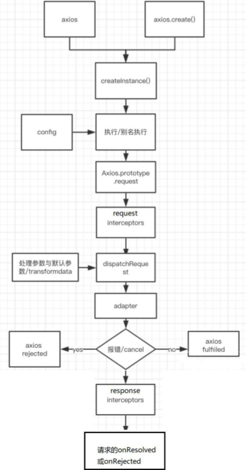
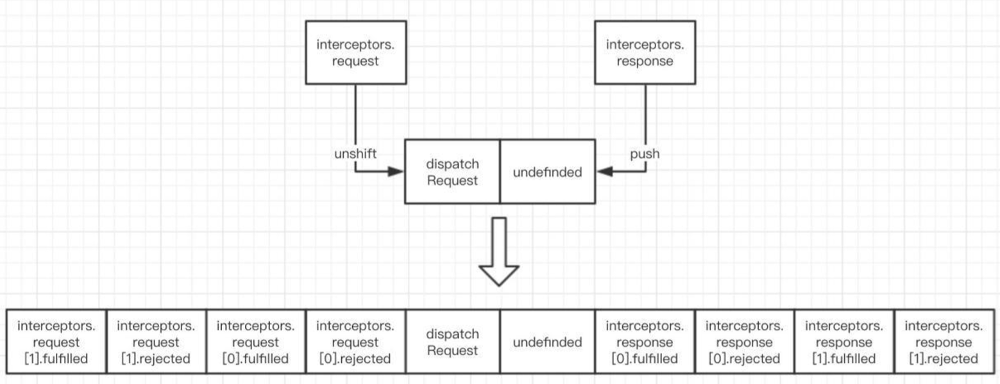

# axios

## axios的理解和使用

### axios是什么

1. 前端最流行的 ajax 请求库
2. react / vue 官方都推荐使用 axios 发 ajax 请求
3. 文档:https://github.com/axios/axios


### axios的特点（主要）

1. 基于 promise 的异步 ajax 请求库
2. 浏览器端 / node 端都可以使用
3. 支持请求／响应拦截器
4. 支持请求取消
5. 请求 / 响应数据转换
6. 批量发送多个请求


### axios的常用语法

安装：$ npm install axios


axios(config): 通用/最本质的发任意类型请求的方式 

axios(url[,config]): 可以只指定 url 发 get 请求 

axios.request(config): 等同于 axios(config) 

axios.get(url[,config]): 发 get 请求 

axios.delete(url[,config]): 发 delete 请求 

axios.post(url[,data,config]): 发 post 请求 axios.put(url[,data,config]): 发 put 请求


axios.defaults.xxx: 请求的默认全局配置 

axios.interceptors.request.use(): 添加请求拦截器 

axios.interceptors.response.use(): 添加响应拦截器


axios.create([config]): 创建一个新的 axios(它没有下面的功能)

axios.Cancel(): 用于创建取消请求的错误对象 

axios.CancelToken(): 用于创建取消请求的 token 对象 

axios.isCancel(): 是否是一个取消请求的错误 axios.all(promises): 用于批量执行多个异步请求

axios.spread(): 用来指定接收所有成功数据的回调函数的方法


### 基本使用

```javascript
/*
	示例
*/

// 指定默认配置（全局配置）
axios.defaults.baseURL = 'http://localhost:3000'

/* 1. GET请求: 从服务器端获取数据*/
function testGet() {
  // axios.get('/posts?id=1') // 对象模式
  axios({ // 函数模式
    url: '/posts', 
    /* 默认method为get请求 */
    params: { // get请求参数放params中
      id: 1
    }
  }).then(response => {
    console.log('/posts get', response.data)
  })
}

/* 2. POST请求: 向服务器端添加新数据*/
function testPost() {
  // axios.post('/posts', {"title": "json-server3", "author": "typicode3"})
  axios({
    url: '/posts',
    method: 'post',
    data: {"title": "json-server4", "author": "typicode4"} // post请求参数放data中
  })
    .then(response => {
    console.log('/posts post', response.data)
  })
}

/* 3. PUT请求: 更新服务器端已经数据 */
function testPut() {
  // axios.put('http://localhost:3000/posts/4', {"title": "json-server...", "author": "typicode..."})
  axios({
    url: '/posts/4',
    method: 'put',
    data: {"title": "json-server5", "author": "typicode5"}
  })
    .then(response => {
    console.log('/posts put', response.data)
  })
}

/* 4. DELETE请求: 删除服务器端数据 */
function testDelete() {
  // axios.delete('http://localhost:3000/posts/4')
  axios({
    url: '/posts/5',
    method: 'delete'
  })
    .then(response => {
    console.log('/posts delete', response.data)
  })
}

/* ---------------------------------------------- */

axios({
  url: 'http://123.207.32.32:8000/home/data?type=pop&page=1',
}).then(res => {
  console.log(res); 
})
/* 等于 */
axios({
  url: 'http://123.207.32.32:8000/home/data',
  // params专门针对get请求的参数拼接
  params: {
    type: 'pop',
    page: 1
  }
}).then(res => {
  console.log(res); 
})

/*
	也可以直接使用axios.get(url[, config])
						或axios.post(url[, data[, config]])
						等方法
*/

/* --------------- 并发请求 ------------- */
// axios.all([axios({...}), axios({...})])
// axios.all([]) 返回的结果是一个数组
axios.all([
  axios({
  	url: 'http://123.207.32.32:8000/home/multidata'
}), axios({
  url: 'http://123.207.32.32:8000/home/data',
  params: {
    type: 'sell',
    page: 5
  }
})
]).then(results => {
  console.log(results)
  console.log(results[0])
  console.log(results[1])
})
// 使用 axios.spread 可将数组 [res1,res2] 展开为 res1, res2，即分组展示而不是合在一起
axios.all(...)
	.then(axios.spread(res1, res2) => {
  console.log(res1)
  console.log(res2)
})
```


### 常见的配置选项

等接口文档中用到了再具体查就好了

- 请求地址	【purl: '/user'】
- 请求类型	【pmethod: 'get'】
- 请根路径	【pbaseURL: 'http://www.mt.com/api'】
- 请求前的数据处理	【ptransformRequest: [function(data){}]】
- 请求后的数据处理	【ptransformResponse: [function(data){}]】
- 自定义的请求头	【pheaders:{'x-Requested-With':'XMLHttpRequest'}】
- URL查询对象	【params: { id: 12 }】
- 查询对象序列化函数	【paramsSerializer: function(params){ }】
- request body	【data: { key: 'aa'}】
- 超时设置	【timeout: 1000】
- 跨域是否带Token	【withCredentials: false】
- 自定义请求处理	【adapter: function(resolve, reject, config){}】
- 身份验证信息	【auth: { uname: '', pwd: '12'}】
- 响应的数据格式 json / blob /document /arraybuffer / text / stream	【responseType: 'json'】

```javascript
// 使用全局的axios和对应的配置在进行网络请求
// 如果未具体指定，则会默认使用下列的全局配置
axios.defaults.baseURL = 'http://123.207.32.32:8000'
axios.defaults.timeout = 5000

axios.all([axios({
  url: '/home/multidata'
}), axios({
  url: '/home/data',
  params: {
    type: 'sell',
    page: 5
  }
})]).then(axios.spread((res1, res2) => {
  console.log(res1);
  console.log(res2);
}))
```


### axios的实例

当项目中需要使用多个接口，且多个接口之间所需的配置不一样时，则可以使用实例，每个实例有自己独立的配置

```javascript
// 创建对应的axios的实例
const instance1 = axios.create({
  baseURL: 'http://123.207.32.32:8000',
  timeout: 5000
})

// 下面2个请求都用instance1这个实例
instance1({
  url: '/home/multidata'
}).then(res => {
  console.log(res);
})

instance1({
  url: '/home/data',
  params: {
    type: 'pop',
    page: 1
  }
}).then(res => {
  console.log(res);
})

// 再创建另外的axios实例用于不同的请求
const instance2 = axios.create({
  baseURL: 'http://222.111.33.33:8000',
  timeout: 10000,
  headers: { ... }
})

instance2({
  url: '/profile/data',
  params: {
    type: 'mine',
    page: 3
  }
}).then(res => {
  console.log(res);
})
```


### 模块封装

在真实的开发中，往往不直接使用axios，而是将axios进行封装，使用封装后的请求模块进行请求

以便于维护，例如，如果有一天不再使用axios这个框架，只需在封装后的请求模块中替换一次axios即可，而不需要将每个组件中的请求相关的进行替换。即，如果在50个组件中直接使用axios，则以后可能在这50个组件中都需要进行维护

```javascript
import axios from 'axios'

/* return Promise的方式1(方式2的简化版) */
export function request(config) {
  // 创建axios的实例
  const instance = axios.create({
    baseURL: 'http://123.207.32.32:8000',
    timeout: 5000
  })
  // 发送真正的网络请求
  return instance(config) // instance本身返回的就是Promise，因此return instance(config)就是return 一个Promise
}
// 使用
request({
  url: '/home/multidata'
}).then(res => { // request返回的是一个Promise，因此，直接调用then和catch进行处理
  console.log(res);
}).catch(err => {
  console.log(err);
})

/* ---------------------------------------------- */
/* return Promise的方式2 */
export function request(config) {
  return new Promise((resolve, reject) => { 
    // instance本身返回的就是Promise，因此return instance(config)就是 return 一个 Promise
    // 创建axios的实例
    const instance = axios.create({
      baseURL: 'http://123.207.32.32:8000',
      timeout: 5000
    })

    // 发送真正的网络请求
    instance(config) // instance本身返回的就是Promise，因此可以简化
      .then(res => {
        resolve(res)
      })
      .catch(err => {
        reject(err)
      })
  })
}
// 使用
request({
  url: '/home/multidata'
}).then(res => { // request返回的是一个Promise，因此，直接调用then和catch进行处理
  console.log(res);
}).catch(err => {
  console.log(err);
})

/* ---------------------------------------------- */
/* 函数的方式1 */
export function request(config) {
  // 创建axios的实例
  const instance = axios.create({
    baseURL: 'http://123.207.32.32:8000',
    timeout: 5000
  })

  // 发送真正的网络请求
  instance(config.baseConfig)
    .then(res => {
      // console.log(res);
      config.success(res);
    })
    .catch(err => {
      // console.log(err);
      config.failure(err)
    })
}
// 使用
request({
  baseConfig: {

  },
  success: function (res) {

  },
  failure: function (err) {

  }
})

/* ---------------------------------------------- */
/* 函数的方式2 */
export function request(config, success, failure) {
  // 创建axios的实例
  const instance = axios.create({
    baseURL: 'http://123.207.32.32:8000',
    timeout: 5000
  })

  // 发送真正的网络请求
  instance(config)
    .then(res => {
      // console.log(res);
      success(res);
    })
    .catch(err => {
      // console.log(err);
      failure(err)
    })
}
// 使用
request({
  url: '/home/multidata'
}, res => {
  console.log(res);
}, err => {
  console.log(err);
})
```


### 拦截器

一共四种拦截：请求成功、请求失败；响应成功、响应失败

```javascript
import axios from 'axios'

export function request(config) {
  // 1.创建axios的实例
  const instance = axios.create({
    baseURL: 'http://123.207.32.32:8000',
    timeout: 5000
  })
  
  // 需要传入两个函数，一个是成功的，一个是失败的，内部原理为Promise.then

  // 2.axios的拦截器
  // 2.1.请求拦截的作用
  instance.interceptors.request.use(config => {
    console.log('请求拦截器 成功');
    // 1.比如config中的一些信息不符合服务器的要求
    // 2.比如每次发送网络请求时, 都希望在界面中显示一个请求的图标
    // 3.某些网络请求(比如登录(token)), 必须携带一些特殊的信息
		config.xxx = 'YYY'
    
    return config // 拿到config后必须返回config，否则默认返回undefined
  }, err => {
    console.log('请求拦截器 失败');
    return Promise.reject(error)
  })

  // 2.2.响应拦截
  instance.interceptors.response.use(res => {
    console.log('响应拦截器 成功')
    return res // 拿到config后必须返回config，否则默认返回undefined
    // return res.data // 也口以只返回需要的东西
  }, err => {
    console.log('响应拦截器 失败');
    return Promise.reject(error)
  })

  // 3.发送真正的网络请求
  return instance(config) // instance本身返回的就是Promise，因此可以直接return
  	// 或
  axios({
    method: 'GET',
    url: '...'
  }).then(res => {
    console.log('自定义回调处理成功的结果')
  }).catch(err => {
    console.log('自定义失败回调')
  })
}
```


### 难点语法的理解和使用

### axios.create(config)

1. 根据指定配置创建一个新的 axios，也就是每个新 axios 都有自己的配置

2. 新 axios 只是没有取消请求和批量发请求的方法，其它所有语法都是一致的

3. 为什么要设计这个语法? 

     (1) 需求：项目中有部分接口需要的配置与另一部分接口需要的配置不太一 样，如何处理？

     (2) 解决：创建 2 个新 axios，每个都有自己特有的配置，分别应用到不同要求的接口请求中

```javascript
axios.defaults.baseURL = 'http://localhost:3000'

// 使用axios发请求
axios({
  url: '/posts' // 请求3000
})

// axios({
//   url: '/xxx' // 请求4000
// })

/* ---------------------------------------------------------- */

/* instance是函数 */
const instance = axios.create({ 
  baseURL: 'http://localhost:4000'
})

instance({ // 作为函数发送请求
  url: '/xxx'  
})

instance.get('/xxx') // 作为对象发送请求
```


### 拦截器函数 / ajax请求 / 请求的回调函数 的调用顺序

1. 说明：调用 axios()并不是立即发送 ajax 请求，而是需要经历一个较长的流程
2. 流程：请求拦截器2 ==> 请求拦截器1 ==> 发ajax请求 ==> 响应拦截器1 ==> 响应拦截器2 ==> 请求的回调
3. 注意：此流程是通过 promise 串连起来的, 请求拦截器传递的是 config, 响应拦截器传递的是 response

```javascript
/*
promise链回调: 
		config 
       => (fulfilled2, rejected2) => (fulfilled1, rejected1)   // 请求拦截器处理
       => (dispatchReqeust, undefined) // 发请求
       => (fulfilled11, rejected11) => (fulfilled22, rejected22) // 响应拦截器处理
       => (onResolved, onRejected) // axios发请求回调处理
*/

/* 请求拦截器(回调函数) */
axios.interceptors.request.use(
  config => { // 成功
    console.log('request interceptor1 onResolved()')
    return config // 必须返回config，用于向下传递，否则默认返回的是undefined
  },
  error => { // 失败
    console.log('request interceptor1 onRejected()')
    return Promise.reject(error); // 将错误继续向下传递
  }
)

axios.interceptors.request.use(
  config => {
    console.log('request interceptor2 onResolved()')
    return config
  },
  error => {
    console.log('request interceptor2 onRejected()')
    return Promise.reject(error);
  }
)

/* 响应拦截器 */
axios.interceptors.response.use(
  response => {
    console.log('response interceptor1 onResolved()')
    return response // 必须返回response，用于向下传递，否则默认返回的是undefined
  },
  function (error) {
    console.log('response interceptor1 onRejected()')
    return Promise.reject(error);
  }
)

axios.interceptors.response.use(
  response => {
    console.log('response interceptor2 onResolved()')
    return response
  },
  function (error) {
    console.log('response interceptor2 onRejected()')
    return Promise.reject(error);
  }
)

axios.get('http://localhost:3000/posts')
  .then(response => {
  console.log('data', response.data)
})
  .catch(error => {
  console.log('error', error.message)
})

/*
      打印顺序为：
      request interceptor2 onResolved()     // 请求拦截器是 后添加的先执行
      request interceptor1 onResolved()
      response interceptor1 onRejected()
      response interceptor2 onRejected()
    */
```


### 取消请求

1. 基本流程 

   ​	a 配置 CancelToken 对象 

   ​	b 缓存用于取消请求的 cancel 函数

   ​	c 在后面特定时机调用 cancel 函数取消请求

   ​	d 在错误回调中判断如果 error 是 cancel，做相应处理 

2. 实现功能

   ​	**（1）点击按钮, 取消某个正在请求中的请求 **

```html
<button onclick="getData()">进行请求</button>
<button onclick="cancelReq()">取消请求</button>

<script src="https://cdn.bootcss.com/axios/0.19.0/axios.js"></script>
<script>
  let cancel = null // 用于保存取消请求的函数
  function getData() {
    axios({
      url: 'http://localhost:4000/products1',
      // 配置 CancelToken 对象
      cancelToken: new axios.CancelToken(c => { // c是用于取消当前请求的函数
        // 保存取消请求的函数
        cancel = c
      })
    }).then(res => { 
        cancel = null // 请求操作已经完成（成功或失败），不再需要取消请求，因此cancel = null
        console.log('请求成功', res.data)
      }, err => {
        cancel = null // 请求操作已经完成（成功或失败），不再需要取消请求，因此cancel = null
        console.log('请求失败', err)
      }
    )
  }

  function cancelReq() {
    // console.log('进行取消请求')
    // 执行取消请求的函数
    if (typeof cancel === 'function') { // cancel 不是 null，表示请求还没有完成
      cancel('强制取消请求')
    } else {
      console.log('没有可取消的请求')
    }
  }
</script>
```

​		**（2）在请求一个新的接口前，取消前面一个未完成的请求**

```html
<button onclick="getData1()">进行请求1</button>
<button onclick="getData2()">进行请求2</button>
<button onclick="cancelReq()">取消请求</button>

<script src="https://cdn.bootcss.com/axios/0.19.0/axios.js"></script>
<script>
  let cancel = null // 用于保存取消请求的函数
  function getData1() {
    // 在准备发请求前, 取消未完成的请求
    if (typeof cancel === 'function') { // 如果cancel是函数，说明有请求未完成
      cancel('取消请求')
    }

    axios({
      url: 'http://localhost:4000/products1',
      // 配置 CancelToken 对象
      cancelToken: new axios.CancelToken(c => { // c是用于取消当前请求的函数
        // 保存取消函数
        cancel = c
      })
    }).then(res => {
        cancel = null // 请求操作已经完成（成功或失败），不再需要取消请求，因此cancel = null
        console.log('请求1成功了', res)
      }, err => {
   /* 为什么要用 axios.isCancel(error) ？
      如果没有这个判断，会存在以下情况：
      1. 点击发送第一个请求，cancel函数是空的，赋值 cancel = c
      2. 点击发送第二个请求，if(typeof cancel==='function') 得到执行，第一个请求因cancel函数而取消而进入then，而then是异步的，因此cancel = null放入执行队列中等待，但此时同步函数已经执行完成，cancel = null得到执行，cancel被清空
      3. 点击发送第三个请求，此时的cancel已经被清空，因此if(typeof cancel==='function')并不会进入执行，即无法取消第二个请求
      4. 即，因为异步的原因，第一个请求的then中的cancel = null将第二个请求的cancel函数清空了 */
        if (axios.isCancel(err)) { // 是因为手动取消请求而失败
          console.log('请求1取消的错误', err)
        } else { // 不是因为手动取消请求而失败
          cancel = null // 请求操作已经完成（成功或失败），不再需要取消请求，因此cancel = null
          console.log('请求1失败了', err)
          // 如果错误想要向后传递，则需要return失败的promise或throw error
          // throw error
        	return Promise.reject(err)
        }
      }
    )
  }

  function getData2() {
    // 在准备发请求前, 取消未完成的请求
    if (typeof cancel==='function') { // cancel不是null，表示请求还没有完成
      cancel('取消请求')
    }

    axios({
      url: 'http://localhost:4000/products2',
      // 配置 CancelToken 对象
      cancelToken: new axios.CancelToken(c => { // c是用于取消当前请求的函数
        // 保存取消函数
        cancel = c
      })
    }).then(res => {
        cancel = null // 请求操作已经完成（成功或失败），不再需要取消请求，因此cancel = null
        console.log('请求2成功了', res)
      }, err => {
        if (axios.isCancel(err)) {
          console.log('请求2取消的错误', err)
        } else { // 请求出错了
          cancel = null // 请求操作已经完成（成功或失败），不再需要取消请求，因此cancel = null
          console.log('请求2失败了', err)
        }
      }
    )
  }

  function cancelReq() {
    // alert('取消请求')
    // 执行取消请求的函数
    if (typeof cancel === 'function') {
      cancel('强制取消请求')
    } else {
      console.log('没有可取消的请求')
    }
  }

  /* ---------- 以上代码重复度高，因此可以封装 使用拦截器 如下 ---------- */
  
  /* 请求拦截器 */
  axios.interceptors.request.use(config => {
    // 检测上一次的请求是否已经完成
    if (typeof cancel !== null) {
      cancel('取消请求')
    }
    // 配置 CancelToken 对象
    config.cancelToken = new axios.CancelToken((c) => { // c是用于取消请求的函数
      // 保存取消函数
      cancel = c
    })
    return config
  })

  /* 响应拦截器 */
  axios.interceptors.response.use(res => {
      cancel = null // 请求操作已经完成（成功或失败），不再需要取消请求，因此cancel = null
      return res
    }, err => {
      if (axios.isCancel(err)) { // 主动取消请求而产生的错误
        console.log('请求取消的错误', err) // 做相应处理
        return new Promise(() => {}) // 中断promise链接
      } else { // 不是因为主动取消请求而产生的错误
        cancel = null
        // 如果错误想要向后传递，则需要return失败的promise或throw error
        // throw error
        return Promise.reject(err)
      }
    }
  )

  let cancel = null // 用于保存取消请求的函数
  function getData1() {
    axios({
      url: 'http://localhost:4000/products1',
    }).then(res => {
        console.log('请求1成功了', res)
      }, err => { // 只用处理请求失败的情况, 取消请求而产生的的错误不用处理
        console.log('请求1失败了', err)          
      }
    )
  }

  function getData2() {
    axios({
      url: 'http://localhost:4000/products2',
    }).then(res => {
        console.log('请求2成功了', res)
      }, err => { // 只用处理请求失败的情况, 取消请求而产生的的错误不用处理
        console.log('请求2失败了', err)
      }
    )
  }

  function cancelReq() {
    // 执行取消请求的函数
    if (typeof cancel !== null) {
      cancel('强制取消请求')
    } else {
      console.log('没有可取消的请求')
    }
  }

</script>
```

## 原理

### 源码目录结构

├── /dist/ # 项目输出目录 

├── /lib/ # 项目源码目录 

│ ├── /adapters/ # 定义请求的适配器 xhr、http 

│ │ ├── http.js # 实现 http 适配器(包装 http 包) 

│ │ └── xhr.js # 实现 xhr 适配器(包装 xhr 对象) 、真正发请求的模块

│ ├── /cancel/ # 定义取消功能 

│ ├── /core/ # 一些核心功能 

│ │ ├── Axios.js #axios 的核心主类 

│ │ ├── dispatchRequest.js # 用来调用 http 请求适配器方法发送请求的函数 

│ │ ├── InterceptorManager.js # 拦截器的管理器 

│ │ └── settle.js # 根据 http 响应状态，改变 Promise 的状态 

│ ├── /helpers/ # 一些辅助方法 

│ ├── axios.js # 对外暴露接口 

│ ├── defaults.js #axios 的默认配置 

│ └── utils.js # 公用工具 

├── package.json # 项目信息 

├── index.d.ts # 配置 TypeScript 的声明文件 

└── index.js # 入口文件

### axios 与 Axios 的关系

1. 从语法上来说：axios 不是 Axios 的实例，因为axios是函数
2. 从功能上来说：axios 是 Axios 的实例，原因参照4
3. axios 是 Axios.prototype.request 函数 bind() 返回的函数
4. axios 作为对象有 Axios 原型对象上的所有方法，有 Axios 对象上所有属性

### instance 与 axios 的区别

1. 相同: 

   (1) 都是一个能发任意请求的函数：request(config)

   (2) 都有发特定请求的各种方法：get() / post() / put() / delete()

   (3) 都有默认配置和拦截器的属性：defaults / interceptors

2. 不同: 

   (1) 默认匹配的值很可能不一样

   (2) instance 没有 axios 后面添加的一些方法：create() / CancelToken() / all()

### axios 运行的整体流程



1. 整体流程：request(config) ==> dispatchRequest(config) ==> xhrAdapter(config)
2. request(config)：将请求拦截器 / dispatchRequest() / 响应拦截器 通过 promise 链串连起来，返回 promise
3. dispatchRequest(config)：转换请求数据 ==> 调用 xhrAdapter()发请求 ==> 请求返回后转换响应数据，返回 promise
4. xhrAdapter(config)：创建 XHR 对象，根据 config 进行相应设置，发送特定请求，并接收响应数据，返回 promise

### axios 的请求 / 响应拦截器是什么



1. 请求拦截器：
    在真正发送请求前执行的回调函数可以对请求进行检查或配置进行特定处理，

  成功的回调函数，传递的默认是 config(也必须是)

  失败的回调函数，传递的默认是 error

2. 响应拦截器：

   在请求得到响应后执行的回调函数可以对响应数据进行特定处理，

   成功的回调函数，传递的默认是 response 

   失败的回调函数，传递的默认是 error


### axios 的请求 / 响应数据转换器是什么

1. 请求转换器：对请求头和请求体数据进行特定处理的函数

   if ( utils.isObject(data) ) { 

   ​    setContentTypeIfUnset(headers,'application/json;charset=utf-8'); 

   ​    returnJSON.stringify(data); 

   }

2. 响应转换器：将响应体 json 字符串解析为 js 对象或数组的函数

   response.data = JSON.parse(response.data)

### response 的整体结构

{
    message,

​    response, 

​    request,
}

### 如何取消未完成的请求

1. 当配置了 cancelToken 对象时，保存 cancel 函数 

   (1) 创建一个用于将来中断请求的 cancelPromise 

   (2) 并定义了一个用于取消请求的 cancel 函数 

   (3) 将 cancel 函数传递出来 

2. 调用 cancel()取消请求 

   (1) 执行 cacel 函数，传入错误信息 message 

   (2) 内部会让 cancelPromise 变为成功，且成功的值为一个 Cancel 对象 

   (3) 在 cancelPromise 的成功回调中中断请求，并让发请求的 proimse 失败，失败的 reason 为 Cacel 对象

## 实战使用

```js
// congif.js

const devBaseURL = "https://httpbin.org";
const proBaseURL = "https://production.org";

export const BASE_URL = process.env.NODE_ENV === 'development' ? devBaseURL : proBaseURL

export const TIMEOUT = 5000;
// 其他配置....
```

```js
// request.js
import axios from 'axios';
import { BASE_URL, TIMEOUT, ... } from './config';

const instance = axios.create({
  baseURL: BASE_URL,
  timeout: TIMEOUT,
  // 其他配置...
})

// 拦截器
instance.interceptors.request.use(config => {
  const token = Vue.ls.get(ACCESS_TOKEN)
  if (token) {
    config.headers['Authorization'] = token
  }
  return config;
}, err => {
  // 错误处理...
  return Promise.reject(err).catch(()=>{});
});

instance.interceptors.response.use(response => {
  let res = response.data
  if (res.code !== '000000') {
    if (!res.code){
      return response
    }
    // if (res.code === '-1') {
    	// ...处理
    // }
    return Promise.reject(new Error(res.msg || 'Error')).catch(()=>{});
  }
  return response.data;
}, err => {
  if (err && err.response) {
    switch (err.response.status) {
      case 401: 
        console.log(...);
        break;
      case 500:
        console.log(...);
        break;
      default: 
        console.log(...);
    }
  }
  return Promise.reject(error).catch(()=>{});
})

export default instance; // 可以将instance也放到函数中
```

```js
// 其他文件中使用
import request from '...'

request({
  url: "/get",
  params: {
    ...
  }
}).then({
  console.log(...)
})
```

## 取消重复请求

**场景**：

- 用户在一个请求完成之前更改了视图或离开了当前页面。
- 防止因快速重复点击而发送多个相同的请求。
- 超时取消，即如果请求在特定时间内未响应，则自动取消。

**思路**：

1.  创建一个 Map 或对象来存储每个请求的取消函数： 

   ​		Map 的键可以是请求的唯一标识符（例如，URL + 请求方法），值是对应的取消函数。 

2. 发送请求前，检查是否已有相同请求： 

   ​		如果已有相同请求在进行中，先取消之前的请求。 

3. 设置请求的取消令牌： 

   ​		使用 axios.CancelToken 创建一个新的取消令牌，并将取消函数保存到 Map 中。 

4. 请求完成后，从 Map 中移除取消函数： 

   ​		不论请求成功还是失败，都应该清理 Map 中对应的条目。

**补充：**

`axios.CancelToken` 是 Axios 库中提供的一个构造函数，用于创建取消令牌（cancel token），允许在发送 HTTP 请求后取消这个请求。这在许多场景中非常有用，比如防止重复请求或在请求的响应时间过长时主动中断请求。

如果请求被取消，`catch` 块将会捕获到一个由 axios 抛出的 `Cancel` 类型的错误。

```js
const axios = require('axios');

let cancel;

// 创建一个取消令牌
const cancelToken = new axios.CancelToken(function executor(c) {
    // 这个函数接受一个取消函数作为参数
    cancel = c;
});

// 发起请求
axios.get('/some/path', {
    cancelToken: cancelToken
}).catch(function (thrown) {
    if (axios.isCancel(thrown)) { // 如果是取消请求
        console.log('Request canceled', thrown.message);
    } else {
        // 处理错误
    }
});

// 取消请求（请求的原因将会作为参数传递）
cancel('Operation canceled by the user.');
```


**实现取消重复请求：**

```js
const axios = require('axios');

// 存储每个请求的取消函数的 Map
const pendingRequests = new Map();

// 生成请求的唯一标识符
function generateReqKey(config) {
  return `${config.url}_${config.method}`; // 这里简单地使用 URL 和方法组合
}

// 将即将发出的请求添加到 pendingRequests 中
function addPendingRequest(config) {
  const requestKey = generateReqKey(config);
  // 使用 axios 的 CancelToken 创建新的取消令牌
  config.cancelToken = config.cancelToken || new axios.CancelToken((cancel) => {
    if (!pendingRequests.has(requestKey)) { // 如果 pendingRequests 中不存在当前请求，则添加它
      pendingRequests.set(requestKey, cancel);
    }
  });
}

// 发送请求之前检查并移除已经存在的重复请求
function removePendingRequest(config) {
  const requestKey = generateReqKey(config);
  // 如果 pendingRequests 中存在当前请求，则取消之前的请求
  if (pendingRequests.has(requestKey)) {
    const cancel = pendingRequests.get(requestKey);
    cancel(requestKey); // 执行取消操作
    pendingRequests.delete(requestKey); // 从 Map 中移除该请求
  }
}

// 添加请求拦截器
axios.interceptors.request.use(config => {
  removePendingRequest(config); // 检查并取消之前的同类请求
  addPendingRequest(config);    // 把当前请求添加到 pendingRequests 中
  return config;
}, error => {
  return Promise.reject(error);
});

// 添加响应拦截器
axios.interceptors.response.use(response => {
  removePendingRequest(response.config); // 请求完成后移除此请求
  return response;
}, error => {
  removePendingRequest(error.config || {}); // 无论请求成功或失败都移除此请求
  // 检测到取消操作的情况
  if (axios.isCancel(error)) {
    console.log('已取消的重复请求：' + error.message);
  } else {
    // 处理其他类型的错误
  }
  return Promise.reject(error);
});

/*
	这段代码通过 Axios 拦截器和 CancelToken 功能，实现了取消重复请求的逻辑。
    请求在发送前会被添加到 pendingRequests Map 中，其中的键是请求的唯一标识符。
    如果再次发起相同的请求，原有的请求会被取消，确保不会有重复请求。
    无论请求成功还是失败，都会在响应后清理 Map 中的记录，避免内存泄漏。
    这种机制在某些需要防止重复请求的场景（如表单提交）中非常有用。
*/
```

