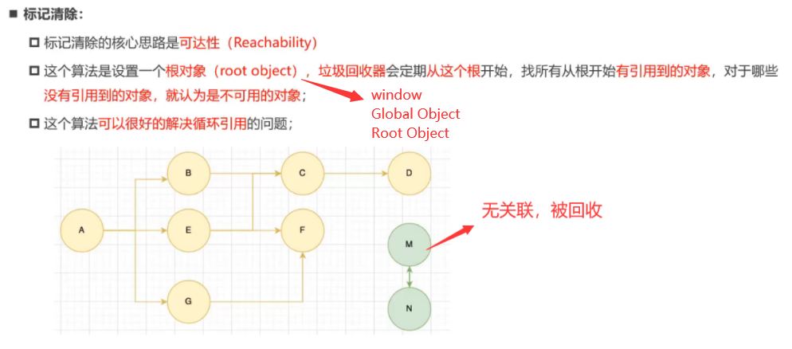
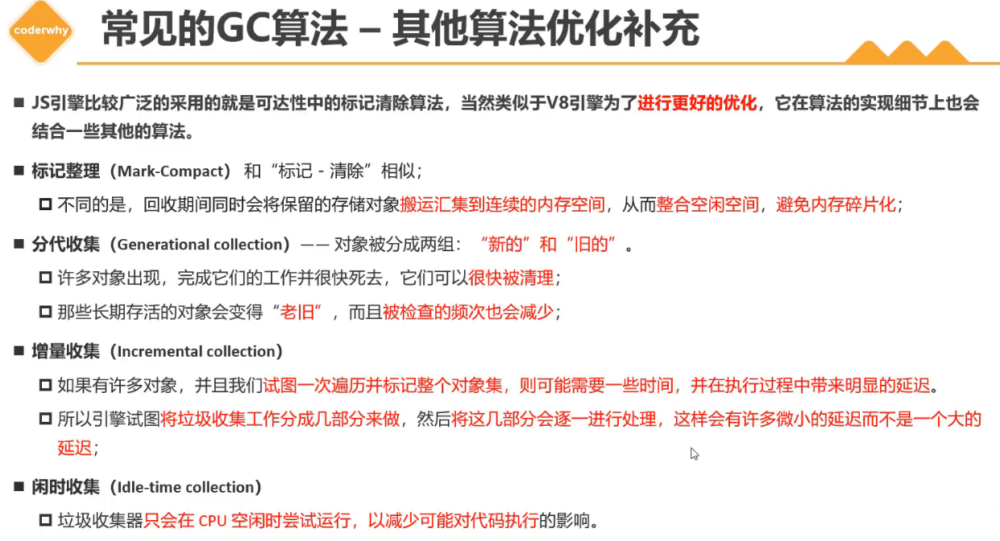
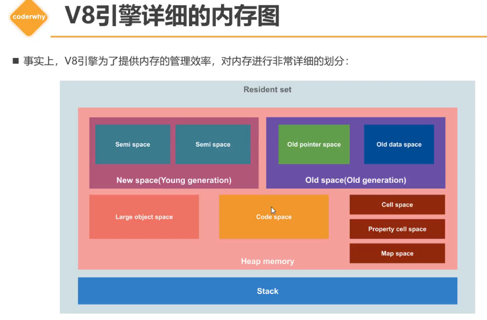
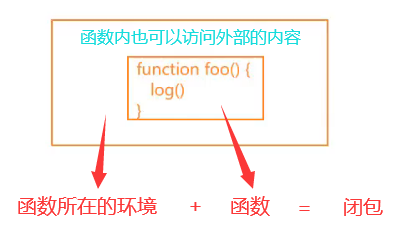
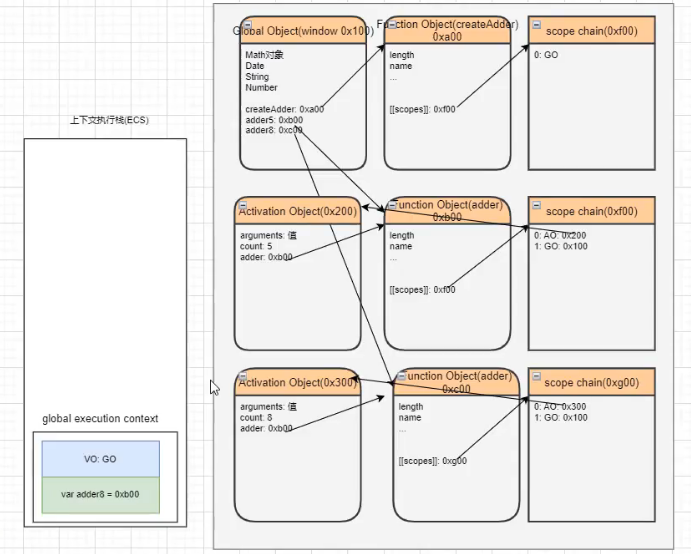
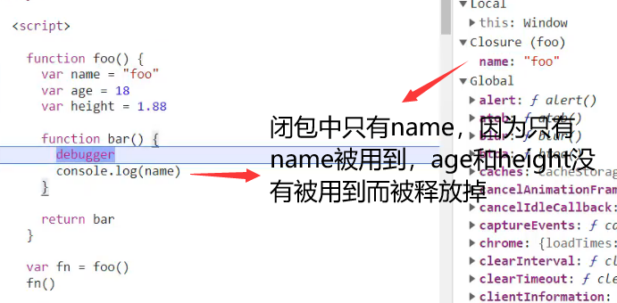

# 视频源地址

https://www.bilibili.com/video/BV1M44y1R76m/?p=1

# V8引擎的垃圾回收机制常见算法







# JS的函数式编程

JS是支持函数式编程的：

- 并且函数在JS中是一等公民

  ​	意味着函数使用起来是非常灵活的，可以作为参数，也可以作为返回值

- JS存在很多的高阶函数

  ​	自定义的高阶函数

  ​	内置的高阶函数

- vue3、React，都趋向于函数式编程

  ​	vue3 composition apii：setup函数 -> 代码(函数hook、定义函数)

​			react：class -> function -> hooks

# 闭包的定义

## 计算机科学中的闭包

维基百科对闭包的解释：

- 闭包(英语:Closure)，又称词法闭包(Lexical Closure)或函数闭包(function closures) ；
- 是在支持**头等函数**的编程语言中，实现词法绑定的一种技术；
- 闭包在实现上是一个**结构体**，它存储了**一个函数和一个关联的环境**（相当于一个符号查找表)；
- 闭包跟函数最大的区别在于，当捕捉闭包的时候，它的**自由变量**会在捕捉时被确定，这样即使脱离了捕捉时的上下文，它也能照常运行；



## JS中的闭包

MDN对JS的闭包的解释：

- 一个函数和对其周围状态(lexical environment，词法环境)的引用捆绑在一起(或者说函数被引用包围)，这样的组合就是闭包(closure)；
- 也就是说，闭包让你可以在一个内层函数中访问到其外层函数的作用域；
- 在JavaScript 中，每当创建一个函数，闭包就会在函数创建的同时被创建出来；

闭包的概念出现于60年代，最早实现闭包的程序是Scheme语言，早期的JavaScript大量借鉴了Scheme，也借鉴了闭包。

## 总结

```javascript
var name = "aaa"
var age = 18
var info = "Hello, dude"

// JS底层通过'作用域链'实现了闭包，因此函数内可以直接访问外层作用域中的内容
function foo() {
  var message = "I'm message"
  console.log(name, age, info)
}

// 无闭包时，想要在函数内访问外部的内容，需要手动传入
function foo(name, age, info) {
  var message = "I'm message"
  console.log(name, age, info)
}
foo(name, age, info)
```

- 一个函数，如果它可以访问外层作用域的自由变量，那么这个函数和周围环境所形成的结构就是一个闭包；
- 从广义的角度来说：JS中的函数都是闭包，每创建一个函数就会形成一个闭包；
- 从狭义的角度来说：JS中一个函数，如果访问了外层作用域的变量（访问了外层作用域中的内容），那么它是一个闭包；

```javascript
// 函数
function createAdder(count) {
  function adder(num) {
    return count + num // 访问了外层作用域中的count，因此外面的adder5和adder8都不会销毁
  }
  return adder
}

// 函数外层作用域中的变量
var adder5 = createAdder(5) // 形成一个闭包，其外层作用域中的count为5
adder5(100) // 105
adder5(1) // 6    adder5因为闭包（在作用域链中被指向），不会被垃圾回收机制销毁

// V8引擎，内存中的内容只要在作用域链中有被指向，就不会被销毁，即不参与作用域链的内容才会被销毁

// 函数外层作用域中的变量
var adder8 = createAdder(8) // 形成一个新的闭包，其外层作用域中的count为8
adder8(100) // 108
adder8(1) // 9    adder8因为闭包（在作用域链中被指向），不会被垃圾回收机制销毁
```



# 闭包的内存泄露

在所有的内存数据都是有用的时候，不存在内存泄露；如果某一时刻开始，永远不会再使用之前创建的内容，但是从垃圾回收机制的可达性算法的角度看，这些内存中的内容是可以达到的，那么之前上述的内容会一直在内存中占据空间但之后不会被使用，就会造成内存的浪费。这一情况就称为“内存泄露"。

对于这些内存，即产生闭包后，需要**手动释放**才能释放被占用的内存，只需要将其**赋值为null**（看具体情况，如下的代码，则输入赋值为空数组即可，为null则数组也消失了）（本质就是把作用域链上解除关联，即可被垃圾回收机制回收）即可。

```javascript
function createArray() {
  // 4*1024 -> 4kb*1024 -> 4M
  var arr = new Array(1024*1024).fil1(1)
  
  function test() {
  	console.log(arr)
  }
  return test
}

// 点击按钮
var totalArr =[]

var createBtnEl = document.querySelector(".create")
var destroyBtnEl = document.querySelector(".destroy")
createBtnE1.onclick = function() {
	for (var i=0; i<100; i++) {
    totalArr.push(createArray()) // 4M*100 -> 400M
  }
	console.log(totalArr.length)
}
destroyBtnEl.onclick= function(){
  totalArr = []  // 主动释放内存
}
```

# 浏览器的优化策略

