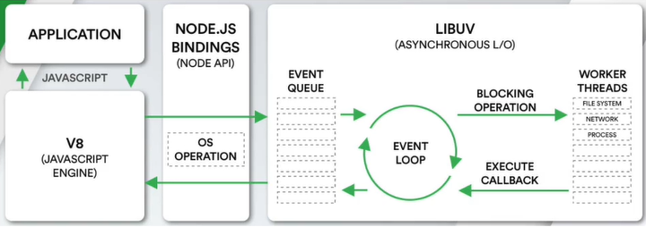

# node



## 实现一个自用脚手架


## 知识点

### Buffer

#### 是什么

计算机中的所有内容最终由二进制数据进行表示。

JavaScript可以处理非常直观的数据，比如字符串；但像图片的显示则其实并不是由JavaScript来处理的，而是交给浏览器完成的

8位的二进制数据 -> RGB值 -> 图片 -> 视频

我们做的事情是告诉浏览器一个图片地址，然后浏览器将图片下载后进行解析和显示


但是现在使用nodejs开发后台的话，就需要使JavaScript具备处理各类文件的能力而不止是字符串，但是使用JavaScript处理二进制数据是一件非常麻烦的事情，此时可以用node中提供的Buffer来处理二进制数据

【简单来说，在node中想要处理二进制的数据，就使用Buffer】


可以将Buffer看成是一个存储二进制的数组，每一项可以保存8位二进制：00000000 ~ 11111111

为什么是8位？

- 一位二进制只能表示0或1，能表示的数据太少了，因此通常将8位合在一起作为一个单元，成为一个字节byte（1byte = 8bit；1kb = 1024byte；1M = 1024kb）
- 其他许多编程语言中，int类型是4个字节，long类型是8个字节
- 比如TCP传输的是字节流，写入和读取时都需要说明字节的个数
- RGB值中一个单位是0~255，即2^8，即一个字节
- 总之就是为了能与其他地方更好的兼容性

#### 做什么

```js
const message = "Hello"

// 创建方式1，已过期
const buffer1 = new Buffer(message)
console.log(buffer1) // <Buffer 48 65 6c 6c 6f> 【默认显示的是十六进制】

// 创建方式2
const buffer2 = Buffer.from(message)
console.log(buffer2) // <Buffer 48 65 6c 6c 6f> 【默认显示的是十六进制】

const message2 = "你好啊" // 中文
const buffer3 = Buffer.from(message)
console.log(buffer3) // <Buffer e4 bd a0 e5 a5 bd e5 95 8a> // 在utf8中，一个中文汉字在编码时一般是3个字节
const buffer4 = Buffer.from(message, 'utf16le') // 第二个参数可以指定编码方式
console.log(buffer4) // <Buffer 60 4f 7d 59 4a 55>
const message3 = buffer4.toString('utf16le') // 进行解码，可以传入解码方法
console.log(message3) // “你好啊”
```

