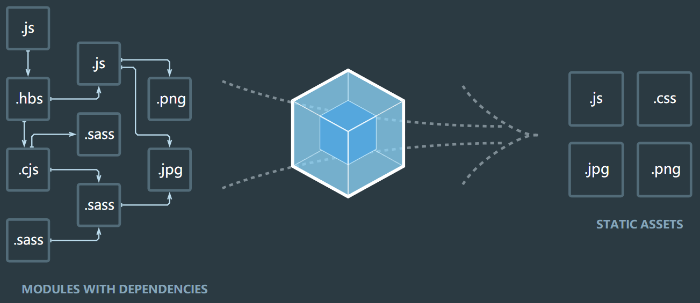

# webpack4

webpack 是一种前端资源构建工具，一个 **静态** **模块** 打包器。 

所有资源文件（js/json/css/img/less/...）都会作为模块处理，根据模块的依赖关系进行静态分析，打包生成对应的静态资源。



## 初体验

1. `npm init` 初始化 package.json

2. `npm install webpack webpack-cli-g`  全局安装，新版本会覆盖旧版本

   `npm install webpack webpack-cli-D`  本地安装，添加到开发依赖

3. 开发环境指令：

   ​          `webpack src/js/index.js -o build/js/built.js --mode=development`

   ​          功能：webpack 编译打包 js 和 json 文件，将 es6 的**模块化**语法转换成浏览器能识别的语法。

   生产环境指令：

   ​          `webpack src/js/index.js -o build/js/built.js --mode=production`

   ​          功能：除开发环境的功能外，再进行代码压缩(丑化)。

4. 结论：

   webpack 能够编译打包 js 和 json 文件，能将 es6 的**模块化**语法转换成浏览器能识别的语法。能压缩代码。

5. 问题：

   ​		不能编译打包 css、img 等文件。不能将 js 的 es6 除模块化外的基本语法转化为 es5 以下语法。

## 5个核心概念

### Entry
入口(Entry) 指示 webpack 以哪个文件为入口起点开始打包，即从哪个文件开始打包，分析构建内部依赖图，即该文件依赖哪些其他的文件，全都加载进来，开始打包处理。

```javascript
entry: 入口起点
    1. string形式
    		entry: './src/index.js'
      单入口
      打包形成一个chunk，输出一个bundle文件
      此时chunk的名称默认是 main
      
    2. array形式
    		entry: ['./src/index.js', './src/add.js']
      多入口
      所有入口文件最终只会形成一个chunk, 只输出一个bundle文件
      只有在HMR功能中让html热更新生效
      
    3. object形式
    		entry: {
          index: './src/index.js',
          add: './src/add.js'
        }
      多入口
      有几个入口文件就形成几个chunk，输出几个bundle文件
      此时chunk的名称是 key (上述的key是 index 和 add)

     4、特殊用法(混合使用)
        {
          jquery: ['jquery'], // 形成一个chunk，输出一个bundle文件
          react: ['react', 'react-dom', 'react-router-dom'] // 所有文件最终只会形成一个chunk, 只输出有一个bundle文件（即，将数组中的多个文件打包到一起）
        }
```

### Output
输出(Output) 指示 webpack 打包后的资源 bundles 输出到哪里去，以及如何命名。

```javascript
output: {
  filename: 'js/[name].js', // 文件名称（指定名称 + 目录）
  path: resolve(__dirname, 'build'), // 输出文件目录（将来所有资源输出的公共目录）
  publicPath: '/', // 所有资源`引入`时的公共路径的前缀：'imgs/a.jpg' --> '/imgs/a.jpg'，一般用于生产环境
  chunkFilename: 'js/[name]_chunk.js', // 非入口chunk的名称格式(入口chunk指entry指定的文件；非入口chunk：1.import.then语法会将文件单独分割成一个chunk；2.通过optimization将node modules里的东西分割成一个单独的chunk)
  // library 用来将某个库全局暴露出去，通常结合dll，将某个库单独打包，以引入使用
  library: '[name]', // 整个库向外暴露的变量名
  libraryTarget: 'window' // 变量名添加到哪个属性上，浏览器则为window，node.js则为global
  libraryTarget: 'commonjs' // 指定通过哪种模块化规则进行暴露
}
```

### Loader
Loader 让 webpack 能够去处理那些非 JavaScript 文件（webpack 自身只理解 JavaScript，Loader 相当于将其他非 JavaScript 文件翻译成 webpack能理解的样子）。

```javascript
module: {
  rules: [
    // loader的配置
    {
      test: /\.css$/,
      use: ['style-loader', 'css-loader'] // 多个loader用use
    },
    {
      test: /\.js$/,
      exclude: /node_modules/, // 排除node_modules下的js文件
      include: resolve(__dirname, 'src'), // 只检查src 的js文件
      enforce: 'pre', // 优先执行
      // enforce: 'post', // 延后执行
      loader: 'eslint-loader', // 单个loader用loader
      options: {...} // 指定配置选项
    },
    {
      // 以下配置只会生效一个
      oneOf: [...]
    }
  ]
}
```

### Plugins
插件(Plugins) 可以用于执行范围更广的任务。插件的范围包括，从打包优化和压缩，一直到重新定义环境中的变量等。

### Mode
模式(Mode)指示 webpack 使用相应模式的配置。

|           选项           |                             描述                             | 特点                                      |
| :----------------------: | :----------------------------------------------------------: | ----------------------------------------- |
| development （开发模式） | 会将 DefinePlugin 中 process.env.NODE_ENV 的值设置为 development。启用 NamedChunksPlugin 和 NamedModulesPlugin。 | 能让代码本地调试 运行的环境               |
| production （生产模式）  | 会将 DefinePlugin 中 process.env.NODE_ENV 的值设置 为 production。  启用 FlagDependencyUsagePlugin, FlagIncludedChunksPlugin,ModuleConcatenationPlugin, NoEmitOnErrorsPlugin,OccurrenceOrderPlugin, SideEffectsFlagPlugin    和 TerserPlugin。 | 能让代码优化上线 运行的环境（压缩JS代码） |

## 开发环境配置

项目代码，一般使用的是 ES6 的模块化语法(import、export)。

而所有构建工具都是基于nodejs平台运行的，因此默认采用 commonjs（module.exports）。

### 基本配置文件

1. 创建文件 webpack.config.js

2. 配置内容如下：

   注意：为了以后不重复下载包，node找包如果自己的目录找不到，会往上一级寻找，因此，可以在上级目录中下载所有的包，让node自动到上一级目录中寻找所需要的包。

   ```
   npm install css-loader style-loader -D
   ```

   ```javascript
   const { resolve } = require('path'); // node内置核心模块，用来处理路径问题。
   
   const HtmlWebpackPlugin = require('html-webpack-plugin'); // 插件的第2步：引入
   
   module.exports = {						// commonjs模块语法
     entry: './src/js/index.js', // 入口文件
     output: {                   // 输出配置
       filename: './built.js',   // 输出文件名
       path: resolve(__dirname, 'build') // 输出文件路径配置 __dirname表示当前文件绝对路径
     },
     module: { // loader的配置 1.下载 2.使用/配置
       rules: [
         {
           test: /\.css$/, // 正则表达式进行匹配文件
           use: [ // 使用哪些loader进行处理  注意：use中loader的执行顺序是从下往上↑(从后往前)
             'style-loader',
             'css-loader'
           ]
         },
         // loader: 'url-loader', // 如果只有1个loader，可以直接用 loader: 不需要用 use数组
   			...
       ]
     },
     plugins: [ // 插件的配置 1.下载 2.引入 3.使用
       new HtmlWebpackPlugin(
         // 复制 './src/index.html' 文件，并自动引入打包输出所有的资源(JS/CSS) 
       	template: './src/index.html'
       )
     ],
     mode: 'development'         // 开发环境模式
   //  mode: 'production'				// 生产环境模式
   };
   ```

3. 运行指令：webpack


### 打包样式资源

这里以less资源为例：

```
src
 ├─ index.css
 ├─ index.js    入口文件；在 index.js 中引用 index.css、index.less
 └─ index.less
webpack.config.js
```

安装 loader：`npm i css-loader style-loader less-loader less -D`

配置文件：

```javascript
module.exports = {
  entry: './src/index.js',
  output: {
    filename: 'built.js', 
    path: resolve(__dirname, 'build')
  },
  module: { 
    rules: [
      // 不同文件必须配置不同 loader 处理 
      { 
        // 匹配哪些文件 
        test: /\.css$/, 
        // 使用哪些 loader 进行处理 
        use: [ 
          // use 数组中 loader 执行顺序：从右到左，从下到上 依次执行 
          // 创建 style 标签，将 js 中的样式资源插入进行，添加到 head 中生效 
          'style-loader', 
          // 将 css 文件变成 commonjs 模块加载 js 中，里面内容是样式字符串 
          'css-loader' 
        ]
      }, 
      { 
        test: /\.less$/, 
        use: [ 
          'style-loader',    
          'css-loader', 
          // 将 less 文件编译成 css 文件 
          // 需要下载 less-loader 和 less 
          'less-loader' 
        ] 
      }
    ] 
  }, 
  plugins: [
    
  ], 
  mode: 'development'
}  
```

运行指令：webpack

### 打包HTML资源

```
src
 ├─ index.html  在 index.html 中引用 index.js
 └─ index.js		入口文件，不需要在 index.js 中手动 引入 index.html，插件会自动引入
webpack.config.js
```

安装插件：`npm install --save-dev html-webpack-plugin`

配置文件：

```javascript
const HtmlWebpackPlugin = require('html-webpack-plugin');

module.exports = {
  entry: './src/index.js',
  output: {
    filename: 'built.js', 
    path: resolve(__dirname, 'build')
  },
  module: { 
    rules: [
      
    ] 
  },
  plugins: [
    // html-webpack-plugin
    // 功能：默认会创建一个空的 HTML，自动引入打包输出的所有资源（JS/CSS）
    // 需求：需要有结构的 HTML 文件 
    new HtmlWebpackPlugin({
      // 复制 './src/index.html' 文件，并自动引入打包输出的所有资源（JS/CSS） 
      // 注意：我们自己不需要手动在 index.js 中引入 index.html，否则就和插件的自动引入重叠，引入了2次
      template: './src/index.html'  // 告诉入口文件要自动引入的html文件的路径
    }) 
  ],
  mode: 'development' 
}
```

运行指令：webpack

### 打包图片资源

```
src
 ├─ index.html  在 index.html 中引用 index.js
 ├─ index.js		入口文件；在 index.js 中引入 index.less
 ├─ index.less	在 index.less 中引用图片
 ├─ angular.jpg
 ├─ react.png
 └─ vue.jpg
webpack.config.js
```

安装 loader：`npm install --save-dev html-loader url-loader file-loader `

配置文件：

```javascript
module.exports = {
  entry: './src/index.js',
  output: {
    filename: 'built.js', 
    path: resolve(__dirname, 'build')
  },
  module: { 
    rules: [ 
      { 
        test: /\.less$/,
        // 要使用多个 loader 可以用 use
        use: ['style-loader', 'css-loader', 'less-loader'] 
      }, 
      { 
        // 问题：默认处理不了html中的img图片，img图片打包处理后文件名字会变为HASH值，用  时，图片文件的名字会发生变化
        test: /\.(jpg|png|gif)$/, 
        // 使用一个 loader，下载 url-loader file-loader，url-loader 依赖 file-loader
        loader: 'url-loader',  
        options: {
          // 设置 base64 处理的范围，图片小于 8kb，会被 base64 处理
          // 优点: 减少请求数量（减轻服务器压力） 
          // 缺点：图片体积会更大（文件请求速度更慢）
          // 注意：base64 处理后，图片就变成编码，不会再有相应的图片格式的文件，此时需要同时使用 html-loader
          limit: 8 * 1024, 
          // 问题：url-loader 默认使用 es6 的模块化，而 html-loader 引入图片是 commonjs 
          // 解析时会出问题：[object Module] 
          // 解决：关闭 url-loader 的 es6 模块化，使用 commonjs 解析 
          esModule: false, 
          // 图片的默认HASH值命名太长，可以给图片进行重命名 
          // [hash:10] 取图片的 hash 的前 10 位 
          // [ext] 取文件原来扩展名 
          name: '[hash:10].[ext]'
        }
      }, 
      {
        test: /\.html$/, 
        // 处理 html 文件的 ，负责引入 img，从而能被 url-loader 进行处理
        loader: 'html-loader'
      }
    ]
  }, 
  plugins: [
    new HtmlWebpackPlugin({
      template: './src/index.html'
    }) 
  ],
  mode: 'development'
}
```

运行指令：webpack

### 打包其他资源

其他资源，比如字体图标。

```javascript
module.exports = {
  entry: './src/index.js',
  output: {
    filename: 'built.js', 
    path: resolve(__dirname, 'build')
  },
  module: { 
    rules: [ 
      {
				test: /\.css$/, 
        use: ['style-loader', 'css-loader']
      }, 
      // 打包其他资源(除了 html/js/css 资源以外的资源) 
      { 
        exclude: /\.(css|js|html|less)$/, // 排除 css/js/html 资源 
        loader: 'file-loader', 
        options: { 
          name: '[hash:10].[ext]' 
        } 
      }
    ]
  }, 
  plugins: [
    new HtmlWebpackPlugin({
      template: './src/index.html'
    }) 
  ],
  mode: 'development'
}
```

运行指令：webpack

### devserver

安装：

```
npm i webpack-dev-server -D
```

打包后的文件并不会随着源代码的修改而重新打包更新，devserver 就是用于源代码修改后自动重新编译打包。

```javascript
const { resolve } = require('path');
const HtmlWebpackPlugin = require('html-webpack-plugin');

module.exports = {
  entry: './src/index.js',
  output: {
    filename: 'built.js',
    path: resolve(__dirname, 'build')
  },
  module: {
    rules: [
      {
        test: /\.css$/,
        use: ['style-loader', 'css-loader']
      },
      // 打包其他资源(除了html/js/css资源以外的资源)
      {
        // 排除css/js/html资源
        exclude: /\.(css|js|html|less)$/,
        loader: 'file-loader',
        options: {
          name: '[hash:10].[ext]'
        }
      }
    ]
  },
  plugins: [
    new HtmlWebpackPlugin({
      template: './src/index.html'
    })
  ],
  mode: 'development',

  // 开发服务器 devServer：用来自动化（自动编译，自动打开浏览器，自动刷新浏览器）
  // 特点：只会在内存中编译打包，不会有任何输出到本地代码
  // 启动devServer指令为：npx webpack-dev-server
  devServer: {
    contentBase: resolve(__dirname, 'build'), // 项目构建后路径
    compress: true, // 启动gzip压缩
    port: 3000, // 端口号
    open: true // 自动打开浏览器
  }
  
};
```

运行指令：npx webpack-dev-server

### 总：开发环境的基本配置

```javascript
/* 运行项目指令：
    webpack 会将打包结果输出出去
    npx webpack-dev-server 只会在内存中编译打包，没有输出 */

const { resolve } = require('path');
const HtmlWebpackPlugin = require('html-webpack-plugin');

module.exports = {
  entry: './src/js/index.js',
  output: {
    filename: 'js/built.js',
    path: resolve(__dirname, 'build')
  },
  module: {
    rules: [
      // loader的配置
      {
        // 处理less资源
        test: /\.less$/,
        use: ['style-loader', 'css-loader', 'less-loader']
      },
      {
        // 处理css资源
        test: /\.css$/,
        use: ['style-loader', 'css-loader']
      },
      {
        // 处理图片资源
        test: /\.(jpg|png|gif)$/,
        loader: 'url-loader',
        options: {
          limit: 8 * 1024,
          name: '[hash:10].[ext]',
          esModule: false, // 关闭es6模块化
          outputPath: 'imgs' // 这里是相对路径，相对于output中的输出路径
        }
      },
      {
        // 处理html中img资源
        test: /\.html$/,
        loader: 'html-loader'
      },
      {
        // 处理其他资源
        exclude: /\.(html|js|css|less|jpg|png|gif)/,
        loader: 'file-loader',
        options: {
          name: '[hash:10].[ext]',
          outputPath: 'media' // 这里是相对路径，相对于output中的输出路径
        }
      }
    ]
  },
  plugins: [
    // plugins的配置
    new HtmlWebpackPlugin({
      template: './src/index.html'
    })
  ],
  mode: 'development',
  devServer: {
    contentBase: resolve(__dirname, 'build'),
    compress: true,
    port: 3000,
    open: true
  }
};
```

## 生产环境配置

### 问题

生产环境中，需要对开发环境下的代码进行优化，例如：

1. CSS样式整合在JS中，导致JS的臃肿。此外，需要先加载JS再加载其中的CSS，这会造成闪屏现象。因此需要将CSS文件从JS中提取出来。
2. 需要对代码进行压缩处理。
3. 样式代码和部分JS代码由兼容性问题。
4. ...

因此，我们需要对代码进行优化，更好、更快、更兼容地运行，而这些优化如果放在开发环境中进行，就会拖累代码构建、打包的速度，因此，放到生产环境中进行。

### 提取CSS成单独文件

安装插件：

```
npm install --save-dev mini-css-extract-plugin 
```

```javascript
const { resolve } = require('path'); 
const HtmlWebpackPlugin = require('html-webpack-plugin'); 

const MiniCssExtractPlugin = require('mini-css-extract-plugin');

module.exports = { 
  entry: './src/js/index.js', 
  output: { 
    filename: 'js/built.js', 
    path: resolve(__dirname, 'build') 
  }, 
  module: { 
    rules: [ 
      { 
        test: /\.css$/, 
        use: [ 
          // 'style-loader', // 创建 style 标签，将样式放入。这里不使用 `style-loader`
          // 2.使用插件的loader，取代原来的loader
          MiniCssExtractPlugin.loader,  // 取代 style-loader，提取JS中的CSS成单独文件 
          'css-loader' // 将CSS文件整合到JS文件中 
        ] 
      } 
    ] 
  }, 
  plugins: [ 
    new HtmlWebpackPlugin({ 
      template: './src/index.html' 
    }),
    // 1. 使用插件
    new MiniCssExtractPlugin({ 
      filename: 'css/built.css' // 对输出的 css 文件进行重命名 
    }) 
  ], 
  mode: 'development' 
}; 
```

运行指令: webpack

此时，样式通过<link>标签引入，而不是<style>标签，因此不会再出现闪屏现象，并且此时CSS文件与JS文件分隔开。

### CSS兼容性处理

安装loader：

```
npm install --save-dev postcss-loader postcss-preset-env
```

```json
// 4.修改package.json
// package.json
{
	...
	"browserslist": {
    "development": [
      "last 1 chrome version",
  		"last 1 firefox version",
  		"last 1 safari version",
  		...
  	],
  	"production": [
  		">0.2%",
  		"not dead",
  		"not op_mini all",
  		...
  	]
  }
}
```

```javascript
const { resolve } = require('path');
const HtmlWebpackPlugin = require('html-webpack-plugin');
const MiniCssExtractPlugin = require('mini-css-extract-plugin');

// 3. 设置环境变量
process.env.NODE_ENV = 'development'; // 设置nodejs环境变量

module.exports = {
  entry: './src/js/index.js',
  output: {
    filename: 'js/built.js',
    path: resolve(__dirname, 'build')
  },
  module: {
    rules: [
      {
        test: /\.css$/,
        use: [
          MiniCssExtractPlugin.loader,
          'css-loader',
          /*
            css兼容性处理：postcss --> postcss-loader postcss-preset-env

            帮postcss找到package.json中browserslist里面的配置，通过配置加载指定的css兼容性样式

						需要在package.json中配置browserslist，browserslist默认会看生产环境，与mode中的哪个模式没有关系，如果需要取决于开发环境，需要设置node环境变量：process.env.NODE_ENV = 'development';
          */
          
          // 2. 使用loader并设置配置
          // 写法1，不能修改配置，使用默认配置
          'postcss-loader', 
          // 写法2：对象模式，用于修改配置
          {
            loader: 'postcss-loader',
            options: {
              ident: 'postcss',
              plugins: () => [
                require('postcss-preset-env')() // postcss的插件
              ]
            }
          }
        ]
      }
    ]
  },
  plugins: [
    new HtmlWebpackPlugin({
      template: './src/index.html'
    }),
    // 1. 使用插件
    new MiniCssExtractPlugin({
      filename: 'css/built.css'
    })
  ],
  mode: 'development'
};
```

### 压缩CSS

安装：

```javascript
npm install --save-dev optimize-css-assets-webpack-plugin 
```

```javascript
...
const OptimizeCssAssetsWebpackPlugin = require('optimize-css-assets-webpack-plugin')

...

module.exports = {
  ...
  plugins: [
    ...
    new OptimizeCssAssetsWebpackPlugin() // 直接使用插件即可
  ],
  ...
};
```

### JS语法检查

这里使用airbnb风格指南：https://www.npmjs.com/package/eslint-config-airbnb-base

airbnb 需要安装 1.eslint-config-airbnb-base 2.eslint-plugin-import 3.eslint

```
npm install --save-dev eslint-loader eslint eslint-config-airbnb-base eslint-plugin-import
```

```javascript
const { resolve } = require('path');
const HtmlWebpackPlugin = require('html-webpack-plugin');

module.exports = {
  entry: './src/js/index.js',
  output: {
    filename: 'js/built.js',
    path: resolve(__dirname, 'build')
  },
  module: {
    rules: [
      /*
        语法检查： eslint-loader  eslint
          注意：只检查自己写的源代码，第三方的库是不用检查的
          设置检查规则：
                    package.json中eslintConfig中设置
                      "eslintConfig": {
                        "extends": "airbnb-base"
                      }
           airbnb --> eslint-config-airbnb-base  eslint-plugin-import eslint
      */
      {
        test: /\.js$/,  // 匹配要检查的文件
        exclude: /node_modules/,  // 排除不需要检查的文件
        loader: 'eslint-loader', 
        options: { 
          fix: true // 自动修复 eslint 的错误 
        }
      }
    ]
  },
  plugins: [
    new HtmlWebpackPlugin({
      template: './src/index.html'
    })
  ],
  mode: 'development'
}
```

```javascript
// package.json
{
  ...
  "eslintConfig": { 
    "extends": "airbnb-base" 
  } 
}
```

### JS兼容性处理

安装babel-loader：

```
npm install --save-dev babel-loader @babel/core @babel/preset-env @babel/polyfill core-js
```

```javascript
const { resolve } = require('path');
const HtmlWebpackPlugin = require('html-webpack-plugin');

module.exports = {
  entry: './src/js/index.js',
  output: {
    filename: 'js/built.js',
    path: resolve(__dirname, 'build')
  },
  module: {
    rules: [
      /*
        js兼容性处理：babel-loader @babel/core 
        
          1. 基本的js兼容性处理 --> @babel/preset-env
            问题：只能转换基本语法，例如const、箭头函数，但是像Promise这样的高级语法就不能转换
            
          2. 全部的js兼容性处理 --> @babel/polyfill
          	直接在js文件中import即可
            问题：将所有兼容性代码全部引入，即使不需要使用到，这会增大代码的体积
            
          3. 按需加载兼容性处理 --> core-js
          	注意：当使用3时，就不能再使用2
          	
          结合1和3一起完成兼容性处理，一般不使用2	
      */  
      {
        test: /\.js$/, // 指定要检测的文件
        exclude: /node_modules/, // 指定要排除的文件
        loader: 'babel-loader', // 将ES6语法转换成ES6语法
        options: {
          // 1的配置代码
          // presets: ['@babel/preset-env'] 
          
          // 3的配置代码
          // 预设：指示babel做怎么样的兼容性处理
          presets: [
            [
              '@babel/preset-env',
              {
                useBuiltIns: 'usage', // 按需加载
                corejs: { // 指定core-js版本
                  version: 3
                },
                targets: { // 指定兼容性做到哪个版本浏览器
                  chrome: '60',
                  firefox: '60',
                  ie: '9',
                  safari: '10',
                  edge: '17'
                }
              }
            ]
          ]
        }
      }
    ]
  },
  plugins: [
    new HtmlWebpackPlugin({
      template: './src/index.html'
    })
  ],
  mode: 'development'
}
```

```javascript
// index.js

// @babel/polyfill 只需要直接引入即可。注意：@babel/polyfill 包含了所有的兼容性处理，例如即使你没有用到Promise，其中也包含了Promise的兼容性处理。
// 注意：全部引入和按需加载不能同时存在
import '@babel/polyfill'; // 直接使用，即可全部引入

const add = (x, y) => {
	return x + y;
};
```

### JS的压缩

只需要将mode改为生产环境即可，生产环境下会自动加载许多的插件，其中 `UglifyJsPlugin` 插件就会自动压缩js代码。

```javascript
const { resolve } = require('path');
const HtmlWebpackPlugin = require('html-webpack-plugin');

module.exports = {
  entry: './src/js/index.js',
  output: {
    filename: 'js/built.js',
    path: resolve(__dirname, 'build')
  },
  plugins: [
    new HtmlWebpackPlugin({
      template: './src/index.html'
    })
  ],
  mode: 'production' // 只需要将mode改为生产环境即可，生产环境下会自动压缩js代码
};
```

### HTML的压缩

注意：HTML没有兼容性处理。

```javascript
const { resolve } = require('path');
const HtmlWebpackPlugin = require('html-webpack-plugin');

module.exports = {
  entry: './src/js/index.js',
  output: {
    filename: 'js/built.js',
    path: resolve(__dirname, 'build')
  },
  plugins: [
    new HtmlWebpackPlugin({
      template: './src/index.html',
      // 压缩html代码
      minify: {
        collapseWhitespace: true, // 移除空格
        removeComments: true // 移除注释
      }
    })
  ],
  mode: 'production'
};

```

### 总：生产环境的基本配置

```javascript
const { resolve } = require('path');
const MiniCssExtractPlugin = require('mini-css-extract-plugin');
const OptimizeCssAssetsWebpackPlugin = require('optimize-css-assets-webpack-plugin');
const HtmlWebpackPlugin = require('html-webpack-plugin');

process.env.NODE_ENV = 'production'; // 定义nodejs环境变量：决定使用browserslist的哪个环境

// 复用loader
// 处理CSS文件，并将其提取成单独的文件，详细见 `开发环境 - 打包样式资源`和`提取CSS成单独文件` 章节
const commonCssLoader = [
  MiniCssExtractPlugin.loader, // 将CSS文件提取成单独的文件
  'css-loader', // 将CSS文件整合到JS文件中 
  {
    // CSS兼容性处理
    // 还需要在package.json中定义browserslist，指定兼容性的范围，详细见 `CSS兼容性处理` 章节
    loader: 'postcss-loader',
    options: {
      ident: 'postcss',
      plugins: () => [
        require('postcss-preset-env')() // 指定要使用的插件
      ]
    }
  }
];

module.exports = {
  entry: './src/js/index.js',
  output: {
    filename: 'js/built.js',
    path: resolve(__dirname, 'build')
  },
  module: {
    rules: [
      {
        // 处理CSS文件，详细见 `开发环境 - 打包样式资源` 章节
        test: /\.css$/,
        use: [...commonCssLoader]
      },
      {
        // 处理less文件，详细见 `开发环境 - 打包样式资源` 章节
        test: /\.less$/,
        use: [
          ...commonCssLoader, // 处理CSS文件
          'less-loader' // 处理less文件
        ]
      },
      /*
        正常来讲，一个文件只能被一个loader处理。
        一个文件要被多个loader处理，一定要指定loader执行的先后顺序：先执行 eslint 再执行 babel
        babel-loader会将ES6语法转换成ES5语法，而eslint则不推荐使用ES5中的部分语法，因此，需要先执行eslint，再执行babel
      */
      {
        // JS语法检查，这里使用airbnb，还需要在package.json中配置，详细见 `JS语法检查` 章节
        test: /\.js$/,
        exclude: /node_modules/,
        enforce: 'pre', // 指定优先执行eslint，防止与babel-loader产生冲突
        loader: 'eslint-loader',
        options: {
          fix: true // 自动修复检查到的语法错误
        }
      },
      {
        // JS兼容性处理，详细见 `JS兼容性处理` 章节
        test: /\.js$/,
        exclude: /node_modules/,
        loader: 'babel-loader',
        options: {
          presets: [
            [
              '@babel/preset-env',
              {
                useBuiltIns: 'usage',
                corejs: {version: 3},
                targets: {
                  chrome: '60',
                  firefox: '50'
                }
              }
            ]
          ]
        }
      },
      {
        // 图片资源处理，详细见 `开发环境 - 打包图片资源` 章节
        test: /\.(jpg|png|gif)/,
        loader: 'url-loader',
        options: {
          limit: 8 * 1024,
          name: '[hash:10].[ext]',
          outputPath: 'imgs',
          esModule: false
        }
      },
      {
        // 处理HTML中的图片资源问题，详细见 `开发环境 - 打包图片资源` 章节
        test: /\.html$/,
        loader: 'html-loader'
      },
      {
        // 处理其他资源，详细见 `开发环境 - 打包其他资源` 章节
        exclude: /\.(js|css|less|html|jpg|png|gif)/,
        loader: 'file-loader',
        options: {
          outputPath: 'media'
        }
      }
    ]
  },
  plugins: [
    new MiniCssExtractPlugin({
      filename: 'css/built.css'
    }),
    new OptimizeCssAssetsWebpackPlugin(), // 压缩CSS文件
    // 处理HTML文件资源，详细见 `开发环境 - 打包HTML资源` 和 `生产环境 - HTML的压缩` 章节
    new HtmlWebpackPlugin({ 
      template: './src/index.html',
      minify: { // HTML文件的压缩，详细见 `HTML的压缩` 章节
        collapseWhitespace: true,
        removeComments: true
      }
    })
  ],
  mode: 'production' // 生产环境，自动启用JS压缩
};
```

## 性能优化配置

开发环境性能优化：优化打包构建速度、优化代码调试

生产环境性能优化：优化打包构建速度、优化代码运行的性能

### 开发环境优化

#### HMR

默认配置下，如果只有一个模块发生变化，所有的模块都会重新打包。

HMR：hot module replacement 热模块替换 / 模块热替换。作用：只重新打包发生变化的模块，而不是打包所有的模块，提升构建速度。

- 样式文件：可以使用HMR功能：因为 `style-loader` 内部已经实现了。只需要使用 `style-loader` ，并在 `devServer` 中配置 `hot: true` 。因此，在开发环境使用 `style-loader` ，生产环境则提取为单独的CSS文件。

- JS文件：默认不能使用HMR功能，需要修改js代码，添加支持HMR功能的代码：

  ```javascript
  import print from './print';
  import '../css/iconfont.css';
  import '../css/index.less';
  
  console.log('index.js文件被加载了~');
  
  print();
  
  function add(x, y) {
    return x + y;
  }
  
  console.log(add(1, 3));
  
  // 一旦 module.hot 为 true，说明开启了HMR功能。 --> 让HMR功能代码生效
  if (module.hot) {
    // 方法会监听 print.js 文件的变化，一旦发生变化，其他模块不会重新打包构建。
    // 并会执行后面的回调函数
    module.hot.accept('./print.js', function() {
      ...相应的操作
    });
  }
  ```

  注意：HMR 只能处理非入口JS文件的其他文件。因为入口文件会对其他文件进行引入，一旦入口文件变化，其他文件又会被重新引入，这是没办法阻止的，所以入口文件本身是不能 HMR 处理的，只能处理引入的其他文件。

- html文件：默认不能使用HMR功能，同时开启 HMR 功能会导致html文件出现问题：html文件不能热更新了。解决方法：修改entry入口，将html文件引入。此外，HTML只有一个文件，且修改后是必定刷新的，不像JS文件一样是模块化，有多个JS文件，所以HTML文件不用做HMR功能。

```javascript
const { resolve } = require('path');
const HtmlWebpackPlugin = require('html-webpack-plugin');

module.exports = {
  // entry: './src/js/index.js',
  entry: ['./src/js/index.js', './src/index.html'], // html文件的解决方法，修改entry入口，将html文件引入
  output: {
    filename: 'js/built.js',
    path: resolve(__dirname, 'build')
  },
  module: {
    rules: [
      { // 处理less资源
        test: /\.less$/,
        use: [
          'style-loader',
          'css-loader',
          'less-loader'
        ]
      },
      { // 处理css资源
        test: /\.css$/,
        use: [
          'style-loader',
          'css-loader'
        ]
      },
      { // 处理图片资源
        test: /\.(jpg|png|gif)$/,
        loader: 'url-loader',
        options: {
          limit: 8 * 1024,
          name: '[hash:10].[ext]',
          esModule: false,
          outputPath: 'imgs'
        }
      },
      { // 处理html中img资源
        test: /\.html$/,
        loader: 'html-loader'
      },
      { // 处理其他资源
        exclude: /\.(html|js|css|less|jpg|png|gif)/,
        loader: 'file-loader',
        options: {
          name: '[hash:10].[ext]',
          outputPath: 'media'
        }
      }
    ]
  },
  plugins: [
    new HtmlWebpackPlugin({
      template: './src/index.html'
    })
  ],
  mode: 'development',
  devServer: {
    contentBase: resolve(__dirname, 'build'),
    compress: true,
    port: 3000,
    open: true,
    hot: true // 开启HMR功能。注意：当修改了webpack配置，新配置要想生效，必须重新webpack服务
  }
};
```

#### source-map

构建后的代码由许多的源代码整合后形成，构建后的代码报错时，很难追踪到对应的源代码的位置。source-map是一种提供源代码到构建后代码映射的技术，如果构建后代码出错了，通过映射可以追踪源代码错误。

开启：开启 source-map 后使用 webpack 命令后，会生成一个对应的 xxx.map 文件，里面是相应的映射。

```javascript
...
module.exports = {
  ...
  devtool: 'source-map' // 开启source-map
  // devtool: 'eval-source-map' // 包含参数
};

/* 参数
	 [ inline- | hidden- | eval- ][ nosources- ][ cheap-[module-] ]source-map
	
	内联 和 外部 的区别：1. 外部生成单独的文件，内联则直接包含在打包后的js文件中 2. 内联构建速度更快
	
      source-map  外部
          错误代码准确信息 和 源代码的错误位置

      inline-source-map  内联
          错误代码准确信息 和 源代码的错误位置
          只生成一个整体的内联source-map

      hidden-source-map  外部
          错误代码错误原因，但是没有错误位置
          不能追踪源代码错误，只能提示到构建后代码的错误位置
          可以用于隐藏源代码

      eval-source-map  内联
          每一个文件都生成对应的source-map，都在eval
          错误代码准确信息 和 源代码的错误位置

      nosources-source-map  外部
          错误代码准确信息, 但是没有任何源代码信息
          可以用于隐藏源代码

      cheap-source-map  外部
          错误代码准确信息 和 源代码的错误位置 
          只能精确到哪一行，不能精确到哪一行的具体位置

      cheap-module-source-map：外部
          错误代码准确信息 和 源代码的错误位置 
          会将 module 的 loader 的 source-map 也加入


  开发环境：需要速度快，调试更友好
     速度更快，降序：eval>inline>cheap>...
        eval-cheap-souce-map
        eval-source-map
     调试更友好，降序：
        souce-map
        cheap-module-souce-map
        cheap-souce-map

   --> 折中方案：eval-source-map / eval-cheap-module-souce-map

  生产环境：源代码要不要隐藏，调试要不要更友好
     内联会让代码体积变大，所以在生产环境一般不用内联
     nosources-source-map 全部隐藏
     hidden-source-map 只隐藏源代码，会提示构建后代码错误信息

   --> 折中方案：source-map / cheap-module-souce-map 


*/
```

### 生产环境优化

#### 优化打包构建速度

##### oneOf

默认配置下，一个文件需要被所有的 loader 都过滤一遍，以匹配具体要用哪些 loader ，但这样效率比较低，开启 oneOf 可以解决该问题。

```javascript
....

module.exports = {
  ....
  module: {
    rules: [
  		// 注意：如果有一个文件需要被多个loader执行，只能将其中一个loader放在oneOf中，其他loader需要提取到外面。
  		// 执行顺序：先执行外面的loader，再执行 oneOf 中的loader。
  		// 例如：以下 .js 文件需要同时被 'eslint-loader' 和 'babel-loader' 执行，则只能将 'babel-loader' 留在 oneOf 中， 'eslint-loader' 需要提取到外面。
      {
        test: /\.js$/,
        exclude: /node_modules/,
        enforce: 'pre',
        loader: 'eslint-loader',
        options: {
          fix: true
        }
      },
      {
        // 以下loader只会匹配一个
        // 注意：不能有两个配置处理同一种类型文件
        oneOf: [ // 开启 oneOf
          {
            test: /\.css$/,
            use: [...commonCssLoader]
          },
          {
            test: /\.less$/,
            use: [...commonCssLoader, 'less-loader']
          },
          {
            test: /\.js$/,
            exclude: /node_modules/,
            loader: 'babel-loader',
            options: {
              presets: [
                [
                  '@babel/preset-env',
                  {
                    useBuiltIns: 'usage',
                    corejs: {version: 3},
                    targets: {
                      chrome: '60',
                      firefox: '50'
                    }
                  }
                ]
              ]
            }
          },
          ....
        ]
      }
    ]
  },
  ....
};
```

##### 缓存

**babel缓存**

让第二次打包构建速度更快。

babel需要对我们写的代码编译处理成浏览器能识别的语法，类似于开发环境的HMR，例如，当有100个js文件时，只有其中1个文件代码有变化时，应当只重新编译那1个文件，而其他99个文件不应该重新编译一次，为了做到这一点，需要先将100个js文件进行缓存。

```javascript
{
  test: /\.js$/,
  exclude: /node_modules/,
  loader: 'babel-loader', // babel-loader
  options: {
   	presets: [
      [
         '@babel/preset-env',
         {
           useBuiltIns: 'usage',
           corejs: { version: 3 },
           targets: {
             chrome: '60',
             firefox: '50'
           }
         }
       ]
     ],
     cacheDirectory: true // 开启babel缓存，第二次构建时，会读取之前的缓存
  }
}
```

**文件资源缓存**

让代码上线运行缓存更好使用。

浏览器从服务器请求资源并缓存后，缓存期间，即使服务器中的资源有改动，浏览器不会再次访问服务器，而是直接读取缓存的资源。

因此，我们一般需要在资源的名称中加入HASH值，作为资源的版本号，此时新的资源名称HASH值与旧的资源名称HASH值不同，以告诉浏览器这是有改动的新的资源，就可以让浏览器重新请求新的资源，而不是从缓存中读取旧的资源。

- hash：每次wepack构建时会生成一个唯一的hash值。
          问题：因为js和css同时使用一个hash值。即使只改动1个文件，重新打包会导致所有缓存失效。
- chunkhash：根据chunk生成的hash值。如果打包来源于同一个chunk，那么hash值就一样，chunk即打包后形成的那个单独的文件。
          问题：js和css的hash值还是一样的，因为css是在js中被引入的，所以同属于一个chunk
- contenthash：根据文件的内容生成hash值，不同文件hash值不一样。

```javascript
output: {
  filename: 'js/built.[contenthash:10].js', // js文件名称中加入10位的HASH值
  path: resolve(__dirname, 'build')
}
....
plugins: [
  new MiniCssExtractPlugin({
    filename: 'css/built.[contenthash:10].css' // 样式文件名称中加入10位的HASH值
  }),
  ....
]
```

##### 多进程打包

安装：

```
npm install --save-dev thread-loader
```

```javascript
....
module.exports = {
  ....
  module: {
  	rules: [
  		....
  		{
  			test: /\.js$/,
        exclude: /node_modules/,
        use: [
          /* 
            需要将某一个loader开启多进程打包时，将 thread-loader 放在 某个loader 的后面(上面)，即可为该loader开启多进程打包。
            进程启动大概为600ms，进程通信也有开销，因此，只有工作消耗时间比较长，才需要多进程打包
           */
          {
          	loader: 'thread-loader',
          	options: {
          		workers: 2 // 设置进程数量
        		}
        	},
          {
            loader: 'babel-loader',
            options: {
            	presets: [
              	[
                	'@babel/preset-env',
                	{
                  	useBuiltIns: 'usage',
                  	corejs: { version: 3 },
                  	targets: {
                    	chrome: '60',
                    	firefox: '50'
                  	}
                	}
             	  ]
            	],
            	// 开启babel缓存
            	// 第二次构建时，会读取之前的缓存
            	cacheDirectory: true
            }
          }
        ]
			}
 		]
	}
}
```

##### externals

拒绝将某一些包打包到最终输出的bundle中。注意：当拒绝某些包的打包时，可能需要手动在js文件中引进相应的包，例如通过CDN引入。

```javascript
....
module.exports = {
  ....
  mode: 'production',
  externals: {
  	// 属性名称jquery表明该模块jquery中import $ from 'jquery'应排除在外。
  	// 为了替换此模块，jQuery将使用该值来检索全局jQuery变量。
    jquery: 'jQuery' // 拒绝jQuery被打包进来
  }
};
```

##### dll

将第三方库先打包好，以后直接引用打包好的库即可，不用每次再重复打包该第三方库。

```javascript
// webpack.dll.js

/*
  使用dll技术，对某些库（第三方库：jquery、react、vue...）进行单独打包
    当你运行指令 webpack 时，默认查找 webpack.config.js 配置文件
    但是需要运行的是 webpack.dll.js 文件，因此命令变为 webpack --config webpack.dll.js
*/

const { resolve } = require('path');
const webpack = require('webpack');

module.exports = {
  entry: {
    // 最终打包生成的[name] --> jquery
    // ['jquery'] --> 要打包的库是jquery
    jquery: ['jquery'],
  },
  output: {
    filename: '[name].js',
    path: resolve(__dirname, 'dll'),
    library: '[name]_[hash]' // 打包的库里面向外暴露出去的内容叫什么名字
  },
  plugins: [
    // 打包生成一个 manifest.json 文件，用来建立和jquery的映射关系
    new webpack.DllPlugin({
      name: '[name]_[hash]', // 映射库的暴露的内容名称
      path: resolve(__dirname, 'dll/manifest.json') // 输出文件路径
    })
  ],
  mode: 'production'
};
```

```javascript
// webpack.config.js

const { resolve } = require('path');
const HtmlWebpackPlugin = require('html-webpack-plugin');
const webpack = require('webpack');
const AddAssetHtmlWebpackPlugin = require('add-asset-html-webpack-plugin');

module.exports = {
  entry: './src/index.js',
  output: {
    filename: 'built.js',
    path: resolve(__dirname, 'build')
  },
  plugins: [
    new HtmlWebpackPlugin({
      template: './src/index.html'
    }),
    // 告诉webpack哪些库不参与打包，同时使用时的名称也得变
    new webpack.DllReferencePlugin({
      manifest: resolve(__dirname, 'dll/manifest.json')
    }),
    // 将某个文件打包输出去，并在html中自动引入该资源
    // 需要先进行安装 npm i add-asset-html-webpack-plugin -D
    new AddAssetHtmlWebpackPlugin({
      filepath: resolve(__dirname, 'dll/jquery.js')
    })
  ],
  mode: 'production'
};
```

#### 优化代码运行性能

##### tree-shaking

树摇，去除没有使用到的代码，减小代码体积。

将整个应用程序比作一棵树，使用到的代码就是绿色的鲜活的树叶，没有用到的代码就像是枯叶，摇晃树使枯叶掉落。

1. js文件中使用ES6模块化  2. 开启production环境     就可以自动开启tree-shaking模式

在 `package.json` 中配置 

- `"sideEffects": false` 

  ​	tree shaking 的作用范围为所有的文件
  ​    问题：可能会把 css / @babel/polyfill （副作用）文件 tree shake 掉

- `"sideEffects": ["*.css", "*.less"]` 

  ​	排除 css 和 less 文件

##### code split

将输出文件分割成多个文件，以实现按需加载、并行加载等。

- 方式一

  ```javascript
  ....
  module.exports = {
    // entry: './src/js/index.js', // 单入口
    entry: {
      // 多入口：一个入口对应一个chunk(出口文件)，下述为2个chunk(出口文件)
      index: './src/js/index.js',
      test: './src/js/test.js'
    },
    output: {
      // [name] 与入口文件的文件名对应
      filename: 'js/[name].[contenthash:10].js',
      path: resolve(__dirname, 'build')
    },
    ....
  };
  ```

- 方式二

  ```javascript
  ....
  module.exports = {
    // 多入口
    entry: {
      index: './src/js/index.js',
      test: './src/js/test.js'
    },
    output: {
      filename: 'js/[name].[contenthash:10].js',
      path: resolve(__dirname, 'build')
    },
    ....
    /*
      1. 将node_modules中的第三方库代码单独打包一个chunk
      2. 如果是多入口，则可以自动分析多入口chunk中，有没有公共的文件，如果有则会打包成单独一个chunk
    */
    optimization: {
      splitChunks: {
        chunks: 'all'
      }
    },
    ....
  };
  ```

- 方式三

  ```javascript
  // webpack.config.js
  
  ....
  module.exports = {
    entry: './src/js/index.js', // 1.单入口
    output: {
      filename: 'js/[name].[contenthash:10].js',
      path: resolve(__dirname, 'build')
    },
    ....
    optimization: { // 2.配置splitChunks
      splitChunks: {
        chunks: 'all'
      }
    },
    ....
  };
  ```

  ```javascript
  // index.js
  
  // import { mul, count } from './test';
  
  function sum(...args) {
    return args.reduce((p, c) => p + c, 0);
  }
  
  // 3. 使用import动态导入语法导入
  
  // 在不使用多入口的情况下，通过js代码，让某个文件被单独打包成一个chunk
  // import动态导入语法：能将某个文件单独打包
  // webpackChunkName用于指定打包后的文件名
  import(/* webpackChunkName: 'test' */'./test')
    .then(({ mul, count }) => {
      console.log(mul(2, 5));
    })
    .catch(() => {
      console.log('文件加载失败~');
    });
  
  // eslint-disable-next-line
  console.log(sum(1, 2));
  ```

##### 懒加载和预加载

- 正常加载：可以认为是并行加载，同一时间加载多个文件，不管文件的使用是否紧急。

- 懒加载：当文件需要使用时才加载，缺点是如果需要的文件较大时，可能需要等待一段时间才有反应，首次加载完成后，会缓存，只有第一次加载时才需要等待。

- 预加载：在使用之前，提前加载js文件，等其他资源加载完毕，浏览器空闲了，再偷偷加载资源，不会阻塞其他资源的加载。兼容性较差，慎用。

懒加载和预加载必定会导致代码分割，将需要懒加载或预加载的文件单独打包成一个chunk。

```javascript
console.log('index.js文件被加载了~');

// import { mul } from './test';

document.getElementById('btn').onclick = function() {
  // webpackChunkName 用于指定打包后的文件名
  // webpackPrefetch 用于是否开启预加载
  import(/* webpackChunkName: 'test', webpackPrefetch: true */'./test')
    .then(({ mul }) => {
    console.log(mul(4, 5));
  });
};
```

##### PWA

安装：

```
npm install --save-dev workbox-webpack-plugin
```

```javascript
....
module.exports = {
  ....
  plugins: [
    ....
    new WorkboxWebpackPlugin.GenerateSW({
      /*
        1. 帮助 serviceworker 快速启动
        2. 删除旧的 serviceworker

        会生成一个 serviceworker 配置文件，打包时会有 service-worker.js.map
      */
      clientsClaim: true,
      skipWaiting: true
    })
  ],
  ....
}
```

```javascript
// 入口文件

....
/*
  1. eslint不认识 window、navigator全局变量
    解决：需要修改package.json中eslintConfig配置
      "eslintConfig": {
        "env": {
          "browser": true // 支持浏览器端全局变量
        }
      }
   2. serviceWorker代码必须运行在服务器上
      	方式一：nodejs
        方式二：npm i serve -g
        			 serve -s build 启动服务器，将build目录下所有资源作为静态资源暴露出去
*/
// 注册serviceWorker
// 处理兼容性问题
if ('serviceWorker' in navigator) {
  window.addEventListener('load', () => {
    navigator.serviceWorker
      .register('/service-worker.js')
      .then(() => {
        console.log('sw注册成功了~');
      })
      .catch(() => {
        console.log('sw注册失败了~');
      });
  });
}
```

## webpack其他配置

### resolve

用于配置路径别名。

```javascript
module.exports = {
  ....
  // 解析模块的规则
  resolve: {
    // 配置解析模块路径别名  优点简写路径 缺点路径没有提示
    alias: {
      $css: resolve(__dirname, 'src/css')
    },
    // 可以省略文件的后缀名  此时文件名最好不要相同，否则可能会冲突
    extensions: ['.js', '.json', '.jsx', '.css'],
    // 告诉 webpack 解析模块是去找哪个目录
    modules: [
      resolve(__dirname, '../../node_modules'), // 直接指示优先去哪里寻找
      'node_modules' // 防止在找不到时，自动向上逐级寻找
    ]
  }
}
```

### devServer

devServer用于开发服务器，因此需要在开发环境下使用，而不是生产环境。

```javascript
module.exports = {
  ....
  devServer: {
    contentBase: resolve(__dirname, 'build'), // 运行代码的目录
    watchContentBase: true, // 监视 contentBase 目录下的所有文件，一旦文件变化就会 reload
    watchOptions: {
      ignored: /node_modules/ // 要忽略的文件
    },
    compress: true, // 启动gzip压缩
    port: 5000, // 端口号
    host: 'localhost', // 域名
    open: true, // 自动打开浏览器
    hot: true, // 开启HMR功能
    clientLogLevel: 'none', // 不要显示启动服务器日志信息
    quiet: true, // 除了一些基本启动信息以外，其他内容都不要显示
    overlay: false, // 如果出错了，不要全屏提示
    proxy: { // 服务器代理， 解决开发环境跨域问题
      '/api': { // 一旦devServer(5000)服务器接受到 /api/xxx 的请求
        target: 'http://localhost:3000', // 把请求转发到另外一个服务器(3000)
        pathRewrite: { // 发送请求时，请求路径重写：将 /api/xxx --> /xxx （去掉/api）
          '^/api': ''
        }
      }
    }
  }
}
```

### optimization

```javascript
需要先下载 npm i terser-webpack-plugin -D
const TerserWebpackPlugin = require('terser-webpack-plugin')

module.exports = {
  ....
  optimization: {
    splitChunks: {
      chunks: 'all'
  		// -------- 以下为默认值，一般不需要写
      minSize: 30 * 1024, // 分割的chunk最小为30kb，即小于30kb时不进行分割
      maxSiza: 0, // 0表示最大没有限制
      minChunks: 1, // 要提取的chunk最少被引用1次，如果1次都没被引用，说明不是依赖，不需要提取
      maxAsyncRequests: 5, // 按需加载时并行加载的文件的最大数量
      maxInitialRequests: 3, // 入口js文件最大并行请求数量
      automaticNameDelimiter: '~', // 名称连接符
      name: true, // 可以使用命名规则
  		// --------
      cacheGroups: {
        // 分割chunk的组
        // node_modules文件会被打包到vendors组的chunk中：vendors~xxx.js(上面的名称连接符)
        // 满足上面的公共规则，如：大小超过30kb，至少被引用一次。公共规则适用于所有的组，除非组内有新的规则覆盖
        vendors: {
          test: /[\\/]node_modules[\\/]/,
          priority: -10 // 优先级
        },
        default: {
          minChunks: 2, // 要提取的chunk最少被引用2次
          priority: -20, // 优先级
          reuseExistingChunk: true // 如果当前要打包的模块，和之前已经被提取的模块是同一个，就会复用，而不是重新打包模块。例如，a中用到c，b中也用到c，则a时打包了c，b时直接引用a打包好的c，而不是重新再把c打包一次
        } 
      }
    },
    // 问题：修改a文件导致b文件的contenthash变化，会导致缓存失效
    // 解决：将当前模块的记录其他模块的hash单独打包为一个文件 runtime  
    runtimeChunk: {
      name: entrypoint => `runtime-${entrypoint.name}`
    },
    minimizer: [
      // 配置生产环境的压缩方案：js和css
      new TerserWebpackPlugin({
        cache: true, // 开启缓存
        parallel: true, // 开启多进程打包
        sourceMap: true // 启动source-map
      })
    ]
  }
}
```

# webpack5

此版本重点关注以下内容:

- 通过持久缓存提高构建性能.
- 使用更好的算法和默认值来改善长期缓存.
- 通过更好的树摇和代码生成来改善捆绑包大小.
- 清除处于怪异状态的内部结构，同时在 v4 中实现功能而不引入任何重大更改.
- 通过引入重大更改来为将来的功能做准备，以使我们能够尽可能长时间地使用 v5.

## 下载

```
npm i webpack@next webpack-cli -D
```

## 自动删除 Node.js Polyfills

早期，webpack 的目标是允许在浏览器中运行大多数 node.js 模块，但是模块格局发生了变化，许多模块用途现在主要是为前端目的而编写的。webpack <= 4 附带了许多 node.js 核心模块的 polyfill，一旦模块使用任何核心模块（即 crypto 模块），这些模块就会自动应用。

尽管这使使用为 node.js 编写的模块变得容易，但它会将这些巨大的 polyfill 添加到包中。在许多情况下，这些 polyfill 是不必要的。

webpack 5 会自动停止填充这些核心模块，并专注于与前端兼容的模块。

迁移：

- 尽可能尝试使用与前端兼容的模块。
- 可以为 node.js 核心模块手动添加一个 polyfill。错误消息将提示如何实现该目标。

## Chunk 和模块 ID

添加了用于长期缓存的新算法。在生产模式下默认情况下启用这些功能。

`chunkIds: "deterministic", moduleIds: "deterministic"`

## Chunk ID

你可以不用使用 `import(/* webpackChunkName: "name" */ "module")` 在开发环境来为 chunk 命名，生产环境还是有必要的

webpack 内部有 chunk 命名规则，不再是以 id(0, 1, 2)命名了

## Tree Shaking

1. webpack 现在能够处理对嵌套模块的 tree shaking

```js
// inner.js
export const a = 1;
export const b = 2;

// module.js
import * as inner from './inner';
export { inner };

// user.js
import * as module from './module';
console.log(module.inner.a);
```

在生产环境中, inner 模块暴露的 `b` 会被删除

2. webpack 现在能够多个模块之前的关系

```js
import { something } from './something';

function usingSomething() {
  return something;
}

export function test() {
  return usingSomething();
}
```

当设置了`"sideEffects": false`时，一旦发现`test`方法没有使用，不但删除`test`，还会删除`"./something"`

3. webpack 现在能处理对 Commonjs 的 tree shaking

## Output

webpack 4 默认只能输出 ES5 代码

webpack 5 开始新增一个属性 output.ecmaVersion, 可以生成 ES5 和 ES6 / ES2015 代码.

如：`output.ecmaVersion: 2015`

## SplitChunk

```js
// webpack4
minSize: 30000;
```

```js
// webpack5
minSize: {
  javascript: 30000,
  style: 50000,
}
```

## Caching

```js
// 配置缓存
cache: {
  // 磁盘存储
  type: "filesystem",
  buildDependencies: {
    // 当配置修改时，缓存失效
    config: [__filename]
  }
}
```

缓存将存储到 `node_modules/.cache/webpack`

## 监视输出文件

之前 webpack 总是在第一次构建时输出全部文件，但是监视重新构建时会只更新修改的文件。

此次更新在第一次构建时会找到输出文件看是否有变化，从而决定要不要输出全部文件。

## 默认值

- `entry: "./src/index.js`
- `output.path: path.resolve(__dirname, "dist")`
- `output.filename: "[name].js"`

## 更多内容

https://github.com/webpack/changelog-v5


